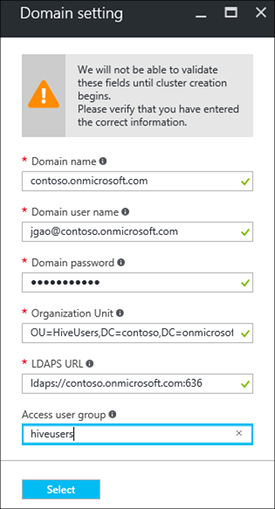

<properties
    pageTitle="Domänenverbund HDInsight Cluster konfigurieren | Microsoft Azure"
    description="Informationen Sie zum Einrichten und Konfigurieren von Domänenverbund HDInsight Cluster"
    services="hdinsight"
    documentationCenter=""
    authors="saurinsh"
    manager="jhubbard"
    editor="cgronlun"
    tags=""/>

<tags
    ms.service="hdinsight"
    ms.devlang="na"
    ms.topic="article"
    ms.tgt_pltfrm="na"
    ms.workload="big-data"
    ms.date="10/26/2016"
    ms.author="saurinsh"/>

# Konfigurieren Sie die Domäne HDInsight Cluster (Preview)

Informationen Sie zum Einrichten eines Azure HDInsight Clusters mit Azure Active Directory (Azure AD) und [Apache Ranger](http://hortonworks.com/apache/ranger/) strenge Authentifizierung und Richtlinien zur Kontrolle (RBAC) Rich-rollenbasierte Access nutzen.  Domänenverbund HDInsight kann nur auf Linux-basierten Cluster konfiguriert werden. Weitere Informationen finden Sie unter [HDInsight vorstellen Domänenverbund Cluster](hdinsight-domain-joined-introduction.md).

In diesem Artikel wird das erste Lernprogramm aus einer Reihe:

- Erstellen eines verbundenen Azure AD (über die Funktion Azure Directory-Domänendienste) HDInsight Clusters mit Apache Ranger aktiviert.
- Erstellen und Anwenden von Struktur Richtlinien durch Apache Ranger und Benutzerberechtigungen (z. B. Daten Wissenschaftler) zum Herstellen einer Verbindung mithilfe von ODBC-basierten Tools, beispielsweise Excel usw. Tableaus Struktur mit. Microsoft arbeitet derzeit auf HDInsight Domänenverbund bald aufgrund der Ergebnisse, z. B. HBase, Spark und Storm, hinzu.

Ein Beispiel für die endgültige Suchtopologie sieht wie folgt aus:

Da aktuell Azure AD unterstützt nur klassische virtuelle Netzwerke (VNets) und HDInsight Linux-basierten Cluster nur Support Ressourcenmanager Azure-basierte VNets, HDInsight Azure AD-Integration erfordert zwei VNets und eine peering dazwischen. Die Vergleichsinformationen zwischen den beiden Modellen finden Sie unter [Azure Ressourcenmanager im Vergleich zu klassischen Bereitstellung: verstehen Bereitstellungsmodelle und den Status Ihrer Ressourcen](../resource-manager-deployment-model.md). Die zwei VNets müssen sich in derselben Region als Azure AD DS.

Azure Service muss global eindeutig sein. Die folgenden Namen werden in diesem Lernprogramm verwendet. Contoso ist ein fiktives Name. Sie müssen mit einem anderen Namen *"Contoso"* ersetzen, wenn Sie das Lernprogramm durchgehen. 
    
**Namen:**

|Eigenschaft|Wert|
|--------|-----|
| Azure AD-VNet|contosoaadvnet|
| Azure AD-virtuellen Computern (virtueller Computer)|Contosoaadadmin. Diesem virtuellen Computer wird verwendet, um Organisationseinheit konfigurieren und reverse-DNS-Zone.|
| Azure AD-Verzeichnis|contosoaaddirectory|
| Azure AD-Domänennamen|Contoso (contoso.onmicrosoft.com)|
| HDInsight VNet|contosohdivnet|
| HDInsight VNet Ressourcengruppe|contosohdirg|
| HDInsight cluster|contosohdicluster|

In diesem Lernprogramm enthält die Schritte zum Konfigurieren eines Domäne HDInsight Clusters an. Jeder Abschnitt enthält Links zu anderen Artikeln mit Weitere Hintergrundinformationen.

## Voraussetzung:

- Vertrautmachen Sie mit [Azure Active Directory-Domänendiensten](https://azure.microsoft.com/services/active-directory-ds/) deren Struktur [Preise](https://azure.microsoft.com/pricing/details/active-directory-ds/) .
- Stellen Sie sicher, dass Ihr Abonnement für diese public Preview-Version auf der weißen Liste ist. Sie können dazu per e-Mail an hdipreview@microsoft.com mit Ihrem Abonnement-ID an.
- Ein SSL-Zertifikat, das von einer Zertifizierungsstelle signierenden für Ihre Domäne angemeldet ist. Das Zertifikat ist erforderlich, nach sicheres LDAP konfigurieren. Selbstsignierte Zertifikaten können nicht verwendet werden.

## Verfahren

1. Erstellen einer Azure klassischen VNet für Ihre Azure Anzeige an.  
2. Erstellen und Konfigurieren von Azure AD- und Azure AD DS.
3. Hinzufügen eines virtuellen Computers in der klassischen VNet für Organisationseinheit erstellen. 
4. Erstellen einer Organisationseinheit für Azure AD DS.
5. Erstellen einer HDInsight VNet im Modus Management Azure Ressource an.
6. Einrichten von Reverse-DNS-Zonen für die Azure AD DS.
6. Peer der beiden VNets.
7. Erstellen eines HDInsight Clusters an.

> [AZURE.NOTE] In diesem Lernprogramm wird davon ausgegangen, dass Sie nicht über eine Azure AD verfügen. Wenn Sie eine haben, können Sie den Teil in Schritt 2 überspringen.
    
## Erstellen einer Azure klassischen VNet

In diesem Abschnitt erstellen Sie eine klassische VNet über das Azure-Portal an. Im nächsten Abschnitt aktivieren Sie das Azure AD DS für Ihre Azure Anzeige in der klassischen VNet aus. Weitere Informationen über das folgende Verfahren und verwenden andere Methoden zur Erstellung VNet finden Sie unter [Erstellen eines virtuellen Netzwerks mithilfe des Azure-Portals (klassische)](../virtual-network/virtual-networks-create-vnet-classic-portal.md).

**So erstellen eine klassische VNet**

1. Melden Sie sich auf der [Azure-Portal](https://portal.azure.com)an. 
2. Klicken Sie auf **neue** > **Networking** > **virtuelles Netzwerk**.
3. Unter **Wählen Sie ein Bereitstellungsmodell** **klassischen**wählen Sie aus, und klicken Sie dann auf **Erstellen**.
4. Geben Sie ein, oder wählen Sie die folgenden Werte aus:

    - **Name**: Contosoaadvnet
    - **Adressbereichs**: 10.1.0.0/16
    - **Subnetnamen**: Subnet1
    - **Subnetzadressbereichs**: 10.1.0.0/24
    - **Abonnements**: (Wählen Sie ein Abonnement für das Erstellen dieses VNet verwendet).
    - **ResourceGroup**:
    - **Standort**: (Wählen Sie einen Bereich für Ihren Cluster HDInsight.)

        > [AZURE.IMPORTANT] Sie müssen einen Speicherort auswählen, die, der Azure AD DS unterstützt. Weitere Informationen finden Sie unter [Produkte nach Region verfügbar](https://azure.microsoft.com/en-us/regions/services/). 
        >
        > Sowohl in der klassischen VNet der Ressource Gruppe VNet muss sich in derselben Region als Azure AD DS.

5. Klicken Sie auf **Erstellen** , um die VNet zu erstellen.

## Erstellen und Konfigurieren von Azure AD DS für Ihre Azure-Anzeige

In diesem Abschnitt werden Sie folgende Aufgaben ausführen:

1. Erstellen einer Azure AD an.
2. Erstellen von Azure Active Directory-Benutzer. Diese Benutzer sind Domänen-Benutzer. Verwenden Sie den ersten Benutzer zum Konfigurieren des HDInsight Clusters mit Azure AD.  Die anderen zwei Benutzer sind in diesem Lernprogramm optional. Sie werden in die [Struktur Konfigurieren von Richtlinien für Domänenverbund HDInsight Cluster](hdinsight-domain-joined-run-hive.md) verwendet werden, wenn Sie Apache Ranger Richtlinien konfigurieren.
3. Erstellen Sie der AAD DC Administratorgruppe und fügen Sie den Azure AD-Benutzer zur Gruppe hinzu. Verwenden Sie diesen Benutzer, um die Organisationseinheit zu erstellen.
4. Aktivieren Sie Azure AD-Domänendienste (Azure AD DS) für die Anzeige Azure.
7. Konfigurieren von LDAPS für Azure AD. Lightweight Directory Access Protocol (LDAP) wird zum Lesen und Schreiben in Azure AD verwendet.

Wenn Sie eine vorhandene Azure AD verwenden möchten, können Sie die Schritte 1 und 2 überspringen.

**So erstellen Sie eine Azure-Anzeige**

1. Aus dem [Azure klassischen Portal](https://manage.windowsazure.com), klicken Sie auf **neu** > **App Services** > **Active Directory** > **Verzeichnis** > **Benutzerdefinierte erstellen**. 
3. Geben Sie ein, oder wählen Sie die folgenden Werte aus:

    - **Name**: Contosoaaddirectory
    - **Domänenname**: "Contoso".  Dieser Name muss global eindeutig sein.
    - **Land oder Region**: Wählen Sie aus Ihrem Land / Ihrer Region.
4. Klicken Sie auf **abgeschlossen**.

**Erstellen Sie einen Azure AD-Benutzer**

1. Klicken Sie auf **Active Directory**, den [Azure klassischen Portal](https://manage.windowsazure.com) -> **Contosoaaddirectory**. 
3. Klicken Sie im oberen Menü auf **Benutzer** .
4. Klicken Sie auf **Benutzer hinzufügen**.
4. Geben Sie **Benutzernamen ein**, und klicken Sie dann auf **Weiter**. 
5. Konfigurieren von Benutzerprofilen; Wählen Sie unter **Rolle** **Globaler Administrator**; ein, und klicken Sie dann auf **Weiter**.  Die Rolle des globalen Administrators ist erforderlich, um die Organisations-Einheiten zu erstellen.
6. Klicken Sie auf **Erstellen** , um ein temporäres Kennwort zu erhalten.
7. Erstellen Sie eine Kopie des Kennworts, und klicken Sie dann auf **abgeschlossen**. Weiter unten in diesem Lernprogramm verwenden Sie diesen Benutzer globaler Administrator anmelden auf der Administrator virtueller Computer für eine Organisationseinheit erstellen und Konfigurieren von reverse-DNS.

Befolgen Sie dasselbe Verfahren zum Erstellen von zwei weitere Benutzer mit der Rolle **Benutzer** , hiveuser1 und hiveuser2. Die folgenden Benutzer werden in [Struktur Konfigurieren von Richtlinien für Domänenverbund HDInsight Cluster](hdinsight-domain-joined-run-hive.md)verwendet werden.

**Um die AAD DC Administratoren Gruppe erstellen, und fügen einen Azure AD-Benutzer**

1. Klicken Sie auf **Active Directory**, den [Azure klassischen Portal](https://manage.windowsazure.com) > **Contosoaaddirectory**. 
3. Klicken Sie im oberen Menü auf **Gruppen** .
4. Klicken Sie auf **eine Gruppe hinzufügen** oder **Gruppe hinzufügen**.
5. Geben Sie ein, oder wählen Sie die folgenden Werte aus:

    - **Name**: AAD DC Administratoren.  Ändern Sie nicht den Gruppennamen ein.
    - **Gruppentyp**: Sicherheit.
6. Klicken Sie auf **abgeschlossen**.
7. Klicken Sie auf **AAD DC Administratoren** , um die Gruppe zu öffnen.
8. Klicken Sie auf **Mitglieder hinzufügen**.
9. Wählen Sie den ersten Benutzer, die, den Sie im vorherigen Schritt erstellt haben, und klicken Sie dann auf **abgeschlossen**.
10. Wiederholen Sie diese Schritte zum Erstellen einer anderen Gruppe mit der Bezeichnung **HiveUsers**, und fügen Sie die beiden Struktur Benutzer zur Gruppe hinzu.

Weitere Informationen finden Sie unter [Azure Active Directory-Domänendiensten (Preview) – erstellen Sie die Gruppe ' AAD DC Administratoren '](../active-directory-domain-services/active-directory-ds-getting-started.md).

**So aktivieren Sie Azure AD DS für Ihre Azure-Anzeige**

1. Klicken Sie auf **Active Directory**, den [Azure klassischen Portal](https://manage.windowsazure.com) > **Contosoaaddirectory**. 
3. Klicken Sie im oberen Menü auf **Konfigurieren** .
4. Führen Sie einen Bildlauf nach unten bis **-Domänendiensten**, und legen Sie die folgenden Werte:

    - **Aktivieren Sie dieses Verzeichnis-Domänendienste**: Ja.
    - **DNS-Domänennamen des Domänendiensten**: Zeigt den DNS-Standardnamen Azure Verzeichnis. Beispielsweise contoso.onmicrosoft.com.
    - **In diesem virtuellen Netzwerk-Domänendienste verbinden**: Wählen Sie das klassische virtuelle Netzwerk, die Sie zuvor erstellt haben, d. h. **Contosoaadvnet**.
    
6. Klicken Sie auf vom unteren Rand der Seite **zu speichern** . Sehen Sie **Ausstehend...** neben **Domänendiensten für dieses Verzeichnis aktivieren**.  
7. Warten Sie, bis **steht noch aus...** ausgeblendet wird, und die **IP-Adresse** gefüllt wird. Zwei IP-Adressen werden aufgefüllt abrufen. Hierbei handelt es sich um die IP-Adressen der Domänencontroller nach der Bereitstellung von Domänendiensten. Jede IP-Adresse werden angezeigt, nachdem der entsprechende Domänencontroller bereitgestellte und bereit ist. Notieren Sie sich die beiden IP-Adressen ein. Sie werden diese später benötigen.

Weitere Informationen finden Sie unter [Azure Active Directory-Domänendiensten (Preview) – aktivieren Azure Active Directory-Domänendiensten](../active-directory-domain-services/active-directory-ds-getting-started-enableaadds.md).

**Kennwort für die Synchronisierung**

Wenn Sie eine eigene Domäne verwenden, müssen Sie das Kennwort zu synchronisieren. Finden Sie unter [Aktivieren Sie die Synchronisierung von Kennwörtern nach Azure AD-Domänendienste für eine Cloud nur Azure AD-Verzeichnis](../active-directory-domain-services/active-directory-ds-getting-started-password-sync.md).

**So konfigurieren Sie LDAPS für Azure AD**

1. Abrufen eines SSL-Zertifikat, das von einer Zertifizierungsstelle signierenden für Ihre Domäne angemeldet ist. Selbstsignierte Zertifikaten können nicht verwendet werden. Wenn Sie ein Zertifikat einer Zertifizierungsstelle erreicht werden kann, wenden Sie sich bitte zu erreichen hdipreview@microsoft.com für eine Ausnahme.
1. Klicken Sie auf **Active Directory**, den [Azure klassischen Portal](https://manage.windowsazure.com) > **Contosoaaddirectory**. 
3. Klicken Sie im oberen Menü auf **Konfigurieren** .
4. Führen Sie einen Bildlauf zum **Domänendiensten**.
5. Klicken Sie auf **Konfigurieren**.
6. Führen Sie die Anweisung geben Sie die Zertifikatsdatei und das Kennwort ein. Sehen Sie **Ausstehend...** neben **Domänendiensten für dieses Verzeichnis aktivieren**.  
7. Warten Sie, bis **Ausstehend...** nicht mehr angezeigt wird, und **LDAP-Zertifikat Secure** ausgefüllt haben.  Dies kann von mindestens 10 Minuten dauern.
 
>[AZURE.NOTE] Wenn einige Hintergrundaufgaben auf Azure AD DS ausgeführt werden, wird einen Fehler beim Upload Zertifikat angezeigt – <i>Es ist ein Vorgang, der für dieses Mandanten durchgeführt. Versuchen Sie es später</i>.  Für den Fall, dass Ihnen dieser Fehler auftritt, versuchen Sie es später erneut. Die zweite Domänencontroller IP-Adresse kann nach der Bereitstellung werden bis zu 3 Stunden dauern.

Weitere Informationen finden Sie unter [Konfigurieren von Secure LDAP (LDAPS) für eine Domäne Azure Active Directory-Domänendiensten verwaltet](../active-directory-domain-services/active-directory-ds-admin-guide-configure-secure-ldap.md).

## Konfigurieren einer Organisationseinheit und reverse-DNS-Einträge

In diesem Abschnitt hinzufügen ein virtuellen Computers zu den Azure AD-VNet und Verwaltung dieses virtuellen Computers zu installieren, damit Sie können eine Organisationseinheit konfigurieren und reverse-DNS-Einträge. Umgekehrte DNS-Suche ist für Kerberos-Authentifizierung erforderlich.

**Zum Erstellen eines virtuellen Computers in das virtuelle Netzwerk**

1. Aus dem [Azure klassischen Portal](https://manage.windowsazure.com), klicken Sie auf **neu** > **berechnen** > **virtuellen Computers** > **-Katalog aus**.
3. Wählen Sie ein Bild aus, und klicken Sie dann auf **Weiter**.  Wählen Sie **Windows Server 2012 R2 Datacenter**standardmäßig, wenn Sie nicht wissen welches Programm Sie einsetzen.
4. Geben Sie ein, oder wählen Sie die folgenden Werte aus:

    - Der Name des virtuellen Computers: **contosoaadadmin**
    - Ebene: **grundlegende**
    - Name des neuen Benutzers: (Geben Sie einen Benutzernamen)
    - Kennwort: (Geben Sie ein Kennwort ein)
    
    Bitte beachten Sie den Benutzernamen und das Kennwort ist die lokale Administrator.
    
5. Klicken Sie auf **Weiter**
6. Wählen Sie in der **Region/virtuellen Netzwerk**das neue virtuelle Netzwerk, die, das Sie im letzten Schritt (Contosoaadvnet) erstellt haben, und klicken Sie dann auf **Weiter**.
7. Klicken Sie auf **abgeschlossen**.

**Um zu den virtuellen Computer RDP**

1. Klicken Sie auf **virtuellen Computern**, die [Azure klassischen Portal](https://manage.windowsazure.com) > **Contosoaadadmin**.
3. Klicken Sie im oberen Menü auf **Dashboard** .
4. Klicken Sie auf **Verbinden** vom unteren Rand der Seite.
5. Führen Sie die Anweisung und die Verbindung verwenden Sie der lokalen Administrator-Benutzernamen und Ihr Kennwort.

**Virtueller Computer die Azure AD-Domäne hinzufügen**

1. Klicken Sie von der RDP-Sitzung auf **Start**, und klicken Sie dann auf **Server-Manager**.
2. Klicken Sie im Menü links auf **Lokale Server** .
3. Klicken Sie von Arbeitsgruppe auf " **Arbeitsgruppe**".
4. Klicken Sie auf **Ändern**.
5. Klicken Sie auf **Domäne**, geben Sie **contoso.onmicrosoft.com**, und klicken Sie dann auf **OK**.
6. Geben Sie die Anmeldeinformationen des Benutzers ein, und klicken Sie dann auf **OK**.
7. Klicken Sie auf **OK**.
8. Klicken Sie auf **OK** , um zu einem Neustart des Computers stimmen.
9. Klicken Sie auf **Schließen**.
10. Klicken Sie auf **jetzt neu starten**.

Weitere Informationen finden Sie unter [Teilnehmen an einer Windows Server virtuellen Computers zu einer verwalteten Domäne](../active-directory-domain-services/active-directory-ds-admin-guide-join-windows-vm.md).

**So installieren Sie Active Directory-Verwaltungstools und DNS-tools**

1. RDP in **Contosoaadadmin** mit dem Azure AD-Benutzerkonto.
2. Klicken Sie auf **Start**, und klicken Sie dann auf **Server-Manager**.
3. Klicken Sie im Menü links auf **Dashboard** .
4. Klicken Sie auf **Verwalten**, und klicken Sie dann auf **Add Rollen und Features**.
5. Klicken Sie auf **Weiter**.
6. Wählen Sie **rollenbasierte oder featurebasierten Installation**, und klicken Sie dann auf **Weiter**.
7. Wählen Sie aus dem Serverpool des aktuellen virtuellen Computers aus, und klicken Sie auf **Weiter**.
8. Klicken Sie auf **Weiter** , um zu Rollen überspringen.
9. Erweitern Sie **Remoteserver-Verwaltungstools**, erweitern Sie **Rollenverwaltungstools**, wählen Sie **AD DS und AD LDS Tools** und **DNS-Server-Tools**und klicken Sie dann auf **Weiter**. 
10. Klicken Sie auf **Weiter**
10. Klicken Sie auf **Installieren**.

Weitere Informationen finden Sie unter [Installieren von Active Directory-Verwaltungstools des virtuellen Computers](../active-directory-domain-services/active-directory-ds-admin-guide-administer-domain.md#task-2---install-active-directory-administration-tools-on-the-virtual-machine).

**So konfigurieren Sie reverse-DNS-**

1. RDP zu Contosoaadadmin mit dem Azure AD-Benutzerkonto.
2. Klicken Sie auf **Start**, klicken Sie auf **Verwaltung**, und klicken Sie dann auf **DNS**. 
3. Klicken Sie auf **Nein** , um ContosoAADAdmin hinzufügen zu überspringen.
4. Wählen Sie **die folgenden Computer**aus, geben Sie die IP-Adresse des ersten DNS-Servers, die zuvor konfiguriert wurde, und klicken Sie dann auf **OK**.  So finden Sie unter, dass die DC/DNS im linken Bereich hinzugefügt wird.
3. Erweitern Sie den DC/DNS-Server, mit der rechten Maustaste **Reverse-Lookupzonen**, und klicken Sie dann auf **Neue Zone**. Assistent zum Erstellen neuer Zonen wird geöffnet.
4. Klicken Sie auf **Weiter**.
5. Wählen Sie die **primäre Zone**, und klicken Sie dann auf **Weiter**.
6. Wählen Sie **alle DNS-Server ausgeführt wird, klicken Sie auf Domänencontroller in dieser Domäne**aus, und klicken Sie dann auf **Weiter**.
6. Wählen Sie **IPv4 Reverse Lookup Zone**, und klicken Sie dann auf **Weiter**.
7. Geben Sie das Präfix für den HDInsight VNET Netzwerk-Bereich im **Netzwerk-ID**und klicken Sie dann auf **Weiter**. Sie erstellen die folgenden Abschnitte enthalten die HDInsight VNet.
8. Klicken Sie auf **Weiter**.
9. Klicken Sie auf **Weiter**.
10. Klicken Sie auf **Fertig stellen**.

Die Name der Organisationseinheit, die Sie erstellen, wird beim Erstellen des HDInsight Clusters weiter verwendet. Hadoop System-Benutzer und Computerkonten werden in dieser Organisationseinheit platziert.

**Erstellen einer Organisationseinheit (OU) auf eine Azure-Active Directory-Domänendiensten verwalteten Domäne**

1. RDP in **Contosoaadadmin** mit dem Domänenkonto ist, die in der Gruppe **AAD DC Administratoren** .
2. Klicken Sie auf **Start**, klicken Sie auf **Verwaltung**, und klicken Sie dann auf **Active Directory Administrative Center**.
5. Klicken Sie auf den Domänennamen im linken Bereich. Beispielsweise "Contoso".
6. Klicken Sie unter dem Domänennamen im **Aufgabenbereich** auf **neu** , und klicken Sie dann auf **Organisationseinheit**.
7. Geben Sie einen Namen ein, beispielsweise **HDInsightOU**, und klicken Sie dann auf **OK**. 

Weitere Informationen finden Sie unter [Erstellen einer Organisationseinheit (OU) auf eine Domäne Azure Active Directory-Domänendiensten verwaltet](../active-directory-domain-services/active-directory-ds-admin-guide-create-ou.md).

## Erstellen einer VNet Ressourcenmanager für HDInsight cluster

In diesem Abschnitt erstellen Sie eine Azure Ressourcenmanager VNet, die für den Cluster HDInsight verwendet werden. Weitere Informationen zum Erstellen von Azure VNET mit anderen Methoden finden Sie unter [Erstellen eines virtuellen Netzwerks](../virtual-network/virtual-networks-create-vnet-arm-pportal.md)

Nach dem Erstellen der VNet, konfigurieren Sie die Ressourcenmanager VNet verwenden der gleichen DNS-Server wie für die Azure AD-VNet. Wenn Sie die Schritte in diesem Lernprogramm der klassischen VNet und Azure AD-erstellen, werden die DNS-Server 10.1.0.4 und 10.1.0.5.

**So erstellen eine VNet Ressourcenmanager**

1. Melden Sie sich auf der [Azure-Portal](https://portal.azure.com)an.
2. Klicken Sie auf **neu**, **Netzwerk**, und klicken Sie dann **virtuellen Netzwerk**. 
3. Wählen Sie im **Bereitstellungsmodell auswählen** **Ressourcenmanager**aus, und klicken Sie dann auf **Erstellen**.
4. Geben Sie ein, oder wählen Sie die folgenden Werte aus:

    - **Name**: Contosohdivnet
    - **Adressbereichs**: 10.2.0.0/16. Sicherstellen Sie, dass der Bereich mit den IP-Adresse Zellbereich der klassischen VNet überlappen kann.
    - **Subnetnamen**: Subnet1
    - **Subnetzadressbereichs**: 10.2.0.0/24
    - **Abonnements**: (Wählen Sie Ihr Abonnement Azure ein.)
    - **Ressourcengruppe**: Contosohdirg
    - **Standort**: (Wählen Sie am selben Speicherort wie die Azure AD VNet, d. h. Contosoaadvnet.)

5. Klicken Sie auf **Erstellen**.

**Zum Konfigurieren von DNS für die VNet Ressourcenmanager**

1. Aus dem [Azure-Portal](https://portal.azure.com), klicken Sie auf **Weitere Dienste** -> **virtuellen Netzwerken**. Vergewissern Sie sich nicht um **virtuelle Netzwerke (klassische)**klicken.
2. Klicken Sie auf **Contosohdivnet**.
4. Klicken Sie auf **DNS-Server** von der linken Seite des neuen Blades.
6. Klicken Sie auf **Benutzerdefiniert**, und geben Sie die folgenden Werte:

    - 10.1.0.4
    - 10.1.0.5

    Diese IP-Adressen von DNS-Server müssen der DNS-Server in der Azure AD-VNet (klassische VNet) übereinstimmen.
7. Klicken Sie auf **Speichern**.

## Peer der Azure AD-VNet und die HDInsight VNet

**Um die zwei VNet peer**

1. Melden Sie sich auf der [Azure-Portal](https://portal.azure.com)an.
2. Klicken Sie im Menü links auf **Weitere Dienste** .
3. Klicken Sie auf **virtuelle Netzwerke**. Klicken Sie nicht **virtuelle Netzwerke (klassische)**aus.
4. Klicken Sie auf **Contosohdivnet**.  Hierbei handelt es sich um die HDInsight VNet.
5. Klicken Sie im Menü links des Blades auf **Peerings** .
6. Klicken Sie im oberen Menü auf **Hinzufügen** . Das Blade **peering hinzufügen** geöffnet wird.
7. Klicken Sie auf das Blade **peering hinzufügen** festlegen Sie, oder wählen Sie die folgenden Werte aus:

    - **Name**: ContosoAADHDIVNetPeering
    - **Modell zur Bereitstellung von virtuellen Netzwerk**: Klassisch
    - **Abonnements**: Wählen Sie den Namen Ihres Abonnements für die Vnet klassischen (Azure AD) verwendet.
    - **Virtuellen Netzwerk**: Contosoaadvnet.
    - **Virtuelle Netzwerkzugriff zulassen**: (Kontrollkästchen)
    - **Zulassen weitergeleitet Datenverkehr**: (Kontrollkästchen). Lassen Sie die anderen zwei Kontrollkästchen deaktiviert.

8. Klicken Sie auf **OK**.

## Erstellen von HDInsight cluster

In diesem Abschnitt erstellen Sie einen Linux-basierten Hadoop Cluster in HDInsight mit dem Azure-Portal oder [Ressourcenmanager Azure-Vorlage](../resource-group-template-deploy.md)aus. Andere Methoden zur Erstellung und das Verständnis die Einstellungen, finden Sie unter [Erstellen HDInsight Cluster](hdinsight-hadoop-provision-linux-clusters.md). Weitere Informationen zur Verwendung von Ressourcenmanager Vorlage Hadoop Cluster in HDInsight zu erstellen finden Sie unter [Erstellen von Hadoop Cluster in HDInsight mithilfe von Vorlagen für Ressourcenmanager](hdinsight-hadoop-create-windows-clusters-arm-templates.md)

**So erstellen Sie einen Domäne HDInsight Cluster über das Azure-portal**

1. Melden Sie sich auf der [Azure-Portal](https://portal.azure.com)an.
2. Klicken Sie auf **neu**, **Intelligence + Analytics**, und klicken Sie dann **HDInsight**.
3. Geben Sie aus dem **neuen HDInsight Cluster** Blade ein, oder wählen Sie die folgenden Werte aus:

    - **Clustername**: Geben Sie einen neuen Clusternamen für die Domäne HDInsight Cluster.
    - **Abonnements**: Wählen Sie ein Azure-Abonnement für das Erstellen von diesem Cluster verwendet.
    - **Cluster-Konfiguration**:

        - **Clustertyp**: Hadoop. HDInsight Domäne gibt es zurzeit nur auf unterstützten Hadoop Cluster.
        - **Betriebssystem**: Linux.  HDInsight Domäne wird nur auf HDInsight Linux-basierten Cluster unterstützt.
        - **Version**: Hadoop 2.7.3 (HDI 3.5). HDInsight Domäne wird nur auf HDInsight Clusterversion 3.5 unterstützt.
        - **Clustertyp**: PREMIUM

        Klicken Sie auf **auswählen** , um die Änderungen zu speichern.

    - **Anmeldeinformationen**: konfigurieren die Anmeldeinformationen für den Benutzer Cluster und der Benutzer SSH.
    - **Datenquelle**: Erstellen einer neuen Speicher Firma oder ein vorhandenes Speicher-Kontos als Standardkonto Speicherplatz für den Cluster HDInsight verwenden. Die Position muss die zwei VNets entspricht.  Der Speicherort ist auch die Position des HDInsight Cluster.
    - **Preise**: Wählen Sie die Anzahl der Worker-Knoten im Cluster aus.
    - **Erweiterte Konfigurationen**: 

        - **Teilnehmen an einer Domäne & Vnet/Subnetz**: 

            - **Domäne Einstellungen**: 

                - **Domänenname**: contoso.onmicrosoft.com
                - **Domänenbenutzername**: Geben Sie einen Domäne Benutzernamen ein. Dieser Domäne müssen die folgenden Rechte: Teilnehmen an Computern zu der Domäne, und platzieren sie in der aktuellen Organisationseinheit, die Sie zuvor; konfiguriert Erstellen Sie Service Hauptbenutzer innerhalb der Organisation Maßeinheit, die zuvor konfiguriert wurde. Reverse-DNS-Einträge zu erstellen. Dieser Domänenbenutzer wird dem Administrator des dieser Domäne HDInsight Cluster werden.
                - **Domänenkennwort**: Geben Sie das Domäne Benutzerkennwort ein.
                - **Organisationseinheit**: Geben Sie den definierten Namen des der Organisationseinheit Verknüpfung, die Sie zuvor konfiguriert. Beispiel: Organisationseinheit = HDInsightOU, DC = Contoso, DC = Onmicrosoft, DC = com
                - **LDAPS URL**: Ldaps://contoso.onmicrosoft.com:636
                - **Access-Benutzergruppe**: Geben Sie die Sicherheitsgruppe aus, dessen Sie für die Synchronisierung mit dem Cluster WAN-Benutzer. Beispielsweise HiveUsers.

                Klicken Sie auf **auswählen** , um die Änderungen zu speichern.

                
            - **Virtuelle Netzwerk**: Contosohdivnet
            - **Subnetz**: Subnet1

            Klicken Sie auf **auswählen** , um die Änderungen zu speichern.       
        Klicken Sie auf **auswählen** , um die Änderungen zu speichern.
    - **Ressourcengruppe**: Wählen Sie die Ressourcengruppe aus, für die HDInsight VNet (Contosohdirg) verwendet.

4. Klicken Sie auf **Erstellen**.  

Eine weitere Möglichkeit zum Erstellen von HDInsight Domänenverbund Cluster besteht darin, Azure Ressourcenverwaltung Vorlage verwenden. Im folgende Verfahren wird gezeigt, wie:

**So erstellen Sie einen Domäne HDInsight Cluster mithilfe einer Vorlage Ressourcenverwaltung**

1. Klicken Sie auf die folgende Abbildung, um eine Vorlage Ressourcenmanager Azure-Portal zu öffnen. Die Vorlage Ressourcenmanager befindet sich in einem öffentlichen Blob-Container. 

    

2. Geben Sie die folgenden Werte aus dem **Parameter** Blade:

    - **Abonnements**: (Wählen Sie Ihr Abonnement Azure).
    - **Ressourcengruppe**: Klicken Sie auf **vorhandene verwenden**möchten, und geben Sie an der gleichen Ressourcengruppe Sie verwendet wurde haben.  Beispielsweise Contosohdirg. 
    - **Standort**: Geben Sie einen Speicherort der Ressource Gruppe.
    - **Cluster Name**: Geben Sie einen Namen für den Hadoop Cluster, die Sie erstellen. Beispielsweise Contosohdicluster.
    - **Cluster Type**: Wählen Sie einen Clustertyp aus.  Der Standardwert ist **Hadoop**.
    - **Standort**: Wählen Sie einen Speicherort für den Cluster.  Das Standard-Speicher-Konto verwendet denselben Speicherort.
    - **Cluster Worker Knoten zählen**: Wählen Sie die Anzahl der Worker-Knoten aus.
    - **Cluster-Benutzernamen und Ihr Kennwort**: der Standard-Anmeldename ist **Admin**.
    - **SSH-Benutzernamen und Ihr Kennwort**: der Standard-Benutzername ist **Sshuser**.  Sie können ihn umbenennen. 
    - **Virtuelle Netzwerk-Id**: /subscriptions/&lt;SubscriptionID > /resourceGroups/&lt;ResourceGroupName > /providers/Microsoft.Network/virtualNetworks/&lt;VNetName >
    - **Virtuelle Netzwerk-Subnetz**: /subscriptions/&lt;SubscriptionID > /resourceGroups/&lt;ResourceGroupName > /providers/Microsoft.Network/virtualNetworks/&lt;VNetName >/Subnetze/Subnet1
    - **Domänenname**: contoso.onmicrosoft.com
    - **Organisation Einheit DN**: Organisationseinheit = HDInsightOU, DC = Contoso, DC = Onmicrosoft, DC = com
    - **Cluster Benutzer Gruppe D Ns**: "\"CN = HiveUsers, Organisationseinheit = AADDC Users, DC =<DomainName>, DC = Onmicrosoft, DC = com\""
    - **LDAPUrls**: ["Ldaps://contoso.onmicrosoft.com:636"]
    - **DomainAdminUserName**: (Geben Sie den Benutzernamen der Domäne Administrator)
    - **"DomainAdminPassword"**: (Geben Sie die Domäne Benutzer Administratorkennworts)
    - **Kann ich die allgemeinen Geschäftsbedingungen oben erwähnten stimmen**: (Kontrollkästchen)
    - **PIN zum Dashboard**: (Kontrollkästchen)

6. Klicken Sie auf **kaufen**. Es wird eine neue Kachel mit dem Titel **Vorlage bereitstellen Bereitstellung**angezeigt. Dauert es ungefähr ungefähr 20 Minuten, einen Cluster erstellen. Nachdem der Cluster erstellt wurde, können Sie vorher Cluster in das Portal, um ihn zu öffnen klicken.

Nachdem Sie das Lernprogramm abgeschlossen haben, sollten Sie den Cluster löschen. Mit HDInsight Ihre Daten in Azure-Speicher gespeichert, sodass Sie problemlos einen Cluster löschen können, wenn es nicht verwendet wird. Sie unterliegen auch nach einem HDInsight Cluster, auch wenn es nicht verwendet wird. Da die Gebühren für den Cluster oft mehr als die Gebühren für Speicher sind, ist es economic sinnvoll Cluster löschen, wenn er nicht verwendet werden. Den Anweisungen von einem Cluster löschen finden Sie unter [Verwalten von Hadoop Cluster in HDInsight mithilfe des Azure-Portals](hdinsight-administer-use-management-portal.md#delete-clusters).

## Nächste Schritte

- Konfigurieren von Richtlinien Struktur und Ausführen Struktur Abfragen, finden Sie unter [Struktur Konfigurieren von Richtlinien für Domänenverbund HDInsight Cluster](hdinsight-domain-joined-run-hive.md).
- Ausführung von Struktur Abfragen mithilfe von SSH auf Cluster Domänenverbund HDInsight finden Sie unter [Verwenden SSH mit Linux-basierten Hadoop auf HDInsight von Linux, Unix, oder OS X](hdinsight-hadoop-linux-use-ssh-unix.md#connect-to-a-domain-joined-hdinsight-cluster).
