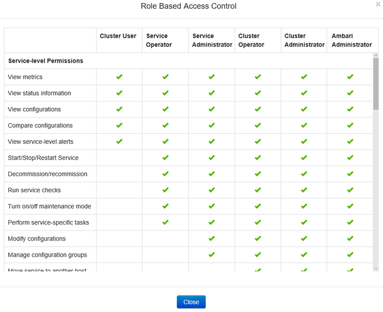
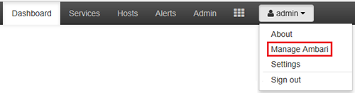
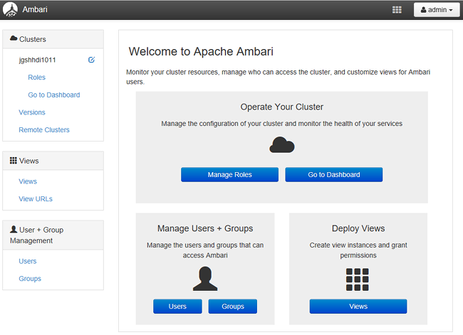
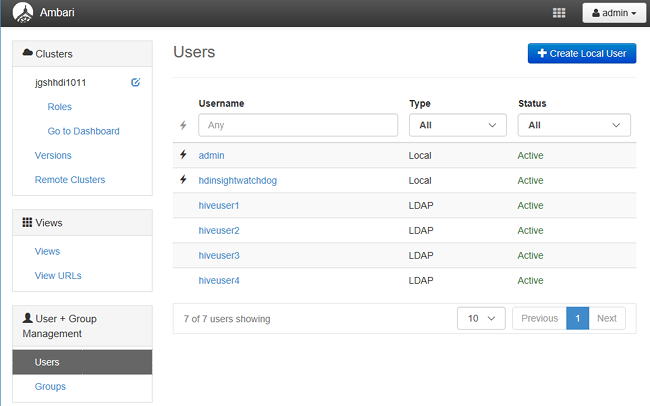
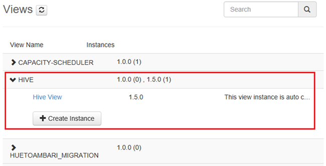
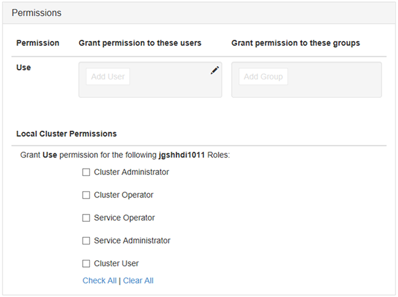

<properties
    pageTitle="Domänenverbund HDInsight Cluster verwalten | Microsoft Azure"
    description="Erfahren Sie, wie HDInsight Domänenverbund Cluster verwalten"
    services="hdinsight"
    documentationCenter=""
    authors="saurinsh"
    manager="jhubbard"
    editor="cgronlun"
    tags=""/>

<tags
    ms.service="hdinsight"
    ms.devlang="na"
    ms.topic="article"
    ms.tgt_pltfrm="na"
    ms.workload="big-data"
    ms.date="10/25/2016"
    ms.author="saurinsh"/>

# Verwalten von HDInsight Domänenverbund Cluster (Preview)

Erfahren Sie die Benutzer und die Rollen in Domänenverbund HDInsight und zum Verwalten von Domänenverbund HDInsight Cluster.

## Benutzer der Domäne HDInsight Cluster

Ein HDInsight Cluster, der nicht Domänenverbund weist zwei Benutzerkonten, die während der Clustererstellung erstellt werden:

- **Ambari Administrator**: dieses Konto ist auch bekannt als *Hadoop* oder *HTTP-Benutzer*. Dieses Konto kann verwendet werden, um bei https:// Ambari anmelden&lt;Clustername >. azurehdinsight.net. Sie können auch mit Ambari Ansichten Abfragen ausgeführt, führt Aufträge über externe Tools (d. h. PowerShell, Templeton, Visual Studio), und mit der Struktur ODBC-Treiber und BI-Tools (d. h. Excel, PowerBI oder Tableaus) authentifizieren verwendet werden.

- **SSH-Benutzer**: dieses Konto mit SSH verwendet werden kann, und führen Sie Sudo Befehle. Es hat Stamm-Berechtigungen mit den Linux virtuellen Computern.

Ein Domäne HDInsight Cluster verfügt über drei neue Benutzer zusätzlich Ambari Administrator und SSH Benutzer.

- **Ranger Administrator**: dieses Konto ist die lokale Apache Ranger Admin-Konto. Es ist nicht active Directory-Domänenbenutzer. Richtlinien für die Einrichtung und andere Benutzer Administratoren oder delegierten Administratoren (damit die Benutzer Richtlinien verwalten können), kann dieses Konto verwendet werden. Standardmäßig der Benutzername ist *Admin* und das Kennwort entspricht dem Kennwort für den Administrator Ambari. Das Kennwort kann von der Seite Einstellungen Ranger aktualisiert werden.

- **Cluster Administrator Domänenbenutzer**: dieses Konto ist ein active Directory-Domäne-Benutzer als Administrator Cluster Hadoop einschließlich Ambari und Ranger gekennzeichnet. Sie müssen die Anmeldeinformationen des Benutzers während der Clustererstellung angeben. Dieser Benutzer hat folgenden Berechtigungen:

    - Teilnehmen an Computern zu der Domäne, und setzen Sie sie in der Organisationseinheit, die Sie während der Clustererstellung angeben.
    - Erstellen Sie Service Hauptbenutzer innerhalb der Organisationseinheit, die Sie während der Clustererstellung angeben. 
    - Reverse-DNS-Einträge zu erstellen.

    Beachten Sie, dass die Active Directory-Benutzer auch diese Administratorrechte verfügen. 

    Es gibt einige Ihrer Endpunkte im Cluster (z. B. Templeton), die nicht von Ranger verwaltet werden, und daher sind nicht sicher. Diese Endpunkte sind für alle Benutzer mit Ausnahme der Cluster Administrator Domänenbenutzer gesperrt. 

- **Normale**: während der Cluster erstellen, können Sie mehrere active Directory-Gruppen angeben. Die Benutzer in diesen Gruppen werden Ranger und Ambari synchronisiert werden. Diese Benutzer Domänen-Benutzer sind und haben Zugriff auf nur Ranger verwaltete Endpunkte (z. B. Hiveserver2). Alle RBAC Richtlinien und ü wird für diesen Benutzer verfügbar sein.

## Rollen der Domäne HDInsight Cluster

Domänenverbund HDInsight stehen die folgenden Rollen:

- Cluster-Administrator
- Cluster-Operator
- Dienstadministrator
- Service-Operator
- Cluster-Benutzer

**Um die Berechtigungen der ausführenden anzuzeigen.**

1. Öffnen Sie die Ambari Management UI.  [Öffnen Sie die Ambari Management UI](#open-the-ambari-management-ui)finden Sie unter.
2. Klicken Sie im Menü links auf **Rollen**.
3. Klicken Sie auf das blaue Fragezeichen klicken, um die Berechtigungen finden Sie unter:

    

## Öffnen Sie die Ambari Management-Benutzeroberfläche

1. Melden Sie sich auf der [Azure-Portal](https://portal.azure.com)an.
2. Öffnen Sie Ihren Cluster HDInsight in einem Blade aus. Finden Sie unter [Liste und anzeigen Cluster](hdinsight-administer-use-management-portal.md#list-and-show-clusters).
3. Klicken Sie im oberen Menü Ambari öffnen auf **Dashboard** .
4. Melden Sie sich bei Ambari Cluster Administrator Domänenbenutzername und Kennwort verwenden.
5. Klicken Sie auf das Dropdownmenü **Administrator** in der oberen rechten Ecke, und klicken Sie dann auf **Ambari verwalten**.

    

    Die Benutzeroberfläche sieht wie folgt aus:

    

## Liste der Domänen-Benutzer aus Ihrer Active Directory synchronisiert

1. Öffnen Sie die Ambari Management UI.  [Öffnen Sie die Ambari Management UI](#open-the-ambari-management-ui)finden Sie unter.
2. Klicken Sie auf **Benutzer**, wählen Sie im Menü links. So finden Sie unter alle Benutzer, die auf dem HDInsight Cluster aus Ihrer Active Directory synchronisiert.

    

## Liste der Gruppen der Domäne aus Ihrer Active Directory synchronisiert

1. Öffnen Sie die Ambari Management UI.  [Öffnen Sie die Ambari Management UI](#open-the-ambari-management-ui)finden Sie unter.
2. Klicken Sie im Menü links auf **Gruppen**. So finden Sie unter alle Gruppen auf HDInsight Cluster aus Ihrer Active Directory synchronisiert.

    

## Konfigurieren von Ansichten Struktur Berechtigungen

1. Öffnen Sie die Ambari Management UI.  [Öffnen Sie die Ambari Management UI](#open-the-ambari-management-ui)finden Sie unter.
2. Klicken Sie im Menü links auf **Ansichten**.
3. Klicken Sie auf die **Struktur** , um die Details anzuzeigen.

    

4. Klicken Sie auf den Hyperlink der **Ansicht Struktur** um Struktur Ansichten zu konfigurieren.
5. Führen Sie einen Bildlauf nach unten bis zum Abschnitt **Berechtigungen** .

    

6. Klicken Sie auf **Benutzer hinzufügen** oder **Gruppe hinzufügen**, und geben Sie dann die Benutzer oder Gruppen, die Struktur Ansichten verwenden können. 

## Konfigurieren von Benutzern für die Rollen

 Eine Liste der Rollen und seine Berechtigungen finden Sie unter [Cluster HDInsight Rollen der Domäne](#roles-of-domain---joined-hdinsight-clusters).

1. Öffnen Sie die Ambari Management UI.  [Öffnen Sie die Ambari Management UI](#open-the-ambari-management-ui)finden Sie unter.
2. Klicken Sie im Menü links auf **Rollen**.
3. Klicken Sie auf **Benutzer hinzufügen** oder **Gruppe hinzufügen** , um Benutzern und Gruppen, die unterschiedliche Rollen zuweisen.
 
## Nächste Schritte

- Konfigurieren einen Domäne HDInsight Cluster, finden Sie unter [Konfigurieren von Domänenverbund HDInsight Cluster](hdinsight-domain-joined-configure.md).
- Konfigurieren von Richtlinien Struktur und Ausführen Struktur Abfragen, finden Sie unter [Struktur Konfigurieren von Richtlinien für Domänenverbund HDInsight Cluster](hdinsight-domain-joined-run-hive.md).
- Ausführung von Struktur Abfragen mithilfe von SSH auf Cluster Domänenverbund HDInsight finden Sie unter [Verwenden SSH mit Linux-basierten Hadoop auf HDInsight von Linux, Unix, oder OS X](hdinsight-hadoop-linux-use-ssh-unix.md#connect-to-a-domain-joined-hdinsight-cluster).
