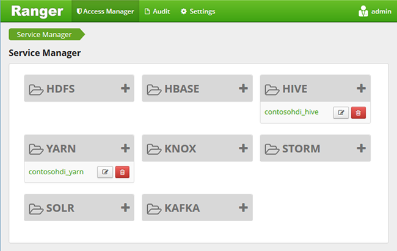
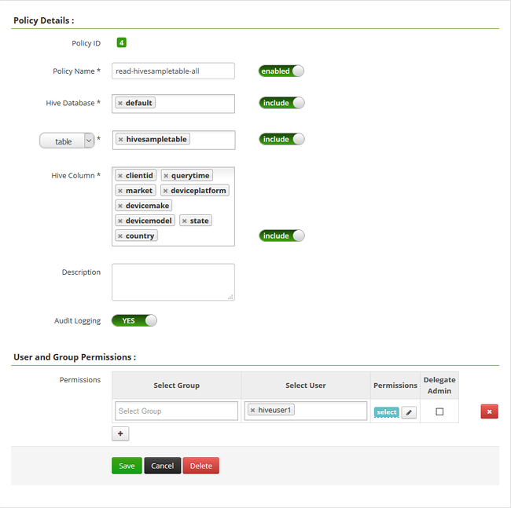

<properties
    pageTitle="Konfigurieren der Struktur Richtlinien Domänenverbund HDInsight | Microsoft Azure"
    description="Weitere Informationen..."
    services="hdinsight"
    documentationCenter=""
    authors="saurinsh"
    manager="jhubbard"
    editor="cgronlun"
    tags="azure-portal"/>

<tags
    ms.service="hdinsight"
    ms.devlang="na"
    ms.topic="hero-article"
    ms.tgt_pltfrm="na"
    ms.workload="big-data"
    ms.date="10/25/2016"
    ms.author="saurinsh"/>

# Konfigurieren der Struktur Richtlinien Domänenverbund HDInsight (Preview)

Informationen Sie zum Konfigurieren von Apache Ranger Richtlinien für Struktur. In diesem Artikel erstellen Sie zwei Ranger Richtlinien zum Einschränken des Zugriffs auf die Hivesampletable. Die Hivesampletable im Lieferumfang von HDInsight Cluster. Nachdem Sie die Richtlinien konfiguriert haben, verwenden Sie Excel und ODBC-Treiber für die Verbindung zu Struktur Tabellen in HDInsight.

## Erforderliche Komponenten

- Ein Cluster Domänenverbund HDInsight. Finden Sie unter [Konfigurieren von Domänenverbund HDInsight Cluster](hdinsight-domain-joined-configure.md).
- Eine Arbeitsstationen mit Office 2016, Office 2013 Professional Plus, Office 365 Pro Plus, Excel 2013 eigenständigen oder Office 2010 Professional Plus.

## Verbinden Sie mit Apache Ranger Admin-Benutzeroberfläche

**Verbindung zu Ranger Admin-Benutzeroberfläche**

1. Verbinden Sie mithilfe eines Browsers und mit Ranger Admin-Benutzeroberfläche. Die URL ist https://&lt;ClusterName >.azurehdinsight.net/Ranger/. 

    >[AZURE.NOTE] Ranger verwendet unterschiedliche Anmeldeinformationen als Hadoop Cluster. Um mit zwischengespeicherten Hadoop Anmeldeinformationen Browser zu verhindern, verwenden Sie neuen Browserfenster InPrivate-Verbindung zu der Ranger Admin-Benutzeroberfläche aus.
4. Melden Sie sich mit Cluster Administrator Domänenbenutzername und Kennwort:

    

    Ranger arbeitet derzeit nur mit aus und Struktur.

## Erstellen von Domänen-Benutzer

Sie haben in [Cluster konfigurieren Domänenverbund HDInsight](hdinsight-domain-joined-configure.md#create-and-configure-azure-ad-ds-for-your-azure-ad)hiveruser1 und hiveuser2 erstellt. Sie werden das zwei Benutzerkonto in diesem Lernprogramm verwenden.

## Erstellen von Ranger Richtlinien

In diesem Abschnitt erstellen Sie zwei Ranger Richtlinien für den Zugriff auf Hivesampletable. Geben Sie select-Berechtigung auf unterschiedliche Menge von Spalten. Beide Benutzer wurden [Konfigurieren Domänenverbund HDInsight Cluster](hdinsight-domain-joined-configure.md#create-and-configure-azure-ad-ds-for-your-azure-ad)erstellt.  Im nächsten Abschnitt Testen Sie die beiden Richtlinien in Excel.

**So erstellen Sie Ranger Richtlinien**

1. Öffnen Sie Ranger Admin-Benutzeroberfläche an. Finden Sie unter [Herstellen einer Verbindung Apache Ranger Admin-Benutzeroberfläche mit](#connect-to-apache-ranager-admin-ui).
2. Klicken Sie auf ** &lt;ClusterName > _hive**, klicken Sie unter **Struktur**. Sie sind zwei vordefinierte Konfigurieren von Richtlinien finden Sie unter.
3. Klicken Sie auf **Neue Richtlinie hinzufügen**, und geben Sie die folgenden Werte:

    - Name der Richtlinie: gelesen Hivesampletable alle
    - Struktur der Datenbank: Standard
    - Tabelle: Hivesampletable
    - Spalte Struktur: *
    - Wählen Sie Benutzer: hiveuser1
    - Berechtigungen: Wählen Sie aus

    .

    >[AZURE.NOTE] Wenn ein Domänenbenutzer nicht im Benutzer auswählen aufgefüllt wird, warten Sie einige Minuten für Ranger mit AAD synchronisieren aus.

4. Klicken Sie auf **Hinzufügen** , um die Richtlinie zu speichern.
5. Wiederholen Sie die letzten beiden Schritte, um eine andere Richtlinie mit den folgenden Eigenschaften zu erstellen:

    - Name der Richtlinie: gelesen-Hivesampletable-Devicemake
    - Struktur der Datenbank: Standard
    - Tabelle: Hivesampletable
    - Spalte Struktur: Clientid, Devicemake
    - Wählen Sie Benutzer: hiveuser2
    - Berechtigungen: Wählen Sie aus

## Erstellen Sie eine Struktur ODBC-Datenquelle

Die Anweisungen finden Sie im [Erstellen Struktur ODBC-Datenquelle](hdinsight-connect-excel-hive-odbc-driver.md).  

    Eigenschaft|Beschreibung
    ---|---
    Name der Datenquelle|Geben Sie einen Namen in der Datenquelle
    Host|Geben Sie &lt;HDInsightClusterName >. azurehdinsight.net. Beispielsweise myHDICluster.azurehdinsight.net
    Port|Verwenden Sie <strong>443</strong>ein. (Dieser Anschluss wurde von 563 in 443 geändert wurde.)
    Datenbank|Verwenden Sie <strong>Standard</strong>.
    Struktur Server-Datentyp|Wählen Sie die <strong>Struktur der Server 2</strong> aus.
    Verfahren|Wählen Sie <strong>Azure HDInsight-Dienst</strong>
    HTTP-Pfad|Lassen Sie ihn leer.
    Benutzername|Geben Sie hiveuser1@contoso158.onmicrosoft.com. Aktualisieren Sie den Domänennamen aus, wenn es anderen wird.
    Kennwort|Geben Sie das Kennwort für hiveuser1 ein.
    </table>

Vergewissern Sie sich auf **Testen** , vor dem Speichern der Datenquelle.

##Importieren von Daten in Excel aus HDInsight

Im letzten Abschnitt haben Sie zwei Richtlinien konfiguriert.  hiveuser1 weist die select-Berechtigung für alle Spalten, und hiveuser2 hat die select-Berechtigung für zwei Spalten. In diesem Abschnitt werden die zwei Benutzer zum Importieren von Daten in Excel Identität.

1. Öffnen einer neuen oder vorhandenen Arbeitsmappe in Excel.
2. Der Registerkarte **Daten** auf **Aus anderen Datenquellen**, und klicken Sie dann auf **Vom Datenverbindungs-Assistenten** aus, um den **Datenverbindungs-Assistenten**zu starten.

    ! [Open Datenverbindungs-Assistenten] [Img Hdi simbahiveodbc.excel.dataconnection]

3. Wählen Sie als Datenquelle **ODBC-DSN** aus, und klicken Sie dann auf **Weiter**.
4. ODBC-Datenquellen wählen Sie aus der Name der Datenquelle, die Sie im vorherigen Schritt erstellt haben, und klicken Sie dann auf **Weiter**.
5. Geben Sie das Kennwort für den Cluster im Assistenten erneut ein, und klicken Sie dann auf **OK**. Warten Sie im Dialogfeld **Datenbank und Tabelle wählen** zu öffnen. Dies kann einige Sekunden dauern.
8. Wählen Sie **Hivesampletable**aus, und klicken Sie dann auf **Weiter**. 
8. Klicken Sie auf **Fertig stellen**.
9. Klicken Sie im Dialogfeld **Daten importieren** können Sie ändern, oder geben die Abfrage. Klicken Sie hierzu auf **Eigenschaften**. Dies kann einige Sekunden dauern. 
10. Klicken Sie auf die Registerkarte **Definition** . Der Befehlstext lautet:

        SELECT * FROM "HIVE"."default"."hivesampletable"

    Die Ranger Richtlinien, die Sie definiert, hat hiveuser1 select-Berechtigung für alle Spalten.  Damit diese Abfrage funktioniert mit den hiveuser1 Anmeldeinformationen, diese Abfrage nicht funktioniert jedoch nicht mit den hiveuser2 Anmeldeinformationen.

    ! [Verbindungseigenschaften] [Img-Hdi-Simbahiveodbc-excel-Connectionproperties]

11. Klicken Sie auf **OK** , um das Dialogfeld Verbindungseigenschaften zu schließen.
12. Klicken Sie auf **OK** , um das Dialogfeld **Daten importieren** zu schließen.  
13. Geben Sie das Kennwort für hiveuser1 erneut ein, und klicken Sie dann auf **OK**. Es dauert einige Sekunden dauern, bevor Sie Daten nach Excel importiert werden. Wenn sie fertig sind, gilt 11 Datenspalten angezeigt.

So testen Sie die zweite Richtlinie (gelesen-Hivesampletable-Devicemake) Sie im letzten Abschnitt erstellt haben.

1. Fügen Sie ein neues Blatt in Excel ein.
2. Gehen Sie vor der letzten Schritte aus, um die Daten zu importieren.  Die einzige Änderung, die Sie vornehmen, besteht darin, die hiveuser2 Anmeldeinformationen anstelle des hiveuser1 verwenden. Dies schlägt fehl, da hiveuser2 nur über die Berechtigung zum Anzeigen von zwei Spalten enthält. Sie müssen die folgende Fehlermeldung erhalten:

        [Microsoft][HiveODBC] (35) Error from Hive: error code: '40000' error message: 'Error while compiling statement: FAILED: HiveAccessControlException Permission denied: user [hiveuser2] does not have [SELECT] privilege on [default/hivesampletable/clientid,country ...]'.

3. Befolgen Sie dasselbe Verfahren zum Importieren von Daten. Diesmal, verwenden Sie des hiveuser2 Anmeldeinformationen, und ändern Sie auch die select-Anweisung aus:

        SELECT * FROM "HIVE"."default"."hivesampletable"

    An:

        SELECT clientid, devicemake FROM "HIVE"."default"."hivesampletable"

    Wenn sie fertig sind, sind zwei Spalten der importierten Daten angezeigt.

## Nächste Schritte

- Konfigurieren einen Domäne HDInsight Cluster, finden Sie unter [Konfigurieren von Domänenverbund HDInsight Cluster](hdinsight-domain-joined-configure.md).
- Für die Verwaltung von einer Cluster Domänenverbund HDInsight finden Sie unter [Verwalten von Domänenverbund HDInsight Cluster](hdinsight-domain-joined-manage.md)aus.
- Ausführung von Struktur Abfragen mithilfe von SSH auf Cluster Domänenverbund HDInsight finden Sie unter [Verwenden SSH mit Linux-basierten Hadoop auf HDInsight von Linux, Unix, oder OS X](hdinsight-hadoop-linux-use-ssh-unix.md#connect-to-a-domain-joined-hdinsight-cluster).
- Herstellen einer Verbindung Struktur Struktur JDBC verwenden finden Sie unter [Verbinden Struktur auf Azure HDInsight mithilfe des Struktur JDBC-Treibers](hdinsight-connect-hive-jdbc-driver.md)
- Zum Herstellen einer Excel Hadoop Struktur ODBC verwenden, finden Sie unter [Verbinden von Excel mit Hadoop mit dem Microsoft-Struktur ODBC-Laufwerk](hdinsight-connect-excel-hive-odbc-driver.md)
- Zum Herstellen einer Excel Hadoop mithilfe von Power Query, finden Sie unter [Verbinden von Excel mit Hadoop mithilfe von Power Query](hdinsight-connect-excel-power-query.md)