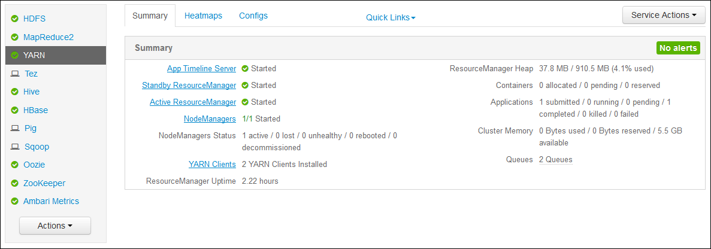

<properties
    pageTitle="Hadoop aus Access-Anwendung anmeldet Linux-basierten HDInsight | Microsoft Azure"
    description="Informationen Sie zum Anwendung-Protokolle auf einem Linux-basierten HDInsight (Hadoop) Cluster mithilfe der Befehlszeile und einen Webbrowser aus zugreifen."
    services="hdinsight"
    documentationCenter=""
    tags="azure-portal"
    authors="Blackmist" 
    manager="jhubbard"
    editor="cgronlun"/>

<tags
    ms.service="hdinsight"
    ms.workload="big-data"
    ms.tgt_pltfrm="na"
    ms.devlang="na"
    ms.topic="article"
    ms.date="10/21/2016"
    ms.author="larryfr"/>

# Access-aus-Anwendung anmeldet Linux-basierten HDInsight 

Dieses Dokument wird erläutert, wie die Protokolle für Applikationen aus (noch einer anderen Ressource Vermittlung) zugreifen, die in einem Cluster Hadoop in Azure HDInsight eingegeben haben.

> [AZURE.NOTE] Die Informationen in diesem Dokument ist für Linux-basierte HDInsight Cluster spezifisch. Informationen zu Windows-basierten Cluster finden Sie unter [aus Access-Anwendung auf Windows basierende HDInsight protokolliert](hdinsight-hadoop-access-yarn-app-logs.md)

## Erforderliche Komponenten

* Ein Cluster Linux-basierten HDInsight.

* Sie müssen [einen Tunnel SSH erstellen](hdinsight-linux-ambari-ssh-tunnel.md) , bevor Sie das Ressourcen-Manager Protokolle Web-Benutzeroberfläche zugreifen können.

## AUS Zeitachse Server

[Aus Zeitachse Server](http://hadoop.apache.org/docs/r2.4.0/hadoop-yarn/hadoop-yarn-site/TimelineServer.html) enthält generische Informationen zu fertigen Applikationen als auch Framework-spezifische Anwendungsinformationen über zwei verschiedenen Schnittstellen an. Insbesondere:

* Speichern und Abrufen von Informationen zu Allgemeine Anwendung HDInsight Cluster wurde aktiviert mit Version 3.1.1.374 oder höher.
* Die Anwendung Framework-spezifische Informationskomponente des Servers Zeitachse ist nicht aktuell auf HDInsight Cluster zur Verfügung.

Allgemeine Informationen über die Applikationen umfasst die folgenden Arten von Daten:

* Die Anwendung-ID, einen eindeutigen Bezeichner der Anwendung
* Der Benutzer, der die Anwendung gestartet.
* Informationen zum Ausführen der Anwendungs vorgenommenen Versuche
* Die angegebenen Anwendung bei dem Versuch untersuchten Container

## Applications aus und Protokolle

AUS unterstützt mehrere programming Modelle (MapReduce war einer der Teilnehmer) durch ressourcenverwaltung von der Anwendung Planung/Überwachung Entkopplung. Dies erfolgt über eine globale *Ressourcen-Manager* (RM), pro-Worker-Knoten *NodeManagers* (NMs) und pro Anwendung *ApplicationMasters* (AMs). Die Uhr pro Anwendung handelt Ressourcen (CPU, Arbeitsspeicher, Datenträger, Netzwerk) aus, für die Anwendung ausführen, mit der RM. Die RM funktioniert mit NMs gewähren Sie diese Ressourcen, die als *Container*erteilt werden. Die Uhr ist verantwortlich Fortschritts der Container der RM zugewiesen Eine Anwendung möglicherweise viele Container je nach Art der Anwendung benötigen.

Darüber hinaus jede Anwendung möglicherweise bestehen aus mehreren *Anwendung versucht* akzeptieren, um in Anwesenheit stürzt ab oder aufgrund der Verlust der Kommunikation zwischen einer Uhr Fertig stellen und eine RM. Container sind daher auf eine bestimmte Versuch der Anwendung erteilt. In einer sinnvoll ein Containers stellt den Kontext für grundlegende Arbeitseinheit ausgeführte Arbeit von einer Anwendung aus, und alle Arbeitszeit, die innerhalb des Kontexts eines Containers ist auf der Grundlage der Container zugewiesen wurde einzelnen Worker Knoten ausgeführt wird. Finden Sie unter [Konzepte aus] [ YARN-concepts] zu Referenzzwecken.

Anwendungsprotokolle (und die zugehörigen Container Protokolle) sind entscheidend, für das Debuggen problematische Hadoop Applications. AUS bietet einen übersichtliche Rahmen für erfassen, aggregieren, und Speichern von Anwendungsprotokolle mit der [Log Aggregation] [ log-aggregation] Features. Das Feature Log Aggregation macht Anwendungsprotokolle für den Zugriff auf Weise, wie sie Protokolle über alle Container auf einem Knoten Worker aggregiert und nach Beendigung der Anwendung als einen aggregierten Protokolldatei pro Worker Knoten auf Standard-Dateisystem gespeichert. Die Anwendung möglicherweise Hunderte oder Tausende von Containern verwenden, aber Protokolle für alle Container auf einem einzelnen Worker-Knoten ausgeführt werden in einer Datei, in eine Protokolldatei pro Worker Knoten von der Anwendung verwendeten resultierender immer aggregiert werden. Log Aggregation auf HDInsight Cluster standardmäßig aktiviert ist (Version 3.0 und höher), und zusammengefasster Protokolle finden Sie in der standardmäßige Container von Ihrem Cluster an folgendem Speicherort:

    wasbs:///app-logs/<user>/logs/<applicationId>

Dieses Speicherort *Benutzer* ist der Name des Benutzers, der die Anwendung gestartet, und *p* der eindeutigen Bezeichner für eine Anwendung ist wie zugewiesen durch die RM aus.

Die aggregierten Protokolle sind nicht direkt gelesen werden kann, wie sie in einer [TFile]geschrieben werden[T-file], [Binärformat] [ binary-format] vom Container indiziert. Sie müssen die Protokolle aus Ressourcen-Manager oder CLI-Tools verwenden, diese Protokolle als nur-Text für Applikationen oder Container relevante anzeigen. 

##AUS CLI-tools

Um die Tools aus CLI verwenden zu können, müssen Sie zunächst zum Cluster HDInsight mithilfe von SSH verbinden. Verwenden Sie eine der folgenden Dokumente Weitere Informationen zur Verwendung von SSH mit HDInsight aus:

- [Verwenden von SSH mit Linux-basierten Hadoop auf HDInsight von Linux, Unix oder OS X](hdinsight-hadoop-linux-use-ssh-unix.md)

- [Verwenden von SSH mit Linux-basierten Hadoop auf HDInsight von Windows](hdinsight-hadoop-linux-use-ssh-windows.md)
    
Sie können diese Protokolle als nur-Text anzeigen, indem Sie einen der folgenden Befehle ausführen:

    yarn logs -applicationId <applicationId> -appOwner <user-who-started-the-application>
    yarn logs -applicationId <applicationId> -appOwner <user-who-started-the-application> -containerId <containerId> -nodeAddress <worker-node-address>
    
Geben Sie die &lt;p >, &lt;Benutzer, die-Schritte-eines Programms >, &lt;ContainerId >, und & Ltworker-Knoten-Adresse > Informationen beim Ausführen der folgenden Befehle.

##Ressourcen-Manager-Benutzeroberfläche aus

Die Ressourcen-Manager-Benutzeroberfläche aus ausgeführt wird, klicken Sie auf die Cluster Headnode und über das Web Ambari Benutzeroberfläche zugegriffen werden kann; jedoch müssen Sie erste [einen Tunnel SSH erstellen](hdinsight-linux-ambari-ssh-tunnel.md) , bevor Sie die ResourceManager UI zugreifen können.

Nachdem Sie einen Tunnel SSH erstellt haben, gehen Sie folgendermaßen vor, zum Anzeigen der Protokolle aus:

1. Navigieren Sie in Ihrem Webbrowser zu https://CLUSTERNAME.azurehdinsight.net. Ersetzen Sie CLUSTERNAME mit dem Namen der HDInsight Cluster ein.

2. Wählen Sie aus der Liste der Dienste auf der linken Seite __aus__.

    

3. Wählen Sie aus der Dropdownliste __Quicklinks__ aus eine der am Clusterknoten aus, und wählen Sie dann __Ressourcen-Manager-Protokoll__.

    
    
    Es wird mit einer Liste mit Links zu aus Protokolle angezeigt.

[YARN-timeline-server]:http://hadoop.apache.org/docs/r2.4.0/hadoop-yarn/hadoop-yarn-site/TimelineServer.html
[log-aggregation]:http://hortonworks.com/blog/simplifying-user-logs-management-and-access-in-yarn/
[T-file]:https://issues.apache.org/jira/secure/attachment/12396286/TFile%20Specification%2020081217.pdf
[binary-format]:https://issues.apache.org/jira/browse/HADOOP-3315
[YARN-concepts]:http://hortonworks.com/blog/apache-hadoop-yarn-concepts-and-applications/
