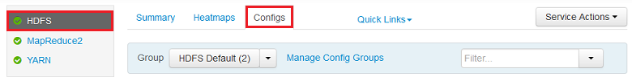
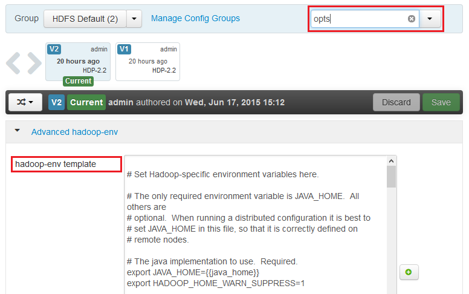

<properties
    pageTitle="Aktivieren Heapdumps für Hadoop Dienste auf HDInsight | Microsoft Azure"
    description="Aktivieren Sie Heapdumps für Hadoop-Dienste von Linux-basierten HDInsight Cluster für das Debuggen und Analyse."
    services="hdinsight"
    documentationCenter=""
    authors="Blackmist"
    manager="jhubbard"
    editor="cgronlun"
    tags="azure-portal"/>

<tags
    ms.service="hdinsight"
    ms.workload="big-data"
    ms.tgt_pltfrm="na"
    ms.devlang="na"
    ms.topic="article"
    ms.date="09/27/2016"
    ms.author="larryfr"/>

#Aktivieren Sie Heapdumps für Hadoop Dienste auf Linux-basierten HDInsight (Preview)

[AZURE.INCLUDE [heapdump-selector](../../includes/hdinsight-selector-heap-dump.md)]

Heapdumps enthalten eine Momentaufnahme der Anwendung Speicher, einschließlich der Werte von Variablen zum Zeitpunkt das Abbild erstellt wurde. Damit sie sehr nützlich zum Diagnostizieren von Problemen, die bei der Ausführung auftreten sind.

> [AZURE.NOTE] Die Informationen in diesem Artikel gilt nur für Linux-basierten HDInsight. Klicken Sie auf Windows basierende HDInsight Informationen finden Sie unter [Heapdumps für Hadoop Dienste auf Windows basierende HDInsight aktivieren](hdinsight-hadoop-collect-debug-heap-dumps.md)

## Services

Sie können für die folgenden Dienste Heapdumps aktivieren:

*  **Hcatalog** - tempelton
*  **Struktur** - hiveserver2, Metastore, derbyserver
*  **Mapreduce** - jobhistoryserver
*  **aus** - Ressourcen-Manager, Nodemanager, timelineserver
*  **Hdfs** - Datanode, Secondarynamenode, namenode

Sie können auch aktivieren Heapdumps für die Karte und verringern Prozesse ausgeführt wurde, indem HDInsight.

## Grundlegendes zu Heapdumpkonfiguration

Heapdumps aktiviert sind, indem Sie Optionen übergeben (manchmal bekannt als wechselt, oder Parameter) auf die JVM, wenn ein Dienst gestartet wird. Für die meisten Hadoop-Dienste kann dies erreicht werden durch Ändern der Shellskript verwendet, um den Dienst zu starten.

In jedem Skript, es ist eine Export für ** \* \_OPTS**, der die an die JVM übergebenen Optionen enthält. Angenommen, in das Skript **Hadoop-env.sh** die Zeile, die beginnt mit `export HADOOP_NAMENODE_OPTS=` enthält die Optionen für den Dienst NameNode.

Zuordnen und verringern Prozesse sind etwas anders ab, wie diese untergeordneter Prozess des Diensts MapReduce sind. Jede zuordnen oder reduzieren Prozess in einem untergeordneten Container ausgeführt wird, und es werden zwei Einträge, die JVM Optionen für diese enthalten. Beide in **Mapred-site.xml**enthalten sind:

* **MapReduce.Admin.Map.Child.java.OPTS**
* **MapReduce.Admin.reduce.Child.java.OPTS**

> [AZURE.NOTE] Es empfiehlt sich, als Ambari behandelt Replikation Änderungen Knoten im Cluster Ambari so ändern Sie die Skripts und die Mapred-site.xml Einstellungen zu verwenden. Finden Sie im Abschnitt [Ambari mithilfe von](#using-ambari) bestimmter Schritte aus.

###Aktivieren Sie Heapdumps

Die folgende Option aktiviert Heapdumps beim Eintreten einer OutOfMemoryError:

    -XX:+HeapDumpOnOutOfMemoryError

Die **+** gibt an, dass diese Option aktiviert ist. Die Standardeinstellung ist deaktiviert.

> [AZURE.WARNING] Heapdumps sind für nicht Hadoop Dienste auf HDInsight standardmäßig aktiviert, wie die Abbilddateien groß sein können. Wenn Sie diese aktivieren zur Behandlung dieses Problems, denken Sie daran, um diese zu deaktivieren, nachdem Sie das Problem reproduziert und die Abbilddateien gesammelt haben.

###Sichern der Position

Der Standardspeicherort für die Sicherungsdatei ist aktuell geöffneten Verzeichnis. Sie können steuern, in dem die Datei gespeichert ist, verwenden die folgende Option:

    -XX:HeapDumpPath=/path

Verwenden Sie beispielsweise `-XX:HeapDumpPath=/tmp` bewirkt, dass die speichert in das Verzeichnis/tmp gespeichert werden soll.

###Skripts

Wenn ein **OutOfMemoryError** auftritt, können Sie auch ein Skript auslösen. Auslösen von beispielsweise eine Benachrichtigung, damit Sie wissen, dass der Fehler aufgetreten ist. Dies wird gesteuert, verwenden die folgende Option:

    -XX:OnOutOfMemoryError=/path/to/script

> [AZURE.NOTE] Da Hadoop verteilten Systems ist, muss jedes Skript verwendet auf allen Knoten im Cluster platziert werden, die der Dienst ausgeführt wird, klicken Sie auf.
>
> Ausführen des Skripts müssen auch werden in einem Speicherort, der zugegriffen werden durch das Konto der Dienst wird als, und bieten muss Berechtigungen. Sie möchten beispielsweise Skripts in speichern `/usr/local/bin` und Verwenden von `chmod go+rx /usr/local/bin/filename.sh` gestatten lesen sowie die Berechtigungen zum Ausführen.

##Verwenden von Ambari

Wenn Sie die Konfiguration für einen Dienst ändern möchten, gehen Sie folgendermaßen vor:

1. Öffnen Sie das Ambari Web-Benutzeroberfläche für Ihren Cluster an. Die URL wird https://YOURCLUSTERNAME.azurehdinsight.net sein.

    Wenn Sie dazu aufgefordert werden, zu der Website, die den Namen des HTTP-Kontos authentifiziert (Standard: Administrator) und das Kennwort für Ihren Cluster.

    > [AZURE.NOTE] Sie können ein zweites Mal durch Ambari für Benutzername und Kennwort aufgefordert. In diesem Fall einfach erneut Geben Sie den gleichen Kontonamen und das Kennwort

2. Wählen Sie mit der Liste der auf der linken Seite des Bereichs Service, die Sie ändern möchten. Beispielsweise **HDFS**. Wählen Sie im Bereich Center **Konfigurationen** Registerkarte ein.

    

3. Verwenden den Eintrag **... Filtern** , geben Sie **-Optionen**. Dies filtert die Liste der Konfiguration von Elementen auf diejenigen, die diesen Text enthält, und eine schnelle Möglichkeit zum Suchen nach der Shellskript oder **Vorlage** , die zum Festlegen dieser Optionen verwendet werden können.

    

4. Suchen nach der ** \* \_OPTS** Eintrag für den Dienst soll Heapdumps für aktivieren, und fügen Sie die Optionen, die Sie aktivieren möchten. In der folgenden Abbildung nach dem Hinzufügen `-XX:+HeapDumpOnOutOfMemoryError -XX:HeapDumpPath=/tmp/` zu den **HADOOP\_NAMENODE\_OPTS** Eintrag:

    

    > [AZURE.NOTE] Beim Aktivieren von Heap bildet ab, für die Karte oder untergeordneten Prozess verringern, sehen Sie stattdessen für die Felder mit der Beschriftung **mapreduce.admin.map.child.java.opts** und **mapreduce.admin.reduce.child.java.opts**.

    Verwenden Sie die Schaltfläche **Speichern** , um die Änderungen zu speichern. Sie werden Geben Sie eine kurze Notiz zur Beschreibung der Änderungen möglich.

5. Sobald die Änderungen angewendet wurden, wird das Symbol **Neustart erforderlich** neben einen oder mehrere Dienste angezeigt.

    

6. Wählen Sie jeden Dienst, der einen Neustart benötigt, und verwenden Sie die Schaltfläche **Service-Aktionen** **Auf Wartung-Modus aktivieren**. Dadurch wird verhindert, dass Benachrichtigungen aus diesem Dienst generiert wird, wenn Sie ihn erneut starten.

    

7. Nachdem Sie die Wartungsmodus aktiviert haben, verwenden Sie die Schaltfläche **neu starten** , für den Dienst **Alle** vorgenommen neu starten

    

    > [AZURE.NOTE] die Einträge für die Schaltfläche **neu starten** möglicherweise für andere Dienste unterscheiden.

8. Nach dem Neustart der Dienste verwenden Sie die Schaltfläche **Service-Aktionen** **Deaktivieren Wartung-Modus aktivieren**. Diese Ambari zum Überwachen von Benachrichtigungen für den Dienst fortsetzen.
