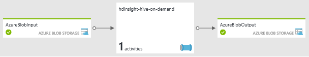
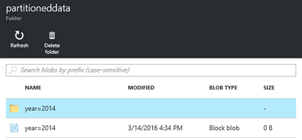
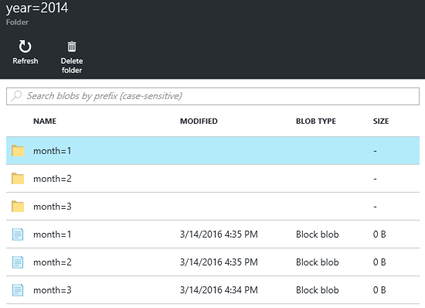

<properties
   pageTitle="Erstellen Sie bei Bedarf Hadoop Linux-basierten Cluster in HDInsight mithilfe von Azure Data Factory | Microsoft Azure"
    description="Erfahren Sie, wie bei Bedarf HDInsight Cluster mit Azure Data Factory erstellen."
   services="hdinsight"
   documentationCenter=""
   tags="azure-portal"
   authors="mumian"
   manager="jhubbard"
   editor="cgronlun"/>

<tags
   ms.service="hdinsight"
   ms.devlang="na"
   ms.topic="article"
   ms.tgt_pltfrm="na"
   ms.workload="big-data"
   ms.date="10/06/2016"
   ms.author="jgao"/>

# Erstellen Sie bei Bedarf Hadoop Linux-basierten Cluster in HDInsight mithilfe von Azure Data Factory

[AZURE.INCLUDE [selector](../../includes/hdinsight-selector-create-clusters.md)]

[Azure Data Factory](../data-factory/data-factory-introduction.md) ist eine cloudbasierte Integration Datendienst, der koordiniert und Automatisierung der Bewegung und Transformation von Daten. In diesem Artikel erfahren Sie, wie Azure Data Factory ein [Azure HDInsight bei Bedarf verknüpfte Dienst](../data-factory/data-factory-compute-linked-services.md#azure-hdinsight-on-demand-linked-service)erstellt, und verwenden den Cluster zum Ausführen eines Auftrags Struktur. So sieht auf hoher Ebene illustrieren aus:

1. Erstellen einer HDInsight Cluster bei Bedarf an.
2. Führen Sie die Struktur des unformatierten Daten aus einer Quelle BLOB-Speicherkonto lesen, Transformieren der Daten und das Schreiben der Ausgabe mit einem Ziel Blob-Speicher-Konto. 
3. Löschen des Clusters anhand der Einstellung Time to live an.

Die Struktur Aktivität, die in den Daten Factory Verkaufspipeline Aufrufen einer vordefinierten HiveQL Skript definiert. Das Skript erstellt eine externe Tabelle, die die Daten unformatierten Web Log in Azure Blob-Speicher verweist und dann teilt den unformatierten Daten nach Jahr und Monat.

Hier sind die Stichprobe Zeilen für jeden Monat in die Datei ein.

    2014-01-01,02:01:09,SAMPLEWEBSITE,GET,/blogposts/mvc4/step2.png,X-ARR-LOG-ID=2ec4b8ad-3cf0-4442-93ab-837317ece6a1,80,-,1.54.23.196,Mozilla/5.0+(Windows+NT+6.3;+WOW64)+AppleWebKit/537.36+(KHTML,+like+Gecko)+Chrome/31.0.1650.63+Safari/537.36,-,http://weblogs.asp.net/sample/archive/2007/12/09/asp-net-mvc-framework-part-4-handling-form-edit-and-post-scenarios.aspx,\N,200,0,0,53175,871 
    2014-02-01,02:01:10,SAMPLEWEBSITE,GET,/blogposts/mvc4/step7.png,X-ARR-LOG-ID=d7472a26-431a-4a4d-99eb-c7b4fda2cf4c,80,-,1.54.23.196,Mozilla/5.0+(Windows+NT+6.3;+WOW64)+AppleWebKit/537.36+(KHTML,+like+Gecko)+Chrome/31.0.1650.63+Safari/537.36,-,http://weblogs.asp.net/sample/archive/2007/12/09/asp-net-mvc-framework-part-4-handling-form-edit-and-post-scenarios.aspx,\N,200,0,0,30184,871
    2014-03-01,02:01:10,SAMPLEWEBSITE,GET,/blogposts/mvc4/step7.png,X-ARR-LOG-ID=d7472a26-431a-4a4d-99eb-c7b4fda2cf4c,80,-,1.54.23.196,Mozilla/5.0+(Windows+NT+6.3;+WOW64)+AppleWebKit/537.36+(KHTML,+like+Gecko)+Chrome/31.0.1650.63+Safari/537.36,-,http://weblogs.asp.net/sample/archive/2007/12/09/asp-net-mvc-framework-part-4-handling-form-edit-and-post-scenarios.aspx,\N,200,0,0,30184,871

Das Skript erstellt drei Ausgabeordner auf der Grundlage der vorherigen Eingabe. Jeder Ordner enthält eine Datei mit den Einträgen aus jeden Monat.

    adfgetstarted/partitioneddata/year=2014/month=1/000000_0
    adfgetstarted/partitioneddata/year=2014/month=2/000000_0
    adfgetstarted/partitioneddata/year=2014/month=3/000000_0

Eine Liste der Daten Factory Daten Transformationsaktivitäten zusätzlich Struktur Aktivität finden Sie unter [Transformieren und analysieren, indem Sie die Daten Factory Azure](../data-factory/data-factory-data-transformation-activities.md).

Es gibt viele Vorteile bei der Verwendung von HDInsight mit Daten Factory aus:

- HDInsight Cluster Abrechnung ist habe pro Minute, ob sie oder nicht verwendet werden. Verwenden Daten Factory, werden die Cluster bei Bedarf erstellt. Und die Zuordnungseinheiten werden automatisch gelöscht, wenn der Einzelvorgänge abgeschlossen sind.  Sie Zahlen also nur für den Auftrag Zeit und der Uhrzeit der kurze im Leerlauf ausgeführt (Time-to-live).
- Sie können einen Workflow mit Daten Factory Verkaufspipeline erstellen.
- Sie können rekursive Aufträge planen.  

> [AZURE.NOTE] Derzeit können Sie nur HDInsight Linux-basierten Clusterversion 3,2 aus Azure Data Factory erstellen.

##Voraussetzungen für:

Bevor Sie die Anweisungen in diesem Artikel beginnen, benötigen Sie die folgenden Elemente:

- [Azure-Abonnement](https://azure.microsoft.com/documentation/videos/get-azure-free-trial-for-testing-hadoop-in-hdinsight/).
- Azure CLI oder Azure PowerShell. 

    [AZURE.INCLUDE [use-latest-version](../../includes/hdinsight-use-latest-powershell-and-cli.md)]

##Vorbereiten der Speicher-Konto

Sie können bis zu drei Speicherkonten in diesem Szenario verwenden:

- Speicher Standardkonto für den Cluster HDInsight
- Speicher-Konto für die Eingabedaten
- Speicher-Konto für die Ausgabedaten

Um das Lernprogramm zu vereinfachen, verwenden Sie eine Speicher-Konto an, um die drei Zwecke. Die Azure CLI und Azure PowerShell Stichprobe das Skript in diesem Abschnitt werden die folgenden Aufgaben ausführen:

1. Melden Sie sich bei Azure.
2. Erstellen einer Azure Ressourcengruppe.
3. Erstellen Sie ein Konto Azure-Speicher.
4. Erstellen eines Containers Blob im Speicher-Konto
5. Kopieren Sie die folgenden beiden Dateien in den Container Blob:

    - Eingabedatendatei: [https://hditutorialdata.blob.core.windows.net/adfhiveactivity/inputdata/input.log](https://hditutorialdata.blob.core.windows.net/adfhiveactivity/inputdata/input.log)
    - HiveQL Skript: [https://hditutorialdata.blob.core.windows.net/adfhiveactivity/script/partitionweblogs.hql](https://hditutorialdata.blob.core.windows.net/adfhiveactivity/script/partitionweblogs.hql)

    Beide Dateien werden in einem Öffentlichen Blob-Container gespeichert. 

>[AZURE.IMPORTANT] Notieren Sie den Namen der Ressource Gruppe, den Kontonamen für den Speicher und die Speicher kontoschlüssel in Ihrem Skript verwendet.  Sie benötigen sie im nächsten Abschnitt.

**Vorbereiten des Speichers, und kopieren Sie die Dateien mithilfe von Azure CLI**

    azure login
    
    azure config mode arm

    azure group create --name "<Azure Resource Group Name>" --location "East US 2"

    azure storage account create --resource-group "<Azure Resource Group Name>" --location "East US 2" --type "LRS" <Azure Storage Account Name>

    azure storage account keys list --resource-group "<Azure Resource Group Name>" "<Azure Storage Account Name>"
    azure storage container create "adfgetstarted" --account-name "<Azure Storage AccountName>" --account-key "<Azure Storage Account Key>"

    azure storage blob copy start "https://hditutorialdata.blob.core.windows.net/adfhiveactivity/inputdata/input.log" --dest-account-name "<Azure Storage Account Name>" --dest-account-key "<Azure Storage Account Key>" --dest-container "adfgetstarted" 
    azure storage blob copy start "https://hditutorialdata.blob.core.windows.net/adfhiveactivity/script/partitionweblogs.hql" --dest-account-name "<Azure Storage Account Name>" --dest-account-key "<Azure Storage Account Key>" --dest-container "adfgetstarted" 

Der Containername ist *Adfgetstarted*.  Halten Sie es aus, wie es ist. Andernfalls müssen Sie die Ressourcenverwaltung Vorlage aktualisieren.

Wenn Sie mit diesem Skript CLI Hilfe benötigen, finden Sie unter [Verwendung der CLI Azure mit Azure-Speicher](../storage/storage-azure-cli.md).

**Vorbereiten des Speichers, und kopieren Sie die Dateien mithilfe der PowerShell Azure**

    $resourceGroupName = "<Azure Resource Group Name>"
    $storageAccountName = "<Azure Storage Account Name>"
    $location = "East US 2"

    $sourceStorageAccountName = "hditutorialdata"  
    $sourceContainerName = "adfhiveactivity"

    $destStorageAccountName = $storageAccountName
    $destContainerName = "adfgetstarted" # don't change this value.

    ####################################
    # Connect to Azure
    ####################################
    #region - Connect to Azure subscription
    Write-Host "`nConnecting to your Azure subscription ..." -ForegroundColor Green
    try{Get-AzureRmContext}
    catch{Login-AzureRmAccount}
    #endregion

    ####################################
    # Create a resource group, storage, and container
    ####################################

    #region - create Azure resources
    Write-Host "`nCreating resource group, storage account and blob container ..." -ForegroundColor Green

    New-AzureRmResourceGroup -Name $resourceGroupName -Location $location 
    New-AzureRmStorageAccount `
        -ResourceGroupName $resourceGroupName `
        -Name $destStorageAccountName `
        -type Standard_LRS `
        -Location $location 

    $destStorageAccountKey = (Get-AzureRmStorageAccountKey `
        -ResourceGroupName $resourceGroupName `
        -Name $destStorageAccountName)[0].Value

    $sourceContext = New-AzureStorageContext `
        -StorageAccountName $sourceStorageAccountName `
        -Anonymous
    $destContext = New-AzureStorageContext `
        -StorageAccountName $destStorageAccountName `
        -StorageAccountKey $destStorageAccountKey

    New-AzureStorageContainer -Name $destContainerName -Context $destContext
    #endregion

    ####################################
    # Copy files
    ####################################
    #region - copy files
    Write-Host "`nCopying files ..." -ForegroundColor Green

    $blobs = Get-AzureStorageBlob `
        -Context $sourceContext `
        -Container $sourceContainerName 

    $blobs|Start-AzureStorageBlobCopy `
        -DestContext $destContext `
        -DestContainer $destContainerName

    Write-Host "`nCopied files ..." -ForegroundColor Green
    Get-AzureStorageBlob -Context $destContext -Container $destContainerName 
    #endregion

    Write-host "`nYou will use the following values:" -ForegroundColor Green
    write-host "`nResource group name: $resourceGroupName"
    Write-host "Storage Account Name: $destStorageAccountName"
    write-host "Storage Account Key: $destStorageAccountKey"

    Write-host "`nScript completed" -ForegroundColor Green

Wenn Sie mit diesem Skript PowerShell Hilfe benötigen, finden Sie unter [mithilfe der PowerShell Azure mit Azure-Speicher](../storage/storage-powershell-guide-full.md).

**Um das Speicherkonto und den Inhalt zu überprüfen**

1. Melden Sie sich auf der [Azure-Portal](https://portal.azure.com)an.
2. Klicken Sie im linken Bereich auf **Ressourcengruppen** .
3. Doppelklicken Sie auf den Namen der Ressource-Gruppe, die, den Sie in Ihrem CLI oder PowerShell-Skript erstellt haben. Verwenden Sie den Filter, wenn zu viele Ressourcengruppen aufgeführt sind. 
4. Klicken Sie auf die Kachel **Ressourcen** haben Sie eine Ressource aufgeführt, es sei denn, Sie die Ressourcengruppe für andere Projekte freigeben. Diese Ressource ist der Speicherkonto mit dem Namen, die, den Sie zuvor angegeben haben. Klicken Sie auf den Namen des Kontos Speicher.
5. Klicken Sie auf die **Blobs** Kacheln.
6. Klicken Sie auf den Container **Adfgetstarted** . Sehen Sie zwei Ordner: **Eingabedaten** und **Skript**.
7. Öffnen Sie den Ordner, und überprüfen Sie die Dateien in den Ordner.
 
## Erstellen von Daten factory

Mit der Speicher-Konto, die Eingabedaten und das HiveQL Skript vorbereitet sind Sie bereit sind, eine Fabrik Azure-Daten zu erstellen. Es gibt mehrere Methoden zum Erstellen von Daten Factory ein. Sie verwenden das Azure-Portal, um eine benutzerdefinierte Vorlage für die Verwaltung von Ressourcen in diesem Lernprogramm aufzurufen. Sie können auch die Vorlage Ressourcenverwaltung aus [Azure CLI](../resource-group-template-deploy.md#deploy-with-azure-cli-for-mac-linux-and-windows) und [Azure PowerShell](../resource-group-template-deploy.md#deploy-with-powershell)aufrufen. Andere Methoden Daten Factory Erstellung finden Sie unter [Lernprogramm: Erstellen Ihrer erste Daten Factory](../data-factory/data-factory-build-your-first-pipeline.md).

Die auf oberster Ebene Ressourcenverwaltung Vorlage enthält:

    {
        "contentVersion": "1.0.0.0",
        "$schema": "http://schema.management.azure.com/schemas/2015-01-01/deploymentTemplate.json#",
        "parameters": { ...
        },
        "variables": { ...
        },
        "resources": [
            {
                "name": "[parameters('dataFactoryName')]",
                "apiVersion": "[variables('apiVersion')]",
                "type": "Microsoft.DataFactory/datafactories",
                "location": "westus",
                "resources": [
                    { ... },
                    { ... },
                    { ... },
                    { ... }
                ]
            }
        ]
    }

Sie enthält eine Data Factory Ressource aufgerufen *Hdinsight Struktur auf Anforderung* (der Name wird nicht auf den Screenshot dargestellt). Daten Factory ist aktuell nur in der Region Westen USA und der Region North Europe unterstützt. 

Die Ressource *Hdinsight Struktur auf Anforderung* enthält vier Ressourcen:

- Eine Linkedservice mit dem Speicherkonto, das als Standardkonto HDInsight-Speicher, Eingabedaten Speicher und die Ausgabe Datenspeicher verwendet wird.
- Eine Linkedservice zum HDInsight Cluster erstellt werden:

        {
            "dependsOn": [ ... ],
            "type": "linkedservices",
            "name": "[variables('hdInsightOnDemandLinkedServiceName')]",
            "apiVersion": "[variables('apiVersion')]",
            "properties": {
                "type": "HDInsightOnDemand",
                "typeProperties": {
                    "osType": "linux",
                    "version": "3.2",
                    "clusterSize": 1,
                    "sshUserName": "myuser",                            
                    "sshPassword": "MyPassword!",
                    "timeToLive": "00:30:00",
                    "linkedServiceName": "[variables('storageLinkedServiceName')]"
                }
            }
        },

    Obwohl sie nicht angegeben ist, wird Cluster in derselben Region als Speicherkonto erstellt.
    
    Beachten Sie die Einstellung *TimeToLive* . Die Daten Factory löscht Cluster automatisch nach der Cluster 30 Minuten im Leerlauf wird.
- Ein Dataset für die Eingabedaten. Hier werden der Dateiname und der Name des Ordners definiert:

        "fileName": "input.log",
        "folderPath": "adfgetstarted/inputdata",
        
- Ein Dataset für die Ausgabedaten, und klicken Sie dann Verkaufspipeline für die Verarbeitung von Daten. Hier wird der Ausgabepfad definiert:
        
        "folderPath": "adfgetstarted/partitioneddata",

    Die Einstellung [Dataset Verfügbarkeit](../data-factory/data-factory-create-datasets.md#Availability) lautet wie folgt aus:
    
        "availability": {
            "frequency": "Month",
            "interval": 1,
            "style": "EndOfInterval"
        },

    In Azure Daten Factory Laufwerke Ausgabe Dataset Verfügbarkeit der Verkaufspipeline an. Dies bedeutet, dass das Segment monatlich am letzten Tag des Monats erstellt wird. Weitere Informationen finden Sie unter [Daten Factory Planung und Ausführung](../data-factory/data-factory-scheduling-and-execution.md).

    Die Definition der Verkaufspipeline lautet wie folgt aus:
    
        {
            "dependsOn": [ ... ],
            "type": "datapipelines",
            "name": "[parameters('dataFactoryName')]",
            "apiVersion": "[variables('apiVersion')]",
            "properties": {
                "description": "Azure Data Factory pipeline with an Hadoop Hive activity",
                "activities": [
                    { ...}
                ],
                "start": "2016-01-01T00:00:00Z",
                "end": "2016-01-31T00:00:00Z",
                "isPaused": false
            }
        }
                
    Sie enthält eine Aktivität. *Starten* und *Beenden* der Aktivität haben einem vergangenen Datum, d. h., es ist nur ein Segment aus. Ist das Ende einer zukünftigen Datum, erstellt die Daten Factory ein anderes Segment Zeitpunkt zu erfüllen. Weitere Informationen finden Sie unter [Daten Factory Planung und Ausführung](../data-factory/data-factory-scheduling-and-execution.md).

    Das folgende Json-Skript ist die Aktivitätsdefinition:
    
        "activities": [
            {
                "type": "HDInsightHive",
                "typeProperties": {
                    "scriptPath": "adfgetstarted/script/partitionweblogs.hql",
                    "scriptLinkedService": "[variables('storageLinkedServiceName')]",
                    "defines": {
                        "inputtable": "[concat('wasbs://adfgetstarted@', parameters('storageAccountName'), '.blob.core.windows.net/inputdata')]",
                        "partitionedtable": "[concat('wasbs://adfgetstarted@', parameters('storageAccountName'), '.blob.core.windows.net/partitioneddata')]"
                    }
                },
                "inputs": [
                    {
                        "name": "AzureBlobInput"
                    }
                ],
                "outputs": [
                    {
                        "name": "AzureBlobOutput"
                    }
                ],
                "policy": {
                    "concurrency": 1,
                    "retry": 3
                },
                "name": "RunSampleHiveActivity",
                "linkedServiceName": "HDInsightOnDemandLinkedService"
            }
        ],
    
    Die Eingaben, Ausgaben und den Pfad definiert sind.
    
**So erstellen eine Factory Daten**

1. Klicken Sie auf die folgende Abbildung zum Anmelden bei Azure, und öffnen Sie die Vorlage Ressourcenverwaltung Azure-Portal. Die Vorlage befindet sich unter https://hditutorialdata.blob.core.windows.net/adfhiveactivity/data-factory-hdinsight-on-demand.json. 

    

2. Geben Sie **DATAFACTORYNAME**, **STORAGEACCOUNTNAME** und **STORAGEACCOUNTKEY** für das Konto ein, das Sie im letzten Abschnitt erstellt haben, und klicken Sie dann auf **OK**. Factory Data Source Name muss global eindeutig sein.
3. Wählen Sie in der **Ressourcengruppe**derselben Ressourcengruppe, die Sie im letzten Abschnitt verwendet.
4. Klicken Sie auf **rechtliche Ausdrücke**, und klicken Sie dann auf **Erstellen**.
5. Klicken Sie auf **Erstellen**. Sie sehen eine Kachel auf dem Dashboard **Bereitstellen von Vorlage Bereitstellung**bezeichnet. Warten Sie, bis der Kachel Text auf den Namen der Ressource geändert wird. Normalerweise dauert es ungefähr 20 Minuten, um einen Cluster HDInsight zu erstellen.
6. Klicken Sie auf die Kachel, um die Ressourcengruppe zu öffnen. Jetzt sind Sie eine weitere Daten Factory Ressource sowie die Speicher Konto Ressource aufgeführt sehen.
7. Klicken Sie auf **Hdinsight Struktur auf Anforderung**.
8. Klicken Sie auf die Kachel **Diagramm** . Das Diagramm zeigt eine Aktivität mit einer Eingabe-Dataset und ein Dataset Ausgabe an:

    
    
    Die Namen werden in der Vorlage Ressourcenverwaltung definiert.
9. Doppelklicken Sie auf **AzureBlobOutput**.
10. **Zuletzt aktualisiert Segmente**gilt Sie einem Segment angezeigt. Wenn der Status **ausgeführt**wird, warten Sie, bis es in **bereit**geändert wird.

**So überprüfen Sie die Daten Factory Ausgabe**

1. Verwenden Sie dasselbe Verfahren, das in der letzten Sitzung, um den Container des Containers Adfgetstarted überprüfen. Es gibt zwei neue Container zusätzlich **Adfgetsarted**aus:

    - adfhdinsight-Hive-On-Demand-hdinsightondemandlinked-xxxxxxxxxxxxx: Dies ist die standardmäßige Container für den Cluster HDInsight. Container Standardnamen folgt dem Muster: "Adf<yourdatafactoryname>- Linkedservicename-Datetimestamp". 
    - Adfjobs: Dies ist der Container für die Protokolle der ADF Position.
    
    Die Ausgabe der Daten Factory wird in Afgetstarted gespeichert, wenn Sie in der Vorlage Ressourcenverwaltung konfiguriert. 
2. Klicken Sie auf **Adfgetstarted**.
3. Doppelklicken Sie auf **Partitioneddata**. Sehen Sie ein **Jahr 2014 =** Ordner, da alle Webprotokolle im Jahr 2014 behoben werden. 

    

    Wenn Sie die Liste Drilldown, gilt für Januar, Februar und März drei Ordner angezeigt. Und es wird ein Protokoll für jeden Monat.

    

##Bereinigen des Lernprogramms

Mit dem Dienst bei Bedarf HDInsight verknüpft wird ein HDInsight Cluster erstellt, jedes Mal, wenn ein Segment muss verarbeitet werden, es sei denn, es ist ein vorhandener live Cluster (TimeToLive); und anschließend die Verarbeitung Cluster gelöscht. Für jeden Cluster erstellt Azure Data Factory-Azure Blob-Speicher für den Cluster als Standard-Dateisystem verwendet.  Obwohl HDInsight Cluster gelöscht wird, werden die standardmäßige BLOB-Speichercontainer und die zugehörige Speicher-Konto nicht gelöscht. Dies ist systembedingt. Als weitere Segmente verarbeitet werden, wird in Ihrem Azure Blob Storage zahlreiche Container. Wenn Sie nicht zur Behandlung dieses Problems der Einzelvorgänge benötigen, möchten Sie möglicherweise löschen, um die Speicherkosten für reduzieren. Führen Sie die Namen dieser Container ein Muster: "Adfyourdatafactoryname Linkedservicename Datetimestamp". 

[Ressourcenmanager Azure](../azure-resource-manager/resource-group-overview.md) wird zum Bereitstellen, verwalten und überwachen Ihre Lösung als Gruppe.  Durch das Löschen einer Ressourcengruppe werden alle Komponenten in der Gruppe.  

**So löschen Sie die Ressourcengruppe**

1. Melden Sie sich auf der [Azure-Portal](https://portal.azure.com)an.
2. Klicken Sie im linken Bereich auf **Ressourcengruppen** .
3. Doppelklicken Sie auf den Namen der Ressource-Gruppe, die, den Sie in Ihrem CLI oder PowerShell-Skript erstellt haben. Verwenden Sie den Filter, wenn zu viele Ressourcengruppen aufgeführt sind. Es wird die Ressourcengruppe in einem neuen Blade geöffnet.
4. Klicken Sie auf die Kachel **Ressourcen** stehen Ihnen gilt des Standardkontos für den Speicher und die Daten Factory aufgeführt, es sei denn, Sie die Ressourcengruppe für andere Projekte freigeben.
5. Klicken Sie am oberen Rand der Blade auf **Löschen** . Auf diese Weise können Sie das Speicherkonto und die Daten im Speicherkonto gespeichert auch löschen.
6. Geben Sie den Namen der Ressource Gruppe, und klicken Sie dann auf **Löschen**.

Für den Fall, dass Sie nicht das Speicherkonto zu löschen, wenn Sie die Ressourcengruppe löschen möchten, können Sie den folgenden Architekturentwurf von Geschäftsdaten vom Standardkonto Speicher extrahieren berücksichtigen. In diesem Fall müssen Sie eine Ressourcengruppe für das Speicherkonto mit Geschäftsdaten und die anderen Ressourcengruppe für das Standardkonto für den Speicher und die Daten Factory.  Wenn Sie die zweite Ressourcengruppe löschen, wird es keinen Einfluss auf die Business Data Speicher-Konto.  Dazu: 

- Fügen Sie den folgenden Ressourcengruppe zusammen mit der Ressource Microsoft.DataFactory/datafactories in der Vorlage Ressourcenverwaltung auf oberster Ebene. Es wird ein neues Speicherkonto erstellt:

        {
            "name": "[parameters('defaultStorageAccountName')]",
            "type": "Microsoft.Storage/storageAccounts",
            "location": "[parameters('location')]",
            "apiVersion": "[variables('defaultApiVersion')]",
            "dependsOn": [ ],
            "tags": {

            },
            "properties": {
                "accountType": "Standard_LRS"
            }
        },

- Fügen Sie einen neuen verknüpfte Dienstpunkt mit dem neuen Speicherkonto hinzu:

        {
            "dependsOn": [ "[concat('Microsoft.DataFactory/dataFactories/', parameters('dataFactoryName'))]" ],
            "type": "linkedservices",
            "name": "[variables('defaultStorageLinkedServiceName')]",
            "apiVersion": "[variables('apiVersion')]",
            "properties": {
                "type": "AzureStorage",
                "typeProperties": {
                    "connectionString": "[concat('DefaultEndpointsProtocol=https;AccountName=',parameters('defaultStorageAccountName'),';AccountKey=',listKeys(resourceId('Microsoft.Storage/storageAccounts', variables('defaultStorageAccountName')), variables('defaultApiVersion')).key1)]"
                }
            }
        },
    
- Konfigurieren des HDInsight-Diensts auf-Anforderung verknüpft mit einer zusätzlichen DependsOn und einer AdditionalLinkedServiceNames:

        {
            "dependsOn": [
                "[concat('Microsoft.DataFactory/dataFactories/', parameters('dataFactoryName'))]",
                "[concat('Microsoft.DataFactory/dataFactories/', parameters('dataFactoryName'), '/linkedservices/', variables('defaultStorageLinkedServiceName'))]",
                "[concat('Microsoft.DataFactory/dataFactories/', parameters('dataFactoryName'), '/linkedservices/', variables('storageLinkedServiceName'))]"
                
            ],
            "type": "linkedservices",
            "name": "[variables('hdInsightOnDemandLinkedServiceName')]",
            "apiVersion": "[variables('apiVersion')]",
            "properties": {
                "type": "HDInsightOnDemand",
                "typeProperties": {
                    "osType": "linux",
                    "version": "3.2",
                    "clusterSize": 1,
                    "sshUserName": "myuser",                            
                    "sshPassword": "MyPassword!",
                    "timeToLive": "00:30:00",
                    "linkedServiceName": "[variables('storageLinkedServiceName')]",
                    "additionalLinkedServiceNames": "[variables('defaultStorageLinkedServiceName')]"
                }
            }
        },            

##Nächste Schritte
In diesem Artikel haben Sie gelernt Azure Data Factory So erstellen Sie bei Bedarf HDInsight Cluster zum Verarbeiten von Struktur Aufträge verwenden. Weitere Informationen:

- [Hadoop Lernprogramm: Erste Schritte mit Linux-basierten Hadoop in HDInsight](hdinsight-hadoop-linux-tutorial-get-started.md)
- [Erstellen von Linux-basierten Hadoop Cluster in HDInsight](hdinsight-hadoop-provision-linux-clusters.md)
- [HDInsight Dokumentation](https://azure.microsoft.com/documentation/services/hdinsight/)
- [Daten Factory-Dokumentation](https://azure.microsoft.com/documentation/services/data-factory/)

