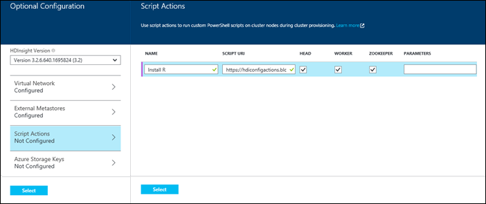
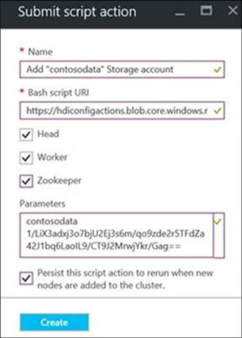
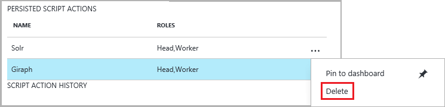

<properties
    pageTitle="HDInsight Cluster mit Skript-Aktionen anpassen | Microsoft Azure"
    description="Erfahren Sie, wie benutzerdefinierte Komponenten HDInsight Linux-basierten Cluster mit Skript-Aktionen hinzufügen. Skript-Aktionen werden Bash, die auf dem Clusterknoten Skripts und zum Anpassen der Cluster-Konfigurations, oder fügen Sie weitere Dienste und Dienstprogramme wie Farbton, Solr oder r verwendet werden können"
    services="hdinsight"
    documentationCenter=""
    authors="Blackmist"
    manager="jhubbard"
    editor="cgronlun"
    tags="azure-portal"/>

<tags
    ms.service="hdinsight"
    ms.workload="big-data"
    ms.tgt_pltfrm="na"
    ms.devlang="na"
    ms.topic="article"
    ms.date="09/06/2016"
    ms.author="larryfr"/>

# Anpassen von Linux-basierten HDInsight Cluster mithilfe der Aktion Skript

HDInsight bietet die Konfigurationsoption aufgerufen **Skriptaktion** , die benutzerdefinierte Skripts aufgerufen, die den Cluster anpassen. Diese Skripts können während der Clustererstellung oder auf einem bereits laufenden Cluster verwendet werden, und werden verwendet, um weitere Komponenten installieren oder Konfiguration Einstellungen ändern.

> [AZURE.NOTE] Die Möglichkeit zur Verwendung von Skript-Aktionen in einem bereits laufenden Cluster ist nur für Linux-basierte HDInsight Cluster verfügbar. Informationen zum Verwenden von Skript-Aktionen mit Windows-basierten Cluster finden Sie unter [Anpassen HDInsight Cluster mithilfe der Aktion "Skript" (Windows)](hdinsight-hadoop-customize-cluster.md).

Skript-Aktionen können auch zum Azure Marketplace als Anwendung HDInsight veröffentlicht werden. Einige der in den Beispielen in diesem Dokument anzeigen, wie Sie die Anwendung HDInsight mithilfe von Skripts Aktion Befehle PowerShell und .NET SDK installieren können. Weitere Informationen zu HDInsight wurden finden Sie unter [Veröffentlichen HDInsight Applications in der Azure Marketplace](hdinsight-apps-publish-applications.md). 

## Grundlegendes zu Skript-Aktionen

Ein Skript-Aktion ist einfach ein Bash Skript, dass Sie einer URL zu und Parameter für, und diese dann auf die HDInsight Cluster-Knoten ausgeführt wurde. Die folgenden sind Merkmale und Features von Skript-Aktionen.

* Müssen auf einem URI gespeichert werden, die aus dem Cluster HDInsight zugegriffen werden kann. Im folgenden sind die möglichen Speicherorte:

    * Ein Blob-Speicher-Konto, die entweder der primäre oder zusätzliche Speicher für den Cluster HDInsight zu berücksichtigen. Da HDInsight Zugriff auf beide der folgenden Typen von Speicherkonten während der Clustererstellung gewährt wird, geben Sie diese eine Möglichkeit, eine Skriptaktion vertraulichen verwenden.
    
    * Ein öffentlich lesbaren URI beispielsweise eine Azure Blob, GitHub, OneDrive, Dropbox usw..
    
    Beispiele für den URI für Skripts gehörende Kehrmatrix Blob Container (öffentlich lesbaren) finden Sie im Abschnitt [Beispiel Skript Aktion Skripts](#example-script-action-scripts) .

* Kann __nur bestimmte Knotentypen ausgeführt__, beispielsweise am Knoten oder Arbeitskollegen Knoten beschränkt werden.

    > [AZURE.NOTE] Bei Verwendung mit HDInsight Premium können Sie angeben, dass das Skript auf den Rand Knoten verwendet werden soll.

* __Beibehalten__ oder __ad-hoc-__möglich.

    __Persisted__ Skripts sind Skripts, die Worker Knoten angewendet werden und werden, automatisch auf neue Knoten erstellt, wenn Sie von einem Cluster Skalierung ausgeführt wurde.

    Ein dauerhaften Skript möglicherweise auch die Änderungen anzuwenden, in einen anderen Knotentyp, z. B. ein am Knoten, aber im Hinblick auf Funktionalität ist der einzige Grund ein Skript beibehalten werden, damit es gilt für neue Worker Knoten erstellt, wenn ein Cluster skaliert ist.

    > [AZURE.IMPORTANT] Dauerhaften Skript-Aktionen müssen einen eindeutigen Namen.

    __Ad-hoc-__ Skripts werden nicht beibehalten; Allerdings können später Höherstufen einer ad-hoc-Skript zu einem dauerhaften Skript, oder Tieferstufen einer dauerhaften Skript an einer ad-hoc-Skript.

    > [AZURE.IMPORTANT] Skript-Aktionen, die während der Clustererstellung verwendet werden automatisch beibehalten.
    >
    > Skripts, die Fail werden nicht beibehalten, auch wenn Sie speziell darauf hinzuweisen, dass sie werden sollen.

* Akzeptieren Sie __Parameter__ , indem Sie das Skript während der Ausführung verwendet werden, können.

* Sind mit ausgeführt wurde __Kevin root__ auf den Clusterknoten.

* Kann über die __Azure-Portal__, __Azure PowerShell__, __Azure CLI__oder __HDInsight.NET SDK__ verwendet werden

    [AZURE.INCLUDE [upgrade-powershell](../../includes/hdinsight-use-latest-powershell-cli-and-dotnet-sdk.md)]

Um zu verstehen, welche Skripts auf einem Cluster angewendet wurden, und klicken Sie bei der Festlegung, dass die ID des Skripts Heraufstufen oder herabstufen, Cluster Verlauf allen Skripts behält die Einträge unterstützen ist.

> [AZURE.IMPORTANT] Gibt es Möglichkeit keine automatische, die durch eine Skriptaktion vorgenommenen Änderungen rückgängig zu machen. Wenn Sie die Effekte eines Skripts umkehren müssen, müssen Sie verstehen, welche Änderungen vorgenommen wurden und manuell kehren Sie sie (oder Bereitstellen eine Skriptaktion, die sie kehrt.)

### Skript für Aktion in den Erstellungsprozess cluster

Skript-Aktionen, die während der Clustererstellung verwendet werden geringfügig von Skripts, die auf einem vorhandenen Cluster Aktionen ausgeführt haben:

* Das Skript wird __automatisch beibehalten__.

* Kann führt zu einem __Fehler__ im Skript den Erstellungsprozess Cluster fehlschlägt.

Das folgende Diagramm veranschaulicht, wenn beim Erstellen der Skriptaktion ausgeführt wird:

![HDInsight Cluster Anpassung und Phasen während der Clustererstellung][img-hdi-cluster-states]

Das Skript wird ausgeführt wurde, wird HDInsight konfiguriert. In dieser Phase das Skript parallel ausgeführt wird, klicken Sie auf die angegebenen Knoten im Cluster und mit Administrator-Zugriffsrechten auf den Knoten ausgeführt wird.

> [AZURE.NOTE] Da das Skript wird mit Stamm Berechtigungsstufe für die Cluster-Knoten ausgeführt, können Sie Vorgänge wie Dienste einschließlich Hadoop-bezogene Dienste starten und Beenden von durchführen. Wenn Sie Dienste beendet haben, müssen Sie sicherstellen, dass der Ambari-Dienst und andere Dienste Hadoop-bezogene ausgeführt werden, bevor das Skript abgeschlossen ist. Diese Dienste sind erfolgreich anhand der Gesundheit und den Status der Cluster, während des Erstellens ist erforderlich.

Während der Clustererstellung können Sie mehrere Skriptaktionen, die aufgerufen werden in der Reihenfolge angeben, in denen sie angegeben wurden.

> [AZURE.IMPORTANT] Skript-Aktionen müssen innerhalb von 60 Minuten durchzuführen, oder sie erklärt werden. Während der Bereitstellung von Cluster das Skript gleichzeitig mit anderen Setup und Konfiguration Prozesse ausgeführt. Induzierten Risikos für Ressourcen wie etwa CPU-Zeit oder Netzwerk Bandbreite kann das Skript zum länger dauern, als in Ihrer Entwicklungsumgebung bedeutet verursachen.
>
> Um die Zeit zu minimieren dauert führen Sie das Skript, Aufgaben wie herunterladen und Kompilieren von Applications aus Quelle zu vermeiden. Stattdessen vorab kompilieren Sie die Anwendung, und speichern Sie die Binärdatei in Azure Blob-Speicher, sodass schnell zum Cluster heruntergeladen werden kann.

###Skript für Aktion in einem laufenden cluster

Im Gegensatz zu Skripts, die während der Clustererstellung eines Fehlers in einem Skript verwendete Aktionen auf einem bereits laufenden Cluster ausgeführt wurde wird nicht automatisch Cluster so ändern Sie einen Ausfall verursacht. Nach Abschluss eines Skripts sollte der Cluster in einen Zustand "ausführen" zurückgeben.

> [AZURE.IMPORTANT] Dies bedeutet nicht, dass Ihre laufende Cluster Skripts immun ist, die falsche Aufgaben ausführen. Beispielsweise könnten ein Skript löschen Dateien erforderlich vom Cluster, Konfiguration ändern, sodass die Dienste nicht usw..
>
> Skripts Aktionen führen mit Administrator-Zugriffsrechten, damit Sie sicherstellen sollten, dass Sie wissen, was bedeutet ein Skript, bevor Sie es auf Ihren Cluster anwenden.

Beim Anwenden eines Skripts auf einem Cluster wird im Cluster Zustand zu ändern, um __akzeptiert__, klicken Sie dann __HDInsight Konfiguration__ __ausgeführt__ und schließlich für erfolgreiche Skripts für die __Ausführung von__ zurück. Der Status des Skripts wird im Verlauf Aktion Skript protokolliert und Hiermit können Sie bestimmen, ob das Skript erfolgreich war oder nicht. Angenommen, die `Get-AzureRmHDInsightScriptActionHistory` PowerShell-Cmdlet zum Anzeigen des Status eines Skripts verwendet werden kann. Es gibt Informationen ähnlich wie der folgende zurück:

    ScriptExecutionId : 635918532516474303
    StartTime         : 2/23/2016 7:40:55 PM
    EndTime           : 2/23/2016 7:41:05 PM
    Status            : Succeeded

> [AZURE.NOTE] Wenn Sie das Kennwort für Benutzer (Administrator) geändert haben, nachdem der Cluster erstellt wurde, kann dies Skript führen, die Aktionen für diesen Cluster zum Fehlschlagen ausgeführt haben. Wenn Sie die Ziel-Knoten Worker Skriptaktionen dauerhaften haben, können diese fehlschlagen, wenn Sie, dass Knoten zum Cluster durch Ändern der Größe Vorgänge hinzufügen.

## Beispiel für Aktion Skript Skripts

Skript Aktion Skripts können aus dem Azure-Portal Azure PowerShell, Azure CLI oder HDInsight .NET SDK verwendet werden. HDInsight bietet Skripts, um die folgenden Komponenten auf HDInsight Cluster zu installieren:

Namen | Skript
----- | -----
**Hinzufügen eines Kontos Azure-Speicher** | https://hdiconfigactions.BLOB.Core.Windows.NET/linuxaddstorageaccountv01/Add-Storage-Account-v01.sh. Siehe [Anwenden einer Aktion Skript zu einer laufenden Cluster](#apply-a-script-action-to-a-running-cluster).
**Installieren Sie Farbton** | https://hdiconfigactions.BLOB.Core.Windows.NET/linuxhueconfigactionv02/Install-Hue-uber-v02.sh. [Installieren und verwenden Sie Cluster Farbton auf HDInsight](hdinsight-hadoop-hue-linux.md)finden Sie unter.
**Installieren von R** | https://hdiconfigactions.BLOB.Core.Windows.NET/linuxrconfigactionv01/r-Installer-v01.sh. Finden Sie unter [Installieren und Verwenden von R auf HDInsight Cluster](hdinsight-hadoop-r-scripts-linux.md).
**Installieren von Solr** | https://hdiconfigactions.BLOB.Core.Windows.NET/linuxsolrconfigactionv01/solr-Installer-v01.sh. [Installieren und verwenden Sie Cluster Solr auf HDInsight](hdinsight-hadoop-solr-install-linux.md)finden Sie unter.
**Installieren von Giraph** | https://hdiconfigactions.BLOB.Core.Windows.NET/linuxgiraphconfigactionv01/giraph-Installer-v01.sh. [Installieren und verwenden Sie Cluster Giraph auf HDInsight](hdinsight-hadoop-giraph-install-linux.md)finden Sie unter.
| **Laden Sie vordefinierte Struktur Bibliotheken** | https://hdiconfigactions.BLOB.Core.Windows.NET/linuxsetupcustomhivelibsv01/Setup-customhivelibs-v01.sh. Finden Sie unter [Hinzufügen von Struktur Bibliotheken auf HDInsight Cluster](hdinsight-hadoop-add-hive-libraries.md) |

## Verwenden Sie eine Aktion Skript während der Clustererstellung

Dieser Abschnitt enthält Beispiele auf die verschiedenen Verwendungsmöglichkeiten Skript-Aktionen beim Erstellen einer HDInsight Cluster - aus dem Azure-Portal mithilfe einer Vorlage Azure Ressourcenmanager, mithilfe der PowerShell-CMDlets und .NET SDK verwenden.

### Verwenden Sie eine Aktion Skript während der Clustererstellung vom Azure-portal

1. Starten Sie einen Cluster erstellen, wie bei [Erstellen Hadoop Cluster in HDInsight](hdinsight-provision-clusters.md#portal)beschrieben.

2. Klicken Sie unter __Optionale Konfiguration__für das Blade **Skript-Aktionen** auf **Skriptaktion hinzufügen** , um die Details zu der Skriptaktion angeben wie unten dargestellt:

    

  	| Eigenschaft | Wert |
  	| -------- | ----- |
  	| Namen | Geben Sie einen Namen für die Skriptaktion ein. |
  	| URI-Skript | Geben Sie den URI an das Skript, das zum Anpassen des Clusters aufgerufen wird. |
  	| Kopf/Worker | Geben Sie die Knoten (**Kopf**, **Worker**oder **ZooKeeper**), auf dem das Skript Anpassung ausgeführt wird. |
  	| Parameter | Geben Sie den Parameter aus, wenn das Skript erforderlich. |

    Drücken Sie EINGABETASTE, um mehrere Skriptaktion zum Installieren von mehreren Komponenten auf dem Cluster hinzuzufügen.

3. Klicken Sie auf **auswählen** , um speichern Sie die Konfiguration, und fahren Sie mit der Clustererstellung.

### Verwenden Sie eine Aktion Skripts auf Grundlage von Vorlagen Azure Ressourcenmanager

In diesem Abschnitt verwenden wir Azure Ressourcenmanager Vorlagen zum Erstellen eines HDInsight Clusters und auch eine Skriptaktion verwenden, um benutzerdefinierte Komponenten (in diesem Beispiel R) auf dem Cluster installieren. Dieser Abschnitt enthält eine Beispielvorlage, um einen Cluster mithilfe der Skriptaktion zu erstellen.

> [AZURE.NOTE] Führen Sie die Schritte in diesem Abschnitt vor einen Cluster mithilfe einer Skriptaktion erstellen. Ein Beispiel für einen Cluster aus einer Vorlage mit einer HDInsight Anwendung erstellen finden Sie unter [Installieren von benutzerdefinierten HDInsight Applikationen](hdinsight-apps-install-custom-applications.md).

#### Vorbemerkung

* Informationen zum Konfigurieren einer Arbeitsstationen zum Ausführen von HDInsight-Powershell-Cmdlets finden Sie unter [Installieren und Konfigurieren von Azure PowerShell](../powershell-install-configure.md).
* Anweisungen zum Erstellen von Vorlagen finden Sie unter [Azure Ressourcenmanager Authoring-Vorlagen](../resource-group-authoring-templates.md).
* Wenn Sie nicht zuvor Azure PowerShell mit Ressourcenmanager verwendet haben, finden Sie unter [Verwenden von Azure PowerShell Azure Ressourcenmanager](../powershell-azure-resource-manager.md).

#### Erstellen Sie mithilfe der Aktion Skript Cluster

1. Kopieren Sie die folgende Vorlage an einem Speicherort auf Ihrem Computer. Diese Vorlage installiert Giraph auf die Headnodes sowie Worker Knoten im Cluster. Sie können auch feststellen, wenn die Vorlage JSON gültig ist. Fügen Sie den Inhalt Ihrer Vorlage in [JSONLint](http://jsonlint.com/), eine online JSON-Tool für die Überprüfung an.

            {
            "$schema": "http://schema.management.azure.com/schemas/2015-01-01/deploymentTemplate.json#",
            "contentVersion": "1.0.0.0",
            "parameters": {
                "clusterLocation": {
                    "type": "string",
                    "defaultValue": "West US",
                    "allowedValues": [ "West US" ]
                },
                "clusterName": {
                    "type": "string"
                },
                "clusterUserName": {
                    "type": "string",
                    "defaultValue": "admin"
                },
                "clusterUserPassword": {
                    "type": "securestring"
                },
                "sshUserName": {
                    "type": "string",
                    "defaultValue": "username"
                },
                "sshPassword": {
                    "type": "securestring"
                },
                "clusterStorageAccountName": {
                    "type": "string"
                },
                "clusterStorageAccountResourceGroup": {
                    "type": "string"
                },
                "clusterStorageType": {
                    "type": "string",
                    "defaultValue": "Standard_LRS",
                    "allowedValues": [
                        "Standard_LRS",
                        "Standard_GRS",
                        "Standard_ZRS"
                    ]
                },
                "clusterStorageAccountContainer": {
                    "type": "string"
                },
                "clusterHeadNodeCount": {
                    "type": "int",
                    "defaultValue": 1
                },
                "clusterWorkerNodeCount": {
                    "type": "int",
                    "defaultValue": 2
                }
            },
            "variables": {
            },
            "resources": [
                {
                    "name": "[parameters('clusterStorageAccountName')]",
                    "type": "Microsoft.Storage/storageAccounts",
                    "location": "[parameters('clusterLocation')]",
                    "apiVersion": "2015-05-01-preview",
                    "dependsOn": [ ],
                    "tags": { },
                    "properties": {
                        "accountType": "[parameters('clusterStorageType')]"
                    }
                },
                {
                    "name": "[parameters('clusterName')]",
                    "type": "Microsoft.HDInsight/clusters",
                    "location": "[parameters('clusterLocation')]",
                    "apiVersion": "2015-03-01-preview",
                    "dependsOn": [
                        "[concat('Microsoft.Storage/storageAccounts/', parameters('clusterStorageAccountName'))]"
                    ],
                    "tags": { },
                    "properties": {
                        "clusterVersion": "3.2",
                        "osType": "Linux",
                        "clusterDefinition": {
                            "kind": "hadoop",
                            "configurations": {
                                "gateway": {
                                    "restAuthCredential.isEnabled": true,
                                    "restAuthCredential.username": "[parameters('clusterUserName')]",
                                    "restAuthCredential.password": "[parameters('clusterUserPassword')]"
                                }
                            }
                        },
                        "storageProfile": {
                            "storageaccounts": [
                                {
                                    "name": "[concat(parameters('clusterStorageAccountName'),'.blob.core.windows.net')]",
                                    "isDefault": true,
                                    "container": "[parameters('clusterStorageAccountContainer')]",
                                    "key": "[listKeys(resourceId('Microsoft.Storage/storageAccounts', parameters('clusterStorageAccountName')), '2015-05-01-preview').key1]"
                                }
                            ]
                        },
                        "computeProfile": {
                            "roles": [
                                {
                                    "name": "headnode",
                                    "targetInstanceCount": "[parameters('clusterHeadNodeCount')]",
                                    "hardwareProfile": {
                                        "vmSize": "Large"
                                    },
                                    "osProfile": {
                                        "linuxOperatingSystemProfile": {
                                            "username": "[parameters('sshUserName')]",
                                            "password": "[parameters('sshPassword')]"
                                        }
                                    },
                                    "scriptActions": [
                                        {
                                            "name": "installGiraph",
                                            "uri": "https://hdiconfigactions.blob.core.windows.net/linuxgiraphconfigactionv01/giraph-installer-v01.sh",
                                            "parameters": ""
                                        }
                                    ]
                                },
                                {
                                    "name": "workernode",
                                    "targetInstanceCount": "[parameters('clusterWorkerNodeCount')]",
                                    "hardwareProfile": {
                                        "vmSize": "Large"
                                    },
                                    "osProfile": {
                                        "linuxOperatingSystemProfile": {
                                            "username": "[parameters('sshUserName')]",
                                            "password": "[parameters('sshPassword')]"
                                        }
                                    },
                                    "scriptActions": [
                                        {
                                            "name": "installR",
                                            "uri": "https://hdiconfigactions.blob.core.windows.net/linuxrconfigactionv01/r-installer-v01.sh",
                                            "parameters": ""
                                        }
                                    ]
                                }
                            ]
                        }
                    }
                }
            ],
            "outputs": {
                "cluster":{
                    "type" : "object",
                    "value" : "[reference(resourceId('Microsoft.HDInsight/clusters',parameters('clusterName')))]"
                }
            }
        }

2. Starten Sie Azure PowerShell und melden Sie sich bei Ihrem Konto Azure ein. Nach der Bereitstellung Ihrer Anmeldeinformationen, gibt der Befehl Informationen zu Ihrem Konto an.

        Add-AzureRmAccount

        Id                             Type       ...
        --                             ----
        someone@example.com            User       ...

3. Wenn Sie mehrere Abonnements verfügen, geben Sie die Abonnement-Id, die Sie für die Bereitstellung verwenden möchten.

        Select-AzureRmSubscription -SubscriptionID <YourSubscriptionId>

    > [AZURE.NOTE] Sie können `Get-AzureRmSubscription` zum Abrufen einer Liste aller Abonnements, die mit Ihrem Konto, wozu auch die Abonnement-Id für jedes ausgeschlossene verknüpft ist.

5. Wenn Sie nicht über eine vorhandene Ressourcengruppe verfügen, erstellen Sie eine neue Ressourcengruppe. Geben Sie den Namen der Ressourcengruppe und Speicherort, die Sie für Ihre Lösung benötigen. Es wird eine Zusammenfassung der neuen Ressourcengruppe zurückgegeben.

        New-AzureRmResourceGroup -Name myresourcegroup -Location "West US"

        ResourceGroupName : myresourcegroup
        Location          : westus
        ProvisioningState : Succeeded
        Tags              :
        Permissions       :
                            Actions  NotActions
                            =======  ==========
                            *
        ResourceId        : /subscriptions/######/resourceGroups/ExampleResourceGroup

6. Zum Erstellen einer neuen bereitstellungs für Ihre Ressourcengruppe führen Sie den Befehl **Neu-AzureRmResourceGroupDeployment** , und geben Sie die erforderlichen Parameter. Die Parameter werden einen Namen für die Bereitstellung, den Namen der Ressourcengruppe und den Pfad oder URL der Vorlage enthalten, die Sie erstellt haben. Wenn Ihre Vorlage alle Parameter erforderlich sind, müssen Sie auch diese Parameter übergeben. In diesem Fall sind die Skriptaktion R auf dem Cluster installieren keine Parameter erforderlich.

        New-AzureRmResourceGroupDeployment -Name mydeployment -ResourceGroupName myresourcegroup -TemplateFile <PathOrLinkToTemplate>

    Sie werden aufgefordert werden, um Werte für die Parameter in der Vorlage definierten bereitzustellen.

7. Wenn die Ressourcengruppe bereitgestellt wurde, wird eine Zusammenfassung der Bereitstellung angezeigt.

          DeploymentName    : mydeployment
          ResourceGroupName : myresourcegroup
          ProvisioningState : Succeeded
          Timestamp         : 8/17/2015 7:00:27 PM
          Mode              : Incremental
          ...

8. Wenn Ihre Bereitstellung fehlschlägt, können Sie die folgenden Cmdlets verwenden, um Informationen zu den Fehlern erhalten.

        Get-AzureRmResourceGroupDeployment -ResourceGroupName myresourcegroup -ProvisioningState Failed

### Verwenden Sie eine Aktion Skript während der Clustererstellung aus Azure PowerShell

In diesem Abschnitt verwenden wir das Cmdlet [AzureRmHDInsightScriptAction hinzufügen](https://msdn.microsoft.com/library/mt603527.aspx) , um Skripts aufrufen, indem Sie die Aktion Skript zum Anpassen eines Clusters verwenden. Stellen Sie bevor Sie fortfahren sicher, dass Sie installiert und Azure PowerShell konfiguriert haben. Informationen zum Konfigurieren einer Arbeitsstationen zum Ausführen von HDInsight-PowerShell-Cmdlets finden Sie unter [Installieren und Konfigurieren von Azure PowerShell](../powershell-install-configure.md).

Führen Sie die folgenden Schritte aus:

1. Öffnen Sie die Azure PowerShell-Konsole, und verwenden Sie die folgenden zum Anmelden bei Ihrem Abonnement Azure und deklarieren Sie einige PowerShell-Variablen:

        # LOGIN TO ZURE
        Login-AzureRmAccount

        # PROVIDE VALUES FOR THESE VARIABLES
        $subscriptionId = "<SubscriptionId>"        # ID of the Azure subscription
        $clusterName = "<HDInsightClusterName>"         # HDInsight cluster name
        $storageAccountName = "<StorageAccountName>"    # Azure storage account that hosts the default container
        $storageAccountKey = "<StorageAccountKey>"      # Key for the storage account
        $containerName = $clusterName
        $location = "<MicrosoftDataCenter>"             # Location of the HDInsight cluster. It must be in the same data center as the storage account.
        $clusterNodes = <ClusterSizeInNumbers>          # The number of nodes in the HDInsight cluster.
        $resourceGroupName = "<ResourceGroupName>"      # The resource group that the HDInsight cluster will be created in

2. Geben Sie die Konfigurationswerte (z. B. Knoten im Cluster) und den Standardspeicher verwendet werden.

        # SPECIFY THE CONFIGURATION OPTIONS
        Select-AzureRmSubscription -SubscriptionId $subscriptionId
        $config = New-AzureRmHDInsightClusterConfig
        $config.DefaultStorageAccountName="$storageAccountName.blob.core.windows.net"
        $config.DefaultStorageAccountKey=$storageAccountKey

3. Verwenden Sie Cmdlet **AzureRmHDInsightScriptAction hinzufügen** , um das Skript aufzurufen. Im folgende Beispiel wird ein Skript, das auf dem Cluster Giraph-Installationen verwendet:

        # INVOKE THE SCRIPT USING THE SCRIPT ACTION FOR HEADNODE AND WORKERNODE
        $config = Add-AzureRmHDInsightScriptAction -Config $config -Name "Install Giraph"  -NodeType HeadNode -Uri https://hdiconfigactions.blob.core.windows.net/linuxgiraphconfigactionv01/giraph-installer-v01.sh
        $config = Add-AzureRmHDInsightScriptAction -Config $config -Name "Install Giraph"  -NodeType WorkerNode -Uri https://hdiconfigactions.blob.core.windows.net/linuxgiraphconfigactionv01/giraph-installer-v01.sh

    Das **Hinzufügen-AzureRmHDInsightScriptAction** -Cmdlet weist die folgenden Parameter:

  	| Parameter | Definition |
  	| --------- | ---------- |
  	| Config | Konfigurationsobjekt Script Aktionsinformationen hinzugefügt wird. |
  	| Namen | Name der Skriptaktion. |
  	| NodeType | Gibt den Knoten, auf dem das Skript Anpassung ausgeführt wird. Die gültigen Werte sind **HeadNode** (nach der Installation auf dem am Knoten), **WorkerNode** (zu installieren, klicken Sie auf alle Datenknoten), oder **ZookeeperNode** (zu installieren, auf dem Zookeeper Knoten). |
  	| Parameter | Parameter, indem Sie das Skript erforderlich. |
  	| URI | Gibt den URI an das Skript, das ausgeführt wird. |

4. Festlegen des Administrator/HTTPS-Benutzers für den Cluster an:

        $httpCreds = get-credential

    Wenn Sie dazu aufgefordert werden, geben Sie den Namen 'Admin', und geben Sie ein Kennwort ein.

5. Festlegen Sie die SSH-Anmeldeinformationen:

        $sshCreds = get-credential

    Wenn Sie dazu aufgefordert werden, geben Sie die SSH-Benutzernamen und das Kennwort ein. Wenn Sie das Konto SSH mit einem Zertifikat anstelle eines Kennworts sichern möchten, verwenden Sie ein leeres Kennwort und festlegen `$sshPublicKey` an den Inhalt des Zertifikats öffentlichen Schlüssels Sie verwenden möchten. Beispiel:

        $sshPublicKey = Get-Content .\path\to\public.key -Raw

4. Erstellen Sie schließlich den Cluster:

        New-AzureRmHDInsightCluster -config $config -clustername $clusterName -DefaultStorageContainer $containerName -Location $location -ResourceGroupName $resourceGroupName -ClusterSizeInNodes $clusterNodes -HttpCredential $httpCreds -SshCredential $sshCreds -OSType Linux

    Wenn Sie Ihr Konto SSH gesichert einen öffentlichen Schlüssel verwenden, müssen Sie auch angeben `-SshPublicKey $sshPublicKey` als Parameter.

Es kann mehrere Minuten dauern, bevor der Cluster erstellt wird.

### Verwenden Sie eine Aktion Skript während der Clustererstellung aus dem HDInsight .NET SDK

HDInsight .NET SDK stellt Clientbibliotheken, die von einer HDInsight konzipiert erleichtert. Einer Stichprobe Code finden Sie unter [Erstellen von Linux-basierten Cluster in HDInsight .NET SDK verwenden](hdinsight-hadoop-create-linux-clusters-dotnet-sdk.md#use-script-action).

## Anwenden einer Aktion Skript zu einer laufenden cluster

Dieser Abschnitt enthält Beispiele für die verschiedenen Verfahren zum Anwenden von Skript-Aktionen zu einem laufenden HDInsight Cluster; verwenden aus dem Azure-Portal PowerShell-CMDlets, die Plattformen Azure CLI und Verwenden der .NET SDK aus. Die Aktion dauerhaften Skript, die in diesem Abschnitt verwendeten hinzugefügt einer laufenden Cluster ein vorhandenes Azure-Speicher-Konto. Sie können auch andere Skriptaktionen, finden Sie unter [Beispiel Skriptaktion Skripts](#example-script-action-scripts)verwenden.

### Anwenden einer Aktion Skript zu einer laufenden Cluster vom Azure-portal

1. Wählen Sie im [Portal Azure](https://portal.azure.com)-HDInsight Cluster aus.

2. Wählen Sie aus dem HDInsight Cluster Blade die Kachel __Skript-Aktionen__ aus.

    

    > [AZURE.NOTE] Sie können auch __Alle Einstellungen__ auswählen und wählen Sie dann aus dem Blade Einstellungen __Skript-Aktionen__ .

4. Wählen Sie oben auf der das Skriptaktionen Blade __Senden Sie neue__.

    

5. Geben Sie die folgenden Informationen aus dem Blade Skriptaktion hinzufügen.

    * __Name__: der Anzeigename für diese Aktion Skript verwendet werden soll. In diesem Beispiel `Add Storage account`.
    * __Skript-URI__: der URI für das Skript. In diesem Beispiel`https://hdiconfigactions.blob.core.windows.net/linuxaddstorageaccountv01/add-storage-account-v01.sh`
    * __Kopf__, __Worker__und __Zookeeper__: Überprüfen Sie die Knoten, die auf dieses Skript angewendet werden soll. In diesem Beispiel werden Kopf, Worker und Zookeeper überprüft.
    * __Parameter__: Wenn das Skript Parameter akzeptiert, geben Sie sie hier. Geben Sie in diesem Beispiel den Kontonamen Speicher und die Speicher kontoschlüssel:

        

        Klicken Sie auf den Screenshot `contosodata` ein vorhandenes Kontos Azure-Speicher, wird die zweite Zeile ist die kontoschlüssel Speicher.
    * __PERSISTED__: Überprüfen Sie diesen Eintrag aus, wenn Sie das Skript beibehalten werden, damit sie auf neue Worker Knoten angewendet wird, wenn Sie von der Cluster skalieren möchten.

6. Verwenden Sie schließlich die Schaltfläche __Erstellen__ , um das Skript zum Cluster anzuwenden.

### Anwenden einer Aktion Skript zu einer laufenden Cluster aus Azure PowerShell

Stellen Sie bevor Sie fortfahren sicher, dass Sie installiert und Azure PowerShell konfiguriert haben. Informationen zum Konfigurieren einer Arbeitsstationen zum Ausführen von HDInsight-PowerShell-Cmdlets finden Sie unter [Installieren und Konfigurieren von Azure PowerShell](../powershell-install-configure.md).

1. Öffnen Sie die Azure PowerShell-Konsole, und verwenden Sie die folgenden zum Anmelden bei Ihrem Abonnement Azure und deklarieren Sie einige PowerShell-Variablen:

        # LOGIN TO ZURE
        Login-AzureRmAccount

        # PROVIDE VALUES FOR THESE VARIABLES
        $clusterName = "<HDInsightClusterName>"         # HDInsight cluster name
        $saName = "<ScriptActionName>"                  # Name of the script action
        $saURI = "<URI to the script>"                  # The URI where the script is located
        $nodeTypes = "headnode", "workernode"
        
    > [AZURE.NOTE] Wenn einen HDInsight Premium Cluster verwenden, können eine Nodetype der `"edgenode"` zum Ausführen des Skripts auf den Rand Knoten.

2. Verwenden Sie den folgenden Befehl, um das Skript zum Cluster anzuwenden:

        Submit-AzureRmHDInsightScriptAction -ClusterName $clusterName -Name $saName -Uri $saURI -NodeTypes $nodeTypes -PersistOnSuccess

    Nachdem Sie der Auftrag abgeschlossen ist, sollte ähnlich wie der folgende Informationen angezeigt werden:

        OperationState  : Succeeded
        ErrorMessage    :
        Name            : Giraph
        Uri             : https://hdiconfigactions.blob.core.windows.net/linuxgiraphconfigactionv01/giraph-installer-v01.sh
        Parameters      :
        NodeTypes       : {HeadNode, WorkerNode}

### Anwenden einer Aktion Skript zu einer laufenden Cluster über die Befehlszeile Azure

Stellen Sie bevor Sie fortfahren sicher, dass Sie installiert und die Azure CLI konfiguriert haben. Weitere Informationen finden Sie unter [Installieren der CLI Azure](../xplat-cli-install.md).

    [AZURE.INCLUDE [use-latest-version](../../includes/hdinsight-use-latest-cli.md)] 

1. Öffnen Sie eine Shell-Sitzung, Terminal, Eingabeaufforderungsfenster oder andere Befehlszeilenoptionen für Ihr System, und verwenden Sie den folgenden Befehl aus, um zu Ressourcenmanager Azure-Modus wechseln.

        azure config mode arm

2. Verwenden Sie die folgenden mit Ihrem Abonnement Azure authentifiziert.

        azure login

3. Verwenden Sie den folgenden Befehl zum Anwenden einer Skriptaktion zu einer laufenden cluster

        azure hdinsight script-action create <clustername> -g <resourcegroupname> -n <scriptname> -u <scriptURI> -t <nodetypes>

    Wenn Sie Parameter für diesen Befehl nicht angeben, werden Sie für diese aufgefordert werden. Wenn Sie das Skript mit angeben `-u` akzeptiert Parameter, geben Sie diese mit der `-p` Parameter.

    Gültige __Nodetypes__ sind __Headnode__, __Workernode__und __Zookeeper__. Wenn Sie das Skript auf mehrere Typen von Knoten angewendet werden soll, geben Sie die Dateitypen, die durch Trennzeichen getrennte ein ';'. Beispielsweise `-n headnode;workernode`.

    Behalten Sie das Skript hinzufügen der `--persistOnSuccess`. Sie können auch das Skript zu einem späteren Zeitpunkt beibehalten, mithilfe von `azure hdinsight script-action persisted set`.
    
    Nachdem Sie der Auftrag abgeschlossen ist, erhalten Sie ähnlich wie der folgende Ausgabe.
    
        info:    Executing command hdinsight script-action create
        + Executing Script Action on HDInsight cluster
        data:    Operation Info
        data:    ---------------
        data:    Operation status:
        data:    Operation ID:  b707b10e-e633-45c0-baa9-8aed3d348c13
        info:    hdinsight script-action create command OK

### Anwenden einer Aktion Skript zu einer laufenden Cluster mit REST-API

Finden Sie unter [Ausführen von Skript-Aktionen in einem laufenden Cluster](https://msdn.microsoft.com/library/azure/mt668441.aspx).
### Anwenden einer Aktion Skript zu einer laufenden Cluster aus dem HDInsight .NET SDK

Ein Beispiel für .NET SDK zum Anwenden von Skripts zu einem Cluster verwenden finden Sie unter [https://github.com/Azure-Samples/hdinsight-dotnet-script-action](https://github.com/Azure-Samples/hdinsight-dotnet-script-action).

## Zeigen Sie Versionsverlauf an, Höherstufen Sie und Tieferstufen Sie Skript-Aktionen

### Verwenden des Azure-Portals

1. Wählen Sie im [Portal Azure](https://portal.azure.com)-HDInsight Cluster aus.

2. Wählen Sie aus dem HDInsight Cluster Blade __Einstellungen__aus.

    

3. Wählen Sie aus dem Blade Einstellungen __Skript-Aktionen__aus.

    

4. Klicken Sie auf das Skriptaktionen Blade wird eine Liste der dauerhaften Skripts sowie einen Verlauf der Skripts auf den Cluster angewendet angezeigt. In den folgenden Screenshot können Sie sehen, dass das Skript wurde Solr auf diesem Cluster ausgeführt wurde, aber keine Skript-Aktionen gespeichert wurden.

    

5. Des Verlaufs ein Skripts auswählen, wird das Blade Eigenschaften für dieses Skript angezeigt. Zwischen dem oberen Rand der Blade werden soll können Sie das Skript erneut ausführen oder Stufen Sie ihn.

    

6. Sie können auch die __...__ rechts neben der Einträge auf das Skriptaktionen Blade Aktionen ausführen, wie zum Beispiel erneut ausführen, beibehalten oder löschen (für permanenten Aktionen).

    

### Mithilfe der PowerShell Azure

| Gehen Sie wie folgt... | An... |
| ----- | ----- |
| Get-AzureRmHDInsightPersistedScriptAction | Abrufen von Informationen zu dauerhaften Skript-Aktionen |
| Get-AzureRmHDInsightScriptActionHistory | Abrufen der Verlauf Skript-Aktionen, die auf dem Cluster oder die Details für ein bestimmtes Skript angewendet |
| Set-AzureRmHDInsightPersistedScriptAction | Stuft eine ad-hoc-Skriptaktion zu einem dauerhaften Skriptaktion |
| Entfernen-AzureRmHDInsightPersistedScriptAction | Stuft eine dauerhaften Skript für Aktion in einer ad-hoc-Aktion |

> [AZURE.IMPORTANT] Verwenden von `Remove-AzureRmHDInsightPersistedScriptAction` unterstützt nicht die Aktionen ausgeführt werden, indem Sie ein Skript rückgängig, die sie nur die dauerhaften Kennzeichnung entfernt, sodass das Skript wird nicht ausgeführt werden, klicken Sie auf neue Worker Knoten zum Cluster hinzugefügt.

Das folgende Beispielskript veranschaulicht, wie mit der Cmdlets Höherstufen, und klicken Sie dann ein Skript Tieferstufen.

    # Get a history of scripts
    Get-AzureRmHDInsightScriptActionHistory -ClusterName mycluster

    # From the list, we want to get information on a specific script
    Get-AzureRmHDInsightScriptActionHistory -ClusterName mycluster -ScriptExecutionId 635920937765978529

    # Promote this to a persisted script
    # Note: the script must have a unique name to be promoted
    # if the name is not unique, you will receive an error
    Set-AzureRmHDInsightPersistedScriptAction -ClusterName mycluster -ScriptExecutionId 635920937765978529

    # Demote the script back to ad hoc
    # Note that demotion uses the unique script name instead of
    # execution ID.
    Remove-AzureRmHDInsightPersistedScriptAction -ClusterName mycluster -Name "Install Giraph"

### Verwendung der Azure CLI

| Gehen Sie wie folgt... | An... |
| ----- | ----- |
| `azure hdinsight script-action persisted list <clustername>` | Abrufen einer Liste von dauerhaften Skript-Aktionen |
| `azure hdinsight script-action persisted show <clustername> <scriptname>` | Abrufen von Informationen zu einer bestimmten dauerhaften Skript-Aktionen |
| `azure hdinsight script-action history list <clustername>` | Abrufen der Verlauf Skriptaktionen, die mit dem Cluster angewendet |
| `azure hdinsight script-action history show <clustername> <scriptname>` | Abrufen von Informationen zu einer bestimmten Skript-Aktionen |
| `azure hdinsight script action persisted set <clustername> <scriptexecutionid>` | Stuft eine ad-hoc-Skriptaktion zu einem dauerhaften Skriptaktion |
| `azure hdinsight script-action persisted delete <clustername> <scriptname>` | Stuft eine dauerhaften Skript für Aktion in einer ad-hoc-Aktion |

> [AZURE.IMPORTANT] Verwenden von `azure hdinsight script-action persisted delete` unterstützt nicht die Aktionen ausgeführt werden, indem Sie ein Skript rückgängig, die sie nur die dauerhaften Kennzeichnung entfernt, sodass das Skript wird nicht ausgeführt werden, klicken Sie auf neue Worker Knoten zum Cluster hinzugefügt.

### Verwenden von .NET SDK HDInsight

Ein Beispiel für .NET SDK zum Abrufen von Skript Verlauf aus einem Cluster verwenden Höherstufen Sie oder Tieferstufen Sie Skripts, finden Sie unter [https://github.com/Azure-Samples/hdinsight-dotnet-script-action](https://github.com/Azure-Samples/hdinsight-dotnet-script-action).

> [AZURE.NOTE] Darüber hinaus wird veranschaulicht, wie Sie eine HDInsight-Anwendung, die mit dem .NET SDK installieren.

## Behandlung von Problemen

Sie können Ambari Web-Benutzeroberfläche verwenden, um von Skript-Aktionen protokollierten Informationen anzuzeigen. Wenn Sie das Skript verwendet wurde cluster-während der Erstellung und Clustererstellung ist aufgrund eines Fehlers im Skript, die Protokolle stehen auch in der Speicher Standardkonto Cluster zugeordnet. Dieser Abschnitt enthält Informationen, wie Sie die Protokolle verwenden diese beiden Optionen abrufen.

### Verwenden der Ambari Web-Benutzeroberfläche

1. Navigieren Sie in Ihrem Browser zu https://CLUSTERNAME.azurehdinsight.net. Ersetzen Sie CLUSTERNAME mit dem Namen der HDInsight Cluster ein.

    Wenn Sie dazu aufgefordert werden, geben Sie den Kontonamen "Administrator" (Administrator) und das Kennwort für den Cluster ein. Möglicherweise müssen Sie Administrator-Anmeldeberechtigungen in einem Webformular erneut eingeben.

2. Wählen Sie den Eintrag __Ops__ aus der Leiste am oberen Rand der Seite aus. Dadurch wird eine Liste der aktuelle und vorhergehende Operationen auf Cluster erfolgt über Ambari angezeigt.

    

3. Suchen Sie die Einträge, die __Ausführen\_Customscriptaction__ in der Spalte __Operations__ . Diese werden erstellt, wenn das Skript-Aktionen ausgeführt werden.

    

    Wählen Sie diesen Eintrag aus, und durch die Links zum Anzeigen der STDOUT und STDERR Ausgabe generiert, wenn das Skript wurde Drilldown ausgeführt haben, auf dem Cluster.

### Access-Protokolle vom Standardkonto Speicher

Wenn der Cluster aufgrund eines Fehlers in Skriptaktion konnte nicht erstellt, können das Skript Aktion Protokolle weiterhin direkt vom Speicher Standardkonto Cluster zugeordnet zugegriffen werden.

* Die Protokolle Speicher finden Sie unter `\STORAGE_ACOCUNT_NAME\DEFAULT_CONTAINER_NAME\custom-scriptaction-logs\CLUSTER_NAME\DATE`.

    

    Klicken Sie darunter werden die Protokolle für Headnode, Workernode und Zookeeper Knoten separat angezeigt. Einige Beispiele für sind:
    * **Headnode** - `<uniqueidentifier>AmbariDb-hn0-<generated_value>.cloudapp.net`
    * **Worker Knoten** - `<uniqueidentifier>AmbariDb-wn0-<generated_value>.cloudapp.net`
    * **Zookeeper Knoten** - `<uniqueidentifier>AmbariDb-zk0-<generated_value>.cloudapp.net`

* Alle Stdout und Stderr des entsprechenden Hosts wird mit dem Speicherkonto hochgeladen. Es ist eine **Ausgabe -\*txt** und **Fehler -\*txt** für jede Skriptaktion. Die Ausgabe-*.txt-Datei enthält Informationen zu den URI des Skripts, das auf dem Host ausgeführt haben. Beispielsweise

        'Start downloading script locally: ', u'https://hdiconfigactions.blob.core.windows.net/linuxrconfigactionv01/r-installer-v01.sh'

* Es ist möglich, einen Skript Aktion Cluster wiederholt mit demselben Namen zu erstellen. In diesem Fall können Sie die relevanten Protokolle basierend auf den Ordnernamen Datum unterscheiden. Beispielsweise wird die Ordnerstruktur für einen Cluster (MeinCluster) auf ein anderes Datum erstellt werden:
    * `\STORAGE_ACOCUNT_NAME\DEFAULT_CONTAINER_NAME\custom-scriptaction-logs\mycluster\2015-10-04`
    * `\STORAGE_ACOCUNT_NAME\DEFAULT_CONTAINER_NAME\custom-scriptaction-logs\mycluster\2015-10-05`

* Wenn Sie einen Skript Aktion Cluster mit demselben Namen am gleichen Tag erstellen, können Sie das eindeutige Präfix verwenden, identifizieren können die entsprechenden Protokolldateien.

* Wenn Sie einen Cluster am Ende des Tages erstellen, ist es möglich, dass die Protokolldateien über zwei Tage erstrecken. In diesem Fall sehen Sie zwei verschiedene Datum Ordner für den gleichen Cluster.

* Hochladen von Protokolldateien an den standardmäßigen Container kann bis zu 5 Minuten, insbesondere für große Cluster dauern. Ja, wenn Sie die Protokolle zugreifen möchten, sollten Sie nicht sofort Cluster löschen, wenn eine Skriptaktion fehlschlägt.

## Unterstützung für Open Source-Software auf HDInsight Cluster verwendet

Der Microsoft Azure HDInsight-Dienst ist eine flexible Plattform, die Sie big Data Applications in der Cloud mithilfe einer Netz von Open Source-Technologien um Hadoop gebildeten erstellen kann. Microsoft Azure bietet eine allgemeine Grad der Unterstützung für Open Source-Technologien wie im Abschnitt **Unterstützen Bereich** der [Azure unterstützen häufig gestellte Fragen zur Website](https://azure.microsoft.com/support/faq/)erläutert. Der Dienst HDInsight bietet eine zusätzliche Grad der Unterstützung für einige Komponenten, wie unten beschrieben.

Es gibt zwei Arten von Open Source-Komponenten, die im Dienst HDInsight verfügbar sind:

- **Integrierte Komponenten** – diese Komponenten auf HDInsight Cluster vorinstalliert werden und Kernfunktionalität der Cluster bereitstellen. Beispielsweise werden aus Ressourcen-Manager die Struktur-Abfragesprache (HiveQL) und der Mahout-Bibliothek zu dieser Kategorie gehören. Eine vollständige Liste der Clusterkomponenten steht in [Neuigkeiten in die Hadoop Cluster Versionen von HDInsight bereitgestellten?](hdinsight-component-versioning.md).

- **Benutzerdefinierte Komponenten** -, die Sie als Benutzer von der Cluster können installieren oder verwenden in Ihrer Arbeitsbelastung jede Komponente zur Verfügung, in der Community oder von Ihnen erstellten.

> [AZURE.WARNING] Komponenten, die mit dem HDInsight Cluster bereitgestellt werden vollständig unterstützt, und hilft Microsoft Support zum Isolieren und Beheben von Problemen im Zusammenhang mit dieser Komponenten.
>
> Benutzerdefinierte Komponenten empfangen professionell angemessenen Support, um Sie dabei unterstützen, das Problem zu beheben. Dadurch kann das Problem zu beheben, oder werden Sie aufgefordert, die verfügbaren Kanäle für das open-Source-Technologien populärer, wo eingehender Erfahrung für diese Technologie gefunden wird. Angenommen, es gibt viele Communitywebsites, die, wie verwendet werden können: [MSDN-Forum für HDInsight](https://social.msdn.microsoft.com/Forums/azure/en-US/home?forum=hdinsight), [http://stackoverflow.com](http://stackoverflow.com). Apache Projekte außerdem Projektwebsites auf [http://apache.org](http://apache.org), zum Beispiel: [Hadoop](http://hadoop.apache.org/).

Der HDInsight-Dienst bietet verschiedene Methoden zur Verwendung von benutzerdefinierter Komponenten. Unabhängig davon, wie eine Komponente oder wird im Cluster installiert wird Sie die gleiche Ebene der Unterstützung angewendet. Es folgt eine Liste der am häufigsten verwendeten Methoden, benutzerdefinierte Komponenten auf HDInsight Cluster verwendet werden können:

1. Senden des Auftrags - Hadoop oder andere Arten von Aufträgen, die ausgeführt werden, oder verwenden Sie benutzerdefinierte Komponenten kann mit dem Cluster gesendet werden.

2. Cluster Anpassung – während der Clustererstellung können Sie angeben, zusätzliche Einstellungen und alle angepassten Komponenten, die auf den Clusterknoten installiert werden.

3. Beispiele – für häufig verwendete benutzerdefinierte Komponenten, Microsoft und andere vorsehen Beispiele, wie diese Komponenten auf die HDInsight Cluster verwendet werden können. In diesen Beispielen werden ohne Support bereitgestellt.

##Behandlung von Problemen

###Verlauf Skripts während der Clustererstellung verwendet werden nicht angezeigt.

Wenn Sie Ihren Cluster vor dem 15.Stelle März 2016 erstellt wurde möglicherweise einen Eintrag im Verlauf der Aktion Skript für alle Skripts während der Clustererstellung verwendet nicht angezeigt. Wenn Sie die Größe des Clusters nach der 15.Stelle März 2016, werden jedoch die Skripts während der Clustererstellung mit im Verlauf angezeigt, während sie auf neue Knoten im Cluster als Teil der Größenänderungs--Operation angewendet werden.

Es gibt zwei Ausnahmen:

* Wenn Sie Ihren Cluster vor dem 1. September 2015 erstellt wurde. Dies ist als Skript-Aktionen eingeführt wurden, damit alle vor diesem Datum erstellten Cluster nicht Skript-Aktionen für die Clustererstellung von verwendet haben könnten.

* Wenn Sie mehrere Skriptaktionen während der Clustererstellung verwendet und denselben Namen für mehrere Skripts oder die denselben Namen, denselben URI, aber andere Parameter für mehrere Skripts verwendet. In diesen Fällen erhalten Sie die folgende Fehlermeldung.

    In diesem Cluster aufgrund in Konflikt stehende Skriptnamen in vorhandene Skripts können keine neuen Skript-Aktionen ausgeführt werden. Skriptnamen finden Sie am Cluster erstellen, muss alle eindeutig sein. Vorhandene Skripts werden weiterhin auf Größe ausgeführt werden.

## Nächste Schritte

Finden Sie hier Informationen und Beispiele zum Erstellen und Verwenden von Skripts zum Anpassen eines Clusters aus:

- [Entwickeln Sie die Aktion Skript Skripts für HDInsight](hdinsight-hadoop-script-actions-linux.md)
- [Installieren und Verwenden von Solr auf HDInsight Cluster](hdinsight-hadoop-solr-install-linux.md)
- [Installieren und Verwenden von Giraph auf HDInsight Cluster](hdinsight-hadoop-giraph-install-linux.md)

[img-hdi-cluster-states]: ./media/hdinsight-hadoop-customize-cluster-linux/HDI-Cluster-state.png "Während der Clustererstellung Phasen"
