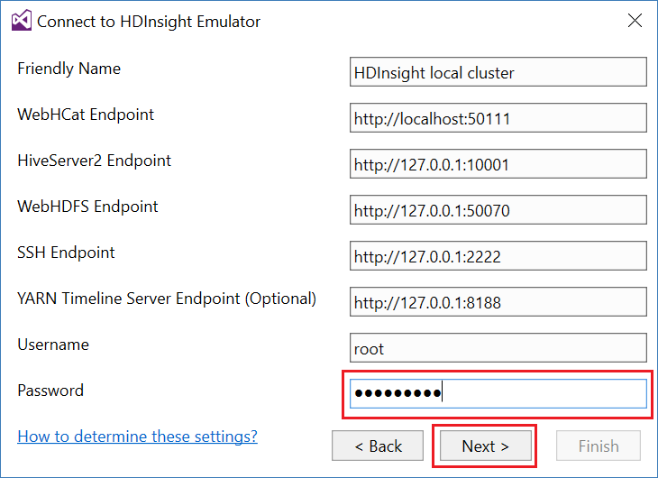
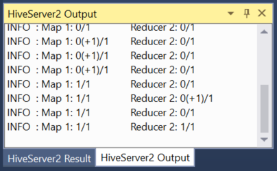
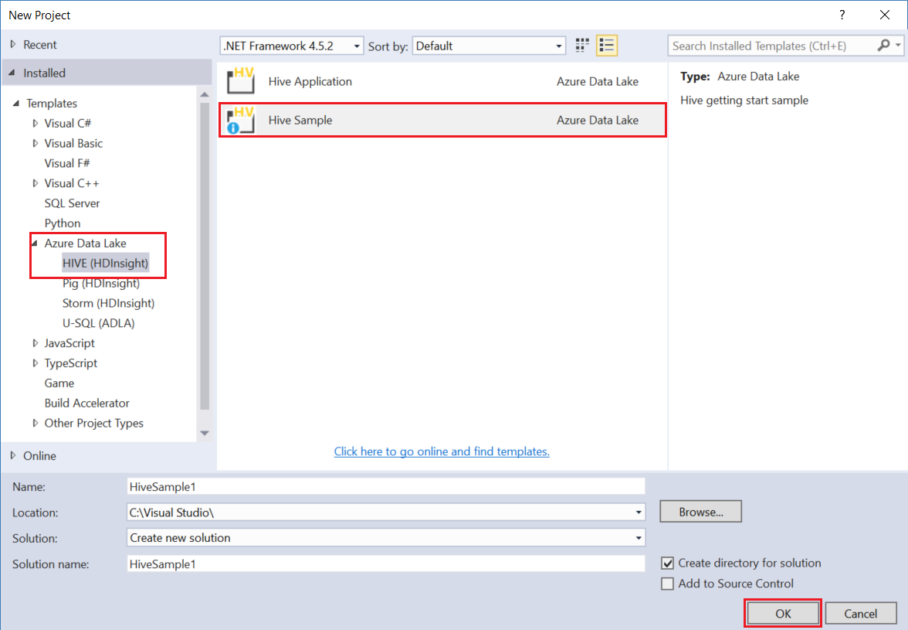
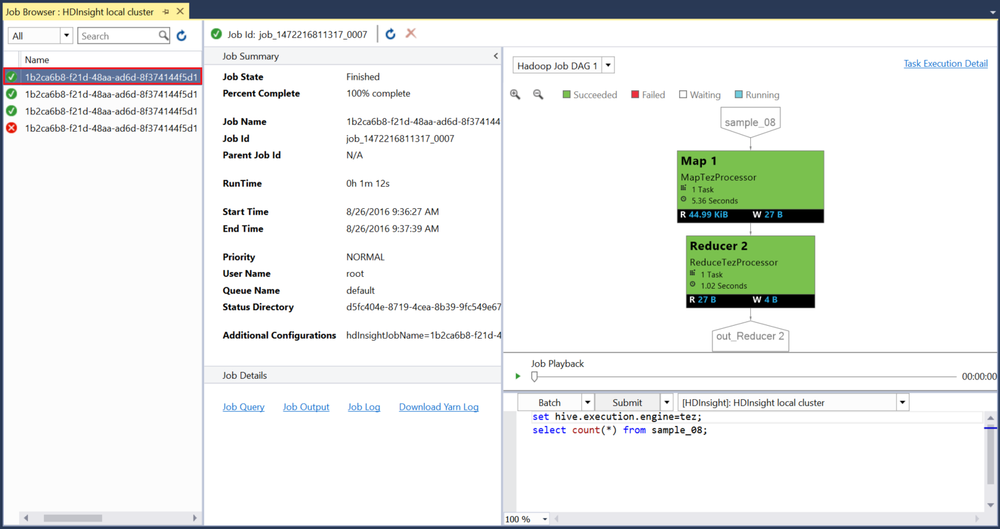
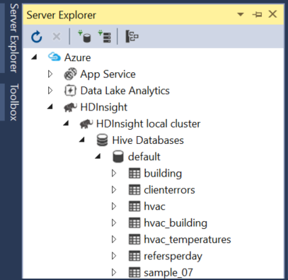

<properties
pageTitle="Verwenden Sie die Microsoft Azure-Daten Lake Tools für Visual Studio mit der Sandkastenmodus Hortonworks | Microsoft Azure"
description="Erfahren Sie, wie Sie mit den Azure Daten dem Tools für VIsual Studio mit Hortonworks Sandkasten (in einer lokalen virtuellen Computer ausgeführt wird.) Mit diesen Tools können Sie erstellen und Ausführen von Struktur und Schwein Aufträge auf den Sandkastenmodus und Ansicht Auftragsausgabe und Verlauf."
services="hdinsight"
documentationCenter=""
authors="Blackmist"
manager="paulettm"
editor="cgronlun"/>

<tags
ms.service="hdinsight"
ms.devlang="na"
ms.topic="article"
ms.tgt_pltfrm="na"
ms.workload="big-data"
ms.date="08/26/2016"
ms.author="larryfr"/>

# Verwenden Sie die Daten Azure Lake-Tools für Visual Studio mit der Sandkastenmodus Hortonworks

Die Azure Daten Lake Tools für Visual Studio enthalten Tools zum Arbeiten mit generische Hadoop Cluster, zusätzlich zu den Tools für die Arbeit mit Azure Daten Binnensee- und HDInsight. Dieses Dokument enthält Schritte erforderlich sind, mit den Azure Daten Lake Tools mit Hortonworks Sandkasten in einer lokalen virtuellen Computern ausgeführt wird.

Sandkasten Hortonworks verwenden, können Sie mit Hadoop lokal in Ihrer Entwicklungsumgebung arbeiten. Nachdem Sie eine Lösung entwickelt haben und es bei bereitstellen möchten, können Sie anschließend zu einem HDInsight Cluster verschieben.

## Erforderliche Komponenten

* Die Hortonworks Sandkastens für Ihre Entwicklungsumgebung in einem virtuellen Computer ausgeführt. Dieses Dokument wurde geschrieben und getestet Sandkasten in Oracle-VirtualBox, die konfiguriert wurde unter Verwendung der Informationen in das Dokument [Einstieg in die Hadoop-Netz](hdinsight-hadoop-emulator-get-started.md) ausgeführt.

* Visual Studio 2013 oder 2015, unabhängig von der Edition.

* [Azure SDK für .NET](https://azure.microsoft.com/downloads/) 2.7.1 oder höher

* [Azure Data Lake Tools für Visual Studio](https://www.microsoft.com/download/details.aspx?id=49504)

## Konfigurieren von Kennwörtern für den Sandkasten

Stellen Sie sicher, dass die Hortonworks Sandkastens ausgeführt wird, und folgen Sie den Schritten zum Konfigurieren des Kennworts für die SSH [Erste Schritte in der Hadoop-Netz](hdinsight-hadoop-emulator-get-started.md#set-passwords) `root` -Konto, und die Ambari `admin` Konto. Diese Kennwörter werden beim Herstellen einer Verbindung zu den Sandkastenmodus von Visual Studio verwendet.

## Herstellen einer Verbindung Sandkasten mit den tools

1. Öffnen Sie Visual Studio, und wählen Sie die __Ansicht__, und klicken Sie dann auf __Server-Explorer__aus.

2. Klicken Sie mit der rechten Maustaste auf den Eintrag __HDInsight__ __Server-Explorer__und wählen Sie dann auf __Verbindung herstellen mit HDInsight Emulator__.

    

3. Geben Sie im Dialogfeld __mit HDInsight Emulator verbinden__ das Kennwort, das Sie für Ambari konfiguriert.

    

    Wählen Sie __Weiter__ aus.

4. Verwenden Sie das Feld __Kennwort__ ein, das Kennwort einzugeben, Sie so konfiguriert, für dass, die `root` Konto. Lassen Sie die anderen Felder den Standardwert ein.

    

    Wählen Sie __Weiter__ aus.

5. Warten Sie auf Überprüfung der Dienste ausführen. In einigen Fällen möglicherweise Überprüfung fehlschlagen und fordert Sie die Konfiguration aktualisieren. Wenn dies passiert, wählen Sie die Schaltfläche __Aktualisieren__ und warten Sie, bis die Konfiguration und die Überprüfung für den Dienst ausführen.

    

    > [AZURE.NOTE] Aktualisierungsvorgang verwendet Ambari zum Ändern der Konfiguration Hortonworks Sandkasten-wie erwartet durch die Azure Daten Lake Tools für Visual Studio.

    Nach Abschluss der Überprüfung wählen Sie __Fertig stellen__ , um die Konfiguration abzuschließen.

    

    > [AZURE.NOTE] Je nach der Geschwindigkeit Ihrer Entwicklungsumgebung und der Speichermenge, die mit dem virtuellen Computer kann dies konfigurieren, und überprüfen die Dienste mehrere Minuten dauern.

Nachdem Sie diese Schritte aus, haben Sie jetzt einen Eintrag "HDInsight lokalen Cluster" im Server-Explorer unter dem Abschnitt HDInsight.

## Schreiben einer Abfrage Struktur

Struktur stellt eine SQL-ähnliche-Abfragesprache (HiveQL), für das Arbeiten mit strukturierten Daten. Gehen Sie folgendermaßen vor, erfahren Sie, wie Ad-hoc-Abfragen für lokale Cluster ausführen.

1. Im __Server-Explorer__mit der rechten Maustaste auf den Eintrag für die lokale Cluster, den Sie zuvor hinzugefügt haben, und wählen Sie dann __eine Struktur Abfrage schreiben__.

    

    Dadurch wird ein neues Abfragefenster, mit dem Sie schnell Geben Sie nach oben, und senden Sie eine Abfrage mit dem lokalen Cluster geöffnet.

2. Geben Sie in das neue Abfragefenster Folgendes ein:

        select count(*) from sample_08;
    
    Oben im Fenster Abfrage Vergewissern Sie sich diese Konfiguration für lokale Cluster ausgewählt ist, und wählen Sie dann auf __Senden__. Lassen Sie die anderen Werte (__Stapel__ und Servername,) die Standardwerte aus.

    

    Beachten Sie, dass Sie auch das Dropdownmenü neben __Absenden__ verwenden können, um __Erweitert__auszuwählen. Daraufhin wird ein Dialogfeld, in dem Sie zusätzliche Optionen bereitstellen, wenn Sie den Auftrag Absenden kann.

    

3. Nachdem Sie die Abfrage gesendet haben, wird der Status angezeigt. Diese enthält Informationen zu den Auftrag aus, wie sie von Hadoop verarbeitet wird. Der __Job-Status__ -Eintrag enthält den aktuellen Status des Projekts. Der Status wird regelmäßig aktualisiert werden, oder Sie können das Symbol "Aktualisieren" verwenden, um den Status manuell zu aktualisieren.

    

    Nachdem Sie den __Projektstatus__ auf __erledigt__verwandelt hat, wird eine geleitet acyclische Graph (so) angezeigt. Beschreibt den Ausführungspfad, der von Tez (die Standardeinstellung Execution-Engine für die Struktur der lokale Cluster.) festgelegt wurde 
    
    > [AZURE.NOTE] Tez ist auch der Standardwert, wenn HDInsight Linux-basierten Cluster verwenden. Es ist nicht die Standardeinstellung auf Windows basierende HDInsight; Möglichkeit zur gemeinsamen Nutzung vorhanden, Sie müssen die Linie hinzufügen `set hive.execution.engine = tez;` an den Anfang der Struktur Abfrage. 

    Verwenden Sie den __Auftragsausgabe__ Link, um die Ausgabe anzuzeigen. In diesem Fall ist es __823__. die Anzahl der Zeilen in der Tabelle sample_08. Sie können über die Links __Job-Protokoll__ und __Herunterladen aus Log__ Diagnoseinformationen über das Projekt anzeigen.

4. Sie können auch Struktur Aufträge interaktiv ausführen, indem Sie das Feld __Stapel__ in __interaktiv__ändern, und wählen Sie dann auf __Ausführen__. 

    

    Dies streamt der Ausgabelog generiert während der Verarbeitung im __Ausgabefenster HiveServer2__ angezeigt.
    
    > [AZURE.NOTE] Dies ist die gleichen Informationen, die nach Abschluss ein Auftrags über den Link __Job-Protokoll__ verfügbar ist.

    

## Erstellen eines Projekts Struktur

Sie können auch ein Projekt erstellen, die mehrere Struktur Skripts enthält. Dies ist nützlich, wenn Sie die Skripts verwandte enthalten, die Sie zusammenhalten oder mithilfe eines Versionssteuerungssysteme beibehalten müssen.

1. Wählen Sie in Visual Studio __Datei__, __neu__und Then__Project__ aus.

2. Aus der Liste der Projekte erweitern Sie __Vorlagen__, __Azure Daten dem__ , und wählen Sie dann die __Struktur (HDInsight)__. Wählen Sie aus der Liste der Vorlagen __Struktur Stichprobe__. Geben Sie einen Namen und einen Speicherort, und klicken Sie dann auf __OK klicken__.

    

Das Projekt __Struktur Beispiel__ enthält zwei Skripts, __WebLogAnalysis.hql__ und __SensorDataAnalysis.hql__. Sie können diese Einstellung mit der gleichen __Senden__ -Schaltfläche am oberen Rand des Fensters übermitteln.

## Erstellen eines Projekts Schwein

Struktur eine SQL-ähnliche Sprache bietet eine für das Arbeiten mit strukturierten Daten stellt Schwein eine Sprache (Schwein Lateinisch), mit dem Sie eine Verkaufspipeline Transformationen entwickeln, die auf Ihre Daten angewendet werden. Gehen Sie folgendermaßen vor, um Schwein mit dem lokalen Cluster zu verwenden.

1. Öffnen Sie Visual Studio, und wählen Sie __Datei__, __neu__und dann auf __Projekt__. In der Liste der Projekte, __Vorlagen__, __Azure Daten dem__, erweitern Sie, und wählen Sie __Schwein (HDInsight)__. Wählen Sie aus der Liste der Vorlagen __Schwein Anwendung__ein. Geben Sie einen Namen und Speicherort, und wählen Sie dann auf __OK__.

    

2. Geben Sie Folgendes als den Inhalt der Datei __script.pig__ , die mit diesem Projekt erstellt wurde.

        a = LOAD '/demo/data/Website/Website-Logs' AS (
            log_id:int, 
            ip_address:chararray, 
            date:chararray, 
            time:chararray, 
            landing_page:chararray, 
            source:chararray);
        b = FILTER a BY (log_id > 100);
        c = GROUP b BY ip_address;
        DUMP c;

    Während Schwein eine andere Sprache als Struktur verwendet, ist wie Sie die Einzelvorgänge ausführen konsistent zwischen den beiden Sprachen durch die __Senden__ -Schaltfläche. Die Dropdownliste nach unten neben __Absenden__ auswählen, wird ein Dialogfeld Erweiterte Absenden für Schwein angezeigt.

    
    
3. Der Status der Position und der Ausgabe ist auch die gleiche als Struktur Abfrage angezeigt.

    

## Einzelvorgänge anzeigen

Azure Datentools dem zulassen auch, dass Sie einfach anzeigen von Informationen über die Projekte, die wurden auf Hadoop ausgeführt wurde. Gehen Sie folgendermaßen vor, um anzuzeigen, dass die Projekte, die wurden auf dem lokalen Cluster ausgeführt wurde.

1. __Server-Explorer__mit der rechten Maustaste auf dem lokalen Cluster, und wählen Sie dann auf __Einzelvorgänge anzeigen__. Eine Liste der Aufträge, die gesendet wurden, werden mit dem Cluster angezeigt.

    

2. Wählen Sie aus der Liste der Aufträge eine Job-Details anzeigen aus.

    

    Die angezeigten Informationen ähnelt der nach dem Ausführen einer Struktur oder Schwein Abfrage Links zum Anzeigen der Ausgabe und Protokollinformationen angezeigt.

3. Sie können auch ändern und erneut senden im Auftrag von hier aus.

## Anzeigen der Struktur Datenbanken

1. In __Server-Explorer__erweitern Sie den Eintrag __HDInsight lokalen Cluster__ , und erweitern Sie dann die __Struktur Datenbanken__. Dadurch wird die __standardmäßige__ und __Xademo__ -Datenbanken auf dem lokalen Cluster angezeigt. Erweitern einer Datenbank werden die Tabellen in der Datenbank.

    

2. Erweitern einer Tabelle zeigt die Spalten für die Tabelle. Sie können mit der rechten Maustaste in einer Tabelle, und wählen __Ansicht erste 100 Zeilen__ , die Daten schnell anzuzeigen.

    

### Datenbank und Tabelle Eigenschaften

Möglicherweise haben Sie bemerkt, dass Sie zum Anzeigen der __Eigenschaften__ für eine Datenbank oder eine Tabelle auswählen können. Dadurch wird die Details für das ausgewählte Element im Eigenschaftenfenster angezeigt.

### Erstellen einer Tabelle

Erstellen einer neuen Tabelle, mit der rechten Maustaste in einer Datenbank, und wählen Sie dann auf __Tabelle erstellen__.

Anschließend können Sie die Tabelle, die über ein Formular erstellen. Sie können die unformatierten HiveQL anzeigen, die zum Erstellen einer Tabelle am Ende dieser Seite verwendet werden.

## Nächste Schritte

* [Lernen die Seile der Sandkasten Hortonworks](http://hortonworks.com/hadoop-tutorial/learning-the-ropes-of-the-hortonworks-sandbox/)
* [Hadoop-Lernprogramm - Erste Schritte mit HDP](http://hortonworks.com/hadoop-tutorial/hello-world-an-introduction-to-hadoop-hcatalog-hive-and-pig/)