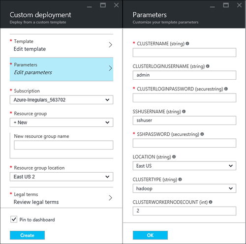

<properties
    pageTitle="Linux Lernprogramm: Erste Schritte mit Hadoop und Struktur | Microsoft Azure"
    description="Führen Sie dieses Lernprogramms Linux den Einstieg Hadoop in HDInsight. Erfahren Sie, wie Linux Cluster bereitgestellt und Abfragen von Daten mit Struktur."
    services="hdinsight"
    documentationCenter=""
    authors="mumian"
    manager="jhubbard"
    editor="cgronlun"
    tags="azure-portal"/>

<tags
    ms.service="hdinsight"
    ms.devlang="na"
    ms.topic="hero-article"
    ms.tgt_pltfrm="na"
    ms.workload="big-data"
    ms.date="09/14/2016"
    ms.author="jgao"/>

# Hadoop Lernprogramm: Erste Schritte mit Linux-basierten Hadoop in HDInsight

> [AZURE.SELECTOR]
- [Linux-basierten](hdinsight-hadoop-linux-tutorial-get-started.md)
- [Windows-basiertem](hdinsight-hadoop-tutorial-get-started-windows.md)

Erfahren Sie, wie Linux-basierten [Hadoop](http://hadoop.apache.org/) Cluster in HDInsight zu erstellen und Ausführen von Struktur Aufträge in HDInsight. [Apache Struktur](https://hive.apache.org/) ist die am häufigsten verwendeten Komponente in Teil des Hadoop-Netzwerks. Aktuell HDInsight im Lieferumfang von 4 unterschiedliche Arten: [Hadoop](hdinsight-hadoop-introduction.md), [Spark](hdinsight-apache-spark-overview.md), [HBase](hdinsight-hbase-overview.md) und [Storm](hdinsight-storm-overview.md).  Jedes Typs Cluster unterstützt, eine andere Gruppe von Komponenten. Alle Clustertypen von 4 unterstützen Struktur. Eine Liste der unterstützten Komponenten HDInsight, finden Sie unter [Neuigkeiten in die Hadoop Cluster Versionen von HDInsight bereitgestellten?](hdinsight-component-versioning.md)  

[AZURE.INCLUDE [delete-cluster-warning](../../includes/hdinsight-delete-cluster-warning.md)]

## Erforderliche Komponenten

Bevor Sie dieses Lernprogramm beginnen, benötigen Sie Folgendes:

- **Azure-Abonnement**: Wechseln Sie zum Erstellen einer kostenlosen Testversion einen Monat-Kontos zu [azure.microsoft.com/free](https://azure.microsoft.com/free).

### Anforderungen für Access-Steuerelement

[AZURE.INCLUDE [access-control](../../includes/hdinsight-access-control-requirements.md)]

## Erstellen von cluster

Die meisten Hadoop Aufträge sind Stapelverarbeitung. Sie erstellen Sie einen Cluster, einige Einzelvorgänge ausführen und dann Cluster löschen. In diesem Abschnitt erstellen Sie einen Linux-basierten Hadoop Cluster in mit [Vorlage Ressourcenmanager Azure](../resource-group-template-deploy.md)HDInsight. Ressourcenmanager Vorlage ist vollständig anpassbaren; Sie können einfach Azure Ressourcen wie HDInsight zu erstellen. Ressourcenmanager Vorlage Erfahrung ist nicht erforderlich für dieses Lernprogramms folgen. Andere Methoden zur Erstellung Cluster und Grundlegendes zu den Eigenschaften, die in diesem Lernprogramm verwendet finden Sie unter [Erstellen von HDInsight Cluster](hdinsight-hadoop-provision-linux-clusters.md). In diesem Lernprogramm verwendeten Ressourcenmanager Vorlage befindet sich in einem öffentlichen Blob-Container [https://hditutorialdata.blob.core.windows.net/armtemplates/create-linux-based-hadoop-cluster-in-hdinsight.json](https://hditutorialdata.blob.core.windows.net/armtemplates/create-linux-based-hadoop-cluster-in-hdinsight.json). 

1. Klicken Sie auf die folgende Abbildung zum Anmelden bei Azure, und öffnen Sie die Vorlage Ressourcenmanager Azure-Portal. 

    

2. Geben Sie aus dem **Parameter** Blade Folgendes ein:

    .

    - **ClusterName**: Geben Sie einen Namen für den Hadoop Cluster, die Sie erstellen.
    - **Cluster-Benutzernamen und Ihr Kennwort**: der Standard-Anmeldename ist **Admin**.
    - **SSH-Benutzernamen und Ihr Kennwort**: der Standard-Benutzername ist **Sshuser**.  Sie können ihn umbenennen. 
    
    Andere Parameter sind optional für dieses Lernprogramms folgen. Sie können diese unverändert lassen. 
    
    Jeder Cluster verfügt über eine Azure BLOB-Speicher Konto Abhängigkeit. Es wird in der Regel als Standardkonto Speicher bezeichnet. HDInsight Cluster und deren Speicher Standardkonto müssen in der gleichen Azure Region gemeinsame befinden. Cluster löschen, wird das Speicherkonto nicht gelöscht. In der Vorlage wird der Standardname für Speicher-Kontos als Clusternamen mit "Store" angefügt definiert. 
    
3. Klicken Sie auf **OK** , um die Parameter zu speichern.
4. Geben Sie aus dem Blade **benutzerdefinierte Bereitstellung** **Name für neue Ressourcengruppe** zum Erstellen einer neuen Ressourcengruppe ein.  Die Ressourcengruppe ist ein Container, der Cluster, das Konto abhängige Speicherplatz und andere s gruppiert. Die Position der Ressource Gruppe kann nicht mit dem Cluster sein.
5. Klicken Sie auf **rechtliche Ausdrücke**, und klicken Sie dann auf **Erstellen**.
6. Überprüfen Sie, ob das Kontrollkästchen **Pin zum Dashboard** ausgewählt ist, und klicken Sie dann auf **Erstellen**. Es wird eine neue Kachel mit dem Titel **Vorlage bereitstellen Bereitstellung**angezeigt. Dauert es ungefähr ungefähr 20 Minuten, einen Cluster erstellen. 
7.  Nachdem der Cluster erstellt wurde, wird die Beschriftung der Kachel auf den Namen der Ressource geändert, die Sie angegeben haben. Und im Portal beiden Blades automatisch mit dem Cluster und die Clustereinstellungen geöffnet. 

    .

    Es gibt zwei Ressourcen aufgeführt, die Cluster und des Standardkontos-Speicher.

##Ausführen von Abfragen Struktur

[Apache Struktur](hdinsight-use-hive.md) ist die am häufigsten verwendeten Komponente in HDInsight verwendet werden. Es gibt viele Verfahren zum Ausführen von Struktur Aufträge in HDInsight. In diesem Lernprogramm verwenden Sie die Ansicht Ambari Struktur aus dem Portal einige Struktur Auftrag ausführen. Andere Methoden zum Senden von Aufträgen Struktur finden Sie unter [Verwenden in HDInsight Struktur](hdinsight-use-hive.md).

1. Navigieren Sie zu **https://&lt;ClusterName >. azurehdinsight.net**, wobei &lt;ClusterName > handelt es sich Cluster Sie erstellt haben, in dem vorherigen Abschnitt Ambari zu öffnen.
2. Geben Sie die Hadoop-Benutzernamen und Ihr Kennwort ein, die Sie im vorherigen Abschnitt angegeben haben. Der Standard-Benutzername ist **Admin**.
3. Öffnen Sie **Struktur anzeigen** , wie im folgenden Screenshot gezeigt:

    .
4. Im __Abfrage-Editor__ -Abschnitt der Seite fügen Sie das Arbeitsblatt mit der folgenden Aussagen HiveQL:

        SHOW TABLES;

    >[AZURE.NOTE] Semikolon ist Struktur erforderlich.       
        
5. Klicken Sie auf __Ausführen__. Ein Abschnitt __Prozess Abfrageergebnisse__ sollte unterhalb des Abfrage-Editors angezeigt und Anzeigen von Informationen zu den Auftrag. 

    Sobald die Abfrage abgeschlossen ist, wird im Abschnitt __Prozess Abfrageergebnisse__ die Ergebnisse des Vorgangs angezeigt. Sie müssen eine Tabelle mit dem Namen **Hivesampletable**finden Sie unter. Dieses Beispiel strukturtabelle verfügt über alle HDInsight Cluster.

    .

6. Wiederholen Sie Schritt 4 und 5, um die folgende Abfrage ausführen:

        SELECT * FROM hivesampletable;

    > [AZURE.TIP] Beachten Sie die Dropdownliste __Speichern Sie die Ergebnisse__ in der oberen linken Ecke des Abschnitts __Prozess Abfrageergebnisse__ . Hiermit können Sie entweder die Ergebnisse heruntergeladen werden, oder um HDInsight Speicher als eine CSV-Datei zu speichern.

7. Klicken Sie auf **Verlauf** , um eine Liste der Projekte zu erhalten.

Nachdem Sie ein Projekt Struktur beendet haben, können Sie [die Ergebnisse werden in SQL Azure-Datenbank oder SQL Server-Datenbank exportieren](hdinsight-use-sqoop-mac-linux.md), können Sie auch [die Ergebnisse mit Excel visualisieren](hdinsight-connect-excel-power-query.md). Weitere Informationen zur Verwendung von Struktur in HDInsight finden Sie unter [verwenden Struktur und HiveQL mit Hadoop in HDInsight zu analysieren eine Apache log4j-Beispieldatei](hdinsight-use-hive.md).

##Bereinigen des Lernprogramms

Nachdem Sie das Lernprogramm abgeschlossen haben, sollten Sie den Cluster löschen. Mit HDInsight Ihre Daten in Azure-Speicher gespeichert, sodass Sie problemlos einen Cluster löschen können, wenn es nicht verwendet wird. Sie unterliegen auch nach einem HDInsight Cluster, auch wenn es nicht verwendet wird. Da die Gebühren für den Cluster oft mehr als die Gebühren für Speicher sind, ist es economic sinnvoll Cluster löschen, wenn er nicht verwendet werden. 

>[AZURE.NOTE] Mit [Azure Data Factory](hdinsight-hadoop-create-linux-clusters-adf.md), können Sie HDInsight Cluster bei Bedarf erstellen und konfigurieren eine Einstellung TimeToLive Zuordnungseinheiten automatisch zu löschen. 

**So löschen Sie den Cluster und/oder des Standardkontos für den Speicher**

1. Melden Sie sich mit dem [Azure-Portal](https://portal.azure.com)aus.
2. Klicken Sie aus dem Portal Dashboard auf die Kachel mit den Namen der Ressource-Gruppe, die, den Sie verwendet werden, wenn Sie den Cluster erstellt haben.
3. Klicken Sie auf **Löschen** , klicken Sie auf das Blade Ressourcen die Ressourcengruppe löschen die Cluster und des Standardkontos-Speicher enthält; oder klicken Sie auf den Clusternamen auf die Kachel " **Ressourcen** ", und klicken Sie dann auf das Cluster Blade auf **Löschen** . Bitte werden Notiz löschen der Ressourcengruppe Speicher-Konto gelöscht. Wenn Sie das Speicherkonto beibehalten möchten, wählen Sie nur den Cluster löschen.

## Nächste Schritte

In diesem Lernprogramm haben Sie so erstellen Sie einen Linux-basierten HDInsight Cluster mithilfe einer Vorlage Ressourcenmanager, und wie Sie grundlegende Struktur Abfragen ausführen erhalten.

Weitere Informationen zum Analysieren von Daten mit HDInsight, probieren Sie Folgendes ein:

- Weitere Informationen zum Verwenden von Struktur mit HDInsight, einschließlich Struktur Abfragen von Visual Studio ausführen finden Sie unter [Verwendung mit HDInsight Struktur][hdinsight-use-hive].

- Weitere Informationen zu Schwein eine Sprache für die Datentransformation, verwendet, finden Sie unter [Verwenden Schwein mit HDInsight][hdinsight-use-pig].

- Informationen zu MapReduce eine Möglichkeit zum Schreiben von Programmen, die auf Hadoop, Daten zu verarbeiten finden Sie unter [Verwenden von MapReduce mit HDInsight][hdinsight-use-mapreduce].

- Weitere Informationen zum Verwenden der HDInsight Tools für Visual Studio zum Analysieren von Daten auf HDInsight, finden Sie unter [Erste Schritte mit Visual Studio Hadoop-Tools für HDInsight](hdinsight-hadoop-visual-studio-tools-get-started.md).

Wenn Sie bereit sind für Ihre eigenen Daten mit der Arbeit beginnen und Weitere Informationen zum wie HDInsight Daten gespeichert oder zum Abrufen von Daten in HDInsight müssen, probieren Sie Folgendes:

- Informationen darüber, wie HDInsight Azure Blob-Speicher verwendet finden Sie unter [verwenden Azure Blob-Speicher mit HDInsight](hdinsight-hadoop-use-blob-storage.md).

- Informationen zum Hochladen von Daten mit HDInsight finden Sie unter [Hochladen von Daten mit HDInsight][hdinsight-upload-data].

Wenn Sie weitere Informationen zum Erstellen oder Verwalten von einem Cluster HDInsight erfahren möchten, finden Sie unter den folgenden:

- Weitere Informationen zum Verwalten Ihrer Linux-basierten HDInsight Clusters, finden Sie unter [Verwalten HDInsight Cluster Ambari verwenden](hdinsight-hadoop-manage-ambari.md).

- Erfahren Sie mehr zu den Optionen, die Sie beim Erstellen eines HDInsight Clusters auswählen können, finden Sie unter [Erstellen von HDInsight auf Linux mit benutzerdefinierten Optionen](hdinsight-hadoop-provision-linux-clusters.md).

- Wenn Sie mit Linux und Hadoop vertraut sind, aber im Detail Hadoop auf die HDInsight wissen möchten, finden Sie unter [Arbeiten mit HDInsight unter Linux](hdinsight-hadoop-linux-information.md). Dieser Artikel enthält Informationen wie:

    * URLs für Dienste auf dem Cluster, wie z. B. Ambari und WebHCat
    * Die Position des Hadoop-Dateien und Beispiele im lokalen Dateisystem
    * Speichern die Verwendung von Azure Speicher (WASB) statt HDFS als die Standarddaten

[1]: ../HDInsight/hdinsight-hadoop-visual-studio-tools-get-started.md

[hdinsight-provision]: hdinsight-provision-clusters.md
[hdinsight-admin-powershell]: hdinsight-administer-use-powershell.md
[hdinsight-upload-data]: hdinsight-upload-data.md
[hdinsight-use-mapreduce]: hdinsight-use-mapreduce.md
[hdinsight-use-hive]: hdinsight-use-hive.md
[hdinsight-use-pig]: hdinsight-use-pig.md

[powershell-download]: http://go.microsoft.com/fwlink/p/?linkid=320376&clcid=0x409
[powershell-install-configure]: powershell-install-configure.md
[powershell-open]: powershell-install-configure.md#Install

[img-hdi-dashboard]: ./media/hdinsight-hadoop-tutorial-get-started-windows/HDI.dashboard.png
[img-hdi-dashboard-query-select]: ./media/hdinsight-hadoop-tutorial-get-started-windows/HDI.dashboard.query.select.png
[img-hdi-dashboard-query-select-result]: ./media/hdinsight-hadoop-tutorial-get-started-windows/HDI.dashboard.query.select.result.png
[img-hdi-dashboard-query-select-result-output]: ./media/hdinsight-hadoop-tutorial-get-started-windows/HDI.dashboard.query.select.result.output.png
[img-hdi-dashboard-query-browse-output]: ./media/hdinsight-hadoop-tutorial-get-started-windows/HDI.dashboard.query.browse.output.png
[image-hdi-clusterstatus]: ./media/hdinsight-hadoop-tutorial-get-started-windows/HDI.ClusterStatus.png
[image-hdi-gettingstarted-powerquery-importdata]: ./media/hdinsight-hadoop-tutorial-get-started-windows/HDI.GettingStarted.PowerQuery.ImportData.png
[image-hdi-gettingstarted-powerquery-importdata2]: ./media/hdinsight-hadoop-tutorial-get-started-windows/HDI.GettingStarted.PowerQuery.ImportData2.png
