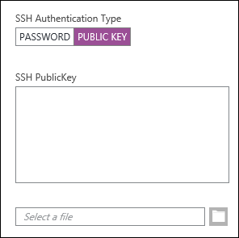

<properties
   pageTitle="Verwenden von SSH Tasten mit Linux-basierten Hadoop von Linux, Unix oder OS X | Microsoft Azure"
   description=" Sie können die Linux-basierten HDInsight mithilfe von Secure Shell (SSH) zugreifen. Dieses Dokument enthält Informationen zum Verwenden von SSH mit HDInsight auf Linux, Unix oder OS X-Clients."
   services="hdinsight"
   documentationCenter=""
   authors="Blackmist"
   manager="jhubbard"
   editor="cgronlun"
    tags="azure-portal"/>

<tags
   ms.service="hdinsight"
   ms.devlang="na"
   ms.topic="get-started-article"
   ms.tgt_pltfrm="na"
   ms.workload="big-data"
   ms.date="09/13/2016"
   ms.author="larryfr"/>

#<a name="use-ssh-with-linux-based-hadoop-on-hdinsight-from-linux-unix-or-os-x"></a>Verwenden von SSH mit Linux-basierten Hadoop auf HDInsight von Linux, Unix oder OS X

> [AZURE.SELECTOR]
- [Windows](hdinsight-hadoop-linux-use-ssh-windows.md)
- [Linux, Unix, OS X](hdinsight-hadoop-linux-use-ssh-unix.md)

[Secure Shell (SSH)](https://en.wikipedia.org/wiki/Secure_Shell) können Sie Vorgänge für eine Line Schnittstelle HDInsight Linux-basierten Cluster Remote ausführen. Dieses Dokument enthält Informationen zum Verwenden von SSH mit HDInsight auf Linux, Unix oder OS X-Clients.

> [AZURE.NOTE] Die Schritte in diesem Artikel wird davon ausgegangen, dass Sie einen Linux, Unix oder OS X-Client verwenden. Diese Schritte möglicherweise auf einem Windows-basierten Client ausgeführt werden, wenn Sie ein Paket installiert haben, die bereitstellt `ssh` und `ssh-keygen`, z. B. [Bash auf Ubuntu unter Windows](https://msdn.microsoft.com/commandline/wsl/about).
>
> Wenn Sie nicht SSH auf Ihrem Windows-basierten Client installiert haben, führen Sie die Schritte in [Verwenden SSH mit Linux-basierten HDInsight (Hadoop) von Windows](hdinsight-hadoop-linux-use-ssh-windows.md) Informationen zum Installieren und Verwenden von kitten.

##<a name="prerequisites"></a>Erforderliche Komponenten

* **SSH Keygen** und **ssh** für Linux, Unix und OS X-Clients. Diese Dienstprogramme werden in der Regel mit Ihr Betriebssystem oder über das Paket Management-System zur Verfügung bereitgestellt.

* Eine moderne Webbrowser, HTML5 unterstützt.

ODER

* [Azure CLI](../xplat-cli-install.md).

    [AZURE.INCLUDE [use-latest-version](../../includes/hdinsight-use-latest-cli.md)] 

##<a name="what-is-ssh"></a>Was ist SSH?

SSH ist ein Programm für Anmelden an und Remote Befehle auf einem Remoteserver ausführen. Mit Linux-basierten HDInsight SSH wird eine verschlüsselte Verbindung mit der Cluster Headnode und bietet eine Befehlszeile, die Sie geben Sie Befehle verwenden. Befehle werden dann direkt auf dem Server ausgeführt werden.

###<a name="ssh-user-name"></a>SSH-Benutzername

Eine SSH Benutzername ist der Name, den Sie verwenden, um mit dem Cluster HDInsight authentifizieren. Wenn Sie einen Benutzernamen SSH während der Clustererstellung angeben, wird dieser Benutzer auf allen Knoten im Cluster erstellt. Nachdem der Cluster erstellt wird, können Sie diesen Benutzernamen für die Verbindung zu den HDInsight Cluster Headnodes verwenden. Von der Headnodes können Sie dann auf die einzelnen Worker Knoten herstellen.

###<a name="ssh-password-or-public-key"></a>SSH Kennwort oder öffentlicher Schlüssel

Ein Benutzer SSH können entweder ein Kennwort oder ein öffentlicher Schlüssel für die Authentifizierung. Ein Kennwort ist nur eine Textzeichenfolge, die Sie bilden, während ein öffentlicher Schlüssel Teil eines Kryptografieschlüsselpaares generiert, um eindeutig zu identifizieren ist.

Ein Schlüssel ist sicherer als ein Kennwort, aber es sind zusätzliche Schritte zum Generieren des Schlüssels erforderlich, und Sie müssen die Dateien, die mit dem Schlüssel an einem sicheren Ort verwalten. Wenn jede Person mit Zugriff auf die wichtigsten Dateien Schaden, erhalten sie Zugriff auf Ihr Konto aus. Oder wenn Sie die wichtigsten Dateien verlieren, Sie werden möglicherweise nicht bei Ihrem Konto anmelden.

Ein Paar aus Schlüssel besteht aus einem öffentlichen Schlüssel (der auf dem Server HDInsight gesendet werden kann) und einem privaten Schlüssel (der auf dem Clientcomputer speichern gespeichert ist.) Wenn Sie mit dem HDInsight Server über SSH verbinden, wird SSH-Client den privaten Schlüssel Authentifizierung mit dem Server auf Ihrem Computer verwendet.

##<a name="create-an-ssh-key"></a>Erstellen Sie einen Schlüssel SSH

Verwenden Sie die folgende Informationen, wenn Sie SSH Tasten mit Ihren Cluster verwenden möchten. Wenn Sie ein Kennwort verwenden möchten, können Sie diesen Abschnitt überspringen.

1. Öffnen Sie eine terminal Sitzung, und verwenden Sie den folgenden Befehl, um festzustellen, ob Sie alle vorhandenen SSH Tasten haben:

        ls -al ~/.ssh

    Suchen Sie nach den folgenden Dateien im Verzeichnis. Hierbei handelt es sich um allgemeine Namen für Öffentliche SSH-Schlüssel.

    * ID\_dsa.pub
    * ID\_ecdsa.pub
    * ID\_ed25519.pub
    * ID\_rsa.pub

2. Wenn Sie keine vorhandene Datei verwenden möchten, oder Sie keine vorhandenen SSH Schlüssel haben, verwenden Sie die folgenden zum Generieren einer neuen Datei:

        ssh-keygen -t rsa

    Sie werden aufgefordert, die folgenden Informationen:

    * Der Pfad der Datei – der Speicherort ist standardmäßig ~/.ssh/id\_Rsa.
    * Ein Kennwort - werden Sie aufgefordert, diese erneut eingeben.

        > [AZURE.NOTE] Es wird dringend empfohlen, dass Sie eine sichere Kennwort für den Schlüssel verwenden. Jedoch, wenn Sie das Kennwort vergessen, gibt es Möglichkeit keine, die Datenbank wiederherzustellen.

    Nach Beendigung des Befehls haben Sie zwei neue Dateien, den privaten Schlüssel (z. B. **Id\_Rsa**) und den öffentlichen Schlüssel (z. B. **Id\_rsa.pub**).

##<a name="create-a-linux-based-hdinsight-cluster"></a>Erstellen Sie einen Linux-basierten HDInsight cluster

Bei einen Cluster Linux-basierten HDInsight zu erstellen, müssen Sie den zuvor erstellten öffentlichen Schlüssel bereitstellen. Von Linux, Unix oder OS X-Clients gibt es zwei Methoden zum Erstellen eines HDInsight Clusters:

* **Azure-Portal** – wird mit einem webbasierten Portal Cluster erstellt.

* **Azure CLI für Mac, Linux und Windows** - Befehlszeile Befehle verwendet, um den Cluster zu erstellen.

Jede dieser Methoden wird entweder ein Kennwort oder ein öffentlicher Schlüssel erforderlich. Ausführliche Informationen zum Erstellen eines Clusters Linux-basierten HDInsight finden Sie unter [Bereitstellen von Linux-basierten HDInsight Cluster](hdinsight-hadoop-provision-linux-clusters.md).

###<a name="azure-portal"></a>Azure-Portal

Bei Verwendung der [Azure-Portal] [ preview-portal] zum Erstellen eines Linux-basierten HDInsight Clusters müssen Geben Sie einen **SSH Benutzernamen ein**, und wählen Sie ein **Kennwort** oder eine **Öffentliche SSH-Schlüssel**eingeben.

Wenn Sie eine **Öffentliche SSH-Schlüssel**auswählen, können Sie fügen Sie den öffentlichen Schlüssel (in der Datei mit der Erweiterung **pub** ) in das Feld __SSH PublicKey__ oder klicken Sie auf Durchsuchen, und wählen Sie die Datei für den öffentliche Schlüssel __Wählen Sie eine Datei aus__ .



> [AZURE.NOTE] Die wichtige Datei ist einfach eine Textdatei. Der Inhalt sollte etwa wie folgt angezeigt:
> ```
ssh-rsa AAAAB3NzaC1yc2EAAAADAQABAAABAQCelfkjrpYHYiks4TM+r1LVsTYQ4jAXXGeOAF9Vv/KGz90pgMk3VRJk4PEUSELfXKxP3NtsVwLVPN1l09utI/tKHQ6WL3qy89WVVVLiwzL7tfJ2B08Gmcw8mC/YoieT/YG+4I4oAgPEmim+6/F9S0lU2I2CuFBX9JzauX8n1Y9kWzTARST+ERx2hysyA5ObLv97Xe4C2CQvGE01LGAXkw2ffP9vI+emUM+VeYrf0q3w/b1o/COKbFVZ2IpEcJ8G2SLlNsHWXofWhOKQRi64TMxT7LLoohD61q2aWNKdaE4oQdiuo8TGnt4zWLEPjzjIYIEIZGk00HiQD+KCB5pxoVtp user@system
> ```

Dies erstellt einen Benutzernamen für die angegebene Benutzer an, mit dem Kennwort oder öffentlicher Schlüssel, die, den Sie bereitstellen.

###<a name="azure-command-line-interface-for-mac-linux-and-windows"></a>Für Mac, Linux und Windows Azure Line-Benutzeroberfläche

Sie können die [Azure CLI für Mac, Linux und Windows](../xplat-cli-install.md) zum Erstellen eines neuen Clusters mithilfe der `azure hdinsight cluster create` Befehl.

Weitere Informationen zur Verwendung dieser Befehl finden Sie unter [Bereitstellen von Hadoop Linux Cluster in HDInsight mit benutzerdefinierten Optionen](hdinsight-hadoop-provision-linux-clusters.md).

##<a name="connect-to-a-linux-based-hdinsight-cluster"></a>Verbinden Sie mit einem Cluster Linux-basierten HDInsight

Verwenden Sie von einer terminal Sitzung den Befehl SSH Verbindung zu den Cluster Headnode, indem Sie die Adresse und den Namen ein:

* **SSH Adresse** – es gibt zwei Adressen, die Verbindung zu einem Cluster über SSH verwendet werden können:

    * **Mit der Headnode verbinden**: der Clustername, gefolgt von **-ssh.azurehdinsight.net**. Beispielsweise **MeinCluster-ssh.azurehdinsight.net**.
    
    * **Mit den Rand Knoten verbinden**: ist der Cluster R Server auf HDInsight, enthalten Cluster auch einen Kantenknoten, die mit **RServer.CLUSTERNAME.ssh.azurehdinsight.net**, wobei __CLUSTERNAME__ der Name des Cluster ist zugegriffen werden kann.

* **Benutzername** - der SSH Benutzernamen aus, den Sie bei der Erstellung des Clusters bereitgestellt.

Im folgende Beispiel wird mit der primären Headnode von **MeinCluster** als der Benutzer **mich**verbinden:

    ssh me@mycluster-ssh.azurehdinsight.net

Wenn Sie ein Kennwort für das Benutzerkonto verwendet haben, werden Sie aufgefordert, das Kennwort einzugeben.

Wenn Sie ein SSH Key, die gesichert wird mit einem Kennwort verwendet haben, werden Sie aufgefordert, das Kennwort einzugeben. Andernfalls versucht SSH automatisch authentifizieren, indem Sie mithilfe einer lokalen privaten Schlüssel für Ihren Kunden.

> [AZURE.NOTE] Wenn SSH nicht automatisch mit dem richtigen privaten Schlüssel authentifiziert wird, verwenden Sie den **i -** Parameter, und geben Sie den Pfad für den privaten Schlüssel. Im folgende Beispiel wird den privaten Schlüssel aus laden `~/.ssh/id_rsa`:
>
> `ssh -i ~/.ssh/id_rsa me@mycluster-ssh.azurehdinsight.net`

Wenn Sie die Verbindung herstellen, mit der Adresse für die Headnode und kein Port angegeben ist, wird SSH Anschluss 22, standardmäßig in dem mit der primären Headnode auf dem HDInsight Cluster verbinden möchten. Wenn Sie den Port 23 verwenden, werden Sie in den sekundären verbunden. Weitere Informationen zu den Headnodes finden Sie unter [Verfügbarkeit und Zuverlässigkeit der Hadoop Cluster in HDInsight](hdinsight-high-availability-linux.md).

###<a name="connect-to-worker-nodes"></a>Verbinden mit Arbeitskollegen Knoten

Die Worker-Knoten nicht direkt außerhalb der Azure Datacenter zugegriffen werden, aber sie können aus der Cluster Headnode über SSH zugegriffen werden.

Wenn Sie einen Schlüssel SSH verwenden, um Ihr Benutzerkonto authentifizieren, müssen Sie auf Ihrem Client die folgenden Schritte ausführen:

1. Öffnen Sie einen Text-Editor mit `~/.ssh/config`. Wenn diese Datei nicht vorhanden ist, können Sie es erstellen, durch Eingabe von `touch ~/.ssh/config` in das Terminal.

2. Fügen Sie folgenden zu der Datei ein. Ersetzen Sie *CLUSTERNAME* mit dem Namen der HDInsight Cluster ein.

        Host CLUSTERNAME-ssh.azurehdinsight.net
          ForwardAgent yes

    Dadurch wird die Weiterleitung für Ihren Cluster HDInsight SSH-Agent konfiguriert.

3. Testen Sie SSH-Agent mit den folgenden Befehl aus dem Terminal weiterleiten an:

        echo "$SSH_AUTH_SOCK"

    Dadurch sollten Informationen ähnlich wie der folgende zurückgegeben:

        /tmp/ssh-rfSUL1ldCldQ/agent.1792

    Wenn es sich bei nichts zurückgegeben wird, bedeutet dies, dass die **ssh-Agent** nicht ausgeführt wird. Wenden Sie sich an Ihr Betriebssystemdokumentation für bestimmte Schritte zur Installation und Konfiguration **ssh-Agent**oder finden Sie unter [ssh-Agent mit ssh verwenden](http://mah.everybody.org/docs/ssh).

4. Nachdem Sie überprüft haben, dass die **ssh-Agent** ausgeführt wird, verwenden Sie folgende Ihren SSH privaten Schlüssel an den Agent hinzufügen:

        ssh-add ~/.ssh/id_rsa

    Wenn Ihre private Schlüssel in einer anderen Datei gespeichert ist, ersetzt `~/.ssh/id_rsa` durch den Pfad zu der Datei.

Gehen Sie folgendermaßen vor, die Verbindung zu den Knoten Worker für Ihren Cluster.

> [AZURE.IMPORTANT] Wenn Sie einen Schlüssel SSH mit Ihrem Konto authentifiziert verwenden, müssen Sie die vorherigen Schritte, um zu überprüfen, dass die Weiterleitung Agent arbeitet, ausführen.

1. Verbinden Sie mit dem Cluster HDInsight mithilfe von SSH wie zuvor beschrieben.

2. Nachdem Sie verbunden sind, verwenden Sie die folgenden zum Abrufen einer Liste der Knoten im Cluster. Ersetzen Sie *ADMINPASSWORD* mit dem Kennwort für Ihr Cluster Administrator-Konto an. Ersetzen Sie *CLUSTERNAME* mit dem Namen der Cluster aus.

        curl --user admin:ADMINPASSWORD https://CLUSTERNAME.azurehdinsight.net/api/v1/hosts

    Dadurch wird die Informationen im JSON-Format für die Knoten im Cluster, zurückgegeben einschließlich `host_name`, der den vollqualifizierten Domänennamen (FQDN) für die einzelnen Knoten enthält. Im folgenden ist ein Beispiel für ein `host_name` zurückgegeben werden, indem Sie den Befehl **Aufrollen** Eintrag:

        "host_name" : "workernode0.workernode-0-e2f35e63355b4f15a31c460b6d4e1230.j1.internal.cloudapp.net"

3. Nachdem Sie eine Liste der Worker Knoten haben, um eine Verbindung herstellen möchten, verwenden Sie den folgenden Befehl aus der SSH-Sitzung auf dem Server um eine Verbindung mit einem Knoten Worker zu öffnen:

        ssh USERNAME@FQDN

    Ersetzen Sie mit Ihrem Benutzernamen SSH und *FQDN* mit dem vollqualifizierten Domänennamen für den Knoten Worker *Benutzernamen* ein. Beispielsweise `workernode0.workernode-0-e2f35e63355b4f15a31c460b6d4e1230.j1.internal.cloudapp.net`.

    > [AZURE.NOTE] Wenn Sie ein Kennwort Authentifizierung verwenden Ihre SSH-Sitzung, werden Sie aufgefordert, das Kennwort erneut eingeben. Wenn Sie einen Schlüssel SSH verwenden, sollte die Verbindung ohne Aufforderung Fertig stellen.

4. Sobald die Sitzung eingerichtet wurde, ändert sich die terminal Aufforderung aus `username@hn#-clustername` auf `username@wk#-clustername` um anzugeben, dass Sie auf den Knoten Worker verbunden sind. Alle Befehle, die Sie an diesem Punkt ausführen, werden auf dem Worker-Knoten ausgeführt.

4. Nachdem Sie das Ausführen von Aktionen für den Knoten Worker abgeschlossen haben, verwenden Sie die `exit` Befehl zum Schließen der Sitzung auf den Worker-Knoten. Dadurch wird zurückgegeben, Sie zu der `username@hn#-clustername` auffordern.

## <a name="connect-to-a-domain-joined-hdinsight-cluster"></a>Verbinden Sie mit einem Domänenverbund HDInsight cluster

[HDInsight Domänenverbund](hdinsight-domain-joined-introduction.md) integriert Hadoop in HDInsight Kerberos. Da der Benutzer SSH nicht die Benutzer einer Active Directory-Domäne ist, kann nicht für dieses Konto Hadoop Befehle von SSH Shell in einem Domänenverbund Cluster direkt ausgeführt werden. Sie müssen zuerst *Kinit* ausführen. 

**Zum Ausführen der Struktur in einem Domänenverbund HDInsight Cluster über SSH in Abfragen**

1. Verbinden Sie mit einem Domänenverbund HDInsight Cluster SSH verwenden.  Instrocutions finden Sie unter [Verbinden mit einem Cluster Linux-basierten HDInsight](#connect-to-a-linux-based-hdinsight-cluster).
2. Führen Sie Kinit. Es wird für eine Domänenbenutzernamen und ein Benutzerkennwort Domäne aufgefordert werden. Weitere Informationen zum Konfigurieren Sie der Domänenbenutzer für Domänenverbund HDInsight Cluster, finden Sie unter [Konfigurieren von Domänenverbund HDInisight Cluster](hdinsight-domain-joined-configure.md).

    
3. Öffnen Sie die Struktur Console durch eingeben:

        hive

    Anschließend können Sie die Struktur Befehle ausführen.

##<a name="add-more-accounts"></a>Fügen Sie weitere Konten hinzu

1. Generieren einer neuen öffentlichen und privaten Schlüssel für das neue Benutzerkonto an, wie im Abschnitt [Erstellen eines SSH Keys](#create-an-ssh-key-optional) beschrieben.

    > [AZURE.NOTE] Der private Schlüssel soll entweder auf einem Client generiert werden, die der Benutzer eine Verbindung zum Cluster herstellt, oder sicher übertragen zu solcher Client nach der Erstellung.

1. Fügen Sie den neuen Benutzer mit den folgenden Befehl aus einer SSH-Sitzung zum Cluster hinzu:

        sudo adduser --disabled-password <username>

    Dies erstellt ein neues Benutzerkonto, deaktiviert aber Kennwortauthentifizierung.

2. Erstellen Sie das Verzeichnis und Dateien halten Sie die Taste mithilfe der folgenden Befehle:

        sudo mkdir -p /home/<username>/.ssh
        sudo touch /home/<username>/.ssh/authorized_keys
        sudo nano /home/<username>/.ssh/authorized_keys

3. Wenn der Nano-Editor geöffnet wird, kopieren Sie und fügen Sie des Inhalts der öffentliche Schlüssel für das neue Benutzerkonto ein. Schließlich verwenden Sie **STRG + X** , speichern Sie die Datei, und beenden Sie den Editor.

    

4. Verwenden Sie den folgenden Befehl Besitzrechte für den Ordner .ssh und den Inhalt in das neue Benutzerkonto zu ändern:

        sudo chown -hR <username>:<username> /home/<username>/.ssh

5. Sie sollten jetzt auf dem Server mit dem neuen Benutzerkonto und private Schlüssel authentifiziert sein.

##<a name="a-idtunnelassh-tunneling"></a><a id="tunnel"></a>SSH Tunnel

SSH kann auf lokale Anfragen, z. B. Webanfragen, mit dem HDInsight Cluster tunnel verwendet werden. Die Anfrage wird dann zur angeforderten Ressource weitergeleitet werden, als wäre sie auf der HDInsight Cluster Headnode stammte hatte.

> [AZURE.IMPORTANT] Ein SSH Tunnel ist eine Vorbedingung für den Zugriff auf der Web-Benutzeroberfläche für einige Dienste Hadoop. Beispielsweise kann sowohl den Auftrag Verlauf Benutzeroberfläche oder Ressourcenmanager Benutzeroberfläche werden nur zugegriffen mithilfe eines SSH Tunnels.

Weitere Informationen zum Erstellen und verwenden einen Tunnel SSH finden Sie unter [Verwenden SSH Tunnel Ambari Web UI, Ressourcen-Manager, JobHistory, NameNode, Oozie, und andere Elemente Benutzeroberfläches von Web Zugriff auf](hdinsight-linux-ambari-ssh-tunnel.md).

##<a name="next-steps"></a>Nächste Schritte

Nachdem Sie nun wissen, wie die Authentifizierung mithilfe einer SSH-Taste erfahren Sie, wie MapReduce mit Hadoop auf HDInsight verwenden.

* [Verwenden Sie die Struktur mit HDInsight](hdinsight-use-hive.md)

* [Schwein mit HDInsight verwenden](hdinsight-use-pig.md)

* [Verwenden von MapReduce Aufträge mit HDInsight](hdinsight-use-mapreduce.md)

[preview-portal]: https://portal.azure.com/
