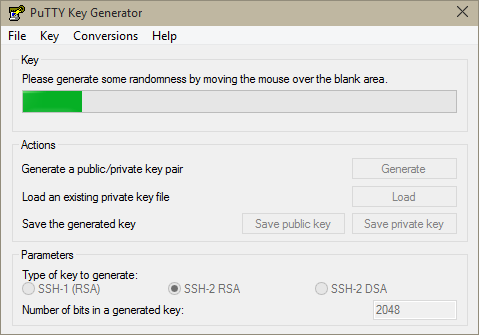
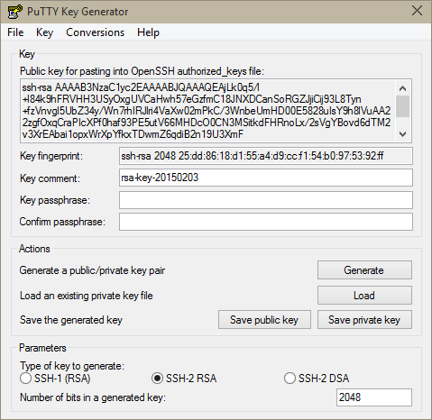
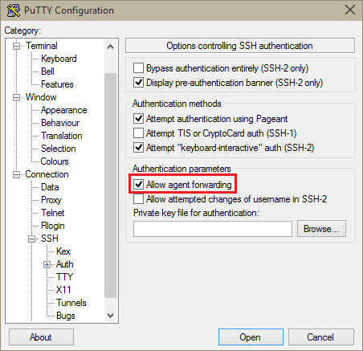

<properties
   pageTitle="Verwenden von SSH Tasten mit Hadoop auf Linux-basierten Cluster von Windows | Microsoft Azure"
   description="Informationen Sie zum Erstellen und Verwenden von SSH Tasten HDInsight Linux-basierten Cluster authentifizieren. Verbinden von Cluster von Windows-basierten Clients mithilfe von kitten SSH-Client."
   services="hdinsight"
   documentationCenter=""
   authors="Blackmist"
   manager="jhubbard"
   editor="cgronlun"
    tags="azure-portal"/>

<tags
   ms.service="hdinsight"
   ms.devlang="na"
   ms.topic="get-started-article"
   ms.tgt_pltfrm="na"
   ms.workload="big-data"
   ms.date="08/30/2016"
   ms.author="larryfr"/>

#Verwenden von SSH mit Linux-basierten Hadoop auf HDInsight von Windows

> [AZURE.SELECTOR]
- [Windows](hdinsight-hadoop-linux-use-ssh-windows.md)
- [Linux, Unix, OS X](hdinsight-hadoop-linux-use-ssh-unix.md)

[Secure Shell (SSH)](https://en.wikipedia.org/wiki/Secure_Shell) können Sie Vorgänge für eine Line Schnittstelle HDInsight Linux-basierten Cluster Remote ausführen. Dieses Dokument enthält Informationen zum Herstellen einer Verbindung mit HDInsight von Windows-basierten Clients mithilfe des kitten SSH-Clients.

> [AZURE.NOTE] Die Schritte in diesem Artikel wird davon ausgegangen, dass Sie mit einen Windows-basierten Client arbeiten. Wenn Sie einen Linux, Unix oder OS X-Client verwenden, finden Sie unter [Verwenden SSH mit Linux-basierten Hadoop auf HDInsight von Linux, Unix, oder OS X](hdinsight-hadoop-linux-use-ssh-unix.md).
>
> Wenn Sie Windows 10 haben und [Bash auf Ubuntu unter Windows](https://msdn.microsoft.com/commandline/wsl/about)verwenden, können Sie die Schritte im Dokument [Verwenden SSH mit Linux-basierten Hadoop auf HDInsight von Linux, Unix, oder OS X](hdinsight-hadoop-linux-use-ssh-unix.md) verwenden.

##Erforderliche Komponenten

* **Kitten** und **PuTTYGen** für Windows-basierte Clients. Diese Funktionen sind über [http://www.chiark.greenend.org.uk/~sgtatham/putty/download.html](http://www.chiark.greenend.org.uk/~sgtatham/putty/download.html)verfügbar.

* Eine moderne Webbrowser, HTML5 unterstützt.

ODER

* [Azure CLI](../xplat-cli-install.md).

    [AZURE.INCLUDE [use-latest-version](../../includes/hdinsight-use-latest-cli.md)] 

##Was ist SSH?

SSH ist ein Programm für Anmelden an und Remote Befehle auf einem Remoteserver ausführen. Mit Linux-basierten HDInsight SSH wird eine verschlüsselte Verbindung mit am Cluster-Knoten und stellt eine Befehlszeile, die Sie geben Sie Befehle verwenden. Befehle werden dann direkt auf dem Server ausgeführt werden.

###SSH-Benutzername

Eine SSH Benutzername ist der Name, den Sie verwenden, um mit dem Cluster HDInsight authentifizieren. Wenn Sie einen Benutzernamen SSH während der Clustererstellung angeben, wird dieser Benutzer auf allen Knoten im Cluster erstellt. Nachdem der Cluster erstellt wurde, können Sie diesen Benutzernamen für die Verbindung zu den am HDInsight Cluster-Knoten verwenden. Von der am Knoten können Sie dann auf die einzelnen Worker Knoten herstellen.

###SSH Kennwort oder öffentlicher Schlüssel

Ein Benutzer SSH können entweder ein Kennwort oder ein öffentlicher Schlüssel für die Authentifizierung. Ein Kennwort ist nur eine Textzeichenfolge, die Sie bilden, während ein öffentlicher Schlüssel Teil eines Kryptografieschlüsselpaares generiert, um eindeutig zu identifizieren ist.

Ein Schlüssel ist sicherer als ein Kennwort, aber es sind zusätzliche Schritte zum Generieren des Schlüssels erforderlich, und Sie müssen die Dateien, die mit dem Schlüssel an einem sicheren Ort verwalten. Wenn jede Person mit Zugriff auf die wichtigsten Dateien Schaden, erhalten sie Zugriff auf Ihr Konto aus. Oder wenn Sie die wichtigsten Dateien verlieren, Sie werden möglicherweise nicht bei Ihrem Konto anmelden.

Ein Paar aus Schlüssel besteht aus einem öffentlichen Schlüssel (der auf dem Server HDInsight gesendet werden kann) und einem privaten Schlüssel (der auf dem Clientcomputer speichern gespeichert ist.) Wenn Sie mit dem HDInsight Server über SSH verbinden, wird SSH-Client den privaten Schlüssel Authentifizierung mit dem Server auf Ihrem Computer verwendet.

##Erstellen Sie einen Schlüssel SSH

Verwenden Sie die folgende Informationen, wenn Sie SSH Tasten mit Ihren Cluster verwenden möchten. Wenn Sie ein Kennwort verwenden möchten, können Sie diesen Abschnitt überspringen.

1. Öffnen Sie PuTTYGen.

2. Wählen Sie für den **Typ der Schlüssel zum Generieren** **SSH-2 RSA**aus, und klicken Sie auf **generieren**.

    

3. Bewegen Sie den Mauszeiger um in den Bereich unterhalb der Fortschrittsbalken bis der Balken füllt. Verschieben die Maus generiert zufällige Daten, die zum Generieren des Schlüssels verwendet wird.

    

    Sobald die Taste erstellt wurde, wird der Schlüssel angezeigt.

4. Zur Erhöhung der Sicherheit können Sie geben Sie ein Kennwort in das Feld **Kennwort Key** , und geben Sie dann den gleichen Wert im Feld **Kennwort bestätigen** .

    

    > [AZURE.NOTE] Es wird dringend empfohlen, dass Sie ein sicheren Kennwort für den Schlüssel verwenden. Jedoch, wenn Sie das Kennwort vergessen, gibt es Möglichkeit keine, die Datenbank wiederherzustellen.

5. Klicken Sie auf die **privaten Schlüssel speichern** , um den Schlüssel in einer **.ppk** -Datei speichern. Dieser Schlüssel wird zum Cluster HDInsight Linux-basierten Authentifizierung verwendet werden.

    > [AZURE.NOTE] Wie sie Zugriff auf Ihre HDInsight Linux-basierten Cluster verwendet werden kann, sollten Sie diesen Schlüssel an einem sicheren Ort, speichern.

6. Klicken Sie auf **öffentlichen Schlüssel speichern** , um den Schlüssel als **txt** -Datei zu speichern. So können Sie den öffentlichen Schlüssel in Zukunft wiederverwenden können, wenn Sie weitere HDInsight Linux-basierten Cluster erstellen.

    > [AZURE.NOTE] Öffentliche Schlüssel wird auch am oberen Rand der PuTTYGen angezeigt. Sie können mit der rechten Maustaste in dieses Felds, kopieren Sie den Wert, und fügen Sie ihn in einem Formular ein Cluster im Portal Azure verwenden.

##Erstellen Sie einen Linux-basierten HDInsight cluster

Bei einen Cluster Linux-basierten HDInsight zu erstellen, müssen Sie den zuvor erstellten öffentlichen Schlüssel bereitstellen. Der Windows-basierten Clients gibt es zwei Methoden zum Erstellen eines Linux-basierten HDInsight Clusters:

* **Azure-Portal** – wird mit einem webbasierten Portal Cluster erstellt.

* **Azure CLI für Mac, Linux und Windows** - Befehlszeile Befehle verwendet, um den Cluster zu erstellen.

Öffentlichen Schlüssel für jede der folgenden Methoden werden erforderlich. Ausführliche Informationen zum Erstellen eines Clusters Linux-basierten HDInsight finden Sie unter [Bereitstellen von Linux-basierten HDInsight Cluster](hdinsight-hadoop-provision-linux-clusters.md).

###Azure-Portal

Bei Verwendung der [Azure-Portal] [ preview-portal] zum Erstellen eines Linux-basierten HDInsight Clusters müssen eine **SSH Benutzername**eingeben, und wählen Sie ein **Kennwort** oder eine **Öffentliche SSH-Schlüssel**eingeben.

Wenn Sie **Öffentliche SSH-Schlüssel**auswählen, können Sie entweder den öffentlichen Schlüssel einfügen (angezeigt, der __öffentlicher Schlüssel zum Einfügen in berechtigt OpenSSH\_Tasten Datei__ Feld PuttyGen,) in das Feld __SSH PublicKey__ oder select __Auswählen einer Datei__ zu navigieren, und wählen Sie die Datei, die den öffentlichen Schlüssel enthält.

Dies erstellt einen Benutzernamen für den angegebenen Benutzer und entweder Kennwortauthentifizierung oder SSH Key-Authentifizierung ermöglicht.

###Für Mac, Linux und Windows Azure Line-Benutzeroberfläche

Sie können die [Azure CLI für Mac, Linux und Windows](../xplat-cli-install.md) zum Erstellen eines neuen Clusters mithilfe der `azure hdinsight cluster create` Befehl.

Weitere Informationen zur Verwendung dieser Befehl finden Sie unter [Bereitstellen von Hadoop Linux Cluster in HDInsight mit benutzerdefinierten Optionen](hdinsight-hadoop-provision-linux-clusters.md).

##Verbinden Sie mit einem Cluster Linux-basierten HDInsight

1. Kitten zu öffnen.

    

2. Wenn Sie einen SSH Schlüssel bereitgestellt, wenn Sie Ihr Benutzerkonto erstellt haben, müssen Sie die folgende Schritte aus, um den privaten Schlüssel zu verwenden, wenn Sie mit dem Cluster authentifizieren auszuwählen ausführen:

    Klicken Sie in der **Kategorie**erweitern Sie **Verbindung** **SSH**, und wählen Sie **Authentifizierung**aus. Schließlich, klicken Sie auf **Durchsuchen** , und wählen Sie die .ppk-Datei, die Ihre privaten Schlüssel enthält.

    

3. Wählen Sie in der **Kategorie** **Sitzung**ein. Geben Sie auf dem Bildschirm **grundlegende Optionen für Ihre PuTTY Sitzung** die SSH-Adresse des Servers HDInsight im Feld **Hostname (oder IP-Adresse)** ein. Es gibt zwei mögliche SSH-Adressen, die Sie bei einer Verbindung mit einem Cluster verwenden können:

    * __Kopf Knotenadresse__: Verwenden Sie zum Verbinden mit den am Knoten des Cluster Ihren Clusternamen ein, klicken Sie dann **-ssh.azurehdinsight.net**. Beispielsweise **MeinCluster-ssh.azurehdinsight.net**.
    
    * __Kante Knotenadresse__: Wenn Sie eine Verbindung mit einem Server R auf HDInsight Cluster herstellen, können Sie auf den Server R Kantenknoten mithilfe der Adresse __RServer.CLUSTERNAME.ssh.azurehdinsight.net__, CLUSTERNAME, in dem der Name des Cluster ist verbinden. Beispielsweise __RServer.mycluster.ssh.azurehdinsight.net__.

    

4. Geben Sie einen Namen für diese Verbindung unter **Sitzungen gespeichert**, und klicken Sie dann auf **Speichern**, um die Verbindungsinformationen für eine zukünftige Verwendung zu speichern. Die Verbindung wird die Liste der gespeicherten Sitzungen hinzugefügt werden.

5. Klicken Sie auf **Öffnen** , damit Sie zum Cluster herstellen können.

    > [AZURE.NOTE] Wenn dies das erste Mal, die Sie mit dem Cluster verbunden haben ist, erhalten Sie eine Warnung. Dies ist normal. Wählen Sie **Ja** zum Zwischenspeichern des Servers RSA2-Taste, um den Vorgang fortzusetzen.

6. Wenn Sie dazu aufgefordert werden, geben Sie den Benutzer, den Sie eingegeben haben, wenn Sie den Cluster erstellt haben. Wenn Sie ein Kennwort für den Benutzer bereitgestellt haben, werden Sie aufgefordert, es auch einzugeben.

> [AZURE.NOTE] Die oben aufgeführten Schritte wird davon ausgegangen, dass verwendetem Anschluss 22, die mit der primären Headnode auf dem HDInsight Cluster verbunden werden. Wenn Sie den Port 23 verwenden, werden Sie in den sekundären verbunden. Weitere Informationen zu den am Knoten finden Sie unter [Verfügbarkeit und Zuverlässigkeit der Hadoop Cluster in HDInsight](hdinsight-high-availability-linux.md).

###Verbinden mit Arbeitskollegen Knoten

Worker Knoten nicht direkt außerhalb der Azure Datacenter zugegriffen werden, aber sie können aus dem Cluster am Knoten über SSH zugegriffen werden.

Wenn Sie einen SSH Schlüssel bereitgestellt, wenn Sie Ihr Benutzerkonto erstellt haben, müssen Sie die folgenden Schritte aus, um den privaten Schlüssel verwenden, bei der mit dem Cluster Authentifizierung, wenn Sie den Worker-Knoten verbinden möchten ausführen.

1. Installieren Sie Kostümfest aus [http://www.chiark.greenend.org.uk/~sgtatham/putty/download.html](http://www.chiark.greenend.org.uk/~sgtatham/putty/download.html). Dieses Programm wird verwendet, um die Tasten SSH für kitten Zwischenspeichern.

2. Führen Sie Kostümfest. Es wird auf ein Symbol in der Status-Taskleiste minimieren. Mit der rechten Maustaste des Symbol, und wählen Sie **Schlüssel hinzufügen**.

    

3. Wenn das Dialogfeld Durchsuchen angezeigt wird, wählen Sie die .ppk-Datei, die die Taste enthält, und klicken Sie dann auf **Öffnen**. Dadurch wird die Taste Kostümfest, die es zu kitten bieten wird bei der Verbindung mit dem Cluster hinzugefügt.

    > [AZURE.IMPORTANT] Wenn Sie einen Schlüssel SSH verwendet, um Ihr Konto zu sichern, müssen Sie die vorherigen Schritte ausführen, bevor Sie mit Arbeitskollegen Knoten verbunden werden können.

4. Kitten zu öffnen.

5. Wenn Sie einen Schlüssel SSH zum Authentifizieren im Abschnitt **Kategorie** verwenden erweitern Sie **Verbindung** **SSH**, und wählen Sie dann auf **Authentifizierung**.

    Aktivieren Sie im Abschnitt **Authentifizierungsparameter** **Zulassen Agent weiterleiten**aus. Dadurch wird die kitten am Cluster-Knoten bei der Verbindung mit Arbeitskollegen Knoten automatisch die Zertifikatauthentifizierung über die Verbindung übergeben.

    

6. Herstellen einer Verbindung mit dem Cluster wie zuvor beschrieben. Wenn Sie einen SSH Schlüssel für die Authentifizierung verwenden, nicht benötigen, wählen Sie die Taste: die Kostümfest hinzugefügt SSH-Taste zum Cluster Authentifizierung verwendet werden.

7. Nach dem Herstellen der Verbindung anhand der folgenden eine Liste der Knoten in Ihrem Cluster abzurufen. Ersetzen Sie *ADMINPASSWORD* mit dem Kennwort für Ihr Cluster Administrator-Konto an. Ersetzen Sie *CLUSTERNAME* mit dem Namen der Cluster aus.

        curl --user admin:ADMINPASSWORD https://CLUSTERNAME.azurehdinsight.net/api/v1/hosts

    Dadurch wird die Informationen im JSON-Format für die Knoten im Cluster, zurückgegeben einschließlich `host_name`, der den vollqualifizierten Domänennamen (FQDN) für die einzelnen Knoten enthält. Im folgenden ist ein Beispiel für ein `host_name` zurückgegeben werden, indem Sie den Befehl **Aufrollen** Eintrag:

        "host_name" : "workernode0.workernode-0-e2f35e63355b4f15a31c460b6d4e1230.j1.internal.cloudapp.net"

8. Nachdem Sie eine Liste der Worker Knoten haben, um eine Verbindung herstellen möchten, verwenden Sie den folgenden Befehl aus der PuTTY Sitzung um eine Verbindung mit einem Knoten Worker zu öffnen:

        ssh USERNAME@FQDN

    Ersetzen Sie mit Ihrem Benutzernamen SSH und *FQDN* mit dem vollqualifizierten Domänennamen für den Knoten Worker *Benutzernamen* ein. Beispielsweise `workernode0.workernode-0-e2f35e63355b4f15a31c460b6d4e1230.j1.internal.cloudapp.net`.

    > [AZURE.NOTE] Wenn Sie ein Kennwort Authentifizierung verwenden Ihre SSH-Sitzung, werden Sie aufgefordert, das Kennwort erneut eingeben. Wenn Sie einen Schlüssel SSH verwenden, sollte die Verbindung ohne Aufforderung Fertig stellen.

9. Sobald die Sitzung eingerichtet wurde, ändert sich die Aufforderung für Ihre PuTTY Sitzung aus `username@hn#-clustername` auf `username@wn#-clustername` um anzugeben, dass Sie auf den Knoten Worker verbunden sind. Alle Befehle, die Sie an diesem Punkt ausführen, werden auf dem Worker-Knoten ausgeführt.

10. Nachdem Sie das Ausführen von Aktionen für den Knoten Worker abgeschlossen haben, verwenden Sie die `exit` Befehl zum Schließen der Sitzung auf den Worker-Knoten. Dadurch wird zurückgegeben, Sie zu der `username@hn#-clustername` auffordern.

##Fügen Sie weitere Konten hinzu

Wenn Sie weitere Konten zum Cluster hinzufügen müssen, führen Sie die folgenden Schritte aus:

1. Generieren einer neuen öffentlichen und privaten Schlüssel für das neue Konto an, wie zuvor beschrieben.

2. Fügen Sie den neuen Benutzer mit den folgenden Befehl aus einer SSH-Sitzung zum Cluster hinzu:

        sudo adduser --disabled-password <username>

    Dies erstellt ein neues Benutzerkonto, deaktiviert aber Kennwortauthentifizierung.

3. Erstellen Sie das Verzeichnis und Dateien halten Sie die Taste mithilfe der folgenden Befehle:

        sudo mkdir -p /home/<username>/.ssh
        sudo touch /home/<username>/.ssh/authorized_keys
        sudo nano /home/<username>/.ssh/authorized_keys

4. Wenn der Nano-Editor geöffnet wird, kopieren Sie und fügen Sie des Inhalts der öffentliche Schlüssel für das neue Benutzerkonto ein. Schließlich verwenden Sie **STRG + X** , speichern Sie die Datei, und beenden Sie den Editor.

    

5. Verwenden Sie den folgenden Befehl Besitzrechte für den Ordner .ssh und den Inhalt in das neue Benutzerkonto zu ändern:

        sudo chown -hR <username>:<username> /home/<username>/.ssh

6. Sie sollten jetzt auf dem Server mit dem neuen Benutzerkonto und private Schlüssel authentifiziert sein.

##SSH Tunnel

SSH kann auf lokale Anfragen, z. B. Webanfragen, mit dem HDInsight Cluster tunnel verwendet werden. Die Anfrage wird dann zur angeforderten Ressource weitergeleitet werden, als ob es auf dem HDInsight Cluster am Knoten stammen.

> [AZURE.IMPORTANT] Ein SSH Tunnel ist eine Vorbedingung für den Zugriff auf der Web-Benutzeroberfläche für einige Dienste Hadoop. Beispielsweise kann sowohl den Auftrag Verlauf Benutzeroberfläche oder Ressourcenmanager Benutzeroberfläche werden nur zugegriffen mithilfe eines SSH Tunnels.

Weitere Informationen zum Erstellen und verwenden einen Tunnel SSH finden Sie unter [Verwenden SSH Tunnel Ambari Web UI, Ressourcen-Manager, JobHistory, NameNode, Oozie, und andere Elemente Benutzeroberfläches von Web Zugriff auf](hdinsight-linux-ambari-ssh-tunnel.md).

##Nächste Schritte

Nachdem Sie nun wissen, wie die Authentifizierung mithilfe einer SSH-Taste erfahren Sie, wie MapReduce mit Hadoop auf HDInsight verwenden.

* [Verwenden Sie die Struktur mit HDInsight](hdinsight-use-hive.md)

* [Schwein mit HDInsight verwenden](hdinsight-use-pig.md)

* [Verwenden von MapReduce Aufträge mit HDInsight](hdinsight-use-mapreduce.md)

[preview-portal]: https://portal.azure.com/
