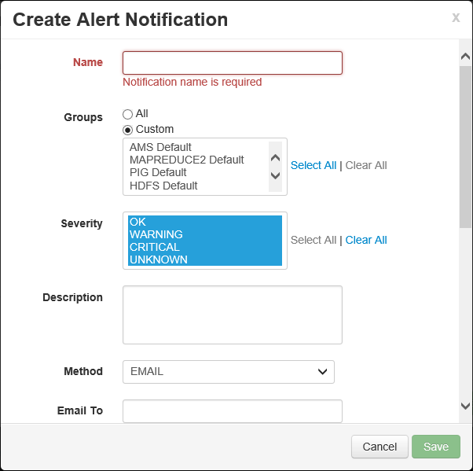
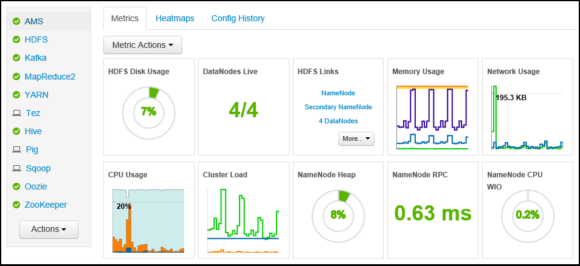
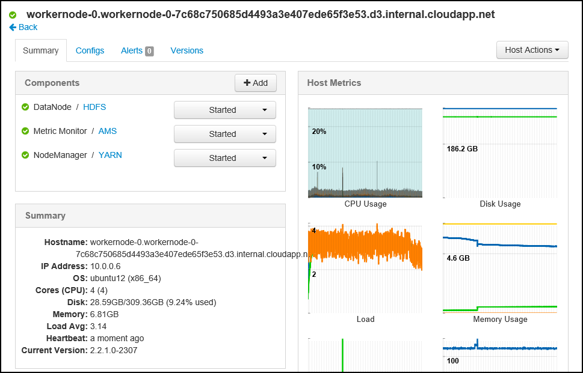

<properties
   pageTitle="Überwachen und Verwalten von HDInsight Cluster mithilfe der Web-Benutzeroberfläche für Apache Ambari | Microsoft Azure"
   description="Erfahren Sie, wie Ambari zum Überwachen und Verwalten von HDInsight Linux-basierten Cluster verwenden. In diesem Dokument erfahren Sie, wie der HDInsight Cluster enthaltenen Ambari Web-Benutzeroberfläche verwendet werden."
   services="hdinsight"
   documentationCenter=""
   authors="Blackmist"
   manager="jhubbard"
   editor="cgronlun"
    tags="azure-portal"/>

<tags
   ms.service="hdinsight"
   ms.devlang="na"
   ms.topic="article"
   ms.tgt_pltfrm="na"
   ms.workload="big-data"
   ms.date="09/27/2016"
   ms.author="larryfr"/>

#Verwalten von HDInsight Cluster mithilfe der Ambari Web-Benutzeroberfläche

[AZURE.INCLUDE [ambari-selector](../../includes/hdinsight-ambari-selector.md)]

Apache Ambari vereinfacht die Verwaltung und Überwachung von einem Cluster Hadoop können, indem Sie eine einfache Web-Benutzeroberfläche und den REST-API verwenden. Ambari auf HDInsight Linux-basierten Cluster enthalten ist, und wird verwendet, um den Cluster überwachen und Konfiguration vorzunehmen.

In diesem Dokument erfahren Sie, wie der Ambari Web-Benutzeroberfläche mit einem HDInsight Cluster verwendet werden.

##Was ist Ambari?

<a href="http://ambari.apache.org" target="_blank">Apache Ambari</a> macht Hadoop Management einfacher können, indem Sie ein einfach zu verwendendes Web-Benutzeroberfläche, die zum Bereitstellen, verwalten und überwachen Hadoop Cluster verwendet werden kann. Entwickler können diese Funktionen in ihre Programme mithilfe der <a href="https://github.com/apache/ambari/blob/trunk/ambari-server/docs/api/v1/index.md" target="_blank">Ambari REST-APIs</a>integrieren.

Die Ambari Web-Benutzeroberfläche wird standardmäßig mit HDInsight Linux-basierten Cluster bereitgestellt. 

##Konnektivität

Der Web-Benutzeroberfläche Ambari ist auf Ihre HDInsight Cluster am HTTPS://CLUSTERNAME.azurehdidnsight.net, darin __CLUSTERNAME__ auf den Namen des Ihren Cluster verfügbar. 

> [AZURE.IMPORTANT] Herstellen einer Verbindung mit Ambari auf HDInsight ist HTTPS erforderlich. Sie müssen auch authentifizieren zu Ambari mithilfe der Administratorkontonamen (die Standardeinstellung ist __Administrator__) und das Kennwort ein, die Sie zur Verfügung gestellt, wenn der Cluster erstellt wurde.

##SSH proxy

> [AZURE.NOTE] Während der Ambari für Ihren Cluster direkt über das Internet, einige Links aus der Ambari Web-Benutzeroberfläche (um beispielsweise die JobTracker) zugegriffen werden nicht im Internet verfügbar gemacht. So erhalten Sie Fehler "Server nicht gefunden" bei dem Versuch, diese Features zugreifen, es sei denn, Sie verwenden einen Secure Shell (SSH) Tunnel Proxy Web Datenverkehr an am Cluster-Knoten.

Informationen zum Erstellen eines SSH Tunnels für die Arbeit mit Ambari finden Sie unter [Verwenden SSH Tunnel Ambari Web UI, Ressourcen-Manager, JobHistory, NameNode, Oozie, und andere Elemente Benutzeroberfläches von Web Zugriff auf](hdinsight-linux-ambari-ssh-tunnel.md).

##Ambari Web-Benutzeroberfläche

Bei der Verbindung mit der Web-Benutzeroberfläche Ambari werden Sie aufgefordert, zu der Seite authentifizieren. Verwenden Sie den Cluster Administratorbenutzer (Standard-Administrator), und das Kennwort, die Sie während der Clustererstellung verwendet haben.

Beachten Sie beim Öffnen der Seite, die Statusleiste im oberen Bereich. Dies enthält die folgenden Informationen und Steuerelemente:

* **Ambari-Logo** - Öffnet das Dashboard mit zum Überwachen des Clusters verwendet werden kann.

* **Cluster Name # Ops** - zeigt die Anzahl der laufenden Ambari Vorgänge an. Der Name oder die **# Ops** auswählen, wird eine Liste von Aktionen im Hintergrund ausgeführt angezeigt.

* **# Benachrichtigungen** - Warnungen oder kritischen Benachrichtigungen, sofern vorhanden, für den Cluster. Hiermit wird eine Liste der Benachrichtigungen angezeigt.

* **Dashboard** - zeigt das Dashboard an.

* **Services** - Informationen und Konfiguration von Einstellungen für die Dienste im Cluster.

* **Hosts** - Informationen und Konfiguration von Einstellungen für die Knoten im Cluster.

* **Benachrichtigungen** - ein Protokoll von Informationen, Warnungen und kritischen Benachrichtigungen.

* **Admin** - Software Stapel/Dienste, die auf den Cluster, Service-Kontoinformationen und Kerberos-Sicherheit installiert werden.

* **Schaltfläche ' Administrator '** - Ambari Management, benutzereinstellungen und Abmelden.

##Für die Überwachung

###Benachrichtigungen

Ambari bietet viele Benachrichtigungen, die eine der folgenden als Status haben:

* **Okay**

* **Warnung**

* **KRITISCHE**

* **UNBEKANNT**

Benachrichtigungen als **OK** bewirkt, dass den Eintrag **# Benachrichtigungen** am oberen Rand der Seite, um die Anzahl der Benachrichtigungen anzuzeigen. Markieren diesen Eintrag wird der Benachrichtigungen und deren Status angezeigt.

Das von der Seite **Benachrichtigungen** angezeigt werden kann werden, mehrere Standardgruppen Benachrichtigungen angezeigt.

Sie können Gruppen verwalten, indem Sie im Menü **Aktionen** und auswählen **Benachrichtigen Gruppen verwalten**. So können Sie vorhandene Gruppen ändern oder neue Gruppen erstellen.

Sie können auch die Benachrichtigung über das Menü **Aktionen** erstellen. So können Sie Trigger zu erstellen, die per **E-Mail** oder **SNMP** Benachrichtigungen senden, wenn bestimmte Benachrichtigung/schwere Kombinationen ausgeführt werden. Sie können beispielsweise senden, dass eine Benachrichtigung, wenn eine der in der Gruppe **Standard aus** Warnungen **kritisch**festgelegt ist.

###Cluster

Die Registerkarte **Kennzahlen** des Dashboards enthält eine Reihe von Widgets, die zur Überwachung des Status von Ihrem Cluster auf einen Blick zu erleichtern. Mehrere Widgets, wie z. B. **CPU-Auslastung**, finden Sie weitere Informationen beim Klicken auf.

Die Registerkarte **Heatmaps** zeigt Kennzahlen als farbigen Heatmaps, für den Wechsel von Grün in Rot an.

Ausführlichere Informationen auf den Knoten im Cluster wählen Sie **Hosts**aus, und wählen Sie den spezifischen Knoten, das, dem Sie interessiert.

###Services

Die Seitenleiste der **Dienste** auf dem Dashboard bietet Kurzübersicht über den Status der Dienste auf dem Cluster ausgeführt. Verschiedene Symbole werden verwendet, um darauf hinzuweisen, Status oder Aktionen, die ausgeführt werden soll, z. B. eines Symbols gelben Papierkorb, wenn ein Dienst wiederverwendet werden muss.

Ein Dienst ausgewählt werden ausführlichen Informationen auf den Dienst angezeigt.

####Quicklinks

Einige Dienste zeigt den Link **Quicklinks** am oberen Rand der Seite. Dies kann für den Dienst-spezifische Web Benutzeroberflächen, wie Zugriff auf verwendet werden:

* **Historie** - MapReduce Historie.

* **Ressourcenmanager** - Ressourcen-Manager-Benutzeroberfläche aus.

* **NameNode** - Hadoop Distributed Datei System (HDFS) NameNode Benutzeroberfläche.

* **Web-Benutzeroberfläche Oozie** - Benutzeroberfläche Oozie.

Markieren eine der folgenden Links, wird eine neue Registerkarte in Ihrem Browser Öffnen der in der ausgewählten Seite angezeigt wird.

> [AZURE.NOTE] **Quicklinks** Link für jeden Dienst auswählen führt zu einem Fehler "Server nicht gefunden", wenn Sie einen Tunnel Secure Sockets Layer (SSL) Proxy Web Datenverkehr an den Cluster verwenden. Dies ist, da die Webanwendungen verwendet, um diese Informationen anzeigen nicht im Internet verfügbar gemacht werden.
>
> Informationen zur Verwendung von SSL-Tunnel mit HDInsight finden Sie unter [Verwenden SSH Tunnel Zugriff auf Ambari Web UI, Ressourcen-Manager, JobHistory, NameNode, Oozie, und andere Elemente Benutzeroberfläches von web](hdinsight-linux-ambari-ssh-tunnel.md)

##Projektmanagement

###Ambari Benutzer, Gruppen und Berechtigungen

Verwalten von Benutzern und Gruppen Berechtigungen sollten nicht mit HDInsight Cluster verwendet werden.

###Hosts

Die Seite **Hosts** Listet alle Hosts im Cluster. Gehen Sie folgendermaßen vor, um Hosts zu verwalten.

> [AZURE.NOTE] Hinzufügen, außer Betrieb oder einen Host recommissioning darf nicht mit HDInsight Cluster verwendet werden.

1. Wählen Sie die Hosts, die Sie verwalten möchten.

2. Verwenden Sie das Menü **Aktionen** , um die Aktion auszuwählen, die Sie ausführen möchten:

    * **Starten Sie alle Komponenten** – alle Komponenten auf dem Host starten.

    * **Beenden Sie alle Komponenten** - beenden Sie alle Komponenten auf dem Host.

    * **Starten Sie alle Komponenten neu** - beenden und starten Sie alle Komponenten auf dem Host.

    * **Wartungsmodus aktivieren** - Benachrichtigungen für den Host unterdrückt. Dies sollte aktiviert werden, wenn Sie Aktionen, die Benachrichtigungen durchführen, wie etwa einen Neustart von einem Webdienst, der ausgeführten Dienste auf verlassen generiert.

    * **Deaktivieren des Wartungsmodus** - gibt den Host zum normalen warnen.

    * **Beenden der** -Stopps DataNode oder NodeManagers auf dem Host.

    * **Start** - startet DataNode oder NodeManagers auf dem Host.

    * **Neu starten** - beenden und starten DataNode oder NodeManagers auf dem Host von.

    * **Nehmen** – entfernt einen Host aus dem Cluster.

        > [AZURE.NOTE] Verwenden Sie diese Aktion nicht auf HDInsight Cluster ein.

    * **Recommission** - Fügt eine zuvor außer Betrieb gesetzt Host zum Cluster hinzu.

        > [AZURE.NOTE] Verwenden Sie diese Aktion nicht auf HDInsight Cluster ein.

###Services

Verwenden Sie die Schaltfläche **Aktionen** der Seite **Dashboard** oder **Dienste** am Ende der Liste der Dienste zu beenden, und starten Sie alle Dienste.

> [AZURE.WARNING] Während der __Dienst hinzufügen__ , die in diesem Menü aufgelistet ist, sollten sie HDInsight Cluster Services hinzuzufügende nicht verwendet. Neue Dienste sollten mit einer Aktion Skript während der Bereitstellung Cluster hinzugefügt werden. Weitere Informationen zur Verwendung von Skript-Aktionen finden Sie unter [Anpassen HDInsight Cluster mit Skript-Aktionen](hdinsight-hadoop-customize-cluster-linux.md).

Während die Schaltfläche **Aktionen** alle Dienste gestartet werden kann, möchten häufig beginnen, beenden oder einen bestimmten Dienst neu starten. Gehen Sie folgendermaßen vor, Aktionen für einen einzelnen Dienst auszuführen:

1. Wählen Sie aus der Seite **Dashboard** oder **Dienste** einen Dienst aus.

2. Verwenden Sie die Schaltfläche **Service-Aktionen** oben auf der Registerkarte **Zusammenfassung** und wählen Sie die auszuführende Aktion aus. Dadurch wird den Dienst auf allen Knoten neu gestartet.

    

    > [AZURE.NOTE] Einige Dienste neu starten, während der Ausführung des Clusters möglicherweise Benachrichtigungen generieren. Die Schaltfläche **Dienst Aktionen** können Sie um dies zu vermeiden, **Wartungsmodus** für den Dienst aktivieren, bevor Sie den Neustart durchführen.

3. Nachdem eine Aktion ausgewählt wurde, wird der Eintrag **# lokal** am oberen Rand der Seite erhöht, um anzuzeigen, dass ein Hintergrundvorgang ausgeführt wird. Ist so konfiguriert, dass angezeigt wird, wird die Liste der Hintergrundvorgänge angezeigt.

    > [AZURE.NOTE] Wenn Sie für den Dienst **Wartungsmodus** aktiviert haben, müssen Sie es deaktivieren, indem Sie die Schaltfläche **Aktionen Dienst** verwenden, sobald der Vorgang abgeschlossen ist.

Gehen Sie folgendermaßen vor, um einen Dienst zu konfigurieren:

1. Wählen Sie aus der Seite **Dashboard** oder **Dienste** einen Dienst aus.

2. Wählen Sie die Registerkarte **Konfigurationen** aus. Die aktuelle Konfiguration wird angezeigt. Eine Liste der vorherigen Konfigurationen wird auch angezeigt.

    

3. Verwenden Sie die Felder angezeigt, um die Konfiguration zu ändern, und wählen Sie dann auf **Speichern**. Oder wählen Sie aus einer früheren Konfiguration, und wählen Sie dann auf den vorherigen Einstellungen zurücksetzen **aktuellen Datensatz zu machen** .

##Ambari Ansichten

Ambari Ansichten können Entwickler Benutzeroberflächenelemente in der Web-Benutzeroberfläche Ambari stecken mit [Ambari Ansichten Framework](https://cwiki.apache.org/confluence/display/AMBARI/Views). HDInsight bietet die folgenden Ansichten mit Hadoop Cluster Arten:

* Aus Warteschlange-Manager: der Warteschlangenmanager bietet eine einfache Benutzeroberfläche zum Anzeigen und Ändern von Warteschlangen aus.
* Struktur anzeigen: Die Struktur der Ansicht können Sie Struktur Abfragen direkt über den Webbrowser ausführen. Sie können Abfragen speichern, Ergebnisse anzeigen, speichern Sie Ergebnisse auf dem Cluster-Speicher oder Ergebnisse auf Ihr lokales System herunterladen. Weitere Informationen zum Verwenden von Ansichten Struktur finden Sie unter [Struktur verwenden Sie Ansichten mit HDInsight](hdinsight-hadoop-use-hive-ambari-view.md).
* Tez anzeigen: Der Tez Ansicht können Sie besser zu verstehen und Aufträge optimieren, indem Sie Informationen wie Tez Aufträge ausgeführt werden, und welche Ressourcen verwendet werden, indem Sie den Auftrag anzeigen.
