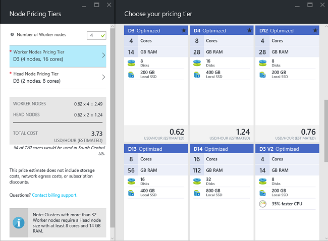

<properties
    pageTitle="Hadoop, HBase, Sturm oder Spark Cluster unter Linux in HDInsight erstellen | Microsoft Azure"
    description="Informationen Sie zum Erstellen Hadoop, HBase, Sturm oder auf Linux Cluster aufzeigen, über einen Browser, der Azure CLI, Azure PowerShell, REST, HDInsight oder über ein SDK."
    services="hdinsight"
    documentationCenter=""
    authors="mumian"
    manager="jhubbard"
    editor="cgronlun"
    tags="azure-portal"/>

<tags
    ms.service="hdinsight"
    ms.devlang="na"
    ms.topic="article"
    ms.tgt_pltfrm="na"
    ms.workload="big-data"
    ms.date="10/18/2016"
    ms.author="jgao"/>

# Erstellen von Linux-basierten Hadoop Cluster in HDInsight

[AZURE.INCLUDE [selector](../../includes/hdinsight-selector-create-clusters.md)]

Ein Hadoop Cluster besteht aus mehreren virtuellen Computern (Knoten), die für verteilten Verarbeitung von Vorgängen auf dem Cluster verwendet werden. Azure fasst Details der Implementierung der Installation und Konfiguration der einzelnen Knoten, daher Sie nur in der von allgemeinen Konfigurationsinformationen bereitstellen müssen. In diesem Artikel erfahren Sie diese Einstellungen Konfiguration ein.

## Anforderungen für Access-Steuerelement

[AZURE.INCLUDE [access-control](../../includes/hdinsight-access-control-requirements.md)]

## Clustertypen

Azure HDInsight bietet derzeit fünf Arten von Cluster, jede mit einer Reihe von Komponenten, um bestimmte Funktionalitäten bereitstellen.

| Clustertyp | Funktionalität |
| ------------ | ----------------------------- |
| Hadoop       | Abfragen und Analysen (Stapelverarbeitungsaufträge)     |
| HBase        | NoSQL Datenspeicher            |
| Storm        | Verarbeitung von Ereignissen in Echtzeit |
| Spark        | Verarbeitung von in-Memory, interaktive Abfragen Micro-Stapel Stream Verarbeitung |
| [Interaktive Struktur (Preview)](hdinsight-hadoop-use-interactive-hive.md) | Zwischenspeichern von in-Memory für interaktive oder schnellerer Struktur Abfragen|
| R Server auf Spark (Preview) | Eine Vielzahl von big Data-Statistiken, Vorhersage Modellierung und Computer Erlernen von Funktionen |

Jeder Cluster verfügt über eine eigene Anzahl von Knoten im Cluster Terminologie für Knoten im Cluster und virtueller Computer Standardgröße für die einzelnen Knoten. In der folgenden Tabelle ist die Anzahl der Knoten für die einzelnen Knoten in Klammern ein.

| Typ| Knoten | Diagramm|
|-----|------|--------|
|Hadoop| Kopf Knoten (2), Knoten Daten (1 +)||
|HBase|Kopf Server (2), Region Server (1 +), Master-/Zookeeper Knoten (3)||
|Storm|Nimbus Knoten (2), Vorgesetzten Server (1 +) Zookeeper Knoten (3)||
|Spark|Kopf Knoten (2), Worker Knoten (1 +) Zookeeper Knoten (3) (Free für A1 lassen virtueller Speicher)||

In der folgenden Tabelle sind die standardmäßigen virtuellen Computer Größen für HDInsight aufgeführt:

- Alle unterstützten Regionen außer Brasilien Süd und Japan "Westen":

  	|Clustertyp                     | Hadoop               | HBase                | Storm                | Spark                                                                 | R-Server |
  	|---------------------------------|----------------------|----------------------|----------------------|-----------------------------------------------------------------------|-----------------------------------------------------------------------|
  	|Standard Kopf – virtueller Speicher           | D3 Version 2                | D3 Version 2                | A3                   | D12 Version 2                                                                | D12 Version 2                                                                |
  	|Kopf – empfohlen virtueller Computer Größen      | 2 D3, D4 Version 2, D12 Version 2 | 2 D3, D4 Version 2, D12 Version 2 | A3, A4, A5           | D12 Version 2, D13 Version 2, D14 Version 2                                                | D12 Version 2, D13 Version 2, D14 Version 2                                                |
  	|Worker – Standard virtueller Speicher         | D3 Version 2                | D3 Version 2                | D3 Version 2                | Windows: D12 Version 2; Linux: D4 Version 2                                         | Windows: D12 Version 2; Linux: D4 Version 2                                         |
  	|Worker – empfohlen virtueller Computer Größen    | 2 D3, D4 Version 2, D12 Version 2 | 2 D3, D4 Version 2, D12 Version 2 | 2 D3, D4 Version 2, D12 Version 2 | Windows: D12 Version 2, D13 Version 2, 2 D14; Linux: D4 Version 2, 2 D12, D13 Version 2, D14 Version 2 | Windows: D12 Version 2, D13 Version 2, 2 D14; Linux: D4 Version 2, 2 D12, D13 Version 2, D14 Version 2 |
  	|Zookeeper – Standard virtueller Speicher      |                      | A3                   | A2                   |                                                                       |
  	|Zookeeper – empfohlen virtueller Computer Größen |                      | A3, A4, A5           | A2, A3, A4           |                                                                       |
  	|Rand - Standard-virtueller Speicher           |                      |                      |                      |                                                                       | Windows: D12 Version 2; Linux: D4 Version 2                                         |
  	|Rand - empfohlen virtueller Speicher       |                      |                      |                      |                                                                       | Windows: D12 Version 2, D13 Version 2, 2 D14; Linux: D4 Version 2, 2 D12, D13 Version 2, D14 Version 2 |

- Brasilien Süd und Japan "Westen" nur (keine Version 2 Größen hier):

  	|Clustertyp                     | Hadoop      | HBase       | Storm      | Spark                                          |R-Server|
  	|---------------------------------|-------------|-------------|------------|------------------------------------------------|--------|
  	|Standard Kopf – virtueller Speicher           | D3          | D3          | A3         | D12                                            | D12|
  	|Kopf – empfohlen virtueller Computer Größen      | D3, D4, D12 | D3, D4, D12 | A3, A4, A5 | D12, D13, D14                                  | D12, D13, D14|
  	|Worker – Standard virtueller Speicher         | D3          | D3          | D3         | Windows: D12; Linux: D4                        | Windows: D12; Linux: D4|
  	|Worker – empfohlen virtueller Computer Größen    | D3, D4, D12 | D3, D4, D12 | D3, D4, D12| Windows: D12, D13, D14; Linux: D4, D12, D13, D14| Windows: D12, D13, D14; Linux: D4, D12, D13, D14|
  	|Zookeeper – Standard virtueller Speicher      |             | A2          | A2         |                                                | |
  	|Zookeeper – empfohlen virtueller Computer Größen |             | A2, A3, A4  | A2, A3, A4 |                                                | |
  	|Kanten – Standard virtueller Computer Größen          |             |             |            |                                                | Windows: D12; Linux: D4 |
  	|Kante – empfohlen virtueller Computer Größen      |             |             |            |                                                | Windows: D12, D13, D14; Linux: D4, D12, D13, D14 |

Beachten Sie, dass Kopf als *Nimbus* für den Typ der Storm Cluster bezeichnet wird. Worker wird als *Bereich* für die Cluster HBase und als *Vorgesetzten* für den Typ der Storm Cluster bezeichnet.

> [AZURE.IMPORTANT] Wenn Sie beabsichtigen, auf dem Vorhandensein von mehr als 32 Worker-Knoten, bei der Clustererstellung oder durch Skalierung Cluster nach der Erstellung, müssen Sie eine Knotengröße am mit mindestens 8 Kernen und 14 GB RAM auswählen.

Sie können andere unsichere Komponenten, wie etwa Farbton oder R in diese grundlegenden Typen mithilfe von [Skript-Aktionen](#customize-clusters-using-script-action)hinzufügen.

> [AZURE.IMPORTANT] HDInsight Cluster einer Vielzahl von Typen, die entsprechen den Arbeitsbelastung oder Technologie, die für der Cluster optimiert ist nützlich sein. Es gibt keine unterstützte Methode zum einen Cluster zu erstellen, der mehrere Typen, z. B. Storm und HBase auf einem Cluster kombiniert. 

Wenn Ihre Lösung Technologien erforderlich, die über mehrere Arten von HDInsight Cluster verteilt sind ist, sollten Sie ein Azure-virtuellen Netzwerk erstellen und erstellen Sie die erforderlichen Clustertypen innerhalb des virtuellen Netzwerks. Dadurch wird die Cluster und Code, die, den Sie darauf, um direkt miteinander kommunizieren bereitstellen.

Weitere Informationen zum Verwenden von ein Azure-virtuellen Netzwerk mit HDInsight finden Sie unter [HDInsight mit Azure-virtuellen Netzwerke zu erweitern](hdinsight-extend-hadoop-virtual-network.md).

Ein Beispiel mit zwei Arten von Cluster innerhalb einer Azure-virtuellen Netzwerk finden Sie unter [Analysieren Sensordaten mit Storm und HBase](hdinsight-storm-sensor-data-analysis.md).

## Cluster Ebenen

Azure HDInsight stellt die Cloud-Angebote big Data in zwei Kategorien: Standard- und [Premium](hdinsight-component-versioning.md#hdinsight-standard-and-hdinsight-premium). HDInsight Premium umfasst R und andere zusätzlichen Komponenten. HDInsight Premium wird nur auf HDInsight Version 3.4 unterstützt.

Die folgende Tabelle listet die HDInsight Clustertyp und die HDInsight Premium-Support-Matrix.

| Clustertyp | Standard | Premium  |
|--------------|---------------|--------------|
| Hadoop       | Ja           | Ja          |
| Spark        | Ja           | Ja          |
| HBase        | Ja           | Nein           |
| Storm        | Ja           | Nein           |
| R Server auf Spark | Nein | Ja |

In dieser Tabelle werden aktualisiert, da weitere Clustertypen in HDInsight Premium enthalten sind. Das folgende Bildschirmabbild zeigt die Azure Portals Informationen für die Clustertypen von wählen.

## Grundlegende Konfigurationsoptionen

Im folgenden werden die grundlegenden Konfigurationsoptionen verwendet, um einen HDInsight Cluster erstellen möchten.

### Clustername ###

Clustername wird verwendet, um einen Cluster zu identifizieren. Clustername muss global eindeutig sein, und sie müssen die folgenden naming Richtlinien entsprechen:

- Das Feld muss eine Zeichenfolge sein, die zwischen 3 und 63 Zeichen enthält.
- Das Feld kann nur Buchstaben, Zahlen und Bindestriche enthalten.

### Clustertyp###

Finden Sie unter [Cluster Dateitypen](#cluster-types) und [Cluster Ebenen](#cluster-tiers).

### Betriebssystem ###

Sie können auf eine der folgenden beiden Betriebssystemen HDInsight Cluster erstellen:

- HDInsight unter Linux.  HDInsight bietet die Möglichkeit, Linux Cluster auf Azure konfigurieren. Konfigurieren Sie einen Linux Cluster, wenn Sie mit Linux oder Unix, Migrieren aus einer vorhandenen Hadoop Linux-basierte Lösung vertraut sind, oder möchten Sie einfache Integration mit für Linux erstellte Hadoop-Netz-Komponenten. Weitere Informationen finden Sie unter [Erste Schritte mit Hadoop auf Linux in HDInsight](hdinsight-hadoop-linux-tutorial-get-started.md).
- HDInsight unter Windows (Windows Server 2012 R2 Datacenter).

### HDInsight-version###

Hiermit wird die Version für diesen Cluster erforderlich HDInsight zu bestimmen. Weitere Informationen finden Sie unter [Hadoop Cluster Versionen und Komponenten HDInsight](https://go.microsoft.com/fwLink/?LinkID=320896&clcid=0x409).

### Namen des Abonnements.###

Jeder HDInsight Cluster ist eine Azure-Abonnement verknüpft.

### Gruppe Ressourcenname ###

[Ressourcenmanager Azure](../azure-resource-manager/resource-group-overview.md) hilft, die Arbeit mit den Ressourcen in der Anwendung als Gruppe, genannt einer Ressourcengruppe Azure. Sie können bereitstellen, aktualisieren, überwachen oder alle Ressourcen für eine Anwendung in einem einzigen koordinierte Vorgang löschen.

### Anmeldeinformationen###

Mit HDInsight Cluster können Sie zwei Benutzerkonten während der Clustererstellung konfigurieren:

- HTTP-Benutzer. Der Standard-Benutzername ist *Admin* mit der grundlegenden Konfiguration der Azure-Portal an. Manchmal spricht man "Cluster Benutzer".
- SSH Benutzer (Linux Cluster). Hiermit wird die Verbindung mit dem Cluster SSH verwenden. Nachdem der Cluster gemäß die Anweisungen in [Verwenden SSH mit Linux-basierten Hadoop auf HDInsight von Linux, Unix, oder OS X](hdinsight-hadoop-linux-use-ssh-unix.md) oder [Verwenden SSH mit Linux-basierten Hadoop auf HDInsight von Windows](hdinsight-hadoop-linux-use-ssh-unix.md)erstellt wird, können Sie zusätzliche SSH Benutzerkonten erstellen.

    >[AZURE.NOTE] Für Windows-basiertem Cluster können Sie einen Benutzer RDP Verbindung zum Cluster mit RDP erstellen.

### Datenquelle###

Das ursprüngliche Hadoop distributed Dateisystem (HDFS) wird auf dem Cluster viele lokale Festplatten verwendet. HDInsight verwendet Azure Blob-Speicher zum Speichern von Daten. Azure Blob-Speicher ist eine robuste, allgemeine Speicher-Lösung, die sich mit HDInsight nahtlos. Über eine Schnittstelle HDFS kann sämtlicher Komponenten HDInsight direkt auf strukturierte oder unstrukturierte Daten im BLOB-Speicher ausgeführt werden. Speichern von Daten im BLOB-Speicher hilft Ihnen, die Cluster HDInsight sicher zu löschen, die für die Berechnung verwendet werden, ohne dass Benutzerdaten verloren gehen.

Während der Konfiguration müssen Sie ein Konto Azure-Speicher und Container einer Azure Blob-Speicher auf das Konto Azure-Speicher angeben. Einige Prozesse Erstellung erfordern das Konto Azure-Speicher und die BLOB-Speichercontainer vorher erstellt werden. Der BLOB-Speichercontainer wird als den Standardspeicherort vom Cluster verwendet. Optional können Sie zusätzliche Azure-Speicher-Konten (verknüpfte Speicher) angeben, die vom Cluster auf zugegriffen werden kann. Cluster kann auch alle BLOB-Speichercontainer zugreifen, die mit dem vollständigen öffentlichen Lesezugriff oder öffentliche Lesezugriff für Blobs nur konfiguriert werden.  Weitere Informationen finden Sie unter [Verwalten des Zugriffs auf Ressourcen der Azure-Speicher](../storage/storage-manage-access-to-resources.md).

>[AZURE.NOTE] Ein BLOB-Speichercontainer bietet eine Gruppierung einer Reihe von Blobs wie in der folgenden Abbildung gezeigt.

Es empfiehlt sich nicht, verwenden den standardmäßige BLOB-Speichercontainer zum Speichern von Geschäftsdaten. Löschen den standardmäßige BLOB-Speichercontainer nach jeder verwenden, um den Speicherplatz zu verringern, empfiehlt sich das ist. Beachten Sie, dass der standardmäßige Container Anwendung und System enthält Protokolle. Vergewissern Sie sich, um die Protokolle vor dem Löschen des Containers abzurufen.

>[AZURE.WARNING] Freigeben einer BLOB-Speichercontainer für mehrere Cluster wird nicht unterstützt.

Weitere Informationen zur Verwendung von sekundären Blob-Speicher finden Sie unter [Verwenden von Azure BLOB-Speicher mit HDInsight](hdinsight-hadoop-use-blob-storage.md).

Zusätzlich zur Azure Blob-Speicher können Sie [Azure dem Datenspeicher](../data-lake-store/data-lake-store-overview.md) auch als Standard-Speicher-Konto für HBase Cluster in HDInsight und als verknüpfte Speicher für alle vier HDInsight Clustertypen verwenden. Weitere Informationen finden Sie unter [Erstellen einer HDInsight Cluster mit dem Datenspeicher verwenden Azure-Portal](../data-lake-store/data-lake-store-hdinsight-hadoop-use-portal.md).

### Speicherort (Bereich) ###

HDInsight Cluster und deren Speicher Standardkonto müssen sich am selben Speicherort Azure befinden.

Klicken Sie für eine Liste der unterstützten Regionen auf die Dropdown-Liste **Region** auf [HDInsight Preise](https://go.microsoft.com/fwLink/?LinkID=282635&clcid=0x409).

### Preise Ebenen Knoten###

Kunden sind für die Verwendung dieser Knoten für die Dauer der Nutzungsdauer des Cluster fakturiert. Abrechnung wird gestartet, wenn ein Cluster erstellt und wird beendet, wenn der Cluster gelöscht wird. Cluster nicht halten oder Aufheben der Reservierung.

Unterschiedliche Arten über die Typen von anderen Knoten, Zahlen von Knoten und Größen Knoten verfügen. Angenommen, hat ein Hadoop Clustertyp zwei _am Knoten_ und einen Standardwert vier _Datenknoten_, während Sie ein Storm Clustertyp weist zwei _Nimbus Knoten_, drei _Zookeeper Knoten_und einen Standardwert vier _Vorgesetzten Knoten_. Die Kosten der HDInsight Cluster wird durch die Anzahl der Knoten und die Größen virtuellen Computern für die Knoten bestimmt. Beispielsweise, wenn Sie wissen, dass Sie werden Operationen ausführen, die viel Speicher benötigen, können Sie eine Ressource berechnen mit mehr Speicher auswählen möchten. Zum Erlernen Zwecke, empfiehlt es sich in einem Knoten mit Daten verwenden. Weitere Informationen zur Preisgestaltung HDInsight finden Sie unter [HDInsight Preise](https://go.microsoft.com/fwLink/?LinkID=282635&clcid=0x409).

>[AZURE.NOTE] Das Limit Cluster variiert zwischen Azure-Abonnements. Wenden Sie sich an Abrechnungssupport zu erhöhen.

>Die Knoten verwendet, die für Ihren Cluster zählen nicht als virtuellen Computern, da die virtuellen Computern Bilder für die Knoten verwendet eine Implementierungsdetails des Diensts HDInsight sind. Die berechnen Adern untersuchten Knoten gegen die Gesamtzahl der berechnen Kerne Ihres Abonnements zur Verfügung zählen. Sie können sehen, dass die Anzahl der verfügbaren Kerne und die Kerne, die vom Cluster im Abschnitt Zusammenfassung des Blades Knoten Preise Ebenen beim Erstellen eines HDInsight Clusters verwendet werden.

Wenn Sie das Azure-Portal verwenden, um den Cluster konfigurieren, ist die Knotengröße über das Blade __Knoten Preise in__ verfügbar. Sie können auch die Kosten für die anderen Knoten Größen anzeigen. Das folgende Bildschirmabbild zeigt die Auswahlmöglichkeiten für einen Linux-Basis Hadoop Cluster.

Die folgende Tabelle enthält die Größe von HDInsight Cluster und den von Ihnen bereitgestellten belasten unterstützt.

#### Standard-Stufe: A-Serie####

Im Bereitstellungsmodell klassischen sind einige Größen virtueller Computer in PowerShell und CLI etwas anders.
* Standard_A3 ist groß
* Standard_A4 ist ExtraLarge

|Größe |CPUs|Arbeitsspeicher|NICs (Max.)|Max. Größe des Datenträger|Max. Daten Datenträger (1023 jeweils GB)|Max. IOPS (500 pro Datenträger)|
|---|---|---|---|---|---|---|
|Standard_A3\Large|4|7 GB|2|Temporäre = 285 GB |8|8 x 500|
|Standard_A4\ExtraLarge|8|14 GB|4|Temporäre = 605 GB |16|16 x 500|
|Standard_A6|4|28 GB|2|Temporäre = 285 GB |8|8 x 500|
|Standard_A7|8|56 GB|4|Temporäre = 605 GB |16|16 x 500|

#### Standard-Stufe: D-Serie####

|Größe |CPUs|Arbeitsspeicher|NICs (Max.)|Max. Größe des Datenträger|Max. Daten Datenträger (1023 jeweils GB)|Max. IOPS (500 pro Datenträger)|
|---|---|---|---|---|---|---|
|Standard_D3 |4|14 GB|4|Temporär (SSD) = 200 GB |8|8 x 500|
|Standard_D4 |8|28 GB|8|Temporär (SSD) = 400 GB |16|16 x 500|
|Standard_D12 |4|28 GB|4|Temporär (SSD) = 200 GB |8|8 x 500|
|Standard_D13 |8|56 GB|8|Temporär (SSD) = 400 GB |16|16 x 500|
|Standard_D14 |16|112 GB|8|Temporär (SSD) = 800 GB |32|32 x 500|

#### Standard-Stufe: Dv2-Serie####

|Größe |CPUs|Arbeitsspeicher|NICs (Max.)|Max. Größe des Datenträger|Max. Daten Datenträger (1023 jeweils GB)|Max. IOPS (500 pro Datenträger)|
|---|---|---|---|---|---|---|
|Standard_D3_v2 |4|14 GB|4|Temporär (SSD) = 200 GB |8|8 x 500|
|Standard_D4_v2 |8|28 GB|8|Temporär (SSD) = 400 GB |16|16 x 500|
|Standard_D12_v2 |4|28 GB|4|Temporär (SSD) = 200 GB |8|8 x 500|
|Standard_D13_v2 |8|56 GB|8|Temporär (SSD) = 400 GB |16|16 x 500|
|Standard_D14_v2 |16|112 GB|8|Temporär (SSD) = 800 GB |32|32 x 500|    

Aspekte beim Bereitstellen beachten Wenn Sie beabsichtigen, diese Ressourcen verwenden finden Sie unter [Größen für virtuelle Computer](../virtual-machines/virtual-machines-windows-sizes.md). Informationen zu den verschiedener Größe Preise finden Sie unter [HDInsight Preise](https://azure.microsoft.com/pricing/details/hdinsight).   

> [AZURE.IMPORTANT] Wenn Sie beabsichtigen, auf dem Vorhandensein von mehr als 32 Worker-Knoten, bei der Clustererstellung oder durch Skalierung Cluster nach der Erstellung, müssen Sie eine Knotengröße am mit mindestens 8 Kernen und 14 GB RAM auswählen.

Abrechnung wird gestartet, wenn ein Cluster erstellt wird, und wird beendet, wenn der Cluster gelöscht wird. Weitere Informationen zu Preisen finden Sie unter [Informationen zur Preisgestaltung der HDInsight](https://azure.microsoft.com/pricing/details/hdinsight/).

## Zusätzlichen Speicher verwenden

In einigen Fällen können Sie zusätzlichen Speicher zum Cluster hinzufügen möchten. Angenommen, Sie müssen möglicherweise mehrere Azure-Speicherkonten für die verschiedenen Ländern / Regionen oder anderen Diensten, aber sie alle mit HDInsight analysieren möchten.

Wenn Sie einen HDInsight Cluster erstellen oder nach ein Cluster erstellt wurde, können Sie Speicherkonten hinzufügen.  Finden Sie unter [Anpassen Linux-basierten HDInsight Cluster mithilfe der Aktion Skript](hdinsight-hadoop-customize-cluster-linux.md).

Weitere Informationen zu sekundären Blob-Speicher finden Sie unter [Verwenden von Azure Blob-Speicher mit HDInsight](hdinsight-hadoop-use-blob-storage.md). Weitere Informationen zu sekundären Datenspeicher dem finden Sie unter [Erstellen HDInsight Cluster mit dem Datenspeicher Azure-Portal verwenden](../data-lake-store/data-lake-store-hdinsight-hadoop-use-portal.md).

## Verwenden Sie die Struktur/Oozie metastore

Es wird dringend empfohlen, dass eine benutzerdefinierte Metastore verwenden, wenn Sie Ihre Struktur Tabellen beibehalten, nachdem Sie Ihren Cluster HDInsight löschen möchten. Sie werden nur die Metastore an einen anderen HDInsight Cluster angefügt.

> [AZURE.IMPORTANT] HDInsight Metastore für eine HDInsight Clusterversion erstellt, nicht für die verschiedenen HDInsight Cluster Versionen freigegeben werden. Eine Liste der Versionen HDInsight finden Sie unter [unterstützte HDInsight Versionen](hdinsight-component-versioning.md#supported-hdinsight-versions).

Die Metastore enthält die Struktur und Oozie Metadaten, wie etwa Tabellen Struktur, Partitionen, Schemas und Spalten. Die Metastore hilft Ihnen, Ihre Struktur und Oozie Metadaten beibehalten, damit Sie nicht um Struktur Tabellen oder Oozie Aufträge neu zu erstellen, wenn Sie einen neuen Cluster erstellen. Standardmäßig verwendet Struktur eine eingebettete SQL Azure-Datenbank, um diese Informationen zu speichern. Eingebettete Datenbank kann nicht die Metadaten beibehalten, wenn der Cluster gelöscht wird. Beim Erstellen von strukturtabelle in einem HDInsight Cluster mit einer Struktur Metastore konfiguriert werden die Tabellen beibehalten, wenn Sie mit der gleichen Struktur Metastore Cluster neu erstellen.

Konfiguration von Metastore ist nicht verfügbar für HBase Clustertypen.

> [AZURE.IMPORTANT] Verwenden Sie beim Erstellen einer benutzerdefinierten Metastore keinen Datenbanknamen, der Striche oder Bindestriche enthält. Dies kann den Erstellungsprozess Cluster zum Fehlschlagen verursachen.

## Verwenden von Azure virtuelle Netzwerke

Mit einer [Azure virtuelle Netzwerk](https://azure.microsoft.com/documentation/services/virtual-network/)können Sie eine sichere, beständigen-Netzwerk mit den Ressourcen, die Sie für Ihre Lösung müssen erstellen. Mit einem virtuellen Netzwerk können Sie folgende Aktionen ausführen:

* Verbinden Sie die Cloudressourcen zusammen in ein privates Netzwerk (nur Cloud).

    

* Verbinden Sie mit Ihrem lokalen Datencenter Netzwerk (zwischen Standorten oder Punkt-zu-Standort-) Cloudressourcen über ein virtuelles privates Netzwerk (VPN).

| Website-zu-Standort-Konfiguration | Punkt-zu-Standort-Konfiguration |
| -------------------------- | --------------------------- |
| Mit Standorten Konfiguration können Sie mehrere Ressourcen aus Datencenters der Azure-virtuellen Netzwerk verbinden mithilfe einer Hardware VPN oder Routing und Remote Access Service.  | Mit Punkt-zu-Standort-Konfiguration können Sie eine bestimmte Ressource mithilfe einer VPN-Software mit dem Azure virtuellen Netzwerk verbinden.  |

Windows-basiertem Cluster erfordern eine Version 1 (klassisch) virtuelle Netzwerk, während Linux-basierten Cluster virtuelles Netzwerk Version 2 (Azure Ressourcenmanager) erforderlich. Wenn Sie nicht die richtige Art von Netzwerk verfügen, wird es nicht verwendet werden, wenn Sie den Cluster zu erstellen.

Weitere Informationen zur Verwendung von HDInsight mit einem virtuellen Netzwerk, einschließlich Workflowkonfiguration Anforderungen für das virtuelle Netzwerk finden Sie unter [-Funktionen erweitern HDInsight mithilfe eines Azure virtuellen Netzwerks](hdinsight-extend-hadoop-virtual-network.md).

## Anpassen der Cluster mit HDInsight Cluster Anpassung (bootstrap)

Manchmal möchten die folgenden Konfigurationsdateien konfigurieren:

- clusterIdentity.xml
- Core-site.xml
- Gateway.Xml
- Hbase-env.xml
- Hbase-site.xml
- Hdfs-site.xml
- Struktur-env.xml
- Struktur-site.xml
- Mapred-Website
- Oozie-site.xml
- Oozie-env.xml
- Storm-site.xml
- Tez-site.xml
- Webhcat-site.xml
- aus – site.xml

Um die Änderungen über die Gültigkeitsdauer der einem Cluster beibehalten möchten, können Sie HDInsight Cluster Anpassung beim Erstellen der oder können Sie Ambari Linux-basierten Cluster verwenden. Weitere Informationen finden Sie unter [Anpassen HDInsight Cluster Bootstrap verwenden](hdinsight-hadoop-customize-cluster-bootstrap.md).

>[AZURE.NOTE] Die Windows-basierten Cluster können keine Änderungen aufgrund image beibehalten. Weitere Informationen finden Sie unter [Rolle Instanz Neustart fällig zu Updates für OS](http://blogs.msdn.com/b/kwill/archive/2012/09/19/role-instance-restarts-due-to-os-upgrades.aspx).  Wenn Sie die Änderungen über die Cluster gesamte Dauer beibehalten möchten, müssen Sie HDInsight Cluster Anpassung beim Erstellen der verwenden.

## Passen Sie mithilfe der Aktion Skript Cluster an

Können Sie weitere Komponenten installieren oder Cluster-Konfiguration mithilfe von Skripts während der Erstellung anpassen. Solche Skripts werden per **Skriptaktion**aufgerufen, also eine Konfiguration aus, die von der Azure-Portal, HDInsight Windows PowerShell-Cmdlets und HDInsight .NET SDK verwendet werden können. Weitere Informationen finden Sie unter [Anpassen HDInsight Cluster mithilfe der Aktion Skript](hdinsight-hadoop-customize-cluster-linux.md).

Einige systemeigenen Java-Komponenten, wie Mahout und verknüpften, können als Java-Archiv (JAR) Dateien im Cluster ausgeführt werden. Diese JAR-Dateien können an Azure Blob-Speicher verteilt und auf HDInsight Cluster über Hadoop Auftrag Einreichung Verfahren gesendet werden. Weitere Informationen finden Sie unter [Senden Hadoop Aufträge programmgesteuert](hdinsight-submit-hadoop-jobs-programmatically.md).

>[AZURE.NOTE] Wenn Sie Probleme beim Bereitstellen von JAR-Dateien in HDInsight Cluster oder beim Aufrufen von JAR-Dateien auf HDInsight Cluster haben, wenden Sie sich an den [Microsoft-Support](https://azure.microsoft.com/support/options/).

> Überlappung von HDInsight nicht unterstützt und ist nicht für Microsoft Support berechtigt. Listen der unterstützten Komponenten, finden Sie unter [Neuigkeiten in den Cluster Versionen von HDInsight bereitgestellten?](hdinsight-component-versioning.md)

## Verwenden Sie Kantenknoten

 Ein leere Kantenknoten ist ein Linux virtuellen Computern mit der gleichen Clienttools installiert und konfiguriert ist, wie in der Headnodes. Den Kantenknoten können für den Zugriff auf den Cluster, Testen Ihre Clientanwendungen und Ihre Clientanwendungen hosten. Weitere Informationen finden Sie unter [Verwenden von leeren Kante Knoten in HDInsight](hdinsight-apps-use-edge-node.md).
 
## Methoden zur Erstellung

In diesem Artikel haben Sie grundlegenden Informationen zum Erstellen eines Linux-basierten HDInsight Clusters erhalten. Verwenden Sie die folgende Tabelle, um bestimmte Informationen zum Erstellen eines Clusters mithilfe einer Methode, die am besten geeigneten finden.

| Erstellt mit Cluster | Webbrowser | Befehlszeile | REST-API | SDK | Linux, Unix oder Mac OS X | Windows |
| ------------------------------- |:----------------------:|:--------------------:|:------------------:|:------------:|:-----------------------------:|:------------:|
| [Azure-portal](hdinsight-hadoop-create-linux-clusters-portal.md) | ✔     | &nbsp; | &nbsp; | &nbsp; | ✔      | ✔ |
| [Factory Azure-Daten](hdinsight-hadoop-create-linux-clusters-adf.md) | ✔     | ✔  | ✔  |✔  | ✔      | ✔ |
| [Azure CLI](hdinsight-hadoop-create-linux-clusters-azure-cli.md)         | &nbsp; | ✔     | &nbsp; | &nbsp; | ✔      | ✔ |
| [Azure PowerShell](hdinsight-hadoop-create-linux-clusters-azure-powershell.md) | &nbsp; | ✔     | &nbsp; | &nbsp; | ✔ | ✔ |
| [Aufrollen](hdinsight-hadoop-create-linux-clusters-curl-rest.md) | &nbsp; | ✔     | ✔ | &nbsp; | ✔      | ✔ |
| [.NET SDK](hdinsight-hadoop-create-linux-clusters-dotnet-sdk.md) | &nbsp; | &nbsp; | &nbsp; | ✔ | ✔      | ✔ |
| [Azure Ressourcenmanager Vorlagen](hdinsight-hadoop-create-linux-clusters-arm-templates.md) | &nbsp; | ✔     | &nbsp; | &nbsp; | ✔      | ✔ |
