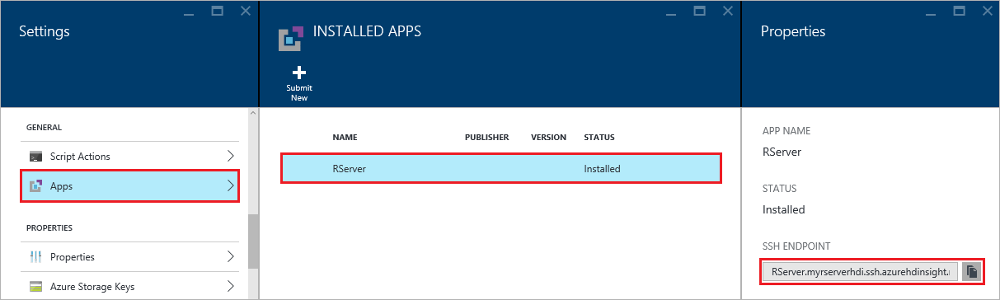

<properties
   pageTitle="Erste Schritte mit R Server auf HDInsight (Preview) | Azure"
   description="Erfahren Sie, wie ein Apache Spark auf HDInsight (Hadoop) Cluster zu erstellen, R Server (Preview) enthält, und klicken Sie dann senden Sie einer R Skripts auf dem Cluster."
   services="HDInsight"
   documentationCenter=""
   authors="jeffstokes72"
   manager="jhubbard"
   editor="cgronlun"
/>

<tags
   ms.service="HDInsight"
   ms.devlang="R"
   ms.topic="article"
   ms.tgt_pltfrm="na"
   ms.workload="data-services"
   ms.date="08/19/2016"
   ms.author="jeffstok"
/>

# Erste Schritte mit R Server auf HDInsight (Preview)

Die Geschenk für HDInsight Premium-Stufe umfasst R Server als Teil Ihrer Cluster HDInsight (Preview). Dadurch wird die R Skripts MapReduce und Spark verwenden, um verteilte Berechnungen auszuführen. In diesem Dokument erfahren Sie, wie Sie einen neuen R-Server auf HDInsight zu erstellen, und führen Sie ein R-Skript, das veranschaulicht, wie mit Spark für verteilten R Berechnungen.

## Erforderliche Komponenten

* __Ein Azure-Abonnement__: Bevor Sie dieses Lernprogramm beginnen, müssen Sie ein Azure-Abonnement. Weitere Informationen finden Sie unter [erste Azure kostenlose Testversion](https://azure.microsoft.com/documentation/videos/get-azure-free-trial-for-testing-hadoop-in-hdinsight/) .

* __Client A Secure Shell (SSH)__: ein SSH-Client wird verwendet, um Remote eine Verbindung mit Cluster HDInsight, und führen Sie die Befehle direkt auf den Cluster. Linux, Unix und OS X Systeme bieten einen SSH-Client, bis die `ssh` Befehl. Für Windows-Betriebssysteme empfehlen wir [kitten](http://www.chiark.greenend.org.uk/~sgtatham/putty/download.html).

    * __SSH Tasten (optional)__: Sie können das Verbindung mit dem Cluster verwenden entweder ein Kennwort oder ein öffentlicher Schlüssel verwendete SSH-Konto sichern. Mit einem Kennwort ist einfacher und ermöglicht Ihnen den Einstieg zu ohne Erstellen einer öffentlichen und privaten Schlüssel; verwenden einen Schlüssel ist jedoch sicherer.
    
        Die Schritte in diesem Dokument wird davon ausgegangen, dass Sie ein Kennwort verwenden. Informationen zum Erstellen und Verwenden von SSH Tasten mit HDInsight finden Sie unter den folgenden Dokumenten:
        
        * [Verwenden von SSH mit HDInsight von Linux, Unix oder OS X-clients](hdinsight-hadoop-linux-use-ssh-unix.md)
        
        * [Verwenden von SSH mit HDInsight von Windows-clients](hdinsight-hadoop-linux-use-ssh-windows.md)

### Anforderungen für Access-Steuerelement

[AZURE.INCLUDE [access-control](../../includes/hdinsight-access-control-requirements.md)]

## Erstellen des Clusters

> [AZURE.NOTE] Die Schritte in diesem Dokument Erstellen einer R Server auf HDInsight grundlegende Konfigurationsinformationen zu verwenden. Andere Einstellungen Cluster Konfiguration (beispielsweise zusätzlichen Speicher-Konten hinzufügen, ein Azure-virtuellen Netzwerk verwenden oder erstellen eine Metastore für Struktur) finden Sie unter [Erstellen von Linux-basierten HDInsight Cluster](hdinsight-hadoop-provision-linux-clusters.md).

1. Melden Sie sich mit dem [Azure-Portal](https://portal.azure.com)aus.

2. Wählen Sie __neu__, __Daten + Analytics__, und klicken Sie dann __HDInsight__.

    

3. Geben Sie einen Namen für den Cluster im Feld __Clusternamen__ ein. Wenn Sie mehrere Azure-Abonnements verfügen, verwenden Sie den Eintrag __Abonnement__ den auswählen, die Sie verwenden möchten.

    

4. Wählen Sie aus, __Wählen Sie Cluster aus__. Klicken Sie auf das Blade __Clustertyp__ wählen Sie die folgenden Optionen aus:

    * __Clustertyp__: R Server auf Spark
    
    * __Cluster Ebene__: Premium

    Lassen Sie die anderen Optionen die Standardwerte, und klicken Sie dann verwenden Sie die Schaltfläche __auswählen__ , um den Clustertyp zu speichern.
    
    
    
    > [AZURE.NOTE] Sie können auch R Server zu anderen HDInsight Cluster (z. B. Hadoop oder HBase,), indem den Clustertyp, dann auswählen __Premium__und hinzufügen.

5. Wählen Sie die **Ressourcengruppe** zum Anzeigen einer Liste der vorhandenen Ressourcengruppen, und wählen Sie dann die Optionen, um den Cluster in zu erstellen. Alternativ können Sie wählen Sie **Neu erstellen** und geben Sie den Namen der neuen Ressourcengruppe. Um anzugeben, dass der neuen Gruppennamen verfügbar ist, wird ein grünes Häkchen angezeigt.

    > [AZURE.NOTE] Dieser Eintrag wird standardmäßig auf eine Ihrer bestehenden Gruppen für die Ressource festgelegt, sofern diese verfügbar sind.
    
    Verwenden Sie die Schaltfläche __auswählen__ , um die Ressourcengruppe speichern.

6. Wählen Sie die **Anmeldeinformationen**ein, und geben Sie eine **Cluster-Benutzernamen** und das **Anmeldekennwort Cluster**.

    Geben Sie eine __SSH Benutzernamen__ein.  SSH wird verwendet, um die Remote-Verbindung mit einem __Secure Shell (SSH)__ -Client Cluster. In diesem Dialogfeld oder Cluster (Registerkarte Konfiguration für den Cluster) erstellt wurde, können Sie entweder den SSH Benutzer angeben. R Server ist so konfiguriert, dass __SSH Username__ "Remoteuser" erwartet werden.  Wenn Sie einen anderen Benutzernamen verwenden, müssen Sie einen weiteren Schritt ausführen, nachdem der Cluster erstellt wird.
    
    

    __SSH Authentication Type__: Wählen Sie __Kennwort__ als Authentifizierungstyp aus, es sei denn, Sie verwenden eines öffentlichen Schlüssels bevorzugen.  Sie benötigen einen öffentlichen und privaten Schlüssel, wenn Sie auf dem Cluster über einen remote-Client, z. B. RTVS, RStudio oder einem anderen Desktop IDE R-Server zugreifen möchten.   

    Erstellen und Verwenden eines öffentlichen und privaten Schlüssels Paar "Öffentlicher Schlüssel" Wählen Sie aus, und gehen Sie wie folgt.  Diese Anweisungen wird davon ausgegangen, dass Sie Cygwin mit ssh Keygen oder höher installiert haben.

    -    Generieren einer öffentlichen und privaten Schlüssel über die Befehlszeile auf Ihrem Laptop an:
      
            SSH Keygen t - Rsa -b 2048 – f < privaten Schlüssel Dateiname >
      
    -    Dadurch wird eine Datei für den privaten Schlüssel und die Datei für einen öffentlichen Key unter der Name < privaten Schlüssel Dateiname > pub, z. B. erstellt  Davec und davec.pub.  Geben Sie dann auf die Datei für den öffentliche Schlüssel (* PUB) beim Zuweisen von HDI Cluster Anmeldeinformationen:
      
          
      
    -    Von Änderungsberechtigungen für private Keyfile auf Ihrem laptop
      
            Chmod 600 < privaten Schlüssel Filename >
      
    -    Mit der Datei für den privaten Schlüssel mit SSH für remote-Anmeldung, z. B.
      
            SSH – i < privaten Schlüssel Filename >remoteuser@<hostname public ip>
      
      oder als Teil die Definition Ihrer Hadoop Spark berechnen Kontext für R Server auf dem Client (siehe Using Microsoft R Server als Hadoop Client im Abschnitt [erstellen ein berechnen Kontext für Spark](https://msdn.microsoft.com/microsoft-r/scaler-spark-getting-started#creating-a-compute-context-for-spark) des- [Leitfaden für erste Schritte mit RevoScaleR Hadoop Spark](https://msdn.microsoft.com/microsoft-r/scaler-spark-getting-started).)

7. Wählen Sie die **Datenquelle** verfügen, um eine Datenquelle für den Cluster auszuwählen. Wählen Sie ein vorhandenes Speicherkonto durch auswählen, __Wählen Sie Speicherkonto__ auswählen und dann auf das Konto aus, oder Erstellen eines neuen Kontos mit den __neu__ Link im Abschnitt __Speicher-Konto__ .

    Wenn Sie __neu__auswählen, geben Sie einen Namen für das neue Speicherkonto. Ein grünes Häkchen wird angezeigt, wenn der Name akzeptiert wird.

    Der __Standardmäßige Container__ wird standardmäßig auf den Namen der Cluster verwendet werden. Lassen Sie dieses als Wert ein.
    
    Wählen Sie __Speicherort__ , um den Bereich zum Erstellen des Speicherkontos auszuwählen.
    
    > [AZURE.IMPORTANT] Markieren den Speicherort für die Standarddatenquelle wird den Speicherort der Cluster HDInsight einstellen. Die Datenquelle Cluster und Standardwert muss im selben Bereich befinden.

    Verwenden Sie die Schaltfläche **auswählen** , um die Datenquellenkonfiguration zu speichern.
    
    

8. Wählen Sie **Knoten Preise Ebenen** , um Informationen zu den Knoten anzuzeigen, die für diesen Cluster erstellt wird. Es sei denn, Sie wissen, dass Sie einen größeren Cluster benötigen, lassen Sie die Anzahl der Worker Knoten dem Standard von `4`. Die geschätzte Kosten Cluster wird innerhalb der Blade angezeigt.

    > [AZURE.NOTE] Bei Bedarf können Sie Ihren Cluster später über das Portal erneut Größe (Cluster-Einstellungen > -> Cluster skalieren) zum Vergrößern oder verkleinern die Anzahl der Worker-Knoten.  Dies kann im Leerlauf ab dem Cluster nicht in verwenden, oder zum Hinzufügen von Kapazität, um die Anforderungen für größere Aufgaben hilfreich sein.

    Einige Faktoren zu beachten beim Ändern der Größe Ihrer Cluster, die Datenknoten und den Rand Knoten gehören:  
   
    - Die Leistung von verteilten R Server Analysen auf Spark ist die Anzahl der Worker Knoten proportional, wenn die Daten groß ist.  
    - Die Leistung von R Server Analysen sind in der Größe des analysierten Daten linear. Beispiel:  
        - Für kleine und bequeme Daten werden am besten, wenn Sie in einem lokalen Computer Kontext auf die Kantenknoten analysiert.  Weitere Informationen zu den Szenarien unter dem finden Sie unter die lokale und Spark berechnen Kontexten funktionieren am besten berechnen Kontextoptionen für R Server auf HDInsight. 
        - Wenn Sie melden Sie sich bei der Kantenknoten und ausführen und dann alle Ihre R Skript es jedoch die ScaleR Rx-Funktionen werden auf den Rand Knoten <strong>lokal</strong> ausführen sollten daher den Speicher und die Anzahl der Kerne des Knotens Kante entsprechend Größe geändert werden. Dasselbe gilt, wenn Sie R Server auf HDI als Kontext remote berechnen von Ihrem Laptop verwenden.
    
    

    Verwenden Sie die Schaltfläche **auswählen** , um den Knoten Konfiguration Preise zu speichern.
    
9. Stellen Sie in der **Neuen HDInsight Cluster** Blade sicher, dass **an Startboard anheften** ausgewählt ist, und wählen Sie dann auf **Erstellen**. Diese Cluster erstellen und hinzufügen eine Kachel dafür zu den Startboard von Ihrer Azure-Portal. Das Symbol wird mitgeteilt wird, dass der Cluster besteht im erstellen wird so geändert, dass das HDInsight-Symbol angezeigt werden, nachdem Sie erstellt wurde.

  	| Beim Erstellen | Erstellung abgeschlossen |
  	| ------------------ | --------------------- |
  	|  |  |

    > [AZURE.NOTE] Es dauert einige Zeit für den Cluster, normalerweise ungefähr 15 Minuten erstellt werden. Verwenden Sie die Kachel auf der Startboard oder den Eintrag **Benachrichtigungen** auf der linken Seite der Seite auf den Erstellungsprozess zu prüfen.

## Verbinden Sie mit dem R Server Kantenknoten

Verbinden Sie mit R Server Kantenknoten des HDInsight Cluster SSH verwenden:

    ssh USERNAME@r-server.CLUSTERNAME-ssh.azurehdinsight.net
    
> [AZURE.NOTE] Finden Sie auch die `R-Server.CLUSTERNAME-ssh.azurehdinsight.net` Adresse im Azure-Portal, indem Sie Ihre Cluster, und klicken Sie dann __Alle Einstellungen__, __Apps__und __RServer__auswählen. Dadurch wird die SSH Endpunkt Informationen für den Rand Knoten angezeigt.
>
> 
    
Wenn Sie ein Kennwort zum Sichern Ihrer SSH Benutzerkontos verwendet haben, werden Sie aufgefordert, es einzugeben. Wenn Sie einen öffentlichen Schlüssel verwendet haben, müssen Sie möglicherweise verwenden Sie die `-i` Parameter, um den passenden privaten Schlüssel anzugeben. Beispielsweise `ssh -i ~/.ssh/id_rsa USERNAME@R-Server.CLUSTERNAME-ssh.azurehdinsight.net`.
    
Weitere Informationen zum Verwenden von SSH mit Linux-basierten HDInsight finden Sie unter den folgenden Artikeln:

* [Verwenden von SSH mit Linux-basierten Hadoop auf HDInsight von Linux, Unix oder OS X](hdinsight-hadoop-linux-use-ssh-unix.md)

* [Verwenden von SSH mit Linux-basierten Hadoop auf HDInsight von Windows](hdinsight-hadoop-linux-use-ssh-windows.md)

Nachdem die Verbindung hergestellt wurde, werden Sie bei Aufforderung ähnlich wie der folgende eintreffen.

    username@ed00-myrser:~$

## Verwenden Sie die Konsole R

1. Verwenden Sie den folgenden Befehl aus der Sitzung SSH zum Starten der Konsole R.

        R
    
    Ähnlich wie das folgende Ergebnis wird angezeigt.
    
        R version 3.2.2 (2015-08-14) -- "Fire Safety"
        Copyright (C) 2015 The R Foundation for Statistical Computing
        Platform: x86_64-pc-linux-gnu (64-bit)

        R is free software and comes with ABSOLUTELY NO WARRANTY.
        You are welcome to redistribute it under certain conditions.
        Type 'license()' or 'licence()' for distribution details.

        Natural language support but running in an English locale

        R is a collaborative project with many contributors.
        Type 'contributors()' for more information and
        'citation()' on how to cite R or R packages in publications.

        Type 'demo()' for some demos, 'help()' for on-line help, or
        'help.start()' for an HTML browser interface to help.
        Type 'q()' to quit R.

        Microsoft R Server version 8.0: an enhanced distribution of R
        Microsoft packages Copyright (C) 2016 Microsoft Corporation

        Type 'readme()' for release notes.

        >

2. Aus der `>` auffordern, Sie können R Code eingeben. R Server umfasst Pakete, mit denen Sie auf einfache Weise Hadoop interagieren und verteilte Berechnungen ausführen. Verwenden Sie beispielsweise den folgenden Befehl aus, um der Stammebene der Standard-Dateisystem für den Cluster HDInsight anzuzeigen.

        rxHadoopListFiles("/")
    
    Sie können auch die WASB Formatvorlage adressieren verwenden.
    
        rxHadoopListFiles("wasbs:///")

## Verwenden von R Server auf HDI aus einer remote-Instanz von Microsoft R Server oder Microsoft R Client

Pro im Abschnitt über hinsichtlich der Nutzung dieser öffentlichen und privaten Schlüssel Paare Zugriff auf den Cluster, es ist möglich, Setup Zugriff auf den HDI Hadoop Spark berechnen Kontext aus einer remote-Instanz von Microsoft R Server oder Microsoft R-Client auf einem Desktop- oder Laptopcomputer ausgeführt (siehe Using Microsoft R Server als Hadoop Client im Abschnitt [erstellen ein berechnen Kontext für Spark](https://msdn.microsoft.com/microsoft-r/scaler-spark-getting-started#creating-a-compute-context-for-spark) des- [Leitfaden für erste Schritte mit RevoScaleR Hadoop Spark](https://msdn.microsoft.com/microsoft-r/scaler-spark-getting-started)).  Ausführen, damit Sie die folgenden Optionen aus, wenn Sie die RxSpark definieren berechnen auf Ihrem Laptop Kontext angeben müssen: HdfsShareDir, ShareDir, SshUsername, SshHostname, SshSwitches, und SshProfileScript. Beispiel:

    
    myNameNode <- "default"
    myPort <- 0 
 
    mySshHostname  <- 'rkrrehdi1-ssh.azurehdinsight.net'  # HDI secure shell hostname
    mySshUsername  <- 'remoteuser'# HDI SSH username
    mySshSwitches  <- '-i /cygdrive/c/Data/R/davec'   # HDI SSH private key
 
    myhdfsShareDir <- paste("/user/RevoShare", mySshUsername, sep="/")
    myShareDir <- paste("/var/RevoShare" , mySshUsername, sep="/")
 
    mySparkCluster <- RxSpark(
      hdfsShareDir = myhdfsShareDir,
      shareDir     = myShareDir,
      sshUsername  = mySshUsername,
      sshHostname  = mySshHostname,
      sshSwitches  = mySshSwitches,
      sshProfileScript = '/etc/profile',
      nameNode     = myNameNode,
      port         = myPort,
      consoleOutput= TRUE
    )

    
 
## Verwenden von einem Kontext berechnen

Ein Kontext berechnen können Sie steuern, ob Berechnung lokal auf den Rand Knoten durchgeführt werden, oder gibt an, ob sie über den Knoten im Cluster HDInsight verteilt werden.
        
1. Der R-Konsole anhand der folgenden um Beispieldaten in der Standardspeicher für HDInsight zu laden.

        # Set the HDFS (WASB) location of example data
        bigDataDirRoot <- "/example/data"
        # create a local folder for storaging data temporarily
        source <- "/tmp/AirOnTimeCSV2012"
        dir.create(source)
        # Download data to the tmp folder
        remoteDir <- "http://packages.revolutionanalytics.com/datasets/AirOnTimeCSV2012"
        download.file(file.path(remoteDir, "airOT201201.csv"), file.path(source, "airOT201201.csv"))
        download.file(file.path(remoteDir, "airOT201202.csv"), file.path(source, "airOT201202.csv"))
        download.file(file.path(remoteDir, "airOT201203.csv"), file.path(source, "airOT201203.csv"))
        download.file(file.path(remoteDir, "airOT201204.csv"), file.path(source, "airOT201204.csv"))
        download.file(file.path(remoteDir, "airOT201205.csv"), file.path(source, "airOT201205.csv"))
        download.file(file.path(remoteDir, "airOT201206.csv"), file.path(source, "airOT201206.csv"))
        download.file(file.path(remoteDir, "airOT201207.csv"), file.path(source, "airOT201207.csv"))
        download.file(file.path(remoteDir, "airOT201208.csv"), file.path(source, "airOT201208.csv"))
        download.file(file.path(remoteDir, "airOT201209.csv"), file.path(source, "airOT201209.csv"))
        download.file(file.path(remoteDir, "airOT201210.csv"), file.path(source, "airOT201210.csv"))
        download.file(file.path(remoteDir, "airOT201211.csv"), file.path(source, "airOT201211.csv"))
        download.file(file.path(remoteDir, "airOT201212.csv"), file.path(source, "airOT201212.csv"))
        # Set directory in bigDataDirRoot to load the data into
        inputDir <- file.path(bigDataDirRoot,"AirOnTimeCSV2012") 
        # Make the directory
        rxHadoopMakeDir(inputDir)
        # Copy the data from source to input
        rxHadoopCopyFromLocal(source, bigDataDirRoot)

2. Als Nächstes, lassen Sie uns einige Informationen Daten erstellen und zwei Datenquellen definieren, damit wir mit den Daten arbeiten können.

        # Define the HDFS (WASB) file system
        hdfsFS <- RxHdfsFileSystem()
        # Create info list for the airline data
        airlineColInfo <- list(
            DAY_OF_WEEK = list(type = "factor"),
            ORIGIN = list(type = "factor"),
            DEST = list(type = "factor"),
            DEP_TIME = list(type = "integer"),
            ARR_DEL15 = list(type = "logical"))

        # get all the column names
        varNames <- names(airlineColInfo)

        # Define the text data source in hdfs
        airOnTimeData <- RxTextData(inputDir, colInfo = airlineColInfo, varsToKeep = varNames, fileSystem = hdfsFS)
        # Define the text data source in local system
        airOnTimeDataLocal <- RxTextData(source, colInfo = airlineColInfo, varsToKeep = varNames)

        # formula to use
        formula = "ARR_DEL15 ~ ORIGIN + DAY_OF_WEEK + DEP_TIME + DEST"

3. Führen wir eine logistische Regression über die Daten, verwenden Sie die lokale berechnen Kontext.

        # Set a local compute context
        rxSetComputeContext("local")
        # Run a logistic regression
        system.time(
            modelLocal <- rxLogit(formula, data = airOnTimeDataLocal)
        )
        # Display a summary 
        summary(modelLocal)

    Ausgabe sollte angezeigt werden, die mit Linien ähnlich wie der folgende endet.

        Data: airOnTimeDataLocal (RxTextData Data Source)
        File name: /tmp/AirOnTimeCSV2012
        Dependent variable(s): ARR_DEL15
        Total independent variables: 634 (Including number dropped: 3)
        Number of valid observations: 6005381
        Number of missing observations: 91381
        -2*LogLikelihood: 5143814.1504 (Residual deviance on 6004750 degrees of freedom)

        Coefficients:
                        Estimate Std. Error z value Pr(>|z|)
        (Intercept)   -3.370e+00  1.051e+00  -3.208  0.00134 **
        ORIGIN=JFK     4.549e-01  7.915e-01   0.575  0.56548
        ORIGIN=LAX     5.265e-01  7.915e-01   0.665  0.50590
        ......
        DEST=SHD       5.975e-01  9.371e-01   0.638  0.52377
        DEST=TTN       4.563e-01  9.520e-01   0.479  0.63172
        DEST=LAR      -1.270e+00  7.575e-01  -1.676  0.09364 .
        DEST=BPT         Dropped    Dropped Dropped  Dropped
        ---
        Signif. codes:  0 ‘***’ 0.001 ‘**’ 0.01 ‘*’ 0.05 ‘.’ 0.1 ‘ ’ 1

        Condition number of final variance-covariance matrix: 11904202
        Number of iterations: 7

4. Weiter, führen die gleiche logistische Regression unter Verwendung des Kontexts Spark wir. Im Kontext Spark wird die Verarbeitung über alle Worker Knoten im Cluster HDInsight verteilen.

        # Define the Spark compute context 
        mySparkCluster <- RxSpark()
        # Set the compute context 
        rxSetComputeContext(mySparkCluster)
        # Run a logistic regression 
        system.time(  
            modelSpark <- rxLogit(formula, data = airOnTimeData)
        )
        # Display a summary
        summary(modelSpark)

    > [AZURE.NOTE] Sie können auch MapReduce verwenden, zum Verteilen von Berechnung auf Cluster-Knoten. Weitere Informationen zum Berechnen Kontext finden Sie unter [Kontextoptionen für R Server auf HDInsight Premium zu berechnen](hdinsight-hadoop-r-server-compute-contexts.md).

## Verteilen von R Code mit mehreren Knoten

Mit R Server einfach vorhandenen R Code ausführen und führen Sie es über mehrere Knoten im Cluster mithilfe von `rxExec`. Dies ist nützlich, wenn eine Parameter Zug oder Simulationen ausführen. Im folgenden ist ein Beispiel für so verwenden Sie `rxExec`.

    rxExec( function() {Sys.info()["nodename"]}, timesToRun = 4 )
    
Wenn Sie den Kontext Spark oder MapReduce weiterhin verwenden möchten, dies wird Rückgabewert der Nodename für die Worker-Knoten, die den Code (`Sys.info()["nodename"]`) ausgeführt wird, klicken Sie auf. Klicken Sie auf einen Cluster mit vier Knoten möglicherweise z. B. Ausgabe ähnlich der folgenden angezeigt.

    $rxElem1
        nodename
    "wn3-myrser"

    $rxElem2
        nodename
    "wn0-myrser"

    $rxElem3
        nodename
    "wn3-myrser"

    $rxElem4
        nodename
    "wn3-myrser"

## Installieren von R-Paketen

Wenn Sie zusätzliche R Pakete auf den Rand Knoten installieren möchten, können Sie `install.packages()` direkt von innerhalb der R-Konsole Wenn mit dem Rand-Knoten über SSH verbunden. Wenn Sie R-Paketen auf den Worker-Knoten im Cluster installieren müssen, müssen Sie eine Aktion Skript verwenden.

Skript-Aktionen werden Bash Skripts, die Konfiguration der HDInsight Cluster ändern oder zusätzlichen Software installieren verwendet werden. In diesem Fall verpackt, zusätzliche R zu installieren. Gehen Sie folgendermaßen vor, um zusätzliche Pakete mit einer Aktion Skript zu installieren.

> [AZURE.IMPORTANT] Skript-Aktionen So installieren Sie zusätzliche R Pakete verwenden kann nur verwendet werden, nachdem der Cluster erstellt wurde. Es sollte während der Clustererstellung nicht verwendet werden, da das Skript auf wird R Server abhängig, vollständig installiert und konfiguriert.

1. Wählen Sie aus dem [Azure-Portal](https://portal.azure.com)Ihren R-Server auf HDInsight Cluster ein.

2. Wählen Sie aus dem Blade Cluster __Alle Einstellungen__und dann __Skript-Aktionen__aus. Wählen Sie das __Skriptaktionen__ Blade __Neue übermitteln__ und übermitteln Sie eine neue Skriptaktion aus.

    

3. Geben Sie die folgenden Informationen aus dem Blade __Absenden Skriptaktion__ .

  - __Name__: einen Anzeigenamen ein, um dieses Skript zu identifizieren.
  - __Bash Skript URI__:`http://mrsactionscripts.blob.core.windows.net/rpackages-v01/InstallRPackages.sh`
  - __Kopf__: Dies dürfen __nicht aktiviert__ sein.
  - __Worker__: Dies sollten __aktiviert__
  - __Zookeeper__: Dies dürfen __nicht aktiviert__ sein.
  - __Parameter__: das R Pakete installiert werden. Beispielsweise`bitops stringr arules`
  - __Persist dieses Skript...__: Dies sollte __aktiviert__ sein  

    > [AZURE.NOTE] 1. Standardmäßig werden alle R Pakete aus eine Momentaufnahme der Microsoft MRAN Repository konsistent mit der Version von R Server installiert haben, die installiert wurde.  Wenn Sie möchten, neuere Versionen von Paketen zu installieren, und klicken Sie dann Risiko einer Inkompatibilität vorhanden ist, dies ist jedoch möglich durch Angeben von `useCRAN` wie das erste Element des Pakets, z. B. Liste  `useCRAN bitops, stringr, arules`.  
    > 2. Einige Pakete R werden zusätzliche Linux Systembibliotheken erforderlich. Zur Vereinfachung haben wir die Abhängigkeiten erforderlich, indem Sie die obersten 100 beliebteste R Pakete vorinstalliert ist. Jedoch Wenn R Pakete, die Sie installieren über diese Bibliotheken benötigen, müssen klicken Sie dann Sie das hier verwendete base Skript herunterladen und hinzufügen Schritte aus, um die Systembibliotheken installieren. Sie müssen dann das geänderte Skript zu einem Container Blob für den öffentlichen in Azure-Speicher hochladen und geänderte Skript verwenden, um die Pakete zu installieren.
    > Weitere Informationen zur Entwicklung von Skript-Aktionen finden Sie unter [Aktion Skript Development](hdinsight-hadoop-script-actions-linux.md).  

    

4. Wählen Sie __Erstellen__ , um das Skript auszuführen. Nach Abschluss des Skripts, stehen die R Pakete auf allen Worker-Knoten zur Verfügung.
    
## Nächste Schritte

Nachdem Sie nun wissen, wie einen neuen HDInsight Cluster erstellen, der r Server, und die Grundlagen der Verwendung der R Konsole aus einer SSH-Sitzung enthält, anhand der folgenden um andere Verfahren zum Arbeiten mit R Server auf HDInsight zu ermitteln.

- [Hinzufügen von RStudio Server zu HDInsight premium](hdinsight-hadoop-r-server-install-r-studio.md)

- [Berechnen Sie Kontextoptionen für R Server HDInsight Premium](hdinsight-hadoop-r-server-compute-contexts.md)

- [Azure Speicheroptionen für R Server auf HDInsight premium](hdinsight-hadoop-r-server-storage.md)

### Azure Ressourcenmanager Vorlagen

Wenn Sie automatisieren der Erstellung von R Server auf mithilfe von Vorlagen Ressourcenmanager Azure HDInsight interessiert sind, finden Sie im folgenden Beispielvorlagen.

* [Erstellen einer R Server auf HDInsight Cluster mit einer öffentlichen SSH-Schlüssel](http://go.microsoft.com/fwlink/p/?LinkID=780809)
* [Erstellen einer R Server auf HDInsight Cluster mit einem Kennwort SSH](http://go.microsoft.com/fwlink/p/?LinkID=780810)

Beide Vorlagen Erstellen eines neuen HDInsight Cluster und die zugehörige Speicher-Konto, und können über die CLI Azure, Azure PowerShell oder Azure-Portal verwendet werden.

Allgemeine Informationen zur Verwendung von Azure Ressourcenmanager Vorlagen finden Sie unter [Erstellen Linux-basierten Hadoop Cluster in mithilfe von Vorlagen Ressourcenmanager Azure HDInsight](hdinsight-hadoop-create-linux-clusters-arm-templates.md).
