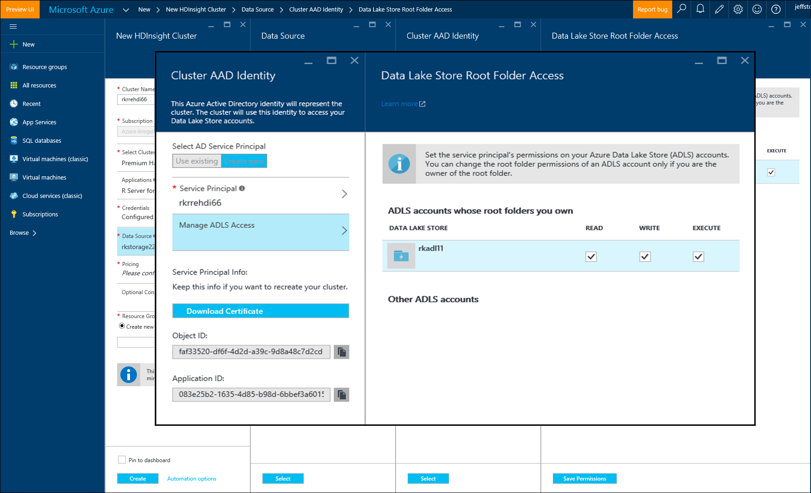

<properties
   pageTitle="Azure Speicheroptionen für R Server auf HDInsight (Preview) | Microsoft Azure"
   description="Erfahren Sie mehr über die verschiedenen Speicheroptionen für Benutzer mit R Server verfügbar auf HDInsight (Preview)"
   services="HDInsight"
   documentationCenter=""
   authors="jeffstokes72"
   manager="jhubbard"
   editor="cgronlun"
/>

<tags
   ms.service="HDInsight"
   ms.devlang="R"
   ms.topic="article"
   ms.tgt_pltfrm="na"
   ms.workload="data-services"
   ms.date="09/01/2016"
   ms.author="jeffstok"
/>

# <a name="azure-storage-options-for-r-server-on-hdinsight-preview"></a>Azure Speicheroptionen für R Server auf HDInsight (Preview)

Microsoft R Server auf HDInsight (Preview) hat Zugriff auf beide Azure Blob und [Azure Daten dem Speicher](https://azure.microsoft.com/services/data-lake-store/)als ein Verfahren zum Beibehalten von Daten, Code, Objekte aus Analysis Ergebnis und so weiter.

Wenn Sie einen Cluster Hadoop in HDInsight erstellen, geben Sie ein Azure-Speicher-Konto an. Ein bestimmter Blob-Speicher-Container aus diesem Konto enthält das Dateisystem für den Cluster, die, den Sie (z. B. Hadoop Distributed File System erstellen). Zur Optimierung der Systemleistung wird HDInsight Cluster in demselben Data Center als primärem Speicher-Konto erstellt, die Sie angeben. Weitere Informationen finden Sie unter [verwenden Azure Blob-Speicher mit HDInsight](hdinsight-hadoop-use-blob-storage.md "verwenden Azure Blob-Speicher mit HDInsight").   


## <a name="use-multiple-azure-blob-storage-accounts"></a>Verwenden von mehreren Azure Blob-Speicher-Konten

Bei Bedarf können Sie mehrere Konten Azure-Speicher oder Container mit Ihren Cluster HDI zugreifen. Dazu müssen Sie die zusätzlichen Speicher-Konten in der Benutzeroberfläche angeben, wenn Sie Cluster erstellen, und klicken Sie dann wie folgt vor, um die Verwendung in R.  

1.  Erstellen eines HDInsight Clusters mit einem Kontonamen Speicher **storage1** und eine standardmäßige Container **container1**bezeichnet.
2. Geben Sie zusätzlicher Speicherkonto namens **storage2 an**.  
3. Kopieren Sie die Datei mycsv.csv in das Task-Verzeichnis Datenanalysen und klicken Sie auf die Datei.  

    ````
    hadoop fs –mkdir /share
    hadoop fs –copyFromLocal myscsv.scv /share  
    ````

3.  R Code den Namensknoten auf **Standard,** und zum Festlegen Sie Ihrer Verzeichnis und die Datei zu verarbeiten.  

    ````
    myNameNode <- "default"
    myPort <- 0
    ````

  Speicherort der Daten:  

    BigDataDirRoot <-"/ share"  

  Definieren Sie Spark berechnen Kontext:

    MySparkCluster <-RxSpark(consoleOutput=TRUE)

  Berechnen der Sätze Kontext:

    rxSetComputeContext(mySparkCluster)

  Definieren Sie das Dateisystem Hadoop Distributed Datei System (HDFS):

    HdfsFS <-RxHdfsFileSystem (HostName = MyNameNode, Port = MyPort)

  Angeben der Eingabe-in HDFS analysieren:

    Eingabedatei <-file.path(bigDataDirRoot,"mycsv.csv")

Alle Verweise Verzeichnis und den Dateinamen zeigen Sie auf das Speicherkonto wasbs://container1@storage1.blob.core.windows.net. Dies ist das **Standardkonto-Speicher** , die die HDInsight Cluster zugeordnet ist.

Nehmen Sie eine Datei namens mySpecial.csv, die in der /private befindet verarbeiten möchten Verzeichnis von **container2** in **storage2**.

R Code zeigen Sie auf den Namen Knoten Bezug mit dem **storage2** Speicher-Konto.

    myNameNode <- "wasbs://container2@storage2.blob.core.windows.net"
    myPort <- 0

  Speicherort der Daten:

    bigDataDirRoot <- "/private"

  Definieren Sie Spark berechnen Kontext:

    mySparkCluster <- RxSpark(consoleOutput=TRUE, nameNode=myNameNode, port=myPort)

  Berechnen der Sätze Kontext:

    rxSetComputeContext(mySparkCluster)

  Definieren Sie HDFS Dateisystem:

    hdfsFS <- RxHdfsFileSystem(hostName=myNameNode, port=myPort)

  Angeben der Eingabe-in HDFS analysieren:

    inputFile <-file.path(bigDataDirRoot,"mySpecial.csv")

Alle Verweise Verzeichnis und den Dateinamen jetzt zeigen Sie auf das Speicherkonto wasbs://container2@storage2.blob.core.windows.net. Dies ist der **Knoten Name** , den Sie angegeben haben.

Beachten Sie, dass Sie konfigurieren/User/RevoShare/<SSH username> Verzeichnis auf **storage2** wie folgt:

    hadoop fs -mkdir wasbs://container2@storage2.blob.core.windows.net/user
    hadoop fs -mkdir wasbs://container2@storage2.blob.core.windows.net/user/RevoShare
    hadoop fs -mkdir wasbs://container2@storage2.blob.core.windows.net/user/RevoShare/<RDP username>

## <a name="use-an-azure-data-lake-store"></a>Verwenden einer Azure Daten Lake store

Um Daten Lake Stores mit Ihrem Konto HDInsight verwenden zu können, müssen Sie Ihren Cluster Zugriff auf jede Azure Daten Lake Store gewähren, die Sie verwenden möchten. Sie verwenden den Store in Ihrem Skript R viel, wie Sie eine sekundäre Speicherkonto verwenden, (wie zuvor beschrieben).

## <a name="add-cluster-access-to-your-azure-data-lake-stores"></a>Hinzufügen von Cluster Zugriff auf die Daten Lake Azure-Speicher

Sie zugreifen einer Store Lake Daten mithilfe einer Azure Active Directory (Azure AD) Dienst Tilgungsanteile, die Ihren Cluster HDInsight zugeordnet ist.

### <a name="to-add-a-service-principal"></a>Hinzufügen eines Diensts Tilgungsanteile
1. Wenn Sie Ihren Cluster HDInsight erstellen, wählen Sie auf der Registerkarte **Datenquelle** **Cluster AAD Identität** .
2. Wählen Sie im Dialogfeld **Cluster AAD Identität** unter **Wählen Sie AD Dienst Tilgungsanteile** **neu erstellen**.

Nachdem Sie den Dienst Tilgungsanteile Geben Sie einen Namen, und erstellen Sie ein Kennwort für, öffnet eine neue Registerkarte mit der Stelle, an der der Dienst Tilgungsanteile Ihrer Daten Lake Stores zugeordnet werden können.

Beachten Sie, dass Sie auch Access eine Store Daten Lake später hinzufügen können durch Öffnen den Daten Lake Store Azure-Portal und **Daten-Explorer** > **Access**.  Es folgt ein Beispiel für ein Dialogfeld, das zeigt, wie ein Dienst Tilgungsanteile erstellen und diese mit dem "rkadl11" Daten Lake Store zuordnen.




## <a name="use-the-data-lake-store-with-r-server"></a>Verwenden Sie den Daten Lake Store mit R Server
Nachdem Sie Zugriff auf eine Store Daten Lake erteilt haben, können Sie den Store in R Server auf HDInsight genauso wie ein Konto sekundäre Azure-Speicher. Der einzige Unterschied ist, die das Präfix **Wasb: / /** ändert sich in **Adl: / /** wie folgt:

````
# Point to the ADL store (e.g. ADLtest)
myNameNode <- "adl://rkadl1.azuredatalakestore.net"
myPort <- 0

# Location of the data (assumes a /share directory on the ADL account)
bigDataDirRoot <- "/share"  

# Define Spark compute context
mySparkCluster <- RxSpark(consoleOutput=TRUE, nameNode=myNameNode, port=myPort)

# Set compute context
rxSetComputeContext(mySparkCluster)

# Define HDFS file system
hdfsFS <- RxHdfsFileSystem(hostName=myNameNode, port=myPort)

# Specify the input file in HDFS to analyze
inputFile <-file.path(bigDataDirRoot,"AirlineDemoSmall.csv")

# Create factors for days of the week
colInfo <- list(DayOfWeek = list(type = "factor",
               levels = c("Monday", "Tuesday", "Wednesday", "Thursday",
                          "Friday", "Saturday", "Sunday")))

# Define the data source
airDS <- RxTextData(file = inputFile, missingValueString = "M",
                    colInfo  = colInfo, fileSystem = hdfsFS)

# Run a linear regression
model <- rxLinMod(ArrDelay~CRSDepTime+DayOfWeek, data = airDS)
````

Im folgenden sind die Befehle, mit denen Daten Lake Speicherkonto konfigurieren, mit dem Verzeichnis RevoShare, und fügen die CSV-Beispieldatei aus dem vorherigen Beispiel:

````
hadoop fs -mkdir adl://rkadl1.azuredatalakestore.net/user
hadoop fs -mkdir adl://rkadl1.azuredatalakestore.net/user/RevoShare
hadoop fs -mkdir adl://rkadl1.azuredatalakestore.net/user/RevoShare/<user>

hadoop fs -mkdir adl://rkadl1.azuredatalakestore.net/share

hadoop fs -copyFromLocal /usr/lib64/R Server-7.4.1/library/RevoScaleR/SampleData/AirlineDemoSmall.csv adl://rkadl1.azuredatalakestore.net/share

hadoop fs –ls adl://rkadl1.azuredatalakestore.net/share
````

## <a name="use-azure-files-on-the-edge-node"></a>Verwenden von Azure-Dateien auf den Rand Knoten

Es gibt auch eine Option für den Speicher geeignete Daten für die Verwendung auf den Rand Knoten namens [Azure Dateien](../storage/storage-how-to-use-files-linux.md "Azure-Dateien"). Sie können Sie eine Dateifreigabe Azure-Speicher im Dateisystem Linux bereitstellen. Dies kann nützlich sein, zum Speichern von Datendateien, R Skripts und Ergebnisobjekte, die möglicherweise später erforderlich sein, wenn es sinnvoll, das native Dateisystem auf die Kantenknoten anstelle von HDFS verwenden.

Ein großer Vorteil von Azure-Dateien ist, dass die Dateifreigaben bereitgestellt und von einem beliebigen System, z. B. Windows oder Linux Betriebssystem unterstützt verfügt, verwendet werden können. Es kann beispielsweise verwendet werden, durch eine andere HDInsight Cluster, die Sie oder eine andere Person in Ihrem Team hat, eine Azure-virtuellen Computer oder auch von einem lokalen System.


## <a name="next-steps"></a>Nächste Schritte

Jetzt, da Sie grundlegende Informationen wie mithilfe der Verwaltungskonsole R aus einer SSH-Sitzung und wie Sie einen neuen HDInsight Cluster zu erstellen, der R Server enthält, verwenden Sie die folgenden Links zu anderen Methoden für die Arbeit mit R Server auf HDInsight finden.

- [Übersicht über R Server auf HDInsight](hdinsight-hadoop-r-server-overview.md)
- [Erste Schritte mit R Server auf Hadoop](hdinsight-hadoop-r-server-get-started.md)
- [Hinzufügen von RStudio Server zu HDInsight premium](hdinsight-hadoop-r-server-install-r-studio.md)
- [Kontextoptionen für R Server HDInsight berechnen](hdinsight-hadoop-r-server-compute-contexts.md)
