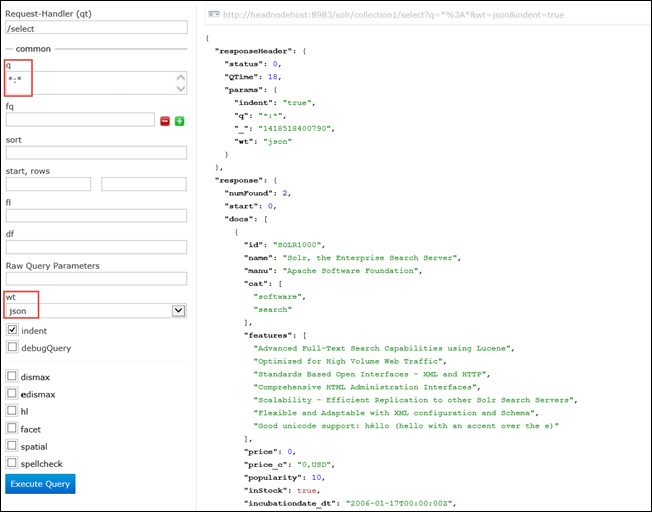

<properties
    pageTitle="Skript-Aktion verwenden, um Solr auf Linux-basierten HDInsight zu installieren | Microsoft Azure"
    description="Informationen Sie zum Installieren von Solr auf HDInsight Hadoop Linux-basierten Cluster mit Skript-Aktionen."
    services="hdinsight"
    documentationCenter=""
    authors="Blackmist"
    manager="jhubbard"
    editor="cgronlun"
    tags="azure-portal"/>

<tags
    ms.service="hdinsight"
    ms.workload="big-data"
    ms.tgt_pltfrm="na"
    ms.devlang="na"
    ms.topic="article"
    ms.date="10/03/2016"
    ms.author="larryfr"/>

# Installieren und Verwenden von Solr auf HDInsight Hadoop Cluster

In diesem Thema erfahren Sie, wie Solr auf Azure HDInsight mithilfe der Aktion Skript zu installieren. Solr ist eine leistungsstarke Suche Plattform und Enterprise Ebene Suchfunktionen auf Hadoop verwalteten Daten enthält. Nachdem Sie auf HDInsight Cluster Solr installiert haben, erfahren Sie auch so Daten mithilfe von Solr zu suchen.

> [AZURE.NOTE] Die Schritte in diesem Dokument erfordern einen HDInsight Linux-basierten Cluster. Informationen zum Verwenden von Solr mit einem Windows-basierten Cluster finden Sie unter [Installieren und Verwenden von Solr auf HDinsight Hadoop Cluster (Windows)](hdinsight-hadoop-solr-install.md)

In diesem Thema verwendete Skript erstellt einen Solr-Cluster mit einer bestimmten Konfiguration. Wenn Sie Solr Cluster mit anderen Websitesammlungen, mehrere Shards hinweg, Schemas, Replikate usw. konfigurieren möchten, müssen Sie das Skript und Solr Binärdateien entsprechend ändern.

## Was ist Solr?

[Apache Solr](http://lucene.apache.org/solr/features.html) ist eine Enterprise-Suche-Plattform, die leistungsfähige voll-Textsuche auf Daten ermöglicht. Während der Hadoop ermöglicht das Speichern und Verwalten von große Datenmengen, bietet Apache Solr die Suchfunktionen, um schnell die Daten abzurufen. Dieses Thema bietet Anweisungen zum Anpassen eines HDInsight Clusters um Solr zu installieren.

> [AZURE.WARNING] Komponenten, die mit dem HDInsight Cluster bereitgestellt werden vollständig unterstützt, und hilft Microsoft Support zum Isolieren und Beheben von Problemen im Zusammenhang mit dieser Komponenten.
>
> Benutzerdefinierte Komponenten, wie z. B. Solr, erhalten im Handel angemessenen Support, um Sie dabei unterstützen, das Problem zu beheben. Dadurch kann das Problem zu beheben, oder werden Sie aufgefordert, die verfügbaren Kanäle für das open-Source-Technologien populärer, wo eingehender Erfahrung für diese Technologie gefunden wird. Angenommen, es gibt viele Communitywebsites, die, wie verwendet werden können: [MSDN-Forum für HDInsight](https://social.msdn.microsoft.com/Forums/azure/en-US/home?forum=hdinsight), [http://stackoverflow.com](http://stackoverflow.com). Apache Projekte außerdem Projektwebsites auf [http://apache.org](http://apache.org), zum Beispiel: [Hadoop](http://hadoop.apache.org/).

## Was bedeutet, dass das Skript

Dieses Skript werden folgenden Änderungen an der HDInsight Cluster an.

* Solr in Installationen`/usr/hdp/current/solr`
* Erstellt einen neuen Benutzer, __Solrusr__, die zum Ausführen des Diensts Solr verwendet wird
* Legt __Solruser__ als Besitzer`/usr/hdp/current/solr`
* Fügt eine [Upstart](http://upstart.ubuntu.com/) -Konfiguration, die Solr gestartet werden kann, wenn ein Knoten neu gestartet wird. Solr wird ebenfalls automatisch auf die Cluster-Knoten nach der Installation gestartet.

## Installieren von Solr mit Skript-Aktionen

Ein Beispiel-Skript zum Installieren von Solr in einem HDInsight Cluster steht an folgendem Speicherort.

    https://hdiconfigactions.blob.core.windows.net/linuxsolrconfigactionv01/solr-installer-v01.sh

Dieser Abschnitt enthält Anweisungen zum Skript verwenden, wenn Sie einen neuen Cluster mithilfe des Azure-Portals zu erstellen. 

> [AZURE.NOTE] Azure PowerShell, die CLI Azure, HDInsight .NET SDK oder Azure Ressourcenmanager Vorlagen können auch verwendet werden, Skriptaktionen anwenden. Sie können auch Skriptaktionen anwenden, um Cluster bereits ausgeführt. Weitere Informationen finden Sie unter [Anpassen HDInsight Cluster mit Skript-Aktionen](hdinsight-hadoop-customize-cluster-linux.md).

1. Starten Sie einen Cluster anhand der Schritte in [HDInsight Bereitstellen von Linux-basierten Cluster](hdinsight-hadoop-create-linux-clusters-portal.md)bereitgestellt, aber nicht abschließen Sie provisioning.

2. Klicken Sie auf das Blade **Optionale Konfiguration** wählen Sie **Skript-Aktionen**aus, und geben Sie die folgenden Informationen:

    * __NAME__: Geben Sie einen Anzeigenamen für die Skriptaktion.
    * __Skript-URI__: https://hdiconfigactions.blob.core.windows.net/linuxsolrconfigactionv01/solr-installer-v01.sh
    * __Kopf__: Aktivieren Sie diese Option
    * __WORKER__: Aktivieren Sie diese Option
    * __ZOOKEEPER__: Aktivieren Sie diese Option, um die Installation auf dem Zookeeper Knoten
    * __Parameter__: lassen Sie dieses Feld leer

3. Am unteren Rand der **Skript-Aktionen**verwenden Sie die Schaltfläche **auswählen** zum Speichern der Konfiguration aus. Verwenden Sie schließlich die Schaltfläche **auswählen** am unteren Rand der Blade **Optionale Konfiguration** , um die optionale Konfigurationsinformationen zu speichern.

4. Fahren Sie Cluster bereitgestellt, wie in [HDInsight Bereitstellen von Linux-basierten Cluster](hdinsight-hadoop-create-linux-clusters-portal.md)beschrieben.

## Wie verwende ich Solr in HDInsight?

### Indizieren von Daten

Sie müssen mit Solr mit einigen Datendateien indizieren beginnen. Solr können dann Suchabfragen auf die indizierten Daten ausgeführt werden. Gehen Sie folgendermaßen vor, um einige Beispieldaten Solr hinzufügen, und Abfragen Sie es dann:

1. Verbinden Sie mit dem HDInsight Cluster SSH verwenden:

        ssh USERNAME@CLUSTERNAME-ssh.azurehdinsight.net

    Weitere Informationen zum Verwenden von SSH mit HDInsight finden Sie unter den folgenden:

    * [Verwenden von SSH mit Linux-basierten Hadoop auf HDInsight von Linux, Unix oder OS X](hdinsight-hadoop-linux-use-ssh-unix.md)

    * [Verwenden von SSH mit Linux-basierten Hadoop auf HDInsight von Windows](hdinsight-hadoop-linux-use-ssh-windows.md)

    > [AZURE.IMPORTANT] Schritte verwenden später in diesem Dokument erstellen von SSL-Tunnel Verbindung zum der Solr Web-Benutzeroberfläche. Akzeptieren, um diese Schritte ausführen zu können, müssen Sie einen SSL-Tunnel einrichten und konfigurieren Sie dann Ihren Browser, um es zu verwenden.
    >
    > Weitere Informationen finden Sie unter [Verwenden SSH Tunnel Zugriff auf Ambari Web UI, Ressourcen-Manager, JobHistory, NameNode, Oozie, und andere Elemente Benutzeroberfläches von web](hdinsight-linux-ambari-ssh-tunnel.md)

2. Verwenden Sie die folgenden Befehle Solr Index Beispieldaten haben:

        cd /usr/hdp/current/solr/example/exampledocs
        java -jar post.jar solr.xml monitor.xml

    Klicken Sie auf die Verwaltungskonsole wird die folgende Ausgabe angezeigt:

        POSTing file solr.xml
        POSTing file monitor.xml
        2 files indexed.
        COMMITting Solr index changes to http://localhost:8983/solr/update..
        Time spent: 0:00:01.624

    Das Programm post.jar indiziert Solr mit zwei Stichproben Dokumente, **solr.xml** und **monitor.xml**. Dies werden in __collection1__ in Solr gespeichert werden.

3. Anhand der folgenden Abfrage die REST-API, Solr bereitgestellt werden:

        curl "http://localhost:8983/solr/collection1/select?q=*%3A*&wt=json&indent=true"

    Diese Probleme eine Abfrage für __collection1__ für Dokumente, die mit __ \*:\* __ (als codierte \*% 3A\* in der Abfragezeichenfolge) und die Antwort als JSON zurückgegeben werden soll. Die Antwort sollte ähnlich wie die folgende angezeigt:

            "response": {
                "numFound": 2,
                "start": 0,
                "maxScore": 1,
                "docs": [
                  {
                    "id": "SOLR1000",
                    "name": "Solr, the Enterprise Search Server",
                    "manu": "Apache Software Foundation",
                    "cat": [
                      "software",
                      "search"
                    ],
                    "features": [
                      "Advanced Full-Text Search Capabilities using Lucene",
                      "Optimized for High Volume Web Traffic",
                      "Standards Based Open Interfaces - XML and HTTP",
                      "Comprehensive HTML Administration Interfaces",
                      "Scalability - Efficient Replication to other Solr Search Servers",
                      "Flexible and Adaptable with XML configuration and Schema",
                      "Good unicode support: héllo (hello with an accent over the e)"
                    ],
                    "price": 0,
                    "price_c": "0,USD",
                    "popularity": 10,
                    "inStock": true,
                    "incubationdate_dt": "2006-01-17T00:00:00Z",
                    "_version_": 1486960636996878300
                  },
                  {
                    "id": "3007WFP",
                    "name": "Dell Widescreen UltraSharp 3007WFP",
                    "manu": "Dell, Inc.",
                    "manu_id_s": "dell",
                    "cat": [
                      "electronics and computer1"
                    ],
                    "features": [
                      "30\" TFT active matrix LCD, 2560 x 1600, .25mm dot pitch, 700:1 contrast"
                    ],
                    "includes": "USB cable",
                    "weight": 401.6,
                    "price": 2199,
                    "price_c": "2199,USD",
                    "popularity": 6,
                    "inStock": true,
                    "store": "43.17614,-90.57341",
                    "_version_": 1486960637584081000
                  }
                ]
              }

### Verwenden das Solr-dashboard

Das Solr-Dashboard ist ein Web-Benutzeroberfläche, die Sie über den Webbrowser mit Solr arbeiten kann. Das Dashboard Solr wird nicht direkt im Internet aus Ihrem Cluster HDInsight verfügbar gemacht, aber muss mit einem SSH Tunnel zugegriffen werden. Weitere Informationen zur Verwendung eines SSH Tunnels finden Sie unter [Verwenden SSH Tunnel Zugriff auf Ambari Web UI, Ressourcen-Manager, JobHistory, NameNode, Oozie, und andere Elemente Benutzeroberfläches von web](hdinsight-linux-ambari-ssh-tunnel.md)

Nachdem Sie einen Tunnel SSH hergestellt haben, gehen Sie folgendermaßen vor das Dashboard Solr verwenden:

1. Bestimmen Sie den Hostnamen für die primäre Headnode an:

    1. Verwenden Sie die Verbindung mit dem Cluster auf Anschluss 22 SSH ein. Beispielsweise `ssh USERNAME@CLUSTERNAME-ssh.azurehdinsight.net` wobei __Benutzername__ Ihr Benutzername SSH und __CLUSTERNAME__ ist der Name Ihrer Cluster.

        Weitere Informationen zur Verwendung von SSH finden Sie unter den folgenden Dokumenten:

        * [Verwenden von SSH mit Linux-basierten HDInsight von einem Linux, Unix oder Mac OS X-client](hdinsight-hadoop-linux-use-ssh-unix.md)

        * [Verwenden von SSH mit Linux-basierten HDInsight aus einem Windows-client](hdinsight-hadoop-linux-use-ssh-windows.md)
    
    3. Verwenden Sie den folgenden Befehl zum Abrufen des vollständig qualifizierten Hostnamens:

            hostname -f

        Dadurch wird einen Namen ähnlich wie der folgende zurückgegeben:

            hn0-myhdi-nfebtpfdv1nubcidphpap2eq2b.ex.internal.cloudapp.net
    
        Dies ist der Hostname, die in den folgenden Schritten verwendet werden soll.
    
1. In Ihrem Browser Herstellen einer Verbindung mit __Http://HOSTNAME:8983/Solr / #/__, wobei __HOSTNAME__ der Name ist Sie in den vorherigen Schritten ermittelt. 

    Durch den Tunnel SSH zum am Knoten für Ihren Cluster HDInsight sollte die Anfrage weitergeleitet werden. Sie sollten eine Seite ähnlich wie der folgende finden Sie unter:

    

2. Aus dem linken Bereich mithilfe der **Ansichtsauswahl Core** Dropdown- **collection1**aus. Mehrere Einträge sollten sie unter __collection1__angezeigt.

3. Wählen Sie aus den Einträgen unter __collection1__ __Abfrage__ein. Verwenden Sie die folgenden Werte die Suchseite gefüllt wird:

    * Geben Sie in das Textfeld **f** ** \*:**\*. Dadurch wird die Dokumente aus, die indiziert sind in Solr zurückgegeben. Wenn Sie nach einer bestimmten Zeichenfolge innerhalb der Dokumente suchen möchten, können Sie diese Zeichenfolge hier eingeben.

    * Wählen Sie in das Textfeld **wt** das Ausgabeformat aus. Standardmäßig ist **Json**.

    Wählen Sie schließlich die Schaltfläche **Abfrage ausführen** am unteren Rand der Suche Pate aus.

    

    Die Ausgabe gibt die zwei Dokumente, die wir für die Indizierung Solr verwendet. Die Ausgabe sieht folgendermaßen aus:

            "response": {
                "numFound": 2,
                "start": 0,
                "maxScore": 1,
                "docs": [
                  {
                    "id": "SOLR1000",
                    "name": "Solr, the Enterprise Search Server",
                    "manu": "Apache Software Foundation",
                    "cat": [
                      "software",
                      "search"
                    ],
                    "features": [
                      "Advanced Full-Text Search Capabilities using Lucene",
                      "Optimized for High Volume Web Traffic",
                      "Standards Based Open Interfaces - XML and HTTP",
                      "Comprehensive HTML Administration Interfaces",
                      "Scalability - Efficient Replication to other Solr Search Servers",
                      "Flexible and Adaptable with XML configuration and Schema",
                      "Good unicode support: héllo (hello with an accent over the e)"
                    ],
                    "price": 0,
                    "price_c": "0,USD",
                    "popularity": 10,
                    "inStock": true,
                    "incubationdate_dt": "2006-01-17T00:00:00Z",
                    "_version_": 1486960636996878300
                  },
                  {
                    "id": "3007WFP",
                    "name": "Dell Widescreen UltraSharp 3007WFP",
                    "manu": "Dell, Inc.",
                    "manu_id_s": "dell",
                    "cat": [
                      "electronics and computer1"
                    ],
                    "features": [
                      "30\" TFT active matrix LCD, 2560 x 1600, .25mm dot pitch, 700:1 contrast"
                    ],
                    "includes": "USB cable",
                    "weight": 401.6,
                    "price": 2199,
                    "price_c": "2199,USD",
                    "popularity": 6,
                    "inStock": true,
                    "store": "43.17614,-90.57341",
                    "_version_": 1486960637584081000
                  }
                ]
              }

### Starten und Beenden von Solr

Wenn Sie manuell beenden oder starten Solar müssen, verwenden Sie die folgenden Befehle:

    sudo stop solr

    sudo start solr

## Zusätzliche indizierten Daten

Eine empfiehlt sich jedoch sollten Sie die indizierten Daten aus dem Solr Clusterknoten auf Azure Blob-Speicher sichern. Führen Sie hierzu die folgenden Schritte:

1. Herstellen einer Verbindung mithilfe von SSH Cluster mit, und klicken Sie dann verwenden Sie den folgenden Befehl zum Abrufen des Vornamens Host für den Knoten am:

        hostname -f
        
2. Verwenden Sie die folgenden, um eine Momentaufnahme der indizierten Daten erstellen. Ersetzen Sie __HOSTNAME__ mit dem Namen des vorherigen Befehls zurückgegeben:

        curl http://HOSTNAME:8983/solr/replication?command=backup

    Sie sollten eine Antwort wie folgt angezeigt werden:

        <?xml version="1.0" encoding="UTF-8"?>
        <response>
          <lst name="responseHeader">
            <int name="status">0</int>
            <int name="QTime">9</int>
          </lst>
          <str name="status">OK</str>
        </response>

2. Als Nächstes, wechseln Sie zum __/usr/hdp/current/solr/example/solr__. Hier ein Unterverzeichnis für jede Websitesammlung werden. Jedes Verzeichnis Websitesammlung enthält __ein Datenverzeichnis, also Wo finde ich der Snapshot für die Websitesammlung__ befindet.

    Beispielsweise, wenn Sie die Schritte zuvor verwendet, um die Dokumente Stichprobe indizieren, __/usr/hdp/current/solr/example/solr/collection1/data__ Verzeichnis sollte jetzt enthalten ein Verzeichnis mit dem Namen __Momentaufnahme. ###__ , in dem die #'s werden Datum und Uhrzeit der Momentaufnahme.

3. Erstellen eines komprimierten Archivs des Ordners Momentaufnahme mithilfe des Befehls ähnlich wie die folgende:

        tar -zcf snapshot.20150806185338855.tgz snapshot.20150806185338855

    Dies erstellt ein neues Archiv mit dem Namen __snapshot.20150806185338855.tgz__, die den Inhalt des Verzeichnisses __snapshot.20150806185338855__ enthält.

3. Sie können das Archiv in den Cluster des primären Speicher mit dem folgenden Befehl Speichern:

    Hadoop fs - CopyFromLocal snapshot.20150806185338855.tgz/Beispiel/Daten

    > [AZURE.NOTE] Sie möchten eine dedizierte Verzeichnis für Solr Momentaufnahmen zu erstellen. Beispielsweise `hadoop fs -mkdir /solrbackup`.

Weitere Informationen zum Arbeiten mit Solr Sicherung und Wiederherstellung finden Sie unter [Bereitstellen von und Sicherungen SolrCores wiederherstellen](https://cwiki.apache.org/confluence/display/solr/Making+and+Restoring+Backups+of+SolrCores).

## Siehe auch

- [Installieren und verwenden Sie Cluster Farbton auf HDInsight](hdinsight-hadoop-hue-linux.md). Farbton ist ein Web-Benutzeroberfläche, die erleichtert das Erstellen, ausführen und speichern Schwein und Struktur Aufträge sowie Durchsuchen der Standard-Speicherplatz für Ihr HDInsight cluster.

- [Installieren von R auf HDInsight Cluster][hdinsight-install-r]. Verwenden Sie Cluster Anpassung, um R auf HDInsight Hadoop Cluster zu installieren. R ist ein offener Quelle Sprache und Umgebung für statistische computing. Darüber hundert integrierten statistische Funktionen und einem eigenen Programmiersprache, die kombiniert Aspekte der funktionsübergreifendes und objektorientierten Programmierung. Darüber hinaus umfangreiche grafisch bereit.

- [Installieren von Giraph auf HDInsight Cluster](hdinsight-hadoop-giraph-install-linux.md). Verwenden Sie Cluster Anpassung, um Giraph auf HDInsight Hadoop Cluster zu installieren. Giraph können Sie mithilfe von Hadoop Verarbeitung Graph ausführen, und kann mit Azure HDInsight verwendet werden.

- [Installieren von Farbton auf HDInsight Cluster](hdinsight-hadoop-hue-linux.md). Verwenden Sie Cluster Anpassung, um Farbton auf HDInsight Hadoop Cluster zu installieren. Farbton ist eine Reihe von Webanwendungen Interaktion mit einem Hadoop Cluster verwendet.

[hdinsight-install-r]: hdinsight-hadoop-r-scripts-linux.md
[hdinsight-cluster-customize]: hdinsight-hadoop-customize-cluster-linux.md
