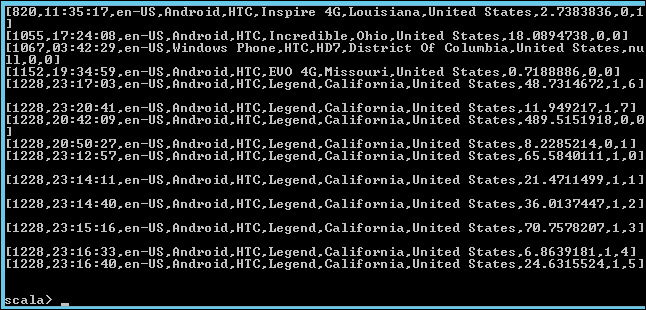

<properties
    pageTitle="Skript für Aktion Spark auf Hadoop Cluster installieren verwenden | Microsoft Azure"
    description="Erfahren Sie, wie einen HDInsight Cluster mit Spark mithilfe der Aktion Skript angepasst."
    services="hdinsight"
    documentationCenter=""
    authors="nitinme"
    manager="jhubbard"
    editor="cgronlun"/>

<tags
    ms.service="hdinsight"
    ms.workload="big-data"
    ms.tgt_pltfrm="na"
    ms.devlang="na"
    ms.topic="article"
    ms.date="02/05/2016"
    ms.author="nitinme"/>

# Installieren und Verwenden von Spark auf HDInsight Hadoop Cluster mithilfe der Aktion Skript

> [AZURE.IMPORTANT] In diesem Artikel wird jetzt nicht mehr unterstützt. HDInsight bietet nun Spark als erster Klasse Clustertyp für Windows-basiertem Cluster, was bedeutet, dass Sie jetzt direkt einen Spark Cluster erstellen können ohne einen Hadoop Cluster mithilfe der Aktion Skript ändern. Verwenden den Typ der Spark Cluster, erhalten Sie einen HDInsight Version 3,2 Cluster mit Spark Version 1.3.1 an.  Um unterschiedliche Versionen von Spark installiert haben, können Sie die Aktion Skript verwenden. HDInsight enthält ein Beispiel Skriptaktion-Skript.

Erfahren Sie Spark auf Windows installieren basierenden HDInsight mithilfe der Aktion Skript und Ausführen von Abfragen Spark auf HDInsight Cluster.

**Verwandte Artikel**

- [Hadoop erstellen Cluster in HDInsight](hdinsight-provision-clusters.md): Allgemeine Informationen zum Erstellen von HDInsight Cluster.

- [Erste Schritte mit Apache Spark auf HDInsight](hdinsight-apache-spark-jupyter-spark-sql.md): erstellen einen HDInsight Spark Cluster.

- [Anpassen von HDInsight Cluster mithilfe der Aktion Skript][hdinsight-cluster-customize]: Allgemeine Informationen zum Anpassen von HDInsight Cluster mithilfe der Aktion Skript.

- [Skript für Aktion entwickeln Skripts für HDInsight](hdinsight-hadoop-script-actions.md).

## Was ist Spark?

<a href="http://spark.apache.org/docs/latest/index.html" target="_blank">Apache Spark</a> ist ein offener Quelle Parallel Verarbeitung Framework, das in-Memory Verarbeitung, um die Leistung der analytischen Anwendung große Daten zu verbessern. Funktionen, die in-Memory Berechnung des Spark machen Sie es eine gute Wahl für iterative Algorithmen in Computer lernen und Graph Berechnungen.

Spark kann auch konventionelle Festplatten basierenden Datenverarbeitung ausführen verwendet werden. Spark verbessert traditionelle MapReduce Rahmen, indem Sie auf den Datenträger in das mittlere Phasen geschrieben zu vermeiden. Darüber hinaus ist Spark mit Hadoop Distributed Datei System (HDFS) und Azure Blob-Speicher kompatibel, damit die vorhandenen Daten ganz einfach über Spark verarbeitet werden können.

Dieses Thema bietet Anweisungen zum Anpassen eines HDInsight Clusters um Spark zu installieren.

## Verwenden des Portals Azure Spark installieren

Ein Beispiel-Skript Spark auf einem Cluster HDInsight installiert ist in einer schreibgeschützten Azure-Speicher Blob am [https://hdiconfigactions.blob.core.windows.net/sparkconfigactionv03/spark-installer-v03.ps1](https://hdiconfigactions.blob.core.windows.net/sparkconfigactionv03/spark-installer-v03.ps1)verfügbar. Mit diesem Skript kann Spark 1.2.0 oder Spark 1.0.2 je nach der Version von HDInsight Cluster erstellten installieren.

- Wenn Sie das Skript beim Erstellen eines **HDInsight 3,2** Clusters verwenden, wird es **Spark 1.2.0**installiert.
- Wenn Sie das Skript beim Erstellen eines **HDInsight 3.1** Clusters verwenden, wird es **Spark 1.0.2**installiert.

Können Sie das Skript anpassen oder erstellen ein eigenes Skript, um andere Versionen von Spark installieren.

> [AZURE.NOTE] Das Beispielskript funktioniert nur mit HDInsight 3.1 und 3,2 Cluster. Weitere Informationen zum HDInsight Cluster Versionen finden Sie unter [HDInsight Cluster Versionen](hdinsight-component-versioning.md).

1. Starten Sie, einen Cluster mithilfe der Option **Benutzerdefinierte erstellen** erstellen, wie bei [Erstellen Hadoop Cluster in HDInsight](hdinsight-provision-clusters.md#portal)beschrieben. Wählen Sie die Clusterversion je nach den folgenden aus:

    - Wenn Sie **Spark 1.2.0**installieren möchten, erstellen Sie einen HDInsight 3,2 Cluster.
    - Wenn Sie **Spark 1.0.2**installieren möchten, erstellen Sie einen HDInsight 3.1 Cluster.

2. Klicken Sie auf der Seite des Assistenten **Skript-Aktionen** auf **Skriptaktion hinzufügen** , um die Details zu der Skriptaktion angeben, wie unten dargestellt:

    ![Verwenden Sie Skript für Aktion in einem Cluster anpassen] (./media/hdinsight-hadoop-spark-install/HDI.CustomProvision.Page6.png "Verwenden Sie Skript für Aktion in einem Cluster anpassen")

    <table border='1'>
        <tr><th>Eigenschaft</th><th>Wert</th></tr>
        <tr><td>Namen</td>
            <td>Geben Sie einen Namen für die Skriptaktion ein. Beispielsweise <b>Spark installieren</b>.</td></tr>
        <tr><td>URI-Skript</td>
            <td>Geben Sie an der URI Uniform Resource Identifier () an das Skript, das zum Anpassen des Clusters aufgerufen wird. Beispielsweise <i>https://hdiconfigactions.blob.core.windows.net/sparkconfigactionv03/spark-installer-v03.ps1</i></td></tr>
        <tr><td>Knotentyp</td>
            <td>Geben Sie die Knoten, auf denen das Skript Anpassung ausgeführt wird. Sie können <b>alle Knoten</b>, <b>nur Kopf Knoten</b>oder <b>nur Worker-Knoten</b>auswählen.
        <tr><td>Parameter</td>
            <td>Geben Sie den Parameter aus, wenn das Skript erforderlich. Das Skript Spark installieren sind alle Parameter nicht erforderlich, damit Sie dieses Feld leer lassen können.</td></tr>
    </table>

    Sie können mehr als eine Skriptaktion zum Installieren von mehreren Komponenten auf dem Cluster hinzufügen. Nachdem Sie die Skripts hinzugefügt haben, klicken Sie auf das Häkchen zum Starten den Cluster erstellen.

Das Skript können Sie auch um mithilfe von Azure PowerShell oder HDInsight .NET SDK Spark auf HDInsight zu installieren. Anweisungen für diese Verfahren werden weiter unten in diesem Thema bereitgestellt.

## Verwenden von Spark in HDInsight
Spark stellt APIs in Scala, Python und Java. Die interaktive Spark-Verwaltungsshell können Sie auch Spark Abfragen ausführen. Dieser Abschnitt enthält Anweisungen zur Verwendung die unterschiedlichen Methoden für die Arbeit mit Spark an:

- [Verwenden Sie die Verwaltungsshell Spark interaktive Abfragen ausführen](#sparkshell)
- [Verwenden Sie die Verwaltungsshell Spark Spark SQL-Abfragen ausführen](#sparksql)
- [Verwenden Sie ein eigenständiges Scala Programm](#standalone)

###Verwenden Sie die Verwaltungsshell Spark interaktive Abfragen ausführen
Führen Sie die folgenden Schritte aus, um eine interaktive Spark Shell Spark Abfragen auszuführen. In diesem Abschnitt wir führen Sie eine Abfrage Spark anhand eines Beispiels Daten (/ example/data/gutenberg/davinci.txt), klicken Sie auf HDInsight Cluster standardmäßig zur Verfügung steht.

1. Aktivieren Sie den Remotedesktop aus dem Azure-Portal für den Cluster, die, den Sie mit Spark installiert und dann Remote zum Cluster erstellt haben. Anweisungen finden Sie unter [Verbinden auf HDInsight Cluster RDP verwenden](hdinsight-administer-use-management-portal.md#rdp).

2. Öffnen Sie die Befehlszeile Hadoop (über eine desktop-Verknüpfung) in der Sitzung (Remotedesktopprotokoll) vom Desktop und navigieren Sie zu dem Speicherort, wo Spark installiert ist; beispielsweise **C:\apps\dist\spark-1.2.0**.

3. Führen Sie den folgenden Befehl aus, um die Verwaltungsshell Spark zu starten:

         .\bin\spark-shell --master yarn

    Klicken Sie nach der Befehl, sollten Sie eine Scala auffordern erhalten:

         scala>

5. Scala dazu aufgefordert werden Geben Sie die nachfolgend aufgeführte Spark-Abfrage ein. Diese Abfrage zählt das Vorkommen jedes Worts in der davinci.txt-Datei, die am/Beispiel/Daten/Gutenberg/Speicherort auf dem Cluster zugeordnet Azure Blob-Speicher zur Verfügung.

        val file = sc.textFile("/example/data/gutenberg/davinci.txt")
        val counts = file.flatMap(line => line.split(" ")).map(word => (word, 1)).reduceByKey(_ + _)
        counts.toArray().foreach(println)

6. Die Ausgabe sollte wie folgt:

    

7. Geben Sie ein: Q, um die Aufforderung Scala zu beenden.

        :q

###Verwenden Sie die Verwaltungsshell Spark Spark SQL-Abfragen ausführen

Spark SQL können Sie mit Spark Structured Query Language (SQL), HiveQL oder Scala festgelegten relationale Abfragen ausführen. In diesem Abschnitt Prüfen Spark zum Ausführen einer Abfrage Struktur auf eine Struktur Beispieltabelle verwenden. Die strukturtabelle in diesem Abschnitt ( **Hivesampletable**genannt) verwendet ist standardmäßig verfügbar, wenn Sie einen Cluster erstellen.

>[AZURE.NOTE] Im folgenden Beispiel wurde gegen **1.2.0 aufzeigen**, erstellt, das installiert wird, wenn Sie die Skriptaktion beim Erstellen von HDInsight 3,2 Cluster ausführen.

1. Aktivieren Sie den Remotedesktop aus dem Azure-Portal für den Cluster, die, den Sie mit Spark installiert und dann Remote zum Cluster erstellt haben. Anweisungen finden Sie unter [Verbinden auf HDInsight Cluster RDP verwenden](hdinsight-administer-use-management-portal.md#rdp).

2. Öffnen Sie die Befehlszeile Hadoop (über eine desktop-Verknüpfung) in die RDP-Sitzung vom Desktop und navigieren Sie zu dem Speicherort, wo Spark installiert ist; beispielsweise **C:\apps\dist\spark-1.2.0**.

3. Führen Sie den folgenden Befehl aus, um die Verwaltungsshell Spark zu starten:

         .\bin\spark-shell --master yarn

    Klicken Sie nach der Befehl, sollten Sie eine Scala auffordern erhalten:

         scala>

4. Scala dazu aufgefordert werden legen Sie den Struktur Kontext aus. Dies ist erforderlich, Struktur Abfragen mithilfe von Spark konzipiert.

        val hiveContext = new org.apache.spark.sql.hive.HiveContext(sc)

    Beachten Sie, dass die **sc** Standard Spark Kontext ist, die beim Starten von der Verwaltungsshell Spark festgelegt werden.

5. Führen Sie eine Struktur Abfrage unter Verwendung des Kontexts Struktur und drucken Sie die Ausgabe an die Konsole. Die Abfrage ruft Daten auf Geräten mit einer bestimmten Tabellenerstellungsabfrage und schränkt die Anzahl der zu 20 abgerufenen Datensätze.

        hiveContext.sql("""SELECT * FROM hivesampletable WHERE devicemake LIKE "HTC%" LIMIT 20""").collect().foreach(println)

6. Sie sollte eine Ausgabe wie die folgende angezeigt:

    

7. Geben Sie ein: Q, um die Aufforderung Scala zu beenden.

        :q

### Verwenden Sie ein eigenständiges Scala Programm

In diesem Abschnitt schreiben wir eine Scala-Anwendung, die zählt die Anzahl der Zeilen, die mit den Buchstaben "a" und "b" in einer Stichprobe-Datendatei (/ example/data/gutenberg/davinci.txt), klicken Sie auf HDInsight Cluster standardmäßig zur Verfügung steht. Zum Schreiben und Scala eigenständiges Programm mit einem Cluster mit Spark Installation angepasst verwenden, müssen Sie die folgenden Schritte ausführen:

- Schreiben Sie ein Programm Scala
- Erstellen Sie das Programm Scala die Datei .jar abrufen
- Führen Sie den Auftrag für cluster

#### Schreiben Sie ein Programm Scala
In diesem Abschnitt schreiben Sie ein Scala-Programm, das zählt die Anzahl der Zeilen, die mit "a" und "b" in der Stichprobe Datendatei.

1. Öffnen Sie einen Text-Editor, und fügen Sie den folgenden Code ein:

        /* SimpleApp.scala */
        import org.apache.spark.SparkContext
        import org.apache.spark.SparkContext._
        import org.apache.spark.SparkConf

        object SimpleApp {
          def main(args: Array[String]) {
            val logFile = "/example/data/gutenberg/davinci.txt"         //Location of the sample data file on Azure Blob storage
            val conf = new SparkConf().setAppName("SimpleApplication")
            val sc = new SparkContext(conf)
            val logData = sc.textFile(logFile, 2).cache()
            val numAs = logData.filter(line => line.contains("a")).count()
            val numBs = logData.filter(line => line.contains("b")).count()
            println("Lines with a: %s, Lines with b: %s".format(numAs, numBs))
          }
        }

2. Speichern Sie die Datei unter dem Namen **SimpleApp.scala**ein.

#### Erstellen Sie das Programm Scala
In diesem Abschnitt verwenden Sie das <a href="http://www.scala-sbt.org/0.13/docs/index.html" target="_blank">Tool für einfache Erstellen</a> (oder (SBT)), um das Programm Scala erstellen. (SBT) erfordert Java 1.6 oder höher, daher sollten Sie sicherstellen, dass Sie die richtige Version von Java installiert werden, bevor Sie mit diesem Abschnitt fortfahren haben.

1. Installieren Sie von http://www.scala-sbt.org/0.13/tutorial/Installing-sbt-on-Windows.html (SBT) ein.
2. Erstellen Sie einen Ordner namens **SimpleScalaApp**, und erstellen Sie eine Datei namens **simple.sbt**in diesen Ordner. Dies ist eine Konfigurationsdatei, die Informationen zu den Scala Version, Bibliothek Abhängigkeiten usw. enthält. Fügen Sie die folgenden in der Datei simple.sbt, und speichern Sie ihn:

        name := "SimpleApp"

        version := "1.0"

        scalaVersion := "2.10.4"

        libraryDependencies += "org.apache.spark" %% "spark-core" % "1.2.0"

    >[AZURE.NOTE] Stellen Sie sicher, dass Sie die leeren Zeilen in der Datei beibehalten.

3. Erstellen Sie unter dem Ordner **SimpleScalaApp** ein Verzeichnis Struktur **\src\main\scala** , und fügen Sie das zuvor unter dem Ordner \src\main\scala erstellten Scala-Programm (**SimpleApp.scala**).
4. Öffnen Sie ein Eingabeaufforderungsfenster, navigieren Sie zum Verzeichnis SimpleScalaApp, und geben Sie den folgenden Befehl aus:

        sbt package

    Wenn die Anwendung kompiliert wurde, sehen Sie eine **simpleapp_2.10-1.0.jar** -Datei im Verzeichnis **\target\scala-2.10** innerhalb des Stammordners für SimpleScalaApp erstellt.

#### Führen Sie den Auftrag für cluster
In diesem Abschnitt Sie in den Cluster, der Spark remote installiert und kopieren Sie die SimpleScalaApp des Projekts Zielordner. Sie verwenden dann den Befehl **Spark übermitteln** und übermitteln Sie die Position auf dem Cluster.

1. Remote zum Cluster, die Spark installiert wurde. Vom Computer, wo Sie geschrieben haben und das Programm SimpleApp.scala erstellt, kopieren Sie den Ordner **SimpleScalaApp\target** , und fügen Sie ihn an einem Speicherort auf dem Cluster.
2. Klicken Sie in der Sitzung RDP vom Desktop öffnen Sie die Befehlszeile Hadoop, und navigieren Sie zu dem Speicherort, wo Sie **den Zielordner** einzufügen.
3. Geben Sie den folgenden Befehl aus, um das Programm SimpleApp.scala auszuführen:

        C:\apps\dist\spark-1.2.0\bin\spark-submit --class "SimpleApp" --master local target/scala-2.10/simpleapp_2.10-1.0.jar

4. Wenn das Programm abgeschlossen ist, wird die Ausgabe in der Konsole angezeigt.

        Lines with a: 21374, Lines with b: 11430

## Installieren Sie mithilfe der PowerShell Azure Spark

In diesem Abschnitt verwenden wir das Cmdlet **<a href = "http://msdn.microsoft.com/library/dn858088.aspx" target="_blank">AzureHDInsightScriptAction hinzufügen</a>** , um Skripts aufrufen, indem Sie die Aktion Skript zum Anpassen eines Clusters verwenden. Stellen Sie bevor Sie fortfahren sicher, dass Sie installiert und Azure PowerShell konfiguriert haben. Informationen zum Konfigurieren einer Arbeitsstationen zum Ausführen von Azure PowerShell-Cmdlets für HDInsight finden Sie unter [Installieren und Konfigurieren von Azure PowerShell](../powershell-install-configure.md).

Führen Sie die folgenden Schritte aus:

1. Ein Azure PowerShell-Fenster zu öffnen und die folgenden Variablen deklarieren:

        # Provide values for these variables
        $subscriptionName = "<SubscriptionName>"        # Name of the Azure subscription
        $clusterName = "<HDInsightClusterName>"         # HDInsight cluster name
        $storageAccountName = "<StorageAccountName>"    # Azure Storage account that hosts the default container
        $storageAccountKey = "<StorageAccountKey>"      # Key for the Storage account
        $containerName = $clusterName
        $location = "<MicrosoftDataCenter>"             # Location of the HDInsight cluster. It must be in the same data center as the Storage account.
        $clusterNodes = <ClusterSizeInNumbers>          # Number of nodes in the HDInsight cluster
        $version = "<HDInsightClusterVersion>"          # For example, "3.2"

2. Geben Sie die Konfigurationswerte wie Knoten in der Cluster und den Standardspeicher verwendet werden.

        # Specify the configuration options
        Select-AzureSubscription $subscriptionName
        $config = New-AzureHDInsightClusterConfig -ClusterSizeInNodes $clusterNodes
        $config.DefaultStorageAccount.StorageAccountName="$storageAccountName.blob.core.windows.net"
        $config.DefaultStorageAccount.StorageAccountKey=$storageAccountKey
        $config.DefaultStorageAccount.StorageContainerName=$containerName

3. Verwenden Sie das Cmdlet **AzureHDInsightScriptAction hinzufügen** , um eine Skriptaktion Cluster-Konfiguration hinzuzufügen. Später erhält Cluster erstellt wird, die Skriptaktion ausgeführt.

        # Add a script action to the cluster configuration
        $config = Add-AzureHDInsightScriptAction -Config $config -Name "Install Spark" -ClusterRoleCollection HeadNode -Uri https://hdiconfigactions.blob.core.windows.net/sparkconfigactionv03/spark-installer-v03.ps1

    **Hinzufügen AzureHDInsightScriptAction** Cmdlet weist die folgenden Parameter:

    <table style="border-color: #c6c6c6; border-width: 2px; border-style: solid; border-collapse: collapse;">
    <tr>
    <th style="border-color: #c6c6c6; border-width: 2px; border-style: solid; border-collapse: collapse; width:90px; padding-left:5px; padding-right:5px;">Parameter</th>
    <th style="border-color: #c6c6c6; border-width: 2px; border-style: solid; border-collapse: collapse; width:550px; padding-left:5px; padding-right:5px;">Definition</th></tr>
    <tr>
    <td style="border-color: #c6c6c6; border-width: 2px; border-style: solid; border-collapse: collapse; padding-left:5px;">Config</td>
    <td style="border-color: #c6c6c6; border-width: 2px; border-style: solid; border-collapse: collapse; padding-left:5px; padding-right:5px;">Die Konfigurationsobjekt, das Script Aktionsinformationen hinzugefügt wird.</td></tr>
    <tr>
    <td style="border-color: #c6c6c6; border-width: 2px; border-style: solid; border-collapse: collapse; padding-left:5px;">Namen</td>
    <td style="border-color: #c6c6c6; border-width: 2px; border-style: solid; border-collapse: collapse; padding-left:5px;">Name der Skriptaktion.</td></tr>
    <tr>
    <td style="border-color: #c6c6c6; border-width: 2px; border-style: solid; border-collapse: collapse; padding-left:5px;">ClusterRoleCollection</td>
    <td style="border-color: #c6c6c6; border-width: 2px; border-style: solid; border-collapse: collapse; padding-left:5px;">Gibt die Knoten, auf denen das Skript Anpassung ausgeführt wird. Die gültigen Werte sind HeadNode (nach der Installation auf dem am Knoten) oder DataNode (zu installieren, klicken Sie auf alle Datenknoten). Sie können eine oder beide Werte ein.</td></tr>
    <tr>
    <td style="border-color: #c6c6c6; border-width: 2px; border-style: solid; border-collapse: collapse; padding-left:5px;">URI</td>
    <td style="border-color: #c6c6c6; border-width: 2px; border-style: solid; border-collapse: collapse; padding-left:5px;">Gibt den URI an das Skript, das ausgeführt wird.</td></tr>
    <tr>
    <td style="border-color: #c6c6c6; border-width: 2px; border-style: solid; border-collapse: collapse; padding-left:5px;">Parameter</td>
    <td style="border-color: #c6c6c6; border-width: 2px; border-style: solid; border-collapse: collapse; padding-left:5px;">Parameter, indem Sie das Skript erforderlich. In diesem Thema verwendete Skript sind keine Parameter erforderlich, und führen Sie daher für diesen Parameter in Codeausschnitt oben nicht angezeigt.
    </td></tr>
    </table>

4. Schließlich starten Sie, erstellen einen angepassten Cluster mit Spark installiert.  

        # Start creating a cluster with Spark installed
        New-AzureHDInsightCluster -Config $config -Name $clusterName -Location $location -Version $version

Wenn Sie dazu aufgefordert werden, geben Sie die Anmeldeinformationen für den Cluster aus. Es kann mehrere Minuten dauern, bevor der Cluster erstellt wird.

## Installieren Sie mithilfe der PowerShell Spark

Finden Sie unter [Anpassen HDInsight Cluster mithilfe der Aktion Skript](hdinsight-hadoop-customize-cluster.md#call_scripts_using_powershell).

## Verwenden von .NET SDK Spark installieren

Finden Sie unter [Anpassen HDInsight Cluster mithilfe der Aktion Skript](hdinsight-hadoop-customize-cluster.md#call_scripts_using_azure_powershell).

## Siehe auch

- [Hadoop erstellen Cluster in HDInsight](hdinsight-provision-clusters.md): HDInsight Cluster erstellen.
- [Erste Schritte mit Apache Spark auf HDInsight](hdinsight-apache-spark-jupyter-spark-sql.md): Erste Schritte mit Spark auf HDInsight.
- [Anpassen von HDInsight Cluster mithilfe der Aktion Skript][hdinsight-cluster-customize]: HDInsight Cluster mithilfe der Aktion Skript anpassen.
- [Skript für Aktion entwickeln Skripts für HDInsight](hdinsight-hadoop-script-actions.md): Aktion Skript Skripts entwickeln.
- [Installieren von R auf HDInsight Cluster] [ hdinsight-install-r] bietet Anweisungen zum Cluster Anpassung zu installieren und Verwenden von R auf HDInsight Hadoop Cluster verwenden. R ist ein offener Quelle Sprache und Umgebung für statistische computing. Darüber hundert integrierten statistische Funktionen und einem eigenen Programmiersprache, die kombiniert Aspekte der funktionsübergreifendes und objektorientierten Programmierung. Darüber hinaus umfangreiche grafisch bereit.
- [Installieren von Giraph auf HDInsight Cluster](hdinsight-hadoop-giraph-install.md). Verwenden Sie Cluster Anpassung, um Giraph auf HDInsight Hadoop Cluster zu installieren. Giraph können Sie mithilfe von Hadoop Verarbeitung Graph ausführen, und kann mit Azure HDInsight verwendet werden.
- [Installieren von Solr auf HDInsight Cluster](hdinsight-hadoop-solr-install.md). Verwenden Sie Cluster Anpassung, um Solr auf HDInsight Hadoop Cluster zu installieren. Solr können Sie leistungsfähige Suchvorgänge auf gespeicherten Daten durchführen.

[hdinsight-provision]: hdinsight-provision-clusters.md
[hdinsight-install-r]: hdinsight-hadoop-r-scripts.md
[hdinsight-cluster-customize]: hdinsight-hadoop-customize-cluster.md
[powershell-install-configure]: powershell-install-configure.md
