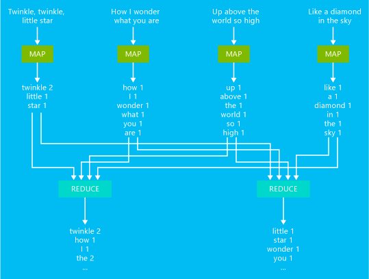

<properties
   pageTitle="Entwickeln Sie Python MapReduce Aufträge mit HDInsight | Microsoft Azure"
   description="Informationen Sie zum Erstellen und Ausführen von Python MapReduce Aufträge auf Linux-basierten HDInsight Cluster."
   services="hdinsight"
   documentationCenter=""
   authors="Blackmist"
   manager="jhubbard"
   editor="cgronlun"
    tags="azure-portal"/>

<tags
   ms.service="hdinsight"
   ms.devlang="na"
   ms.topic="article"
   ms.tgt_pltfrm="na"
   ms.workload="big-data"
   ms.date="10/11/2016"
   ms.author="larryfr"/>

#Entwickeln Sie Python streaming Programme für HDInsight

Hadoop stellt eine streaming-API für MapReduce, die Sie schreiben Karte und reduzieren Funktionen in anderen Sprachen als Java ermöglicht. In diesem Artikel erfahren Sie, wie Python MapReduce Vorgänge ausführen.

> [AZURE.NOTE] Während der Python-Code in diesem Dokument mit einem Windows-basierten HDInsight Cluster verwendet werden kann, werden die Schritte in diesem Dokument speziell für Linux-basierten Cluster.

In diesem Artikel basiert auf Informationen und Beispielen von Michael Noll bei [einem Hadoop MapReduce-Programm in Python schreiben](http://www.michael-noll.com/tutorials/writing-an-hadoop-mapreduce-program-in-python/)veröffentlicht.

##Erforderliche Komponenten

Um die Schritte in diesem Artikel ausführen zu können, benötigen Sie Folgendes:

* Eine Linux-basierten Hadoop auf HDInsight cluster

* Einen Text-editor

    > [AZURE.IMPORTANT] Text-Editor muss LF als das Ende der Zeile verwenden. Wenn es CRLF verwendet, wird dies HDInsight Linux-basierte Cluster den Auftrag MapReduce unter zu Fehlern führen. Wenn Sie nicht sicher sind, verwenden Sie den optionalen Schritt im Abschnitt [MapReduce ausführen](#run-mapreduce) alle CRLF in LF konvertiert.

* Für Windows-Clients kitten und PSCP. Diese Dienstprogramme sind auf der <a href="http://www.chiark.greenend.org.uk/~sgtatham/putty/download.html" target="_blank">Downloadseite kitten</a>verfügbar.

##Zählen von Wörtern

In diesem Beispiel werden Sie grundlegende Wortanzahl mithilfe eines Mapper und Reduzierstücks implementieren. Der Zuordnung trennt Sätze in einzelne Wörter, und die Übergangsstück aggregiert Wörter und zählt, um die Ausgabe zu erzeugen.

Das folgende Flussdiagramm veranschaulicht, was geschieht, während die Karte und Phasen zu verringern.

##Warum Python?

Python ist eine allgemeine, auf hoher Ebene Programmiersprache, die Sie auf express Konzepte in weniger Codezeilen als vielen anderen Sprachen ermöglicht. Es wurde zuletzt immer beliebter mit Daten Wissenschaftlern als Sprache für die Prototypen, da deren interpretiert Natur, dynamische eingeben und eleganten Syntax für die schnelle Entwicklung geeignete vornehmen.

Python wird auf alle HDInsight Cluster installiert.

##Streaming MapReduce

Hadoop ermöglicht Ihnen, geben Sie eine Datei mit der Zuordnung und verringern Logik, die durch einen Auftrag verwendet wird. Die spezifischen Anforderungen für die Karte und Logik verringern sind:

* **Eingabe**: die Karte und verringern Komponenten müssen Eingabedaten von STDIN lesen.

* **Ergebnis**: die Karte und verringern Komponenten müssen in STDOUT Ausgabedaten schreiben.

* **Formatieren von Daten**: Daten verbraucht und gefertigt muss ein Schlüssel/Wert-Paar, durch ein Tabstoppzeichen getrennt.

Python, können diese Anforderungen einfach mithilfe von **Sys** -Modul zum Lesen von STDIN und Verwendung **Drucken** , Drucken auf STDOUT behandeln. Die verbleibende Aufgabe ist einfach die Daten mit einer Registerkarte Formatierung (`\t`) zwischen dem Schlüssel und Wert Zeichen.

##Erstellen Sie die Mapper und Reduzierstücks

Die Mapper und Reduzierstücks sind Textdateien, in diesem Fall **mapper.py** und **reducer.py** (mit dem sie die Funktionsweise deaktivieren). Sie können diese mit dem Editor Ihrer Wahl erstellen.

###Mapper.py

Erstellen einer neuen Datei mit dem Namen **mapper.py** , und verwenden Sie den folgenden Code als Inhalt:

    #!/usr/bin/env python

    # Use the sys module
    import sys

    # 'file' in this case is STDIN
    def read_input(file):
        # Split each line into words
        for line in file:
            yield line.split()

    def main(separator='\t'):
        # Read the data using read_input
        data = read_input(sys.stdin)
        # Process each words returned from read_input
        for words in data:
            # Process each word
            for word in words:
                # Write to STDOUT
                print '%s%s%d' % (word, separator, 1)

    if __name__ == "__main__":
        main()

Betrachten Sie wir den Code zu lesen, damit Sie verstehen können, was bedeutet.

###REDUCER.py

Erstellen Sie eine neue Datei namens **reducer.py** und verwenden Sie den folgenden Code als Inhalt:

    #!/usr/bin/env python

    # import modules
    from itertools import groupby
    from operator import itemgetter
    import sys

    # 'file' in this case is STDIN
    def read_mapper_output(file, separator='\t'):
        # Go through each line
        for line in file:
            # Strip out the separator character
            yield line.rstrip().split(separator, 1)

    def main(separator='\t'):
        # Read the data using read_mapper_output
        data = read_mapper_output(sys.stdin, separator=separator)
        # Group words and counts into 'group'
        #   Since MapReduce is a distributed process, each word
        #   may have multiple counts. 'group' will have all counts
        #   which can be retrieved using the word as the key.
        for current_word, group in groupby(data, itemgetter(0)):
            try:
                # For each word, pull the count(s) for the word
                #   from 'group' and create a total count
                total_count = sum(int(count) for current_word, count in group)
                # Write to stdout
                print "%s%s%d" % (current_word, separator, total_count)
            except ValueError:
                # Count was not a number, so do nothing
                pass

    if __name__ == "__main__":
        main()

##Hochladen von Dateien

Sowohl **mapper.py** und **reducer.py** müssen auf dem am Knoten im Cluster sein, bevor wir ausgeführt werden kann. Die einfachste Möglichkeit, um sie hochzuladen besteht darin, **scp** (**Pscp** bei Verwendung von einem Windows-Client) verwenden.

Verwenden Sie im Desktopclient in demselben Verzeichnis wie **mapper.py** und **reducer.py**, mit dem folgenden Befehl ein. Ersetzen Sie **Username** mit einer SSH Benutzer- und **Clustername** mit dem Namen der Cluster aus.

    scp mapper.py reducer.py username@clustername-ssh.azurehdinsight.net:

Dadurch wird die Dateien aus dem lokalen System zum am Knoten kopiert.

> [AZURE.NOTE] Wenn Sie ein Kennwort verwendet, um Ihr Konto SSH zu sichern, werden Sie aufgefordert, das Kennwort anzugeben. Wenn Sie einen Schlüssel SSH verwendet haben, müssen Sie möglicherweise verwenden Sie die `-i` Parameter und den Pfad für den privaten Schlüssel, z. B. `scp -i /path/to/private/key mapper.py reducer.py username@clustername-ssh.azurehdinsight.net:`.

##MapReduce ausführen

1. Mithilfe von SSH zum Cluster verbinden:

        ssh username@clustername-ssh.azurehdinsight.net

    > [AZURE.NOTE] Wenn Sie ein Kennwort verwendet, um Ihr Konto SSH zu sichern, werden Sie aufgefordert, das Kennwort anzugeben. Wenn Sie einen Schlüssel SSH verwendet, Sie müssen möglicherweise verwendet die `-i` Parameter und den Pfad zum privaten Schlüssel, z. B. `ssh -i /path/to/private/key username@clustername-ssh.azurehdinsight.net`.

2. (Optional) Wenn Sie einen Text-Editor, der CRLF als Zeilen, die beim Erstellen von den Dateien mapper.py und reducer.py enden verwendet verwendet oder nicht wissen, was Zeilenende Editor verwendet, verwenden Sie die folgenden Befehle Vorkommen des CRLF in mapper.py und reducer.py in LF konvertiert.

        perl -pi -e 's/\r\n/\n/g' mappery.py
        perl -pi -e 's/\r\n/\n/g' reducer.py

2. Verwenden Sie den folgenden Befehl aus, um den Auftrag MapReduce zu starten.

        yarn jar /usr/hdp/current/hadoop-mapreduce-client/hadoop-streaming.jar -files mapper.py,reducer.py -mapper mapper.py -reducer reducer.py -input wasbs:///example/data/gutenberg/davinci.txt -output wasbs:///example/wordcountout

    Dieser Befehl besteht aus die folgenden Teilen:

    * **Hadoop-streaming.jar**: beim Ausführen von streaming MapReduce Vorgängen verwendet. Es Schnittstellen Hadoop mit externen MapReduce Codes, die Sie bereitstellen.

    * **-Dateien**: teilt Hadoop, die die angegebenen Dateien für dieses Projekt MapReduce benötigt werden, und sie allen Worker Knoten kopiert werden sollen.

    * **-Mapper**: Hadoop-welche Datei als der Zuordnung verwendet wird.

    * **-Reduzierstücks**: teilt Hadoop welche Datei als des Reduzierstücks verwendet.

    * **-Eingabewerte**: von Wörtern aus eingegebenen Datei, die gezählt werden sollen.

    * **-Ausgabe**: das Verzeichnis, das die Ausgabe geschrieben werden sollen.

        > [AZURE.NOTE] Dieses Verzeichnis wird durch den Auftrag erstellt werden.

Sie sollten finden Sie eine Reihe von **Informationen** Anweisungen als der Auftrag gestartet und schließlich finden Sie den **Karte** und **verringern** Vorgang als Prozentsätze angezeigt.

    15/02/05 19:01:04 INFO mapreduce.Job:  map 0% reduce 0%
    15/02/05 19:01:16 INFO mapreduce.Job:  map 100% reduce 0%
    15/02/05 19:01:27 INFO mapreduce.Job:  map 100% reduce 100%

Sie erhalten Statusinformationen über den Auftrag, wenn er abgeschlossen ist.

##Zeigen Sie die Ausgabe

Wenn das Projekt abgeschlossen ist, verwenden Sie den folgenden Befehl zum Anzeigen der Ausgabe an:

    hdfs dfs -text /example/wordcountout/part-00000

Dies sollte Anzeigen einer Liste von Wörtern und wie oft das Wort aufgetreten ist. Im folgenden finden ein Beispiel für die Ausgabedaten:

    wrenching       1
    wretched        6
    wriggling       1
    wrinkled,       1
    wrinkles        2
    wrinkling       2

##Nächste Schritte

Jetzt, da Sie zur Verwendung von streaming MapRedcue Aufträge mit HDInsight vertraut gemacht haben, verwenden Sie die folgenden Links, um andere Methoden für die Arbeit mit Azure HDInsight untersuchen.

* [Verwenden Sie die Struktur mit HDInsight](hdinsight-use-hive.md)
* [Schwein mit HDInsight verwenden](hdinsight-use-pig.md)
* [Verwenden von MapReduce Aufträge mit HDInsight](hdinsight-use-mapreduce.md)
