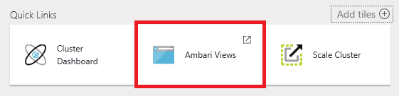
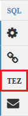

<properties
   pageTitle="Verwenden Sie für die Arbeit mit Struktur auf HDInsight (Hadoop) Ambari Ansichten | Microsoft Azure"
   description="Erfahren Sie, wie die Struktur Ansicht über den Webbrowser zu verwenden, und übermitteln Sie Struktur Abfragen. Die Struktur Ansicht ist Teil der Ambari Web-Benutzeroberfläche mit Ihrer Linux-basierten HDInsight Cluster bereitgestellt."
   services="hdinsight"
   documentationCenter=""
   authors="Blackmist"
   manager="jhubbard"
   editor="cgronlun"
    tags="azure-portal"/>

<tags
   ms.service="hdinsight"
   ms.devlang="na"
   ms.topic="article"
   ms.tgt_pltfrm="na"
   ms.workload="big-data"
   ms.date="10/28/2016"
   ms.author="larryfr"/>

#Verwenden Sie die Struktur Ansicht mit Hadoop in HDInsight

[AZURE.INCLUDE [hive-selector](../../includes/hdinsight-selector-use-hive.md)]

Ambari ist eine Verwaltung und Überwachung Programm, die mit HDInsight Linux-basierten Cluster bereitgestellt. Eines der Features, die gebotenen Ambari ist eine Web-Benutzeroberfläche, die mit der Struktur Abfragen ausgeführt werden können. Dies ist die __Struktur anzeigen__, Teil der Ambari Ansichten mit Ihren Cluster HDInsight bereitgestellt.

> [AZURE.NOTE] Ambari weist viele Funktionen, die in diesem Dokument erläutert werden, wird nicht. Weitere Informationen finden Sie unter [Verwalten von HDInsight Cluster mithilfe der Web-Benutzeroberfläche Ambari](hdinsight-hadoop-manage-ambari.md).

##Erforderliche Komponenten

- Ein Cluster Linux-basierten HDInsight. Informationen zum Erstellen eines neuen Clusters finden Sie unter [Erste Schritte mit Linux-basierten HDInsight](hdinsight-hadoop-linux-tutorial-get-started.md).

##Öffnen Sie die Struktur-Ansicht

Sie können für Ambari Ansichten vom Azure-Portal. Wählen Sie Ihren Cluster HDInsight aus, und wählen Sie aus dem Abschnitt __Quicklinks__ __Ambari Ansichten__ .

Sie können auch direkt zu Ambari navigieren, indem Sie zu https://CLUSTERNAME.azurehdinsight.net in einem Webbrowser (wobei __CLUSTERNAME__ für den Namen Ihrer HDInsight Cluster ist), und wählen Sie dann in der Liste Verfügbare Ansichten aus dem Seitenmenü "(neben den Link __Admin__ und die Schaltfläche auf der linken Seite auf der Seite) Festlegen der Quadrate. Wählen Sie die __Struktur der anzeigen__aus.

.

> [AZURE.NOTE] Wenn Sie Ambari zugreifen zu können, werden Sie aufgefordert, zu der Website authentifizieren. Geben Sie den Administrator (Standard `admin`,) Kontoname und Kennwort, die Sie beim Erstellen des Clusters verwendet.

Sie sollten eine Seite ähnlich wie der folgende finden Sie unter:

##Anzeigen von Tabellen

Wählen Sie auf der Seite im Abschnitt __Datenbank-Explorer__ __Standardeingabe auf der Registerkarte __Datenbanken__ __ . Dadurch wird eine Liste der Tabellen in der Standarddatenbank angezeigt. Für einen neuen HDInsight Cluster sollte nur eine Tabelle vorhanden sein; __Hivesampletable__.

Beim Hinzufügen von neue Tabellen durch die Schritte in diesem Dokument können Sie das Symbol "Aktualisieren" in der oberen rechten Ecke der Datenbank-Explorer verwenden, um die Liste der verfügbaren Tabellen aktualisieren.

##Abfrage-editor

Gehen Sie folgendermaßen vor aus der Ansicht der Struktur eine Abfrage Struktur für Cluster enthaltenen Daten ausführen.

1. Im __Abfrage-Editor__ -Abschnitt der Seite fügen Sie das Arbeitsblatt mit der folgenden Aussagen HiveQL:

        DROP TABLE log4jLogs;
        CREATE EXTERNAL TABLE log4jLogs(t1 string, t2 string, t3 string, t4 string, t5 string, t6 string, t7 string)
        ROW FORMAT DELIMITED FIELDS TERMINATED BY ' '
        STORED AS TEXTFILE LOCATION 'wasbs:///example/data/';
        SELECT t4 AS sev, COUNT(*) AS cnt FROM log4jLogs WHERE t4 = '[ERROR]' GROUP BY t4;

    Diese Anweisungen führen Sie die folgenden Aktionen aus:

    - **DROP TABLE** - löscht die Tabelle und der Datendatei für den Fall, dass die Tabelle bereits vorhanden ist.
    - **Externe Tabelle erstellen** - erstellt eine neue "externe" Tabelle in die Struktur. Externe Tabellen speichern nur die Definition der Tabelle, in Struktur. die Daten an der ursprünglichen Stelle bleibt.
    - **ZEILENFORMAT** : erfahren Struktur wie die Daten formatiert ist. In diesem Fall sind die Felder in jedem Protokoll durch ein Leerzeichen getrennt.
    - **AS Textdatei-Speicherort gespeichert** – erfahren Struktur Wo finde ich die Daten gespeichert (das Verzeichnis/Beispieldaten), und die It wird als Text gespeichert.
    - **Wählen Sie aus** – wählt Anzahl aller Zeilen, in denen Spalte t4 den Wert [Fehler] enthält.

    >[AZURE.NOTE] Externe Tabellen sollten verwendet werden, wenn Sie erwarten, dass die zugrunde liegenden Daten von einer externen Quelle, wie eine automatisierte Daten Uploadprozess oder durch ein anderes MapReduce Operation aktualisiert werden, aber immer Struktur Abfragen die neuesten Daten verwendet werden soll. Enthält eine externe Tabelle ablegen *nicht* Löschen der Daten, nur die Definition der Tabelle.

2. Verwenden Sie die Schaltfläche __Ausführen__ im unteren Bereich des Abfrage-Editors, um die Abfrage zu starten. Es sollte Orange aktivieren, und der Text zum __Beenden der Ausführung__ändern. Ein Abschnitt __Prozess Abfrageergebnisse__ sollte unterhalb des Abfrage-Editors angezeigt und Anzeigen von Informationen zu den Auftrag.

    > [AZURE.IMPORTANT] Einigen Browsern möglicherweise nicht korrekt Informationen Protokoll oder die Ergebnisse aktualisiert. Wenn die Ausführung eines Auftrags, und es wird für immer ausführen, ohne das Protokoll aktualisieren oder Ergebnisse zurückgegeben werden, versuchen Sie stattdessen mit Mozilla FireFox oder Google Chrome.

3. Sobald die Abfrage abgeschlossen ist, wird im Abschnitt __Prozess Abfrageergebnisse__ die Ergebnisse des Vorgangs angezeigt. Die Schaltfläche __Beenden der Ausführung__ ändert sich auch wieder zur Schaltfläche grünen __Ausführen__ . Die Registerkarte __Ergebnisse__ sollten die folgende Informationen enthalten:

        sev       cnt
        [ERROR]   3

    Registerkarte " __Protokolle__ " kann verwendet werden, die Protokollierungsinformationen, die den Auftrag erstellte anzeigen. Hiermit können Sie zur Behandlung dieses Problems, wenn es Probleme mit einer Abfrage.

    > [AZURE.TIP] Beachten Sie das __Ergebnisse speichern__ Dropdown-Dialogfeld in der oberen linken Ecke des Abschnitts __Prozess Abfrageergebnisse__ . Hiermit können Sie entweder die Ergebnisse heruntergeladen werden, oder um HDInsight Speicher als eine CSV-Datei zu speichern.

3. Wählen Sie die ersten vier Zeilen dieser Abfrage, und wählen Sie dann __Ausführen__. Beachten Sie, dass es keine Ergebnisse, sind Wenn der Auftrag abgeschlossen ist. Dies liegt daran mit Schaltfläche __Ausführen__ , wenn ein Teil der Abfrage ausgewählt ist nur die ausgewählten Anweisungen ausgeführt werden soll. In diesem Fall enthalten nicht die Auswahl die letzte Anweisung, die Zeilen aus der Tabelle abgerufen. Wenn Sie nur die Zeile markieren und verwenden Sie __Ausführen__, sollte die erwarteten Ergebnisse angezeigt werden.

3. Verwenden Sie die Schaltfläche __Neues Arbeitsblatt__ am unteren Rand des __Abfrage-Editor__ , um ein neues Arbeitsblatt zu erstellen. Geben Sie in dem neuen Arbeitsblatt die folgenden Aussagen HiveQL aus:

        CREATE TABLE IF NOT EXISTS errorLogs (t1 string, t2 string, t3 string, t4 string, t5 string, t6 string, t7 string) STORED AS ORC;
        INSERT OVERWRITE TABLE errorLogs SELECT t1, t2, t3, t4, t5, t6, t7 FROM log4jLogs WHERE t4 = '[ERROR]';

    Diese Anweisungen führen Sie die folgenden Aktionen aus:

    - **Erstellen der Tabelle IF NOT EXISTS** - erstellt eine Tabelle, wenn es nicht bereits vorhanden ist. Da das **externe** Schlüsselwort nicht verwendet wird, ist dies eine interne Tabelle, die im Stock Datawarehouse gespeichert ist und vollständig von Struktur verwaltet wird. Im Gegensatz zu externen Tabellen werden die zugrunde liegenden Daten ablegen eine interne Tabelle gelöscht werden.
    - **Gespeicherte AS ORC** - speichert die Daten im Format optimiert Zeile einspaltigen (ORC). Dies ist ein hochgradig optimierte und effiziente Format zum Speichern von Daten Struktur.
    - ÜBERSCHREIBEN der **Einfügen... Wählen Sie** – wählt Zeilen aus der Tabelle " **log4jLogs** ", die enthalten [Fehler] aus, und klicken Sie dann fügt die Daten in der Tabelle **Fehlerprotokolle von.** .

    Verwenden Sie die Schaltfläche __Ausführen__ , um diese Abfrage auszuführen. Die Registerkarte __Ergebnisse__ werden keine Informationen enthalten, keine Zeilen von dieser Abfrage zurückgegeben werden, doch sollte der Status als __erfolgreich__anzeigen.

###Struktur-Einstellungen

Wählen Sie das Symbol __Einstellungen__ rechts des Editors aus.

Einstellungen können zum Ändern der verschiedenen Einstellungen Struktur, wie etwa das Ändern der Execution-Engine für die Struktur aus Tez (die Standardeinstellung), um MapReduce verwendet werden.

###Visual erläutert.

Wählen Sie das __Visuellen erläutern__ Symbol rechts des Editors.

Dies ist der __Visuelle erläutern__ Ansicht der Abfrage, die Ihnen das Verständnis des Ablaufs komplexe Abfragen werden können. Sie können eine Textform vergleichbar mit dieser Ansicht mithilfe der Schaltfläche __Erklärung__ im Abfrage-Editor anzeigen.

###Tez

Wählen Sie das __Tez__ -Symbol rechts neben dem Editor ein.

Dadurch wird die geleitet acyclische Graph (so) Tez für diese Abfrage verwendeten angezeigt, sofern verfügbar. Wenn die so für Abfragen anzeigen möchten Sie haben ausgeführt wurde, in der Vergangenheit oder Debuggen den Prozess Tez verwenden der [Ansicht Tez](hdinsight-debug-ambari-tez-view.md) stattdessen.

###Benachrichtigungen

Wählen Sie das Symbol rechts des Editors für __Benachrichtigungen__ aus.

Benachrichtigungen werden Nachrichten, die beim Ausführen von Abfragen generiert werden. Angenommen, erhalten Sie eine Benachrichtigung, wenn eine Abfrage gesendet wird, oder wenn ein Fehler auftritt.

##Gespeicherte Abfragen

1. Vom Abfrage-Editor, erstellen Sie ein neues Arbeitsblatt, und geben Sie die folgende Abfrage:

        SELECT * from errorLogs;

    Führen Sie die Abfrage aus, um sicherzustellen, dass er immer funktioniert. Die Ergebnisse werden wie folgt:

        errorlogs.t1    errorlogs.t2    errorlogs.t3    errorlogs.t4    errorlogs.t5    errorlogs.t6    errorlogs.t7
        2012-02-03  18:35:34    SampleClass0    [ERROR]     incorrect   id  
        2012-02-03  18:55:54    SampleClass1    [ERROR]     incorrect   id  
        2012-02-03  19:25:27    SampleClass4    [ERROR]     incorrect   id

2. Verwenden Sie die Schaltfläche " __Speichern unter__ " am unteren Rand der Editor ein. Benennen Sie diese Abfrage __Fehlerprotokolle von.__ , und wählen Sie __OK__aus. Beachten Sie, dass der Name des Arbeitsblatts in __Fehlerprotokolle von.__verwandelt hat.

3. Wählen Sie am oberen Rand der Seite Ansicht Struktur Registerkarte __Abfragen gespeichert__ . Beachten Sie, dass __Fehlerprotokolle von.__ jetzt als gespeicherte Abfrage aufgeführt ist. Es wird in dieser Liste bleiben, bis Sie es entfernen. Markieren den Namen wird die Abfrage im Abfrage-Editor geöffnet.

##Abfrage Verlauf

Die Schaltfläche " __Verlauf__ " am oberen Rand der Struktur anzeigen kann, die Sie Abfragen anzeigen, die Sie zuvor ausgeführt haben. Verwenden sie jetzt, und wählen Sie einige Abfragen, die Sie zuvor ausgeführt wurde. Wenn Sie eine Abfrage auswählen, wird es im Abfrage-Editor.

##Benutzerdefinierte Funktionen (UDFs)

Struktur kann auch durch **benutzerdefinierte Funktionen (UDFs)**erweitert werden. UDFs können Sie Funktionen oder -Logik, die einfach erstellt wird nicht in HiveQL implementieren.

Während Sie UDFs als Teil der HiveQL Aussagen in Ihrer Abfrage hinzufügen können, kann die Registerkarte UDFs am oberen Rand der Ansicht Struktur Sie deklarieren und speichern eine Reihe von UDFs, die mit dem __Abfrage-Editor__verwendet werden können.

Nachdem Sie die Ansicht Struktur UDFs hinzugefügt haben, wird eine Schaltfläche __Einfügen Udfs__ am unteren Rand des __Abfrage-Editor__angezeigt. Hiermit wird eine Dropdownliste für die in der Ansicht Struktur definierten UDFs angezeigt. UDFs auswählen füge HiveQL Anweisungen in Ihrer Abfrage UDFs aktivieren.

Angenommen, Sie UDFs mit den folgenden Eigenschaften definiert haben:

* Ressourcenname: Myudfs
* Ressourcenpfad: wasbs:///myudfs.jar
* UDFs Namen: Myawesomeudf
* UDFs Klassennamen: com.myudfs.Awesome

Mithilfe der Schaltfläche __Einfügen Udfs__ wird einen Eintrag namens __Myudfs__mit einer anderen Dropdown für jede UDFs definiert für diese Ressource angezeigt. In diesem Fall __Myawesomeudf__. Markieren diesen Eintrag wird Folgendes an den Anfang der Abfrage hinzufügen:

    add jar wasbs:///myudfs.jar;

    create temporary function myawesomeudf as 'com.myudfs.Awesome';

Sie können dann UDFs in Ihrer Abfrage verwenden. Beispielsweise `SELECT myawesomeudf(name) FROM people;`.

Weitere Informationen zum Verwenden von UDFs mit Struktur auf HDInsight finden Sie unter den folgenden:

* [Verwenden von Python mit Struktur und Schwein in HDInsight](hdinsight-python.md)

* [Zum Hinzufügen einer benutzerdefinierten Struktur UDFs mit HDInsight](http://blogs.msdn.com/b/bigdatasupport/archive/2014/01/14/how-to-add-custom-hive-udfs-to-hdinsight.aspx)

##Nächste Schritte

Allgemeine Informationen zur Struktur in HDInsight:

* [Verwenden Sie die Struktur mit Hadoop auf HDInsight](hdinsight-use-hive.md)

Informationen zu anderen Methoden können Sie mit Hadoop auf HDInsight arbeiten:

* [Schwein mit Hadoop auf HDInsight verwenden](hdinsight-use-pig.md)

* [Verwenden von MapReduce mit Hadoop auf HDInsight](hdinsight-use-mapreduce.md)
