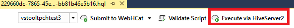

<properties
    pageTitle="Tools für Visual Studio Hadoop für HDInsight verwenden Sie lernen, wie | Microsoft Azure"
    description="Informationen Sie zum Installieren und verwenden Visual Studio Hadoop-Tools für HDInsight, um eine Verbindung mit einem Cluster Hadoop und Ausführen einer Abfrage Struktur."
    keywords="Hadoop-Tools, Struktur Abfrage visual studio"
    services="HDInsight"
    documentationCenter=""
    tags="azure-portal"
    authors="mumian"
    manager="jhubbard"
    editor="cgronlun"/>

<tags
    ms.service="hdinsight"
    ms.devlang="na"
    ms.topic="get-started-article"
    ms.tgt_pltfrm="na"
    ms.workload="big-data"
    ms.date="08/10/2016"
    ms.author="jgao"/>

# Erste Schritte mit Visual Studio Hadoop-Tools für HDInsight zum Ausführen einer Abfrage Struktur

Erfahren Sie, wie HDInsight Tools für Visual Studio zum Verbinden mit HDInsight Cluster und übermitteln Struktur Abfragen verwendet. Weitere Informationen zur Verwendung von HDInsight finden Sie unter [Einführung in HDInsight] [ hdinsight.introduction] und [Erste Schritte mit HDInsight][hdinsight.get.started]. Weitere Informationen zum Verbinden mit einem Storm Cluster finden Sie unter [entwickeln C#-Topologien für Apache Storm auf HDInsight mithilfe von Visual Studio][hdinsight.storm.visual.studio.tools].

**Erforderliche Komponenten**

Zum Ausführen dieses Lernprogramms, und verwenden Sie die Hadoop-Tools in Visual Studio, benötigen Sie Folgendes:

- Ein Azure HDInsight Cluster: ein Linux oder Windows-basierten Cluster funktionieren mit den Schritten in diesem Dokument. Finden Sie eine der folgenden Informationen zum Erstellen von eines Clusters aus:

    - [Erste Schritte mit Linux-basierten HDInsight](hdinsight-hadoop-linux-tutorial-get-started.md)
    - [Erste Schritte mit Windows-basierten HDInsight](hdinsight-hadoop-tutorial-get-started-windows.md)

- Eine Arbeitsstationen mit der folgenden Software:

    - Windows 7, Windows 8 oder Windows 8.1
    - Visual Studio (eine der folgenden Versionen):
        - Visual Studio 2013 Community/Professional/Premium/Ultimate mit [4 aktualisieren](https://www.microsoft.com/download/details.aspx?id=44921)
        - Visual Studio 2015 (Community/Enterprise)

    >[AZURE.NOTE] Die HDInsight-Tools für Visual Studio derzeit stammen nur mit der englischen Version.

## Installieren von HDInsight Tools für Visual Studio

HDInsight Tools für Visual Studio und Microsoft Struktur ODBC-Treiber sind mit Microsoft Azure SDK für .NET Version 2.5.1 verpackt oder höher. Sie können es mithilfe der [Web Platform Installer](http://go.microsoft.com/fwlink/?LinkId=255386)installieren. Sie müssen den auswählen, die mit Ihrer Version von Visual Studio übereinstimmt. Wenn Sie Visual Studio installiert haben, können Sie die neuesten Visual Studio-Community und Azure SDK verwenden der [Web Platform Installer](http://go.microsoft.com/fwlink/?LinkId=255386) oder verwenden die folgenden Links installieren:

- [Visual Studio-Community 2015 mit Microsoft Azure SDK](https://www.microsoft.com/web/handlers/webpi.ashx/getinstaller/VS2015CommunityAzurePack.appids)
- [Visual Studio-Community 2013 mit Microsoft Azure SDK](https://www.microsoft.com/web/handlers/webpi.ashx/getinstaller/VS2013CommunityAzurePack.appids)
- [Microsoft Azure SDK für .NET (im Vergleich mit einer 2015)](https://www.microsoft.com/web/handlers/webpi.ashx/getinstaller/VWDOrVs2015AzurePack.appids)
- [Microsoft Azure SDK für .NET (im Vergleich mit einer 2013)](https://www.microsoft.com/web/handlers/webpi.ashx/getinstaller/VWDOrVs2013AzurePack.appids)

![Hadoop Tools: HDinsight Tools für Visual Studio Web Platform Installer.][1]

## Verbinden mit Azure-Abonnements
Die HDInsight-Tools für Visual Studio ermöglicht es Ihnen, eine Verbindung mit Ihrem Cluster HDInsight einige grundlegende Management Operationen und Struktur Abfragen auszuführen.

>[AZURE.NOTE] Informationen zum Herstellen einer Verbindung zu einem generische Hadoop Cluster finden Sie unter [Schreiben und senden Sie die Struktur Abfragen mithilfe von Visual Studio](http://blogs.msdn.com/b/xiaoyong/archive/2015/05/04/how-to-write-and-submit-hive-queries-using-visual-studio.aspx).

**Die Verbindung zu Ihrem Azure-Abonnement**

1.  Öffnen Sie Visual Studio.
2.  Klicken Sie im Menü **Ansicht** auf **Server-Explorer** so, dass das Server-Explorer-Fenster zu öffnen.
3.  Erweitern Sie **Azure**, und klicken Sie dann **HDInsight**.

    >[AZURE.NOTE]Beachten Sie, dass das Fenster **Aufgabenliste HDInsight** offen sein sollte. Wenn Sie es nicht sehen, klicken Sie im Menü **Ansicht** auf **Andere Fenster** , und klicken Sie dann auf **Fenster Aufgabenliste HDInsight**.  
4.  Geben Sie Ihre Anmeldeinformationen Azure-Abonnement, und klicken Sie dann auf **Anmelden**. Diese Option ist nur erforderlich, wenn Sie von Visual Studio auf diesem Computer nie mit Azure-Abonnements verbunden haben.
5.  Im Server-Explorer wird eine Liste der vorhandenen HDInsight Cluster angezeigt. Wenn Sie alle Cluster besitzen, können Sie eine mithilfe der Azure-Portal, Azure PowerShell oder das HDInsight SDK bereitstellen. Weitere Informationen finden Sie unter [Bereitstellen von HDInsight Cluster][hdinsight-provision].

    ![Hadoop Tools: HDInsight Tools für Visual Studio-Server-Explorer Cluster Liste][5]
6.  Erweitern eines HDInsight Clusters an. **Datenbanken Struktur**, ein Speicher Standardkonto, verknüpfte Speicherkonten und **Hadoop-Protokoll**wird angezeigt. Sie können die Personen weiter erweitern.

Nachdem Sie Ihre Azure-Abonnement verbunden haben, können Sie folgende Aktionen ausführen:

**Verbinden mit Azure-Portal von Visual Studio**

- Erweitern Sie im Server-Explorer **Azure** > **HDInsight**, mit der rechten Maustaste in eines HDInsight Clusters, und klicken Sie dann auf **Verwalten Cluster Azure-Portal**.

**Stellen Sie Fragen und Feedback von Visual Studio bereitstellen**

- Im Menü **Extras** **HDInsight**, klicken Sie auf und dann klicken Sie auf **MSDN-Forum** , wenn Sie Fragen stellen, oder klicken Sie auf **Feedback geben**.

## Navigieren Sie verknüpften Ressourcen

Vom Server-Explorer können Sie das Standardkonto für den Speicher und alle verknüpften Speicherkonten anzeigen. Wenn Sie das Speicher-Standardkonto zu erweitern, können Sie den Container in das Speicherkonto anzeigen. Das Standardkonto für den Speicher und die standardmäßige Container markiert sind. Sie können auch eine der Container zum Anzeigen des Inhalts mit der rechten Maustaste.

![HDInsight Tools für Visual Studio Server Explorer Cluster Liste][2]

Nach dem Öffnen eines Containers können Sie mithilfe der folgenden Schaltflächen zum Hochladen, löschen und Herunterladen von Blobs:

## Ausführen einer Abfrage Struktur
[Apache Struktur] [ apache.hive] einer Datawarehouse-Infrastruktur auf Hadoop für die Bereitstellung von Analyse, Abfragen und Zusammenfassung der Daten erstellt wird. HDInsight Tools für Visual Studio unterstützt laufende Struktur Abfragen von Visual Studio. Weitere Informationen zur Struktur, finden Sie unter [Verwendung mit HDInsight Struktur][hdinsight.hive].

Es ist Zeit in Anspruch nehmen Struktur Skript für ein Cluster HDInsight zu testen. Einige Minuten das kann dauern. HDInsight Tools für Visual Studio kann Struktur Skript lokal ohne Herstellen einer Verbindung mit einem live Cluster überprüfen.

HDInsight Tools für Visual Studio können auch Benutzer finden Sie unter was innerhalb der Struktur Auftrag ist durch die Sammlung und Einbinden von die Protokolle aus von bestimmter Einzelvorgänge Struktur.

### Anzeigen der **hivesampletable**
Alle HDInsight Cluster im Zusammenhang mit einer Stichprobe strukturtabelle *Hivesampletable*bezeichnet. Wir verwenden diese Tabelle, die erläutert, wie Sie die Liste Struktur Tabellen, die Tabellenschemas anzeigen und Auflisten der Zeilen in der Tabelle Struktur.

**Liste der Tabellen Struktur und Struktur Tabellenschema anzeigen**

1.  **Server-Explorer**, erweitern Sie im Bereich **Azure** > **HDInsight** > Cluster Ihrer Wahl > **Datenbanken Struktur** > **Standard** > **Hivesampletable** das Tabellenschema angezeigt.
4.  Mit der rechten Maustaste **Hivesampletable**, und klicken Sie dann auf **Ansicht erste 100 Zeilen** , um die Liste der Zeilen ein. Es entspricht Struktur ODBC-Treiber verwenden folgende Struktur Abfrage ausführen:

        SELECT * FROM hivesampletable LIMIT 100

    Sie können die Anzahl der Zeilen anpassen.

    ![Hadoop Tools: HDinsight Struktur Visual Studio Schemaabfrage][6]

### Erstellen von Tabellen Struktur

Die Benutzeroberfläche können Sie eine strukturtabelle erstellen, oder verwenden Sie die Struktur Abfragen. Informationen zur Verwendung von Abfragen Struktur finden Sie unter [Abfragen Struktur ausführen](#run.queries).

**Erstellen eine strukturtabelle**

1. **Server-Explorer**, erweitern Sie im Bereich **Azure** > **HDInsight Cluster** ein HDInsight Cluster > **Datenbanken Struktur**, klicken Sie dann mit der rechten Maustaste **Standard**, und klicken Sie auf **Tabelle erstellen**.
2. Konfigurieren Sie die Tabelle.
3. Klicken Sie auf **Tabelle erstellen** , um den Auftrag zum Erstellen der neuen Tabelle Struktur zu übermitteln.

    ![Hadoop Tools: Hdinsight visual Studio-Tools erstellen strukturtabelle][7]

### Überprüfen und Ausführen von Abfragen Struktur
Es gibt zwei Methoden zum Erstellen und Ausführen von Abfragen Struktur aus:

- Erstellen von Ad-hoc-Abfragen
- Erstellen Sie eine Struktur Anwendung

**Erstellen, überprüfen und Ausführen von Ad-hoc-Abfragen**

1. Aus dem **Server-Explorer**erweitern Sie **Azure**, und klicken Sie dann **HDInsight Cluster**.
2. Mit der rechten Maustaste im Clusters, in dem Sie die Abfrage ausführen möchten, und klicken Sie dann auf **eine Struktur Abfrage schreiben**.
3. Geben Sie die Struktur Abfragen. Beachten Sie, dass der Struktur-Editor IntelliSense unterstützt. HDInsight Tools für Visual Studio unterstützt das Laden der remote-Metadaten aus, wenn Sie Ihr Skript Struktur bearbeiten. Bei der Eingabe von "SELECT * FROM" listet das IntelliSense beispielsweise die vorgeschlagenen Tabellennamen an. Wenn ein Tabellenname angegeben ist, werden die Spaltennamen nach der IntelliSense aufgeführt. Das Tool unterstützt fast alle Struktur DML Auszügen, Unterabfragen und die integrierten UDFs.

    ![Hadoop Tools: HDInsight Visual Studio Tools IntelliSense][13]

    ![Hadoop Tools: HDInsight Visual Studio Tools IntelliSense][14]

    > [AZURE.NOTE] Nur die Metadaten Zuordnungseinheiten, die HDInsight Symbolleiste ausgewählt ist, wird vorgeschlagen.
4. (Optional): Klicken Sie auf **Skript überprüfen Sie** das Skript Syntax auf Fehler überprüfen.

    ![Hadoop Tools: Hdinsight Tools für Visual Studio lokalen Überprüfung][10]

4. Klicken Sie auf **übermitteln** , oder **Senden (Erweitert)**. Mit der Option erweiterte übermitteln werden Sie **Projektname**, **Argumenten**, **Zusätzliche Konfigurationen**und **Status Verzeichnis** für das Skript konfigurieren:

    ![Hdinsight Hadoop Struktur Abfrage][9]

    Nachdem Sie den Auftrag gesendet haben, wird ein Fenster **Struktur Auftrag Zusammenfassung** .

    ![Zusammenfassung der einer Abfrage HDInsight Hadoop Struktur][8]
5. Verwenden Sie die Schaltfläche **Aktualisieren** , um den Status zu aktualisieren, bis der Status als **abgeschlossen**angezeigt wird.
6. Klicken Sie auf die Links am unteren Rand, Folgendes angezeigt: **Auftrag Abfrage**, **Position Ausgabe**, **Job-Protokoll**oder **Log aus**.

**Erstellen und Ausführen einer Lösung Struktur**

1. Im Menü **Datei** klicken Sie auf **neu**, und klicken Sie dann auf **Projekt**.
2. Wählen Sie im linken Bereich **HDInsight** aus, wählen Sie im mittleren Bereich **Struktur Anwendung** aus, geben Sie die Eigenschaften und klicken Sie dann auf **OK**.

    ![Hadoop Tools: Hdinsight visual Studio tools Projekt Struktur][11]
3. **Lösung-Explorer**Doppelklicken Sie auf **Script.hql** , um ihn zu öffnen.
4. Um die Struktur Skript zu überprüfen, können Sie klicken Sie auf die Schaltfläche **Skript überprüfen** oder mit der rechten Maustaste in des Skripts im Struktur-Editor, und klicken Sie dann im Kontextmenü auf **Skript überprüfen** .

### Die Struktur Einzelvorgänge anzeigen
Sie können die Position Abfragen, Position Ausgabe, Position Protokolle und aus Protokolle für Struktur Projekte anzeigen. Weitere Informationen finden Sie in den vorherigen Screenshot.

Die neueste Version des Tools können Sie sehen, was innerhalb der Struktur Aufträge ist sammeln und Einbinden von Protokolle aus. Ein Protokoll aus können Sie bearbeitenden Leistungsprobleme helfen. Weitere Informationen, wie HDInsight aus sammelt Protokolle auffordern, finden Sie unter [Zugriff HDInsight Anwendung Protokolle programmgesteuert][hdinsight.access.application.logs].

**Struktur Aufträge anzeigen**

1. Aus dem **Server-Explorer**erweitern Sie **Azure**, und klicken Sie dann **HDInsight**.
2. Mit der rechten Maustaste in eines HDInsight Clusters, und klicken Sie dann auf **Einzelvorgänge anzeigen**. Sie sehen eine Liste der Aufträge Struktur, die auf dem Cluster ausgeführt wurde.
3. Klicken Sie auf eine Position in der Auftragsliste, um ihn zu markieren, und klicken Sie dann verwenden Sie im Fenster **Projekt-Zusammenfassung Struktur** , um **Position Abfrage**, **Position Ausgabe**, **Job-Protokoll**oder **aus Protokoll**zu öffnen.

    ![Hadoop Tools: HDInsight Visual Studio Tools Struktur Aufträge anzeigen][12]

### Schnellere Pfad Struktur Ausführung über HiveServer2

>[AZURE.NOTE] Dieses Feature ist nur auf HDInsight Clusterversion 3,2 und höher verfügbar.

Die HDInsight-Tools zum Senden der Struktur Aufträge über [WebHCat](https://cwiki.apache.org/confluence/display/Hive/WebHCat) (auch bekannt als Templeton) verwendet. Es sehr lange gedauert Job-Details und Fehlerinformationen zurückgegeben.
Um dieses Leistungsproblem zu lösen, führt die Tools HDInsight Struktur Aufträge direkt im Cluster erfolgt über HiveServer2, aus, damit es RDP/SSH umgangen werden.
Zusätzlich eine bessere Leistung können Benutzer auch Struktur auf Tez Diagramme und den Aufgabendetails anzeigen.

HDInsight Clusterversion 3,2 oder höher können Sie eine Schaltfläche **Ausführen über HiveServer2** finden Sie unter:

Sie können die Protokolle gestreamt wieder in Echtzeit angezeigt und finden Sie unter den Auftrag Diagrammen, wenn die Struktur Abfrage in Tez ausgeführt wird.

**Unterschied zwischen Ausführen von Abfragen über HiveServer2 und Senden von Abfragen über WebHCat**

Obwohl Ausführen von Abfragen über HiveServer2 viele Leistungsvorteile enthält, muss es mehrere Einschränkungen. Einige Einschränkungen sind nicht für die Verwendung der Herstellung geeignet. Die folgende Tabelle zeigt die Unterschiede:

| |Über HiveServer2 ausführen |Senden per WebHCat|
|---|---|---|
|Ausführen von Abfragen|Verhindert, in WebHCat (welche Starts einer MapReduce Job "TempletonControllerJob" bezeichnet).|Solange eine Abfrage über WebHCat ausgeführt wird, startet WebHCat ein Auftrags MapReduce zusätzliche Wartezeit vorgestellt.|
|Stream Protokolle zurück|In nahezu in Echtzeit.|Die Protokolle der Ausführung der Position stehen nur, wenn das Projekt abgeschlossen ist.|
|Historie anzeigen|Wenn Sie eine Abfrage über HiveServer2 ausgeführt wird, wird es Historie (Job-Protokoll, Position Ausgabe) nicht beibehalten. Die Anwendung kann aus Benutzeroberfläche mit eingeschränkter Informationen angezeigt werden.|Wenn Sie eine Abfrage über WebHCat ausgeführt wird, wird es Historie (Job-Protokoll, Position Ausgabe) wird zwar beibehalten und kann mit Visual Studio/HDInsight SDK/PowerShell angezeigt werden. |
|Schließen des Fensters|  Über HiveServer2 aufgeführte ist eine Möglichkeit "synchron", sodass Sie die Fenster geöffnet bleiben müssen; Wenn das Fenster geschlossen sind, und klicken Sie dann die Ausführung der Abfrage abgebrochen wird.|Über WebHCat übermitteln ist eine Möglichkeit "asynchrone", damit Sie können die Abfrage über WebHCat übermitteln und schließen Sie Visual Studio. Sie können wieder und die Ergebnisse zu einem beliebigen Zeitpunkt angezeigt.|

### Tez Struktur Auftrag Leistung graph

Die HDInsight Visual Studio-Tools-Unterstützung mit Performance-Diagramme für die Struktur Einzelvorgänge ausgeführt wurde, indem die Tez Execution-Engine. Informationen zum Aktivieren von Tez, finden Sie unter [Verwenden der Struktur in HDInsight][hdinsight.hive]. Nach dem Senden eines Auftrags Struktur in Visual Studio enthält Visual Studio Sie die Grafik, wenn das Projekt abgeschlossen ist.  Möglicherweise müssen auf die Schaltfläche **Aktualisieren** , um den aktuellen Status der Position zu erhalten.

> [AZURE.NOTE] Dieses Feature ist nur für HDInsight Clusterversion über 3.2.4.593 verfügbar und können nur Arbeit für abgeschlossene Projekte (Wenn Sie Ihre Arbeit durch WebHCat; übermittelten dieses Diagramm zeigt beim Ausführen der Abfrage bis HiveServer2). Dies funktioniert für beide Windows und Linux-basierten Cluster.

Wenn Sie Ihre Abfrage Struktur helfen können, besser, das Tool hinzufügen die Struktur Operator Ansicht in dieser Version. Müssen Sie nur Doppelklicken auf die Scheitelpunkte des Diagramms Position klicken, und Sie können alle Operatoren in den Scheitelpunkt anzeigen. Sie können auch auf einem bestimmten Operator Weitere Details dieses Operators anzeigen zeigen.

### Ausführung Vorgangsansicht für Struktur Tez Einzelvorgänge

Die Ausführung Vorgangsansicht für Struktur Tez Einzelvorgänge kann zum Abrufen strukturiert und Informationen für Struktur Aufträge visualisiert, und es werden weitere Details der Position. Vorliegens Leistungsprobleme, können Sie die Ansicht, um Informationen zu erhalten. Beispielsweise Funktionsweise für jeden Vorgang und ausführliche Informationen zu den einzelnen Aufgaben (Daten Lese, Terminplan/Anfangs-/Ende-Zeit usw.), sodass die Position Konfigurationen oder basierend auf den Informationen visuell dargestellte Systemarchitektur optimiert werden kann.

## Schwein Skripts ausführen

HDInsight Tools für Visual Studio unterstützt das Erstellen und senden Sie Schwein Skripts auf HDInsight Cluster. Benutzer können Sie ein Projekt Schwein aus Vorlage erstellen und senden Sie das Skript HDInsight Cluster.

## Das Feedback und bekannte Probleme

- Aktuell werden HiveServer2 Ergebnisse in reinem Text Weise angezeigt, die nicht ideal ist. Wir arbeiten auf, die zu beheben.

- Wenn die Ergebnisse mit NULL-Werten gestartet werden, sind die Ergebnisse derzeit nicht angezeigt. Wir haben dieses Problem behoben und wenn Sie auf dieses Problem, blockiert werden gerne hinterlassen Sie uns eine e-Mail-Nachricht, oder wenden Sie sich an Supportteam.

- Je nach der Einstellung für die lokale Region des Benutzers wird das Visual Studio erstellte HQL Skript codiert. Es möglicherweise nicht ordnungsgemäß ausgeführt, wenn Benutzer das Skript als Binärzahl Zuordnungseinheit hochlädt.

Können Sie Wenn Sie Vorschläge oder das Feedback haben oder Probleme auftreten, wenn Sie dieses Tool verwenden, uns eine e-Mail-Nachricht an Hdivstool bei Microsoft Punkt Com einfügen.

## Nächste Schritte
In diesem Artikel haben Sie Herstellen einer Verbindung mit HDInsight Cluster aus Visual Studio mithilfe des Tools-Pakets Hadoop und Ausführen eine Abfrage Struktur. Weitere Informationen finden Sie unter:

- [Hadoop Struktur in HDInsight verwenden][hdinsight.hive]
- [Erste Schritte mit Hadoop in HDInsight][hdinsight.get.started]
- [Hadoop Aufträge in HDInsight senden][hdinsight.submit.jobs]
- [Analysieren von Twitter-Daten mit Hadoop in HDInsight][hdinsight.analyze.twitter.data]

<!--Anchors-->
[Installation]: #installation
[Connect to your Azure subscription]: #connect-to-your-azure-subscription
[Navigate the linked resources]: #navigate-the-linked-resources
[Run Hive queries]: #run-hive-queries
[Next steps]: #next-steps

<!--Image references-->
[1]: ./media/hdinsight-hadoop-visual-studio-tools-get-started/hdinsight.visual.studio.tools.wpi.png
[2]: ./media/hdinsight-hadoop-visual-studio-tools-get-started/hdinsight.visual.studio.tools.linked.resources.png
[5]: ./media/hdinsight-hadoop-visual-studio-tools-get-started/hdinsight.visual.studio.tools.server.explorer.png
[6]: ./media/hdinsight-hadoop-visual-studio-tools-get-started/hdinsight.visual.studio.tools.hive.schema.png
[7]: ./media/hdinsight-hadoop-visual-studio-tools-get-started/hdinsight.visual.studio.tools.create.hive.table.png
[8]: ./media/hdinsight-hadoop-visual-studio-tools-get-started/hdinsight.visual.studio.tools.run.hive.job.summary.png
[9]: ./media/hdinsight-hadoop-visual-studio-tools-get-started/hdinsight.visual.studio.tools.submit.jobs.advanced.png
[10]: ./media/hdinsight-hadoop-visual-studio-tools-get-started/hdinsight.visual.studio.tools.validate.hive.script.png
[11]: ./media/hdinsight-hadoop-visual-studio-tools-get-started/hdinsight.visual.studio.tools.new.hive.project.png
[12]: ./media/hdinsight-hadoop-visual-studio-tools-get-started/hdinsight.visual.studio.tools.view.hive.jobs.png
[13]: ./media/hdinsight-hadoop-visual-studio-tools-get-started/hdinsight.visual.studio.tools.intellisense.table.names.png
[14]: ./media/hdinsight-hadoop-visual-studio-tools-get-started/hdinsight.visual.studio.tools.intellisense.column.names.png

<!--Link references-->
[hdinsight-provision]: hdinsight-provision-clusters.md
[hdinsight.introduction]: hdinsight-hadoop-introduction.md
[hdinsight.get.started]: hdinsight-hadoop-linux-tutorial-get-started.md
[hdinsight.hive]: hdinsight-use-hive.md
[hdinsight.submit.jobs]: hdinsight-submit-hadoop-jobs-programmatically.md
[hdinsight.analyze.twitter.data]: hdinsight-analyze-twitter-data.md
[hdinsight.storm.visual.studio.tools]: hdinsight-storm-develop-csharp-visual-studio-topology.md
[hdinsight.access.application.logs]: hdinsight-hadoop-access-yarn-app-logs.md

[apache.hive]: http://hive.apache.org
