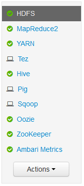
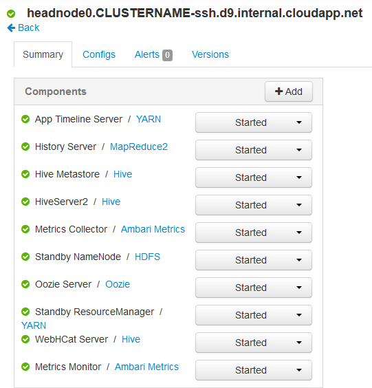
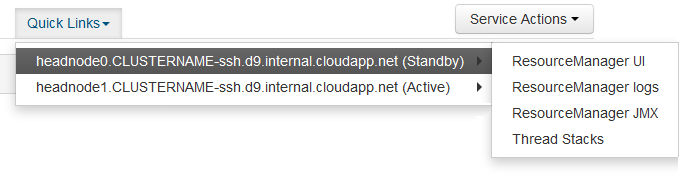
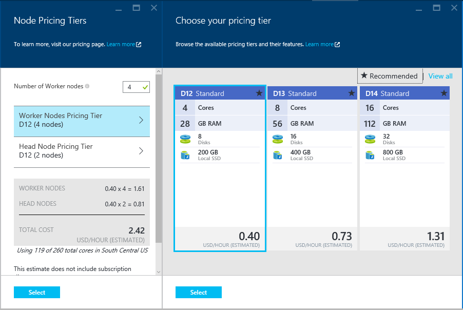

<properties
    pageTitle="Funktionen für hohe Verfügbarkeit von Linux-basierten HDInsight (Hadoop) | Microsoft Azure"
    description="Erfahren Sie, wie Linux-basierten HDInsight Cluster mehr Zuverlässigkeit und Verfügbarkeit mithilfe einer zusätzlichen am Knotens. Erfahren Sie, wie dies Hadoop-Diensten wie Ambari und Struktur, und wie wirkt sich auf einzeln an jeden am Knoten über SSH verbinden."
    services="hdinsight"
    editor="cgronlun"
    manager="jhubbard"
    authors="Blackmist"
    documentationCenter=""
    tags="azure-portal"/>

<tags
    ms.service="hdinsight"
    ms.workload="big-data"
    ms.tgt_pltfrm="na"
    ms.devlang="multiple"
    ms.topic="article"
    ms.date="09/13/2016"
    ms.author="larryfr"/>

#Verfügbarkeit und Zuverlässigkeit der Hadoop Cluster in HDInsight

Hadoop erreicht hohe Verfügbarkeit und Zuverlässigkeit durch redundante Kopien von Diensten und Daten auf die Knoten in einem Cluster verteilt. Hadoop-Standarddistributionen müssen jedoch in der Regel nur einen einzelnen am Knoten. Alle Ausfall des einzelnen am Knotens kann dazu führen, dass Cluster nicht mehr funktionieren.

Um dieses potenzielle Problem zu beheben, bieten HDInsight Linux-basierten Cluster in Azure zwei am Knoten zum Steigern der Verfügbarkeit und Zuverlässigkeit Hadoop Dienste und der Einzelvorgänge ausgeführt.

> [AZURE.NOTE] Die Schritte in diesem Dokument verwendeten sind HDInsight Linux-basierten Cluster. Wenn Sie einen Windows-basierten Cluster verwenden, finden Sie unter [Verfügbarkeit und Zuverlässigkeit der Windows-basiertem Hadoop Cluster in HDInsight](hdinsight-high-availability.md) Windows-spezifische Informationen.

##Grundlegendes zu den Knoten

Knoten in einem Cluster HDInsight werden mithilfe von Azure-virtuellen Computern implementiert. Den Fall, dass ein Knoten fehlschlägt, offline geschaltet wird und ein neuer Knoten wird erstellt, um den fehlerhaften Knoten zu ersetzen. Während der Knoten offline ist, wird ein anderer Knoten desselben Typs verwendet werden, bis Sie der neue Knoten online ist.

> [AZURE.NOTE] Ist der Knoten Daten analysieren, wenn sie nicht, geht deren Status auf den Auftrag verloren. Die Position, die der fehlerhaften Knoten gearbeitet wurde, wird zu einem anderen Knoten erneut übermittelt werden.

Den folgenden Abschnitten werden die Typen der einzelnen Knoten mit HDInsight verwendet. Für einen Cluster werden nicht alle Typen von Knoten verwendet. Beispielsweise wird ein anderes Hadoop Cluster nicht keine Nimbus-Knoten verfügen. Weitere Informationen zu Knoten von HDInsight Cluster Feldtypen verwendet finden Sie unter dem Abschnitt Cluster Typen von [Hadoop erstellen Linux-basierten Cluster in HDInsight](hdinsight-hadoop-provision-linux-clusters.md#cluster-types).

###Kopf Knoten

Einige Implementierung von Hadoop haben einen einzelnen am Knoten, der Dienste und Komponenten, die den Fehler Worker Knoten reibungslos verwalten hostet. Aber alle Ausfall der Gestaltungsvorlage auf dem am Knoten ausgeführten Dienste würde Cluster funktioniert nicht mehr.

HDInsight Cluster bieten, einen sekundären am Knoten, wodurch master Dienste und Komponenten weiterhin auf dem sekundären Knoten im Fall eines Fehlers auf dem primären ausgeführt wird.

> [AZURE.IMPORTANT] Beide am Knoten sind gleichzeitig aktiv sind und im Cluster ausgeführt. Einige Dienste, wie z. B. HDFS oder aus, sind nur zu keinem angegebenen Zeitpunkt (standby auf dem anderen am Knoten) aktiv auf einem am Knoten. Anderen Diensten wie HiveServer2 oder MetaStore Struktur werden zur gleichen Zeit auf beide am Knoten aktiv.

Kopf Knoten (und anderen Knoten im HDInsight,) müssen einen numerischen Wert als Teil der Hostname des Knotens. Beispielsweise `hn0-CLUSTERNAME` oder `hn4-CLUSTERNAME`. 

> [AZURE.IMPORTANT] Ordnen Sie den numerischen Wert nicht mit, ob ein Knoten primäre oder sekundäre ist; der numerische Wert ist nur vorhanden sein, um einen eindeutigen Namen für die einzelnen Knoten bereit.

###Nimbus Knoten

Storm Cluster müssen bereitstellen Nimbus Knoten ähnliche Funktionalität zu den Hadoop JobTracker aus, indem Sie verteilen und Überwachen von Verarbeitung über Worker Knoten. HDInsight bietet 2 Nimbus Knoten für den Storm Cluster ein.

###Zookeeper Knoten

[ZooKeeper](http://zookeeper.apache.org/ ) Knoten (ZKs) für Füllzeichen Wahl der master Dienste auf am Knoten verwendet werden, und um sicherzustellen, dass die Dienste, (Worker) Datenknoten und Gateways, welche am Knoten wissen ein master-Dienst auf aktiv ist. HDInsight bietet standardmäßig 3 ZooKeeper Knoten.

###Worker Knoten

Worker Knoten führen Sie die Analyse tatsächlichen Daten, wenn ein Projekt mit dem Cluster gesendet wird. Wenn ein Worker Knoten fehlschlägt, wird die Aufgabe, die sie durchgeführt wurde auf einen anderen Worker Knoten gesendet. Standardmäßig wird HDInsight 4 Worker Knoten erstellen. Allerdings können Sie diese Nummer an Ihre Ansprüche während der Clustererstellung sowohl nach der Clustererstellung ändern.

###Rand-Knoten

Ein Kantenknoten nimmt nicht aktiv an die Datenanalyse im Cluster Teil, aber stattdessen von Entwickler oder Daten Wissenschaftler verwendet bei der Arbeit mit Hadoop. Der Kantenknoten befindet sich in der gleichen virtuellen Azure-Netzwerk wie die anderen Knoten im Cluster, und alle anderen Knoten direkt zugreifen kann. Da es nicht im Zusammenhang mit dem Analysieren von Daten für den Cluster, kann er ohne Rücksicht darauf Ressourcen von kritischen Hadoop Services oder Analysis-Aufträge Aufzeichnen von verwendet werden.

R Server auf HDInsight ist derzeit der einzige Clustertyp, der einen Kantenknoten standardmäßig enthält. Für R Server auf HDInsight, wird der Kantenknoten verwendet R Testcode lokal auf dem Knoten vor dem zum Cluster für verteilten Verarbeitung absenden.

[HDInsight Linux-basierten Cluster mit Farbton auf eine Kantenknoten erstellen](https://azure.microsoft.com/documentation/templates/hdinsight-linux-with-hue-on-edge-node/) ist eine Beispielvorlage, die ein anderes Hadoop Cluster zu erstellen, die einen Kantenknoten weist verwendet werden kann.

## Zugreifen auf die Knoten

Zugriff auf den Cluster über das Internet über einen öffentlichen Gateway bereitgestellt wird, und zum Herstellen einer Verbindung mit der am Knoten begrenzt ist und (Wenn eine auf HDInsight Cluster, R-Server) den Kantenknoten. Zugriff auf Dienste, die auf den am Knoten ausgeführte nicht erfolgt, indem Sie mehrere am Knoten, öffentlichen Gateways Anfragen an den am Knoten weiterleitet, die den angeforderten Dienst hostet. Angenommen, wenn Ambari auf dem sekundären am Knoten aktuell gehostet wird, wird das Gateway eingehende Anfragen für Ambari zu diesem Knoten weiterleiten.

Beim Zugriff auf den Cluster mithilfe von SSH verbindet mit dem primären am Knoten Herstellen einer Verbindung über Port 22 (die Standardeinstellung für SSH,); Herstellen einer Verbindung über Port 23 verbindet mit dem sekundären am Knoten. Beispielsweise `ssh username@mycluster-ssh.azurehdinsight.net` wird auf dem primären am Knoten im Cluster mit dem Namen __MeinCluster__verbinden.

> [AZURE.NOTE] Dies gilt auch für Protokolle basierend auf SSH, wie etwa die SSH Datei Transfer Protocol (SFTP).

Der Kantenknoten mit R Server bereitgestellt wird, klicken Sie auf HDInsight Cluster kann auch direkt über zugegriffen werden SSH über Port 22. Beispielsweise `ssh username@RServer.mycluster.ssh.azurehdinsight.net` wird für einen Server R auf HDInsight Cluster mit dem Namen __MeinCluster__auf den Rand Knoten verbinden. 

### Interner vollqualifizierten Domänennamen (FULLY)

Knoten in einem Cluster HDInsight haben, eine interne IP-Adresse und FQDN, die nur aus dem Cluster (beispielsweise eine SSH Sitzung zu den am Knoten oder eine Position auf dem Cluster ausgeführt.) zugegriffen werden kann Beim Zugriff auf Dienste auf dem Cluster den internen FQDN oder IP-Adresse verwenden, sollten Sie Ambari verwenden, die IP- oder den vollqualifizierten Domänennamen für den Dienst den Zugriff auf überprüfen.

Beispielsweise Oozie Dienst nur ausgeführt werden kann auf einem am Knoten und mit der `oozie` Befehl aus einer SSH-Sitzung erfordert die URL für den Dienst. Dies kann aus Ambari abgerufen werden, mit den folgenden Befehl aus:

    curl -u admin:PASSWORD "https://CLUSTERNAME.azurehdinsight.net/api/v1/clusters/CLUSTERNAME/configurations?type=oozie-site&tag=TOPOLOGY_RESOLVED" | grep oozie.base.url

Dadurch wird zurückgegeben, einen Wert ähnlich wie der folgende, die die interne URL zur Verwendung mit enthält die `oozie` Befehl:

    "oozie.base.url": "http://hn0-CLUSTERNAME-randomcharacters.cx.internal.cloudapp.net:11000/oozie"

### Zugreifen auf andere Typen von Knoten

Sie können mit Knoten herstellen, die nicht direkt zugänglich über das Internet sind mithilfe der folgenden Methoden.

* __SSH__: nach Herstellen der Verbindung zu einem am Knoten über SSH, dann können SSH aus dem am Knoten Verbindung zu anderen Knoten im Cluster.
* __SSH Tunnel__: Wenn Sie müssen Zugriff von einem Webdienst gehostet wird, klicken Sie auf einen der Knoten, die nicht mit dem Internet verbunden ist, müssen Sie [einen Tunnel SSH verwenden](hdinsight-linux-ambari-ssh-tunnel.md).
* __Azure-virtuellen Netzwerk__: Wenn Ihre HDInsight Cluster ein Azure-virtuellen Netzwerk gehört, in der gleichen virtuellen Netzwerk kann direkt Zugriff auf alle Ressourcen alle Knoten im Cluster.

## So aktivieren Sie auf eine Dienststatus

Entweder der Ambari Web-Benutzeroberfläche oder die Ambari REST-API kann verwendet werden, Überprüfen des Status von Diensten, die auf den am Knoten ausgeführt werden.

###Ambari Web-Benutzeroberfläche

Der Web-Benutzeroberfläche Ambari kann bei https://CLUSTERNAME.azurehdinsight.net angezeigt werden. Ersetzen Sie **CLUSTERNAME** mit dem Namen der Cluster aus. Wenn Sie dazu aufgefordert werden, geben Sie die HTTP-Benutzeranmeldeinformationen für Ihren Cluster ein. Der standardmäßige HTTP-Benutzername ist **Admin** und das Kennwort ist das Kennwort ein, das Sie beim Erstellen des Clusters eingegeben haben.

Wenn Sie auf der Seite Ambari eintreffen, werden die installierte Dienste auf der linken Seite der Seite aufgelistet.

Es gibt eine Reihe von Symbolen, die neben einem Dienst an, dass Status angezeigt werden kann. Alle Warnungen im Zusammenhang mit einem Dienst können Sie verwenden den Link **Benachrichtigungen** am oberen Rand der Seite angezeigt werden. Sie können jedem Dienst, um weitere Informationen anzuzeigen, klicken Sie auf ihn auswählen.

Während die Seite Informationen über den Status und Konfiguration der einzelnen Dienste bereitstellt, geht nicht hieraus auf welche am Knoten der Dienst ausgeführt wird. Wenn diese Informationen anzeigen möchten, verwenden Sie den Link **Hosts** am oberen Rand der Seite aus. Dadurch wird die Hosts im Cluster, einschließlich der am Knoten angezeigt.

Markieren den Link für eines der am Knoten werden die Dienste und Komponenten, die in diesem Knoten laufen angezeigt.

###Ambari REST-API

Die Ambari REST-API steht über das Internet, und das öffentliche Gateway behandelt Weiterleitung Anfragen zum am Knoten, der derzeit die REST-API befindet.

Mit dem folgenden Befehl können den Status eines Diensts über die REST-API Ambari prüfen:

    curl -u admin:PASSWORD https://CLUSTERNAME.azurehdinsight.net/api/v1/clusters/CLUSTERNAME/services/SERVICENAME?fields=ServiceInfo/state

* Ersetzen Sie **das Kennwort** mit dem HTTP-Benutzer (Administrator) Kontokennwort

* Ersetzen Sie **CLUSTERNAME** mit dem Namen der cluster

* Ersetzen Sie **SERVICENAME** durch den Namen des Diensts zum Überprüfen des status

Zum Überprüfen des Status des Diensts in einem Cluster **MeinCluster**, mit dem Kennwort **das Kennwort ein**, mit der Bezeichnung **HDFS** würden Sie beispielsweise die folgenden verwenden:

    curl -u admin:password https://mycluster.azurehdinsight.net/api/v1/clusters/mycluster/services/HDFS?fields=ServiceInfo/state

Die Antwort werden ähnlich wie der folgende aus:

    {
      "href" : "http://hn0-CLUSTERNAME.randomcharacters.cx.internal.cloudapp.net:8080/api/v1/clusters/mycluster/services/HDFS?fields=ServiceInfo/state",
      "ServiceInfo" : {
        "cluster_name" : "mycluster",
        "service_name" : "HDFS",
        "state" : "STARTED"
      }
    }

Die URL erfahren wir, dass der Dienst auf einem am Knoten mit dem Namen __hn0-CLUSTERNAME__aktuell ausgeführt wird.

Der Status gibt uns, die der Dienst derzeit ausgeführt wird, oder **gestartet**.

Wenn Sie nicht wissen, welche Dienste auf dem Cluster installiert sind, können Sie die folgenden, zum Abrufen einer Liste:

    curl -u admin:PASSWORD https://CLUSTERNAME.azurehdinsight.net/api/v1/clusters/CLUSTERNAME/services

####Die Komponenten

Services möglicherweise Komponenten enthalten, denen den Status der einzeln gesucht werden soll. Zum Beispiel enthält HDFS die Komponente NameNode. Zum Anzeigen von Informationen für eine Komponente wäre der Befehl:

    curl -u admin:PASSWORD https://CLUSTERNAME.azurehdinsight.net/api/v1/clusters/CLUSTERNAME/services/SERVICE/components/component

Wenn Sie nicht wissen, welche Komponenten von einem Dienst bereitgestellt werden, können Sie die folgenden, zum Abrufen einer Liste:

    curl -u admin:PASSWORD https://CLUSTERNAME.azurehdinsight.net/api/v1/clusters/CLUSTERNAME/services/SERVICE/components/component
    
## Zugreifen auf die am Knoten Protokolldateien

###SSH

Während Sie mit einem am Knoten über SSH verbunden, können Protokolldateien unter **Systemprotokolle**gefunden werden. Beispielsweise enthalten **/var/log/hadoop-yarn/yarn** Protokolle für aus.

Jeder am Knoten kann eindeutige Protokolleinträge, haben, damit Sie die Protokolle auf beide überprüfen soll.

###SFTP

Sie können auch Verbinden mit dem am Knoten mit dem SSH File Transfer Protocol oder Secure Datei Transfer Protocol (SFTP) und die Protokolldateien direkt herunterladen.

Ähnlich wie bei der Verwendung von SSH-Client, muss beim Herstellen einer Verbindung mit dem Cluster Sie den Namen des Benutzerkontos SSH und der Adresse SSH Cluster bereitstellen. Beispielsweise `sftp username@mycluster-ssh.azurehdinsight.net`. Sie müssen auch Geben Sie das Kennwort für das Konto aus, wenn Sie dazu aufgefordert werden oder Bereitstellen einer öffentlichen Schlüssel unter Verwendung der `-i` Parameter.

Nachdem die Verbindung hergestellt wurde, werden Sie präsentiert mit einer `sftp>` auffordern. Diese Aufforderung können Sie Verzeichnisse ändern, hochladen und Herunterladen von Dateien. Angenommen, die folgenden Befehle wechseln Sie in das Verzeichnis **/var/log/hadoop/hdfs** und Laden Sie alle Dateien im Verzeichnis.

    cd /var/log/hadoop/hdfs
    get *

Geben Sie eine Liste der verfügbaren Befehle, `help` bei der `sftp>` auffordern.

> [AZURE.NOTE] Es gibt auch grafische Schnittstellen, mit die Sie das Dateisystem, wenn verbunden über SFTP visualisieren können. Beispielsweise können mit [MobaXTerm](http://mobaxterm.mobatek.net/) Sie das Dateisystem eine Schnittstelle ähnlich wie Windows Explorer durchsuchen.

###Ambari

> [AZURE.NOTE] Zugreifen auf Protokolldateien über Ambari erfordert einen Tunnel SSH wie die Websites für die einzelnen Dienste nicht öffentlich im Internet verfügbar gemacht werden. Informationen zur Verwendung eines SSH Tunnels finden Sie unter [Verwenden SSH Tunnel Ambari Web UI, Ressourcen-Manager, JobHistory, NameNode, Oozie, und andere Elemente Benutzeroberfläches von Web Zugriff auf](hdinsight-linux-ambari-ssh-tunnel.md).

Der Ambari Web-Benutzeroberfläche wählen Sie den Dienst, den Sie Protokolle für (z. B. aus) anzeigen möchten, und verwenden Sie **Quicklinks** zum zum Anzeigen der Protokolle für welchen am Knoten auswählen.

## So konfigurieren Sie die Knotengröße ##

Die Größe der ein Knoten nur während der Clustererstellung ausgewählt werden kann. Sie können eine Liste der verschiedenen verfügbaren virtuellen Computer Größen für HDInsight, einschließlich der Core, Arbeitsspeicher und lokale Speicher für jede auf der [HDInsight Preisgestaltung Seite](https://azure.microsoft.com/pricing/details/hdinsight/)suchen.

Wenn Sie einen neuen Cluster zu erstellen, können Sie die Größe der Knoten angeben. Im folgenden finden Sie Informationen zum Angeben der Größe der [Azure-Portal]mit[preview-portal], [Azure PowerShell][azure-powershell], und die [CLI Azure][azure-cli]:

* **Azure-Portal**: Wenn Sie einen neuen Cluster zu erstellen, erhalten Sie die Möglichkeit, die Größe (Stufe, Preisgestaltung) mit dem Seitenkopf keinen Worker und (Wenn Sie nach dem Clustertyp) ZooKeeper Knoten für den Cluster:

    

* **Azure CLI**: bei Verwendung der `azure hdinsight cluster create` Befehl, Sie können die Größe der Leiter, Worker und ZooKeeper Knoten festlegen, mit der `--headNodeSize`, `--workerNodeSize`, und `--zookeeperNodeSize` Parameter.

* **Azure PowerShell**: bei Verwendung der `New-AzureRmHDInsightCluster` Cmdlet, können Sie die Größe der Leiter, Worker und ZooKeeper Knoten festlegen, mithilfe der `-HeadNodeVMSize`, `-WorkerNodeSize`, und `-ZookeeperNodeSize` Parameter.

##Nächste Schritte

In diesem Dokument haben Sie erfahren, wie Azure HDInsight hohen Verfügbarkeit für Hadoop bereitstellt. Verwenden Sie die folgenden erfahren Sie mehr über angesprochenen in diesem Dokument aus.

- [Ambari REST Bezug](https://github.com/apache/ambari/blob/trunk/ambari-server/docs/api/v1/index.md)

- [Installieren und Konfigurieren der Azure-CLI](../xplat-cli-install.md)

- [Installieren und Konfigurieren von Azure PowerShell](../powershell-install-configure.md)

- [Verwalten von HDInsight mithilfe von Ambari](hdinsight-hadoop-manage-ambari.md)

- [Bereitstellung von Linux-basierten HDInsight Cluster](hdinsight-hadoop-provision-linux-clusters.md)

[preview-portal]: https://portal.azure.com/
[azure-powershell]: ../powershell-install-configure.md
[azure-cli]: ../xplat-cli-install.md
