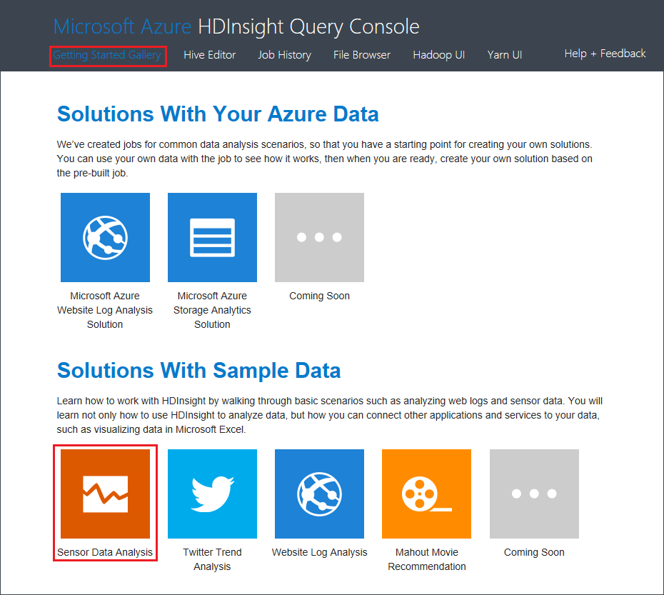

<properties
    pageTitle="Analysieren Sie mithilfe von Struktur und Hadoop Sensordaten | Microsoft Azure"
    description="Erfahren Sie, wie Sensor Datenanalyse mithilfe der Struktur Abfrage Konsole mit HDInsight (Hadoop), und klicken Sie dann Visualisieren von Daten in Microsoft Excel mit Power View vorbereiten."
    services="hdinsight"
    documentationCenter=""
    authors="Blackmist"
    manager="jhubbard"
    editor="cgronlun"
    tags="azure-portal"/>

<tags
    ms.service="hdinsight"
    ms.workload="big-data"
    ms.tgt_pltfrm="na"
    ms.devlang="na"
    ms.topic="article"
    ms.date="09/20/2016" 
    ms.author="larryfr"/>

#Analysieren Sie mit der Struktur Abfrage Systemzeit Hadoop in HDInsight Sensordaten

Erfahren Sie, wie Sensor Datenanalyse mithilfe der Struktur Abfrage Konsole mit HDInsight (Hadoop), und klicken Sie dann Visualisieren von Daten in Microsoft Excel mithilfe von Power View.

> [AZURE.NOTE] Die Schritte in diesem Dokument funktionieren nur mit Windows-basierten HDInsight Cluster.

In diesem Beispiel verwenden Sie Struktur zum Verarbeiten von zurückliegende Daten, Heizung, Belüftung und Klimaanlagen (HKL-System) erzeugt um Systeme zu identifizieren, die nicht zuverlässig eine Temperatur festlegen verwalten können. Erfahren Sie, wie Sie:

- Erstellen von Struktur Tabellen zum Abfragen von Daten in durch Trennzeichen getrennte Wert (CSV) Dateien gespeichert.
- Erstellen Sie Struktur Abfragen zum Analysieren der Daten.
- Verwenden Sie Microsoft Excel für die Verbindung mit HDInsight (mit (ODBC) open Database Connectivity zum Abrufen der analysierten Daten.
- Verwenden Sie Power View zur Visualisierung von Daten.

##Erforderliche Komponenten

* Eine HDInsight (Hadoop) Cluster: finden Sie unter [Bereitstellen von Hadoop Cluster in HDInsight](hdinsight-provision-clusters.md) Informationen zum Erstellen eines Clusters.

* Microsoft Excel 2013

    > [AZURE.NOTE] Microsoft Excel wird für Visualisierung von Daten mit [Power View](https://support.office.com/Article/Power-View-Explore-visualize-and-present-your-data-98268d31-97e2-42aa-a52b-a68cf460472e?ui=en-US&rs=en-US&ad=US)verwendet.

* [Microsoft-Struktur ODBC-Treiber](http://www.microsoft.com/download/details.aspx?id=40886)

##Zum Ausführen des Beispiels

1. Navigieren Sie über den Webbrowser zu folgendem URL. Ersetzen Sie `<clustername>` mit dem Namen der Cluster HDInsight.

        https://<clustername>.azurehdinsight.net

    Wenn Sie dazu aufgefordert werden, authentifizieren Sie, indem Sie mit der Administrator-Benutzernamen und Ihr Kennwort ein, die Sie beim Bereitstellen von diesem Cluster verwendet.

2. Klicken Sie von der Webseite, der angezeigt wird auf der Registerkarte **Erste Schritte-Katalog** , und klicken Sie dann unter der Kategorie **Lösungen mit Beispieldaten** auf der Stichprobe **Sensor Datenanalyse** .

    

3. Anweisungen Sie zur Verfügung gestellt, klicken Sie auf der Webseite, auf die Stichprobe Fertig stellen.
