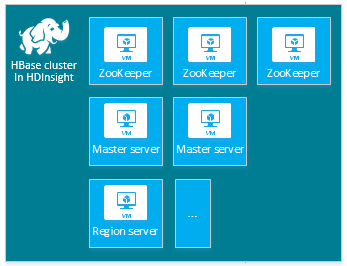
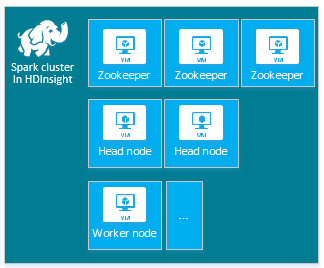

<properties
   pageTitle="Erstellen von Windows-basiertem Hadoop Cluster in HDInsight | Microsoft Azure"
    description="Erfahren Sie, wie Cluster für Azure-HDInsight zu erstellen."
   services="hdinsight"
   documentationCenter=""
   tags="azure-portal"
   authors="mumian"
   manager="jhubbard"
   editor="cgronlun"/>

<tags
   ms.service="hdinsight"
   ms.devlang="na"
   ms.topic="article"
   ms.tgt_pltfrm="na"
   ms.workload="big-data"
   ms.date="10/21/2016"
   ms.author="jgao"/>

# Erstellen von Windows-basiertem Hadoop Cluster in HDInsight

[AZURE.INCLUDE [selector](../../includes/hdinsight-selector-create-clusters.md)]

Ein Hadoop Cluster besteht aus mehreren virtuellen Computern (Knoten), die für verteilten Verarbeitung von Vorgängen auf dem Cluster verwendet werden. Azure fasst Details der Implementierung der Installation und Konfiguration einzelner Knoten, sodass Sie zur von allgemeinen Konfigurationsinformationen bereitstellen müssen. In diesem Artikel erfahren Sie, diese Einstellungen Konfiguration.

>[AZURE.NOTE] Die Informationen in diesem Dokument ist für Windows-basiertem Azure HDInsight Cluster spezifisch. Informationen zu Linux-basierten Cluster finden Sie unter [Erstellen von Linux-basierten Hadoop Cluster in HDInsight](hdinsight-hadoop-provision-linux-clusters.md).

## Anforderungen für Access-Steuerelement

[AZURE.INCLUDE [access-control](../../includes/hdinsight-access-control-requirements.md)]

## Clustertypen##

Derzeit bietet HDInsight vier verschiedene Typen von Cluster, jede mit einer Reihe von Komponenten, um bestimmte Funktionalitäten bereitstellen.

| Clustertyp | Funktionalität |
| ------------ | ----------------------------- |
| Hadoop       | Abfragen und Analysen (Stapelverarbeitungsaufträge)     |
| HBase        | NoSQL Datenspeicher            |
| Storm        | Verarbeitung von Ereignissen in Echtzeit |
| Spark (Preview) | Verarbeitung von in-Memory, interaktive Abfragen Micro-Stapel Stream Verarbeitung |

Jeder Cluster verfügt über eine eigene Anzahl der Knoten, Terminologie für Knoten im Cluster und virtueller Computer Standardgröße für die einzelnen Knoten. In der folgenden Tabelle ist die Anzahl der Knoten für die einzelnen Knoten in Klammern ein.

| Typ| Knoten (Anzahl der Knoten)| Diagramm|
|-----|------|--------|
|Hadoop| Kopf Knoten (2), Datenknoten (1 +)||
|HBase|Kopf Server (2), Region Server (1 +), Master-/ZooKeeper Knoten (3)||
|Storm|Nimbus Knoten (2), Vorgesetzten Server (1 +) ZooKeeper Knoten (3)||
|Spark|Kopf Knoten (2), Worker Knoten (1 +) ZooKeeper Knoten (3) (kostenlos A1 ZooKeeper virtueller Speicher)||

> [AZURE.IMPORTANT] Wenn Sie beabsichtigen, auf dem Vorhandensein von mehr als 32 Worker-Knoten, bei der Clustererstellung oder durch Skalierung Cluster nach der Erstellung, müssen Sie eine Knotengröße am mit mindestens 8 Kernen und 14 GB RAM auswählen.

Sie können andere unsichere Komponenten, wie etwa Farbton oder R in diese grundlegenden Typen mithilfe von [Skript-Aktionen](#customize-clusters-using-script-action)hinzufügen.

> [AZURE.IMPORTANT] HDInsight Cluster einer Vielzahl von Typen, die entsprechen den Arbeitsbelastung oder Technologie, die für der Cluster optimiert ist nützlich sein. Es gibt keine unterstützte Methode zum einen Cluster zu erstellen, der mehrere Typen, z. B. Storm und HBase auf einem Cluster kombiniert. 

Wenn Ihre Lösung Technologien erforderlich, die über mehrere Arten von HDInsight Cluster verteilt sind ist, sollten Sie ein Azure-virtuellen Netzwerk erstellen und erstellen Sie die erforderlichen Clustertypen innerhalb des virtuellen Netzwerks. Dadurch wird die Cluster und Code, die, den Sie darauf, um direkt miteinander kommunizieren bereitstellen.

Weitere Informationen zum Verwenden von ein Azure-virtuellen Netzwerk mit HDInsight finden Sie unter [HDInsight mit Azure-virtuellen Netzwerke zu erweitern](hdinsight-extend-hadoop-virtual-network.md).

Ein Beispiel mit zwei Arten von Cluster innerhalb einer Azure-virtuellen Netzwerk finden Sie unter [Analysieren Sensordaten mit Storm und HBase](hdinsight-storm-sensor-data-analysis.md).

## Grundlegende Konfigurationsoptionen

Im folgenden werden die grundlegenden Konfigurationsoptionen zum Erstellen eines HDInsight Clusters erforderlich.

### Clustername###

Clustername wird verwendet, um einen Cluster zu identifizieren. Clustername muss global eindeutig sein, und sie müssen die folgenden naming Richtlinien:

- Das Feld muss eine Zeichenfolge sein, die zwischen 3 und 63 Zeichen enthält.
- Das Feld kann nur Buchstaben, Zahlen und Bindestriche enthalten.

### Clustertyp ###

Finden Sie unter [Clustertypen](#cluster-types).

### Betriebssystem ###

Sie können auf eine der folgenden beiden Betriebssystemen HDInsight Cluster erstellen:

- HDInsight unter Linux. HDInsight bietet die Möglichkeit, Linux Cluster auf Azure konfigurieren. Konfigurieren Sie eine Linux Cluster, wenn Sie mit Linux oder Unix, vertraut sind aus einer vorhandenen Hadoop Linux-basierte Lösung migrieren oder möchten einfache Integration mit für Linux erstellte Hadoop-Netz-Komponenten. Weitere Informationen finden Sie unter [Erste Schritte mit Hadoop auf Linux in HDInsight](hdinsight-hadoop-linux-tutorial-get-started.md).

- HDInsight unter Windows (Windows Server 2012 R2 Datacenter).

### HDInsight-version###

HDInsight Version dient zum Ermitteln der Version von HDInsight für diesen Cluster verwendet werden soll. Weitere Informationen finden Sie unter [Hadoop Cluster Versionen und Komponenten HDInsight](https://go.microsoft.com/fwLink/?LinkID=320896&clcid=0x409).

### Namen des Abonnements.###

Jeder HDInsight Cluster ist eine Azure-Abonnement verknüpft.

### Gruppe Ressourcenname###

Mit [Azure Ressourcenmanager](../azure-resource-manager/resource-group-overview.md)können Sie bereitstellen, aktualisieren, überwachen oder löschen Sie die Ressourcen für eine Anwendung.

### Anmeldeinformationen

Mit HDInsight Zuordnungseinheiten können Sie drei Benutzerkonten während der Clustererstellung konfigurieren.

- Als eine Azure Ressourcengruppe bezeichnet [Azure Ressourcenmanager](../azure-resource-manager/resource-group-overview.md) hilft, die Arbeit mit den Ressourcen in der Anwendung als eine Gruppe. Sie können bereitstellen, aktualisieren, überwachen oder alle Ressourcen für eine Anwendung in einem einzigen, koordinierte Vorgang löschen.

- HTTP-Benutzer. Der Standard-Benutzername ist *Admin* in der grundlegenden Konfiguration der Azure-Portal an. Manchmal Standard heißt "Cluster Benutzer".
- RDP-Benutzer (Windows Cluster). Verbinden Sie mit dem Cluster mithilfe von RDP. Wenn Sie das Konto erstellen, müssen Sie ein Ablaufdatum innerhalb von 90 Tagen des Tages festlegen, das Konto zu erstellen.
- SSH Benutzer (Linux Cluster). Verbinden Sie mit dem Cluster mithilfe von SSH. Sie können weitere SSH Benutzerkonten erstellen, nachdem der Cluster erstellt wird, indem Sie die Schritte in [Verwenden SSH mit Linux-basierten Hadoop auf HDInsight von Linux, Unix, oder OS X](hdinsight-hadoop-linux-use-ssh-unix.md).

### Datenquelle ###

Das ursprüngliche Hadoop distributed Dateisystem (HDFS) wird auf dem Cluster viele lokale Festplatten verwendet. HDInsight verwendet Azure Blob-Speicher zum Speichern von Daten. Azure Blob-Speicher ist eine robuste, allgemeine Speicher-Lösung, die sich mit HDInsight nahtlos. Über eine Schnittstelle HDFS kann sämtlicher Komponenten HDInsight direkt auf strukturierte oder unstrukturierte Daten im BLOB-Speicher ausgeführt werden. Wenn Sie Daten im BLOB-Speicher speichern, können Sie sicheres HDInsight Zuordnungseinheiten löschen, die für die Berechnung verwendet werden, ohne dass Benutzerdaten verloren gehen.

Während der Konfiguration müssen Sie ein Konto Azure-Speicher und Container einer Azure Blob-Speicher auf das Konto Azure-Speicher angeben. Einige Prozesse Erstellung erfordern das Konto Azure-Speicher und die BLOB-Speichercontainer vorher erstellt werden. Der BLOB-Speichercontainer wird als den Standardspeicherort vom Cluster verwendet. Optional können Sie zusätzliche Azure-Speicher-Konten (verknüpfte Speicher) angeben, die vom Cluster auf zugegriffen werden kann. Cluster kann auch alle BLOB-Speichercontainer zugreifen, die mit dem vollständigen öffentlichen Lesezugriff oder öffentliche Lesezugriff für Blobs nur konfiguriert werden.  Weitere Informationen finden Sie unter [Verwalten des Zugriffs auf Ressourcen der Azure-Speicher](../storage/storage-manage-access-to-resources.md).

>[AZURE.NOTE] Ein BLOB-Speichercontainer bietet eine Gruppierung einer Reihe von Blobs wie in der folgenden Abbildung gezeigt.

Während der Konfiguration müssen Sie ein Konto Azure-Speicher und Container einer Azure Blob-Speicher auf das Konto Azure-Speicher angeben. Einige Prozesse Erstellung erfordern das Konto Azure-Speicher und die BLOB-Speichercontainer vorher erstellt werden. Der BLOB-Speichercontainer wird als den Standardspeicherort vom Cluster verwendet. Optional können Sie zusätzliche Azure-Speicher-Konten (verknüpfte Speicher) angeben, die auf den Cluster zugreifen kann. Cluster kann auch alle Blob-Container zugreifen, die mit dem vollständigen öffentlichen Lesezugriff oder öffentliche Lesezugriff für Blobs nur konfiguriert werden. Weitere Informationen finden Sie unter [Verwalten des Zugriffs auf Ressourcen der Azure-Speicher](../storage/storage-manage-access-to-resources.md).

Den standardmäßige BLOB-Speichercontainer zum Speichern von Geschäftsdaten wird nicht empfohlen. Löschen den standardmäßige BLOB-Speichercontainer nach jeder verwenden, um den Speicherplatz zu verringern, empfiehlt sich das ist. Der standardmäßige Container enthält Anwendung und System Protokolle. Vergewissern Sie sich, um die Protokolle vor dem Löschen des Containers abzurufen.

>[AZURE.WARNING] Freigeben einer BLOB-Speichercontainer für mehrere Cluster unterstützt HDInsight nicht.

Weitere Informationen zu sekundären Blob-Speicher finden Sie unter [HDFS kompatiblen Azure Blob-Speicher mit Hadoop in HDInsight](hdinsight-hadoop-use-blob-storage.md).

Zusätzlich zur Azure Blob-Speicher können Sie [Azure dem Datenspeicher](../data-lake-store/data-lake-store-overview.md) auch als Standard-Speicher-Konto für einen Cluster HBase in HDInsight und als verknüpfte Speicher für alle vier HDInsight Clustertypen verwenden. Weitere Informationen finden Sie unter [Erstellen einer HDInsight Cluster mit dem Datenspeicher verwenden Azure-Portal](../data-lake-store/data-lake-store-hdinsight-hadoop-use-portal.md).

### Speicherort (Bereich)###

HDInsight Cluster und deren Speicher Standardkonto müssen sich am selben Speicherort Azure befinden.

Klicken Sie für eine Liste der unterstützten Regionen auf die Dropdown-Liste **Region** auf [HDInsight Preise](https://go.microsoft.com/fwLink/?LinkID=282635&clcid=0x409).

### Preise Ebenen Knoten###

Kunden sind für die Verwendung dieser Knoten für die Dauer der Nutzungsdauer des Cluster fakturiert. Abrechnung wird gestartet, wenn ein Cluster erstellt und wird beendet, wenn der Cluster gelöscht wird. Cluster nicht halten oder Aufheben der Reservierung.

Unterschiedliche Arten über die Typen von anderen Knoten, Zahlen von Knoten und Größen Knoten verfügen. Beispielsweise hat einen Hadoop Clustertyp zwei _am Knoten_ und einen Standardwert vier _Datenknoten_, während ein anderes Storm Cluster zwei _Nimbus Knoten_, drei _ZooKeeper Knoten_und einen Standardwert vier _Vorgesetzten Knoten_hat. Die Kosten der HDInsight Cluster wird durch die Anzahl der Knoten und die Größen virtuellen Computern für die Knoten bestimmt. Beispielsweise, wenn Sie wissen, dass Sie werden Operationen ausführen, die viel Speicher benötigen, können Sie eine Ressource berechnen mit mehr Speicher auswählen möchten. Learning Zwecke, empfehlen wir arbeiten mit von einem Datenknoten. Weitere Informationen zur Preisgestaltung HDInsight finden Sie unter [HDInsight Preise](https://go.microsoft.com/fwLink/?LinkID=282635&clcid=0x409).

>[AZURE.NOTE] Das Limit Cluster variiert zwischen Azure-Abonnements. Wenden Sie sich an Abrechnungssupport zu erhöhen.

>Die Knoten verwendet, die für Ihren Cluster zählen nicht als virtuellen Computern, da die virtuellen Computern Bilder für die Knoten verwendet eine Implementierungsdetails des Diensts HDInsight sind. Berechnen Kerne verwendet, indem Sie die Knoten jedoch gegen die Gesamtzahl der berechnen Kerne Ihres Abonnements zur Verfügung zählen. Sie können sehen, die verfügbaren Kerne und die Anzahl der Kerne, die den Cluster im Abschnitt Zusammenfassung des Blades Knoten Preise Ebenen verwendet wird, wenn einen Cluster HDInsight zu erstellen.

Wenn Sie mit dem Portal Azure Cluster konfigurieren, ist die Knotengröße über das Blade __Knoten Preise Ebene__ verfügbar. Sie können auch die Kosten für die anderen Knoten Größen anzeigen. Das folgende Bildschirmabbild zeigt die Auswahlmöglichkeiten für einen Linux-basierten Hadoop Cluster.

Die folgende Tabelle enthält die Größe von HDInsight Cluster und den von Ihnen bereitgestellten belasten unterstützt.

### Standard-Stufe: A-Serie###

Im Bereitstellungsmodell klassischen sind einige Größen virtueller Computer in PowerShell und CLI etwas anders.

* Standard_A3 ist groß
* Standard_A4 ist ExtraLarge

|Größe |CPUs|Arbeitsspeicher|NICs (Max.)|Max. Größe des Datenträger|Max. Daten Datenträger (1023 jeweils GB)|Max. IOPS (500 pro Datenträger)|
|---|---|---|---|---|---|---|
|Standard_A3\Large|4|7 GB|2|Temporäre = 285 GB |8|8 x 500|
|Standard_A4\ExtraLarge|8|14 GB|4|Temporäre = 605 GB |16|16 x 500|
|Standard_A6|4|28 GB|2|Temporäre = 285 GB |8|8 x 500|
|Standard_A7|8|56 GB|4|Temporäre = 605 GB |16|16 x 500|

### Standard-Stufe: D-Serie###

|Größe |CPUs|Arbeitsspeicher|NICs (Max.)|Max. Größe des Datenträger|Max. Daten Datenträger (1023 jeweils GB)|Max. IOPS (500 pro Datenträger)|
|---|---|---|---|---|---|---|
|Standard_D3 |4|14 GB|4|Temporär (SSD) = 200 GB |8|8 x 500|
|Standard_D4 |8|28 GB|8|Temporär (SSD) = 400 GB |16|16 x 500|
|Standard_D12 |4|28 GB|4|Temporär (SSD) = 200 GB |8|8 x 500|
|Standard_D13 |8|56 GB|8|Temporär (SSD) = 400 GB |16|16 x 500|
|Standard_D14 |16|112 GB|8|Temporär (SSD) = 800 GB |32|32 x 500|

### Standard-Stufe: Dv2-Serie###

|Größe |CPUs|Arbeitsspeicher|NICs (Max.)|Max. Größe des Datenträger|Max. Daten Datenträger (1023 jeweils GB)|Max. IOPS (500 pro Datenträger)|
|---|---|---|---|---|---|---|
|Standard_D3_v2 |4|14 GB|4|Temporär (SSD) = 200 GB |8|8 x 500|
|Standard_D4_v2 |8|28 GB|8|Temporär (SSD) = 400 GB |16|16 x 500|
|Standard_D12_v2 |4|28 GB|4|Temporär (SSD) = 200 GB |8|8 x 500|
|Standard_D13_v2 |8|56 GB|8|Temporär (SSD) = 400 GB |16|16 x 500|
|Standard_D14_v2 |16|112 GB|8|Temporär (SSD) = 800 GB |32|32 x 500|     

Aspekte beim Bereitstellen beachten Wenn Sie beabsichtigen, diese Ressourcen verwenden finden Sie unter [Größen für virtuelle Computer](../virtual-machines/virtual-machines-windows-sizes.md). Informationen zur Preisgestaltung verschiedener Größe finden Sie unter [HDInsight Preise](https://azure.microsoft.com/pricing/details/hdinsight).   

> [AZURE.IMPORTANT] Wenn Sie beabsichtigen, auf dem Vorhandensein von mehr als 32 Worker-Knoten, bei der Clustererstellung oder durch Skalierung Cluster nach der Erstellung, müssen Sie eine Knotengröße am mit mindestens 8 Kernen und 14 GB RAM auswählen.

Abrechnung wird gestartet, wenn ein Cluster erstellt und wird beendet, wenn der Cluster gelöscht wird. Weitere Informationen zur Preisgestaltung finden Sie unter [Informationen zur Preisgestaltung der HDInsight](https://azure.microsoft.com/pricing/details/hdinsight/).

|Größe |CPUs|Arbeitsspeicher|NICs (Max.)|Max. Größe des Datenträger|Max. Daten Datenträger (1023 jeweils GB)|Max. IOPS (500 pro Datenträger)|
|---|---|---|---|---|---|---|
|Standard_D3_v2 |4|14 GB|4|Temporär (SSD) = 200 GB |8|8 x 500|
|Standard_D4_v2 |8|28 GB|8|Temporär (SSD) = 400 GB |16|16 x 500|
|Standard_D12_v2 |4|28 GB|4|Temporär (SSD) = 200 GB |8|8 x 500|
|Standard_D13_v2 |8|56 GB|8|Temporär (SSD) = 400 GB |16|16 x 500|
|Standard_D14_v2 |16|112 GB|8|Temporär (SSD) = 800 GB |32|32 x 500|    

Aspekte beim Bereitstellen beachten Wenn Sie beabsichtigen, diese Ressourcen verwenden finden Sie unter [Größen für virtuelle Computer](../virtual-machines/virtual-machines-windows-sizes.md). Informationen zu den verschiedener Größe Preise finden Sie unter [HDInsight Preise](https://azure.microsoft.com/pricing/details/hdinsight).  

> [AZURE.IMPORTANT] Wenn Sie beabsichtigen, auf dem Vorhandensein von mehr als 32 Worker-Knoten, bei der Clustererstellung oder durch Skalierung Cluster nach der Erstellung, müssen Sie eine Knotengröße am mit mindestens 8 Kernen und 14 GB RAM auswählen.

 Abrechnung wird gestartet, wenn ein Cluster erstellt und wird beendet, wenn der Cluster gelöscht wird. Weitere Informationen zu Preisen finden Sie unter [Informationen zur Preisgestaltung der HDInsight](https://azure.microsoft.com/pricing/details/hdinsight/).

## Hinzufügen von mehr Speicher

In einigen Fällen können Sie mehr Speicherplatz zum Cluster hinzufügen möchten. Beispielsweise möglicherweise mehrere Azure-Speicherkonten für die verschiedenen Ländern / Regionen oder für andere Dienste müssen, aber Sie können alle mit HDInsight analysieren möchten.

Weitere Informationen zu sekundären Blob-Speicher finden Sie unter [verwenden HDFS kompatiblen Azure Blob-Speicher mit Hadoop in HDInsight](hdinsight-hadoop-use-blob-storage.md). Weitere Informationen zu sekundären Daten Lake Stores finden Sie unter [Erstellen HDInsight Cluster mit dem Datenspeicher mithilfe des Azure-Portals](../data-lake-store/data-lake-store-hdinsight-hadoop-use-portal.md).

## Verwenden Sie eine Struktur/Oozie metastore

Es wird dringend empfohlen, dass Sie eine benutzerdefinierte Metastore verwenden, Tabellen Struktur beibehalten, nachdem Sie Ihre HDInsight Cluster Hinblick auf die Metastore in der Zukunft an einen anderen HDInsight Cluster anfügen gelöscht werden soll.

> [AZURE.IMPORTANT] HDInsight Metastore ist nicht abwärtskompatibel. Beispielsweise können Sie eine Metastore einer HDInsight 3.3 Cluster einen HDInsight 3,2 Cluster erstellen möchten.

Die Metastore enthält die Struktur und Oozie Metadaten, wie etwa Tabellen Struktur, Partitionen, Schemas und Spalten. Die Metastore hilft Ihnen, Ihre Struktur und Oozie Metadaten beibehalten. Sie brauchen Struktur Tabellen oder Oozie Aufträge neu zu erstellen, wenn Sie einen neuen Cluster erstellen. Standardmäßig verwendet Struktur eine eingebettete SQL Azure-Datenbank, um diese Informationen zu speichern. Eingebettete Datenbank kann nicht die Metadaten beibehalten, wenn der Cluster gelöscht wird. Angenommen, wenn Sie in einem Cluster mit einer Metastore Struktur erstellte Struktur Tabellen erstellen, können Sie diesen Tabellen finden Sie löschen und neu erstellen Cluster mit der gleichen Struktur Metastore.

Konfiguration von Metastore ist nicht verfügbar für HBase Clustertypen.

> [AZURE.IMPORTANT] Wenn Sie eine benutzerdefinierte Metastore erstellen, verwenden Sie einen Datenbanknamen, der Striche oder Bindestriche enthält, da dies den Erstellungsprozess Cluster fehlschlägt führen kann.

## Verwenden von Azure virtuelles Netzwerk

[Azure-virtuellen Netzwerk](https://azure.microsoft.com/documentation/services/virtual-network/) können Sie eine sichere, beständigen Netzwerk erstellen, die die Ressourcen enthält, die Sie für Ihre Lösung benötigen. Mit einem virtuellen Netzwerk können Sie folgende Aktionen ausführen:

* Verbinden Sie die Cloudressourcen zusammen in ein privates Netzwerk (nur Cloud).

    

* Verbinden Sie mit Ihrem lokalen Datencenter Netzwerk (zwischen Standorten oder Punkt-zu-Standort-) Cloudressourcen über ein virtuelles privates Netzwerk (VPN).

| Website-zu-Standort-Konfiguration | Punkt-zu-Standort-Konfiguration |
| -------------------------- | --------------------------- |
| Mit Standorten Konfiguration können Sie mit mehreren Ressourcen aus Datencenters Azure-virtuellen Netzwerk verbinden mithilfe einer Hardware VPN oder Routing und Remote Access Service.  | Mit Punkt-zu-Standort-Konfiguration können Sie eine bestimmte Ressource mithilfe einer VPN-Software mit Azure-virtuellen Netzwerk verbinden.  |

Windows-basiertem Cluster erfordern ein klassisches virtuelles Netzwerk, während Linux-basierten Cluster ein Ressourcenmanager Azure-virtuellen Netzwerk erwarten. Wenn Sie nicht die richtige Art von Netzwerk verfügen, wird es nicht verwendet werden, wenn Sie den Cluster zu erstellen.

Weitere Informationen zur Funktionsweise von HDInsight mit einem virtuellen Netzwerk, einschließlich Workflowkonfiguration Anforderungen für das virtuelle Netzwerk, finden Sie unter [Erweitern HDInsight-Funktionen, die mithilfe von Azure-virtuellen Netzwerk](hdinsight-extend-hadoop-virtual-network.md).

## Anpassen von Cluster mit HDInsight Cluster Anpassung (bootstrap)

Manchmal möchten die folgenden Konfigurationsdateien konfigurieren:

- clusterIdentity.xml
- Core-site.xml
- Gateway.Xml
- Hbase-env.xml
- Hbase-site.xml
- Hdfs-site.xml
- Struktur-env.xml
- Struktur-site.xml
- Mapred-Website
- Oozie-site.xml
- Oozie-env.xml
- Storm-site.xml
- Tez-site.xml
- Webhcat-site.xml
- aus – site.xml

Wenn Sie die Änderungen über die Cluster gesamte Dauer beibehalten möchten, können Sie HDInsight Cluster Anpassung beim Erstellen der verwenden. Sie können auch Ambari in Linux-basierten Cluster verwenden. Weitere Informationen finden Sie unter [Anpassen HDInsight Cluster mithilfe von Bootstrap](hdinsight-hadoop-customize-cluster-bootstrap.md).

>[AZURE.NOTE] Die Windows-basierten Cluster können keine Änderungen aufgrund neu abbilden beibehalten. Weitere Informationen finden Sie unter [Rolle Instanz Neustart fällig zu Updates für OS](http://blogs.msdn.com/b/kwill/archive/2012/09/19/role-instance-restarts-due-to-os-upgrades.aspx). Wenn Sie die Änderungen während der gesamten Dauer für einen Cluster beibehalten möchten, müssen Sie HDInsight Cluster Anpassung beim Erstellen der verwenden.

## Anpassen von Cluster mithilfe der Aktion Skript

Können Sie weitere Komponenten installieren oder Cluster-Konfiguration mithilfe von Skripts während der Erstellung anpassen. Solche Skripts werden per **Skriptaktion**aufgerufen, also eine Konfiguration aus, die von der Azure-Portal, HDInsight Windows PowerShell-Cmdlets und HDInsight .NET SDK verwendet werden können. Weitere Informationen finden Sie unter [Anpassen einer Cluster HDInsight mithilfe der Aktion Skript](hdinsight-hadoop-customize-cluster.md).

## Methoden zur Erstellung

In diesem Artikel haben Sie grundlegenden Informationen zum Erstellen eines Windows-basierten HDInsight Clusters erhalten. Verwenden Sie die folgende Tabelle, um bestimmte Informationen zum Erstellen eines Clusters mithilfe einer Methode, die am besten geeigneten finden.

| Erstellt mit Cluster | Webbrowser | Befehlszeile | REST-API | SDK | Linux, Unix oder Mac OS X | Windows |
| ------------------------------- |:----------------------:|:--------------------:|:------------------:|:------------:|:-----------------------------:|:------------:|
| [Azure-portal](hdinsight-hadoop-create-windows-clusters-portal.md) | ✔     | &nbsp; | &nbsp; | &nbsp; | ✔      | ✔ |
| [Azure CLI](hdinsight-hadoop-create-windows-clusters-cli.md)         | &nbsp; | ✔     | &nbsp; | &nbsp; | ✔      | ✔ |
| [Azure PowerShell](hdinsight-hadoop-create-windows-clusters-powershell.md) | &nbsp; | ✔     | &nbsp; | &nbsp; | ✔ | ✔ |
| [Aufrollen](hdinsight-hadoop-create-linux-clusters-curl-rest.md) | &nbsp; | ✔     | ✔ | &nbsp; | ✔      | ✔ |
| [.NET SDK](hdinsight-hadoop-create-windows-clusters-dotnet-sdk.md) | &nbsp; | &nbsp; | &nbsp; | ✔ | ✔      | ✔ |
| [Azure Ressourcenmanager Vorlagen](hdinsight-hadoop-create-windows-clusters-arm-templates.md) | &nbsp; | ✔     | &nbsp; | &nbsp; | ✔      | ✔ |
