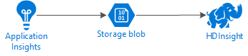
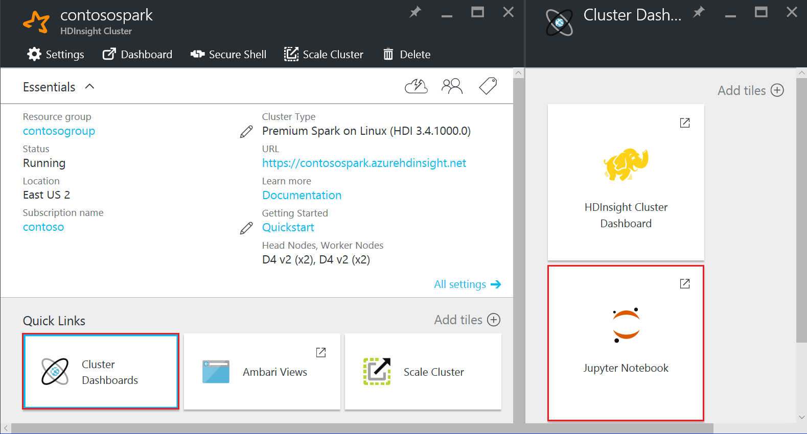

<properties
pageTitle="Analysieren der Anwendung Einblicke Protokolle mit Spark auf HDInsight | Microsoft Azure"
description="Informationen Sie zum Exportieren der Anwendung Einblicke Protokolle, um BLOB-Speicher, und klicken Sie dann die Protokolle mit Spark auf HDInsight analysieren."
services="hdinsight"
documentationCenter=""
authors="Blackmist"
manager="jhubbard"
editor="cgronlun"/>

<tags
ms.service="hdinsight"
ms.devlang="na"
ms.topic="article"
ms.tgt_pltfrm="na"
ms.workload="big-data"
ms.date="08/15/2016"
ms.author="larryfr"/>

# Analysieren Sie Anwendung Einsichten werden Protokolle mit Spark auf HDInsight

[Visual Studio-Anwendung Einsichten](../application-insights/app-insights-overview.md) ist ein Analytics-Dienst, der Ihre Webanwendungen überwacht. Werden Daten von Anwendung Einsichten generierte zu Azure-Speicher exportiert werden, und von dort aus können sie nach HDInsight analysiert werden.

In diesem Dokument erfahren Sie, wie HDInsight um Anwendung Einblicke werden Daten mithilfe von Apache Spark zu analysieren.

## Erforderliche Komponenten

* Ein Azure-Abonnement.

* Eine Anwendung, die Anwendung Einsichten konfiguriert ist. 

* Vertrautheit mit einen HDInsight Linux-basierten Cluster erstellen. Wenn Sie nicht bei der Erstellung eines Clusters vertraut sind, finden Sie weitere Informationen [Spark auf HDInsight zu erstellen](hdinsight-apache-spark-jupyter-spark-sql.md) .

    > [AZURE.NOTE] Dieses Dokument bietet eine exemplarische Vorgehensweise zum Erstellen eines neuen Clusters von nicht. Stattdessen verweist es auf andere Dokumente, die Informationen zum Erstellen von eines Clusters, der die werden Daten zugreifen können.

* Einem Webbrowser. Hiermit wird die interaktive Datenanalyse mithilfe eines Notizbuchs Jupyter ausführen.

Folgende wurden in entwickeln und Testen dieses Dokument verwendet:

* Anwendung Einsichten werden Daten wurde mithilfe einer [Node.js Web app, die so konfiguriert ist, verwenden Sie die Anwendung Einsichten](../application-insights/app-insights-nodejs.md)generiert.

* Eine Linux-basierten Spark auf HDInsight Clusterversion 3.4 verwendet wurde, die Daten zu analysieren.

## Architektur und Planung

Das folgende Diagramm veranschaulicht die Dienstarchitektur, der in diesem Beispiel wird:

### Azure-Speicher

Blockieren Blobs kann direkt von einem Konto Azure-Speicher auf ein HDInsight Cluster zugreifen und Anwendung Einsichten kann konfiguriert werden, um Informationen werden kontinuierlich in Blobs in Azure-Speicher zu exportieren. Es gibt jedoch einige Anforderungen, die Sie ausführen müssen:

* __Standort__: das Speicherkonto in derselben Region als HDInsight befinden soll. Dies verringert die Wartezeit beim Zugriff auf die Daten und vermieden werden sollten Sie den Ausgangs-Gebühren, die beim Verschieben von Daten zwischen Regionen auftreten.

* __BLOB-Typ__: HDInsight unterstützt nur Blobs blockieren. Anwendung Einsichten Standardeinstellungen bei der Verwendung von Blobs blockieren, sollten daher standardmäßig arbeiten mit HDInsight.

* __Zugriffsberechtigungen__: Wenn Sie das gleiche Speicherkonto für Anwendung Einsichten fortlaufender exportieren und HDInsights standardmäßigen Speicher verwenden, hat HDInsight Vollzugriff auf die Anwendung Einblicke werden Daten. Dies bedeutet, dass es möglich ist, werden Daten aus dem HDInsight Cluster löschen.

    In diesem Fall wird empfohlen, separaten Speicherkonten für HDInsight und Anwendung Einsichten werden, und [Verwenden von freigegebenen Access Signaturen (SAS) zum Einschränken des Zugriffs auf die Daten aus HDInsight](hdinsight-storage-sharedaccesssignature-permissions.md)zu verwenden. Mit einer SAS können Sie gewähren HDInsight schreibgeschützten Zugriff auf die Daten werden.

### Datenschema

Anwendung Einsichten stellt [Exportieren Datenmodell](../application-insights/app-insights-export-data-model.md) für das telemetrieprotokoll Datenformat in Blobs importiert werden. Verwenden Sie die Schritte in diesem Dokument Spark SQL für die Arbeit mit den Daten ein. Spark SQL können automatisch generieren ein Schema für den JSON-Datenstruktur angemeldet nach Anwendung Einblicken, sodass Sie nicht das Schema manuell zu definieren, wenn Analyse ausführen müssen.

## Exportieren von Daten werden

Folgen Sie den Schritten zum Konfigurieren Ihrer Anwendung Einsichten zum Exportieren von Informationen werden in einer Blob-Speicher Azure [Konfigurieren fortlaufender exportieren](../application-insights/app-insights-export-telemetry.md) .

## Konfigurieren von HDInsight, um die Daten zuzugreifen.

Verwenden Sie die Informationen in [Verwenden freigegebene Access Signaturen (SAS) zum Einschränken des Zugriffs auf die Daten aus HDInsight](hdinsight-storage-sharedaccesssignature-permissions.md) zu einem SAS für den Blob-Container erstellen, die die exportierte werden Daten enthält. Die SAS sollte schreibgeschützten Zugriff auf die Daten enthalten.

Das Dokument freigegeben Access Signatur erläutert, wie Sie den SAS-Speicher zu einem vorhandenen Linux-basierten HDInsight Cluster hinzufügen können. Darüber hinaus Informationen dazu, wie es beim Erstellen eines neuen HDInsight Clusters hinzufügen.

## Analysieren von Daten mithilfe von Python (PySpark)

1. Wählen Sie Ihre Spark auf HDInsight Cluster im [Azure-Portal](https://portal.azure.com)aus. Klicken Sie im Abschnitt __Quicklinks__ wählen Sie __Cluster Dashboards aus__, und wählen Sie dann aus dem Cluster Dashboard__ Blade __Jupyter Notizbuch__ .

    

2. Wählen Sie in der oberen rechten Ecke der Seite Jupyter __neu__, und klicken Sie dann auf __PySpark__aus. Dadurch wird eine neue Browserregisterkarte mit einer Python-basierten Jupyter Notizbuch geöffnet.

3. Geben Sie im ersten Feld (einer __Zelle__genannt) auf der Seite Folgendes ein:

        sc._jsc.hadoopConfiguration().set('mapreduce.input.fileinputformat.input.dir.recursive', 'true')

    Dies kann Spark rekursiv Zugriff auf die Verzeichnisstruktur für die Eingabedaten. Ein Verzeichnisstruktur ähnlich wie der folgende wird Anwendung Einsichten werden protokolliert:

        /{telemetry type}/YYYY-MM-DD/{##}/

4. Verwenden Sie __UMSCHALT + EINGABETASTE__ , um den Code ausgeführt werden. Klicken Sie auf der linken Seite der Zelle eine '\*' erscheinen zwischen den Klammern, um anzugeben, dass der Code in dieser Zelle ausgeführt wird. Sobald sie abgeschlossen ist, die '\*' ändert sich in eine Zahl und Ausgabe ähnlich der folgenden wird unterhalb der Zelle angezeigt werden:

        Creating SparkContext as 'sc'

        ID  YARN Application ID Kind    State   Spark UI    Driver log  Current session?
        3   application_1468969497124_0001  pyspark idle    Link    Link    ✔

        Creating HiveContext as 'sqlContext'
        SparkContext and HiveContext created. Executing user code ...

5. Eine neue Zelle wird unter der ersten erstellt wurden. Geben Sie Folgendes in die neue Zelle ein. Ersetzen Sie __CONTAINER__ und __STORAGEACCOUNT__ mit dem Kontonamen Azure-Speicher und die Namen der Blob-Container, die Sie beim Konfigurieren der Anwendung Einsichten fortlaufender exportieren verwendet.

        %%bash
        hdfs dfs -ls wasb://CONTAINER@STORAGEACCOUNT.blob.core.windows.net/
    
    Verwenden Sie __UMSCHALT + EINGABETASTE__ , um diese Zelle auszuführen. Es wird ein Ergebnis ähnlich wie der folgende angezeigt:

        Found 1 items
        drwxrwxrwx   -          0 1970-01-01 00:00 wasb://appinsights@contosostore.blob.core.windows.net/contosoappinsights_2bededa61bc741fbdee6b556571a4831
    
    Der Pfad Wasb zurückgegeben wird der Speicherort der Anwendung Einsichten werden Daten. Ändern der `hdfs dfs -ls` Zeile in der Zelle, den zurückgegeben Wasb Pfad zu verwenden, und verwenden Sie dann __UMSCHALT + EINGABETASTE__ , um die Zelle erneut ausführen. Diesmal sollten Ergebnisse die Verzeichnisse angezeigt, die werden Daten enthalten.

    > [AZURE.NOTE] Für den Rest der Schritte in diesem Abschnitt der `wasb://appinsights@contosostore.blob.core.windows.net/contosoappinsights_{ID}/Requests` Verzeichnis verwendet wurde. Dieses Verzeichnis möglicherweise nicht vorhanden, es sei denn, Ihre Daten werden für eine Web app. Wenn Sie werden Daten verwenden, die nicht in ein Verzeichnis Anfragen enthalten ist, wählen Sie ein anderes Verzeichnis aus, und passen Sie die restlichen Schritte zur Behandlung dieses Verzeichnis und das Schema für die darin enthaltenen gespeicherten Daten.

6. Geben Sie in der nächsten Zelle Folgendes ein. Ersetzen Sie __WASB\_Pfad__ durch den Pfad aus dem vorherigen Schritt.

        jsonFiles = sc.textFile('WASB_PATH')
        jsonData = sqlContext.read.json(jsonFiles)

    Dies erstellt eine neue Dataframe aus den JSON-Dateien, die durch den Exportvorgang fortlaufender exportiert. Verwenden Sie __UMSCHALT + EINGABETASTE__ , um diese Zelle auszuführen.

7. Klicken Sie in der nächsten Zelle Geben Sie ein, und führen Sie vor, um das Schema anzeigen möchten, das Spark für die JSON-Dateien erstellt:

        jsonData.printSchema()
    
    Das Schema für jede Art von werden werden verschiedene. Im folgenden werden das Schema, die für das Webanfragen generiert wird (in gespeicherten Daten die `Requests` Unterverzeichnis):

        root
        |-- context: struct (nullable = true)
        |    |-- application: struct (nullable = true)
        |    |    |-- version: string (nullable = true)
        |    |-- custom: struct (nullable = true)
        |    |    |-- dimensions: array (nullable = true)
        |    |    |    |-- element: string (containsNull = true)
        |    |    |-- metrics: array (nullable = true)
        |    |    |    |-- element: string (containsNull = true)
        |    |-- data: struct (nullable = true)
        |    |    |-- eventTime: string (nullable = true)
        |    |    |-- isSynthetic: boolean (nullable = true)
        |    |    |-- samplingRate: double (nullable = true)
        |    |    |-- syntheticSource: string (nullable = true)
        |    |-- device: struct (nullable = true)
        |    |    |-- browser: string (nullable = true)
        |    |    |-- browserVersion: string (nullable = true)
        |    |    |-- deviceModel: string (nullable = true)
        |    |    |-- deviceName: string (nullable = true)
        |    |    |-- id: string (nullable = true)
        |    |    |-- osVersion: string (nullable = true)
        |    |    |-- type: string (nullable = true)
        |    |-- location: struct (nullable = true)
        |    |    |-- city: string (nullable = true)
        |    |    |-- clientip: string (nullable = true)
        |    |    |-- continent: string (nullable = true)
        |    |    |-- country: string (nullable = true)
        |    |    |-- province: string (nullable = true)
        |    |-- operation: struct (nullable = true)
        |    |    |-- name: string (nullable = true)
        |    |-- session: struct (nullable = true)
        |    |    |-- id: string (nullable = true)
        |    |    |-- isFirst: boolean (nullable = true)
        |    |-- user: struct (nullable = true)
        |    |    |-- anonId: string (nullable = true)
        |    |    |-- isAuthenticated: boolean (nullable = true)
        |-- internal: struct (nullable = true)
        |    |-- data: struct (nullable = true)
        |    |    |-- documentVersion: string (nullable = true)
        |    |    |-- id: string (nullable = true)
        |-- request: array (nullable = true)
        |    |-- element: struct (containsNull = true)
        |    |    |-- count: long (nullable = true)
        |    |    |-- durationMetric: struct (nullable = true)
        |    |    |    |-- count: double (nullable = true)
        |    |    |    |-- max: double (nullable = true)
        |    |    |    |-- min: double (nullable = true)
        |    |    |    |-- sampledValue: double (nullable = true)
        |    |    |    |-- stdDev: double (nullable = true)
        |    |    |    |-- value: double (nullable = true)
        |    |    |-- id: string (nullable = true)
        |    |    |-- name: string (nullable = true)
        |    |    |-- responseCode: long (nullable = true)
        |    |    |-- success: boolean (nullable = true)
        |    |    |-- url: string (nullable = true)
        |    |    |-- urlData: struct (nullable = true)
        |    |    |    |-- base: string (nullable = true)
        |    |    |    |-- hashTag: string (nullable = true)
        |    |    |    |-- host: string (nullable = true)
        |    |    |    |-- protocol: string (nullable = true)

8. Verwenden Sie die folgenden Registrieren der Dataframe als eine temporäre Tabelle, und führen Sie eine Abfrage für die Daten ein:

        jsonData.registerTempTable("requests")
        sqlContext.sql("select context.location.city from requests where context.location.city is not null")

    Diese Abfrage zurückgegeben werden kann die Ortsangaben für die oberen 20 Einträge, in dem kein context.location.city null.

    > [AZURE.NOTE] Die Kontextstruktur ist in alle werden durch die Anwendung Einsichten angemeldet vorhanden; Das Element Ort kann jedoch nicht in Ihrer Protokollen ausgefüllt werden. Verwenden Sie das Schema, um andere Elemente, die Sie Abfragen können zu identifizieren, die Daten für die Protokolle enthalten möglicherweise.

    Diese Abfrage gibt Informationen ähnlich wie der folgende zurück:

        +---------+
        |     city|
        +---------+
        | Bellevue|
        |  Redmond|
        |  Seattle|
        |Charlotte|
        ...
        +---------+

## Analysieren von Daten mithilfe von Scala

1. Wählen Sie Ihre Spark auf HDInsight Cluster im [Azure-Portal](https://portal.azure.com)aus. Klicken Sie im Abschnitt __Quicklinks__ wählen Sie __Cluster Dashboards aus__, und wählen Sie dann aus dem Cluster Dashboard__ Blade __Jupyter Notizbuch__ .

    

2. Wählen Sie in der oberen rechten Ecke der Seite Jupyter __neu__, und klicken Sie dann auf __Scala__aus. Dadurch wird eine neue Browserregisterkarte mit einer Scala-basierten Jupyter Notizbuch geöffnet.

3. Geben Sie im ersten Feld (einer __Zelle__genannt) auf der Seite Folgendes ein:

        sc.hadoopConfiguration.set("mapreduce.input.fileinputformat.input.dir.recursive", "true")

    Dies kann Spark rekursiv Zugriff auf die Verzeichnisstruktur für die Eingabedaten. Ein Verzeichnisstruktur ähnlich wie der folgende wird Anwendung Einsichten werden protokolliert:

        /{telemetry type}/YYYY-MM-DD/{##}/

4. Verwenden Sie __UMSCHALT + EINGABETASTE__ , um den Code ausgeführt werden. Klicken Sie auf der linken Seite der Zelle eine '\*' erscheinen zwischen den Klammern, um anzugeben, dass der Code in dieser Zelle ausgeführt wird. Sobald sie abgeschlossen ist, die '\*' ändert sich in eine Zahl und Ausgabe ähnlich der folgenden wird unterhalb der Zelle angezeigt werden:

        Creating SparkContext as 'sc'

        ID  YARN Application ID Kind    State   Spark UI    Driver log  Current session?
        3   application_1468969497124_0001  spark   idle    Link    Link    ✔

        Creating HiveContext as 'sqlContext'
        SparkContext and HiveContext created. Executing user code ...

5. Eine neue Zelle wird unter der ersten erstellt wurden. Geben Sie Folgendes in die neue Zelle ein. Ersetzen Sie __CONTAINER__ und __STORAGEACCOUNT__ mit dem Kontonamen Azure-Speicher und die Namen der Blob-Container, die Sie beim Konfigurieren der Anwendung Einsichten fortlaufender exportieren verwendet.

        %%bash
        hdfs dfs -ls wasb://CONTAINER@STORAGEACCOUNT.blob.core.windows.net/
    
    Verwenden Sie __UMSCHALT + EINGABETASTE__ , um diese Zelle auszuführen. Es wird ein Ergebnis ähnlich wie der folgende angezeigt:

        Found 1 items
        drwxrwxrwx   -          0 1970-01-01 00:00 wasb://appinsights@contosostore.blob.core.windows.net/contosoappinsights_2bededa61bc741fbdee6b556571a4831
    
    Der Pfad Wasb zurückgegeben wird der Speicherort der Anwendung Einsichten werden Daten. Ändern der `hdfs dfs -ls` Zeile in der Zelle, den zurückgegeben Wasb Pfad zu verwenden, und verwenden Sie dann __UMSCHALT + EINGABETASTE__ , um die Zelle erneut ausführen. Diesmal sollten Ergebnisse die Verzeichnisse angezeigt, die werden Daten enthalten.

    > [AZURE.NOTE] Für den Rest der Schritte in diesem Abschnitt der `wasb://appinsights@contosostore.blob.core.windows.net/contosoappinsights_{ID}/Requests` Verzeichnis verwendet wurde. Dieses Verzeichnis möglicherweise nicht vorhanden, es sei denn, Ihre Daten werden für eine Web app. Wenn Sie werden Daten verwenden, die nicht in ein Verzeichnis Anfragen enthalten ist, wählen Sie ein anderes Verzeichnis aus, und passen Sie die restlichen Schritte zur Behandlung dieses Verzeichnis und das Schema für die darin enthaltenen gespeicherten Daten.

6. Geben Sie in der nächsten Zelle Folgendes ein. Ersetzen Sie __WASB\_Pfad__ durch den Pfad aus dem vorherigen Schritt.

        jsonFiles = sc.textFile('WASB_PATH')
        jsonData = sqlContext.read.json(jsonFiles)

    Dies erstellt eine neue Dataframe aus den JSON-Dateien, die durch den Exportvorgang fortlaufender exportiert. Verwenden Sie __UMSCHALT + EINGABETASTE__ , um diese Zelle auszuführen.

7. Klicken Sie in der nächsten Zelle Geben Sie ein, und führen Sie vor, um das Schema anzeigen möchten, das Spark für die JSON-Dateien erstellt:

        jsonData.printSchema
    
    Das Schema für jede Art von werden werden verschiedene. Im folgenden werden das Schema, die für das Webanfragen generiert wird (in gespeicherten Daten die `Requests` Unterverzeichnis):

        root
        |-- context: struct (nullable = true)
        |    |-- application: struct (nullable = true)
        |    |    |-- version: string (nullable = true)
        |    |-- custom: struct (nullable = true)
        |    |    |-- dimensions: array (nullable = true)
        |    |    |    |-- element: string (containsNull = true)
        |    |    |-- metrics: array (nullable = true)
        |    |    |    |-- element: string (containsNull = true)
        |    |-- data: struct (nullable = true)
        |    |    |-- eventTime: string (nullable = true)
        |    |    |-- isSynthetic: boolean (nullable = true)
        |    |    |-- samplingRate: double (nullable = true)
        |    |    |-- syntheticSource: string (nullable = true)
        |    |-- device: struct (nullable = true)
        |    |    |-- browser: string (nullable = true)
        |    |    |-- browserVersion: string (nullable = true)
        |    |    |-- deviceModel: string (nullable = true)
        |    |    |-- deviceName: string (nullable = true)
        |    |    |-- id: string (nullable = true)
        |    |    |-- osVersion: string (nullable = true)
        |    |    |-- type: string (nullable = true)
        |    |-- location: struct (nullable = true)
        |    |    |-- city: string (nullable = true)
        |    |    |-- clientip: string (nullable = true)
        |    |    |-- continent: string (nullable = true)
        |    |    |-- country: string (nullable = true)
        |    |    |-- province: string (nullable = true)
        |    |-- operation: struct (nullable = true)
        |    |    |-- name: string (nullable = true)
        |    |-- session: struct (nullable = true)
        |    |    |-- id: string (nullable = true)
        |    |    |-- isFirst: boolean (nullable = true)
        |    |-- user: struct (nullable = true)
        |    |    |-- anonId: string (nullable = true)
        |    |    |-- isAuthenticated: boolean (nullable = true)
        |-- internal: struct (nullable = true)
        |    |-- data: struct (nullable = true)
        |    |    |-- documentVersion: string (nullable = true)
        |    |    |-- id: string (nullable = true)
        |-- request: array (nullable = true)
        |    |-- element: struct (containsNull = true)
        |    |    |-- count: long (nullable = true)
        |    |    |-- durationMetric: struct (nullable = true)
        |    |    |    |-- count: double (nullable = true)
        |    |    |    |-- max: double (nullable = true)
        |    |    |    |-- min: double (nullable = true)
        |    |    |    |-- sampledValue: double (nullable = true)
        |    |    |    |-- stdDev: double (nullable = true)
        |    |    |    |-- value: double (nullable = true)
        |    |    |-- id: string (nullable = true)
        |    |    |-- name: string (nullable = true)
        |    |    |-- responseCode: long (nullable = true)
        |    |    |-- success: boolean (nullable = true)
        |    |    |-- url: string (nullable = true)
        |    |    |-- urlData: struct (nullable = true)
        |    |    |    |-- base: string (nullable = true)
        |    |    |    |-- hashTag: string (nullable = true)
        |    |    |    |-- host: string (nullable = true)
        |    |    |    |-- protocol: string (nullable = true)

8. Verwenden Sie die folgenden Registrieren der Dataframe als eine temporäre Tabelle, und führen Sie eine Abfrage für die Daten ein:

        jsonData.registerTempTable("requests")
        var city = sqlContext.sql("select context.location.city from requests where context.location.city is not null limit 10").show()

    Diese Abfrage zurückgegeben werden kann die Ortsangaben für die oberen 20 Einträge, in dem kein context.location.city null.

    > [AZURE.NOTE] Die Kontextstruktur ist in alle werden durch die Anwendung Einsichten angemeldet vorhanden; Das Element Ort kann jedoch nicht in Ihrer Protokollen ausgefüllt werden. Verwenden Sie das Schema, um andere Elemente, die Sie Abfragen können zu identifizieren, die Daten für die Protokolle enthalten möglicherweise.

    Diese Abfrage gibt Informationen ähnlich wie der folgende zurück:

        +---------+
        |     city|
        +---------+
        | Bellevue|
        |  Redmond|
        |  Seattle|
        |Charlotte|
        ...
        +---------+

## Nächste Schritte

Weitere Beispiele für Spark für die Arbeit mit Daten und Dienste in Azure verwenden finden Sie unter den folgenden Dokumenten:

* [Spark mit BI: Ausführen interaktiven Datenanalyse mithilfe von Spark in HDInsight mit BI-Tools](hdinsight-apache-spark-use-bi-tools.md)

* [Spark mit maschinellen Schulung: Verwenden Sie Spark in HDInsight zum Analysieren von Gebäude Temperatur HKL-Daten verwenden](hdinsight-apache-spark-ipython-notebook-machine-learning.md)

* [Spark mit maschinellen Schulung: verwenden Spark in HDInsight Lebensmittel Prüfungsergebnissen Vorhersagen](hdinsight-apache-spark-machine-learning-mllib-ipython.md)

* [Spark Streaming: Verwenden Sie Spark in HDInsight zum Erstellen von in Echtzeit streaming Clientanwendungen](hdinsight-apache-spark-eventhub-streaming.md)

* [Website-Protokoll-Datenanalyse mithilfe von Spark in HDInsight](hdinsight-apache-spark-custom-library-website-log-analysis.md)

Informationen zum Erstellen und Ausführen von Programmen Spark finden Sie unter den folgenden Dokumenten:

* [Erstellen Sie eine eigenständige Anwendung Scala](hdinsight-apache-spark-create-standalone-application.md)

* [Führen Sie Aufträge Remote auf einem Spark Cluster Livius verwenden](hdinsight-apache-spark-livy-rest-interface.md)
