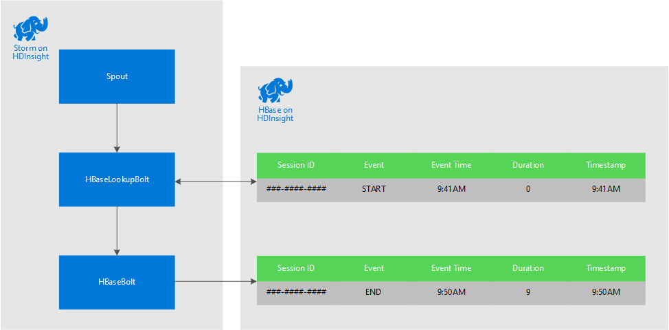

<properties
 pageTitle="Zuordnen von Ereignissen über einen Zeitraum mit Storm und HBase auf HDInsight"
 description="Informationen Sie zum Ereignisse zu koordinieren, die zu unterschiedlichen Zeiten eingehen mithilfe von Storm und HBase auf HDInsight."
 services="hdinsight"
 documentationCenter=""
 authors="Blackmist"
 manager="jhubbard"
 editor="cgronlun"
 tags="azure-portal"/>

<tags
 ms.service="hdinsight"
 ms.devlang="dotnet"
 ms.topic="article"
 ms.tgt_pltfrm="na"
 ms.workload="big-data"
 ms.date="10/27/2016"
 ms.author="larryfr"/>

# Zuordnen von Ereignissen über einen Zeitraum mit Storm und HBase auf HDInsight

Mithilfe eines beständigen Datenspeichers mit Apache Storm können Dateneingaben koordinieren, die zu unterschiedlichen Zeiten eintreffen. Verknüpfen beispielsweise anmelden und Abmelden Ereignisse für eine Sitzung Benutzer zu berechnen, wie lange die Sitzung dauerte.

In diesem Dokument erfahren Sie, wie Sie eine einfache C#-Storm Suchtopologie zu erstellen, die verfolgt anmelden und Abmelden Ereignisse für Benutzer Sitzungen und die Dauer der Sitzung berechnet. Der Suchtopologie verwendet HBase als beständigen Datenspeicher. HBase können auch Stapel Abfragen auf den zurückliegenden Daten zu weiteren Einsichten, z. B. wie viele Benutzer Sitzungen wurden gestartet oder beendet während eines bestimmten Zeitraums ausführen.

## Erforderliche Komponenten

- Visual Studio und die HDInsight Tools für Visual Studio: Installationsinformationen finden Sie unter [Erste Schritte mit der HDInsight-Tools für Visual Studio](../HDInsight/hdinsight-hadoop-visual-studio-tools-get-started.md) .

- Apache Storm auf HDInsight cluster (Windows-basiertem). Dadurch wird die Storm Suchtopologie, die eingehende Daten verarbeitet und speichert ihn in HBase ausgeführt.

    > [AZURE.IMPORTANT] Während der SCP.NET Topologien auf Linux-basierten Storm Cluster erstellt nach 10/28/2016 unterstützt werden, funktioniert das HBase SDK für .NET Paket verfügbar bis 10/28/2016 nicht richtig auf Linux.

- Apache HBase auf HDInsight Cluster (Linux oder Windows-basiertem). Dies ist der Datenspeicher für dieses Beispiel.

## Architektur

Abgleichen von Ereignissen erfordert einen allgemeinen Bezeichner für das Ereignisquelle. For example, Benutzer-ID, ID für eine Sitzung oder anderen Teil der Daten, die eine) eindeutigen und b) enthalten alle Daten, die an Storm gesendet werden. In diesem Beispiel wird einen GUID-Wert zur Darstellung einer Sitzung-ID an.

In diesem Beispiel besteht aus zwei HDInsight Cluster:

-   HBase: beständigen Datenspeicher für zurückliegende Daten

-   Storm: mit dem eingehende Daten einlesen

Die Daten von der Suchtopologie Storm zufällig generiert wird, und umfasst die folgenden Elemente:

-   ID für eine Sitzung: eine GUID, die identifiziert jede Sitzung

-   Ereignis: ein Start- oder Enddatum-Ereignis. In diesem Beispiel tritt beginnen immer vor Ende

-   : Die Uhrzeit des Ereignisses.

Diese Daten verarbeitet und in HBase gespeichert.

### Storm Suchtopologie

Wenn eine Sitzung gestartet wird, ein Ereignis **Starten** vom der Suchtopologie empfangen und in HBase protokolliert. Wenn ein Ereignis **Ende** eingeht, wird der Suchtopologie Ruft das Ereignis **Starten** und berechnet die Zeit zwischen den beiden folgenden Ereignisse. Dieser Wert für die **Dauer** wird dann zusammen mit den Ereignisinformationen **Ende** in HBase gespeichert.

> [AZURE.IMPORTANT] Während dieser Suchtopologie das grundlegende Muster veranschaulicht, müssen eine Lösung für die Herstellung übernehmen Entwurf für die folgenden Szenarien:
>
> - Empfangen von Reihenfolge Ereignisse
> - Ereignisse duplizieren
> - Gelöschte Ereignisse

Die Stichprobe Suchtopologie besteht aus den folgenden Komponenten:

-   Session.cs: simuliert eine Sitzung des Benutzers, indem Sie eine zufällige Sitzung-ID, starten Sie Zeit, und wie lange die Sitzung dauert erstellen

-   Spout.cs: erstellt 100 Sitzungen, gibt ein START-Ereignis aus, wartet das zufällige Timeout für jede Sitzung und gibt dann ein Ereignis beenden aus. Klicken Sie dann beendet archiviert Sitzungen, um neue zu generieren.

-   HBaseLookupBolt.cs: anhand die ID Sitzung Sitzungsinformationen aus HBase nachzuschlagen. Wenn ein Ereignis Ende verarbeitet wird, findet das entsprechende START-Ereignis und berechnet die Dauer der Sitzung.

-   HBaseBolt.cs: Speichert die Informationen in HBase.

-   TypeHelper.cs: Datentypkonvertierung beim Lesen von / Schreiben in HBase erleichtert.

### HBase schema

In HBase werden die Daten in einer Tabelle mit den folgenden Schema-Einstellungen gespeichert:

-   Zeilenschlüssel: die Sitzung-ID als Schlüssel für Zeilen in dieser Tabelle verwendet wird.

-   Spalte Familie: der Familienname ist 'Cf'. Spalten, die in dieser Familie gespeichert sind:

    -   Ereignis: Anfang oder Ende

    -   Zeit: die Zeit in Millisekunden, die das Ereignis aufgetreten ist.

    -   Dauer: die Länge zwischen Start- und Ereignis

-   Versionen: die Familie 'Cf' festgelegt ist jede Zeile 5-Versionen beibehalten

    > [AZURE.NOTE] Versionen, ein Protokoll der vorherigen Werte für eine bestimmte Zeilenschlüssel gespeichert sind. Standardmäßig gibt HBase nur den Wert für die neueste Version einer Zeile. In diesem Fall wird die gleiche Zeile für alle Ereignisse (Anfang, Ende.) verwendet, die jeder Version einer Zeile durch den Zeitstempelwert identifiziert wird. Dadurch entsteht eine zurückliegende Ansicht von Ereignissen für eine bestimmte ID angemeldet

## Herunterladen des Projekts

Das Beispielprojekt kann von [https://github.com/Azure-Samples/hdinsight-storm-dotnet-event-correlation](https://github.com/Azure-Samples/hdinsight-storm-dotnet-event-correlation)heruntergeladen werden.

Dieser Download enthält die folgenden C#-Projekte:

-   CorrelationTopology: C#-Storm Suchtopologie, die Start- und Ereignisse zufällig für Benutzer Sitzungen gibt. Jede Sitzung dauert zwischen 1 und 5 Minuten.

-   SessionInfo: C#-Konsole Anwendung, die die HBase-Tabelle erstellt und stellt Beispielabfragen, um Informationen zu den Sitzungsdaten gespeicherten zurückzukehren.

## Erstellen Sie die Tabelle

1. Öffnen Sie das Projekt **SessionInfo** in Visual Studio.

2. Im- **Lösung-Explorer**mit der rechten Maustaste in des Projekts **SessionInfo** , und wählen Sie **Eigenschaften**aus.

    

3. Wählen Sie **Einstellungen**aus, und klicken Sie dann festlegen Sie die folgenden Werte:

    -   HBaseClusterURL: die URL zu Ihren Cluster HBase. Beispielsweise https://myhbasecluster.azurehdinsight.net

    -   HBaseClusterUserName: der Administrator/HTTP-Benutzerkonto für Ihren cluster

    -   HBaseClusterPassword: das Kennwort für das Benutzerkonto Administrator/HTTP

    -   HBaseTableName: der Name der Tabelle, die mit diesem Beispiel verwenden

    -   HBaseTableColumnFamily: Der Familie Spaltenname

    

5. Führen Sie die Lösung. Wenn Sie dazu aufgefordert werden, wählen Sie die 'c'-Taste zum Erstellen einer Tabelle im HBase Cluster enthalten sind.

## Erstellen und Bereitstellen der Suchtopologie Storm

1.  Öffnen Sie die **CorrelationTopology** -Lösung in Visual Studio.

2.  Klicken Sie im **Explorer Lösung**klicken Sie mit der rechten Maustaste auf **CorrelationTopology** Projekt, und wählen Sie Eigenschaften.

3.  Wählen Sie im Eigenschaftenfenster **Einstellungen** aus, und geben Sie die folgende Informationen. Die ersten 5 sollten die gleichen Werte vom **SessionInfo** Projekt verwendet:

    -   HBaseClusterURL: die URL zu Ihren Cluster HBase. Beispielsweise https://myhbasecluster.azurehdinsight.net

    -   HBaseClusterUserName: der Administrator/HTTP-Benutzerkonto für Ihren cluster

    -   HBaseClusterPassword: das Kennwort für das Benutzerkonto Administrator/HTTP

    -   HBaseTableName: der Name der Tabelle, die mit diesem Beispiel verwenden. Dies sollte den gleichen Tabellennamen wie im Projekt SessionInfo enthalten.

    -   HBaseTableColumnFamily: Der Familie Spaltenname. Dies sollte denselben Familie Spaltennamen als verwendete im Projekt SessionInfo enthalten.

    > [AZURE.IMPORTANT] Ändern Sie die HBaseTableColumnNames nicht, wie die Standardeinstellungen die Namen von **SessionInfo** zum Abrufen von Daten verwendet werden.

4.  Speichern Sie die Eigenschaften, und erstellen Sie das Projekt.

5.  Klicken Sie im **Explorer Lösung**klicken Sie mit der rechten Maustaste auf das Projekt, und wählen Sie **senden, um Storm auf HDInsight**. Wenn Sie dazu aufgefordert werden, geben Sie die Anmeldeinformationen für Ihr Abonnement Azure ein.

    

6.  Wählen Sie im Dialogfeld **Suchtopologie übermitteln** Storm Cluster, der diese Suchtopologie ausgeführt werden, wird ein.

    > [AZURE.NOTE] Beim ersten Übermitteln von einer Suchtopologie, kann es zum Abrufen des Namens der HDInsight Cluster einige Sekunden dauern.

7.  Nachdem der Suchtopologie hochgeladen und zum Cluster gesendet wurde, wird der **Storm Suchtopologie Ansicht** öffnen und Anzeigen der Suchtopologie ausgeführt. Wählen Sie die **CorrelationTopology** aus, und verwenden Sie die Aktualisierungsschaltfläche oben rechts auf der Seite, die Suchtopologie Informationen zu aktualisieren.

    

    Zu Beginn der Suchtopologie Generieren von Daten ist, wird der Wert in der Spalte **Emitted** erhöht.

    > [AZURE.NOTE] Wenn der **Storm Suchtopologie Ansicht** nicht automatisch geöffnet wird, gehen Sie folgendermaßen vor, um ihn zu öffnen:
    >
    > 1. Im **Explorer Lösung**erweitern Sie **Azure**, und klicken Sie dann **HDInsight**.
    >
    > 2. Klicken Sie mit der rechten Maustaste auf Storm Cluster, den der Suchtopologie ausgeführt wird, klicken Sie auf, und wählen Sie dann auf **View Storm Topologien**

## Abfragen von Daten

Nachdem Daten ausgegeben wurde hat, gehen Sie folgendermaßen vor, die Daten Abfragen.

1. Zurück zum Projekt **SessionInfo** . Wenn nicht ausgeführt wird, starten Sie eine neue Instanz von ihm.

2. Wenn Sie dazu aufgefordert werden, wählen Sie **s** zu suchenden START-Ereignis aus. Nur Ereignisse zwischen diesen zwei Zeiten werden Sie aufgefordert werden, geben Sie eine Start- und Zeit zum Definieren eines Zeitraums - zurückgegeben werden.

    Verwenden Sie das folgende Format ein, wenn Sie die Start- und Endzeiten eingeben: hh: mm und 'Suche' oder 'Uhr'. Zum Beispiel 11:20 Uhr.

    Da der Suchtopologie gerade gestartet wurde, verwenden Sie eine Anfangszeit aus, bevor sie bereitgestellt wurde, und eine Endzeit jetzt. Dies sollte die meisten START Ereignisse erfassen, die generiert wurden, wenn er gestartet. Wenn die Abfrage ausgeführt wird, sollten Sie eine Liste der Einträge ähnlich wie der folgende finden Sie unter:

        Session e6992b3e-79be-4991-afcf-5cb47dd1c81c started at 6/5/2015 6:10:15 PM. Timestamp = 1433527820737

Suchen nach Ende Ereignissen funktioniert START Ereignisse entspricht. Ende Ereignisse sind jedoch zufällig zwischen 1 und 5 Minuten nach dem START-Ereignis generiert. Daher müssen Sie möglicherweise einige Zeitbereiche versuchen, um die Ende Ereignisse zu suchen. Ende-Ereignisse enthält auch die Dauer der Sitzung - der Unterschied zwischen dem Ereignis beginnt und das Ereignis endet. Hier ist ein Beispiel für Daten für Ende Ereignisse ein:

    Session fc9fa8e6-6892-4073-93b3-a587040d892e lasted 2 minutes, and ended at 6/5/2015 6:12:15 PM

> [AZURE.NOTE] Während der eingegebener Zeitwerte lokale Zeit ausführen, werden die von der Abfrage zurückgegebenen UTC.

##Beenden der Suchtopologie

Wenn Sie zum Beenden der Suchtopologie bereit sind, kehren Sie zu der **CorrelationTopology** Projekt in Visual Studio zurück. Klicken Sie in der **Storm Suchtopologie anzeigen**wählen Sie aus der Suchtopologie, und verwenden Sie dann die Schaltfläche " **Abbrechen** " am oberen Rand der Suchtopologie Ansicht.

##Löschen Sie Ihren cluster

[AZURE.INCLUDE [delete-cluster-warning](../../includes/hdinsight-delete-cluster-warning.md)]

##Nächste Schritte

Weitere Beispiele für Storm finden Sie unter [Beispiel Topologien für Storm auf HDInsight](hdinsight-storm-example-topology.md).
 
