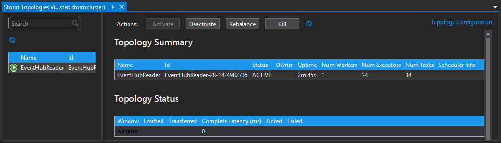

<properties
   pageTitle="Verarbeiten von Ereignis Hubs mit Storm auf HDInsight Ereignisse | Microsoft Azure"
   description="Informationen Sie zum Verarbeiten von Ereignis Hubs Daten mit einer C#-Storm Suchtopologie in Visual Studio mit den HDInsight Tools für Visual Studio erstellt."
   services="hdinsight,notification hubs"
   documentationCenter=""
   authors="Blackmist"
   manager="jhubbard"
   editor="cgronlun"/>

<tags
   ms.service="hdinsight"
   ms.devlang="dotnet"
   ms.topic="article"
   ms.tgt_pltfrm="na"
   ms.workload="big-data"
   ms.date="10/27/2016"
   ms.author="larryfr"/>

# Verarbeiten von Ereignissen aus Azure Ereignis Hubs mit Storm auf HDInsight (c#)

Azure Ereignis Hubs können Sie große Datenmengen von Websites, apps und Geräte verarbeiten. Das Ereignis Hubs Schnauze macht ihn benutzerfreundliche Apache Storm auf HDInsight zum Analysieren der Daten in Echtzeit. Sie können Daten auch mithilfe der Ereignis Hubs herstellt an Ereignis Hubs von Storm schreiben.

In diesem Lernprogramm erfahren Sie, wie Sie mithilfe die Visual Studio-Vorlagen mit HDInsight Tools für Visual Studio installiert zwei Topologien erstellen, mit denen Azure Ereignis Hubs zusammenarbeiten.

* **EventHubWriter**: zufällig Daten generiert und in Ereignis Hubs geschrieben

* **EventHubReader**: Daten aus Ereignis Hubs gelesen und die Daten für die Protokolle Storm protokolliert

> [AZURE.NOTE] Während Sie die Schritte in diesem Dokument auf einem Windows-Entwicklungsumgebung mit Visual Studio verlassen, kann das kompilierte Projekt an einem Linux oder Windows-basierten HDInsight Cluster gesendet werden. Linux-basierten Cluster erstellt nur nach 10/28/2016 Support SCP.NET Topologien.
>
> Wenn eine C#-Suchtopologie mit einem Linux-basierten Cluster verwenden möchten, müssen Sie das Paket Microsoft.SCP.Net.SDK NuGet verwendet wird, die das Projekt auf Version 0.10.0.6 oder höher aktualisieren. Die Version des Pakets muss auch die Hauptversion des Storm auf HDInsight installiert übereinstimmen. Beispielsweise Storm HDInsight Versionen 3.3 und 3.4 Storm Version verwenden 0.10.x, während HDInsight 3.5 Storm verwendet 1.0.x.
> 
> C#-Topologien auf Linux-basierten Cluster .NET 4.5 verwenden, und verwenden Mono für HDInsight Cluster ausgeführt. Die meisten Elemente funktionieren, jedoch auf der Sie das Dokument [Ein-Kompatibilität](http://www.mono-project.com/docs/about-mono/compatibility/) für mögliche Inkompatibilität überprüfen soll.
>
> Eine Java-Version des Projekts, die auch in einem Linux oder Windows-basierten Cluster funktionieren, finden Sie unter [Verarbeiten von Ereignissen aus Azure Ereignis Hubs mit Storm auf HDInsight (Java)](hdinsight-storm-develop-java-event-hub-topology.md).

## Erforderliche Komponenten

* Ein [Apache Storm auf HDInsight cluster](hdinsight-apache-storm-tutorial-get-started.md)

* Ein [Ereignis Azure-Hub](../event-hubs/event-hubs-csharp-ephcs-getstarted.md)

* Das [Azure .NET SDK](http://azure.microsoft.com/downloads/)

* Die [HDInsight-Tools für Visual Studio](hdinsight-hadoop-visual-studio-tools-get-started.md)

## Abgeschlossener Projekte

Sie können eine vollständige Version des Projekts erstellt, die in diesem Lernprogramm aus GitHub herunterladen: [Eventhub-Storm-Hybrid](https://github.com/Azure-Samples/hdinsight-dotnet-java-storm-eventhub). Jedoch müssen Sie weiterhin Konfiguration Einstellungen bereitstellen, indem Sie die Schritte in diesem Lernprogramm.

## Ereignis Hubs Schnauze und herstellt

Den Ereignis untergeordneten Servern spout und bolt sind Java-Komponenten, mit die Sie einfach mit Ereignis Hubs von Apache Storm arbeiten können. Obwohl diese Komponenten in Java geschrieben sind, können die HDInsight Tools für Visual Studio Sie Hybridtopologien erstellen, die C#- und Java-Komponenten gemeinsam verwendet werden.

Der Schnauze und umgewandelt werden als ein einzelnes Java (.jar) Archivdatei mit dem Namen **eventhubs-storm-spout-#.#-jar-with-dependencies.jar**, verteilt, wo #. # ist die Version der Datei.

### Die JAR-Datei nicht herunterladen

Die neueste Version der JAR-Datei ist im Projekt unter dem Ordner **Bibliothek/Eventhubs** [HDInsight Storm Beispiele](https://github.com/hdinsight/hdinsight-storm-examples) enthalten. Wenn Sie die Datei herunterladen möchten, verwenden Sie eine der folgenden Methoden.

> [AZURE.NOTE] Der Schnauze und herstellt wurden für die Einbeziehung in das Projekt Apache Storm übermittelt. Weitere Informationen finden Sie unter [STORM-583: Einchecken für Storm-Ereignis Hubs Ursprünglicher](https://github.com/apache/storm/pull/336/files) in GitHub.

* **Herunterladen eine ZIP-Datei**: von der Website [HDInsight Storm Beispiele](https://github.com/hdinsight/hdinsight-storm-examples) im rechten Bereich eine ZIP-Datei herunterladen, mit dem Projekt wählen **ZIP-herunterladen** .

    

    Nachdem die Datei heruntergeladen wurde, können Sie das Archiv extrahieren, und die Datei wird im Verzeichnis **Bibliothek** sein.

* **Klonen des Projekts**: Wenn Sie [Git](http://git-scm.com/) installiert haben, verwenden Sie den folgenden Befehl Repository lokal klonen, und suchen Sie die Datei im Verzeichnis **Bibliothek** dann.

        git clone https://github.com/hdinsight/hdinsight-storm-examples

## Konfigurieren von Ereignis Hubs

Hubs Ereignis ist die Datenquelle für dieses Beispiel. Verwenden Sie die Informationen im Abschnitt __Erstellen eines Ereignisses Hub__ des Dokuments [den ersten Schritten mit Hubs Ereignis](../event-hubs/event-hubs-csharp-ephcs-getstarted.md) aus.

3. Nach der Ereignis Hub erstellt wurde, zeigen Sie das Blade EventHub Azure-Portal an, und wählen Sie __freigegebene Access Richtlinien__. Verwenden Sie den Eintrag __+ Hinzufügen__ , um die folgenden Richtlinien hinzuzufügen:

  	| Namen | Berechtigungen |
  	| ----- | ----- |
  	| Autor | Senden |
  	| Reader | Abhören |

    

5. Wählen Sie die Richtlinien __Reader__ und __Autor__ aus. Kopieren Sie und speichern Sie den Wert der __PRIMÄRSCHLÜSSEL__ für beide Richtlinien, da diese später verwendet werden.

## Konfigurieren der EventHubWriter

1. Wenn Sie die neueste Version der HDInsight Tools für Visual Studio noch nicht installiert haben, finden Sie unter [Erste Schritte mit HDInsight Tools für Visual Studio](hdinsight-hadoop-visual-studio-tools-get-started.md).

2. Laden Sie die Lösung aus [Eventhub-Storm-Hybrid](https://github.com/Azure-Samples/hdinsight-dotnet-java-storm-eventhub)aus. Öffnen Sie die Lösung, und dauern Sie eine Weile, bis der Code für das Projekt __EventHubWriter__ aussehen.

4. Öffnen Sie im Projekt __EventHubWriter__ __der App__ aus. Verwenden Sie die Informationen aus dem Ereignis Hub Sie zuvor konfiguriert, um den Wert für die folgenden Schlüssel auszufüllen:

  	| Schlüssel | Wert |
  	| ----- | ----- |
  	| EventHubPolicyName | Autor (Wenn Sie einen anderen Namen verwendet haben, für die Richtlinie mit der Berechtigung _Senden_ , verwenden sie stattdessen.) |
  	| EventHubPolicyKey | Die Taste für die Richtlinie Autor |
  	| EventHubNamespace | Den Namespace, der Ihr Ereignis-Hub enthält |
  	| EventHubName | Ihr Name Ereignis Hub |
  	| EventHubPartitionCount | Die Anzahl der Partitionen in Ihrem Ereignis-Hub |

4. Speichern Sie und schließen Sie **die App** .

## Konfigurieren der EventHubReader

1. Öffnen Sie das Projekt __EventHubReader__ , und machen Sie ein paar Momoents über den Code aussehen.

2. Öffnen Sie die __App.config__ für die __EventHubWriter__ein. Verwenden Sie die Informationen aus dem Ereignis Hub Sie zuvor konfiguriert, um den Wert für die folgenden Schlüssel auszufüllen:

  	| Schlüssel | Wert |
  	| ----- | ----- |
  	| EventHubPolicyName | Reader (Wenn Sie einen anderen Namen verwendet haben, für die Richtlinie mit der Berechtigung _Abhören_ , stattdessen verwenden.) |
  	| EventHubPolicyKey | Die Taste für die Richtlinie reader |
  	| EventHubNamespace | Den Namespace, der Ihr Ereignis-Hub enthält |
  	| EventHubName | Ihr Name Ereignis Hub |
  	| EventHubPartitionCount | Die Anzahl der Partitionen in Ihrem Ereignis-Hub |

3. Speichern Sie und schließen Sie **die App** .

## Die Topologien bereitstellen

1. **Lösung Explorer**mit der rechten Maustaste in des Projekts **EventHubReader** und **Absenden an Storm auf HDInsight**wählen.

    

2. Wählen Sie auf dem Bildschirm **Suchtopologie senden** Ihrer **Storm Cluster**aus. Erweitern Sie **Zusätzliche Konfigurationen**, wählen Sie **Java Dateipfade** **...** und wählen Sie aus dem Verzeichnis, das die **eventhubs-storm-spout-0.9-jar-with-dependencies.jar** Datei enthält, die Sie zuvor heruntergeladen haben. Klicken Sie abschließend auf **Absenden**.

    

3. Wenn der Suchtopologie gesendet wurde, wird der **Storm Topologien Viewer** angezeigt. Wählen Sie im linken Bereich zum Anzeigen von Statistiken für die Suchtopologie der Suchtopologie **EventHubReader** aus. Derzeit sollte nichts geschehen werden, da noch keine Ereignisse zu Ereignis Hubs geschrieben wurden.

    

4. **Lösung Explorer**mit der rechten Maustaste in des Projekts **EventHubWriter** und **Absenden an Storm auf HDInsight**wählen.

2. Wählen Sie auf dem Bildschirm **Suchtopologie senden** Ihrer **Storm Cluster**aus. Erweitern Sie **Zusätzliche Konfigurationen**, wählen Sie **Java Dateipfade** **...** und wählen Sie aus dem Verzeichnis, das die **eventhubs-storm-spout-0.9-jar-with-dependencies.jar** Datei enthält, die Sie zuvor heruntergeladen haben. Klicken Sie abschließend auf **Absenden**.

5. Wenn der Suchtopologie wurde übermittelt, aktualisieren Sie die Liste der Suchtopologie im **Storm Topologien Viewer** zu überprüfen, ob die beiden Topologien im Cluster ausgeführt werden.

6. Wählen Sie im **Storm Topologien Viewer**der Suchtopologie **EventHubReader** ein.

4. Doppelklicken Sie in der Diagrammansicht auf die Komponente __LogBolt__ . Dadurch wird die __Komponente__ Zusammenfassungsseite für die herstellt geöffnet.

3. Wählen Sie im Abschnitt __Executors__ einen der Links in der Spalte __Ports__ aus. Dadurch wird von der Komponente protokollierten Informationen angezeigt. Die protokollierte Informationen ist ähnlich wie die folgende:

        2016-10-20 13:26:44.186 m.s.s.b.ScpNetBolt [INFO] Processing tuple: source: com.microsoft.eventhubs.spout.EventHubSpout:7, stream: default, id: {5769732396213255808=520853934697489134}, [{"deviceId":3,"deviceValue":1379915540}]
        2016-10-20 13:26:44.234 m.s.s.b.ScpNetBolt [INFO] Processing tuple: source: com.microsoft.eventhubs.spout.EventHubSpout:7, stream: default, id: {7154038361491319965=4543766486572976404}, [{"deviceId":3,"deviceValue":459399321}]
        2016-10-20 13:26:44.335 m.s.s.b.ScpNetBolt [INFO] Processing tuple: source: com.microsoft.eventhubs.spout.EventHubSpout:6, stream: default, id: {513308780877039680=-7571211415704099042}, [{"deviceId":5,"deviceValue":845561159}]
        2016-10-20 13:26:44.445 m.s.s.b.ScpNetBolt [INFO] Processing tuple: source: com.microsoft.eventhubs.spout.EventHubSpout:7, stream: default, id: {-2409895457033895206=5479027861202203517}, [{"deviceId":8,"deviceValue":2105860655}]

## Beenden Sie die Topologien

Zum Beenden der Topologies, wählen Sie jede Suchtopologie den **Storm Suchtopologie Viewer**, und klicken Sie auf **Abbrechen**.

## Löschen Sie Ihren cluster

[AZURE.INCLUDE [delete-cluster-warning](../../includes/hdinsight-delete-cluster-warning.md)]

## Notizen

### Geänderte

Die EventHubSpout regelmäßig Kontrollpunkten Zustand zum Knoten Zookeeper und dem speichert Anmeldeinformationen für den aktuellen Offset für Nachrichten aus der Warteschlange gelesen. Dadurch wird die Komponente mit dem Empfang von Nachrichten beim gespeicherten Offset in den folgenden Szenarien:

* Schlägt fehl, und die Instanz der Komponente ist neu gestartet.

* Sie vergrößert oder verkleinert wird den Cluster durch Hinzufügen oder Entfernen von Knoten.

* Der Suchtopologie wurde beendet und **mit demselben Namen**neu gestartet.

Sie können auch exportieren und importieren die dauerhaften Kontrollpunkten in WASB (den Azure-Speicher von Ihren Cluster HDInsight verwendet.) Die Skripts Zweck befinden sich die Storm auf HDInsight Cluster, am **c:\apps\dist\storm-0.9.3.2.2.1.0-2340\zkdatatool-1.0\bin**.

>[AZURE.NOTE] Die Versionsnummer in den Pfad möglicherweise unterschiedlich sein, wie die Version von Storm im Cluster installiert möglicherweise in der Zukunft ändern.

Die Skripts in diesem Verzeichnis sind:

* **stormmeta_import.cmd**: alle Storm Metadaten aus dem Cluster Standard-Speichercontainer in Zookeeper importieren.

* **stormmeta_export.cmd**: alle Storm Metadaten aus Zookeeper in der Cluster standardmäßige Speichercontainer exportieren.

* **stormmeta_delete.cmd**: alle Storm Metadaten aus Zookeeper löschen.

Exportieren ein Imports ermöglicht Ihnen Wissensstand Daten beibehalten werden, wenn Sie müssen Cluster löschen, aber die Verarbeitung von der aktuellen Offset im Hub fortsetzen, wenn Sie einen neuen Cluster wieder online schalten möchten.

> [AZURE.NOTE] Da die Daten in den standardmäßigen Speichercontainer beibehalten werden, die neue Cluster **muss** verwenden den gleichen Speicherkonto und den Container wie der vorherige Cluster.

## Nächste Schritte

In diesem Dokument, haben Sie erfahren, wie die Java Ereignis Hubs Spout und herstellt Nutzen aus einer Suchtopologie c# für die Arbeit mit Daten in Azure Ereignis Hub. Weitere Informationen zum Erstellen von C#-Topologien finden Sie hier.

* [Entwickeln Sie C#-Topologien für Apache Storm auf HDInsight mithilfe von Visual Studio](hdinsight-storm-develop-csharp-visual-studio-topology.md)

* [SCP programming guide](hdinsight-storm-scp-programming-guide.md)

* [Beispiel für Topologien für Storm auf HDInsight](hdinsight-storm-example-topology.md)
 
