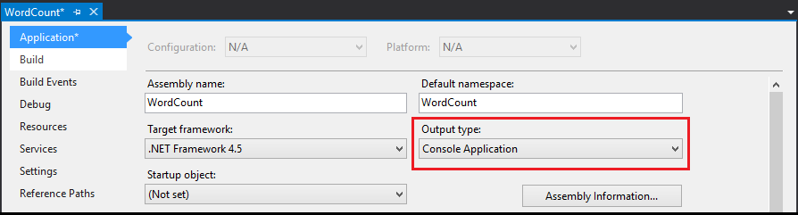

<properties
   pageTitle="Apache Storm Topologien mit Visual Studio und c# | Microsoft Azure"
   description="Informationen Sie zum Erstellen von Storm Topologien in c# durch Erstellen einer einfachen Word Count Suchtopologie in Visual Studio mit den HDInsight Tools für Visual Studio."
   services="hdinsight"
   documentationCenter=""
   authors="Blackmist"
   manager="jhubbard"
   editor="cgronlun"
   tags="azure-portal"/>

<tags
   ms.service="hdinsight"
   ms.devlang="java"
   ms.topic="article"
   ms.tgt_pltfrm="na"
   ms.workload="big-data"
   ms.date="10/27/2016"
   ms.author="larryfr"/>

# Entwickeln Sie C#-Topologien für Apache Storm auf HDInsight mit Hadoop-Tools für Visual Studio

Erfahren Sie, wie ein C#-Storm Suchtopologie mit den HDInsight-Tools für Visual Studio erstellen. In diesem Lernprogramm führt Sie durch das Verfahren zum Erstellen eines neuen Projekts von Storm in Visual Studio, es lokal testen und Bereitstellen auf ein Apache Ansturm auf HDInsight Cluster Einrichtungsschritte.

Sie können auch erfahren Sie, wie Hybridtopologien zu erstellen, DIE C# und Java-Komponenten verwenden.

> [AZURE.IMPORTANT] Während Sie die Schritte in diesem Dokument auf einem Windows-Entwicklungsumgebung mit Visual Studio verlassen, kann das kompilierte Projekt an einem Linux oder Windows-basierten HDInsight Cluster gesendet werden. Linux-basierten Cluster erstellt nur nach 10/28/2016 Support SCP.NET Topologien.
>
> Wenn eine C#-Suchtopologie mit einem Linux-basierten Cluster verwenden möchten, müssen Sie das Paket Microsoft.SCP.Net.SDK NuGet verwendet wird, die das Projekt auf Version 0.10.0.6 oder höher aktualisieren. Die Version des Pakets muss auch die Hauptversion des Storm auf HDInsight installiert übereinstimmen. Beispielsweise Storm HDInsight Versionen 3.3 und 3.4 Storm Version verwenden 0.10.x, während HDInsight 3.5 Storm verwendet 1.0.x.
> 
> C#-Topologien auf Linux-basierten Cluster .NET 4.5 verwenden, und verwenden Mono für HDInsight Cluster ausgeführt. Die meisten Elemente funktionieren, jedoch auf der Sie das Dokument [Ein-Kompatibilität](http://www.mono-project.com/docs/about-mono/compatibility/) für mögliche Inkompatibilität überprüfen soll.

## Erforderliche Komponenten

- Eine der folgenden Versionen von Visual Studio

    - Visual Studio 2012 mit [4 aktualisieren](http://www.microsoft.com/download/details.aspx?id=39305)

    - Visual Studio 2013 mit [4 aktualisieren](http://www.microsoft.com/download/details.aspx?id=44921) oder [Visual Studio-2013-Community](http://go.microsoft.com/fwlink/?LinkId=517284)

    - Visual Studio 2015 oder [Visual Studio 2015 Community](https://go.microsoft.com/fwlink/?LinkId=532606)

- Azure SDK 2.9.5 oder höher

- HDInsight Tools für Visual Studio: finden Sie unter [Erste Schritte mit HDInsight Tools für Visual Studio](hdinsight-hadoop-visual-studio-tools-get-started.md) zu installieren und konfigurieren die HDInsight-Tools für Visual Studio.

    > [AZURE.NOTE] HDInsight Tools für Visual Studio werden auf Visual Studio Express nicht unterstützt.

-   Apache Storm auf HDInsight Cluster: finden Sie unter [Erste Schritte mit Apache Storm auf HDInsight](hdinsight-apache-storm-tutorial-get-started.md) , für die Schritte zum Erstellen eines Clusters.

## Vorlagen

Die HDInsight-Tools für Visual Studio bieten die folgenden Vorlagen::

| Projekttyp | Veranschaulicht |
| ------------ | ------------- |
| Storm-Anwendung | Ein leeres Storm Suchtopologie Projekt |
| Beispiel für Storm SQL Azure-Autor | So schreiben Sie mit Azure SQL-Datenbank |
| Beispiel für Storm DocumentDB Reader | Das Lesen aus Azure DocumentDB |
| Beispiel für Storm DocumentDB Autor | So schreiben Sie Azure DocumentDB |
| Beispiel für Storm EventHub Reader | Das Lesen aus Azure Ereignis Hubs |
| Beispiel für Storm EventHub Autor | So schreiben Sie Azure Ereignis Hubs |
| Beispiel für Storm HBase Reader | Zum Lesen von HBase auf HDInsight Cluster |
| Beispiel für Storm HBase Autor | So schreiben Sie HBase auf HDInsight Cluster |
| Storm Hybrid Stichprobe | So verwenden Sie eine Java-Komponente |
| Storm Stichprobe | Eine grundlegende Word Count Suchtopologie |

> [AZURE.NOTE] Die HBase Reader und Autor Beispiele verwenden die HBase REST-API zur Kommunikation mit einer HBase auf HDInsight Cluster, nicht die HBase Java-API.

In den Schritten in diesem Dokument verwenden Sie den grundlegenden Storm Project Anwendungstyp zum Erstellen einer neuen Suchtopologie.

## Erstellen einer C#-Suchtopologie

1. Wenn Sie die neueste Version der HDInsight Tools für Visual Studio noch nicht installiert haben, finden Sie unter [Erste Schritte mit HDInsight Tools für Visual Studio](hdinsight-hadoop-visual-studio-tools-get-started.md).

2. Öffnen Sie Visual Studio, und wählen Sie die **Datei** > **neu**, und klicken Sie dann auf **Projekt**.

3. Wählen Sie im Fenster **Neues Projekt** erweitern **installierte** > **Vorlagen**, und wählen **HDInsight**. Wählen Sie aus der Liste der Vorlagen **Storm Anwendung**ein. Am unteren Rand des Bildschirms Geben Sie den Namen der Anwendung **WordCount** .

    

4. Nachdem das Projekt erstellt wurde, sollten Sie die folgenden Dateien haben:

    - **Program.cs**: Hiermit wird der Suchtopologie für ein Projekt definiert. Beachten Sie, dass ein Suchtopologie Standard, der eine Schnauze und eine herstellt besteht, standardmäßig erstellt wird.

    - **Spout.cs**: ein Beispiel Schnauze, die Zufallszahlen gibt aus.

    - **Bolt.cs**: ein Beispiel herstellt, die Anzahl der Zahlen, die von der Schnauze ausgegeben wird.

    Als Teil des Projekts erstellen werden die neuesten [SCP.NET Pakete](https://www.nuget.org/packages/Microsoft.SCP.Net.SDK/) von NuGet heruntergeladen werden.

    [AZURE.INCLUDE [scp.net version important](../../includes/hdinsight-storm-scpdotnet-version.md)]

In den nächsten Abschnitten ändern Sie dieses Projekt in einer einfachen WordCount-Anwendung.

### Implementieren der Schnauze

1. Öffnen Sie **Spout.cs**. Spouts werden verwendet, um die Daten in einer Suchtopologie aus einer externen Quelle zu lesen. Die Hauptkomponenten für eine Schnauze sind:

    - **NextTuple**: Sprachen aufgerufen wird, wenn der Schnauze zum neuen Tupel ausgeben zulässig ist.

    - **Bestätigung** (Transaktionen Suchtopologie): verarbeitet Empfangsbestätigungen initiiert von anderen Komponenten in der Suchtopologie für Tupel aus diesem Schnauze gesendet. Bestätigen eines Tupels ermöglicht der Schnauze wissen, dass sie von Downstreamkomponenten erfolgreich verarbeitet wurde.

    - **Möglicher Fehler** (Transaktionen Suchtopologie): verarbeitet Tupel, die andere unsichere Komponenten in die Suchtopologie Fail-Verarbeitung sind. Dies bietet Ihnen die Möglichkeit zum Tupels ausgeben erneut, damit es erneut verarbeitet werden kann.

2. Ersetzen Sie den Inhalt der Klasse **Spout** durch den folgenden Code ein. Dies erstellt eine Schnauze, die zufällig eines Satzes in der Suchtopologie gibt aus.

        private Context ctx;
        private Random r = new Random();
        string[] sentences = new string[] {
            "the cow jumped over the moon",
            "an apple a day keeps the doctor away",
            "four score and seven years ago",
            "snow white and the seven dwarfs",
            "i am at two with nature"
        };

        public Spout(Context ctx)
        {
            // Set the instance context
            this.ctx = ctx;

            Context.Logger.Info("Generator constructor called");

            // Declare Output schema
            Dictionary<string, List<Type>> outputSchema = new Dictionary<string, List<Type>>();
            // The schema for the default output stream is
            // a tuple that contains a string field
            outputSchema.Add("default", new List<Type>() { typeof(string) });
            this.ctx.DeclareComponentSchema(new ComponentStreamSchema(null, outputSchema));
        }

        // Get an instance of the spout
        public static Spout Get(Context ctx, Dictionary<string, Object> parms)
        {
            return new Spout(ctx);
        }

        public void NextTuple(Dictionary<string, Object> parms)
        {
            Context.Logger.Info("NextTuple enter");
            // The sentence to be emitted
            string sentence;

            // Get a random sentence
            sentence = sentences[r.Next(0, sentences.Length - 1)];
            Context.Logger.Info("Emit: {0}", sentence);
            // Emit it
            this.ctx.Emit(new Values(sentence));

            Context.Logger.Info("NextTuple exit");
        }

        public void Ack(long seqId, Dictionary<string, Object> parms)
        {
            // Only used for transactional topologies
        }

        public void Fail(long seqId, Dictionary<string, Object> parms)
        {
            // Only used for transactional topologies
        }
    
    Betrachten Sie wir die Kommentare zu verstehen, was bedeutet, dass dieser Code durchlesen.

### Implementieren der Schrauben

1. Löschen Sie die vorhandene **Bolt.cs** -Datei aus dem Projekt aus.

2. Klicken Sie im **Explorer Lösung**, mit der rechten Maustaste in des Projekts, und wählen Sie **Hinzufügen** > **Neues Element**. Klicken Sie in der Liste Wählen Sie **Storm herstellt**, und geben Sie **Splitter.cs** als Namen. Wiederholen Sie hier, um eine zweite bolt benannten **Counter.cs**erstellen.

    - **Splitter.cs**: implementiert einen umgewandelt, die einzelne Wörter, Sätze teilt und gibt einen neuen Stream Wörter aus.

    - **Counter.cs**: implementiert einen umgewandelt, die zählt jedes Wort, und gibt einen neuen Stream von Wörtern und die Anzahl für jedes Worts aus.

    > [AZURE.NOTE] Diese Schrauben einfach zu lesen und Schreiben von Streams, aber Sie können auch einen an der Kommunikation mit Datenquellen wie eine Datenbank oder einen bestimmten Dienst verwenden.

3. Öffnen Sie **Splitter.cs**. Beachten Sie, dass sie nur eine Methode standardmäßig hat: **Ausführen**. Wird aufgerufen, wenn die an ein Tupels für die Verarbeitung empfängt. Sie können hier lesen verarbeiten Tupel eingehende und ausgehende Tupel ausgeben.

4. Ersetzen Sie den Inhalt der Klasse **Teiler** mit den folgenden Code ein:

        private Context ctx;

        // Constructor
        public Splitter(Context ctx)
        {
            Context.Logger.Info("Splitter constructor called");
            this.ctx = ctx;

            // Declare Input and Output schemas
            Dictionary<string, List<Type>> inputSchema = new Dictionary<string, List<Type>>();
            // Input contains a tuple with a string field (the sentence)
            inputSchema.Add("default", new List<Type>() { typeof(string) });
            Dictionary<string, List<Type>> outputSchema = new Dictionary<string, List<Type>>();
            // Outbound contains a tuple with a string field (the word)
            outputSchema.Add("default", new List<Type>() { typeof(string) });
            this.ctx.DeclareComponentSchema(new ComponentStreamSchema(inputSchema, outputSchema));
        }

        // Get a new instance of the bolt
        public static Splitter Get(Context ctx, Dictionary<string, Object> parms)
        {
            return new Splitter(ctx);
        }

        // Called when a new tuple is available
        public void Execute(SCPTuple tuple)
        {
            Context.Logger.Info("Execute enter");

            // Get the sentence from the tuple
            string sentence = tuple.GetString(0);
            // Split at space characters
            foreach (string word in sentence.Split(' '))
            {
                Context.Logger.Info("Emit: {0}", word);
                //Emit each word
                this.ctx.Emit(new Values(word));
            }

            Context.Logger.Info("Execute exit");
        }

    Betrachten Sie wir die Kommentare zu verstehen, was bedeutet, dass dieser Code durchlesen.

5. Öffnen Sie **Counter.cs** , und Ersetzen Sie den Inhalt der Klasse durch Folgendes:

        private Context ctx;

        // Dictionary for holding words and counts
        private Dictionary<string, int> counts = new Dictionary<string, int>();

        // Constructor
        public Counter(Context ctx)
        {
            Context.Logger.Info("Counter constructor called");
            // Set instance context
            this.ctx = ctx;

            // Declare Input and Output schemas
            Dictionary<string, List<Type>> inputSchema = new Dictionary<string, List<Type>>();
            // A tuple containing a string field - the word
            inputSchema.Add("default", new List<Type>() { typeof(string) });

            Dictionary<string, List<Type>> outputSchema = new Dictionary<string, List<Type>>();
            // A tuple containing a string and integer field - the word and the word count
            outputSchema.Add("default", new List<Type>() { typeof(string), typeof(int) });
            this.ctx.DeclareComponentSchema(new ComponentStreamSchema(inputSchema, outputSchema));
        }

        // Get a new instance
        public static Counter Get(Context ctx, Dictionary<string, Object> parms)
        {
            return new Counter(ctx);
        }

        // Called when a new tuple is available
        public void Execute(SCPTuple tuple)
        {
            Context.Logger.Info("Execute enter");

            // Get the word from the tuple
            string word = tuple.GetString(0);
            // Do we already have an entry for the word in the dictionary?
            // If no, create one with a count of 0
            int count = counts.ContainsKey(word) ? counts[word] : 0;
            // Increment the count
            count++;
            // Update the count in the dictionary
            counts[word] = count;

            Context.Logger.Info("Emit: {0}, count: {1}", word, count);
            // Emit the word and count information
            this.ctx.Emit(Constants.DEFAULT_STREAM_ID, new List<SCPTuple> { tuple }, new Values(word, count));
            Context.Logger.Info("Execute exit");
        }

    Betrachten Sie wir die Kommentare zu verstehen, was bedeutet, dass dieser Code durchlesen.

### Definieren der Suchtopologie

Spouts und Schrauben werden in einem Diagramm, angeordnet, die definiert, wie die Daten zwischen Komponenten fließt. Für diese Suchtopologie sieht das Diagramm folgendermaßen aus:

Sätze werden aus der Schnauze ausgegeben auf Instanzen des Bolzens Teiler verteilt. Die Teilerleiste herstellt verletzt die Sätze in Wörter, die in der Zähler herstellt verteilt sind.

Darin, dass die Wortanzahl lokal in der Zählerinstanz, möchten wir sicherstellen, dass bestimmte Wörter in der gleichen Instanz der Zähler-herstellt, Datenfluss, damit wir nur eine Instanz Nachverfolgen von ein bestimmtes Wort haben. Aber für die Teilerleiste herstellt, wirklich ist es egal, welche an die im Satz großschreiben, erhält, damit wir einfach Saldo Sätze über diese Instanzen laden möchten.

Öffnen Sie **Program.cs**. Die wichtige Methode ist **GetTopologyBuilder**, die zum Definieren der Suchtopologie, die gesendet wird, Storm verwendet wird. Ersetzen Sie den Inhalt der **GetTopologyBuilder** mit den folgenden Code zum Implementieren der Suchtopologie zuvor beschrieben:

        // Create a new topology named 'WordCount'
        TopologyBuilder topologyBuilder = new TopologyBuilder("WordCount" + DateTime.Now.ToString("yyyyMMddHHmmss"));

        // Add the spout to the topology.
        // Name the component 'sentences'
        // Name the field that is emitted as 'sentence'
        topologyBuilder.SetSpout(
            "sentences",
            Spout.Get,
            new Dictionary<string, List<string>>()
            {
                {Constants.DEFAULT_STREAM_ID, new List<string>(){"sentence"}}
            },
            1);
        // Add the splitter bolt to the topology.
        // Name the component 'splitter'
        // Name the field that is emitted 'word'
        // Use suffleGrouping to distribute incoming tuples
        //   from the 'sentences' spout across instances
        //   of the splitter
        topologyBuilder.SetBolt(
            "splitter",
            Splitter.Get,
            new Dictionary<string, List<string>>()
            {
                {Constants.DEFAULT_STREAM_ID, new List<string>(){"word"}}
            },
            1).shuffleGrouping("sentences");

        // Add the counter bolt to the topology.
        // Name the component 'counter'
        // Name the fields that are emitted 'word' and 'count'
        // Use fieldsGrouping to ensure that tuples are routed
        //   to counter instances based on the contents of field
        //   position 0 (the word). This could also have been
        //   List<string>(){"word"}.
        //   This ensures that the word 'jumped', for example, will always
        //   go to the same instance
        topologyBuilder.SetBolt(
            "counter",
            Counter.Get,
            new Dictionary<string, List<string>>()
            {
                {Constants.DEFAULT_STREAM_ID, new List<string>(){"word", "count"}}
            },
            1).fieldsGrouping("splitter", new List<int>() { 0 });

        // Add topology config
        topologyBuilder.SetTopologyConfig(new Dictionary<string, string>()
        {
            {"topology.kryo.register","[\"[B\"]"}
        });

        return topologyBuilder;

Betrachten Sie wir die Kommentare zu verstehen, was bedeutet, dass dieser Code durchlesen.

## Senden der Suchtopologie

1. Klicken Sie im **Explorer Lösung**mit der rechten Maustaste in des Projekts, und wählen Sie **senden, um Storm auf HDInsight**.

    > [AZURE.NOTE] Wenn Sie dazu aufgefordert werden, geben Sie die Anmeldeinformationen für Ihr Abonnement Azure ein. Wenn Sie mehr als ein Abonnement besitzen, melden Sie sich nach dem vorkommen, die Ihre Storm auf HDInsight Cluster enthält.

2. Wählen Sie aus der Dropdownliste **Storm Cluster** Ihrer Storm auf HDInsight Cluster aus, und wählen Sie dann auf **Senden**. Sie können überwachen, wenn die Übermittlung erfolgreich ist, mithilfe des Fensters **Ausgabe** .

3. Wenn der Suchtopologie übermittelt wurde, sollte die **Storm Topologien** für den Cluster angezeigt werden. Wählen Sie aus der Liste, um Informationen zu den laufenden Suchtopologie Anzeigen der Suchtopologie **WordCount** aus.

    > [AZURE.NOTE] Sie können auch **Storm Topologien** vom **Server-Explorer**anzeigen: Erweitern **Azure** > **HDInsight**, mit der rechten Maustaste eines Sturms auf HDInsight Cluster, und wählen Sie dann auf **View Storm Topologien**.

    Verwenden Sie die Links für die Spouts oder Schrauben, um Informationen zu diesen Komponenten anzuzeigen. Für jede ausgewählte Element wird ein neues Fenster geöffnet werden.

4. In der Ansicht **Suchtopologie Zusammenfassung** klicken Sie auf **Abbrechen** , um die Suchtopologie zu beenden.

    > [AZURE.NOTE] Storm Topologien weiterhin ausgeführt, bis er deaktiviert sind, oder Cluster wird gelöscht.

## Transaktionen Suchtopologie

Der vorherigen Suchtopologie ist ausgelegt. Die Komponenten innerhalb der Suchtopologie implementieren keine Funktionen für die Wiedergabe von Nachrichten, wenn der Verarbeitung von einer Komponente in der Suchtopologie fehlschlägt. Erstellen eines neuen Projekts ein Beispiel Transaktionen Suchtopologie und wählen Sie als Projekttyp **Storm Stichprobe** aus.

Transaktionen Topologien implementieren vor, um die Wiedergabe der Daten unterstützen:

- **Zwischenspeichern von Metadaten**: Schnauze Metadaten zu den Daten ausgegeben, damit die Daten abgerufen und erneut ausgegeben wird, wenn ein Fehler auftritt, können speichern muss. Da die Daten im Beispiel ausgegeben klein ist, werden die unformatierten Daten für jedes Tupels in einem Wörterbuch für die Wiedergabe gespeichert.

- **Bestätigung**: jede herstellt, in die Suchtopologie kann anrufen `this.ctx.Ack(tuple)` zu Bestätigung, dass sie erfolgreich hat verarbeitet ein Tupels. Wenn alle Schrauben Überarbeitungen Tupels, haben die `Ack` Methode der Schnauze aufgerufen wird. Dadurch wird der Schnauze zwischengespeicherte Daten für die Wiedergabe zu entfernen, da die Daten vollständig verarbeitet wurde.

- **Möglicher Fehler**: jede herstellt aufrufen kann `this.ctx.Fail(tuple)` um anzugeben, dass für eines Tupels Verarbeitung fehlgeschlagen ist. Der Fehler wird an den `Fail` Methode der Schnauze, wo Tupels mithilfe von wiedergegeben werden kann Cache Metadaten.

- **Sequenz-ID**: beim Ausgeben von eines Tupels, kann eine ID Sequenz angegeben werden. Diese sollten einen Wert, der für die Wiedergabe (Bestätigung und Fail) Verarbeitung Tupel identifiziert. Beispielsweise verwendet der Schnauze im Projekt **Storm Stichprobe** folgenden beim Daten ausgeben von:

        this.ctx.Emit(Constants.DEFAULT_STREAM_ID, new Values(sentence), lastSeqId);

    Dies gibt ein neues Tupel, das einen Satz in den standardmäßigen Stream mit den im **LastSeqId**enthaltenen Sequenz-ID-Wert enthält. In diesem Beispiel wird die **LastSeqId** für jedes Tupels ausgegeben einfach erhöht.

Wie im **Beispiel Storm** Projekt gezeigt wird, möglich gibt an, ob eine Komponente Transaktionen ist zur Laufzeit festlegen basierend auf Konfiguration.

## Hybrid Suchtopologie

HDInsight Tools für Visual Studio können auch zum Erstellen von Hybridtopologien, wobei einige Komponenten c# und andere sind Java verwendet werden.

Klicken Sie für ein Beispiel Hybrid Suchtopologie erstellen Sie ein neues Projekt, und wählen Sie **Storm Hybrid Stichprobe**. Dadurch wird eine vollständig kommentierte Beispieldatei, die mehrere Topologien enthält, die die folgenden veranschaulichen erstellt:

- **Java spout** und **c# an**: **HybridTopology_javaSpout_csharpBolt** definiert

    - Eine transaktionale Version ist in **HybridTopologyTx_javaSpout_csharpBolt** definiert.

- **C#-spout** und **Java an**: **HybridTopology_csharpSpout_javaBolt** definiert

    - Eine transaktionale Version ist in **HybridTopologyTx_csharpSpout_javaBolt** definiert.

        > [AZURE.NOTE] Diese Version wird auch veranschaulicht, wie Clojure Code aus einer Textdatei als Java-Komponente verwenden.

Um zwischen der Suchtopologie zu wechseln, die verwendet wird, wenn das Projekt gesendet wird, wechseln Sie einfach die `[Active(true)]` -Anweisung, um die Suchtopologie verwenden, bevor Sie es mit dem Cluster gesendet werden soll.

> [AZURE.NOTE] Die Java-Dateien, die erforderlich sind, dienen als Teil dieses Projekt in den Ordner **JavaDependency** .

Berücksichtigen Sie beim Erstellen und Senden einer Suchtopologie Hybrid:

- So erstellen eine neue Instanz der Java-Klasse für eine Schnauze oder herstellt, muss **JavaComponentConstructor** verwendet werden.

- **microsoft.scp.storm.multilang.CustomizedInteropJSONSerializer** sollte verwendet werden, um Daten in oder aus Java-Komponenten von Java-Objekte auf JSON serialisieren.

- Wenn der Suchtopologie auf dem Server gesendet werden, müssen Sie die Option **zusätzliche Konfigurationen** verwenden, um anzugeben, das **Pfade Java-Datei**. Der angegebene Pfad sollten Verzeichnis, das die JAR-Dateien enthält, die Ihre Java-Klassen enthalten.

### Azure Ereignis Hubs

SCP.Net Version 0.9.4.203 führt eine neue Klasse und Methode speziell für die Arbeit mit dem Ereignis Hub Spout (einer Java Schnauze, die aus dem Ereignis Hub liest.) Wenn ein Suchtopologie erstellen, die diese Schnauze verwendet, gehen Sie folgendermaßen aus:

- **EventHubSpoutConfig** Klasse: erstellt ein Objekt, das die Konfiguration für die Schnauze Komponente enthält

- **TopologyBuilder.SetEventHubSpout** Methode: Fügt die Ereignis Hub Spout Komponente die Suchtopologie

> [AZURE.NOTE] Während diese für die Arbeit mit Ereignis Hub Spout als andere Java-Komponenten erleichtern, müssen Sie weiterhin die CustomizedInteropJSONSerializer zum Serialisieren von der Schnauze erzeugten Daten verwenden.

## Verwenden von ConfigurationManager

Nicht mit dem Abrufen Konfigurationswerte von herstellt ConfigurationManager und Komponenten spout; Dies wird zu einem null-Zeiger Ausnahme führen. Stattdessen wird die Konfiguration für ein Projekt in der Suchtopologie Storm als Schlüssel/Wert-Paar im Kontext Suchtopologie übergeben. Jeder Komponente, die von Konfigurationswerten abhängt müssen sie aus dem Kontext bei der Initialisierung abrufen.

Mit dem folgende Code wird veranschaulicht, wie diese Werte abgerufen:

    public class MyComponent : ISCPBolt
    {
        // To hold configuration information loaded from context
        Configuration configuration;
        ...
        public MyComponent(Context ctx, Dictionary<string, Object> parms)
        {
            // Save a copy of the context for this component instance
            this.ctx = ctx;
            // If it exists, load the configuration for the component
            if(parms.ContainsKey(Constants.USER_CONFIG))
            {
                this.configuration = parms[Constants.USER_CONFIG] as System.Configuration.Configuration;
            }
            // Retrieve the value of "Foo" from configuration
            var foo = this.configuration.AppSettings.Settings["Foo"].Value;
        }
        ...
    }

Wenn Sie verwenden eine `Get` Methode, um eine Instanz der Komponente, zurückzugeben müssen Sie sicherstellen, dass sie beide übergibt die `Context` und `Dictionary<string, Object>` Parameter für den Konstruktor. Im folgende Beispiel ist eine grundlegende `Get` Methode, die diese Werte ordnungsgemäß übergibt:

    public static MyComponent Get(Context ctx, Dictionary<string, Object> parms)
    {
        return new MyComponent(ctx, parms);
    }

## So aktualisieren Sie SCP.NET

Zuletzt verwendete Versionen SCP.NET unterstützt Paket Upgrade durch NuGet. Wenn ein neues Update verfügbar ist, erhalten Sie eine upgradebenachrichtigung. Wenn Sie um für eine Aktualisierung manuell zu überprüfen, gehen Sie wie folgt vor:

1. Klicken Sie im **Explorer Lösung**mit der rechten Maustaste in des Projekts, und wählen Sie **NuGet-Pakete verwalten**.

2. Wählen Sie im Paketmanager **Updates**. Wenn ein Update verfügbar ist, wird dieser aufgeführt. Klicken Sie auf die Schaltfläche **Update** für das Paket zu installieren.

> [AZURE.IMPORTANT] Wenn Ihr Projekt mit einem der früheren Versionen von SCP.NET erstellt wurde, die nicht NuGet für Paket-Updates verwendet haben, müssen Sie die folgenden Schritte aus, um auf die neue Version aktualisieren ausführen:
>
> 1. Klicken Sie im **Explorer Lösung**mit der rechten Maustaste in des Projekts, und wählen Sie **NuGet-Pakete verwalten**.
> 2. Verwenden das **Suchfeld** ein, suchen Sie nach, und klicken Sie dann **Microsoft.SCP.Net.SDK** zum Projekt hinzufügen.

## Behandlung von Problemen

### NULL-Zeiger Ausnahmen

Bei Verwendung eines C#-Suchtopologie mit einem HDInsight Linux-basierten Cluster Bolzen und spout Komponenten, die ConfigurationManager verwenden, lesen, dass die Konfiguration von Einstellungen zur Laufzeit möglicherweise Ausnahmen null-Zeiger zurückgeben. In diesem Fall, da die Konfiguration für die Domäne geladen nicht aus der steht, die Ihr Projekt enthält.

Die Konfiguration für das Projekt als Schlüssel/Wert-Paar im Kontext Suchtopologie in der Suchtopologie Storm zurückgegeben wird, und das Wörterbuchobjekt, das zu Ihren Komponenten weitergegeben wird, während ihrer Initialisierung abgerufen werden kann.

Das folgende Beispiel veranschaulicht die Konfigurationswerte aus dem Kontext Suchtopologie geladen, finden Sie im Abschnitt [ConfigurationManager](#configurationmanager) dieses Dokuments.

### System.TypeLoadException

Bei Verwendung eines C#-Suchtopologie mit einem HDInsight Linux-basierten Cluster möglicherweise den folgenden Fehler auftreten:

    System.TypeLoadException: Failure has occurred while loading a type.

Dieser normalerweise ist auftritt, wenn Sie eine Binärdatei verwenden, die nicht kompatibel mit der Version von .NET, die Mono unterstützt.

Für Linux-basierte HDInsight Cluster sollten Sie sicherstellen, dass Binärdateien für .NET 4.5 kompiliert Ihr Projekt verwendet wird.

### Testen Sie ein Suchtopologie lokal

Zwar leicht eine Suchtopologie mit einem Cluster, in einigen Fällen bereitgestellt werden, müssen Sie möglicherweise eine Suchtopologie lokal testen. Gehen Sie folgendermaßen vor, um auszuführen und Testen der Suchtopologie Beispiel in diesem Lernprogramm lokal in Ihrer Entwicklungsumgebung.

> [AZURE.WARNING] Das lokale Testen funktioniert nur für grundlegende, c# nur Topologien. Sie sollten die lokale Testen für Hybridtopologien oder Topologien, die mehrere Streams, erhalten Sie diese Fehler nicht verwenden.

1. Im- **Lösung-Explorer**mit der rechten Maustaste in des Projekts, und wählen Sie **Eigenschaften**aus. Ändern Sie den **Typ der Ausgabe** in den Projekteigenschaften an **Console-Anwendung**.

    

    > [AZURE.NOTE] Denken Sie daran, ändern Sie den **Typ der Ausgabe** zurück zur **Bibliothek** vor der Bereitstellung der Suchtopologie zu einem Cluster.

2. Klicken Sie im **Explorer Lösung**, mit der rechten Maustaste in des Projekts, und wählen Sie **Hinzufügen** > **Neues Element**. Wählen Sie **Klasse** aus, und geben Sie **LocalTest.cs** als den Klassennamen. Klicken Sie abschließend auf **Hinzufügen**.

3. Öffnen Sie **LocalTest.cs** , und fügen Sie die folgende **using** -Anweisung oben:

        using Microsoft.SCP;

4. Verwenden Sie die folgenden als den Inhalt der Klasse **LocalTest** an:

        // Drives the topology components
        public void RunTestCase()
        {
            // An empty dictionary for use when creating components
            Dictionary<string, Object> emptyDictionary = new Dictionary<string, object>();

            #region Test the spout
            {
                Console.WriteLine("Starting spout");
                // LocalContext is a local-mode context that can be used to initialize
                // components in the development environment.
                LocalContext spoutCtx = LocalContext.Get();
                // Get a new instance of the spout, using the local context
                Spout sentences = Spout.Get(spoutCtx, emptyDictionary);

                // Emit 10 tuples
                for (int i = 0; i < 10; i++)
                {
                    sentences.NextTuple(emptyDictionary);
                }
                // Use LocalContext to persist the data stream to file
                spoutCtx.WriteMsgQueueToFile("sentences.txt");
                Console.WriteLine("Spout finished");
            }
            #endregion

            #region Test the splitter bolt
            {
                Console.WriteLine("Starting splitter bolt");
                // LocalContext is a local-mode context that can be used to initialize
                // components in the development environment.
                LocalContext splitterCtx = LocalContext.Get();
                // Get a new instance of the bolt
                Splitter splitter = Splitter.Get(splitterCtx, emptyDictionary);

                // Set the data stream to the data created by the spout
                splitterCtx.ReadFromFileToMsgQueue("sentences.txt");
                // Get a batch of tuples from the stream
                List<SCPTuple> batch = splitterCtx.RecvFromMsgQueue();
                // Process each tuple in the batch
                foreach (SCPTuple tuple in batch)
                {
                    splitter.Execute(tuple);
                }
                // Use LocalContext to persist the data stream to file
                splitterCtx.WriteMsgQueueToFile("splitter.txt");
                Console.WriteLine("Splitter bolt finished");
            }
            #endregion

            #region Test the counter bolt
            {
                Console.WriteLine("Starting counter bolt");
                // LocalContext is a local-mode context that can be used to initialize
                // components in the development environment.
                LocalContext counterCtx = LocalContext.Get();
                // Get a new instance of the bolt
                Counter counter = Counter.Get(counterCtx, emptyDictionary);

                // Set the data stream to the data created by splitter bolt
                counterCtx.ReadFromFileToMsgQueue("splitter.txt");
                // Get a batch of tuples from the stream
                List<SCPTuple> batch = counterCtx.RecvFromMsgQueue();
                // Process each tuple in the batch
                foreach (SCPTuple tuple in batch)
                {
                    counter.Execute(tuple);
                }
                // Use LocalContext to persist the data stream to file
                counterCtx.WriteMsgQueueToFile("counter.txt");
                Console.WriteLine("Counter bolt finished");
            }
            #endregion
        }

    Betrachten Sie wir den Kommentaren durchlesen. Dieser Code verwendet **LocalContext** , um die Komponenten in der Entwicklungsumgebung ausgeführt, und er Datenstreams zwischen Komponenten in Text-Dateien auf dem lokalen Laufwerk beibehalten.

5. Öffnen Sie **Program.cs** , und fügen Sie die folgenden **Main** -Methode:

        Console.WriteLine("Starting tests");
        System.Environment.SetEnvironmentVariable("microsoft.scp.logPrefix", "WordCount-LocalTest");
        // Initialize the runtime
        SCPRuntime.Initialize();

        //If we are not running under the local context, throw an error
        if (Context.pluginType != SCPPluginType.SCP_NET_LOCAL)
        {
            throw new Exception(string.Format("unexpected pluginType: {0}", Context.pluginType));
        }
        // Create test instance
        LocalTest tests = new LocalTest();
        // Run tests
        tests.RunTestCase();
        Console.WriteLine("Tests finished");
        Console.ReadKey();

6. Speichern die Änderungen, und klicken Sie auf **F5** oder wählen Sie **Debuggen** > **Debuggen starten** , um das Projekt zu starten. Ein Console-Fenster soll angezeigt werden, und als den Fortschritt Tests Status protokollieren. Wenn **Tests abgeschlossen** angezeigt wird, drücken Sie eine beliebige Taste, um das Fenster zu schließen.

7. Mit dem **Windows Explorer** um zu das Verzeichnis zu suchen, die Ihr Projekt, z. B. enthält **C:\Users\<Your_user_name > \Documents\Visual Studio 2013\Projects\WordCount\WordCount**. Öffnen Sie in diesem Verzeichnis **Papierkorb**, und klicken Sie dann auf **Debuggen**. Folgendes sollte angezeigt, die Textdateien, die erstellt wurden, wenn die Tests ausgeführt haben: sentences.txt, counter.txt und splitter.txt. Öffnen Sie jede Textdatei und prüfen Sie die Daten.

    > [AZURE.NOTE] Zeichenfolgendaten werden als ein Array von Dezimalwerten in diese Dateien beibehalten. Beispielsweise \[[97,103,111]] in der **splitter.txt** Datei ist das Wort "und".

Obwohl testen eine einfache Word zählen ist Anwendung lokal ziemlich einfach, der tatsächliche Wert angezeigt wird, wenn Sie eine komplexe Suchtopologie verfügen, die mit externen Datenquellen kommuniziert oder komplexe Datenanalysen ausführt. Wenn Sie an einem solchen Projekt arbeiten, müssen Sie möglicherweise Haltepunkte und den Code schrittweise in Ihren Komponenten zum Isolieren Probleme festlegen.

> [AZURE.NOTE] Achten Sie darauf, für den **Projekttyp** wieder **Class Library** festzulegen, bevor Sie in einem Storm auf HDInsight Cluster bereitstellen.

### Protokollinformation

Sie können Informationen aus der suchtopologiekomponenten einfach mithilfe von protokollieren `Context.Logger`. Beispielsweise wird Folgendes einen informativen Log-Eintrag erstellen:

    Context.Logger.Info("Component started");

Aus dem **Hadoop-Protokoll**, das im **Server-Explorer**zu finden ist, kann protokollierten Informationen angezeigt werden. Erweitern Sie den Eintrag für Ihre Storm auf HDInsight Cluster und dann **Hadoop-Protokoll**. Wählen Sie schließlich die Protokolldatei anzeigen.

> [AZURE.NOTE] Die Protokolle werden in das Konto Azure Storage gespeichert, die von Ihren Cluster verwendet wird. Wenn sich ein anderes Abonnement als dem handelt, die Sie in mit Visual Studio angemeldet sind, müssen Sie das Abonnement anmelden, die das Speicherkonto zum Anzeigen dieser Informationen enthält.

### Fehlerinformationen anzeigen

Zum Anzeigen von Fehlern, die in einer laufenden Suchtopologie aufgetreten sind, gehen Sie folgendermaßen vor:

1. **Server-Explorer**mit der rechten Maustaste im Storm auf HDInsight Cluster, und wählen Sie **Ansicht Storm Topologien**.

2. Für das **Spout** und **Bolts**wird die **Fehler letzte** Spalte Informationen zu den letzten Fehler verfügen, die aufgetreten ist.

3. Wählen Sie die **Spout** oder **Herstellt-Id** für die Komponente, die einem aufgeführt Fehler. Klicken Sie auf der Seite, die angezeigt wird, werden zusätzliche Fehlerinformationen im Abschnitt **Fehler** am unteren Rand der Seite aufgelistet.

4. Wählen Sie einen **Port** aus dem Abschnitt **Executors** der Seite, um den letzten Minuten der Storm Worker Log finden Sie unter, um weitere Informationen zu erhalten.

## Nächste Schritte

Jetzt, da Sie haben gelernt, wie entwickeln und Storm Topologien aus den HDInsight Tools für Visual Studio bereitstellen, erfahren Sie, wie zum [Verarbeiten von Ereignissen aus Azure Ereignis Hub mit Storm auf HDInsight](hdinsight-storm-develop-csharp-event-hub-topology.md).

Ein Beispiel für eine c#-Suchtopologie, die Streaming von Daten in mehreren Streams aufgeteilt ist, finden Sie unter [C#-Storm Beispiel](https://github.com/Blackmist/csharp-storm-example).

Um weitere Informationen zum Erstellen von C#-Topologien ermitteln möchten, besuchen Sie [SCP.NET GettingStarted.md](https://github.com/hdinsight/hdinsight-storm-examples/blob/master/SCPNet-GettingStarted.md)aus.

Weitere Informationen zum Arbeiten mit HDInsight und weitere Storm HDinsight Beispiele Probieren Sie Folgendes ein:

**Microsoft SCP.NET**

* [SCP programming guide](hdinsight-storm-scp-programming-guide.md)

**Apache Storm auf HDInsight**

- [Bereitstellen Sie und überwachen Sie Topologien mit Apache Storm auf HDInsight](hdinsight-storm-deploy-monitor-topology.md)

- [Beispiel für Topologien für Storm auf HDInsight](hdinsight-storm-example-topology.md)

**Apache Hadoop auf HDInsight**

- [Verwenden Sie die Struktur mit Hadoop auf HDInsight](hdinsight-use-hive.md)

- [Schwein mit Hadoop auf HDInsight verwenden](hdinsight-use-pig.md)

- [Verwenden von MapReduce mit Hadoop auf HDInsight](hdinsight-use-mapreduce.md)

**Apache HBase auf HDInsight**

- [Erste Schritte mit HBase auf HDInsight](hdinsight-hbase-tutorial-get-started.md)
