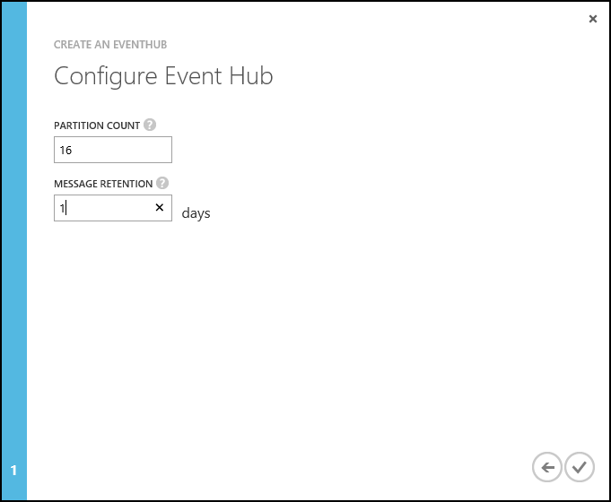

<properties
   pageTitle="Verarbeiten von Ereignis Hubs mit Storm auf HDInsight mit Java Ereignisse | Azure"
   description="Informationen Sie zum Verarbeiten von Ereignis Hubs Daten mit einer Java Storm Suchtopologie mit Maven erstellt."
   services="hdinsight,notification hubs"
   documentationCenter=""
   authors="Blackmist"
   manager="jhubbard"
   editor="cgronlun"/>

<tags
   ms.service="hdinsight"
   ms.devlang="dotnet"
   ms.topic="article"
   ms.tgt_pltfrm="na"
   ms.workload="big-data"
   ms.date="10/11/2016"
   ms.author="larryfr"/>

# Verarbeiten von Ereignissen aus Azure Ereignis Hubs mit Storm auf HDInsight (Java)

Azure Ereignis Hubs können Sie große Datenmengen von Websites, apps und Geräte verarbeiten. Das Ereignis Hubs Schnauze macht ihn benutzerfreundliche Apache Storm auf HDInsight zum Analysieren der Daten in Echtzeit. Sie können Daten auch mithilfe der Ereignis Hubs herstellt an Ereignis Hubs von Storm schreiben.

In diesem Lernprogramm erfahren Sie, wie verwenden Sie zum Lesen und Schreiben von Daten in einer Java-basierte Storm Suchtopologie Ereignis Hubs Schnauze und herstellt.

## Erforderliche Komponenten

* Ein Apache Ansturm auf HDInsight Cluster. Verwenden Sie eine der folgenden erste Schritte Beiträge in einem Cluster zu erstellen:

    - Eine [Linux-basierten Storm auf HDInsight Cluster](hdinsight-apache-storm-tutorial-get-started-linux.md): Aktivieren Sie diese Option, wenn Sie SSH für die Arbeit mit dem Cluster von Linux, Unix, OS X oder Windows-Clients verwenden möchten

    - Ein [Windows-basiertem Storm auf HDInsight Cluster](hdinsight-apache-storm-tutorial-get-started.md): Aktivieren Sie diese Option, wenn Sie PowerShell für die Arbeit mit dem Cluster aus einem Windows-Client verwenden möchten

    > [AZURE.NOTE] Die Schritte in diesem Dokument basieren auf mithilfe eines Sturms auf HDInsight Cluster 3.3 oder 3.4. Diese Cluster bieten Storm 0.10.0 und Hadoop 2.7, die welche Verringern der Anzahl der erforderlichen Schritte zum Abrufen von diesem Beispiel arbeiten.
    >
    > Eine Version der in diesem Beispiel, mit denen Storm 0.9.3 auf HDInsight 3,2 zusammenarbeitet, finden Sie unter der Verzweigung [Storm v0.9.3](https://github.com/Azure-Samples/hdinsight-java-storm-eventhub/tree/Storm_v0.9.3) des Repositorys Beispiel.

* Ein [Ereignis Azure-Hub](../event-hubs/event-hubs-csharp-ephcs-getstarted.md)

* [Oracle Java Developer Kit 7 (JDK)](https://www.oracle.com/technetwork/java/javase/downloads/jdk7-downloads-1880260.html) oder Entsprechung, z. B. [OpenJDK](http://openjdk.java.net/)

* [Maven](https://maven.apache.org/download.cgi): Maven ist ein Project-Generator-System zum Java-Projekte

* Einen Text-Editor oder Java integrierte Entwicklungsumgebung (IDE)

    > [AZURE.NOTE] Der Editor oder IDE möglicherweise bestimmte Funktionen für die Arbeit mit Maven, die nicht in diesem Dokument adressiert ist. Informationen zu den Funktionen Ihrer Umgebung bearbeiten finden Sie in der Dokumentation für das Produkt, das Sie verwenden.

 * SSH-Client. Finden Sie unter den folgenden Artikeln für Weitere Informationen zum Verwenden von SSH mit HDInsight:

    - [Verwenden von SSH mit Linux-basierten Hadoop auf HDInsight von Linux, Unix oder OS X](hdinsight-hadoop-linux-use-ssh-unix.md)

    - [Verwenden von SSH mit Linux-basierten Hadoop auf HDInsight von Windows](hdinsight-hadoop-linux-use-ssh-windows.md)

* Ein SCP-Client. Dies wird in allen Linux, Unix und OS X-Systemen bereitgestellt. Für Windows-Clients empfehlen wir PSCP, aus dem [kitten Downloadseite](http://www.chiark.greenend.org.uk/~sgtatham/putty/download.html)verfügbar ist.

##Grundlegendes zu im Beispiel

Im Beispiel [Hdinsight-Java-Storm-Eventhub](https://github.com/Azure-Samples/hdinsight-java-storm-eventhub) enthält zwei Topologien:

__com.microsoft.example.EventHubWriter__ schreibt zufällige Daten auf ein Ereignis Azure-Hub an. Die Daten von einer Schnauze generiert werden, und ist eine zufällige Geräte-ID und das Gerätewert. So ist es einige Hardware simulieren, die eine Zeichenfolgen-ID und einen numerischen Wert gibt aus.

__com.microsoft.example.EventHubReader__ liest Daten aus dem Ereignis Hub (die Daten von EventHubWriter geschrieben), und speichert sie im Verzeichnis /devicedata zu HDFS (WASB in diesem Fall, da dies geschrieben und Azure HDInsight getestet wurde).

Die Daten werden formatiert als JSON-Dokument vor der an Ereignis Verteiler geschrieben, und wenn Sie von der Reader gelesen wird Sie analysiert aus JSON und in Tupel. Das JSON-Format ist wie folgt aus:

    { "deviceId": "unique identifier", "deviceValue": some value }

Der Grund für die Verwendung eines Dokuments JSON zum Speichern der Daten in Ereignis Hub besteht, damit wir wissen, was das Format auf die Formatierung interne Funktionsweise der Ereignis-Hub Spout und herstellt angewiesen ist.

###Konfiguration des Projekts

Die Datei **POM.xml** enthält Informationen zur Systemkonfiguration für dieses Projekt Maven. Die interessante Stück sind:

####Die EventHubs Storm Spout Abhängigkeit

    <dependency>
      <groupId>org.apache.storm</groupId>
      <artifactId>storm-eventhubs</artifactId>
      <version>0.10.0</version>
    </dependency>

Dadurch wird eine Abhängigkeit für das Paket Storm-Eventhubs, das einer Schnauze zum Lesen von Ereignis Hubs, und einen an der für das Schreiben in diese enthält hinzugefügt.

> [AZURE.NOTE] Dieses Paket ist nur verfügbar für Storm Version 0.10.0 und höher. Wenn Storm 0.9.3 verwenden zu können, müssen Sie das Schnauze Paket von Microsoft bereitgestellt manuell installieren. Ein Beispiel für das Arbeiten mit Storm 0.9.3 finden Sie unter der Verzweigung [Storm v0.9.3](https://github.com/Azure-Samples/hdinsight-java-storm-eventhub/tree/Storm_v0.9.3) des Repositorys Beispiel.

####Die Komponenten HdfsBolt und WASB

Die HdfsBolt wird normalerweise zum Speichern von Daten in der Hadoop Distributed Datei System HDFS verwendet. Jedoch HDInsight Cluster Azure-Speicher (WASB) als Standard-Datenspeicher verwenden, wir haben mehrere Komponenten laden, mit die HdfsBolt zu verstehen, das Dateisystem WASB können.

      <!--HdfsBolt stuff -->
        <dependency>
        <groupId>org.apache.storm</groupId>
        <artifactId>storm-hdfs</artifactId>
        <exclusions>
            <exclusion>
            <groupId>org.apache.hadoop</groupId>
            <artifactId>hadoop-client</artifactId>
            </exclusion>
            <exclusion>
            <groupId>org.apache.hadoop</groupId>
            <artifactId>hadoop-hdfs</artifactId>
            </exclusion>
        </exclusions>
        <version>0.10.0</version>
        </dependency>
    <!--So HdfsBolt knows how to talk to WASB -->
    <dependency>
        <groupId>org.apache.hadoop</groupId>
        <artifactId>hadoop-client</artifactId>
        <version>2.7.1</version>
    </dependency>
    <dependency>
        <groupId>org.apache.hadoop</groupId>
        <artifactId>hadoop-hdfs</artifactId>
        <version>2.7.1</version>
    </dependency>
    <dependency>
        <groupId>org.apache.hadoop</groupId>
        <artifactId>hadoop-azure</artifactId>
        <version>2.7.1</version>
    </dependency>
    <dependency>
        <groupId>org.apache.hadoop</groupId>
        <artifactId>hadoop-common</artifactId>
        <version>2.7.1</version>
        <exclusions>
        <exclusion>
            <groupId>org.slf4j</groupId>
            <artifactId>slf4j-log4j12</artifactId>
        </exclusion>
        </exclusions>
    </dependency>

> [AZURE.NOTE] Bei der Arbeit mit einer früheren Version von HDInsight, wie z. B. Version 3,2, müssen Sie diese Komponenten manuell registrieren. Ein Beispiel dafür, zusammen mit den benutzerdefinierten Bits erforderlich für ältere HDInsight Cluster finden Sie unter der finden Sie unter der Verzweigung [Storm v0.9.3](https://github.com/Azure-Samples/hdinsight-java-storm-eventhub/tree/Storm_v0.9.3) des Repositorys Beispiel.

####Das Maven Compiler Plug-in

    <plugin>
      <groupId>org.apache.maven.plugins</groupId>
      <artifactId>maven-compiler-plugin</artifactId>
      <version>2.3.2</version>
      <configuration>
        <source>1.7</source>
        <target>1.7</target>
      </configuration>
    </plugin>

Dies weist Maven des Projekts kompiliert, mit Kompatibilität für Java 7, welche ist, was von HDInsight Cluster verwendet wird.

####Das Maven schattieren Plug-in

      <!-- build an uber jar -->
      <plugin>
        <groupId>org.apache.maven.plugins</groupId>
        <artifactId>maven-shade-plugin</artifactId>
        <version>2.3</version>
        <configuration>
          <transformers>
            <!-- Keep us from getting a can't overwrite file error -->
            <transformer implementation="org.apache.maven.plugins.shade.resource.ApacheLicenseResourceTransformer"/>
            <!-- Keep us from getting errors when trying to use WASB from the storm-hdfs bolt -->
            <transformer implementation="org.apache.maven.plugins.shade.resource.ServicesResourceTransformer"/>
          </transformers>
          <!-- Keep us from getting a bad signature error -->
          <filters>
            <filter>
                <artifact>*:*</artifact>
                <excludes>
                    <exclude>META-INF/*.SF</exclude>
                    <exclude>META-INF/*.DSA</exclude>
                    <exclude>META-INF/*.RSA</exclude>
                </excludes>
            </filter>
          </filters>
        </configuration>
        <executions>
          <execution>
            <phase>package</phase>
            <goals>
              <goal>shade</goal>
            </goals>
          </execution>
        </executions>
      </plugin>

Hiermit wird die Lösung in einer Uber Jar Verpacken, die sowohl die erforderlichen Abhängigkeiten das Projektcode enthält. Es wird auch verwendet:

* Umbenennen von Lizenzdateien, die Abhängigkeiten: ist dies der Fall ist nicht sie möglicherweise ein Fehler zur Laufzeit auf Windows basierende HDInsight Cluster.

* Ausschließen von Sicherheit/Signaturen: ist dies der Fall ist nicht sie möglicherweise ein Fehler auf dem Cluster HDInsight Laufzeit.

* Stellen Sie sicher, dass mehrere Implementierungen derselben Schnittstelle zu einem Posten zusammengeführt werden. Wenn dies nicht zur Verfügung, erhalten Sie Fehler, die die herstellt Storm-HDFS zur Kommunikation mit dem WASB-Dateisystem zu verstehen, wie nicht.

####Die Mitarbeiter-Maven--Plug-Ins

    <plugin>
      <groupId>org.codehaus.mojo</groupId>
      <artifactId>exec-maven-plugin</artifactId>
      <version>1.2.1</version>
      <executions>
        <execution>
        <goals>
          <goal>exec</goal>
        </goals>
        </execution>
      </executions>
      <configuration>
        <executable>java</executable>
        <includeProjectDependencies>true</includeProjectDependencies>
        <includePluginDependencies>false</includePluginDependencies>
        <classpathScope>compile</classpathScope>
        <mainClass>${storm.topology}</mainClass>
      </configuration>
    </plugin>

So können Sie die Suchtopologie lokal auf Ihrem Entwicklungsumgebung mit dem folgenden Befehl ausführen:

    mvn compile exec:java -Dstorm.topology=<CLASSNAME>

Beispielsweise `mvn compile exec:java -Dstorm.topology=com.microsoft.example.EventHubWriter`.

####Im Ressourcenabschnitt

    <resources>
      <resource>
        <directory>${basedir}/conf</directory>
        <filtering>false</filtering>
        <includes>
          <include>EventHubs.properties</include>
          <include>core-site.xml</include>
        </includes>
      </resource>
    </resources>

Dadurch wird das Projekt erforderliche Ressourcen definiert:

- **EventHubs.properties**: enthält Informationen zum Verbinden mit einem Azure Ereignis-Hub
- **Core-site.xml**: enthält Informationen zu den Azure-Speicher vom Cluster HDInsight verwendet.

Sie müssen beide mit Informationen zu Ihrem Ereignis Hub und HDInsight Cluster auffüllen.

##Konfigurieren der Umgebungsvariablen

Die folgenden Umgebungsvariablen möglicherweise beim Installieren von Java und JDK auf Ihrer Entwicklungsarbeitsstation festgelegt werden. Sie sollten, dass sie vorhanden sind und die richtigen Werte für Ihr System enthalten.

* **JAVA_HOME** - sollte zeigen, zu dem Verzeichnis, in dem die Java Runtime-Umgebung (JRE) installiert ist. Angenommen, in einer Verteilung Unix oder Linux es sollte einen Wert enthalten ähnliche `/usr/lib/jvm/java-7-oracle`. Unter Windows möchten sie einen Wert ähnlich wie haben.`c:\Program Files (x86)\Java\jre1.7`

* **PATH** - sollte die folgenden Pfade enthalten:

    * **JAVA_HOME** (oder die entsprechende Pfadangabe)

    * **JAVA_HOME\bin** (oder die entsprechende Pfadangabe)

    * Das Verzeichnis, in dem Maven installiert ist

## Konfigurieren von Ereignis-Hub

Hubs Ereignis ist die Datenquelle für dieses Beispiel. Gehen Sie folgendermaßen vor, um ein neues Ereignis Hub zu erstellen.

1. Wählen Sie aus dem [Klassischen Azure-Portal](https://manage.windowsazure.com) **neu** > **Dienstbus** > **Ereignis Hub** > **Benutzerdefinierte erstellen**.

2. Geben Sie einen **Namen des Ereignisses Hub**, wählen Sie die **Region** erstellen den Hub, und erstellen einen neuen Namespace oder ein vorhandenes Layout auszuwählen, auf dem Bildschirm **Hinzufügen einer neuen Ereignis Hub** . Klicken Sie auf den **Pfeil** , um den Vorgang fortzusetzen.

    

    > [AZURE.NOTE] Sie sollten am selben **Speicherort** als Ihre Storm auf HDInsight Server Wartezeit und Kosten verringern auswählen.

2. Geben Sie auf dem Bildschirm **Ereignis Hub konfigurieren** die **Partitionsanzahl** und **Nachricht Beibehaltung** Werte ein. Verwenden Sie für dieses Beispiel Partitionsanzahl von 10 und einer Nachricht Aufbewahrung von 1 ein. Beachten Sie die Partitionsanzahl, da Sie diesen Wert später benötigen.

    

3. Nach der Ereignis Hub erstellt wurde, wählen Sie den Namespace, wählen Sie **Ereignis Hubs**aus, und wählen Sie dann auf den Ereignis-Hub, den Sie zuvor erstellt haben.

4. Wählen Sie **Konfigurieren**, und klicken Sie dann erstellen Sie zwei neue Access-Richtlinien mithilfe der folgenden Informationen.

    <table>
    <tr><th>Namen</th><th>Berechtigungen</th></tr>
    <tr><td>Autor</td><td>Senden</td></tr>
    <tr><td>Reader</td><td>Abhören</td></tr>
    </table>

    Nachdem Sie die Berechtigungen erstellt haben, wählen Sie das **Speichern** -Symbol am unteren Rand der Seite. Dies erstellt die freigegebenen Access-Richtlinien, die zum Senden (Autor) und dieses Ereignis Hub anhören (Reader) verwendet werden.

    

5. Nachdem Sie die Richtlinien gespeichert haben, verwenden Sie die **Access-Key-Generator freigegeben** am unteren Rand der Seite zum Abrufen des Schlüssels für die Richtlinien **Autor** und **Reader** . Speichern Sie diese, da sie später verwendet werden.

## Herunterladen Sie und erstellen Sie das Projekt

1. Laden Sie das Projekt aus GitHub: [Hdinsight-Java-Storm-Eventhub](https://github.com/Azure-Samples/hdinsight-java-storm-eventhub). Sie können entweder das Paket als Zip-Archiv herunterladen oder [Git](https://git-scm.com/) verwenden, um das Projekt lokal zu duplizieren.

2. Verwenden Sie zum Erstellen und Verpacken des Projekts vor:

        mvn package

    Dies wird erforderlichen Abhängigkeiten, erstellen und dann das Projekt-Paket herunterladen. Die Ausgabe wird im __Verzeichnis/target__ als __EventHubExample-1.0-SNAPSHOT.jar__gespeichert werden.

## Die Topologien bereitstellen

Dieses Projekt erstellte JAR-Datei enthält zwei Topologien; __com.microsoft.example.EventHubWriter__ und __com.microsoft.example.EventHubReader__. Der Suchtopologie EventHubWriter sollte zuerst gestartet wird, schreiben Ereignisse in an Ereignis Verteiler, die dann von der EventHubReader gelesen werden.

###Wenn einen Linux-basierten Cluster verwenden

1. Verwenden Sie SCP, um die JAR-Paket an Ihren Cluster HDInsight zu kopieren. Ersetzen Sie mit dem Benutzer SSH für Ihren Cluster Benutzernamen ein. Ersetzen Sie CLUSTERNAME mit dem Namen der HDInsight Cluster aus:

        scp ./target/EventHubExample-1.0-SNAPSHOT.jar USERNAME@CLUSTERNAME-ssh.azurehdinsight.net:.

    Wenn Sie ein Kennwort für Ihr Konto SSH verwendet haben, werden Sie aufgefordert, das Kennwort einzugeben. Wenn Sie einen Schlüssel SSH mit dem Konto verwendet haben, müssen Sie möglicherweise verwenden Sie die `-i` Parameter, um den Pfad für die Datei anzugeben. Beispielsweise `scp -i ~/.ssh/id_rsa ./target/EventHubExample-1.0-SNAPSHOT.jar USERNAME@CLUSTERNAME-ssh.azurehdinsight.net:.`.

    > [AZURE.NOTE] Ist Ihren Kunden ein Windows-Arbeitsstationen, können Sie einen SCP Befehl installiert keinen. Es empfiehlt sich PSCP, die aus dem [kitten Downloadseite](http://www.chiark.greenend.org.uk/~sgtatham/putty/download.html)heruntergeladen werden kann.

    Dieser Befehl wird die Datei im Stammverzeichnis des Benutzers SSH auf dem Cluster kopieren.

1. Sobald die Datei hochladen abgeschlossen ist, verwenden Sie SSH Verbindung zum Cluster HDInsight. Ersetzen Sie **Benutzername** der Ihr Benutzername SSH. Ersetzen Sie durch den Namen Ihrer HDInsight Cluster **CLUSTERNAME** :

        ssh USERNAME@CLUSTERNAME-ssh.azurehdinsight.net

    > [AZURE.NOTE] Wenn Sie ein Kennwort für Ihr Konto SSH verwendet haben, werden Sie aufgefordert, das Kennwort einzugeben. Wenn Sie einen Schlüssel SSH mit dem Konto verwendet haben, müssen Sie möglicherweise verwenden Sie die `-i` Parameter, um den Pfad für die Datei anzugeben. Im folgende Beispiel wird den privaten Schlüssel aus laden `~/.ssh/id_rsa`:
    >
    > `ssh -i ~/.ssh/id_rsa USERNAME@CLUSTERNAME-ssh.azurehdinsight.net`

    Geben Sie bei Verwendung von kitten `CLUSTERNAME-ssh.azurehdinsight.net` in __Host Name (oder IP-Adresse)__ Feld aus, und klicken Sie dann auf __Öffnen__ , damit Sie eine Verbindung herstellen. Sie werden aufgefordert, Ihren Kontonamen SSH eingeben.

    > [AZURE.NOTE] Wenn Sie ein Kennwort für Ihr Konto SSH verwendet haben, werden Sie aufgefordert, das Kennwort einzugeben. Wenn Sie einen Schlüssel SSH mit dem Konto verwendet haben, müssen Sie möglicherweise verwenden Sie die folgenden Schritte aus, um die Taste auszuwählen:
    >
    > 1. Klicken Sie in der **Kategorie**erweitern Sie **Verbindung** **SSH**, und wählen Sie **Authentifizierung**aus.
    > 2. Klicken Sie auf **Durchsuchen** , und wählen Sie die .ppk-Datei, die Ihre privaten Schlüssel enthält.
    > 3. Klicken Sie auf __Öffnen__ , damit Sie eine Verbindung herstellen möchten.

2. Verwenden Sie den folgenden Befehl aus, um die Topologien zu starten:

        storm jar EventHubExample-1.0-SNAPSHOT.jar com.microsoft.example.EventHubWriter writer
        storm jar EventHubExample-1.0-SNAPSHOT.jar com.microsoft.example.EventHubReader reader

    Dadurch wird die Topologien starten, und geben sie einen Anzeigenamen für "Leser" und "Autor".

3. Warten Sie eine oder zwei Minuten die Topologien zum Schreiben und Ereignisse von Ereignis Hub lesen dürfen, und dann verwenden Sie den folgenden Befehl, um sicherzustellen, dass die EventHubReader Daten zu Ihrem HDInsight Storage gespeichert werden:

        hadoop fs -ls /devicedata

    Dadurch sollte eine Liste der Dateien ähnlich wie der folgende zurückgegeben:

        -rw-r--r--   1 storm supergroup      10283 2015-08-11 19:35 /devicedata/wasbbolt-14-0-1439321744110.txt
        -rw-r--r--   1 storm supergroup      10277 2015-08-11 19:35 /devicedata/wasbbolt-14-1-1439321748237.txt
        -rw-r--r--   1 storm supergroup      10280 2015-08-11 19:36 /devicedata/wasbbolt-14-10-1439321760398.txt
        -rw-r--r--   1 storm supergroup      10267 2015-08-11 19:36 /devicedata/wasbbolt-14-11-1439321761090.txt
        -rw-r--r--   1 storm supergroup      10259 2015-08-11 19:36 /devicedata/wasbbolt-14-12-1439321762679.txt

    > [AZURE.NOTE] Eine Größe von 0, werden möglicherweise für einige Dateien angezeigt, wie sie durch die EventHubReader erstellt wurden, aber Daten nicht, die sie noch nicht gespeichert wurde.

    Sie können den Inhalt dieser Dateien anzeigen, indem Sie mit den folgenden Befehl aus:

        hadoop fs -text /devicedata/*.txt

    Dadurch wird Daten ähnlich wie der folgende zurückgegeben:

        3409e622-c85d-4d64-8622-af45e30bf774,848981614
        c3305f7e-6948-4cce-89b0-d9fbc2330c36,-1638780537
        788b9796-e2ab-49c4-91e3-bc5b6af1f07e,-1662107246
        6403df8a-6495-402f-bca0-3244be67f225,275738503
        d7c7f96c-581a-45b1-b66c-e32de6d47fce,543829859
        9a692795-e6aa-4946-98c1-2de381b37593,1857409996
        3c8d199b-0003-4a79-8d03-24e13bde7086,-1271260574

    Die erste Spalte enthält den Wert des Geräte-ID und die zweite Spalte wird der Gerätewert.

4. Verwenden Sie die folgenden Befehle, um die Topologien zu beenden:

        storm kill reader
        storm kill writer

###Wenn Sie mit einem Windows-basierten cluster

1. Öffnen Sie Ihren Browser zu https://CLUSTERNAME.azurehdinsight.net. Wenn Sie dazu aufgefordert werden, geben Sie die Administratorberechtigungen für Ihren Cluster HDInsight. Sie werden bei dem Dashboard Storm eintreffen.

2. Verwenden Sie das Dropdown __-JAR-Datei__ zu navigieren, und wählen Sie die Datei EventHubExample-1.0-SNAPSHOT.jar aus Ihrer Umgebung erstellen.

3. Geben Sie unter __Klassennamen__ `com.mirosoft.example.EventHubWriter`.

4. Geben Sie für __Weitere Parameter__, `writer`. Klicken Sie abschließend auf __Absenden__ , um die JAR-Datei hochladen, und starten die Suchtopologie EventHubWriter.

5. Nach dem Start der Suchtopologie mithilfe des Formulars um die EventHubReader zu starten:

    * __JAR-Datei__: Wählen Sie aus der EventHubExample-1.0-SNAPSHOT.jar, die zuvor hochgeladen wurde
    * __Klassennamen__: Geben Sie`com.microsoft.example.EventHubReader`
    * __Zusätzliche Parameter__: Geben Sie`reader`

    Klicken Sie auf übermitteln, um die Suchtopologie EventHubReader zu starten.

6. Warten Sie einige Minuten, um die Topologien zu generieren Ereignisse klicken Sie dann auf Azure-Speicher speichern, und wählen Sie die Registerkarte __Hadoop Abfrage Console__ am oberen Rand der Seite __Dashboard Storm__ ermöglichen.

7. Klicken Sie auf die __Abfrage Console__, wählen Sie __Struktur-Editor__ , und Ersetzen Sie die `select * from hivesampletable` mit den folgenden:

        create external table devicedata (deviceid string, devicevalue int) row format delimited fields terminated by ',' stored as textfile location 'wasbs:///devicedata/';
        select * from devicedata limit 10;

    Klicken Sie auf __auswählen__ , um die Abfrage auszuführen. Dadurch wird aus den Daten zu Azure-Speicher (WASB) von der EventHubReader geschrieben 10 Zeilen zurückgegeben. Sobald die Abfrage abgeschlossen ist, sollte ähnlich wie der folgende Daten angezeigt werden:

        3409e622-c85d-4d64-8622-af45e30bf774,848981614
        c3305f7e-6948-4cce-89b0-d9fbc2330c36,-1638780537
        788b9796-e2ab-49c4-91e3-bc5b6af1f07e,-1662107246
        6403df8a-6495-402f-bca0-3244be67f225,275738503
        d7c7f96c-581a-45b1-b66c-e32de6d47fce,543829859
        9a692795-e6aa-4946-98c1-2de381b37593,1857409996
        3c8d199b-0003-4a79-8d03-24e13bde7086,-1271260574

8. Wählen Sie das __Dashboard Storm__ am oberen Rand der Seite, und wählen Sie dann __Storm Benutzeroberfläche__. Wählen Sie den Link für die __Bildschirmsprachausgabe__ Suchtopologie der __Storm UI__und verwenden Sie dann die Schaltfläche " __Abbrechen__ ", um die Suchtopologie beenden. Wiederholen Sie den Vorgang für die Suchtopologie __Autor__ aus.

### Geänderte

Die EventHubSpout regelmäßig Kontrollpunkten Zustand zum Knoten Zookeeper und dem speichert Anmeldeinformationen für den aktuellen Offset für Nachrichten aus der Warteschlange gelesen. Dadurch wird die Komponente mit dem Empfang von Nachrichten beim gespeicherten Offset in den folgenden Szenarien:

* Schlägt fehl, und die Instanz der Komponente ist neu gestartet.

* Sie vergrößert oder verkleinert wird den Cluster durch Hinzufügen oder Entfernen von Knoten.

* Der Suchtopologie wurde beendet und **mit demselben Namen**neu gestartet.

####Klicken Sie auf Windows basierende HDInsight Cluster

Exportieren und importieren die dauerhaften Kontrollpunkten in WASB (den Azure-Speicher von Ihren Cluster HDInsight verwendet.) Die Skripts Zweck befinden sich die Storm auf HDInsight Cluster, am **c:\apps\dist\storm-0.9.3.2.2.1.0-2340\zkdatatool-1.0\bin**.

>[AZURE.NOTE] Die Versionsnummer in den Pfad möglicherweise unterschiedlich sein, wie die Version von Storm im Cluster installiert möglicherweise in der Zukunft ändern.

Die Skripts in diesem Verzeichnis sind:

* **stormmeta_import.cmd**: alle Storm Metadaten aus dem Cluster Standard-Speichercontainer in Zookeeper importieren.

* **stormmeta_export.cmd**: alle Storm Metadaten aus Zookeeper in der Cluster standardmäßige Speichercontainer exportieren.

* **stormmeta_delete.cmd**: alle Storm Metadaten aus Zookeeper löschen.

Exportieren ein Imports ermöglicht Ihnen Wissensstand Daten beibehalten werden, wenn Sie müssen Cluster löschen, aber die Verarbeitung von der aktuellen Offset im Hub fortsetzen, wenn Sie einen neuen Cluster wieder online schalten möchten.

> [AZURE.NOTE] Da die Daten in den standardmäßigen Speichercontainer beibehalten werden, die neue Cluster **muss** verwenden den gleichen Speicherkonto und den Container wie der vorherige Cluster.

## Löschen Sie Ihren cluster

[AZURE.INCLUDE [delete-cluster-warning](../../includes/hdinsight-delete-cluster-warning.md)]

##Behandlung von Problemen

Wenn Sie Dateien gespeichert werden, um nicht angezeigt werden die den Speicherort /devicedata (entweder mit der `hadoop fs -ls /devicedata` Befehl oder die Struktur Commandd in der Verwaltungskonsole Abfrage) mithilfe der Storm-Benutzeroberfläche für die Topologien zurückgegebenen Fehlern suchen.

Weitere Informationen zur Verwendung der Benutzeroberfläche Storm finden Sie unter den folgenden Themen:

* Wenn Sie eine __Linux-basierten__ Storm auf HDInsight Cluster verwenden, finden Sie unter [Bereitstellen und Verwalten von Apache Storm Topologien auf Linux-basierten HDInsight](hdinsight-storm-deploy-monitor-topology-linux.md)

* Wenn Sie ein __Windows-basiertem__ Storm auf HDInsight Cluster verwenden, finden Sie unter [Bereitstellen und Verwalten von Apache Storm Topologien auf Windows basierende HDInsight](hdinsight-storm-deploy-monitor-topology-linux.md)

##Nächste Schritte

* [Beispiel für Topologien für Storm auf HDInsight](hdinsight-storm-example-topology.md)
