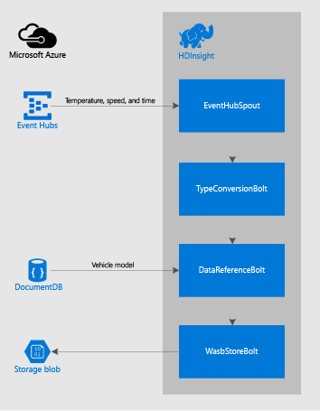

<properties
 pageTitle="Verarbeiten Fahrzeug Sensordaten mit Apache Storm auf HDInsight | Microsoft Azure"
 description="Erfahren Sie, wie Sensordaten von Ereignis Hubs mit Apache Storm auf HDInsight Fahrzeug Verarbeitungszeit. Modelldaten aus DocumentDB hinzufügen und Ausgabe an Speicherplatz zu speichern."
 services="hdinsight,documentdb,notification-hubs"
 documentationCenter=""
 authors="Blackmist"
 manager="jhubbard"
 editor="cgronlun"/>

<tags
ms.service="hdinsight"
ms.devlang="java"
ms.topic="article"
ms.tgt_pltfrm="na"
ms.workload="big-data"
ms.date="08/23/2016"
ms.author="larryfr"/>

#Prozess Fahrzeug Sensordaten aus Azure Ereignis Hubs mit Apache Storm auf HDInsight

Erfahren Sie, wie Sensordaten aus Azure Ereignis Hubs mit Apache Storm auf HDInsight Fahrzeug Verarbeitungszeit. In diesem Beispiel liest Sensordaten aus Azure Ereignis Hubs, bereichert die Daten durch einen Verweis auf die in Azure DocumentDB gespeicherten Daten und schließlich die Daten in Azure-Speicher mit Hadoop Datei System (HDFS) speichern.

##(Übersicht)

Sensoren Fahrzeuge hinzufügen, können Sie vorhersagen Ausrüstung Probleme basierend auf zurückliegenden Datentrends sowie Verbesserungen in zukünftigen Versionen basierend auf Verwendung Muster Analyse vornehmen. Während herkömmliche MapReduce Stapelverarbeitung für diese Analyse verwendet werden kann, müssen Sie möglicherweise schneller und effizienter Laden der Daten aus allen Fahrzeuge in Hadoop damit MapReduce Verarbeitung durchgeführt werden kann. Darüber hinaus möchten Sie für kritische Fehler Pfade (Engine Temperatur, Bremsen usw.) in Echtzeit Analyse durchzuführen.

Azure Ereignis Hubs werden zur Behandlung von Sensoren generierte großer Datenmengen erstellt und Apache Storm auf HDInsight zum Laden und verarbeiten die Daten vor dem Speichern in HDFS (gesicherten von Azure-Speicher) für die weitere Verarbeitung von MapReduce verwendet werden können.

##Lösung

Sensorenverzeichnis, und klicken Sie dann auf Ereignis Hubs zusammen mit des Autos Fahrzeug Identifikationen (FIN) und einen Zeitstempel gesendet werden werden Daten für Engine Temperatur, Temperatur und Fahrzeug Geschwindigkeit aufgezeichnet. Eine Storm Suchtopologie ausgeführt wird, klicken Sie auf ein Apache Ansturm auf HDInsight Cluster von dort liest die Daten, verarbeitet und in HDFS gespeichert wird.

Während der Verarbeitung wird die Fahrzeugnummer verwendet, um Informationen zum Modell aus Azure DocumentDB abrufen. Dies wird in den Datenstream hinzugefügt, bevor sie gespeichert wird.

Die Komponenten in der Suchtopologie Storm verwendet werden:

* **EventHubSpout** - liest Daten aus Azure Ereignis Hubs

* **TypeConversionBolt** - konvertiert die JSON-Zeichenfolge aus dem Ereignis Hubs in ein Tupel, das die Daten für die einzelnen Werte für Engine Temperatur, Temperatur, Geschwindigkeit, VIN und Zeitstempel

* **DataReferencBolt** - sucht Instrumententafel im Modell aus DocumentDB mithilfe der VIN

* **WasbStoreBolt** - speichert die Daten zu HDFS (Azure-Speicher)

Im folgenden finden ein Diagramm dieser Lösung:

> [AZURE.NOTE] Dies ist ein vereinfachtes Diagramm, und jede Komponente in die Lösung möglicherweise mehrere Instanzen haben. Beispielsweise werden die mehrerer Instanzen der einzelnen Komponenten in der Suchtopologie auf Knoten in der Storm auf HDInsight Cluster verteilt.

##Implementierung

Eine vollständige, automatisierte Lösung für für dieses Szenario verfügbar ist als Teil der Repository [HDInsight-Storm-Beispiele](https://github.com/hdinsight/hdinsight-storm-examples) auf GitHub. Um dieses Beispiel verwenden möchten, gehen Sie in der [IoTExample README. MD](https://github.com/hdinsight/hdinsight-storm-examples/blob/master/IotExample/README.md).

## Nächste Schritte

Weitere Beispiel Storm Topologien finden Sie unter [Beispiel Topologien für Storm auf HDInsight](hdinsight-storm-example-topology.md).
