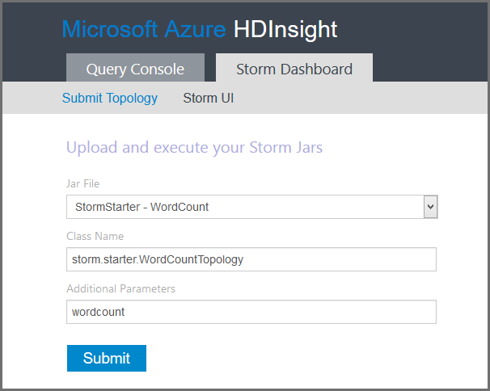

<properties
    pageTitle="Einführung in Apache Storm auf HDInsight | Microsoft Azure"
    description="Einführung in Apache Storm, und erfahren Sie, wie Sie Storm auf HDInsight verwenden können, um Echtzeitdaten Analytics Lösungen in der Cloud zu erstellen."
    services="hdinsight"
    documentationCenter=""
    authors="Blackmist"
    manager="jhubbard"
    editor="cgronlun"
    tags="azure-portal"/>

<tags
   ms.service="hdinsight"
   ms.devlang="na"
   ms.topic="get-started-article"
   ms.tgt_pltfrm="na"
   ms.workload="big-data"
   ms.date="10/11/2016"
   ms.author="larryfr"/>

#Einführung in Apache Storm auf HDInsight: in Echtzeit Analytics für Hadoop

Apache Storm auf HDInsight können Sie mithilfe von [Apache Hadoop](http://hadoop.apache.org)verteilt, in Echtzeit Analytics Lösungen in der Azure-Umgebung zu erstellen.

##Was ist die Apache Storm?

Apache Storm ist ein verteilt, Fehlertoleranz, Open Source Berechnung-System, das Sie zum Verarbeiten von Daten in Echtzeit mit Hadoop. Storm Lösungen können auch garantiert Verarbeitung von Daten, die Möglichkeit bieten Wiedergeben von Daten, die beim ersten nicht erfolgreich verarbeitet wurde.

##Gründe für das Verwenden von Storm auf HDInsight

Apache Storm auf HDInsight ist eine verwaltete Cluster in der Azure-Umgebung integriert. Es bietet die folgenden Hauptvorteile:

* Als verwalteter Dienst mit einer Vereinbarung zum SERVICELEVEL von 99,9 % von Arbeitszeit ausführt

* Verwenden Sie die Sprache Ihrer Wahl: bietet Unterstützung für Storm Komponenten in **Java**, **c#**und **Python** geschrieben

    * Eine Mischung aus programming Sprachen unterstützt: Daten mit Java lesen, und klicken Sie dann mit C zu verarbeiten#
    
        > [AZURE.NOTE] C#-Topologien werden nur auf Windows basierende HDInsight Cluster unterstützt.

    * Verwenden Sie die **Trident** Java-Schnittstelle Storm Topologien erstellen, die "einmalige genau" unterstützen Verarbeitung von Nachrichten, "Transaktion" Datenspeicher Beibehaltung und eine Reihe von allgemeinen Stream Analytics Vorgängen

* Integrierte vergrößern und zu skalieren-Down-Features enthält: einen HDInsight Cluster mit keine Auswirkung für die Ausführung von Storm Topologien skalieren

* Integrieren Sie mit anderen Azure-Diensten, einschließlich Ereignis Hub, Azure-virtuellen Netzwerk, SQL-Datenbank, Blob-Speicher und DocumentDB

    * Kombinieren Sie die Funktionen mehrerer HDInsight Cluster mithilfe von Azure-virtuellen Netzwerk: Erstellen der analytischen Pipelines, die HDInsight, HBase oder Hadoop Cluster verwenden

Eine Liste der Unternehmen, die für den in Echtzeit Analytics dazugehörigen Lösungen Apache Storm verwenden, finden Sie unter [Unternehmen verwenden Apache Storm](https://storm.apache.org/documentation/Powered-By.html).

Um anzufangen Storm verwenden, finden Sie unter [Erste Schritte mit Storm auf HDInsight][gettingstarted].

###Einfaches provisioning

Sie können eine neue Storm auf HDInsight Cluster in Minuten bereitstellen. Geben Sie den Clusternamen, Größe, Administratorkonto und Speicher-Konto ein. Azure erstellt Cluster, einschließlich Beispieltopologien und ein Web-Management Dashboard.

> [AZURE.NOTE] Sie können auch Storm Cluster mithilfe des [Azure CLI](../xplat-cli-install.md) oder [Azure PowerShell](../powershell-install-configure.md)bereitstellen.

Innerhalb von 15 Minuten Einreichen der Anfrage haben Sie einen neuen Storm Cluster ausgeführt, und Ihre erste Lust in Echtzeit Analytics pipeline.

###Center für erleichterte Bedienung

__Für Linux-basierten Storm auf HDInsight Cluster__, Sie können die Verbindung zu den Cluster mithilfe von SSH und die Verwendung der `storm` Befehl zum Starten und Verwalten von Topologien. Darüber hinaus können Sie Ambari zum Überwachen der Storm-Dienst und der Storm Benutzeroberfläche zum Überwachen und Verwalten von laufenden Topologien aus.

Weitere Informationen zum Arbeiten mit Linux-basierten Storm Cluster finden Sie unter [Erste Schritte mit Apache Storm auf Linux-basierten HDInsight](hdinsight-apache-storm-tutorial-get-started-linux.md).

__Für Windows-basiertem Storm auf HDInsight Cluster__, die HDInsight-Tools für Visual Studio ermöglichen Ihnen c# und Hybrid c# erstellen / Java Topologien, und klicken Sie dann an Ihre Storm auf HDInsight Cluster senden.  

HDInsight Tools für Visual Studio enthält auch eine Benutzeroberfläche, die Sie zum Überwachen und Verwalten von Storm Topologien auf einem Cluster ermöglicht.

Ein Beispiel für die HDInsight Tools zum Erstellen einer Anwendung Storm verwenden finden Sie unter [entwickeln c# Storm Topologien mit den HDInsight Tools für Visual Studio](hdinsight-storm-develop-csharp-visual-studio-topology.md).

Weitere Informationen zu den HDInsight Tools für Visual Studio finden Sie unter [Erste Schritte mit der HDInsight-Tools für Visual Studio](../HDInsight/hdinsight-hadoop-visual-studio-tools-get-started.md).

Jede Storm auf HDInsight Cluster enthält auch eines webbasierten Storm Dashboards, die es ermöglicht zu übermitteln, überwachen und Verwalten von Storm Topologien auf dem Cluster ausgeführt.

Weitere Informationen zur Verwendung von dem Dashboard Storm, finden Sie unter [Bereitstellen und Verwalten von Apache Storm Topologien auf HDInsight](hdinsight-storm-deploy-monitor-topology.md).

Storm auf HDInsight bietet auch einfach Integration mit Azure Ereignis Hubs durch das **Ereignis Hub Spout**. Die neueste Version dieser Komponente ist am [https://github.com/hdinsight/hdinsight-storm-examples/tree/master/lib/eventhubs](https://github.com/hdinsight/hdinsight-storm-examples/tree/master/lib/eventhubs)verfügbar. Weitere Informationen zur Verwendung dieser Komponente finden Sie unter den folgenden Dokumenten.

* [Entwickeln einer c#-Suchtopologie, die Azure Ereignis Hubs verwendet.](hdinsight-storm-develop-csharp-event-hub-topology.md)

* [Entwickeln einer Java-Suchtopologie, die Azure Ereignis Hubs verwendet.](hdinsight-storm-develop-java-event-hub-topology.md)

###Zuverlässigkeit

Apache Storm garantiert immer, dass jede eingehende Nachricht auch, wenn die Datenanalyse über hundert Knoten verteilt ist vollständig verarbeitet werden, ein.

Den **Nimbus Knoten** stellt eine ähnliche Funktionalität in der Hadoop JobTracker und anderen Knoten im Cluster erfolgt über **Zookeeper**Aufgaben zugewiesen. Zookeeper Knoten Koordinierung für den Cluster bereitstellen und vereinfachen die Kommunikation zwischen Nimbus und den Prozess **Vorgesetzten** auf den Worker-Knoten. Wenn eine Verarbeitungsknoten fällt aus, der Knoten Nimbus informiert, und die Aufgabe und die zugeordneten Daten zu einem anderen Knoten zugewiesen.

Die standardmäßige Konfiguration für Apache Storm ist nur ein Nimbus Knoten haben. Storm auf HDInsight führt zwei Nimbus Knoten. Wenn der primäre Knoten fehlschlägt, wechselt HDInsight Cluster auf den zweiten Knoten während der primäre Knoten wiederhergestellt wurde.

###Skalieren

Obwohl Sie die Anzahl der Knoten im Cluster während der Erstellung angeben können, sollten Sie vergrößert oder verkleinert Cluster Arbeitsbelastung übereinstimmt. Alle HDInsight Cluster können Sie die Anzahl der Knoten im Cluster, auch während der Verarbeitung von Daten zu ändern.

> [AZURE.NOTE] Wenn Sie neue Knoten hinzugefügt, durch das Skalieren nutzen zu können, müssen Sie neu zu verteilen Topologien gestartet, bevor der Cluster vergrößert wurde.

###Support

Storm auf HDInsight verfügt über Enterprise-Ebene 24/7-Support. Storm auf HDInsight verfügt auch über eine Vereinbarung zum SERVICELEVEL von 99,9 %. Dies bedeutet, dass wir sichergestellt ist, dass der Cluster mindestens 99,9 % der Zeit externe Konnektivität verfügen.

##Allgemeine Fällen wird in Echtzeit analytics

Im folgenden werden einige häufige Szenarien, für die Sie Apache Storm auf HDInsight verwenden können. Finden Sie Informationen zu realen Szenarien [wie Storm Unternehmen verwenden](https://storm.apache.org/documentation/Powered-By.html).

* Das Internet der Dinge (IoT)
* Betrugsversuche
* Analytics für soziale Netzwerke
* Extrahieren Sie, transformieren Sie, Laden von Daten
* Netzwerk für die Überwachung
* Suchen
* Mobile engagement

##Wie werden Daten in HDInsight Storm verarbeitet?

Apache Storm führt **Topologien** anstelle der MapReduce Aufträge, denen Sie möglicherweise in HDInsight oder Hadoop vertraut. Ein Sturms auf HDInsight Cluster enthält zwei Typen von Knoten: leiten Knoten, die **Nimbus** und Worker Knoten ausgeführt werden, die **Vorgesetzten**ausgeführt werden.

* **Nimbus**: ähnlich wie der JobTracker in Hadoop es ist für Code über das Cluster verteilen, Zuweisen von Aufgaben an virtuellen Computern und für die Überwachung für den Fehler verantwortlich ist. HDInsight bietet zwei Nimbus Knoten, sodass es keine zentrale für den Ausfall Storm auf HDInsight gibt

* **Vorgesetzten**: der Vorgesetzten für jeden Worker Knoten starten und Beenden von **Arbeitsprozesse** auf dem Knoten verantwortlich ist.

* **Worker-Prozess**: ausgeführt wird einen Teil einer **Suchtopologie**. Eine laufende Suchtopologie wird auf viele Arbeitsprozesse über das Cluster verteilt.

* **Suchtopologie**: ein Diagramm der Berechnung, die **Streams** verarbeitet definiert. Führen Sie Topologien im Gegensatz zu MapReduce Aufträge bis Sie diese beenden.

* **Stream**: ein nicht gebundenes Sammlung von **Tupel**. Streams von **spouts** und **bolts**erzeugt werden, und sie werden von **bolts**genutzt.

* **Tupel**: einer benannten dynamisch eingegebenen Werteliste.

* **Spout**: verwendet Daten aus einer Datenquelle und gibt eine oder mehrere **Streams**aus.

    > [AZURE.NOTE] In vielen Fällen werden die Daten aus einer Warteschlange, wie z. B. Kafka, Azure Servicebuswarteschlangen oder Ereignis Hubs gelesen. Die Warteschlange wird sichergestellt, dass die Daten gespeichert werden, wenn eine derzeit nicht zur Verfügung.

* **An**: Es verbraucht **Streams**, führt Verarbeitung auf **Tupel**und möglicherweise **Streams**ausgeben. Schrauben sind auch zum Schreiben von Daten in externen Datenspeicher wie eine Warteschlange, HDInsight, HBase, ein Blob oder andere Datenspeicher verantwortlich.

* **Apache Thrift**: ein Softwareframework für die Dienstentwicklung skalierbare Cross-Sprache-. Sie können Sie zur Erstellung von Diensten, die zwischen C++, Java, Python, PHP, Ruby, Erlang, Perl, Haskell, c#, Kakao, JavaScript-, Node.js, Smalltalk und anderen Sprachen arbeiten.

    * **Nimbus** ist ein Thrift-Dienst und einer **Suchtopologie** ist eine Definition Thrift, sodass es möglich ist, mithilfe einer Vielzahl von Sprachen programming Topologien entwickeln.

Weitere Informationen zu Storm Komponenten, finden Sie im [Lernprogramm Storm] [ apachetutorial] am apache.org.

##Welche Sprachen kann ich verwenden?

Der Storm auf HDInsight Cluster unterstützt c#, Java und Python.

### C & #35;

Die HDInsight-Tools für Visual Studio zulassen .NET Entwickler entwerfen und Implementieren eines Suchtopologie in c# Sie können auch Hybridtopologien erstellen, die Java und C#-Komponenten verwenden.

Weitere Informationen finden Sie unter [entwickeln C#-Topologien für Apache Storm auf HDInsight mithilfe von Visual Studio](hdinsight-storm-develop-csharp-visual-studio-topology.md).

###Java

Die meisten Java-Beispiele auftretenden werden einfarbigen Java oder Trident. Trident ist eine hohe Abstraktionsebene, die beispielsweise Verknüpfungen, Aggregationen, gruppieren und Filtern Möglichkeiten erleichtert. Jedoch fungiert Trident auf Stapeln von Tupel, während eine unformatierte Java-Lösung ein Stream ein Tupel nacheinander verarbeitet.

Weitere Informationen zu Trident finden Sie im [Lernprogramm Trident](https://storm.apache.org/documentation/Trident-tutorial.html) am apache.org.

Beispiele für Java und Trident Topologien finden Sie unter der [Liste der Storm Topologien](hdinsight-storm-example-topology.md) oder die Storm Starter Beispiele im HDInsight Cluster enthalten sind.

Die Beispiele Storm-Starter befinden sich im Verzeichnis __/usr/hdp/current/storm-client/contrib/storm-starter__ auf Linux-basierten Cluster und **%storm_home%\contrib\storm-starter** Verzeichnis auf einem Windows-basierten Cluster.

##Was sind einige allgemeine Entwicklung Muster?

###Verarbeitung von gesicherter Nachrichten

Storm kann verschiedene Detailebenen Verarbeitung garantiert Nachricht bereitstellen. Beispielsweise kann in eine einfache Storm Anwendung am wenigsten einmaligem Verarbeitung sichergestellt ist, und kann sichergestellt Trident genau ist-einmal verarbeiten.

Weitere Informationen finden Sie unter apache.org [Garantien auf Datenverarbeitung](https://storm.apache.org/about/guarantees-data-processing.html) .

###IBasicBolt

Das Muster ein Eingabewerte Tupel, Ausgeben von 0 (null) oder mehr Tupel, und klicken Sie dann durch ACK bestätigt Eingabewerte Tupels sofort am Ende der Ausführungsmethode zu lesen ist sehr allgemeine und Storm stellt die [IBasicBolt](https://storm.apache.org/apidocs/backtype/storm/topology/IBasicBolt.html) -Schnittstelle, um dieses Muster zu automatisieren.

###Verknüpfungen

Verknüpfen von zwei Streams Datenseite variiert zwischen Clientanwendungen. Beispielsweise könnten Sie jedes Tupels aus mehreren Streams in einen neuen Stream teilnehmen oder könnten Sie nur Stapel Tupel für ein bestimmtes Fenster teilnehmen. In beiden Fällen kann Beitritt erfolgen mithilfe der [FieldsGrouping](http://javadox.com/org.apache.storm/storm-core/0.9.1-incubating/backtype/storm/topology/InputDeclarer.html#fieldsGrouping%28java.lang.String,%20backtype.storm.tuple.Fields%29), eine Möglichkeit zum definieren, wie Tupel an Schrauben weitergeleitet werden.

Im folgenden Beispiel Java ist FieldsGrouping zum Tupel weiterleiten, die aus Komponenten "1", "2" und "3" in der **MyJoiner** herstellt stammen verwendet.

    builder.setBolt("join", new MyJoiner(), parallelism) .fieldsGrouping("1", new Fields("joinfield1", "joinfield2")) .fieldsGrouping("2", new Fields("joinfield1", "joinfield2")) .fieldsGrouping("3", new Fields("joinfield1", "joinfield2"));

###Batchverarbeitung

Batchverarbeitung kann auf unterschiedliche Weise erfolgen. Mit einer einfachen Storm Java Suchtopologie Sie möglicherweise verwenden einfachen Zähler auf Stapel X Anzahl von Tupel vor dem Ausgeben von ihnen, oder eine interne Anzeigedauer Verfahren bekannt als "Teilstriche Tupel" einen Stapel alle X Sekunden ausgegeben.

Ein Beispiel für Teilstriche Tupel verwenden finden Sie unter [Analysieren von Sensordaten mit Storm und HBase auf HDInsight](hdinsight-storm-sensor-data-analysis.md).

Wenn Sie Trident verwenden, basiert Sie auf Verarbeitung Stapeln von Tupel.

###Zwischenspeichern

Zwischenspeichern von in-Memory wird häufig verwendet, wie ein Verfahren zum Verarbeiten, da es häufig behält beschleunigen Posten im Speicher verwendet. Da eine Suchtopologie auf mehreren Knoten und mehrere Prozesse innerhalb jeder Knoten verteilt ist, sollten Sie [FieldsGrouping](http://javadox.com/org.apache.storm/storm-core/0.9.1-incubating/backtype/storm/topology/InputDeclarer.html#fieldsGrouping%28java.lang.String,%20backtype.storm.tuple.Fields%29) verwenden, um sicherzustellen, dass Tupel mit den Feldern, die für den Cache Nachschlagen verwendet werden, immer mit demselben Prozess weitergeleitet werden. Vermeiden doppelter Einträge im Cache für Prozesse.

###Streaming Top N

Wenn hängt von der Suchtopologie Berechnen eines Werts "Top N", wie etwa die oberen 5 Trends auf Twitter, sollten Sie parallel berechnet Top N und dann die Ausgabe zugehörige Berechnung in einen globalen Wert zusammenführen. Dies kann mithilfe von [FieldsGrouping](http://javadox.com/org.apache.storm/storm-core/0.9.1-incubating/backtype/storm/topology/InputDeclarer.html#fieldsGrouping%28java.lang.String,%20backtype.storm.tuple.Fields%29) zum Weiterleiten von Feld zur parallelen Schrauben (die die Daten durch Feldwert teilt den), und klicken Sie dann weiterleiten an einen umgewandelt, der den Wert für die obersten N Global bestimmt erfolgen.

Ein Beispiel dafür finden Sie im Beispiel [RollingTopWords](https://github.com/nathanmarz/storm-starter/blob/master/src/jvm/storm/starter/RollingTopWords.java) .

##Welche Art von Protokollierung Storm-verwenden?

Storm verwendet Apache Log4j, um Informationen protokollieren. Standardmäßig wird eine große Datenmenge protokolliert, und es kann schwierig sein, die Informationen zu sortieren. Sie können eine Konfigurationsdatei Protokollierung als Teil der Suchtopologie Storm zum Steuerelement Protokollierung Verhalten einbeziehen.

Eine Beispiel-Suchtopologie, die veranschaulicht, wie Sie die Protokollierung konfigurieren, finden Sie unter [Java-basierte WordCount](hdinsight-storm-develop-java-topology.md) -Beispiel für Storm auf HDInsight.

##Nächste Schritte

Weitere Informationen zu in Echtzeit Analytics Lösungen mit Apache Storm in HDInsight:

* [Erste Schritte mit Storm auf HDInsight][gettingstarted]

* [Beispiel für Topologien für Storm auf HDInsight](hdinsight-storm-example-topology.md)

[stormtrident]: https://storm.apache.org/documentation/Trident-API-Overview.html
[samoa]: http://yahooeng.tumblr.com/post/65453012905/introducing-samoa-an-open-source-platform-for-mining
[apachetutorial]: https://storm.apache.org/documentation/Tutorial.html
[gettingstarted]: hdinsight-apache-storm-tutorial-get-started-linux.md
