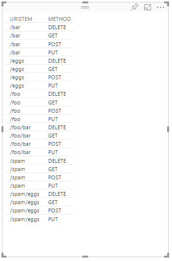

<properties
 pageTitle="Verwenden von Apache Storm mit Power BI | Microsoft Azure"
 description="Erstellen eines Power BI-Berichts anhand von Daten aus einer c# Suchtopologie auf einem Apache Storm Cluster in HDInsight ausgeführt."
 services="hdinsight"
 documentationCenter=""
 authors="Blackmist"
 manager="jhubbard"
 editor="cgronlun"
    tags="azure-portal"/>

<tags
 ms.service="hdinsight"
 ms.devlang="dotnet"
 ms.topic="article"
 ms.tgt_pltfrm="na"
 ms.workload="big-data"
 ms.date="10/27/2016"
 ms.author="larryfr"/>

# Verwenden von Power BI zur Visualisierung von Daten aus einer Suchtopologie Apache Storm

Power BI können Sie Daten visuell Berichte anzuzeigen. Mithilfe von Visual Studio-Vorlagen für Storm auf HDInsight, können Sie einfach Speichern von Daten aus einer Suchtopologie ausführen auf ein Apache Ansturm auf HDInsight Cluster in SQL Azure verwenden und dann Visualisieren von Daten mit Power BI.

In diesem Dokument erfahren Sie, wie Sie Power BI zum Erstellen eines Berichts aus den Daten von einer Suchtopologie Apache Storm generiert und in Azure SQL-Datenbank gespeichert.

> [AZURE.NOTE] Während Sie die Schritte in diesem Dokument auf einem Windows-Entwicklungsumgebung mit Visual Studio verlassen, kann das kompilierte Projekt an einem Linux oder Windows-basierten HDInsight Cluster gesendet werden. Linux-basierten Cluster erstellt nur nach 10/28/2016 Support SCP.NET Topologien.
>
> Wenn eine C#-Suchtopologie mit einem Linux-basierten Cluster verwenden möchten, müssen Sie das Paket Microsoft.SCP.Net.SDK NuGet verwendet wird, die das Projekt auf Version 0.10.0.6 oder höher aktualisieren. Die Version des Pakets muss auch die Hauptversion des Storm auf HDInsight installiert übereinstimmen. Beispielsweise Storm HDInsight Versionen 3.3 und 3.4 Storm Version verwenden 0.10.x, während HDInsight 3.5 Storm verwendet 1.0.x.
> 
> C#-Topologien auf Linux-basierten Cluster .NET 4.5 verwenden, und verwenden Mono für HDInsight Cluster ausgeführt. Die meisten Elemente funktionieren, jedoch auf der Sie das Dokument [Ein-Kompatibilität](http://www.mono-project.com/docs/about-mono/compatibility/) für mögliche Inkompatibilität überprüfen soll.
>
> Eine Java-Version des Projekts, die auch in einem Linux oder Windows-basierten Cluster funktionieren, finden Sie unter [Verarbeiten von Ereignissen aus Azure Ereignis Hubs mit Storm auf HDInsight (Java)](hdinsight-storm-develop-java-event-hub-topology.md).

## Erforderliche Komponenten

- Ein Azure-Abonnement. Finden Sie [kostenlose Testversion Azure abrufen](https://azure.microsoft.com/documentation/videos/get-azure-free-trial-for-testing-hadoop-in-hdinsight/).

* Azure-Active Directory-Benutzer mit [Power BI](https://powerbi.com) -Zugriff

* Visual Studio (eine der folgenden Versionen)

    * Visual Studio 2012 mit [4 aktualisieren](http://www.microsoft.com/download/details.aspx?id=39305)

    * Visual Studio 2013 mit [4 aktualisieren](http://www.microsoft.com/download/details.aspx?id=44921) oder [Visual Studio-2013-Community](http://go.microsoft.com/fwlink/?linkid=517284&clcid=0x409)

    * [Visual Studio 2015](https://www.visualstudio.com/downloads/download-visual-studio-vs.aspx)

* Die HDInsight-Tools für Visual Studio: Informationen finden Sie unter [Erste Schritte mit der HDInsight-Tools für Visual Studio](../HDInsight/hdinsight-hadoop-visual-studio-tools-get-started.md) auf Installationsinformationen.

## So funktioniert es

In diesem Beispiel enthält eine C#-Storm-Suchtopologie, die Internet Information Services (IIS) Log Daten zufällig generiert. Diese Daten ist dann in einer SQL-Datenbank geschrieben und von dort aus, die sie zum Generieren von Berichten in Power BI verwendet wird.

Im folgenden finden eine Liste der Dateien, die den Hauptfunktionen der in diesem Beispiel implementieren.

* **SqlAzureBolt.cs**: schreibt Informationen in der Suchtopologie Storm mit SQL-Datenbank erstellt.

* **IISLogsTable.sql**: der Transact-SQL-Anweisungen verwendet, um die Datenbank zu erstellen, die die Daten in gespeichert ist.

> [AZURE.WARNING] Sie müssen die Tabelle in der SQL-Datenbank erstellen, vor dem Starten der Suchtopologie auf Ihren Cluster HDInsight.

## Laden Sie das Beispiel

Herunterladen der [HDInsight C#-Storm Power BI-Beispiel](https://github.com/Azure-Samples/hdinsight-dotnet-storm-powerbi). Zum Herunterladen entweder mit [Git](http://git-scm.com/)Verzweigung/klonen, oder verwenden Sie den Link zum **herunterladen** eines ZIP des Archivs herunterladen.

## Erstellen einer Datenbank

1. Führen Sie die Schritte zum Erstellen einer neuen SQL-Datenbank in der [SQL-Datenbank-Lernprogramm](../sql-database/sql-database-get-started.md) -Dokument.

2. Verbinden mit der Datenbank anhand der Schritte im Dokument [Verbinden mit einer SQL-Datenbank mit Visual Studio](../sql-database/sql-database-connect-query.md) für die Verbindung mit der Datenbank.

4. Klicken Sie mit der rechten Maustaste auf die Datenbank im Objekt-Explorer, und erstellen Sie eine __Neue Abfrage__. Fügen Sie des Inhalts der Datei __IISLogsTable.sql__ in das Abfragefenster im heruntergeladenen Projekt enthalten ein, und klicken Sie dann verwenden Sie STRG + UMSCHALT + E, um die Abfrage auszuführen. Sie sollten eine Meldung, dass die Befehle wurden erfolgreich ausgeführt.

    Sobald dies abgeschlossen ist, wird eine neue Tabelle namens __IISLOGS__ in der Datenbank vorhanden sein.

## Konfigurieren der Stichprobe

1. Wählen Sie aus dem [Azure-Portal](https://portal.azure.com)die SQL-Datenbank ein. Wählen Sie im Abschnitt __Essentials__ des SQL-Datenbank Blades __Datenbank Verbindungszeichenfolgen anzeigen__. Kopieren Sie aus der Liste, die angezeigt wird die Informationen zu __ADO.NET (SQL-Authentifizierung)__ .

1. Öffnen Sie das Beispiel in Visual Studio. Öffnen Sie **die App** **Lösung-Explorer**und suchen Sie den folgenden Eintrag:

        <add key="SqlAzureConnectionString" value="##TOBEFILLED##" />
    
    Ersetzen Sie den Wert __## TOBEFILLED ##__ , mit die Verbindungszeichenfolge der Datenbank, die im vorherigen Schritt kopiert haben. Ersetzen Sie __{Ihrer\_Username}__ und __{Ihrer\_Kennwort}__ mit den Benutzernamen und das Kennwort für die Datenbank.

2. Speichern Sie und schließen Sie die Dateien.

## Bereitstellen der Stichprobe

1. **Lösung Explorer**mit der rechten Maustaste in des Projekts **StormToSQL** und **Absenden an Storm auf HDInsight**wählen. Wählen Sie den HDInsight Cluster **Storm Cluster** Dropdownmenü im Dialogfeld ein.

    > [AZURE.NOTE] Es kann der Dropdownliste **Storm Cluster** mit Servernamen gefüllt wird ein paar Sekunden dauern.
    >
    > Wenn Sie dazu aufgefordert werden, geben Sie die Anmeldeinformationen für Ihr Abonnement Azure ein. Wenn Sie mehr als ein Abonnement besitzen, melden Sie sich nach dem vorkommen, die Ihre Storm auf HDInsight Cluster enthält.

2. Wenn der Suchtopologie übermittelt wurde, sollte die Storm Topologien für den Cluster angezeigt werden. Wählen Sie den Eintrag SqlAzureWriterTopology aus der Liste, um Informationen zu den laufenden Suchtopologie anzeigen.

    

    Verwenden Sie diese Ansicht finden Informationen auf der Suchtopologie, oder Doppelklicken auf Einträge (wie etwa die SqlAzureBolt), um Informationen, die speziell für eine Komponente in der Suchtopologie anzuzeigen.

3. Nachdem der Suchtopologie ausgeführt wurde für einige Minuten, zurück zum Fenster SQL-Abfrage, die, das Sie zum Erstellen der Datenbank verwendet. Ersetzen Sie die vorhandenen Anweisungen durch Folgendes ein.

        select * from iislogs;
    
    STRG + UMSCHALT + E, zum Ausführen der Abfrage, und Sie sollte ähnlich wie der folgende Ergebnisse erhalten.
    
        1   2016-05-27 17:57:14.797 255.255.255.255 /bar    GET 200
        2   2016-05-27 17:57:14.843 127.0.0.1   /spam/eggs  POST    500
        3   2016-05-27 17:57:14.850 123.123.123.123 /eggs   DELETE  200
        4   2016-05-27 17:57:14.853 127.0.0.1   /foo    POST    404
        5   2016-05-27 17:57:14.853 10.9.8.7    /bar    GET 200
        6   2016-05-27 17:57:14.857 192.168.1.1 /spam   DELETE  200

    Dies ist die Daten, die aus der Suchtopologie Storm geschrieben wurde.

## Erstellen eines Berichts

1. Verbinden des [Verbinders Azure SQL-Datenbank](https://app.powerbi.com/getdata/bigdata/azure-sql-database-with-live-connect) für Power BI.

2. Wählen Sie in __Datenbanken__ __Abrufen__.

3. Wählen Sie __SQL Azure-Datenbank__aus, und wählen Sie dann auf __Verbinden__.

4. Geben Sie die Informationen für die Verbindung zu Ihrem SQL Azure-Datenbank aus. Sie können dies suchen, indem des Besuchs der [Azure-Portal](https://portal.azure.com) und die SQL-Datenbank.

    > [AZURE.NOTE] Sie können auch die Aktualisierungsintervalls und benutzerdefinierten Filter festlegen, mithilfe von __Erweiterte Optionen, aktivieren Sie__ im Dialogfeld Verbinden.

5. Nachdem Sie verbunden haben, wird ein neues Dataset mit demselben Namen wie die Datenbank angezeigt, die, denen Sie verbunden. Wählen Sie das Dataset beim Entwerfen eines Berichts beginnen.

3. __Felder__erweitern Sie den Eintrag __IISLOGS__ . Aktivieren Sie das Kontrollkästchen für __URISTEM__aus. Dies erstellt einen neuen Bericht, der URI Stängel aufgeführt (/ Foo, / Balken-, usw.) in der Datenbank angemeldet.

    

5. Als Nächstes ziehen Sie __Methode__ in den Bericht. Der Bericht wird aktualisiert, um die Liste der Stielen und die entsprechenden HTTP-Methode der HTTP-Anforderung verwendet.

    

4. Wählen Sie das Symbol für die __Felder__ in der Spalte __Visualisierungen__ , und wählen Sie dann den Pfeil nach unten neben __Methode__ im Abschnitt __Werte__ . Wählen Sie aus der Liste, die angezeigt wird, __zählen__. Dadurch wird im Bericht eine zählen, wie oft aufgeführt, die ein bestimmter URI zugegriffen wurde geändert.

    

6. Wählen Sie als Nächstes __Gestapeltes Säulendiagramm__ zu ändern, wie die Informationen angezeigt werden.

    

7. Nachdem Sie den Bericht haben, wie Sie es möchten, verwenden Sie im Menü den Eintrag __zu speichern__ , geben Sie einen Namen, und speichern Sie den Bericht.

## Beenden der Suchtopologie

Der Suchtopologie weiterhin ausgeführt, bis Sie es beenden oder der Storm auf HDInsight Cluster löschen. Führen Sie die folgenden Schritte aus, um die Suchtopologie zu beenden.

1. Kehren Sie in Visual Studio zu der Suchtopologie Viewer zurück, und wählen Sie die Suchtopologie.

2. Wählen Sie die Schaltfläche **Abbrechen** , um die Suchtopologie beenden aus.

    

## Löschen Sie Ihren cluster

[AZURE.INCLUDE [delete-cluster-warning](../../includes/hdinsight-delete-cluster-warning.md)]

## Nächste Schritte

In diesem Dokument gelernt Sie zum Senden von Daten aus einem Storm Suchtopologie mit SQL-Datenbank, und klicken Sie dann Visualisieren von Daten mit Power BI. Informationen zum Arbeiten mit anderen Azure Technologien Storm auf HDInsight verwenden, finden Sie hier:

* [Beispiel für Topologien für Storm auf HDInsight](hdinsight-storm-example-topology.md)
