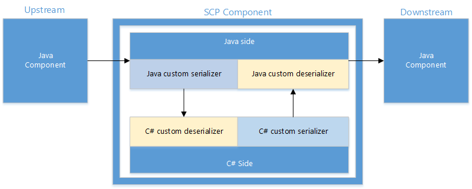

<properties
pageTitle="SCP.NET programming Guide | Azure"
description="Erfahren Sie, wie Sie SCP.NET, um zu erstellen. Netz-basierten Storm Topologien für mit Storm auf HDInsight verwenden."
services="hdinsight"
documentationCenter=""
authors="raviperi"
manager="jhubbard"
editor="cgronlun"/>

<tags
ms.service="hdinsight"
ms.devlang="dotnet"
ms.topic="article"
ms.tgt_pltfrm="na"
ms.workload="big-data"
ms.date="05/16/2016"
ms.author="raviperi"/>

#SCP programming guide

SCP ist eine Plattform in Echtzeit, zuverlässig, konsistent und hohe Leistung Datenverarbeitung Anwendung zu erstellen. Auf [Apache Storm](http://storm.incubator.apache.org/) – ein System von der OSS Communitys Verarbeitung Stream basiert. Storm Nathan Marz und öffnen dient zugrunde liegenden Twitter. Sie nutzt [Apache ZooKeeper](http://zookeeper.apache.org/), ein anderes Apache Projekt hochgradig zuverlässigen verteilten Koordinierung und Bundesstaat Verwaltung zu aktivieren. 

Nicht nur das Projekt SCP portiert Storm unter Windows, sondern auch das Projekt hinzugefügt, Extensions und Anpassung für die Windows-Netz. Beziehen Sie die Erweiterungen .NET Developer Experience und Bibliotheken, die Anpassung umfasst Windows basierende Bereitstellung. 

Die Erweiterung und Anpassung wird so sichergestellt, dass wir muss nicht die Projekte OSS Verzweigung und konnten wir abgeleiteten Ökosysteme auf Storm aufgebaut nutzen.

## Verarbeiten des Modells 

Die Daten in SCP können als fortlaufender Streams Tupel verwendet werden. In der Regel Datenfluss die Tupel in einigen Warteschlange zuerst, dann übernommen und transformiert von Geschäftslogik gehostet innerhalb einer Suchtopologie Storm schließlich die Ausgabe als Tupel an ein anderes SCP System geleitet werden konnte oder Stores wie verteilten Dateisystems oder Datenbanken wie SQL Server ausgeführt werden.

In Storm definiert eine Anwendung Suchtopologie ein Diagramm der Berechnung. Jeder Knoten in einem Suchtopologie enthält Verarbeitungslogik und Links zwischen Knoten hin Datenfluss. Die Knoten Eingabedaten in der Suchtopologie einfügen werden als Spouts, die verwendet werden können, um die Daten Sequenz bezeichnet. Die Eingabedaten können im Dateiprotokolle, Transaktionen Datenbank, System Performance-Zähler usw. befinden. Die Knoten mit beide Zahlungen Eingabe- und Daten werden als Schrauben, was der tatsächlichen Daten filtern und Auswahl und Aggregation bezeichnet.

SCP unterstützt bewährte Maßnahmen, am wenigsten einmaligem und genau-einmal Verarbeitung von Daten. In einer verteilten streaming Verarbeitung Anwendung möglicherweise verschiedene Fehler während Datenverarbeitung, wie z. B. Netzwerk einem Dienstausfall, bei der Computer oder Benutzer Codefehler usw. erfolgen. Am wenigsten einmaligem Verarbeitung: Damit ist sichergestellt, dass alle Daten mindestens einmal verarbeitet werden durch die Wiedergabe automatisch dieselben Daten, wenn ein Fehler auftritt. Am wenigsten einmaligem Verarbeitung ist einfach und zuverlässig und in vielen Programmen gut geeignet ist. Wenn die Anwendung erfordert die genauen zählen, ist jedoch beispielsweise am wenigsten einmaligem Verarbeitung nicht genügend seit dieselben Daten in der Anwendung Suchtopologie potenziell wiedergegeben werden konnte. In diesem Fall, genau-nachdem Verarbeitung ausgelegt ist, um sicherzustellen, dass das Ergebnis, ist richtig, selbst wenn die Daten möglicherweise wiedergegeben und mehrmals verarbeitet.

SCP kann .NET Entwickler Echtzeit Daten Prozess Anwendungen entwickeln während Nutzung der Java-virtuellen Computern (JVM) unter dem Deckblatt Storm basiert. Die .NET und JVM Kommunikation über TCP lokale Sockets. Jede Schnauze/herstellt ist im Grunde ein Paar .net/Java-Prozess, ausgeführt wird, in dem die Benutzerlogik in .net Prozess wie ein Plug-in.

Zum Erstellen einer Anwendungs Datenverarbeitung auf SCP sind mehrere Schritte erforderlich:

-   Entwerfen Sie und implementieren Sie der Spouts, sodass abonnierte Daten aus der Warteschlange.

-   Entwerfen und implementieren Schrauben, um die eingegebenen Daten zu verarbeiten, und Speichern von Daten auf externe Speicher wie Datenbank.

-   Entwerfen Sie der Suchtopologie, senden Sie, und führen Sie die Suchtopologie. Der Suchtopologie definiert Scheitelpunkte und die Daten Flüsse zwischen Eckpunkte. SCP übernehmen die Suchtopologie Spezifikation und stellen es in einem Storm Cluster jeder Eckpunkt auf einem logischen Knoten ausgeführt wird. Die Failover- und Skalierung wird vom Taskplaner Storm durchgeführt werden.

Dieses Dokument wird einfache Beispiele verwendet, um so erstellen Sie Datenverarbeitung Anwendung mit SCP durchzuführen.

## SCP-Plug-Benutzeroberfläche 

SCP-Plug-Ins (oder Applications) sind eigenständigen EXE-Dateien, die beide ausgeführt werden können in Visual Studio der Entwicklung Phase, und werden in der Verkaufspipeline Storm nach der Bereitstellung in Herstellung angeschlossen. Schreiben die SCP-Plug-in ist genauso wie jede andere standard Windows Console-Anwendung schreiben. SCP.NET Plattform deklariert einige Schnittstelle für Schnauze/herstellt, und der Benutzer-Plug-in-Code sollte diese Schnittstellen implementieren. Der Hauptfenster Zweck dieses Entwurfs ist, dass der Benutzer auf die eigene Business Messschleifen Schaltelemente und verlassen nach Plattform SCP.NET gehandhabt werden weitere wichtige konzentrieren kann.

Der Benutzer-Plug-in-Code sollte eine der folgenden Schnittstellen implementieren, abhängig, ob der Suchtopologie Transaktionen oder ausgelegt ist, und gibt an, ob die Komponente Schnauze oder umgewandelt wird.

-   ISCPSpout

-   ISCPBolt

-   ISCPTxSpout

-   ISCPBatchBolt

### ISCPPlugin

ISCPPlugin ist die gemeinsame Schnittstelle für alle Arten von-Plug-Ins. Derzeit ist es ein Benutzeroberflächen-platzhalterprodukt.

    public interface ISCPPlugin 
    {
    }

### ISCPSpout

ISCPSpout ist die Benutzeroberfläche für ausgelegt Schnauze.

     public interface ISCPSpout : ISCPPlugin                    
     {
         void NextTuple(Dictionary<string, Object> parms);         
         void Ack(long seqId, Dictionary<string, Object> parms);   
         void Fail(long seqId, Dictionary<string, Object> parms);  
     }

Wenn `NextTuple()` heißt, C\# Benutzercode ein oder mehrere Tupel kann ausgeben möchten. Wenn es nichts wird ausgegeben, sollte diese Methode ohne Ausgeben von nichts zurück. Darauf hinzuweisen, `NextTuple()`, `Ack()`, und `Fail()` werden in einer geschlossenen Schleife in einem einzigen Thread in C bezeichnet\# Prozess. Wenn es keine Tupel sind ausgeben, ist es höflich NextTuple Sleep für eine kurze Zeit (z. B. 10 Millisekunden) sein, damit nicht zu viele CPU verschwenden.

`Ack()`und `Fail()` wird aufgerufen, nur, wenn Bestätigung Verfahren technisches Datei aktiviert ist. Die `seqId` wird verwendet, um Tupels Identifizieren der Überarbeitungen oder fehlgeschlagen ist. So sollte ausgelegt Suchtopologie Bestätigung aktiviert ist, die folgende ausgeben-Funktion in Schnauze verwendet werden:

    public abstract void Emit(string streamId, List<object> values, long seqId); 

Wenn Bestätigung Suchtopologie ausgelegt, nicht unterstützt wird die `Ack()` und `Fail()` als leere Funktion beibehalten werden können.

Die `parms` Eingabeparameter in dieser Funktionen sind nur leeres Wörterbuch, sind sie für eine zukünftige Verwendung reserviert.

### ISCPBolt

ISCPBolt ist die Benutzeroberfläche für ausgelegt herstellt.

    public interface ISCPBolt : ISCPPlugin 
    {
    void Execute(SCPTuple tuple);           
    }

Wenn neues Tupel verfügbar ist, ist die `Execute()` Funktion aufgerufen, um es zu verarbeiten.

### ISCPTxSpout

ISCPTxSpout ist die Benutzeroberfläche für Transaktionen Schnauze.

    public interface ISCPTxSpout : ISCPPlugin
    {
        void NextTx(out long seqId, Dictionary<string, Object> parms);  
        void Ack(long seqId, Dictionary<string, Object> parms);         
        void Fail(long seqId, Dictionary<string, Object> parms);        
    }

Genau wie ihre ausgelegt Counter Webpart `NextTx()`, `Ack()`, und `Fail()` werden in einer geschlossenen Schleife in einem einzigen Thread in C bezeichnet\# Prozess. Es gibt keine Daten ausgeben, ist, dass höflich `NextTx` Sleep für eine kurze Zeitspanne (10 Millisekunden) so viel CPU verschwenden.

`NextTx()`zum Starten einer neuen Transaktions, den Out-Parameter heißt `seqId` wird verwendet, um die Transaktion identifizieren auch verwendet wird `Ack()` und `Fail()`. In `NextTx()`, Benutzer kann Daten an Java Seite ausgeben. Die Daten werden in ZooKeeper zur Wiedergabe Unterstützung gespeichert werden. Da die Kapazität des ZooKeeper sehr beschränkt ist, sollte Benutzer nur Ausgeben von Metadaten, nicht gruppenweise Daten in der Schnauze Transaktionen.

Wird Storm eine Transaktion automatisch wiedergeben, schlägt fehl, dies `Fail()` sollte nicht im normale Groß-/Kleinschreibung aufgerufen werden. Aber wenn die Metadaten von Transaktionen Schnauze ausgegeben SCP eingecheckt werden kann, können Sie anrufen `Fail()` Wenn die Metadaten sind ungültig.

Der `parms` Eingabeparameter in dieser Funktionen sind nur leeres Wörterbuch, diese für eine zukünftige Verwendung reserviert werden.

### ISCPBatchBolt

ISCPBatchBolt ist die Benutzeroberfläche für Transaktionen an.

    public interface ISCPBatchBolt : ISCPPlugin           
    {
        void Execute(SCPTuple tuple);
        void FinishBatch(Dictionary<string, Object> parms);  
    }

`Execute()`wird aufgerufen, wenn neue Tupels Ankunft auf das herstellt. `FinishBatch()`wird aufgerufen, wenn diese Transaktion eingestellt ist. Die `parms` Eingabeparameter ist für eine zukünftige Verwendung reserviert.

Für Transaktionen Suchtopologie, es ist ein wichtiges Konzept – `StormTxAttempt`. Weist zwei Felder, `TxId` und `AttemptId`. `TxId`wird verwendet, um eine bestimmte Transaktion verwenden, identifizieren und für ein bestimmtes Geschäft, es möglicherweise mehrere Versuch Wenn die Transaktion fehlschlägt und wiedergegeben. SCP.NET werden neu ein anderes ISCPBatchBolt Objekt jede Verarbeitungszeit `StormTxAttempt`, so wie welche Storm führen in Java-Seite. Der Zweck dieses Entwurfs ist parallele Verarbeitung Transaktionen unterstützen. Benutzer sollten beibehalten in Beachten Sie, dass wenn Transaktion Versuch abgeschlossen ist, wird das entsprechende ISCPBatchBolt Objekt gelöscht und Garbagecollection.

## Objektmodell

SCP.NET bietet einen einfachen Satz von Key Objekten für Entwickler Programmieren mit. Sie sind **Kontext**, **StateStore**und **SCPRuntime**. Er werden in den restlichen Teil in diesem Abschnitt erläutert.

### Kontextmenü

Kontext bietet eine laufende größerem Funktionsumfang zur Anwendung. Jede Instanz ISCPPlugin (ISCPSpout/ISCPBolt/ISCPTxSpout/ISCPBatchBolt) verfügt über eine entsprechende Kontextinstanz. Die Funktionalität von Kontext kann werden zwei Teilen: (1) statischen Teil der in der gesamten C verfügbar ist\# verarbeiten, (2) das dynamische Teil der nur für die jeweilige Instanz Kontext verfügbar ist.

### Statischen Teil

    public static ILogger Logger = null;
    public static SCPPluginType pluginType;                      
    public static Config Config { get; set; }                    
    public static TopologyContext TopologyContext { get; set; }  

`Logger`wird für Protokoll Zweck bereitgestellt.

`pluginType`Zeigt an, die Plug-in-Typ des C\# Prozess. Wenn die C\# Prozess im lokalen Test-Modus (ohne Java) ausgeführt wird, wird der Plug-in-Typ `SCP_NET_LOCAL`.

    public enum SCPPluginType 
    {
        SCP_NET_LOCAL = 0,       
        SCP_NET_SPOUT = 1,       
        SCP_NET_BOLT = 2,        
        SCP_NET_TX_SPOUT = 3,   
        SCP_NET_BATCH_BOLT = 4  
    }

`Config`Dient als um Konfigurationsparameter von Java-Seite zu gelangen. Die Parameter werden von Java-Seite übergeben wenn C\# -Plug-Ins Initialisierung ist. Die `Config` Parameter werden aus zwei Teilen: `stormConf` und `pluginConf`.

    public Dictionary<string, Object> stormConf { get; set; }  
    public Dictionary<string, Object> pluginConf { get; set; }  

`stormConf`Parameter Sprachen definiert ist und `pluginConf` die Parameter durch SCP definiert ist. Beispiel:

    public class Constants
    {
        … …

        // constant string for pluginConf
        public static readonly String NONTRANSACTIONAL_ENABLE_ACK = "nontransactional.ack.enabled";  

        // constant string for stormConf
        public static readonly String STORM_ZOOKEEPER_SERVERS = "storm.zookeeper.servers";           
        public static readonly String STORM_ZOOKEEPER_PORT = "storm.zookeeper.port";                 
    }

`TopologyContext`Dient zum Abrufen des Kontexts Suchtopologie Es eignet sich am besten für Komponenten mit mehreren Parallelism. Hier ist ein Beispiel:

    //demo how to get TopologyContext info
    if (Context.pluginType != SCPPluginType.SCP_NET_LOCAL)                      
    {
        Context.Logger.Info("TopologyContext info:");
        TopologyContext topologyContext = Context.TopologyContext;                    
        Context.Logger.Info("taskId: {0}", topologyContext.GetThisTaskId());          
        taskIndex = topologyContext.GetThisTaskIndex();
        Context.Logger.Info("taskIndex: {0}", taskIndex);
        string componentId = topologyContext.GetThisComponentId();                    
        Context.Logger.Info("componentId: {0}", componentId);
        List<int> componentTasks = topologyContext.GetComponentTasks(componentId);  
        Context.Logger.Info("taskNum: {0}", componentTasks.Count);                    
    }

### Dynamischen Teil

Die folgenden Schnittstellen sind für eine bestimmte Kontextinstanz relevant sind. Die Kontext-Instanz ist SCP.NET Plattform erstellte und an die Benutzercode übergeben:

    // Declare the Output and Input Stream Schemas

    public void DeclareComponentSchema(ComponentStreamSchema schema);   

    // Emit tuple to default stream.
    public abstract void Emit(List<object> values);                   

    // Emit tuple to the specific stream.
    public abstract void Emit(string streamId, List<object> values);  

Bei ausgelegt Schnauze Bestätigung unterstützen steht die folgende Methode zur Verfügung:

    // for non-transactional Spout which supports ack
    public abstract void Emit(string streamId, List<object> values, long seqId);  

Für ausgelegt an den Support Bestätigung, sollten sie explizit `Ack()` oder `Fail()` Tupels kann. Und wenn Sie neue Tupels ausgegeben wird, muss auch den Anker des neuen Tupels angeben. Die folgenden Methoden werden bereitgestellt.

    public abstract void Emit(string streamId, IEnumerable<SCPTuple> anchors, List<object> values); 
    public abstract void Ack(SCPTuple tuple);
    public abstract void Fail(SCPTuple tuple);

### StateStore

`StateStore`enthält Metadatendienste, monotonen Sequenz Generation und koordinieren warten frei. Klicken Sie auf einer höheren Ebene verteilten Parallelitätsabstraktionen erstellt werden können `StateStore`, einschließlich verteilten sperren, verteilte Warteschlangen, Hindernisse und Transaktion Services.

SCP Applications möglicherweise verwenden Sie die `State` Objekt, einige Informationen in ZooKeeper, vor allem für Transaktionen Suchtopologie beizubehalten. Ausführen, damit, wenn Transaktionen Schnauze stürzt ab und neu starten, können sie die erforderlichen Informationen aus ZooKeeper abrufen und der Verkaufspipeline starten an.

Die `StateStore` Objekt enthält hauptsächlich folgenden Methoden:

    /// 

    /// Static method to retrieve a state store of the given path and connStr 
    /// 

    /// <param name="storePath">StateStore Path</param>
    /// <param name="connStr">StateStore Address</param>
    /// <returns>Instance of StateStore</returns>
    public static StateStore Get(string storePath, string connStr);

    /// 

    /// Create a new state object in this state store instance
    /// 

    /// <returns>State from StateStore</returns>
    public State Create();

    /// 

    /// Retrieve all states that were previously uncommitted, excluding all aborted states 
    /// 

    /// <returns>Uncommited States</returns>
    public IEnumerable<State> GetUnCommitted();

    /// 

    /// Get all the States in the StateStore
    /// 

    /// <returns>All the States</returns>
    public IEnumerable<State> States();

    /// 

    /// Get state or registry object
    /// 

    /// <param name="info">Registry Name(Registry only)</param>
    /// <typeparam name="T">Type, Registry or State</typeparam>
    /// <returns>Return Registry or State</returns>
    public T Get<T>(string info = null);

    /// 

    /// List all the committed states
    /// 

    /// <returns>Registries contain the Committed State </returns> 
    public IEnumerable<Registry> Commited();

    /// 

    /// List all the Aborted State in the StateStore
    /// 

    /// <returns>Registries contain the Aborted State</returns>
    public IEnumerable<Registry> Aborted();

    /// 

    /// Retrieve an existing state object from this state store instance 
    /// 

    /// <returns>State from StateStore</returns>
    /// <typeparam name="T">stateId, id of the State</typeparam>
    public State GetState(long stateId)

Die `State` Objekt enthält hauptsächlich folgenden Methoden:

    /// 

    /// Set the status of the state object to commit 
    /// 

    public void Commit(bool simpleMode = true); 

    /// 

    /// Set the status of the state object to abort 
    /// 

    public void Abort();

    /// 

    /// Put an attribute value under the give key 
    /// 

    /// <param name="key">Key</param> 
    /// <param name="attribute">State Attribute</param> 
    public void PutAttribute<T>(string key, T attribute); 

    /// 

    /// Get the attribute value associated with the given key 
    /// 

    /// <param name="key">Key</param> 
    /// <returns>State Attribute</returns>               
    public T GetAttribute<T>(string key);                    

Für die `Commit()` Methode, wenn SimpleMode festgelegt wurde, WAHR, es wird einfach löschen der entsprechenden ZNode in ZooKeeper. Andernfalls wird Löschen der aktuellen ZNode und Hinzufügen eines neuen Knotens in der ZUGESICHERT\_Pfad.

### SCPRuntime

SCPRuntime bietet die folgenden beiden Methoden an.

    public static void Initialize();
    
    public static void LaunchPlugin(newSCPPlugin createDelegate);  

`Initialize()`Dient zum Initialisierung der SCP Runtime-Umgebung. Bei dieser Methode der C\# Prozess wird auf die Seite Java und ruft Konfigurationsparameter und Suchtopologie Kontext verbinden.

`LaunchPlugin()`Dient zum Deaktivieren der Nachricht Verarbeitungsschleife starten eines. In dieser Schleife, C\# -Plug-Ins erhalten Nachrichten Formular (einschließlich Tupel und Steuerelement Signale) Java-Seite und dann Prozess die Nachrichten, die zum Aufrufen der Benutzeroberflächen-Methode bereitstellen, indem Sie den Benutzercode. Der Eingabeparameter für die Methode `LaunchPlugin()` ist eine Stellvertretung, die ein Objekt, das ISCPSpout/IScpBolt/ISCPTxSpout/ISCPBatchBolt Schnittstelle implementieren zurückgegeben werden kann.

    public delegate ISCPPlugin newSCPPlugin(Context ctx, Dictionary\<string, Object\> parms); 

Für ISCPBatchBolt, wir können `StormTxAttempt` von `parms`, und ihre Verwendung zum beurteilen, ob es ein wiedergegeben. Dies geschieht normalerweise bei der Commit an, und es wird veranschaulicht, der `HelloWorldTx` Beispiel.

Im Allgemeinen möglicherweise die SCP-Plug-Ins in zwei Modi hier ausgeführt:

1. Lokaler Testmodus: In diesem Modus der SCP-Plug-Ins (C\# Benutzercode) in Visual Studio der Entwicklung Phase ausführen. `LocalContext`in diesem Modus dienen die Methode zum Serialisieren der Ausgabe Tupel auf lokale Dateien, und Lesen sie zurück in den Speicher bereitstellt.

        public interface ILocalContext
        {
            List\<SCPTuple\> RecvFromMsgQueue();
            void WriteMsgQueueToFile(string filepath, bool append = false);  
            void ReadFromFileToMsgQueue(string filepath);                    
        }

2. Normale Modus: In diesem Modus werden die SCP-Plug-Ins von Storm Java-Prozess gestartet.

    Hier ist ein Beispiel für ebenso SCP-Plug-Ins aus:

        namespace Scp.App.HelloWorld
        {
        public class Generator : ISCPSpout
        {
            … …
            public static Generator Get(Context ctx, Dictionary<string, Object> parms)
            {
            return new Generator(ctx);
            }
        }
    
        class HelloWorld
        {
            static void Main(string[] args)
            {
            /* Setting the environment variable here can change the log file name */
            System.Environment.SetEnvironmentVariable("microsoft.scp.logPrefix", "HelloWorld");
    
            SCPRuntime.Initialize();
            SCPRuntime.LaunchPlugin(new newSCPPlugin(Generator.Get));
            }
        }
        }

## Suchtopologie Specification Language 

SCP Suchtopologie Spezifikation ist eine Domäne bestimmte Sprache für das Beschreiben und SCP Topologien konfigurieren. Es wird auf Grundlage des Storm Clojure DSL (<http://storm.incubator.apache.org/documentation/Clojure-DSL.html>) und wird durch SCP erweitert.

Suchtopologie Spezifikationen können direkt an Storm Cluster zur Ausführung mithilfe des Befehls ***Runspec*** gesendet werden.

SCP.NET weist folgen Funktionen zum Definieren von der Transaktionen Suchtopologie hinzufügen:

|**Neue Funktionen**|**Parameter**|**Beschreibung**|
|---|---|---|
|**TX-topolopy**|Suchtopologie-name Schnauze-Karte herstellt-Karte|Definieren einer Transaktionen Suchtopologie mit dem Namen des Suchtopologie &nbsp;spouts Definition Karte und die Schrauben Definition Karte|
|**SCP-tx-Schnauze**|Mitarbeiter-name args (Felder)|Definieren einer Schnauze Transaktionen. Es wird die Anwendung mit ***Mitarbeiter-Namen*** mithilfe ***Args***ausgeführt werden.  Die ***Felder*** ist die Ausgabefelder für Schnauze|
|**SCP-tx-Stapel-herstellt**|Mitarbeiter-name args (Felder)|Definieren Sie einen Transaktionen Stapel umgewandelt. Es wird führen Sie die Anwendung mit der Verwendung von ***Mitarbeiter-Name*** ***Args.***  Die Felder ist die Ausgabefelder für herstellt.|
|**SCP-tx-Commit-herstellt**|Mitarbeiter-name args (Felder)|Definieren Sie einen Transaktionen Committer umgewandelt. Es wird die Anwendung mit ***Mitarbeiter-Namen*** mithilfe ***Args***ausgeführt werden.  Die ***Felder*** ist die Ausgabefelder für herstellt|
|**Nontx-topolopy**|Suchtopologie-name Schnauze-Karte herstellt-Karte|Definieren einer Nichttransaktionsnachrichten Suchtopologie mit dem Namen des Suchtopologie&nbsp; spouts Definition Karte und die Schrauben Definition Karte|
|**SCP-Schnauze**|Mitarbeiter-name args (Felder) Parameter|Definieren einer Schnauze Nichttransaktionsnachrichten an. Es wird die Anwendung mit ***Mitarbeiter-Namen*** mit ***Args***ausgeführt.  Die ***Felder*** ist die Ausgabefelder für Schnauze  Der ***Parameter*** ist optional, um anzugeben, einige Parameter wie "nontransactional.ack.enabled" verwenden.|
|**SCP-herstellt**|Mitarbeiter-name args (Felder) Parameter|Definieren einer Nichttransaktionsnachricht herstellt. Es wird die Anwendung mit ***Mitarbeiter-Namen*** mit ***Args***ausgeführt.  Die ***Felder*** ist die Ausgabefelder für herstellt  Der ***Parameter*** ist optional, um anzugeben, einige Parameter wie "nontransactional.ack.enabled" verwenden.|

SCP.NET weist die folgenden Tastenkombinationen Wörter definiert:

|**Schlüsselwörter**|**Beschreibung**|
|---|---|
|**: Name**|Legen Sie den Namen der Suchtopologie|
|**: Suchtopologie**|Definieren Sie der Suchtopologie mit den oben genannten Funktionen und erstellen Sie, in denen.|
|**: p**|Definieren der Parallelität Hinweistext für jede Schnauze oder herstellt.|
|**: Config**|Definieren Sie Parameter konfigurieren oder vorhandene zu aktualisieren|
|**: Schema**|Definieren Sie das Schema des Streams.|

Und Parameter häufig verwendet:

|**Parameter**|**Beschreibung**|
|---|---|
|**"plugin.name"**|EXE Dateinamen der c#-Plug-Ins|
|**"plugin.args"**|Args-Plug-Ins|
|**"output.schema"**|Ausgabeschema|
|**"nontransactional.ack.enabled"**|Gibt an, ob die Bestätigung für Nichttransaktionsnachrichten Suchtopologie aktiviert ist|

Der Befehl Runspec wird zusammen mit den Bits bereitgestellt werden, weist Ähnlichkeit mit der Verwendung:

    .\bin\runSpec.cmd
    usage: runSpec [spec-file target-dir [resource-dir] [-cp classpath]]
    ex: runSpec examples\HelloWorld\HelloWorld.spec specs examples\HelloWorld\Target

Der Parameter ***für die einzelnen Ressource*** ist optional, müssen Sie es angeben, wenn Sie eine C schließen möchten\# Anwendung und dieses Verzeichnis wird die Anwendung, die Abhängigkeiten und Konfigurationen enthalten.

Der Parameter ***Classpath*** ist ebenfalls optional. Hiermit wird den Java-Classpath angeben, enthält die Datei technische Java Spout oder an.

## Sonstige Features

### Eingabe- und die Deklaration Schema Ausgabe

Der Benutzer kann Tupels in C ausgeben\# Prozess, die Plattform muss serialisieren Tupels in Byte [], Java neben übertragen und Storm wird auf die Ziele dieses Tupel übertragen. In der Zwischenzeit im untergeordneten Komponente, die C\# Prozess erhält Tupel von Java Seite zurück, und in Typen des ursprünglichen Plattform konvertieren, all diese Vorgänge nach der Plattform ausgeblendet werden.

Um die Serialisierung und Deserialisierung zu unterstützen, muss Benutzercode das Schema der Eingaben und Ausgaben deklarieren.

Das Schema/Ausgang Stream als Wörterbuch definiert ist, der Schlüssel ist der StreamId und der Wert ist die Datentypen der Spalten. Die Komponente kann mehrere Streams deklariert haben.

    public class ComponentStreamSchema
    {
        public Dictionary<string, List<Type>> InputStreamSchema { get; set; }
        public Dictionary<string, List<Type>> OutputStreamSchema { get; set; }
        public ComponentStreamSchema(Dictionary<string, List<Type>> input, Dictionary<string, List<Type>> output)
        {
            InputStreamSchema = input;
            OutputStreamSchema = output;
        }
    }

Kontext-Objekt haben wir die folgende API hinzugefügt:

    public void DeclareComponentSchema(ComponentStreamSchema schema)

Benutzercode muss die Tupel ausgegeben unterliegen für diesen Stream definierte Schema, oder löst das System eine Ausnahme Runtime sicherzustellen.

### Unterstützung für mehrere Stream

SCP unterstützt Benutzercode zum ausgeben oder Empfangen von mehreren distinct Streams zur gleichen Zeit. Der Support entspricht im Kontext Objekt, wie die Ausgabe-Methode einen optionale Stream-ID-Parameter akzeptiert.

Zwei Methoden im Kontext SCP.NET Objekt wurden hinzugefügt. Sie werden verwendet, Tupel oder Tupel zum Angeben der StreamId ausgegeben. Der StreamId ist eine Zeichenfolge, und es muss in beiden C konsistent sein\# und der Suchtopologie Definition Spezifikation.

        /* Emit tuple to the specific stream. */
        public abstract void Emit(string streamId, List<object> values);

        /* for non-transactional Spout only */
        public abstract void Emit(string streamId, List<object> values, long seqId);

Die Ausgabe an einen nicht vorhandenen Stream kann Runtime Ausnahmen.

### Gruppierung (Felder)

Die Gruppierung integrierte Felder in Strom funktioniert nicht richtig in SCP.NET. Klicken Sie auf der Seite Java-Proxy alle Felder Datentypen sind tatsächlich Byte [], und die Felder gruppieren den Hashcode Byte [] Objekts verwendet, um die Gruppierung durchzuführen. Der Byte [] Objekt-Hashcode ist die Adresse des Objekts im Speicher. Damit wird die Gruppierung falsch für zwei Byte [] Objekte sein, die denselben Inhalt, aber nicht die gleiche Adresse freigeben.

SCP.NET fügt eine angepasste Gruppierungsmethode, und es wird den Inhalt der Byte [] verwenden, um führen Sie die Gruppierung. **Spezifikation** -Datei wird die Syntax wie lautet:

    (bolt-spec
        {
            "spout_test" (scp-field-group :non-tx [0,1])
        }
        …
    )

Hier

1.  "scp Feld Gruppe" bedeutet "Angepasste Feld Gruppierung von SCP implementiert".

2.  ": tx"oder": nicht-tx" bedeutet Transaktionen Suchtopologie ist. Wir benötigen diese Informationen, da der Start-Index in tx im Vergleich zu nicht-tx Topologien anders ist.

3.  [0,1] bedeutet, dass eine Hashset Feld IDs, beginnend bei 0.

### Hybrid Suchtopologie

Die native Storm ist in Java geschrieben. Und SCP.Net wurde erweitert, um unser Zoll Schreibvorgangs C aktivieren\# Code, ihre eigene Geschäftslogik behandeln. Aber auch unterstützt, wir Hybridtopologien, der nicht nur C enthält\# Spouts/Schrauben, sondern auch Java Schnauze/Schrauben.

### Angeben von Java Schnauze/herstellt in technisches Datei

In technisches Datei "scp-Schnauze" und "scp-herstellt" können auch Java Spouts und Schrauben an verwendet werden, hier ein Beispiel:

    (spout-spec 
      (microsoft.scp.example.HybridTopology.Generator.)           
      :p 1)

Hier `microsoft.scp.example.HybridTopology.Generator` der Namen der Spout Java-Klasse ist.

### Angeben von Java Classpath in RunSpec Befehl

Wenn Sie mit Java Spouts oder Schrauben Suchtopologie senden möchten, müssen Sie zuerst die Java Spouts oder Kompilieren Schrauben und JAR-Dateien erhalten. Dann sollten Sie Java-Klassenpfad angeben, der die JAR-Dateien enthält, wenn Suchtopologie übermitteln. Hier ist ein Beispiel:

    bin\runSpec.cmd examples\HybridTopology\HybridTopology.spec specs examples\HybridTopology\net\Target -cp examples\HybridTopology\java\target\*

Hier **Beispiele\\HybridTopology\\Java\\Ziel\\ ** ist der Ordner, der die Java Schnauze/herstellt JAR-Datei enthält.

### Serialisierung und Deserialisierung zwischen Java und C\#

Unsere SCP Komponente beinhaltet Java-Seite und C\# Seite. Damit interagieren mit einer systemeigenen Java Spouts/Schrauben, Serialisierung/Deserialisierung muss durchgeführt werden zwischen Java-Seite und C\# Seite, wie im folgenden Diagramm dargestellt.

1.  **Serialisierung in Java-Seite und Deserialization in C\# Seite**
    
    Zuerst wir erläutern die standardmäßige Implementierung für Serialisierung in Java-Seite und Deserialisierung in C\# Seite. Serialisierungsmethode in Java-Seite kann in technisches Datei angegeben werden:
    
        (scp-bolt
            {
                "plugin.name" "HybridTopology.exe"
                "plugin.args" ["displayer"]
                "output.schema" {}
                "customized.java.serializer" ["microsoft.scp.storm.multilang.CustomizedInteropJSONSerializer"]
            })
    
    Die Methode Deserialisierung in C\# Seite sollte angegeben werden, in C\# Benutzercode:
    
        Dictionary<string, List<Type>> inputSchema = new Dictionary<string, List<Type>>();
        inputSchema.Add("default", new List<Type>() { typeof(Person) });
        this.ctx.DeclareComponentSchema(new ComponentStreamSchema(inputSchema, null));
        this.ctx.DeclareCustomizedDeserializer(new CustomizedInteropJSONDeserializer());            
    
    Diese Standard-Implementierung sollten den meisten Fällen behandelt werden, wenn der Datentyp nicht zu komplex ist. Für bestimmte Fälle, da der Benutzerdatentyp zu komplex ist oder die Leistung von unsere Standard-Implementierung des Benutzers Anforderung, Benutzer kann das plug-in nicht ihre eigene Implementierung entsprechen.

    Die Benutzeroberfläche Serialize auf Java-Seite ist wie folgt definiert:
    
        public interface ICustomizedInteropJavaSerializer {
            public void prepare(String[] args);
            public List<ByteBuffer> serialize(List<Object> objectList);
        }
    
    Die Benutzeroberfläche Deserialize in C\# Seite als definiert wird:
    
    öffentliche Schnittstelle ICustomizedInteropCSharpDeserializer
    
        public interface ICustomizedInteropCSharpDeserializer
        {
            List<Object> Deserialize(List<byte[]> dataList, List<Type> targetTypes);
        }

2.  **Serialisierung in C\# Seite und Deserialization in Java nebeneinander**

    Die Serialisierungsmethode in C\# Seite sollte angegeben werden, in C\# Benutzercode:
    
        this.ctx.DeclareCustomizedSerializer(new CustomizedInteropJSONSerializer()); 
    
    Die Deserialisierung Methode in Java Seite sollte technisches Datei angegeben werden:
    
      (scp-Schnauze {"plugin.name" "HybridTopology.exe" "plugin.args" ["Generator"] "output.schema" {"Standard" ["Person"]} "customized.java.deserializer" ["microsoft.scp.storm.multilang.CustomizedInteropJSONDeserializer" "microsoft.scp.example.HybridTopology.Person"]})
    
    Hier ist "microsoft.scp.storm.multilang.CustomizedInteropJSONDeserializer" den Namen des überspringt, und "microsoft.scp.example.HybridTopology.Person", dass die Zielklasse die Daten zu deserialisiert wird.
    
    Benutzer kann auch-Plug-in eine eigene Implementierung von C\# Serialisierungsprogramm und Java überspringt. Dies ist die Benutzeroberfläche für C\# Serialisierungsprogramm:
    
        public interface ICustomizedInteropCSharpSerializer
        {
            List<byte[]> Serialize(List<object> dataList);
        }
    
    Dies ist die Benutzeroberfläche für Java überspringt:
    
        public interface ICustomizedInteropJavaDeserializer {
            public void prepare(String[] targetClassNames);
            public List<Object> Deserialize(List<ByteBuffer> dataList);
        }

## SCP Host-Modus

In diesem Modus kann Benutzer ihre Codes zum DLL kompilieren, und verwenden SCPHost.exe von SCP bereitgestellten Suchtopologie übermitteln. Technische Datei sieht wie folgt aus:

    (scp-spout
      {
        "plugin.name" "SCPHost.exe"
        "plugin.args" ["HelloWorld.dll" "Scp.App.HelloWorld.Generator" "Get"]
        "output.schema" {"default" ["sentence"]}
      })

Hier `plugin.name` als angegeben `SCPHost.exe` von SCP SDK bereitgestellt. SCPHost.exe die genau drei Parameter akzeptiert:

1.  Die erste ist der DLL-Name, also `"HelloWorld.dll"` in diesem Beispiel.

2.  Der zweite ist die Klassennamen, also `"Scp.App.HelloWorld.Generator"` in diesem Beispiel.

3.  Der dritte ist der Name einer öffentlichen statischen Methode, die aufgerufen werden können, um eine Instanz der ISCPPlugin abzurufen.

Im Modus "Host" Benutzercode wird als DLL kompiliert und von SCP Plattform aufgerufen wird. Damit kann SCP Plattform Vollzugriff auf die gesamte Verarbeitungslogik erhalten. Wir empfehlen daher unsere Kunden Suchtopologie im Hosts SCP übermitteln, da sie können den Entwicklung vereinfachen und uns mehr Flexibilität und besser Abwärtskompatibilität für spätere Version sowie bringen.

## Beispiele für die Programmierung SCP 

### HelloWorld

**HelloWorld** ist ein einfaches Beispiel, um einen Eindruck der SCP.Net anzuzeigen. Es verwendet eine ausgelegt Suchtopologie, mit einer Schnauze **Generator**aufgerufen und zwei Schrauben **Teiler** und **Zähler**bezeichnet. Der Schnauze **Generator** zufällig generiert einige Sätze, und diese Sätze zu **Teiler**ausgeben. Herstellt **Teilerleiste** wird der Sätze Wörtern geteilt und ausgeben diese Wörter in **Zähler** herstellt. Die an "Zähler" verwendet ein Wörterbuch, um die Vorkommensanzahl jedes Worts aufzuzeichnen.

Es gibt zwei technische Dateien **HelloWorld.spec** und **HelloWorld\_EnableAck.spec** für in diesem Beispiel wird. In der C\# Code, sie können herausfinden, ob Bestätigung aktiviert ist, indem Sie die PluginConf von Java-Seite.

    /* demo how to get pluginConf info */
    if (Context.Config.pluginConf.ContainsKey(Constants.NONTRANSACTIONAL_ENABLE_ACK))
    {
        enableAck = (bool)(Context.Config.pluginConf[Constants.NONTRANSACTIONAL_ENABLE_ACK]);
    }
    Context.Logger.Info("enableAck: {0}", enableAck);

In der Schnauze wenn Bestätigung aktiviert ist, wird ein Wörterbuch verwendet, die Tupel im cache, die nicht Überarbeitungen wurden. Wenn Fail() aufgerufen wird, wird der Fehler beim Tupels wiedergegeben werden:

    public void Fail(long seqId, Dictionary<string, Object> parms)
    {
        Context.Logger.Info("Fail, seqId: {0}", seqId);
        if (cachedTuples.ContainsKey(seqId))
        {
            /* get the cached tuple */
            string sentence = cachedTuples[seqId];

            /* replay the failed tuple */
            Context.Logger.Info("Re-Emit: {0}, seqId: {1}", sentence, seqId);
            this.ctx.Emit(Constants.DEFAULT_STREAM_ID, new Values(sentence), seqId);
        }
        else
        {
            Context.Logger.Warn("Fail(), can't find cached tuple for seqId {0}!", seqId);
        }
    }

### HelloWorldTx

**HelloWorldTx** veranschaulicht, wie Transaktionen Suchtopologie implementiert wird. Sie haben eine Schnauze **Generator**aufgerufen, ein Stapel bolts bezeichnet **teilweise-Anzahl**und ein Commit bolt **Count-Summe**bezeichnet. Es gibt auch drei zuvor erstellten Txt-Dateien: **DataSource0.txt**, **DataSource1.txt** und **DataSource2.txt**.

Wählen Sie im jede Transaktion der Schnauze- **Generator** wird zufällig zwei Dateien aus den zuvor erstellten drei Dateien und ausgeben die zwei Dateinamen, um die **teilweise-Anzahl** an. Herstellt, **teilweise-zählen** wird rufen Sie zunächst den Dateinamen von erhaltenen Tupels, und klicken Sie dann öffnen Sie die Datei zählen der Anzahl von Wörtern in dieser Datei und schließlich ausgeben die Word-Zahl, die die **Count-Summe** an. Die **Count-Summe** herstellt, wird die gesamte Anzahl zusammenfassen.

Um **genau einmal** Semantik zu erreichen, müssen die Commit herstellt **Count-Summe** beurteilen, ob es sich um eine wiedergegebenen Transaktion ist. In diesem Beispiel muss es sich um eine statische Member-Variable:

    public static long lastCommittedTxId = -1; 

Wenn eine Instanz der ISCPBatchBolt erstellt wurde, erhalten sie die `txAttempt` aus Eingabeparameter:

    public static CountSum Get(Context ctx, Dictionary<string, Object> parms)
    {
        /* for transactional topology, we can get txAttempt from the input parms */
        if (parms.ContainsKey(Constants.STORM_TX_ATTEMPT))
        {
            StormTxAttempt txAttempt = (StormTxAttempt)parms[Constants.STORM_TX_ATTEMPT];
            return new CountSum(ctx, txAttempt);
        }
        else
        {
            throw new Exception("null txAttempt");
        }
    }

Wenn `FinishBatch()` aufgerufen wird, die `lastCommittedTxId` werden aktualisieren aus, wenn diese nicht über eine Transaktion wiedergegeben wird.

    public void FinishBatch(Dictionary<string, Object> parms)
    {
        /* judge whether it is a replayed transaction? */
        bool replay = (this.txAttempt.TxId <= lastCommittedTxId);
 
        if (!replay)
        {
            /* If it is not replayed, update the toalCount and lastCommittedTxId vaule */
            totalCount = totalCount + this.count;
            lastCommittedTxId = this.txAttempt.TxId;
        }
        … …
    }

### HybridTopology

Diese Suchtopologie enthält eine Java Spout und eine C\# herstellt. Es wird die standardmäßige Serialisierung und Deserialisierung Implementierung SCP-Plattform verwendet. Bitte Ref in der **HybridTopology.spec** **Beispiele\\HybridTopology** Ordner für die – technische Dateidetails und **SubmitTopology.bat** wie Java Classpath angeben.

### SCPHostDemo

In diesem Beispiel wird im Wesentlichen identisch mit HelloWorld. Der einzige Unterschied ist, dass der Benutzercode als DLL kompiliert wird und der Suchtopologie unter Verwendung von SCPHost.exe gesendet wird. Melden Sie Ref im Abschnitt "SCP Hostmodus" ausführlichere Erklärung aus.

##Nächste Schritte

Beispiele für Storm Topologien erstellt SCP finden Sie die folgenden Themen:

* [Entwickeln Sie C#-Topologien für Apache Storm auf HDInsight mithilfe von Visual Studio](hdinsight-storm-develop-csharp-visual-studio-topology.md)
* [Verarbeiten von Ereignissen aus Azure Ereignis Hubs mit Storm auf HDInsight](hdinsight-storm-develop-csharp-event-hub-topology.md)
* [Erstellen Sie mehrerer Datenstreams in einer C#-Storm Suchtopologie](hdinsight-storm-twitter-trending.md)
* [Verwenden von Power Bi zur Visualisierung von Daten aus einer Suchtopologie Storm](hdinsight-storm-power-bi-topology.md)
* [Prozess Fahrzeug Sensordaten von Ereignis Hubs Storm auf HDInsight verwenden](https://github.com/hdinsight/hdinsight-storm-examples/tree/master/IotExample)
* [Extrahieren Sie, transformieren Sie und Laden Sie (ETL) aus Azure Ereignis Hubs zu HBase](https://github.com/hdinsight/hdinsight-storm-examples/blob/master/RealTimeETLExample)
* [Zuordnen von Ereignissen verwenden Storm und HBase auf HDInsight](hdinsight-storm-correlation-topology.md)
