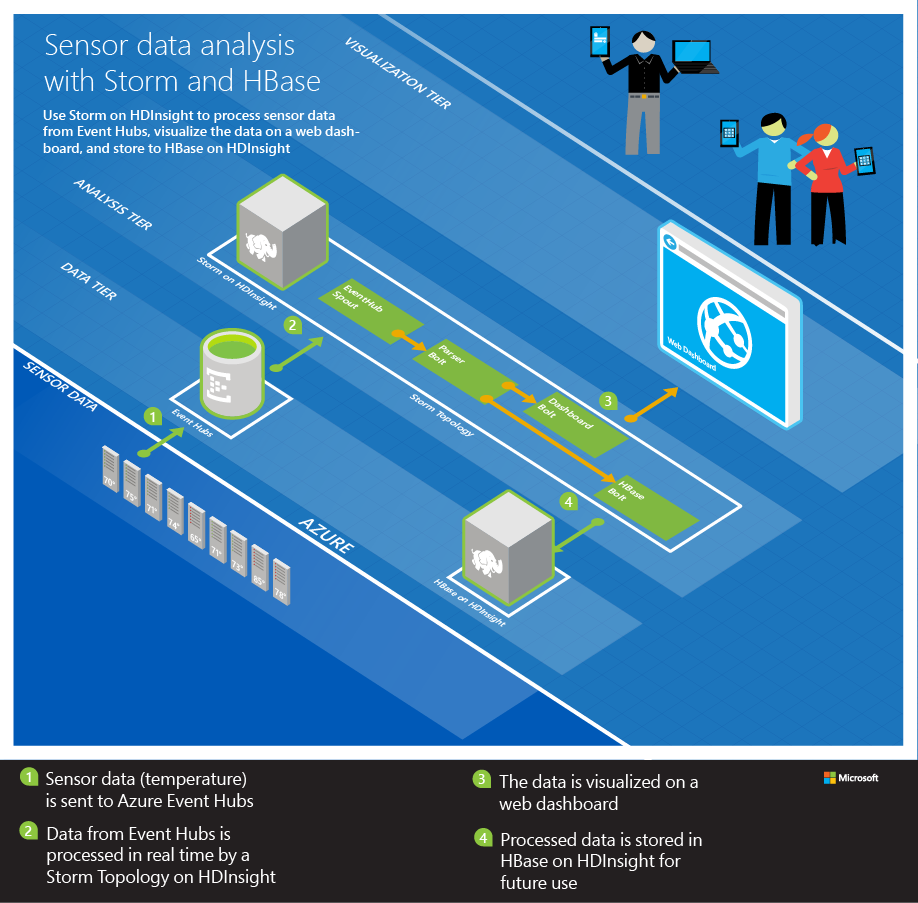

<properties
   pageTitle="Analysieren Sie Sensordaten mit Apache Storm und HBase | Microsoft Azure"
   description="Erfahren Sie, wie mit einem virtuellen Netzwerk eine Verbindung zu Apache Storm. Storm mit HBase auf Sensordaten Prozess aus einem Ereignis-Hub verwenden und die Darstellung des Kalenders mit D3.js."
   services="hdinsight"
   documentationCenter=""
   authors="Blackmist"
   manager="jhubbard"
   editor="cgronlun"/>

<tags
   ms.service="hdinsight"
   ms.devlang="java"
   ms.topic="article"
   ms.tgt_pltfrm="na"
   ms.workload="big-data"
   ms.date="09/20/2016"
   ms.author="larryfr"/>

# Analysieren Sie Sensordaten mit Apache Storm, Ereignis Hub und HBase in HDInsight (Hadoop) 

Erfahren Sie, wie Apache Storm auf HDInsight auf Sensordaten Prozess aus Azure Ereignis Hub verwenden, speichern es in Apache HBase auf HDInsight und Visualisieren sie mithilfe von D3.js als einer Azure Web App ausgeführt.

In diesem Dokument verwendete Vorlage Azure Ressourcenmanager veranschaulicht, wie mehrere Azure Ressourcen in einer Ressourcengruppe zu erstellen. Insbesondere wird ein Azure-virtuellen Netzwerk, zwei HDInsight Cluster (Storm und HBase) und einer Azure Web App erstellt. Eine node.js Implementierung eines Dashboards in Echtzeit Web wird automatisch in die Web app bereitgestellt.

> [AZURE.NOTE] Die Informationen in diesem Dokument und im Beispiel bereitgestellt wird, wurde getestet Linux-basierten HDInsight 3.3 und 3.4 Cluster-Versionen verwenden.

## Erforderliche Komponenten

* Ein Azure-Abonnement. Finden Sie [kostenlose Testversion Azure abrufen](http://azure.microsoft.com/documentation/videos/get-azure-free-trial-for-testing-hadoop-in-hdinsight/).

    > [AZURE.IMPORTANT] Sie können einen vorhandenen HDInsight Cluster ist nicht erforderlich. die Schritte in diesem Dokument erstellt die folgenden Ressourcen:
    >
    > * Ein Azure-virtuellen Netzwerk
    > * Eines Sturms auf HDInsight Cluster (Linux-basierten 2 Worker Knoten)
    > * Eine HBase auf HDInsight Cluster (Linux-basierten 2 Worker Knoten)
    > * Ein Azure Web App, die das Dashboard Web hostet

* [Node.js](http://nodejs.org/): wird verwendet, um eine Vorschau das Web-Dashboard lokal auf Ihrem Entwicklungsumgebung anzuzeigen.

* [Java und das JDK 1.7](http://www.oracle.com/technetwork/java/javase/downloads/index.html): verwendet, um die Suchtopologie Storm entwickeln.

* [Maven](http://maven.apache.org/what-is-maven.html): das Erstellen und Kompilieren des Projekts verwendet.

* [Git](http://git-scm.com/): verwendet, um das Projekt von GitHub herunterladen.

* __SSH__ -Client: Verbindung zum Linux-basierten HDInsight Zuordnungseinheiten verwendet. Weitere Informationen zum Verwenden von SSH mit HDInsight finden Sie unter den folgenden Dokumenten.

    * [Verwenden von SSH mit HDInsight aus einem Windows-client](hdinsight-hadoop-linux-use-ssh-windows.md)

    * [Verwenden von SSH mit HDInsight von einem Linux, Mac oder Unix-client](hdinsight-hadoop-linux-use-ssh-unix.md)

    > [AZURE.NOTE] Haben Sie auch Zugriff auf die `scp` Befehl, die zum Kopieren von Dateien zwischen der lokalen Entwicklungsumgebung und Cluster HDInsight mithilfe von SSH verwendet wird.

## Architektur

In diesem Beispiel besteht aus den folgenden Komponenten:

* **Azure Ereignis Hubs**: von Sensoren gesammelten Daten enthält. In diesem Beispiel ist eine Anwendung, vorausgesetzt, die die Daten erzeugt.

* **Storm auf HDInsight**: bietet in Echtzeit Verarbeitung von Daten aus dem Ereignis Hub.

* **Klicken Sie auf HDInsight HBase**: bietet einen beständigen NoSQL Datenspeicher für Daten nach der Verarbeitung Sprachen.

* **Azure virtuelle Netzwerkdienst**: ermöglicht die sichere Kommunikation zwischen den Storm auf HDInsight und HBase auf HDInsight Cluster.

    > [AZURE.NOTE] Ein virtuelles Netzwerk ist erforderlich, um die HBase Java-Client-API verwenden, nicht über einen öffentlichen Gateways für HBase Cluster verfügbar gemacht wird. Installieren von HBase und Storm Cluster in der gleichen virtuellen Netzwerk ermöglicht Storm Cluster (oder einem anderen System Netzwerk virtuelle) HBase direkten Zugriff auf Client-API verwenden.

* **Dashboard-Website**: eine Beispieldashboard, die Daten in Echtzeit Diagramme.

    * Die Website ist in Node.js, implementiert, sodass es auf einem beliebigen Client-Betriebssystem zum Testen ausgeführt werden kann, oder sie mit Azure Websites bereitgestellt werden können.

    * [Socket.IO](http://socket.io/) wird für die Kommunikation zwischen der Suchtopologie Storm und die Website in Echtzeit verwendet.

        > [AZURE.NOTE] Dies ist eine Implementierung detailliert beschrieben. Sie können eine beliebige Kommunikationsframework, z. B. unformatierten WebSockets oder SignalR verwenden.

    * [D3.js](http://d3js.org/) wird verwendet, um die Daten von Aktienkursen, die auf die Website gesendet wird.

> [AZURE.IMPORTANT] Zwei Cluster sind erforderlich, wie es keine unterstützte Methode zum Erstellen einer HDInsight Cluster für Storm und HBase gibt.

Der Suchtopologie Daten über Ereignis Hub mithilfe der [org.apache.storm.eventhubs.spout.EventHubSpout](http://storm.apache.org/releases/0.10.1/javadocs/org/apache/storm/eventhubs/spout/class-use/EventHubSpout.html) Klasse liest und schreibt Daten in die Verwendung der Klasse [org.apache.storm.hbase.bolt.HBaseBolt](https://storm.apache.org/javadoc/apidocs/org/apache/storm/hbase/bolt/class-use/HBaseBolt.html) HBase. Kommunikation mit der Website ist mithilfe von [socket.io-client.java](https://github.com/nkzawa/socket.io-client.java)lesbar.

Im folgenden finden ein Diagramm der Suchtopologie.

> [AZURE.NOTE] Dies ist eine sehr vereinfachte Ansicht der Suchtopologie. Zur Laufzeit wird eine Instanz der einzelnen Komponenten für jede Partition für das Ereignis Hub erstellt, die gelesen wird. Diese Instanzen auf den Knoten im Cluster verteilt werden, und Daten dazwischen weitergeleitet werden wie folgt aus:
>
> * Daten aus der Schnauze an den Parser ist Lastenausgleich.
> * Daten aus der Parser zum Dashboard und HBase sind nach Geräte-ID, gruppiert, damit Nachrichten aus dem gleichen Gerät immer auf dieselbe Komponente Datenfluss.

### Suchtopologiekomponenten

* **EventHub Schnauze**: Schnauze ist bereitgestellten als Teil der Apache Storm Version 0.10.0 und höher.

    > [AZURE.NOTE] In diesem Beispiel verwendete Ereignis Hubs Schnauze erfordert eine Storm unter HDInsight Clusterversion 3.3 oder 3.4. Informationen zur Verwendung von Ereignis Hubs mit einer älteren Version von Storm auf HDInsight finden Sie unter [Verarbeiten von Ereignissen aus Azure Ereignis Hubs mit Storm auf HDInsight](hdinsight-storm-develop-java-event-hub-topology.md).

* **ParserBolt.java**: die Daten, die von der Schnauze ausgegeben werden, ist unformatierten JSON und gelegentlich mehr als ein Ereignis nacheinander ausgegeben wird. Diese an veranschaulicht, wie die Daten von der Schnauze ausgegeben gelesen und es in einen neuen Stream ausgeben, als Tupel, die mehrere Felder enthält.

* **DashboardBolt.java**: Dies veranschaulicht, wie die Socket.io Client-Bibliothek für Java verwenden, um die Daten auf dem Dashboard Web in Echtzeit senden.

In diesem Beispiel wird das Framework [Wärmefluss](https://storm.apache.org/releases/0.10.0/flux.html) , sodass die Definition der Suchtopologie YAML Dateien enthalten ist. Es gibt zwei:

* __Nein-hbase.yaml__ - diese Datei beim Testen der Suchtopologie in Ihrer Entwicklungsumgebung verwenden. Es verwenden nicht HBase-Komponenten, da Sie nicht die HBase Java-API von außerhalb des virtuellen Netzwerks, die der Cluster befindet sich im zugreifen können.

* __mit hbase.yaml__ - diese Datei bei der Bereitstellung der Suchtopologie für Storm Cluster verwenden. Es verwendet HBase Komponenten, da er im gleichen virtuellen Netzwerk als HBase Cluster ausgeführt wird.

## Bereiten Sie Ihrer Umgebung vor

Bevor Sie dieses Beispiel verwenden möchten, müssen Sie ein Ereignis Hub Azure erstellen, das aus der Suchtopologie Storm liest.

### Konfigurieren von Ereignis-Hub

Ereignis-Hub ist die Datenquelle für dieses Beispiel. Gehen Sie folgendermaßen vor, um ein neues Ereignis Hub zu erstellen.

1. Wählen Sie im [Portal Azure](https://portal.azure.com) **+ neu** -> __Internet der Dinge__ -> __Ereignis Hubs__.

2. Klicken Sie auf das Blade __Namespace erstellen__ führen Sie die folgenden Aufgaben:

    1. Geben Sie einen __Namen__ für den Namespace ein.
    2. Wählen Sie eine Preisgestaltung Stufe aus. __Grundlegende__ reicht für dieses Beispiel.
    3. Wählen Sie den Azure __Abonnement__ verwenden.
    4. Wählen Sie eine vorhandene Ressourcengruppe oder erstellen Sie einen neuen.
    5. Wählen Sie den __Speicherort__ für das Ereignis Hub ein.
    6. Wählen Sie __die Pin zum Dashboard__aus, und klicken Sie dann auf __Erstellen__.

3. Wenn Sie der Erstellungsprozess abgeschlossen ist, wird das Ereignis Hubs Blade für Ihren Namespace angezeigt. Wählen Sie hier __+ Ereignis-Hub hinzufügen__. Klicken Sie auf das __Ereignis Hub erstellen__ Blade Geben Sie einen Namen für die __Sensordata__ aus, und wählen Sie dann __Erstellen__. Lassen Sie die anderen Felder die Standardwerte.

4. Wählen Sie das Ereignis Hubs Blade für Ihren Namespace __Hubs Ereignis__aus. Wählen Sie den Eintrag __Sensordata__ ein.

5. Wählen Sie aus dem Blade für das Ereignis Hub Sensordata __freigegebene Access-Richtlinien__ein. Verwenden Sie den Link __+ Hinzufügen__ , um die folgenden Richtlinien hinzuzufügen:

  	| Name der Richtlinie | Ansprüche |
  	| ----- | ----- |
  	| Geräte | Senden |
  	| Storm | Abhören |

5. Wählen Sie beide Richtlinien aus, und notieren Sie den __PRIMÄRSCHLÜSSEL__ -Wert. Sie benötigen den Wert für beide Richtlinien in späteren Schritten.

## Herunterladen und Konfigurieren des Projekts

Verwenden Sie die folgenden Projekt aus GitHub herunterladen.

    git clone https://github.com/Blackmist/hdinsight-eventhub-example

Nachdem der Befehl abgeschlossen ist, müssen Sie die folgenden Directory-Struktur:

    hdinsight-eventhub-example/
        TemperatureMonitor/ - this contains the topology
            resources/
                log4j2.xml - set logging to minimal
                no-hbase.yaml - topology definition for local testing
                with-hbase.yaml - topology definition that uses HBase in a virutal network
            src/ - the Java bolts
            dev.properties - contains configuration values for your environment
        dashboard/nodejs/ - this is the node.js web dashboard
        SendEvents/ - utilities to send fake sensor data

> [AZURE.NOTE] Dieses Dokument geht an alle Details zu den in diesem Beispiel-Code nicht; der Code wird jedoch vollständig kommentiert.

Öffnen Sie die Datei **hdinsight-eventhub-example/TemperatureMonitor/dev.properties** , und fügen Sie die Ereignis-Hub Informationen zu den folgenden Positionen:

    eventhub.read.policy.name: storm
    eventhub.read.policy.key: KeyForTheStormPolicy
    eventhub.namespace: YourNamespace
    eventhub.name: sensordata

> [AZURE.NOTE] In diesem Beispiel wird davon ausgegangen, dass Sie als Namen für die Richtlinie __Storm__ verwendet, die einen __Abhören__ Anspruch hat, und Ihre Ereignis Hub __Sensordata__benannt wird.

 Nachdem Sie diese Informationen hinzugefügt haben, speichern Sie die Datei.

## Kompilieren und lokal testen

Bevor Sie testen, müssen Sie das Dashboard, um die Ausgabe der Suchtopologie anzeigen und Daten zum Speichern in Hub Ereignis generieren starten.

> [AZURE.IMPORTANT] Die HBase Bestandteil dieses Suchtopologie ist nicht aktiv, wenn als Java-API für den Cluster HBase lokales, Testen von außerhalb des Azure-virtuellen Netzwerks zugegriffen werden kann, die die Cluster enthält.

### Starten Sie die Webanwendung

1. Öffnen Sie ein neues Eingabeaufforderungsfenster oder Terminal, wechseln Sie in dem **Hdinsight-Eventhub/Beispieldashboard**, und verwenden Sie den folgenden Befehl aus, um die von der Webanwendung benötigt Abhängigkeiten zu installieren:

        npm install

2. Verwenden Sie den folgenden Befehl aus, um die Webanwendung zu starten:

        node server.js

    Sie sollte eine Meldung wie die folgende angezeigt:

        Server listening at port 3000

2. Öffnen Sie einen Webbrowser, und geben Sie **Http://localhost:3000 /** als die Adresse. Sie sollten eine Seite ähnlich wie der folgende finden Sie unter:

    

    Lassen Sie dieses Eingabeaufforderungsfenster oder Terminal geöffnet. Nach dem Testen, verwenden Sie STRG + C, beenden Sie den Webserver.

### Starten Sie Generieren von Daten

> [AZURE.NOTE] Die Schritte in diesem Abschnitt verwenden Node.js, sodass sie auf einer beliebigen Plattform verwendet werden können. Andere Sprachbeispiele finden Sie unter **SendEvents** Verzeichnis.

1. Öffnen Sie eine neue Eingabeaufforderungsfenster, Shell oder Terminal, wechseln Sie zum **Hdinsight-Eventhub-Beispiel/SendEvents/Nodejs**, und verwenden Sie den folgenden Befehl aus, um die von der Anwendung benötigten Abhängigkeiten zu installieren:

        npm install

2. Öffnen Sie die **app.js** -Datei in einem Text-Editor, und fügen Sie die Ereignis-Hub Informationen, die Sie zuvor erworben haben:

        // ServiceBus Namespace
        var namespace = 'YourNamespace';
        // Event Hub Name
        var hubname ='sensordata';
        // Shared access Policy name and key (from Event Hub configuration)
        var my_key_name = 'devices';
        var my_key = 'YourKey';
    
    > [AZURE.NOTE] In diesem Beispiel wird davon ausgegangen, dass Sie __Sensordata__ als Namen von Ereignis Hub und __Geräte__ als Namen für die Richtlinie verwendet haben, die einen Antrag __Senden__ enthält.

2. Verwenden Sie den folgenden Befehl zum Einfügen von neue Einträge im Ereignis-Hub an:

        node app.js

    Mehrere Zeilen der Ausgabe sollte angezeigt werden, die an Ereignis Hub gesendeten Daten enthalten. Diese werden ähnlich wie die folgende angezeigt:

        {"TimeStamp":"2015-02-10T14:43.05.00320Z","DeviceId":"0","Temperature":7}
        {"TimeStamp":"2015-02-10T14:43.05.00320Z","DeviceId":"1","Temperature":39}
        {"TimeStamp":"2015-02-10T14:43.05.00320Z","DeviceId":"2","Temperature":86}
        {"TimeStamp":"2015-02-10T14:43.05.00320Z","DeviceId":"3","Temperature":29}
        {"TimeStamp":"2015-02-10T14:43.05.00320Z","DeviceId":"4","Temperature":30}
        {"TimeStamp":"2015-02-10T14:43.05.00320Z","DeviceId":"5","Temperature":5}
        {"TimeStamp":"2015-02-10T14:43.05.00320Z","DeviceId":"6","Temperature":24}
        {"TimeStamp":"2015-02-10T14:43.05.00320Z","DeviceId":"7","Temperature":40}
        {"TimeStamp":"2015-02-10T14:43.05.00320Z","DeviceId":"8","Temperature":43}
        {"TimeStamp":"2015-02-10T14:43.05.00320Z","DeviceId":"9","Temperature":84}

### Starten der Suchtopologie

2. Öffnen Sie eine neue Befehlszeile, Shell oder Terminal und ändern Sie Verzeichnisse zu __Hdinsight-Eventhub-Beispiel/TemperatureMonitor__, und verwenden Sie den folgenden Befehl zum Starten der Suchtopologie:

        mvn compile exec:java -Dexec.args="--local -R /no-hbase.yaml --filter dev.properties"
    
    Wenn Sie PowerShell verwenden, verwenden Sie die folgenden stattdessen:

        mvn compile exec:java "-Dexec.args=--local -R /no-hbase.yaml --filter dev.properties"

    > [AZURE.NOTE] Wenn Sie auf einem Linux/Unix/OS X-System sind und [in Ihrer Entwicklungsumgebung Storm installiert](http://storm.apache.org/releases/0.10.0/Setting-up-development-environment.html)haben, können Sie stattdessen die folgenden Befehle:
    >
    > `mvn compile package`
    > `storm jar target/WordCount-1.0-SNAPSHOT.jar org.apache.storm.flux.Flux --local -R /no-hbase.yaml`

    Hierdurch wird der Suchtopologie __keine hbase.yaml__ Datei im lokalen Modus definiert. Die Werte in der Datei __dev.properties__ enthaltenen Geben Sie die Verbindungsinformationen für Ereignis Hubs. Nach dem Start der Suchtopologie Einträge aus dem Ereignis Hub gelesen und sendet sie an dem Dashboard auf dem lokalen Computer ausgeführt. Finden Sie Linien im Web Dashboard, ähnlich wie die folgende angezeigt:

    

3. Verwenden Sie während der Ausführung des Dashboards, die `node app.js` Befehl aus den vorherigen Schritten, um neue Daten an Ereignis Hubs senden. Da die Temperaturwerte zufällig erzeugt werden, sollten im Diagramm aktualisieren, um umfangreiche Änderungen in Temperatur anzuzeigen.

    > [AZURE.NOTE] Muss im Verzeichnis __Hdinsight-Eventhub-Beispiel/SendEvents/Nodejs__ bei Verwendung der `node app.js` Befehl.

3. Beenden Sie nach der Überprüfung, dass dies funktioniert, der Suchtopologie mit STRG + C. STRG + C, können Sie um auch den lokale Webserver zu beenden.

## Erstellen Sie einen Cluster Storm und HBase

Akzeptieren, um die Suchtopologie für HDInsight ausgeführt, und aktivieren das HBase herstellt, müssen Sie einen neuen Storm Cluster und HBase Cluster erstellen. Die Schritte in diesem Abschnitt Verwenden einer [Vorlage Azure Ressourcenmanager](../resource-group-template-deploy.md) Azure-virtuellen Netzwerk und einem Storm und HBase Cluster im Netzwerk virtuelle Erstellen einer neuen. Die Vorlage wird auch einer Azure Web App erstellt und eine Kopie des Dashboards darin bereitstellt.

> [AZURE.NOTE] Ein virtuelles Netzwerk wird verwendet, sodass der Suchtopologie im Storm Cluster ausgeführten direkt mit dem HBase Cluster mithilfe der HBase Java-API kommunizieren kann.

In diesem Dokument verwendete Vorlage Ressourcenmanager befindet sich in einem öffentlichen Blob Container am __https://hditutorialdata.blob.core.windows.net/armtemplates/create-linux-based-hbase-storm-cluster-in-vnet.json__.

1. Klicken Sie auf die folgende Schaltfläche zum Anmelden bei Azure, und öffnen Sie die Vorlage Ressourcenmanager Azure-Portal.

    

2. Geben Sie aus dem **Parameter** Blade Folgendes ein:

    
    
    * **BASECLUSTERNAME**: Dieser Wert wird als Basis für die Storm Namen verwendet werden, und HBase Cluster. Beispielsweise erstellt __Hdi__ eingeben eines Sturms Cluster mit dem Namen __Storm-Hdi__ und ein HBase Cluster mit dem Namen __Hbase-Hdi__.
    * __CLUSTERLOGINUSERNAME__: der Benutzername Administrator für die Cluster Storm und HBase.
    * __CLUSTERLOGINPASSWORD__: das Kennwort für die Storm und HBase Cluster Administrator.
    * __SSHUSERNAME__: das SSH Benutzer, für die Cluster Storm und HBase zu erstellen.
    * __SSHPASSWORD__: das Kennwort für den Benutzer SSH für die Cluster Storm und HBase.
    * __Standort__: der Region, die in die Cluster erstellt wird.
    
    Klicken Sie auf __OK__ , um die Parameter zu speichern.
    
3. Verwenden Sie im Abschnitt __Ressourcengruppe__ zum Erstellen einer neuen Ressourcengruppe oder ein vorhandenes Layout auszuwählen.

4. Wählen Sie im Dropdownmenü __Gruppe Speicherort der Ressource__ am selben Speicherort entsprechend Ihrer Auswahl für den __Speicherort__ Parameter ein.

5. Wählen Sie die __Vertragsbedingungen__, und wählen Sie dann auf __Erstellen__.

6. Schließlich überprüfen Sie __Pin zum Dashboard__ , und wählen Sie dann auf __Erstellen__. Es dauert ungefähr 20 Minuten, um die Cluster zu erstellen.

Sobald die Ressourcen erstellt wurden, werden Sie zu einem Blade für die Ressourcengruppe umgeleitet, die die Cluster und Web Dashboard enthält.

> [AZURE.IMPORTANT] Beachten Sie, dass die Namen der HDInsight Cluster __Storm-BASENAME__ und __Hbase-BASENAME__, wobei BASENAME den Namen Sie in die Vorlage zur Verfügung gestellt. Diese Namen wird in späteren Schritten verwendet werden, bei der Verbindung mit dem Cluster. Beachten Sie auch, dass der Name der Website Dashboard __Basename-Dashboard__. Sie können dies später verwenden, wenn das Dashboard anzeigen.

## Konfigurieren der Dashboard herstellt

Daten auf dem Dashboard bereitgestellt als Web app gesendet werden, müssen Sie die folgende Zeile in der Datei __dev.properties__ ändern:

    dashboard.uri: http://localhost:3000

Ändern `http://localhost:3000` zu `http://BASENAME-dashboard.azurewebsites.net` und speichern Sie die Datei. Ersetzen Sie __BASENAME__ durch den im vorhergehenden Schritt eingegebenen Namen. Sie können auch die zuvor erstellte, aktivieren Sie das Dashboard und Anzeigen der URL Ressourcengruppe verwenden.

## Erstellen Sie die HBase-Tabelle

Erstellen wir eine Tabelle, um das Speichern von Daten in HBase. Im Allgemeinen für Ressourcen vorab erstellen möchten, denen Storm zu schreiben muss ist, als Versuch erstellen Ressourcen aus innerhalb einer Suchtopologie Storm mehrere, verteilte Kopien des Codes versuchen, dieselbe Ressource erstellen zu können. Die Ressourcen außerhalb der Suchtopologie erstellen und einfach Storm für gelesen/geschrieben und Analytics verwenden.

1. Verwenden Sie zum Herstellen einer Verbindung mit dem Benutzer SSH und das Kennwort, die Sie für die Vorlage während der Clustererstellung bereitgestellt HBase Cluster mit SSH. Beispielsweise, Herstellen einer Verbindung mithilfe der `ssh` Befehl, möchten Sie die folgende Syntax verwenden:

        ssh USERNAME@hbase-BASENAME-ssh.azurehdinsight.net
    
    Ersetzen Sie in diesem Befehl __Benutzername__ , mit dem SSH Benutzernamen, die, den Sie zur Verfügung gestellt, wenn der Cluster und __BASENAME__ mit diesem Namen zu erstellen, die Sie zur Verfügung gestellt. Wenn Sie dazu aufgefordert werden, geben Sie das Kennwort für den Benutzer SSH aus.

2. Starten Sie die Sitzung SSH die Verwaltungsshell HBase.

        hbase shell
    
    Sobald die Verwaltungsshell geladen, sehen Sie ein `hbase(main):001:0>` auffordern.

3. Geben Sie über die Shell HBase zum Erstellen einer Tabelle zum Speichern der Sensordaten den folgenden Befehl aus:

        create 'SensorData', 'cf'

4. Überprüfen Sie, dass die Tabelle erstellt wurde, indem Sie mit dem folgenden Befehl aus:

        scan 'SensorData'
        
    Dies gibt Informationen ähnlich wie im folgenden Beispiel, das angibt, dass es 0 Zeilen in der Tabelle zurück.
    
        ROW                   COLUMN+CELL                                       0 row(s) in 0.1900 seconds

5. Geben Sie Folgendes ein, um die Verwaltungsshell HBase beenden:

        exit

## Konfigurieren der HBase an

Um HBase aus dem Cluster Storm schreiben, müssen Sie die HBase herstellt mit den Konfigurationsdetails Ihrer HBase Cluster bereitstellen. Die einfachste Möglichkeit dazu ist die __Hbase-site.xml__ aus dem Cluster herunterladen und in Ihrem Projekt einzuschließen. Sie müssen auch mehrere Abhängigkeiten in der Datei __pom.xml__ kommentieren, die welche die Storm-Hbase Komponente und erforderlichen Abhängigkeiten geladen.

> [AZURE.IMPORTANT] Sie müssen auch die auf Ihre Storm auf HDInsight Cluster 3.3 oder 3.4 Cluster bereitgestellte Storm-hbase.jar Datei herunterladen; Diese Version wird kompiliert, um die Arbeit mit HBase 1.1.x, die für HBase auf HDInsight 3.3 und 3.4 Cluster verwendet wird. Wenn Sie eine Komponente Storm-Hbase an anderer Stelle verwenden, können sie in einer älteren Version von HBase kompiliert werden.

### Laden Sie die Hbase-site.xml

Verwenden Sie ein Eingabeaufforderungsfenster SCP zum Herunterladen der Datei __Hbase-site.xml__ aus dem Cluster. Ersetzen Sie im folgenden Beispiel __Benutzername__ , mit dem SSH-Benutzer, die, den Sie zur Verfügung gestellt, wenn der Cluster und __BASENAME__ mit diesem Namen zu erstellen, die Sie zuvor angegeben. Wenn Sie dazu aufgefordert werden, geben Sie das Kennwort für den Benutzer SSH aus. Ersetzen Sie die `/path/to/TemperatureMonitor/resources/hbase-site.xml` durch den Pfad zu dieser Datei im Projekt TemperatureMonitor.

    scp USERNAME@hbase-BASENAME-ssh.azurehdinsight.net:/etc/hbase/conf/hbase-site.xml /path/to/TemperatureMonitor/resources/hbase-site.xml

Dadurch wird die __Hbase-site.xml__ angegebenen Pfad herunterladen.

### Herunterladen Sie und installieren Sie die Komponente Storm-hbase

1. Verwenden Sie ein Eingabeaufforderungsfenster SCP zum Herunterladen der __Storm-hbase.jar__ -Datei aus dem Storm Cluster. Ersetzen Sie im folgenden Beispiel __Benutzername__ , mit dem SSH-Benutzer, die, den Sie zur Verfügung gestellt, wenn der Cluster und __BASENAME__ mit diesem Namen zu erstellen, die Sie zuvor angegeben. Wenn Sie dazu aufgefordert werden, geben Sie das Kennwort für den Benutzer SSH aus.

        scp USERNAME@storm-BASENAME-ssh.azurehdinsight.net:/usr/hdp/current/storm-client/contrib/storm-hbase/storm-hbase*.jar .

    Es wird eine Datei namens herunterladen `storm-hbase-####.jar`, wobei ### ist die Versionsnummer der Storm für diesen Cluster. Notieren Sie sich diese Nummer ein, wie er später verwendet wird.

2. Verwenden Sie den folgenden Befehl aus, um diese Komponente in der lokalen Maven Repository auf Ihre Entwicklungsumgebung zu installieren. Dies ermöglicht Maven, um das Paket beim Kompilieren des Projekts zu finden. Ersetzen Sie __####__ mit der Versionsnummer in den Dateinamen enthalten.

        mvn install:install-file -Dfile=storm-hbase-####.jar -DgroupId=org.apache.storm -DartifactId=storm-hbase -Dversion=#### -Dpackaging=jar
    
    Wenn Sie PowerShell verwenden, verwenden Sie den folgenden Befehl aus:

        mvn install:install-file "-Dfile=storm-hbase-####.jar" "-DgroupId=org.apache.storm" "-DartifactId=storm-hbase" "-Dversion=####" "-Dpackaging=jar"

### Aktivieren Sie die Komponente Storm-Hbase im Projekt

1. Öffnen Sie die Datei __TemperatureMonitor/pom.xml__ , und löschen Sie die folgenden Zeilen:

        <!-- uncomment this section to enable the hbase-bolt
        end comment for hbase-bolt section -->
    
    > [AZURE.IMPORTANT] Löschen Sie nur diese beiden Zeilen; Löschen Sie eine oder mehrere der Zeilen dazwischen.
    
    Dadurch werden mehrere Komponenten, die erforderlich sind, bei der Kommunikation mit HBase mithilfe der Hbase herstellt.

2. Suchen Sie die folgenden Zeilen, und Ersetzen Sie __####__ mit der Versionsnummer der Storm-Hbase-Datei, die Sie zuvor heruntergeladen haben.

        <dependency>
            <groupId>org.apache.storm</groupId>
            <artifactId>storm-hbase</artifactId>
            <version>####</version>
        </dependency>

    > [AZURE.IMPORTANT] Die Versionsnummer muss die Version übereinstimmen, die Sie bei der Installation von der Komponente in der lokalen Maven Repository verwendet, wie Maven diese Informationen verwendet, laden Sie die Komponente beim Erstellen des Projekts.

2. Speichern Sie die Datei __pom.xml__ .

## Erstellen Sie, Paket und Bereitstellen die Lösung HDInsight

Gehen Sie folgendermaßen vor in Ihrer Entwicklungsumgebung der Suchtopologie Storm zum Storm Cluster bereitstellen.

1. Verwenden Sie den folgenden Befehl aus dem Verzeichnis __TemperatureMonitor__ um einen neuen Build und JAR-Paket aus Ihrem Projekt erstellen:

        mvn clean compile package

    Dadurch wird eine Datei namens **TemperatureMonitor-1.0-SNAPSHOT.jar** im Verzeichnis **Ziel** des Projekts erstellt.

2. Verwenden Sie zum Hochladen der Datei __TemperatureMonitor-1.0-SNAPSHOT.jar__ zum Cluster Storm scp. Ersetzen Sie im folgenden Beispiel __Benutzername__ , mit dem SSH-Benutzer, die, den Sie zur Verfügung gestellt, wenn der Cluster und __BASENAME__ mit diesem Namen zu erstellen, die Sie zuvor angegeben. Wenn Sie dazu aufgefordert werden, geben Sie das Kennwort für den Benutzer SSH aus.

        scp target\TemperatureMonitor-1.0-SNAPSHOT.jar USERNAME@storm-BASENAME-ssh.azurehdinsight.net:TemperatureMonitor-1.0-SNAPSHOT.jar
    
    > [AZURE.NOTE] Zum Hochladen der Datei, einige Minuten dauern, wie er, mehrere Megabyte groß angezeigt wird.

    Verwenden Sie scp zum Hochladen der Datei __dev.properties__ , wie diese Informationen zum Verbinden mit Ereignis Hubs und dem Dashboard enthalten sind.

        scp dev.properties USERNAME@storm-BASENAME-ssh.azurehdinsight.net:dev.properties

3. Sobald die Dateien hochgeladen wurden, verbinden Sie mit dem Cluster SSH verwenden.

        ssh USERNAME@storm-BASENAME-ssh.azurehdinsight.net

4. Verwenden Sie den folgenden Befehl aus der Sitzung SSH der Suchtopologie zu starten.

        storm jar TemperatureMonitor-1.0-SNAPSHOT.jar org.apache.storm.flux.Flux --remote -R /with-hbase.yaml --filter dev.properties
    
    Hierdurch wird der Suchtopologie mit der Suchtopologie Definition in der Datei __mit hbase.yaml__ und die Konfigurationswerte in der Datei __dev.properties__ .

3. Nachdem der Suchtopologie gestartet hat, öffnen Sie einen Browser zu der Website, die Sie auf Azure veröffentlicht, verwenden Sie dann die `node app.js` Befehl zum Senden von Daten an Ereignis Verteiler. Finden Sie das Web-Dashboard aktualisieren, um die Informationen anzuzeigen.

    

## HBase Daten anzeigen

Nachdem Sie die Daten in der Suchtopologie mit gesendet haben `node app.js`, gehen Sie folgendermaßen vor, um eine Verbindung mit HBase, und stellen Sie sicher, dass die Daten der Tabelle zuvor erstellten geschrieben.

1. Verwenden Sie für die Verbindung mit dem Cluster HBase SSH ein.

        ssh USERNAME@hbase-BASENAME-ssh.azurehdinsight.net

2. Starten Sie die Sitzung SSH die Verwaltungsshell HBase.

        hbase shell
    
    Sobald die Verwaltungsshell geladen, sehen Sie ein `hbase(main):001:0>` auffordern.

2. Anzeigen von Zeilen aus der Tabelle:

        scan 'SensorData'
        
    Dadurch sollten Informationen ähnlich wie der folgende, zurückgegeben, die angibt, dass es 0 Zeilen in der Tabelle.
    
        hbase(main):002:0> scan 'SensorData'
        ROW                             COLUMN+CELL
        \x00\x00\x00\x00               column=cf:temperature, timestamp=1467290788277, value=\x00\x00\x00\x04
        \x00\x00\x00\x00               column=cf:timestamp, timestamp=1467290788277, value=2015-02-10T14:43.05.00320Z
        \x00\x00\x00\x01               column=cf:temperature, timestamp=1467290788348, value=\x00\x00\x00M
        \x00\x00\x00\x01               column=cf:timestamp, timestamp=1467290788348, value=2015-02-10T14:43.05.00320Z
        \x00\x00\x00\x02               column=cf:temperature, timestamp=1467290788268, value=\x00\x00\x00R
        \x00\x00\x00\x02               column=cf:timestamp, timestamp=1467290788268, value=2015-02-10T14:43.05.00320Z
        \x00\x00\x00\x03               column=cf:temperature, timestamp=1467290788269, value=\x00\x00\x00#
        \x00\x00\x00\x03               column=cf:timestamp, timestamp=1467290788269, value=2015-02-10T14:43.05.00320Z
        \x00\x00\x00\x04               column=cf:temperature, timestamp=1467290788356, value=\x00\x00\x00>
        \x00\x00\x00\x04               column=cf:timestamp, timestamp=1467290788356, value=2015-02-10T14:43.05.00320Z
        \x00\x00\x00\x05               column=cf:temperature, timestamp=1467290788326, value=\x00\x00\x00\x0D
        \x00\x00\x00\x05               column=cf:timestamp, timestamp=1467290788326, value=2015-02-10T14:43.05.00320Z
        \x00\x00\x00\x06               column=cf:temperature, timestamp=1467290788253, value=\x00\x00\x009
        \x00\x00\x00\x06               column=cf:timestamp, timestamp=1467290788253, value=2015-02-10T14:43.05.00320Z
        \x00\x00\x00\x07               column=cf:temperature, timestamp=1467290788229, value=\x00\x00\x00\x12
        \x00\x00\x00\x07               column=cf:timestamp, timestamp=1467290788229, value=2015-02-10T14:43.05.00320Z
        \x00\x00\x00\x08               column=cf:temperature, timestamp=1467290788336, value=\x00\x00\x00\x16
        \x00\x00\x00\x08               column=cf:timestamp, timestamp=1467290788336, value=2015-02-10T14:43.05.00320Z
        \x00\x00\x00\x09               column=cf:temperature, timestamp=1467290788246, value=\x00\x00\x001
        \x00\x00\x00\x09               column=cf:timestamp, timestamp=1467290788246, value=2015-02-10T14:43.05.00320Z
        10 row(s) in 0.1800 seconds

    > [AZURE.NOTE] Scan-Vorgang wird nur maximal 10 Zeilen aus der Tabelle zurück.

## Löschen der Cluster

[AZURE.INCLUDE [delete-cluster-warning](../../includes/hdinsight-delete-cluster-warning.md)]

Wenn die Cluster, den Speicher und die Web app auf einmal löschen möchten, löschen Sie die Ressourcengruppe aus, die sie enthält.

## Nächste Schritte

Sie verfügen jetzt gelernt, Storm zum Lesen von Daten aus dem Ereignis Hubs in HBase zu speichern und die Informationen auf einer externen Dashboard mithilfe von Socket.io und D3.js darstellen.

* Weitere Beispiele Storm Topologien mit HDInsight finden Sie unter:

    * [Beispiel für Topologien für Storm auf HDInsight](hdinsight-storm-example-topology.md)

* Weitere Informationen zu Apache Storm finden Sie unter der [Apache Storm](https://storm.incubator.apache.org/) -Website.

* Weitere Informationen zu HBase HDInsight finden Sie unter der [HBase mit HDInsight Übersicht](hdinsight-hbase-overview.md).

* Weitere Informationen zu Socket.io finden Sie unter der Website [socket.io](http://socket.io/) .

* Weitere Informationen zu D3.js finden Sie unter [D3.js - Daten leistungsgesteuert Dokumente](http://d3js.org/).

* Informationen zum Erstellen von Topologien Java finden Sie unter [Java entwickeln Topologien für Apache Storm auf HDInsight](hdinsight-storm-develop-java-topology.md).

* Informationen zum Erstellen von .NET Topologien finden Sie unter [entwickeln C#-Topologien für Apache Storm auf HDInsight mithilfe von Visual Studio](hdinsight-storm-develop-csharp-visual-studio-topology.md).

[azure-portal]: https://portal.azure.com
