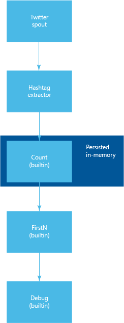

<properties
   pageTitle="Twitter-beliebte Themen mit Apache Storm auf HDInsight | Microsoft Azure"
   description="Erfahren Sie, wie Sie Trident, um zu einer Suchtopologie Apache Storm erstellen, die auf Grundlage des Hashtags Twitter beliebte Themen bestimmt."
   services="hdinsight"
   documentationCenter=""
   authors="Blackmist"
   manager="jhubbard"
   editor="cgronlun"
    tags="azure-portal"/>

<tags
   ms.service="hdinsight"
   ms.devlang="java"
   ms.topic="article"
   ms.tgt_pltfrm="na"
   ms.workload="big-data"
   ms.date="09/27/2016"
   ms.author="larryfr"/>

#Bestimmen Sie, beliebte Twitter-Themen mit Apache Storm auf HDInsight

Erfahren Sie, wie Sie Trident, um zu einer Suchtopologie Storm erstellen, der beliebte Themen (Hash Tags) auf Twitter bestimmt.

Trident ist eine hohe Abstraktionsebene, die Tools wie Verknüpfungen, Aggregationen, gruppieren, Filtern und Funktionen bereitstellt. Darüber hinaus fügt Trident Primitives für eine dynamische, inkrementell Verarbeitung ausführen. In diesem Beispiel wird veranschaulicht, wie Sie ein Suchtopologie mit einer benutzerdefinierten Schnauze, (Funktion) und mehrere integrierte Funktionen von Trident bereitgestellten erstellen können.

> [AZURE.NOTE] In diesem Beispiel basiert stark auf das Beispiel [Trident Storm](https://github.com/jalonsoramos/trident-storm) durch Juan Alonso.

##Anforderungen

* <a href="http://www.oracle.com/technetwork/java/javase/downloads/index.html" target="_blank">Java und JDK 1.7</a>

* <a href="http://maven.apache.org/what-is-maven.html" target="_blank">Maven</a>

* <a href="http://git-scm.com/" target="_blank">Git</a>

* Ein Entwickler Twitter-Konto

##Herunterladen des Projekts

Verwenden Sie den folgenden Code, um das Projekt lokal duplizieren.

    git clone https://github.com/Blackmist/TwitterTrending

##Suchtopologie

Der Suchtopologie für dieses Beispiel sieht wie folgt aus:

> [AZURE.NOTE] Dies ist eine vereinfachte Ansicht der Suchtopologie. Mehrere Instanzen Komponenten werden auf den Knoten im Cluster verteilt werden.

Der Trident-Code, der Suchtopologie implementiert, wird wie folgt aus:

    topology.newStream("spout", spout)
        .each(new Fields("tweet"), new HashtagExtractor(), new Fields("hashtag"))
        .groupBy(new Fields("hashtag"))
        .persistentAggregate(new MemoryMapState.Factory(), new Count(), new Fields("count"))
        .newValuesStream()
        .applyAssembly(new FirstN(10, "count"))
        .each(new Fields("hashtag", "count"), new Debug());

Dieser Code führt Folgendes aus:

1. Erstellt einen neuen Stream aus der Schnauze. Der Schnauze ruft Tweets von Twitter und filtert sie für bestimmte Stichwörter (Love, Musik und Kaffee in diesem Beispiel).

2. HashtagExtractor, eine benutzerdefinierte Funktion, wird verwendet, um Hash Kategorien aus jeder Tweet zu extrahieren. Diese werden in den Stream ausgegeben.

3. Der Stream ist gruppiert nach Kategorie Hash und an einem Aggregator übergeben. Dieser Aggregator erstellt eine zählen, wie oft jede Kategorie Hash aufgetreten ist. Diese Daten werden im Arbeitsspeicher beibehalten. Schließlich werden ein neuer Stream ausgegeben, die das Hash Tag und die Anzahl enthält.

4. Da wir nur die am häufigsten verwendeten Hash-Tags für eine angegebene Anzahl Tweets interessiert sind, wird die **FirstN** Assembly angewendet, um nur die obersten 10 Werte, basierend auf dem Anzahlfeld zurückzukehren.

> [AZURE.NOTE] Als der Schnauze und HashtagExtractor verwenden wir die Funktionalität für integrierte Trident.
>
> Informationen zu integrierten Operationen finden Sie unter <a href="https://storm.apache.org/apidocs/storm/trident/operation/builtin/package-summary.html" target="_blank">Paket storm.trident.operation.builtin</a>.
>
> Trident Status Implementierungen als MemoryMapState finden Sie hier:
>
> * <a href="https://github.com/fhussonnois/storm-trident-elasticsearch" target="_blank">Flexible Storm Trident-Suche</a>
>
> * <a href="https://github.com/kstyrc/trident-redis" target="_blank">Trident-redis</a>

###Der Schnauze

Der Schnauze, **TwitterSpout**, verwendet <a href="http://twitter4j.org/en/" target="_blank">Twitter4j</a> zum Abrufen von Tweets von Twitter. (Love, Musik und Kaffee in diesem Beispiel), wird ein Filter erstellt, und die eingehende Tweets (Status) mit dem Filter übereinstimmenden werden in eine verknüpfte blockierte Warteschlange gespeichert. (Weitere Informationen finden Sie unter <a href="http://docs.oracle.com/javase/7/docs/api/java/util/concurrent/LinkedBlockingQueue.html" target="_blank">Class LinkedBlockingQueue</a>.) Schließlich werden Elemente aus der Warteschlange abgerufen und in der Suchtopologie ausgegeben.

###Die HashtagExtractor

Zum Extrahieren von Tags Hash wird <a href="http://twitter4j.org/javadoc/twitter4j/EntitySupport.html#getHashtagEntities--" target="_blank">GetHashtagEntities</a> verwendet, um alle Hash Tags abzurufen, die in der Tweet enthalten sind. Diese werden dann in den Stream ausgegeben.

##Twitter aktivieren

Gehen Sie folgendermaßen vor, eine neue Twitter-Anwendung zu registrieren und erhalten die Consumer und Access token Informationen zum Lesen von Twitter erforderlich sind:

1. Wechseln Sie zur <a href="https://apps.twitter.com" target="_blank">Twitter-Apps</a> , und klicken Sie auf die Schaltfläche **neue app erstellen** . Beim Ausfüllen des Formulars, lassen Sie das Feld **URL Rückruf** leer.

2. Wenn die app erstellt wurde, klicken Sie auf der Registerkarte **Tasten und Access Token** .

3. Kopieren Sie die **Taste Consumer** und **Consumer geheim** Informationen ein.

4. Wählen Sie am unteren Rand der Seite Wenn keine Token vorhanden **Erstellen Meine Access Token** aus. Wenn die Token erstellt wurden, kopieren Sie die **Access-Token** und **Access Token geheim** Informationen.

5. Öffnen Sie im Projekt **TwitterSpoutTopology** , die, das Sie zuvor geklont die Datei **resources/twitter4j.properties** , fügen Sie die Informationen aus den in den vorherigen Schritten hinzu, und speichern Sie die Datei.

##Erstellen der Suchtopologie

Verwenden Sie zum Erstellen des Projekts mit dem folgenden Code ein:

        cd [directoryname]
        mvn compile

##Testen der Suchtopologie

Verwenden Sie den folgenden Befehl aus, um der Suchtopologie lokal testen:

    mvn compile exec:java -Dstorm.topology=com.microsoft.example.TwitterTrendingTopology

Nach dem Start von der Suchtopologie sollte angezeigt werden, die den Hash enthält Informationen zum Debuggen tags und zählt die Ausgabe nach der topologieaktivierung. Die Ausgabe sollte ähnlich wie die folgende angezeigt:

    DEBUG: [Quicktellervalentine, 7]
    DEBUG: [GRAMMYs, 7]
    DEBUG: [AskSam, 7]
    DEBUG: [poppunk, 1]
    DEBUG: [rock, 1]
    DEBUG: [punkrock, 1]
    DEBUG: [band, 1]
    DEBUG: [punk, 1]
    DEBUG: [indonesiapunkrock, 1]

##Nächste Schritte

Jetzt, da Sie die Suchtopologie lokal getestet haben, erfahren Sie, wie der Suchtopologie bereitgestellt: [Bereitstellen und Verwalten von Apache Storm Topologien auf HDInsight](hdinsight-storm-deploy-monitor-topology.md).

In den folgenden Themen Storm interessiert möglicherweise auch:

* [Entwickeln Sie Java Topologien für Storm auf HDInsight mithilfe von Maven](hdinsight-storm-develop-java-topology.md)

* [Entwickeln Sie C#-Topologien für Storm auf HDInsight mithilfe von Visual Studio](hdinsight-storm-develop-csharp-visual-studio-topology.md)

Weitere Storm Beispiele für HDinsight:

* [Beispiel für Topologien für Storm auf HDInsight](hdinsight-storm-example-topology.md)
