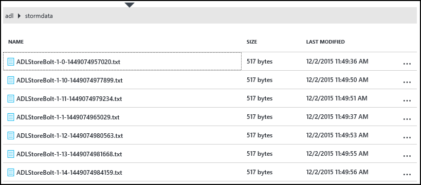

<properties
pageTitle="Verwenden Sie Azure Lake Datenspeicher mit Apache Storm auf Azure HDInsight"
description="Informationen Sie zum Schreiben von Daten in Azure Lake Datenspeicher aus einer Suchtopologie Apache Storm unter HDInsight. Dieses Dokument, und die zugehörigen Beispiel, führen Sie vor, wie die Komponente HdfsBolt verwendet werden kann, sowie das Schreiben in Lake Datenspeicher."
services="hdinsight"
documentationCenter="na"
authors="Blackmist"
manager="jhubbard"
editor="cgronlun"/>

<tags
ms.service="hdinsight"
ms.devlang="na"
ms.topic="article"
ms.tgt_pltfrm="na"
ms.workload="big-data"
ms.date="09/06/2016"
ms.author="larryfr"/>

#Verwenden Sie Azure Lake Datenspeicher mit Apache Storm mit HDInsight

Azure Lake Datenspeicher ist eine HDFS kompatibel Cloud-Speicherdienst, die hohen Durchsatz, Verfügbarkeit, Zuverlässigkeit und Zuverlässigkeit für Ihre Daten enthält. In diesem Dokument lernen Sie mit einer Suchtopologie Java-basierte Storm Schreiben von Daten in Azure Lake Datenspeicher mithilfe der [HdfsBolt](http://storm.apache.org/javadoc/apidocs/org/apache/storm/hdfs/bolt/HdfsBolt.html) -Komponente, die als Teil des Apache Storm bereitgestellt wird.

> [AZURE.IMPORTANT] Die in diesem Dokument verwendeten Beispiel Suchtopologie basiert auf Komponenten, die mit Storm auf HDInsight Cluster enthalten sind und dass möglicherweise erfordern Änderung Azure Lake Datenspeicher bei Verwendung mit anderen Apache Storm Cluster konzipiert.

##Erforderliche Komponenten

* [Java JDK 1.7](https://www.oracle.com/technetwork/java/javase/downloads/jdk7-downloads-1880260.html) oder höher
* [Maven 3.x](https://maven.apache.org/download.cgi)
* Ein Azure-Abonnement
* Eines Sturms auf HDInsight Clusterversion 3,2. Führen Sie die Schritte zum Erstellen eines neuen Sturms auf HDInsight Cluster im Dokument [mithilfe von HDInsight verwenden, mit dem Datenspeicher Azure](../data-lake-store/data-lake-store-hdinsight-hadoop-use-portal.md) . Die Schritte in diesem Dokument führt Sie durch die Erstellung eines neuen HDInsight Cluster und Azure Lake Datenspeicher.  

    > [AZURE.IMPORTANT] Beim Erstellen des HDInsight Clusters müssen Sie __Storm__ als Clustertyp und __3,2__ als die Version auswählen. Das Betriebssystem kann Windows oder Linux sein.  

###Konfigurieren der Umgebungsvariablen

Die folgenden Umgebungsvariablen möglicherweise beim Installieren von Java und JDK auf Ihrer Entwicklungsarbeitsstation festgelegt werden. Sie sollten, dass sie vorhanden sind und die richtigen Werte für Ihr System enthalten.

* __JAVA_HOME__ - sollte zeigen, zu dem Verzeichnis, in dem die Java Runtime-Umgebung (JRE) installiert ist. Angenommen, in einer Verteilung Unix oder Linux es sollte einen Wert enthalten ähnliche `/usr/lib/jvm/java-7-oracle`. Unter Windows, hätte er einen Wert ähnlich wie `c:\Program Files (x86)\Java\jre1.7`.

* __PATH__ - sollte die folgenden Pfade enthalten:

    * __JAVA\_Start__ (oder die entsprechende Pfadangabe)
    
    * __JAVA\_HOME\bin__ (oder die entsprechende Pfadangabe)
    
    * Das Verzeichnis, in dem Maven installiert ist

##Implementierung der Suchtopologie

Das Beispiel in diesem Dokument verwendeten in Java geschrieben ist, und verwendet die folgenden Komponenten:

* __TickSpout__: die von anderen Komponenten in der Suchtopologie verwendeten Daten generiert.

* __PartialCount__: zählt die vom TickSpout generierte Ereignisse.

* __FinalCount__: Aggregate zählen von Daten aus PartialCount.

* __ADLStoreBolt__: schreibt Daten in Azure Lake Datenspeicher mit der Komponente [HdfsBolt](http://storm.apache.org/javadoc/apidocs/org/apache/storm/hdfs/bolt/HdfsBolt.html) .

Das Projekt mit diesem Suchtopologie ist von [https://github.com/Azure-Samples/hdinsight-storm-azure-data-lake-store](https://github.com/Azure-Samples/hdinsight-storm-azure-data-lake-store)zum Download zur Verfügung.

###Grundlegendes zu ADLStoreBolt

Der ADLStoreBolt ist, den Namen für die Instanz HdfsBolt in der Suchtopologie, die in Azure Daten Lake schreibt verwendet wird. Dies ist keine spezielle Version von Microsoft erstellte HdfsBolt; Es beruht jedoch auf Core-Website Konfigurationswerte sowie Hadoop-Komponenten, die mit Azure HDInsight auf Kommunikation mit Lake Daten enthalten sind.

Beim Erstellen eines HDInsight Clusters können Sie es insbesondere mit einer Azure Lake Datenspeicher zuordnen. Dies schreibt Einträge in Core-Website für den Lake-Datenspeicher, die Sie ausgewählt haben, die von Komponenten wie Hadoop-Client und Hadoop-Hdfs zum Aktivieren der Kommunikation mit Lake Datenspeicher verwendet werden.

> [AZURE.NOTE] Microsoft hat eine bestimmte Abteilung Code der Apache Hadoop und Storm Projekte, die Kommunikation mit Azure Lake Datenspeicher und Azure Blob-Speicher ermöglicht, aber dieses Feature nicht standardmäßig in anderen Verteilung Hadoop und Storm einbezogen werden.

Die Konfiguration für HdfsBolt in der Suchtopologie ist wie folgt aus:

    // 1. Create sync and rotation policies to control when data is synched
    //    (written) to the file system and when to roll over into a new file.
    SyncPolicy syncPolicy = new CountSyncPolicy(1000);
    FileRotationPolicy rotationPolicy = new FileSizeRotationPolicy(0.5f, Units.KB);
    // 2. Set the format. In this case, comma delimited
    RecordFormat recordFormat = new DelimitedRecordFormat().withFieldDelimiter(",");
    // 3. Set the directory name. In this case, '/stormdata/'
    FileNameFormat fileNameFormat = new DefaultFileNameFormat().withPath("/stormdata/");
    // 4. Create the bolt using the previously created settings,
    //    and also tell it the base URL to your Data Lake Store.
    // NOTE! Replace 'MYDATALAKE' below with the name of your data lake store.
    HdfsBolt adlsBolt = new HdfsBolt()
        .withFsUrl("adl://MYDATALAKE.azuredatalakestore.net/")
        .withRecordFormat(recordFormat)
        .withFileNameFormat(fileNameFormat)
        .withRotationPolicy(rotationPolicy)
        .withSyncPolicy(syncPolicy);
    // 4. Give it a name and wire it up to the bolt it accepts data
    //    from. NOTE: The name used here is also used as part of the
    //    file name for the files written to Data Lake Store.
    builder.setBolt("ADLStoreBolt", adlsBolt, 1)
      .globalGrouping("finalcount");
      
Wenn Sie mit der Verwendung von HdfsBolt vertraut sind, werden Sie feststellen, dass diese alle ziemlich standard-Konfiguration, eine Ausnahme bilden jedoch die URL verwendet wird. Die URL stellt den Pfad werden im Stammordner Ihrer Azure Lake Datenspeicher bereit.

Da Schreiben in Lake Datenspeicher HdfsBolt verwendet und nur eine URL-Änderung ist, sollten Sie möglicherweise, nehmen alle vorhandenen Suchtopologie, die in HDFS oder WASB mit HdfsBolt schreibt und auf einfache Weise ändern, um Azure Lake Datenspeicher verwenden.

##Erstellen und Verpacken der Suchtopologie

1. Herunterladen des Projekts Beispiel von [https://github.com/Azure-Samples/hdinsight-storm-azure-data-lake-store](https://github.com/Azure-Samples/hdinsight-storm-azure-data-lake-store
) bei der Entwicklungsumgebung.

2. Öffnen der `StormToDataLake\src\main\java\com\microsoft\example\StormToDataLakeStore.java` -Datei in einem Editor, und suchen Sie die Zeile, die enthält `.withFsUrl("adl://MYDATALAKE.azuredatalakestore.net/")`. Ändern Sie __MYDATALAKE__ , um den Namen der Azure Lake Datenspeicher Sie verwendet werden, wenn den Server HDInsight zu erstellen.

3. Einen Befehl Aufforderung, Terminal oder Shell-Sitzung Verzeichnisse werden im Stammordner des Projekts heruntergeladenen ändern, und führen Sie die folgenden Befehle zum Erstellen und Verpacken der Suchtopologie.

        mvn compile
        mvn package
    
    Sobald die erstellen und Verpacken abgeschlossen ist, werden ein neues Verzeichnis `target`, enthält eine Datei namens `StormToDataLakeStore-1.0-SNAPSHOT.jar`. Diese Datei enthält die kompilierte Suchtopologie.

##Bereitstellen und Ausführen auf Linux-basierten HDInsight

Wenn Sie eine Linux-basierten Storm auf HDInsight Cluster erstellt haben, verwenden Sie die folgenden Schritte aus, zum Bereitstellen und Ausführen der Suchtopologie.

1. Verwenden Sie den folgenden Befehl aus, um die Suchtopologie zum Cluster HDInsight zu kopieren. Ersetzen Sie __Benutzer__ mit dem SSH Benutzernamen, die, den Sie beim Erstellen des Clusters verwendet. Ersetzen Sie __CLUSTERNAME__ mit dem Namen der Cluster aus.

        scp target\StormToDataLakeStore-1.0-SNAPSHOT.jar USER@CLUSTERNAME-ssh.azurehdinsight.net:StormToDataLakeStore-1.0-SNAPSHOT.jar
    
    Geben Sie bei Aufforderung das Kennwort verwendet, wenn den Benutzer SSH für den Cluster zu erstellen. Wenn Sie ein öffentlicher Schlüssel anstelle eines Kennworts verwendet, müssen Sie möglicherweise verwenden Sie die `-i` Parameter, um den Pfad für den passenden privaten Schlüssel anzugeben.
    
    > [AZURE.NOTE] Wenn Sie einen Windows-Client für die Entwicklung verwenden, kann Ihnen keine `scp` Befehl. Wenn Ja, die Sie verwenden können `pscp`, das von [http://www.chiark.greenend.org.uk/~sgtatham/putty/download.html](http://www.chiark.greenend.org.uk/~sgtatham/putty/download.html)verfügbar ist.

2. Nach Abschluss des Uploads anhand der folgenden HDInsight mithilfe von SSH herstellen. Ersetzen Sie __Benutzer__ mit dem SSH Benutzernamen, die, den Sie beim Erstellen des Clusters verwendet. Ersetzen Sie __CLUSTERNAME__ mit dem Namen der Cluster aus.

        ssh USER@CLUSTERNAME-ssh.azurehdinsight.net

    Geben Sie bei Aufforderung das Kennwort verwendet, wenn den Benutzer SSH für den Cluster zu erstellen. Wenn Sie ein öffentlicher Schlüssel anstelle eines Kennworts verwendet, müssen Sie möglicherweise verwenden Sie die `-i` Parameter, um den Pfad für den passenden privaten Schlüssel anzugeben.
    
    > [AZURE.NOTE] Wenn Sie einen Windows-Client für die Entwicklung verwenden, führen Sie die Informationen in [Verbindung herstellen mit Linux-basierten HDInsight mit SSH von Windows](hdinsight-hadoop-linux-use-ssh-windows.md) Informationen auf mithilfe des PuTTY-Clients für die Verbindung mit dem Cluster.
    
3. Nachdem die Verbindung hergestellt wurde, anhand der folgenden um der Suchtopologie zu starten:

        storm jar StormToDataLakeStore-1.0-SNAPSHOT.jar com.microsoft.example.StormToDataLakeStore datalakewriter
    
    Dadurch wird die Suchtopologie mit einen Anzeigenamen ein, der gestartet `datalakewriter`.

##Bereitstellen Sie und führen Sie aus, die auf Windows basierende HDInsight

1. Öffnen Sie einen Webbrowser, und wechseln Sie zu HTTPS://CLUSTERNAME.azurehdinsight.net, darin __CLUSTERNAME__ auf den Namen der Cluster HDInsight. Wenn Sie dazu aufgefordert werden, geben Sie den Administratorbenutzernamen (`admin`) und das Kennwort ein, die Sie für dieses Konto verwendet, wenn der Cluster erstellt wurde.

2. Aus dem Dashboard Storm wählen Sie __Durchsuchen__ aus der Dropdownliste __JAR-Datei__ , und wählen Sie dann die Datei StormToDataLakeStore-1.0-SNAPSHOT.jar aus der `target` Directory. Verwenden Sie die folgenden Werte für die anderen Einträge im Formular an:

    * Klassennamen: com.microsoft.example.StormToDataLakeStore
    * Zusätzliche Parameter: Datalakewriter
    
    

3. Wählen Sie die __Senden__ -Schaltfläche zum Hochladen und zum Starten der Suchtopologie aus. Das Ergebnisfeld unterhalb der Schaltfläche __Absenden__ sollte ähnlich wie der folgende Informationen angezeigt werden, nachdem der Suchtopologie gestartet hat:

        Process exit code: 0
        Currently running topologies:
        Topology_name        Status     Num_tasks  Num_workers  Uptime_secs
        -------------------------------------------------------------------
        datalakewriter       ACTIVE     68         8            10        

##Anzeigen von Ausgabedaten

Es gibt mehrere Methoden, um die Daten anzuzeigen. In diesem Abschnitt verwenden wir Azure-Portal und die `hdfs` Befehl, um die Daten anzuzeigen.

> [AZURE.NOTE] Sie sollten die Topologien in einige Minuten, bevor Sie die Ausgabedaten ausgeführt, sodass die Daten auf mehrere Dateien auf Azure Lake Datenspeicher synchronisiert wurde weist zulassen.

* __Aus dem [Azure-Portal](https://portal.azure.com)__: Wählen Sie im Portal aus Azure Lake Datenspeicher, die Sie mit HDInsight verwendet.

    > [AZURE.NOTE] Wenn Sie nicht Lake Datenspeicher auf dem Azure Portals Dashboard anheften, können Sie es, indem Sie am Ende der Liste auf der linken Seite, klicken Sie dann __Dem Datenspeicher__, __Navigieren Sie__ schließlich auswählen den Store und Auffinden.
    
    Wählen Sie die Symbole am oberen Rand der Datenspeicher Lake __Daten-Explorer__.
    
    
    
    Wählen Sie dann den Ordner __Stormdata__ . Eine Liste der Textdateien sollte angezeigt werden.
    
    
    
    Wählen Sie eine der Dateien, um ihren Inhalt anzuzeigen.

* __Aus dem Cluster__: Wenn Sie zum Cluster HDInsight mithilfe von SSH (Linux Cluster) verbunden haben, oder Remote Desktop (Windows Cluster), Sie Folgendes verwenden können, die Daten anzeigen. Ersetzen Sie __DATALAKE__ durch den Namen des Sees Datenspeicher

        hdfs dfs -cat adl://DATALAKE.azuredatalakestore.net/stormdata/*.txt

    Dies wird im Verzeichnis und Anzeigeinformationen ähnlich wie der folgende gespeicherten Textdateien verketten:
    
        406000000
        407000000
        408000000
        409000000
        410000000
        411000000
        412000000
        413000000
        414000000
        415000000
        
##Beenden der Suchtopologie

Storm Topologien werden ausgeführt, weiterspielen oder Cluster wird gelöscht. Verwenden Sie die folgende Informationen, um die Topologien zu beenden.

__Für Linux-basierte HDInsight__:

Verwenden Sie aus einer SSH-Sitzung zum Cluster den folgenden Befehl aus:

    storm kill datalakewriter

__Für Windows-basiertem HDInsight__:

1. Wählen Sie aus dem Dashboard Storm (https://CLUSTERNAME.azurehdinsight.net) der __Benutzeroberfläche Storm__ -Link am oberen Rand der Seite aus.

2. Sobald die Benutzeroberfläche Storm lädt, wählen Sie die __Datalakewriter__ Link aus.

    

3. Klicken Sie im Abschnitt __Suchtopologie Aktionen__ wählen Sie __Abbrechen__ aus, und wählen Sie dann auf OK klicken Sie im Dialogfeld.

    

## Löschen Sie Ihren cluster

[AZURE.INCLUDE [delete-cluster-warning](../../includes/hdinsight-delete-cluster-warning.md)]

##Nächste Schritte

Jetzt, da Sie Storm verwenden, sowie das Schreiben in Azure Lake Datenspeicher vertraut gemacht haben, erfahren Sie andere [Storm Beispiele für HDInsight](hdinsight-storm-example-topology.md).
