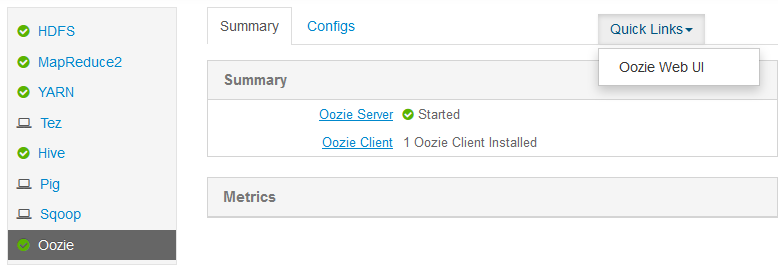

<properties
    pageTitle="Verwenden von Workflows Hadoop Oozie in Linux-basierten HDInsight | Microsoft Azure"
    description="Verwenden von Hadoop Oozie in Linux-basierten HDInsight. Informationen Sie zum Definieren eines Workflows Oozie, und senden Sie eine Oozie Position."
    services="hdinsight"
    documentationCenter=""
    authors="Blackmist"
    manager="jhubbard"
    editor="cgronlun"
    tags="azure-portal"/>

<tags
    ms.service="hdinsight"
    ms.workload="big-data"
    ms.tgt_pltfrm="na"
    ms.devlang="na"
    ms.topic="article"
    ms.date="10/11/2016"
    ms.author="larryfr"/>

# Verwenden von Oozie mit Hadoop definieren und Ausführen eines Workflows auf Linux-basierten HDInsight

[AZURE.INCLUDE [oozie-selector](../../includes/hdinsight-oozie-selector.md)]

Erfahren Sie, wie Apache Oozie verwenden, um einen Workflow zu definieren, der Struktur und Sqoop verwendet, und führen Sie dann den Workflow auf einem Linux-basierten HDInsight Cluster.

Apache Oozie ist ein Workflow/Koordinierungssystem, die Hadoop Aufträge verwaltet werden. Er ist in den Stapel Hadoop integriert und Hadoop Aufträge für Apache MapReduce, Apache Schwein, Apache Struktur und Apache Sqoop unterstützt. Hiermit können Sie auch zum Planen von Aufträgen, die speziell für ein System, wie Java-Programme oder Shell-Skripts sind

> [AZURE.NOTE] Eine weitere Möglichkeit zum Definieren von Workflows mit HDInsight ist Azure Data Factory. Wenn Sie weitere Informationen zur Azure-Daten Factory finden Sie unter [verwenden Schwein und Struktur mit Daten Factory][azure-data-factory-pig-hive].

##Erforderliche Komponenten

Bevor Sie dieses Lernprogramm beginnen, benötigen Sie Folgendes:

- **Ein Azure-Abonnement**: finden Sie unter [erste Azure kostenlose Testversion](https://azure.microsoft.com/pricing/free-trial/).

- **Azure CLI**: finden Sie unter [Installieren und konfigurieren die Azure CLI](../xplat-cli-install.md)
    
    [AZURE.INCLUDE [use-latest-version](../../includes/hdinsight-use-latest-cli.md)]

- **Ein HDInsight Cluster**: finden Sie unter [Erste Schritte mit HDInsight unter Linux](hdinsight-hadoop-linux-tutorial-get-started.md)

- **Ein Azure SQL-Datenbank**: Dies wird anhand der Schritte in diesem Dokument erstellt werden

##Beispiel für workflow

Der Workflow, den Sie implementiert werden sollen, anhand der Anweisungen in diesem Dokument enthält zwei Aktionen. Aktionen sind Definitionen für Aufgaben, wie etwa die Struktur, Sqoop, MapReduce oder andere Prozesse ausgeführt werden:

![Workflowdiagramm][img-workflow-diagram]

1. Eine Struktur Aktion ausgeführt wird, ein HiveQL Skript zum Extrahieren Einträge aus der **Hivesampletable** enthaltenen HDInsight. Jede Zeile von Daten beschrieben, einen Besuch von einem bestimmten mobilen Gerät. Das Format der Eintrag wird ähnlich wie die folgende angezeigt:

        8       18:54:20        en-US   Android Samsung SCH-i500        California     United States    13.9204007      0       0
        23      19:19:44        en-US   Android HTC     Incredible      Pennsylvania   United States    NULL    0       0
        23      19:19:46        en-US   Android HTC     Incredible      Pennsylvania   United States    1.4757422       0       1

    In diesem Dokument verwendeten Struktur Skript ermittelt die gesamten besuchen für jede Plattform (z. B. Android oder iPhone) und speichert die zählt, um eine neue strukturtabelle.

    Weitere Informationen zur Struktur, finden Sie unter [Verwendung mit HDInsight Struktur][hdinsight-use-hive].

2.  Eine Aktion Sqoop exportiert den Inhalt der neuen strukturtabelle zu einer Tabelle in einer SQL Azure-Datenbank. Weitere Informationen zu Sqoop, finden Sie unter [Verwenden von Hadoop Sqoop mit HDInsight][hdinsight-use-sqoop].

> [AZURE.NOTE] Unterstützte Oozie Versionen auf HDInsight Cluster, finden Sie unter [Neuigkeiten in die Hadoop Cluster Versionen von HDInsight bereitgestellten?] [hdinsight-versions].

##Erstellen Sie das Arbeitsverzeichnis

Oozie erwartet erforderliche Ressourcen für ein Projekt im selben Verzeichnis gespeichert werden soll. In diesem Beispiel wird **Wasbs: / / / Lernprogramme/Useoozie**. Verwenden Sie den folgenden Befehl zum Erstellen dieses Verzeichnis und das Datenverzeichnis, in die die neue strukturtabelle dieser Workflow erstellte eingeben:

    hdfs dfs -mkdir -p /tutorials/useoozie/data

> [AZURE.NOTE] Die `-p` Parameter verursacht alle Verzeichnisse im Pfad erstellt werden, wenn diese nicht bereits vorhanden sind. **Das Datenverzeichnis** wird zum Speichern der Daten verwendet werden, indem Sie das Skript **useooziewf.hql** verwendet werden.

Führen Sie auch den folgenden Befehl aus, damit ist sichergestellt, dass Oozie Ihr Benutzerkonto Identitätswechsel ausführen kann, wenn Struktur und Sqoop Einzelvorgänge ausgeführt. Ersetzen Sie **Benutzername** durch Ihren Anmeldenamen ein:

    sudo adduser USERNAME users

Wenn Sie eine Fehlermeldung, dass der Benutzer bereits Mitglied der Benutzer ist, können Sie einfach ignorieren.

##Fügen Sie einen Datenbanktreiber hinzu.

Da dieser Workflow Sqoop zum Exportieren von Daten mit SQL-Datenbank verwendet, müssen Sie eine Kopie der JDBC-Treiber verwendet, um die Kommunikation mit SQL-Datenbank bereitstellen. Verwenden Sie den folgenden Befehl aus, um ihn in das Verzeichnis kopieren:

    hdfs dfs -copyFromLocal /usr/share/java/sqljdbc_4.1/enu/sqljdbc*.jar /tutorials/useoozie/

Wenn der Workflow Weitere Ressourcen, beispielsweise einem Glas, enthält eine Anwendung MapReduce verwendet haben, möchten Sie diese ebenfalls hinzufügen müssen.

##Definieren der Abfrage Struktur

Gehen Sie folgendermaßen vor, ein HiveQL Skript zu erstellen, die eine Abfrage definiert werden, die in einem Workflow Oozie weiter unten in diesem Dokument verwendet werden.

1. SSH für die Verbindung zum HDInsight Linux-basierten Cluster verwenden:

    * **Linux, Unix oder OS X-Clients**: finden Sie unter [Verwenden SSH mit Linux-basierten Hadoop auf HDInsight von Linux, OS X oder Unix](hdinsight-hadoop-linux-use-ssh-unix.md)

    * **Windows-Clients**: finden Sie unter [Verwenden SSH mit Linux-basierten Hadoop auf HDInsight von Windows](hdinsight-hadoop-linux-use-ssh-windows.md)

2. Verwenden Sie zum Erstellen einer neuen Datei den folgenden Befehl ein:

        nano useooziewf.hql

1. Sobald der Nano-Editor geöffnet ist, verwenden Sie die folgenden als den Inhalt der Datei ein:

        DROP TABLE ${hiveTableName};
        CREATE EXTERNAL TABLE ${hiveTableName}(deviceplatform string, count string) ROW FORMAT DELIMITED
        FIELDS TERMINATED BY '\t' STORED AS TEXTFILE LOCATION '${hiveDataFolder}';
        INSERT OVERWRITE TABLE ${hiveTableName} SELECT deviceplatform, COUNT(*) as count FROM hivesampletable GROUP BY deviceplatform;

    Es gibt zwei Variablen in das Skript verwendet werden:

    - **${HiveTableName}**: enthält den Namen der Tabelle erstellt werden
    - **${HiveDataFolder}**: den Speicherort zum Speichern der Datendateien für die Tabelle enthält

    Die Workflow Definition-Datei (in diesem Lernprogramm workflow.xml) übergibt diese Werte dieses Skript HiveQL zur Laufzeit.

2. Drücken Sie STRG + X, um den Editor zu verlassen. Wenn Sie dazu aufgefordert werden, wählen Sie **Y** zum Speichern der Datei, und verwenden Sie den Dateinamen **useooziewf.hql** verwenden **Sie die EINGABETASTE** .

3. Verwenden Sie die folgenden Befehle, um **useooziewf.hql** in **wasbs:///tutorials/useoozie/useooziewf.hql**zu kopieren:

        hdfs dfs -copyFromLocal useooziewf.hql /tutorials/useoozie/useooziewf.hql

    Diese Befehle speichern **useooziewf.hql** auf Azure-Speicher Kontos zugeordnet ist, mit diesem Cluster, wo die die Datei beibehalten werden, selbst wenn der Cluster gelöscht wird. So können Sie Geld durch Cluster löschen, wenn er nicht verwendet, bei weitgehender Ihre Projekte und Workflows speichern.

##Definieren des Workflows

Oozie Workflows Definitionen sind in hPDL (eine XML-Process Definition Language) geschrieben. Gehen Sie folgendermaßen vor, um den Workflow zu definieren:

1. Verwenden Sie die folgende Anweisung erstellen und bearbeiten eine neue Datei ein:

        nano workflow.xml

1. Sobald der Nano-Editor geöffnet ist, geben Sie Folgendes als Inhalt der Datei ein:

        <workflow-app name="useooziewf" xmlns="uri:oozie:workflow:0.2">
            <start to = "RunHiveScript"/>
            <action name="RunHiveScript">
            <hive xmlns="uri:oozie:hive-action:0.2">
                <job-tracker>${jobTracker}</job-tracker>
                <name-node>${nameNode}</name-node>
                <configuration>
                <property>
                    <name>mapred.job.queue.name</name>
                    <value>${queueName}</value>
                </property>
                </configuration>
                
                <param>hiveTableName=${hiveTableName}</param>
                <param>hiveDataFolder=${hiveDataFolder}</param>
            </hive>
            <ok to="RunSqoopExport"/>
            <error to="fail"/>
            </action>
            <action name="RunSqoopExport">
            <sqoop xmlns="uri:oozie:sqoop-action:0.2">
                <job-tracker>${jobTracker}</job-tracker>
                <name-node>${nameNode}</name-node>
                <configuration>
                <property>
                    <name>mapred.compress.map.output</name>
                    <value>true</value>
                </property>
                </configuration>
                <arg>export</arg>
                <arg>--connect</arg>
                <arg>${sqlDatabaseConnectionString}</arg>
                <arg>--table</arg>
                <arg>${sqlDatabaseTableName}</arg>
                <arg>--export-dir</arg>
                <arg>${hiveDataFolder}</arg>
                <arg>-m</arg>
                <arg>1</arg>
                <arg>--input-fields-terminated-by</arg>
                <arg>"\t"</arg>
                <archive>sqljdbc41.jar</archive>
                </sqoop>
            <ok to="end"/>
            <error to="fail"/>
            </action>
            <kill name="fail">
            <message>Job failed, error message[${wf:errorMessage(wf:lastErrorNode())}] </message>
            </kill>
            <end name="end"/>
        </workflow-app>

    Es gibt zwei im Workflow definierten Aktionen aus:

    - **RunHiveScript**: Dies ist der Startaktion und führt die **useooziewf.hql** Struktur Skript

    - **RunSqoopExport**: exportiert die Daten aus der Struktur Skript für SQL-Datenbank mit Sqoop erstellt wurde. Dadurch wird nur ausgeführt, wenn die Aktion **RunHiveScript** erfolgreich ist.

        > [AZURE.NOTE] Weitere Informationen zu Workflows Oozie und Workflowaktionen verwenden, finden Sie unter [Apache Oozie 4.0-Dokumentation] [ apache-oozie-400] (für HDInsight Version 3.0) oder [Apache Oozie 3.3.2 Dokumentation] [ apache-oozie-332] (für HDInsight Version 2.1).

    Beachten Sie, dass der Workflow wie mehrere Einträge wurde `${jobTracker}`, die ersetzt werden durch Werte, die Sie in der Definition Position weiter unten in diesem Dokument verwenden.

    Beachten Sie auch die `<archive>sqljdbc4.jar</arcive>` Eintrag im Abschnitt Sqoop. Dies weist Oozie dieses Archiv zur Verfügung zu stellen für Sqoop, wenn diese Aktion ausgeführt wird.

2. Verwenden Sie STRG + X, und klicken Sie dann **Y** und **EINGABETASTE** zum Speichern der Datei ein.

3. Verwenden Sie den folgenden Befehl, um die Datei **workflow.xml** in **wasbs:///tutorials/useoozie/workflow.xml**zu kopieren:

        hdfs dfs -copyFromLocal workflow.xml /tutorials/useoozie/workflow.xml

##Erstellen Sie die Datenbank

Führen Sie die Schritte im Dokument [Erstellen einer SQL-Datenbank](../sql-database/sql-database-get-started.md) zum Erstellen einer neuen Datenbank aus. Wenn Sie die Datenbank erstellen möchten, verwenden Sie __Oozietest__ als den Datenbanknamen aus. Auch Notieren Sie den Namen für die Datenbankserver verwendet, wie dies im nächsten Abschnitt benötigt werden.

###Erstellen Sie die Tabelle

> [AZURE.NOTE] Es gibt viele Methoden zum Verbinden mit SQL-Datenbank zum Erstellen einer Tabelle aus. Verwenden Sie die folgenden Schritte aus [FreeTDS](http://www.freetds.org/) aus dem HDInsight Cluster ein.

3. Verwenden Sie den folgenden Befehl aus, um FreeTDS auf dem HDInsight Cluster zu installieren:

        sudo apt-get --assume-yes install freetds-dev freetds-bin

4. Nachdem FreeTDS installiert wurde, verwenden den folgenden Befehl die Verbindung zu den SQL-Datenbankserver herstellen, die Sie zuvor erstellt haben:

        TDSVER=8.0 tsql -H <serverName>.database.windows.net -U <sqlLogin> -P <sqlPassword> -p 1433 -D oozietest

    Sie erhalten die Ausgabe ähnlich wie der folgende aus:

        locale is "en_US.UTF-8"
        locale charset is "UTF-8"
        using default charset "UTF-8"
        Default database being set to oozietest
        1>

5. Bei der `1>` dazu aufgefordert werden, geben Sie die folgenden Zeilen ein:

        CREATE TABLE [dbo].[mobiledata](
        [deviceplatform] [nvarchar](50),
        [count] [bigint])
        GO
        CREATE CLUSTERED INDEX mobiledata_clustered_index on mobiledata(deviceplatform)
        GO

    Wenn die `GO` Anweisung eingegeben wird, wird die vorherigen Anweisungen ausgewertet werden. Dies erstellt eine neue Tabelle namens **Mobiledata** , die durch Sqoop geschrieben werden sollen.

    Anhand der folgenden Stellen Sie sicher, dass die Tabelle erstellt wurde:

        SELECT * FROM information_schema.tables
        GO

    Ähnlich wie der folgende Ausgabe sollte angezeigt werden:

        TABLE_CATALOG   TABLE_SCHEMA    TABLE_NAME      TABLE_TYPE
        oozietest       dbo     mobiledata      BASE TABLE

8. Geben Sie `exit` bei der `1>` auffordern, um Tsql zu beenden.

##Erstellen der Definition für Auftrag

Gemacht werden, wo befinden sich die workflow.xml sowie andere Dateien, die vom Workflow (z. B. useooziewf.hql.) verwendet? Außerdem wird die Werte für Eigenschaften innerhalb des Workflows verwendet und Dateien zugeordneten definiert.

1. Verwenden Sie den folgenden Befehl aus, um die vollständige Adresse WASB Standardspeicher abzurufen. Dies wird weiter unten in der Konfigurationsdatei verwendet werden:

        sed -n '/<name>fs.default/,/<\/value>/p' /etc/hadoop/conf/core-site.xml

    Dadurch sollten Informationen ähnlich wie der folgende zurückgegeben:

        <name>fs.defaultFS</name>
        <value>wasbs://mycontainer@mystorageaccount.blob.core.windows.net</value>

    Speichern der **wasbs://mycontainer@mystorageaccount.blob.core.windows.net** -Wert fest, wie sie in den nächsten Schritten verwendet wird.

2. Verwenden Sie den folgenden Befehl aus, um FQDN des der Cluster Headnode abzurufen. Dies wird für die Adresse JobTracker für den Cluster verwendet werden. Dies wird weiter unten in der Konfigurationsdatei verwendet werden:

        hostname -f

    Dadurch wird Informationen ähnlich wie der folgende zurückgegeben:

        hn0-CLUSTERNAME.randomcharacters.cx.internal.cloudapp.net

    Der Port für den JobTracker ist 8050, sodass die vollständige Adresse verwenden Sie für die JobTracker **hn0-CLUSTERNAME.randomcharacters.cx.internal.cloudapp.net:8050**genommen wird.

1. Erstellen die Oozie Position Definition Konfiguration anhand der folgenden:

        nano job.xml

2. Sobald der Nano-Editor geöffnet ist, verwenden Sie die folgenden als den Inhalt der Datei ein:

        <?xml version="1.0" encoding="UTF-8"?>
        <configuration>

          <property>
            <name>nameNode</name>
            <value>wasbs://mycontainer@mystorageaccount.blob.core.windows.net</value>
          </property>

          <property>
            <name>jobTracker</name>
            <value>JOBTRACKERADDRESS</value>
          </property>

          <property>
            <name>queueName</name>
            <value>default</value>
          </property>

          <property>
            <name>oozie.use.system.libpath</name>
            <value>true</value>
          </property>

          <property>
            <name>hiveScript</name>
            <value>wasbs://mycontainer@mystorageaccount.blob.core.windows.net/tutorials/useoozie/useooziewf.hql</value>
          </property>

          <property>
            <name>hiveTableName</name>
            <value>mobilecount</value>
          </property>

          <property>
            <name>hiveDataFolder</name>
            <value>wasbs://mycontainer@mystorageaccount.blob.core.windows.net/tutorials/useoozie/data</value>
          </property>

          <property>
            <name>sqlDatabaseConnectionString</name>
            <value>"jdbc:sqlserver://serverName.database.windows.net;user=adminLogin;password=adminPassword;database=oozietest"</value>
          </property>

          <property>
            <name>sqlDatabaseTableName</name>
            <value>mobiledata</value>
          </property>

          <property>
            <name>user.name</name>
            <value>YourName</value>
          </property>

          <property>
            <name>oozie.wf.application.path</name>
            <value>wasbs://mycontainer@mystorageaccount.blob.core.windows.net/tutorials/useoozie</value>
          </property>
        </configuration>

    * Ersetzen Sie alle Instanzen von **wasbs://mycontainer@mystorageaccount.blob.core.windows.net** mit dem Wert, die Sie zuvor erhalten haben.

    > [AZURE.WARNING] Sie müssen mit dem Konto Container und Speicher als Teil der Pfad den vollständigen Pfad für die WASB verwenden. Verwenden das Kurzformat (Wasbs: / / /) bewirkt, dass die Aktion RunHiveScript ein Fehler auftreten, wenn Sie der Auftrag gestartet wird.

    * Ersetzen Sie **JOBTRACKERADDRESS** durch die JobTracker/Ressourcen-Manager-Adresse, die Sie zuvor erhalten haben.

    * Ersetzen Sie **IhrName** mit Ihren Anmeldenamen ein, für den HDInsight Cluster ein.

    * Ersetzen Sie **ServerName**, **AdminLogin**und **AdminPassword** mit den Informationen für die Azure SQL-Datenbank.

    Die meisten Informationen in dieser Datei wird verwendet, um die Werte in den workflow.xml oder ooziewf.hql-Dateien (z. B. ${NameNode}.) verwendet füllen

    > [AZURE.NOTE] Der Eintrag **oozie.wf.application.path** definiert, wo die Datei workflow.xml zu finden, das den Workflow enthält durch diesen Auftrag ausgeführt wurde.

2. Verwenden Sie STRG + X, und klicken Sie dann **Y** und **EINGABETASTE** zum Speichern der Datei ein.

##Senden und den Auftrag verwalten

Die folgenden Schritte mithilfe des Befehls Oozie übermitteln und Verwalten von Workflows Oozie Cluster. Der Befehl Oozie ist eine benutzerfreundliche Oberfläche über die [REST-API Oozie](https://oozie.apache.org/docs/4.1.0/WebServicesAPI.html).

> [AZURE.IMPORTANT] Wenn Sie den Befehl Oozie verwenden zu können, müssen Sie den vollqualifizierten Domänennamen für die HDInsight Headnode verwenden. Dieser FQDN zugegriffen werden nur aus dem Cluster, oder ob Cluster auf ein virtuelles Netzwerk Azure von anderen Computern in einem Netzwerk befindet.

1. Abrufen der URL für den Dienst Oozie anhand der folgenden:

        sed -n '/<name>oozie.base.url/,/<\/value>/p' /etc/oozie/conf/oozie-site.xml

    Dadurch wird einen Wert ähnlich wie der folgende zurückgegeben:

        <name>oozie.base.url</name>
        <value>http://hn0-CLUSTERNAME.randomcharacters.cx.internal.cloudapp.net:11000/oozie</value>

    Der Teil des **Http://hn0-CLUSTERNAME.randomcharacters.cx.internal.cloudapp.net:11000/Oozie** ist die URL, die mit dem Befehl Oozie verwenden.

2. Erstellen Sie eine Umgebungsvariable für die URL, damit Sie nicht für jede Befehl einzugeben anhand der folgenden:

        export OOZIE_URL=http://HOSTNAMEt:11000/oozie

    Ersetzen Sie die URL für das Element, das Sie zuvor erhalten haben.

3. Senden Sie den Auftrag anhand der folgenden:

        oozie job -config job.xml -submit

    Dies lädt die Position Informationen aus **job.xml** und diese an Oozie übermittelt, aber wird nicht ausgeführt.

    Sobald der Befehl abgeschlossen ist, sollte die ID des Projekts zurückgegeben werden. Beispielsweise `0000005-150622124850154-oozie-oozi-W`. Hiermit wird den Auftrag zu verwalten.

4. Anzeigen des Status des Projekts mit dem folgenden Befehl. Geben Sie die zurückgegebene des vorherigen Befehls Auftrags-ID aus:

        oozie job -info <JOBID>

    Dadurch wird Informationen ähnlich wie der folgende zurückgegeben.

        Job ID : 0000005-150622124850154-oozie-oozi-W
        ------------------------------------------------------------------------------------------------------------------------------------
        Workflow Name : useooziewf
        App Path      : wasbs:///tutorials/useoozie
        Status        : PREP
        Run           : 0
        User          : USERNAME
        Group         : -
        Created       : 2015-06-22 15:06 GMT
        Started       : -
        Last Modified : 2015-06-22 15:06 GMT
        Ended         : -
        CoordAction ID: -
        ------------------------------------------------------------------------------------------------------------------------------------

    Diese Position hat den Status `PREP`, die angibt, dass es wurde übermittelt, aber noch nicht begonnen wurden hat.

4. Verwenden Sie das Projekt starten Folgendes ein:

        oozie job -start JOBID

    Wenn Sie den Status nach dieser Befehl überprüfen, ausgeführt werden, und Informationen werden für die Aktionen innerhalb des Projekts zurückgegeben werden.

5. Nachdem der Vorgang erfolgreich abgeschlossen ist, können Sie überprüfen, dass die Daten wurde generiert und in der Tabelle der SQL-Datenbank importiert werden, mithilfe der folgenden Befehle:

        TDSVER=8.0 tsql -H <serverName>.database.windows.net -U <adminLogin> -P <adminPassword> -p 1433 -D oozietest

    Bei der `1>` dazu aufgefordert werden, geben Sie Folgendes:

        SELECT * FROM mobiledata
        GO

    Erhalten Sie Informationen wie die folgende:

        deviceplatform  count
        Android 31591
        iPhone OS       22731
        proprietary development 3
        RIM OS  3464
        Unknown 213
        Windows Phone   1791
        (6 rows affected)

Weitere Informationen zu den Befehl Oozie finden Sie unter [Oozie Befehlszeilentool](https://oozie.apache.org/docs/4.1.0/DG_CommandLineTool.html).

##Oozie REST-API

Die REST-API von Oozie können Sie Ihre eigenen Tools zu erstellen, mit denen Oozie zusammenarbeiten. Im folgenden sind HDInsight spezifische Informationen zur Verwendung der Oozie REST-API:

* **URI**: die REST-API kann außerhalb der Cluster am zugegriffen werden`https://CLUSTERNAME.azurehdinsight.net/oozie`

* **Authentifizierung**: Sie müssen sich an die API mithilfe der HTTP-Clusterdienstkonto (Admin) und das Kennwort authentifizieren. Beispiel:

        curl -u admin:PASSWORD https://CLUSTERNAME.azurehdinsight.net/oozie/versions

Weitere Informationen zur Verwendung der Oozie REST-API finden Sie unter [Oozie-Webdienste-API](https://oozie.apache.org/docs/4.1.0/WebServicesAPI.html).

##Oozie Web-Benutzeroberfläche

Der Web-Benutzeroberfläche Oozie bietet einer webbasierten Überblick über den Status der Einzelvorgänge Oozie im Cluster an. Es können Sie in das Projekt, und die Protokolle für das Projekt Projektstatus, die Definition der Position, Konfiguration, ein Diagramm der Aktionen anzeigen. Sie können auch die Details für Aktionen innerhalb eines Auftrags anzeigen.

Um der Oozie Web-Benutzeroberfläche zuzugreifen, gehen Sie folgendermaßen vor:

1. Erstellen Sie einen Tunnel SSH zum HDInsight Cluster ein. Informationen dazu finden Sie unter [Verwenden SSH Tunnel Ambari Web UI, Ressourcen-Manager, JobHistory, NameNode, Oozie, und andere Elemente Benutzeroberfläches von Web Zugriff auf](hdinsight-linux-ambari-ssh-tunnel.md).

2. Nachdem ein Tunnel erstellt wurde, öffnen Sie das Ambari-Web-Benutzeroberfläche in Ihrem Webbrowser ein. URI für die Website Ambari ist **https://CLUSTERNAME.azurehdinsight.net**. Ersetzen Sie **CLUSTERNAME** mit dem Namen der Linux-basierten HDInsight Cluster ein.

3. Wählen Sie von der linken Seite der Seite, **Oozie**, und klicken Sie dann **Quicklinks**und schließlich **Oozie Web-Benutzeroberfläche**an.

    

4. Der Web-Benutzeroberfläche Oozie standardmäßig anzeigen Workflowaufträge ausgeführt. Um alle Workflow Projekte anzuzeigen, wählen Sie **Alle Aufträge**aus.

    

5. Wählen Sie eine Stelle, um weitere Informationen zu den Auftrag anzuzeigen.

    

6. Auf der Registerkarte Informationen Job können Sie grundlegende Aufgabe Informationen sowie die einzelnen Aktionen innerhalb des Projekts anzeigen. Mithilfe der Registerkarten am oberen können Sie die Definition für Auftrag, Auftragskonfiguration Access Job-Protokoll anzeigen oder Anzeigen einer geleitet acyclische Graph (so) des Projekts.

    * **Job-Protokoll**: Wählen Sie die **GetLogs** -Schaltfläche, um alle Protokolle für den Auftrag erhalten, oder verwenden Sie das Feld **Suchfilter Geben Sie** zum Filtern von Protokollen

        

    * **JobDAG**: das so ist, einen Überblick über der durch den Workflow erfasste Datenpfade

        

7. Markieren eine der Aktionen auf der Registerkarte **Auftrag Info** wird Informationen für die Aktion geöffnet. Wählen Sie beispielsweise die **RunHiveScript** Aktion ein.

    

8. Sie können sehen, dass Details für die Aktion, einschließlich eines Links zu **Console-URL**, die verwendet werden können, um JobTracker Informationen für das Projekt anzuzeigen.

##Planen von Aufträgen

Der Koordinator können Sie eine Anfang, Ende und Vorkommen Häufigkeit für Projekte angeben, sodass für bestimmte Zeiten geplant werden können.

Um einen Zeitplan für den Workflow zu definieren, gehen Sie folgendermaßen vor:

1. Erstellen einer neuen Datei mit dem Namen **coordinator.xml**anhand der folgenden:

        nano coordinator.xml

    Verwenden Sie die folgenden als den Inhalt der Datei ein:

        <coordinator-app name="my_coord_app" frequency="${coordFrequency}" start="${coordStart}" end="${coordEnd}" timezone="${coordTimezone}" xmlns="uri:oozie:coordinator:0.4">
          <action>
            <workflow>
              <app-path>${workflowPath}</app-path>
            </workflow>
          </action>
        </coordinator-app>

    Notiz, die diese verwendet `${...}` Variablen, die durch die Werte in der Position Definition ersetzt werden. Die Variablen sind:

    * **${CoordFrequency}**: Zeit zwischen Instanzen des Auftrags ausführen
    * **${CoordStart}**: Startzeit für das Projekt
    * **${CoordEnd}**: die Endzeit eines Auftrags
    * **${CoordTimezone}**: Coordinator Aufträge gibt in einer festen Zeitzone keine Sommerzeit (in der Regel mithilfe von UTC dargestellt). Dieser Zeitzone wird als "Oozie Verarbeitung Zeitzone" bezeichnet.
    * **${WfPath}**: den Pfad für die workflow.xml

2. Verwenden Sie STRG + X, und klicken Sie dann **Y** und **EINGABETASTE** zum Speichern der Datei ein.

3. Verwenden Sie die folgenden, um ihn in der geöffneten Verzeichnis für dieses Projekt zu kopieren:

        hadoop fs -copyFromLocal coordinator.xml /tutorials/useoozie/coordinator.xml

4. Verwenden Sie zum Ändern der Datei **job.xml** folgende:

        nano job.xml

    Nehmen Sie die folgenden Änderungen vor:

    * Ändern `<name>oozie.wf.application.path</name>` auf `<name>oozie.coord.application.path</name>`. Dies weist Oozie zum Ausführen der Coordinator-Datei anstelle der Workflow-Datei

    * Fügen Sie den folgenden, Sätze werden, werden eine Variable in der coordinator.xml verwendet, um zum Speicherort der "Workflow.xml" zeigen hinzu:

            <property>
              <name>workflowPath</name>
              <value>wasbs://mycontainer@mystorageaccount.blob.core.windows.net/tutorials/useoozie</value>
            </property>

        Ersetzen Sie die Werte für **Mycontainer** und **Mystorageaccount** mit den Werten in anderen Einträge in der Datei job.xml verwendet.

    * Fügen Sie die folgenden, definieren den Anfang, Ende und Häufigkeit für die Datei coordinator.xml verwendet werden soll:

            <property>
              <name>coordStart</name>
              <value>2015-06-25T12:00Z</value>
            </property>

            <property>
              <name>coordEnd</name>
              <value>2015-06-27T12:00Z</value>
            </property>

            <property>
              <name>coordFrequency</name>
              <value>1440</value>
            </property>

            <property>
              <name>coordTimezone</name>
              <value>UTC</value>
            </property>

        Diese Festlegen der Startzeit bis 12:00 Uhr auf 25 % Juni 2015, die Endzeit 27. Juni 2015, und das Intervall zum Ausführen dieser Aufgabe auf täglich (die Häufigkeit ist in Minuten, also 24 Stunden x 60 Minuten = 1440 Minuten.) Schließlich wird die Zeitzone in UTC festgelegt.

5. Verwenden Sie STRG + X, und klicken Sie dann **Y** und **EINGABETASTE** zum Speichern der Datei ein.

6. Führen Sie den Auftrag mit den folgenden Befehl aus:

        oozie job -config job.xml -run

    Dies wird senden, und starten den Auftrag.

7. Wenn Sie finden Sie auf der Web-Benutzeroberfläche Oozie, und wählen Sie die Registerkarte **Coordinator Aufträge** , sollten Sie Informationen ähnlich wie der folgende aus:

    

    Notieren Sie den **Nächsten Materialisierung** Eintrag; Dies ist, wenn der Auftrag weiter ausgeführt wird.

8. Ähnlich wie in der früheren Workflowauftrag, werden auswählen den Eintrag Position in der Web-Benutzeroberfläche Informationen auf den Auftrag angezeigt:

    

    Beachten Sie, dass dies nur erfolgreich ausgeführt des Projekts, keine einzelnen Aktionen innerhalb des geplanten Workflows angezeigt wird. Um, die eine **Aktion** Einträge anzuzeigen. Informationen, die ähnliche, die für den früheren Workflowauftrag abgerufen werden angezeigt.

    

##Behandlung von Problemen

Bei der Behandlung von Problemen mit Oozie Aufträge der Oozie UI ist sehr hilfreich, wie es Ihnen ermöglicht, beide Oozie Protokolle auf einfache Weise anzeigen sowie links zu JobTracker Protokolle für MapReduce Aufgaben wie Struktur Abfragen. Im Allgemeinen sollten das Muster zur Behandlung dieses Problems:

1. Zeigen Sie den Auftrag in Oozie Web-Benutzeroberfläche an.

2. Ist es ein Fehler oder Ausfall für eine bestimmte Aktion, wählen Sie die Aktion aus, um festzustellen, ob das Feld **Fehlermeldung** Weitere Informationen zum Fehler enthält.

3. Falls vorhanden, verwenden Sie die URL aus der Aktion (z. B. JobTracker Protokolle,) Weitere Details anzeigen für die Aktion ein.

Nachfolgend werden bestimmte Fehler auftreten können, und wie Sie sie auflösen.

###JA009: Kann nicht Cluster Initialisierung.

**Symptome**: der Status ändert sich in **angehalten**. Ausführliche Informationen zu den Auftrag werden den Status RunHiveScript als **START_MANUAL**angezeigt. Die Aktion auswählen, wird die folgende Fehlermeldung angezeigt werden:

    JA009: Cannot initialize Cluster. Please check your configuration for map

**Ursache**: das WASB-Adressen in der Datei **job.xml** verwendeten keine Speicher Containers oder Kontonamen Speicher enthalten. Das Adressformat WASB muss `wasbs://containername@storageaccountname.blob.core.windows.net`.

**Lösung**: die von den Auftrag verwendete WASB-Adressen ändern.

###JA002: Oozie darf keine Identitätswechsel &lt;Benutzer >

**Symptome**: der Status ändert sich in **angehalten**. Ausführliche Informationen zu den Auftrag werden den Status RunHiveScript als **START_MANUAL**angezeigt. Die Aktion auswählen, wird die folgende Fehlermeldung angezeigt werden:

    JA002: User: oozie is not allowed to impersonate <USER>

**Ursache**: aktuelle berechtigungseinstellungen Oozie das angegebene Benutzerkonto Identitätswechsel nicht zulassen.

**Lösung**: Oozie Benutzer in der Gruppe **Benutzer** annehmen darf. Verwenden der `groups USERNAME` Gruppen angezeigt, die das Benutzerkonto Mitglied ist. Wenn der Benutzer nicht Mitglied der Gruppe **Benutzer** ist, verwenden Sie den folgenden Befehl auf den Benutzer zur Gruppe hinzufügen:

    sudo adduser USERNAME users

> [AZURE.NOTE] Es kann einige Minuten dauern HDInsight erkennt, dass der Benutzer der Gruppe hinzugefügt wurde, dauern.

###Startprogramm für ein Fehler (Sqoop)

**Symptome**: der Status wird in **KILLED**geändert. Ausführliche Informationen zu den Auftrag werden den Status RunSqoopExport als **Fehler**angezeigt. Die Aktion auswählen, wird die folgende Fehlermeldung angezeigt werden:

    Launcher ERROR, reason: Main class [org.apache.oozie.action.hadoop.SqoopMain], exit code [1]

**Ursache**: Sqoop kann nicht geladen den Datenbanktreiber Zugriff auf die Datenbank erforderlich ist.

**Lösung**: bei der Verwendung von Sqoop aus einem Projekt Oozie müssen Sie den Datenbanktreiber mit anderen Ressourcen (z. B. workflow.xml) verwendet wird, indem Sie den Auftrag einbeziehen.

Sie müssen auch das Archiv, enthält des Datenbanktreibers aus verweisen der `<sqoop>...</sqoop>` Abschnitt "Workflow.xml".

Für das Projekt in diesem Dokument verwenden Sie beispielsweise die folgenden Schritte:

1. Kopieren Sie die Datei sqljdbc4.1.jar Verzeichnis /tutorials/useoozie:

         hadoop fs -copyFromLocal /usr/share/java/sqljdbc_4.1/enu/sqljdbc41.jar /tutorials/useoozie/sqljdbc41.jar

2. Ändern der workflow.xml um Folgendes in eine neue Zeile oberhalb hinzufügen `</sqoop>`:

        <archive>sqljdbc41.jar</archive>

##Nächste Schritte
In diesem Lernprogramm haben Sie ein Workflows Oozie definieren und Ausführen von einer Oozie Position. Weitere Informationen zum Arbeiten mit HDInsight finden Sie in den folgenden Artikeln:

- [Verwenden Sie zeitbasierte Oozie Coordinator mit HDInsight][hdinsight-oozie-coordinator-time]
- [Hochladen von Daten für Hadoop Aufträge in HDInsight][hdinsight-upload-data]
- [Verwenden von Sqoop mit Hadoop in HDInsight][hdinsight-use-sqoop]
- [Verwenden Sie die Struktur mit Hadoop auf HDInsight][hdinsight-use-hive]
- [Schwein mit Hadoop auf HDInsight verwenden][hdinsight-use-pig]
- [Entwickeln Sie MapReduce Java-Programme für HDInsight][hdinsight-develop-mapreduce]

[hdinsight-cmdlets-download]: http://go.microsoft.com/fwlink/?LinkID=325563

[azure-data-factory-pig-hive]: ../data-factory/data-factory-data-transformation-activities.md
[hdinsight-oozie-coordinator-time]: hdinsight-use-oozie-coordinator-time.md
[hdinsight-versions]:  hdinsight-component-versioning.md
[hdinsight-storage]: hdinsight-use-blob-storage.md
[hdinsight-get-started]: hdinsight-get-started.md

[hdinsight-use-sqoop]: hdinsight-use-sqoop-mac-linux.md
[hdinsight-provision]: hdinsight-provision-clusters.md
[hdinsight-upload-data]: hdinsight-upload-data.md
[hdinsight-use-mapreduce]: hdinsight-use-mapreduce.md
[hdinsight-use-hive]: hdinsight-use-hive.md
[hdinsight-use-pig]: hdinsight-use-pig.md
[hdinsight-storage]: hdinsight-use-blob-storage.md
[hdinsight-get-started-emulator]: hdinsight-get-started-emulator.md

[hdinsight-develop-mapreduce]: hdinsight-develop-deploy-java-mapreduce-linux.md

[sqldatabase-create-configue]: sql-database-create-configure.md
[sqldatabase-get-started]: sql-database-get-started.md

[azure-create-storageaccount]: storage-create-storage-account.md

[apache-hadoop]: http://hadoop.apache.org/
[apache-oozie-400]: http://oozie.apache.org/docs/4.0.0/
[apache-oozie-332]: http://oozie.apache.org/docs/3.3.2/

[powershell-download]: http://azure.microsoft.com/downloads/
[powershell-about-profiles]: http://go.microsoft.com/fwlink/?LinkID=113729
[powershell-install-configure]: powershell-install-configure.md
[powershell-start]: http://technet.microsoft.com/library/hh847889.aspx
[powershell-script]: https://technet.microsoft.com/en-us/library/ee176961.aspx

[cindygross-hive-tables]: http://blogs.msdn.com/b/cindygross/archive/2013/02/06/hdinsight-hive-internal-and-external-tables-intro.aspx

[img-workflow-diagram]: ./media/hdinsight-use-oozie/HDI.UseOozie.Workflow.Diagram.png
[img-preparation-output]: ./media/hdinsight-use-oozie/HDI.UseOozie.Preparation.Output1.png
[img-runworkflow-output]: ./media/hdinsight-use-oozie/HDI.UseOozie.RunWF.Output.png

[technetwiki-hive-error]: http://social.technet.microsoft.com/wiki/contents/articles/23047.hdinsight-hive-error-unable-to-rename.aspx
