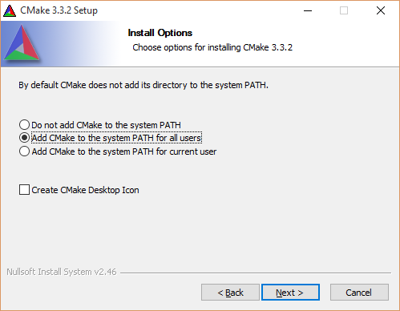
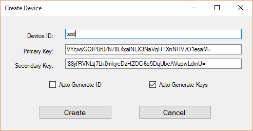

<properties
    pageTitle="Verwenden das Gerät Azure IoT SDK für C | Microsoft Azure"
    description="Informationen zu und erste Schritte zum Arbeiten mit der Stichprobe-Code in das Gerät Azure IoT SDK für C."
    services="iot-hub"
    documentationCenter=""
    authors="olivierbloch"
    manager="timlt"
    editor=""/>

<tags
     ms.service="iot-hub"
     ms.devlang="cpp"
     ms.topic="article"
     ms.tgt_pltfrm="na"
     ms.workload="na"
     ms.date="09/06/2016"
     ms.author="obloch"/>

# <a name="introducing-the-azure-iot-device-sdk-for-c"></a>Einführung in das Gerät Azure IoT SDK für C

Das **Azure IoT Gerät SDK** ist eine Gruppe von Bibliotheken Ereignisse beim Senden und Empfangen von Nachrichten aus dem Dienst **Azure IoT Hub** vereinfacht werden soll. Es gibt verschiedene Variationen des SDK, jede für eine bestimmte Plattform, aber in diesem Artikel werden die **Azure IoT Gerät SDK für C**.

Azure IoT Gerät-SDK für C ist in ANSI C (C99) Portabilität maximieren geschrieben. Auf diese Weise gut geeignet ist, klicken Sie auf eine Reihe von Plattformen und Geräten ausgeführt werden, insbesondere bei der Datenträger minimieren und Arbeitsspeicher Platzbedarf ist eine Priorität.  

Es gibt eine Vielzahl von Plattformen, an denen das SDK getestet wurde (siehe die [Azure zertifiziert für IoT Gerät Katalog](https://catalog.azureiotsuite.com/) Details). Obwohl in diesem Artikel Vorgehensweisen der Stichprobe Code ausgeführt werden, klicken Sie auf der Windows-Plattform enthält, lassen Sie denken Sie daran, dass sich der Code in diesem Artikel beschriebenen genau über den Zellbereich, der unterstützte Plattformen unterscheidet.

In diesem Artikel werden die Architektur des Geräts Azure IoT SDK für c vorgestellt werden Wir werden so der Initialisierung der Gerätebibliothek, Ereignisse an IoT Verteiler senden als auch empfangen von Nachrichten daraus veranschaulichen. Die Informationen in diesem Artikel sollten genug zur Seite Erste Schritte mit dem SDK, aber auch enthält Verweise auf Weitere Informationen zu den Bibliotheken.

## <a name="sdk-architecture"></a>SDK-Architektur

Sie können finden im [Microsoft Azure IoT SDKs](https://github.com/Azure/azure-iot-sdks) GitHub Repository **Azure IoT Gerät SDK für C** und Anzeigen von Details der API im [C-API-Referenz](http://azure.github.io/azure-iot-sdks/c/api_reference/index.html).

Die neueste Version der Bibliotheken kann in der **Gestaltungsvorlage** Verzweigung dieses Repositorys gefunden werden:

  

Dieses Repository enthält die gesamte Familie Azure IoT Gerät SDKs. Es ist jedoch in diesem Artikel über das Gerät Azure IoT SDK *für C* die im Ordner " **c** " gefunden werden kann.

  

* Die zentrale Implementierung des SDK finden Sie der **Iothub\_Client** Ordner, die die Implementierung von den niedrigsten API Layer im SDK enthält: die **IoTHubClient** Bibliothek. Die Bibliothek **IoTHubClient** enthält APIs für das Senden von Nachrichten an IoT Hub als auch empfangen von Nachrichten daraus unformatierten messaging implementieren. Bei Verwendung dieser Bibliothek sind Sie für die Durchführung Meldungsserialisierung (schließlich die nachfolgend beschriebenen Serialisierungsprogramm Stichproben mit), aber andere Details zum Kommunizieren mit IoT Hub für Sie behandelt werden.
* Der Ordner **Serialisierungsprogramm** enthält Helper Funktionen und Beispiele, wie Daten serialisiert vor dem Senden an Azure IoT Verteiler mithilfe der Clientbibliothek mit. Beachten Sie, dass die Verwendung des Serialisierungsprogramms nicht obligatorisch und nur ist eine benutzerfreundliche Variante dar. Wenn Sie die Bibliothek **Serialisierungsprogramm** verwenden, beginnen Sie definieren ein Modell, das die Ereignisse gibt an, die Sie senden an IoT Hub als auch die Nachrichten, die Sie nicht vorhaben, es erhalten möchten. Nachdem das Modell definiert ist, bietet Ihnen das SDK eine API-Oberfläche, die Sie einfach mit Ereignisse und Nachrichten arbeiten können, ohne über die Serialisierung Details Gedanken machen kann.
Die Bibliothek hängt von anderen open-Source-Bibliotheken, die über mehrere Protokolle (MQTT, AMQP) Transport implementieren.
* Die Bibliothek **IoTHubClient** hängt von anderen open-Source-Bibliotheken:
   * Bibliothek [Azure C freigegebene Programm](https://github.com/Azure/azure-c-shared-utility) die allgemeine Funktionen für grundlegende Aufgaben bereitstellt (wie Zeichenfolge, Liste Manipulation, EA, usw....) über mehrere Azure-bezogene C SDKs erforderlich
   * Die [uAMQP Azure](https://github.com/Azure/azure-uamqp-c) -Bibliothek, die Client Seite Implementierung von AMQP für Ressourcen Einschränkung Geräte optimiert ist.
   * Das ist eine allgemeine Bibliothek implementieren das Protokoll MQTT und optimiert für Ressourcen Einschränkung Geräte [Azure uMQTT](https://github.com/Azure/azure-umqtt-c) -Bibliothek.

All dies ist leichter zu verstehen, indem Sie Beispielcode. In den folgenden Abschnitten durchlaufen Sie eine Reihe von Beispiel-Anwendungen, die im SDK enthalten sind. Dies erhalten Sie einen guten Eindruck für die verschiedenen Funktionen von der Architekturebenen des SDK sowie eine Einführung in die Funktionsweise der APIs.

## <a name="before-running-the-samples"></a>Bevor Sie die Beispiele ausführen

Bevor Sie die Beispiele in das Gerät Azure IoT SDK für C ausführen können müssen Sie eine Instanz des Diensts für Ihr Abonnement Azure erstellen, wenn Sie nicht bereits mindestens ein und 2 Aufgaben ausführen:
* Vorbereiten der Entwicklungsumgebung
* Anmeldeberechtigungen des Geräts zu erhalten.

Wenn Sie eine Instanz der Azure IoT Hub für Ihr Abonnement Azure erstellen müssen, gehen Sie [hier](https://github.com/Azure/azure-iot-sdks/blob/master/doc/setup_iothub.md).

Die im SDK enthaltene [Infodatei](https://github.com/Azure/azure-iot-sdks/tree/master/c) finden Sie Informationen zum Vorbereiten Ihrer Entwicklungsumgebung und Gerät Anmeldeinformationen zu erhalten.
Die folgenden Abschnitte enthalten einige zusätzliche Kommentare auf diese Anweisungen.

### <a name="preparing-your-development-environment"></a>Vorbereiten der Entwicklungsumgebung

Während der Pakete werden für einige Plattformen (z. B. NuGet für Windows oder Apt_get für Debian und Ubuntu) bereitgestellt und in den Beispielen verwenden Sie diese Pakete, wenn verfügbar, die Sprachenleiste auf ausführlich erläutert die Bibliothek zu erstellen und in den Beispielen Formular direkt den Code.

Zuerst müssen Sie eine Kopie des SDK aus GitHub abgerufen und erstellen dann die Quelle. Sie sollten eine Kopie der Quelle von der **Gestaltungsvorlage** Zweig des [GitHub Repository](https://github.com/Azure/azure-iot-sdks)erhalten.

Wenn Sie eine Kopie der Quelle heruntergeladen haben, müssen Sie im Artikel SDK ["Vorbereiten Ihrer Entwicklungsumgebung"](https://github.com/Azure/azure-iot-sdks/blob/master/c/doc/devbox_setup.md)beschriebenen Schritte ausführen.


Es folgen einige Tipps, die Ihnen helfen, die Vorbereitung Leitfaden beschriebene Verfahren durchzuführen:

-   Wenn Sie das Programm **CMake** installiert haben, wählen Sie die Option zum Hinzufügen von **CMake** an das System Pfad für **alle Benutzer** (Hinzufügen zur **aktuellen Benutzer** funktioniert auch):

  


-   Bevor Sie die **Eingabeaufforderung für VS2015 Entwicklertools**öffnen, installieren Sie die Befehlszeile Git-Tools. Um diese Tools zu installieren, führen Sie die folgenden Schritte aus:

    1. Starten Sie das Installationsprogramm **Visual Studio 2015** (oder die **Microsoft Visual Studio 2015** wählen Sie aus dem **Programme und Funktionen** Systemsteuerung und select **Ändern**).
    
    2. Vergewissern Sie sich, das Feature **Git für Windows** Installer aktiviert ist, aber Sie möchten möglicherweise auch die Option **GitHub Erweiterung für Visual Studio** bereitstellen IDE Integration aktivieren:

        

    3. Führen Sie den Setup-Assistenten, um die Tools zu installieren.

    4. Fügen Sie Verzeichnis **Papierkorb** Tools Git der Variablen System **Pfad** -Umgebung an hinzu. Klicken Sie auf Windows sieht dies folgendermaßen aus:

        


Wenn Sie alle auf der Seite ["Vorbereiten Ihrer Entwicklungsumgebung"](https://github.com/Azure/azure-iot-sdks/blob/master/c/doc/devbox_setup.md) beschriebenen Schritte abgeschlossen haben, sind Sie bereit sind, die Stichprobe Applikationen kompilieren.

### <a name="obtaining-device-credentials"></a>Abrufen von Anmeldeinformationen Gerät

Jetzt, da Ihre Entwicklungsumgebung eingerichtet ist, ist der nächste Schritt darin zum Abrufen einer Reihe von Anmeldeinformationen Gerät.  Für ein Gerät einen Hub IoT zugreifen können müssen Sie zuerst das Gerät zur Registrierung Gerät IoT Hub hinzufügen. Wenn Sie Ihr Gerät hinzufügen erhalten eine Reihe von Anmeldeinformationen Gerät Sie Sie in der Reihenfolge für das Gerät an einen IoT Hub eine Verbindung herstellen können müssen. Beispiel-Anwendungen, die im nächsten Abschnitt betrachten wir werden erwarten diese Anmeldeinformationen in Form einer **Verbindungszeichenfolge Gerät**.

Es gibt einige Tools im SDK open-Source Repository Verwalten der IoT Hub helfen bereitgestellt. Eine ist eine Anwendung mit dem Namen Gerät der zweiten Phase-Explorer wird eine node.js Cross Plattform CLI Tool mit dem Namen Iothub-Explorer basierend auf Windows. Weitere Informationen zu diesen Tools [hier](https://github.com/Azure/azure-iot-sdks/blob/master/doc/manage_iot_hub.md).

Wie wird gezeigt, bis die Beispiele in diesem Artikel unter Windows ausgeführt, verwenden wir das Gerät Explorer-Tool. Sie können jedoch auch über Iothub-Explorer CLI-Tools auf Wunsch.

Das [Gerät Explorer](https://github.com/Azure/azure-iot-sdks/tree/master/tools/DeviceExplorer) Tool verwendet die IoT Azure Service-Bibliotheken, um verschiedene Funktionen für IoT Hub, einschließlich Hinzufügen von Geräten durchzuführen. Wenn Sie Explorer Gerät verwenden, um ein Gerät hinzuzufügen, erhalten Sie eine entsprechende Verbindungszeichenfolge. Sie benötigen diese Verbindungszeichenfolge die Stichprobe vornehmen, das Ausführen von Applications.

Falls Sie noch nicht mit dem Prozess vertraut sind, beschreibt das folgende Verfahren, wie Gerät Explorer ein Gerät hinzufügen und erhalten eine Verbindungszeichenfolge Gerät verwenden.

Sie können einen Windows Installer für das Gerät Explorer-Tools auf das [SDK lassen Sie wieder los Seite](https://github.com/Azure/azure-iot-sdks/releases)suchen. Aber auch direkt aus ihren Code **[DeviceExplorer.sln](https://github.com/Azure/azure-iot-sdks/blob/master/tools/DeviceExplorer/DeviceExplorer.sln)** in **Visual Studio 2015** öffnen, und erstellen die Lösung das Tool ausgeführt werden kann.

Wenn Sie das Programm ausführen, sehen Sie diese Schnittstelle:

  

Geben Sie im ersten Feld die **IoT Hub Verbindungszeichenfolge** aus, und klicken Sie auf **Aktualisieren**. Dadurch wird das Tool konfiguriert, so, dass er mit IoT Hub kommunizieren kann.

Klicken Sie auf die Registerkarte **Verwaltung** , nachdem die Verbindungszeichenfolge IoT Hub konfiguriert ist:

  

Dies ist, wo Sie die Geräte in Ihrer IoT Hub registriert verwaltet werden.

Sie können ein Gerät erstellen, indem Sie auf die Schaltfläche **Erstellen** . Es wird ein Dialogfeld mit einer Reihe von vorab eingetragenen Tasten (primären und sekundären) angezeigt. Sie müssen lediglich Geben Sie eine **Geräte-ID** , und klicken Sie dann auf **Erstellen**.

  

Nachdem das Gerät erstellt wurde, wird die Geräteliste mit allen registrierten Geräten wie eine soeben erstellten aktualisiert. Wenn Sie das neue Gerät mit der rechten Maustaste, sehen Sie in diesem Menü:

  

Wenn Sie die Option zum **Kopieren der Verbindungszeichenfolge für ausgewählte Gerät** auswählen, wird die Verbindungszeichenfolge für Ihr Gerät in die Zwischenablage kopiert. Behalten Sie eine Kopie der Verbindungszeichenfolge. Sie benötigen sie, wenn die Stichprobe eine Anwendung in den nächsten Abschnitten beschriebenen ausgeführt.

Nachdem Sie die oben aufgeführten Schritte ausgeführt haben, können Sie beginnen, einige Code ausgeführt wird. Beide Beispiele haben eine Konstante am oberen Rand der Hauptfenster Quelldatei, die Sie eine Verbindungszeichenfolge eingeben kann. Angenommen, in der entsprechenden Zeile aus der **Iothub\_Client\_Beispiel\_Amqp** Anwendung sieht wie folgt aus.

```
static const char* connectionString = "[device connection string]";
```

Wenn Sie nachvollziehen möchten, geben Sie Ihr Gerät-Verbindungszeichenfolge, die Lösung kompilieren und zum Ausführen des Beispiels können zwar.

## <a name="iothubclient"></a>IoTHubClient

Innerhalb der **Iothub\_Client** Ordner im Repository Azure-Iot-Sdks, es gibt ein Ordner mit **Beispielen** , die eine Anwendung namens enthält **Iothub\_Client\_Beispiel\_Amqp**.

Die Windows-Version von der **Iothub\_Client\_Beispiel\_Ampq** Anwendung umfasst die folgende Visual Studio-Lösung:

  

Diese Lösung enthält ein einzelnes Projekt. Es ist zu beachten, dass es vier NuGet-Pakete in dieser Lösung installiert sind:

- Microsoft.Azure.C.SharedUtility
- Microsoft.Azure.IoTHub.AmqpTransport
- Microsoft.Azure.IoTHub.IoTHubClient
- Microsoft.Azure.uamqp

Sie benötigen immer das Paket **Microsoft.Azure.C.SharedUtility** , wenn Sie beim Arbeiten mit dem SDK. Da in diesem Beispiel AMQP erforderlich ist, müssen Sie auch die Pakete **Microsoft.Azure.uamqp** und **Microsoft.Azure.IoTHub.AmqpTransport** einschließen (es entspricht für MQTT und HTTP-Paketen sind). Da die Stichprobe **IoTHubClient** Bibliothek verwendet, müssen Sie auch das Paket **Microsoft.Azure.IoTHub.IoTHubClient** in Ihre Lösung einschließen.

Sie finden die Implementierung für die Stichprobe Anwendung in der **Iothub\_Client\_Beispiel\_amqp.c** Quelldatei.

Wir verwenden diese Anwendung, was erforderlich ist, verwenden Sie die Bibliothek **IoTHubClient** durchgehen.

### <a name="initializing-the-library"></a>Initialisierung der Bibliothek

> [AZURE.NOTE] Vor Beginn der Arbeit mit den Bibliotheken, müssen Sie einige Plattform bestimmte Initialisierung auszuführen. Wenn Sie beabsichtigen, AMQP auf Linux verwenden müssen Sie die OpenSSL-Bibliothek Initialisierung. In den Beispielen in der [GitHub Repository](https://github.com/Azure/azure-iot-sdks) rufen das Programm Funktion **Platform_init** aus, wenn der Client startet und rufen Sie die Funktion **Platform_deinit** vor dem Beenden. Diese Funktionen werden in der Datei "platform.h" Kopfzeile deklariert. Überprüfen Sie die Definitionen dieser Funktionen für Ihre Zielplattform im [Repository](https://github.com/Azure/azure-iot-sdks) feststellen, ob Sie alle Plattform Initialisierungscode in Ihren Kunden einbeziehen müssen.

Um beginnen Sie mit Bibliotheken arbeiten müssen Sie zuerst eine IoT Hub Client Ziehpunkt reservieren:

```
IOTHUB_CLIENT_HANDLE iotHubClientHandle;
iotHubClientHandle = IoTHubClient_CreateFromConnectionString(connectionString, AMQP_Protocol);
```

Beachten Sie, dass wir sind eine Kopie der Verbindungszeichenfolge unsere Gerät dieser Funktion (die eine, von dem wir Gerät Explorer erhalten) übergeben. Wir bestimmen auch das Protokoll, das wir verwenden möchten. In diesem Beispiel wird die AMQP, aber MQTT und HTTP sind auch auf eine Option.

Wenn Sie eine gültige haben **IOTHUB\_CLIENT\_verarbeitet**, Sie können beginnen, die APIs um Ereignisse senden und Empfangen von IoT Hub aufrufen. Bei dieser weiter wir werden.

### <a name="sending-events"></a>Senden von Ereignissen

Senden von Ereignissen an IoT Verteiler erfordert, dass Sie die folgenden Schritte ausführen:

Erstellen Sie zuerst eine Meldung an:

```
EVENT_INSTANCE message;
sprintf_s(msgText, sizeof(msgText), "Message_%d_From_IoTHubClient_Over_AMQP", i);
message.messageHandle = IoTHubMessage_CreateFromByteArray((const unsigned char*)msgText, strlen(msgText);
```

Senden Sie die Nachricht als Nächstes:

```
IoTHubClient_SendEventAsync(iotHubClientHandle, message.messageHandle, SendConfirmationCallback, &message);
```

Jedes Mal, wenn Sie eine Nachricht senden, geben Sie einen Bezug auf eine Rückruffunktion, die aufgerufen wird, wenn die Daten gesendet werden:

```
static void SendConfirmationCallback(IOTHUB_CLIENT_CONFIRMATION_RESULT result, void* userContextCallback)
{
    EVENT_INSTANCE* eventInstance = (EVENT_INSTANCE*)userContextCallback;
    (void)printf("Confirmation[%d] received for message tracking id = %d with result = %s\r\n", callbackCounter, eventInstance->messageTrackingId, ENUM_TO_STRING(IOTHUB_CLIENT_CONFIRMATION_RESULT, result));
    /* Some device specific action code goes here... */
    callbackCounter++;
    IoTHubMessage_Destroy(eventInstance->messageHandle);
}
```

Beachten Sie den Anruf an die **IoTHubMessage\_löschen** funktionieren, wenn Sie mit der Nachricht fertig sind. Stellen Sie diesem Anruf an die Ressourcen zugeordnet wird, wenn Sie die Nachricht verfasst freigegeben.

### <a name="receiving-messages"></a>Empfangen von Nachrichten

Empfangen einer Nachricht ist eine asynchrone Operation. Zuerst registrieren Sie einen Rückruf aufgerufen, wenn das Gerät eine Nachricht empfängt:

```
int receiveContext = 0;
IoTHubClient_SetMessageCallback(iotHubClientHandle, ReceiveMessageCallback, &receiveContext);
```

Der letzte Parameter ist ein void Zeiger auf beliebigen Namen handeln. In der Stichprobe es ist ein Zeiger auf eine ganze Zahl, aber dies möglicherweise einen Zeiger auf eine komplexere Datenstruktur. Dadurch wird die Rückruffunktion auf freigegebenen Status mit dem Anrufer dieser Funktion angewendet werden.

Wenn das Gerät eine Nachricht empfängt, wird die Rückruffunktion registrierten aufgerufen:

```
static IOTHUBMESSAGE_DISPOSITION_RESULT ReceiveMessageCallback(IOTHUB_MESSAGE_HANDLE message, void* userContextCallback)
{
    int* counter = (int*)userContextCallback;
    const char* buffer;
    size_t size;
    if (IoTHubMessage_GetByteArray(message, (const unsigned char**)&buffer, &size) == IOTHUB_MESSAGE_OK)
    {
        (void)printf("Received Message [%d] with Data: <<<%.*s>>> & Size=%d\r\n", *counter, (int)size, buffer, (int)size);
    }

    /* Some device specific action code goes here... */
    (*counter)++;
    return IOTHUBMESSAGE_ACCEPTED;
}
```

Notiz, die Sie verwenden die **IoTHubMessage\_GetByteArray** Funktion zum Abrufen der Nachricht, die in diesem Beispiel eine Zeichenfolge zurück wird.

### <a name="uninitializing-the-library"></a>Aufheben der Initialisierung der Bibliothek

Wenn Sie Ereignisse beim Senden und Empfangen von Nachrichten fertig sind, können Sie die Bibliothek IoT deinitialisieren. Geben Sie hierzu die folgenden Funktionsaufrufs aus:

```
IoTHubClient_Destroy(iotHubClientHandle);
```

Dadurch wird die zuvor von zugeordnet Ressourcen freigegeben der **IoTHubClient\_CreateFromConnectionString** (Funktion).

Wie Sie sehen können, ist es einfach zu Ereignisse senden und Empfangen von Nachrichten mit der Bibliothek **IoTHubClient** . Die Bibliothek verarbeitet die Details der Kommunikation mit IoT Hub, einschließlich das zu verwendende Protokoll (Dies ist aus der Sicht des Entwicklers, eine einfache Konfigurationsoption).

Außerdem stellt die **IoTHubClient** -Bibliothek genau steuern, wie die Ereignisse serialisiert, die Ihrem Gerät an IoT Hub sendet. In einigen Fällen ist dies ein Vorteil, aber in anderen Fällen ist dies eine Implementierung detailliert beschrieben, mit denen Sie nicht Gedanken machen möchten. Wenn dies der Fall ist, sollten Sie mithilfe der Bibliothek **Serialisierungsprogramm** , in denen wir im nächsten Abschnitt beschrieben wird.

## <a name="serializer"></a>Serialisierungsprogramm

Im Prinzip befindet sich die Bibliothek **Serialisierungsprogramm** auf die Bibliothek **IoTHubClient** im SDK ein. Es verwendet die **IoTHubClient** -Bibliothek, für die zugrunde liegenden Kommunikation mit IoT Hub, aber es addiert Modellierungsfunktionen, die die Einhaltung der Umgang mit Meldungsserialisierung vom Entwickler zu entfernen. Wie funktioniert auch diese Bibliothek am besten geeignet ist durch ein Beispiel verdeutlicht wird.

Ordner im Repository Azure-Iot-Sdks ist das **Serialisierungsprogramm** einen Ordner mit **Beispielen** , die eine Anwendung namens enthält **Simplesample\_Amqp**. Die Windows-Version in diesem Beispiel umfasst die folgende Visual Studio-Lösung:

  

Wie bei dem vorherigen Beispiel umfasst diesen Termin mehrere NuGet-Paketen:

- Microsoft.Azure.C.SharedUtility
- Microsoft.Azure.IoTHub.AmqpTransport
- Microsoft.Azure.IoTHub.IoTHubClient
- Microsoft.Azure.IoTHub.Serializer
- Microsoft.Azure.uamqp

Wir die meisten dieser im vorherigen Beispiel gesehen haben, aber **Microsoft.Azure.IoTHub.Serializer** ist neu. Dies ist erforderlich, wenn wir die Bibliothek **Serialisierungsprogramm** verwenden.

Sie können die Implementierung in der Stichprobe-Anwendung finden der **Simplesample\_amqp.c** Datei.

In den folgenden Abschnitten helfen Ihnen durch die wichtigsten Teile der in diesem Beispiel.

### <a name="initializing-the-library"></a>Initialisierung der Bibliothek

Zum Arbeiten mit der Bibliothek **Serialisierungsprogramm** starten, müssen Sie die Initialisierung APIs aufrufen:

```
serializer_init(NULL);

IOTHUB_CLIENT_HANDLE iotHubClientHandle = IoTHubClient_CreateFromConnectionString(connectionString, AMQP_Protocol);

ContosoAnemometer* myWeather = CREATE_MODEL_INSTANCE(WeatherStation, ContosoAnemometer);
```

Den Anruf an die **Serialisierungsprogramm\_Initialisierung** Funktion ist eine einmalige Anruf und wird verwendet, um die Initialisierung der zugrunde liegenden-Bibliothek. Rufen Sie dann die **IoTHubClient\_CreateFromConnectionString** -Funktion, die die gleichen API wie in der Stichprobe **IoTHubClient** ist. Dieser Anruf legt die Verbindungszeichenfolge Gerät (Dies ist auch der Stelle, an der Sie das Protokoll wählen Sie verwenden möchten). Beachten Sie, dass in diesem Beispiel wird AMQP als den Transport verwendet, aber hätte HTTP verwendet.

Rufen Sie abschließend die **Erstellen\_Modell\_Instanz** (Funktion). Beachten Sie, dass **WeatherStation** der Namespace des Modells ist und **ContosoAnemometer** der Name des Modells ist ein. Nachdem die Modellinstanz erstellt wurde, können Sie es so starten Sie Ereignisse senden und Empfangen von Nachrichten verwenden. Es ist jedoch wichtig zu verstehen, welche ein Modells ist.

### <a name="defining-the-model"></a>Definieren des Modells

Ein Modell in der Bibliothek **Serialisierungsprogramm** definiert die Ereignisse aus, die Ihrem Gerät IoT Hub und die Nachrichten, so genannte *Aktionen* in der Modellierungssprache, die sie erhalten kann senden können. Sie definieren ein Modells mit einem Satz von C Makros als in der **Simplesample\_Amqp** -Beispiel:

```
BEGIN_NAMESPACE(WeatherStation);

DECLARE_MODEL(ContosoAnemometer,
WITH_DATA(ascii_char_ptr, DeviceId),
WITH_DATA(double, WindSpeed),
WITH_ACTION(TurnFanOn),
WITH_ACTION(TurnFanOff),
WITH_ACTION(SetAirResistance, int, Position)
);

END_NAMESPACE(WeatherStation);
```

Die **beginnen\_NAMESPACE** und **Ende\_NAMESPACE** Makros beide nehmen den Namespace des Modells als Argument. Es wird davon ausgegangen, dass nichts zwischen diesen Makros ist der Definition Ihrer Modelle und die Datenstrukturen, die die Modellen verwenden.

In diesem Beispiel wird ein einzelnes Modell aufgerufen **ContosoAnemometer**vorhanden. Dieses Modell definiert zwei Ereignisse, die Ihrem Gerät IoT Hub senden können: **Geräte-ID** und **WindSpeed**. Darüber hinaus werden drei Aktionen (Nachrichten), die Ihr Gerät empfangen werden kann: **TurnFanOn**, **TurnFanOff**und **SetAirResistance**. Jedes Ereignis hat einen Typ, und jede Aktion verfügt über einen Namen (und optional eine Reihe von Parametern).

Die Ereignisse und Aktionen, die im Modell definierten definieren eine API-Oberfläche, die Sie verwenden können, um Ereignisse an IoT Verteiler senden sowie Antworten auf Nachrichten, die an das Gerät gesendet werden. Dies wird am besten anhand eines Beispiels verstanden werden.

### <a name="sending-events"></a>Senden von Ereignissen

Das Modell definiert die Ereignisse aus, die Sie IoT Hub senden können. In diesem Beispiel bedeutet, dass eine der beiden folgenden Ereignisse, über das Makro **WITH_DATA** definiert. Angenommen, wenn Sie ein Ereignis **WindSpeed** an einen Hub IoT senden möchten, gibt es ein paar Schritte verbindet dazu. Die erste Möglichkeit besteht darin, legen Sie die Daten, die wir versenden möchten:

```
myWeather->WindSpeed = 15;
```

Das Modell, das wir zuvor definierte kann wir dazu, indem Sie ein Mitglied der **Struktur**festlegen. Als Nächstes serialisieren wir das Ereignis, das wir versenden möchten:

```
unsigned char* destination;
size_t destinationSize;

SERIALIZE(&destination, &destinationSize, myWeather->WindSpeed);
```

In diesem Code serialisiert das Ereignis in einen Puffer (der vom **Ziel**verwiesen wird). Schließlich senden wir der Person das Ereignis an IoT Verteiler mit diesem Code:

```
sendMessage(iotHubClientHandle, destination, destinationSize);
```

Dies ist eine Helper-Funktion in der Stichprobe-Anwendung, die unsere serialisierten Ereignisses an IoT Hub sendet:

```
static void sendMessage(IOTHUB_CLIENT_HANDLE iotHubClientHandle, const unsigned char* buffer, size_t size)
{
    static unsigned int messageTrackingId;
    IOTHUB_MESSAGE_HANDLE messageHandle = IoTHubMessage_CreateFromByteArray(buffer, size);
    if (messageHandle != NULL)
    {
        if (IoTHubClient_SendEventAsync(iotHubClientHandle, messageHandle, sendCallback, (void*)(uintptr_t)messageTrackingId) != IOTHUB_CLIENT_OK)
        {
            printf("failed to hand over the message to IoTHubClient");
        }
        else
        {
            printf("IoTHubClient accepted the message for delivery\r\n");
        }

        IoTHubMessage_Destroy(messageHandle);
    }
    free((void*)buffer);
    messageTrackingId++;
}
```

Dieser Code ähnelt dem, was wir in browserplugin ist die **Iothub\_Client\_Beispiel\_Amqp** Anwendung, in denen wir erstellt eine Nachricht aus einem Array von Bytes und dann verwendet **IoTHubClient\_SendEventAsync** an IoT Hub zu senden. Anschließend wir nur den Ziehpunkt Nachricht freigeben und serialisiert Datenpuffer, die zuvor zugewiesen haben und.

Das zweite an letzten Parameter der **IoTHubClient\_SendEventAsync** ist ein Verweis auf eine Rückruffunktion, die aufgerufen wird, wenn die Daten erfolgreich gesendet werden. Hier ist ein Beispiel für eine Rückruffunktion ein:

```
void sendCallback(IOTHUB_CLIENT_CONFIRMATION_RESULT result, void* userContextCallback)
{
    int messageTrackingId = (intptr_t)userContextCallback;

    (void)printf("Message Id: %d Received.\r\n", messageTrackingId);

    (void)printf("Result Call Back Called! Result is: %s \r\n", ENUM_TO_STRING(IOTHUB_CLIENT_CONFIRMATION_RESULT, result));
}
```

Der zweite Parameter ist ein Zeiger auf Benutzerkontext; die gleichen Zeiger wir zu übergeben **IoTHubClient\_SendEventAsync**. In diesem Fall ist im Kontext einen einfachen Zähler einzuschließenden kann sein.

Das ist alles zum Senden von Ereignissen vorhanden ist. Nur noch um Deckblatt Weise Nachrichten empfangen werden sollen.

### <a name="receiving-messages"></a>Empfangen von Nachrichten

Empfangen einer Nachricht funktioniert ähnlich wie die Möglichkeit Nachrichten in der Bibliothek **IoTHubClient** arbeiten. Zuerst registrieren Sie eine Nachricht Rückruf-Funktion:

```
IoTHubClient_SetMessageCallback(iotHubClientHandle, IoTHubMessage, myWeather)
```

Schreiben Sie Sie dann die Rückruffunktion, die aufgerufen wird, wenn eine Nachricht empfangen wird:

```
static IOTHUBMESSAGE_DISPOSITION_RESULT IoTHubMessage(IOTHUB_MESSAGE_HANDLE message, void* userContextCallback)
{
    IOTHUBMESSAGE_DISPOSITION_RESULT result;
    const unsigned char* buffer;
    size_t size;
    if (IoTHubMessage_GetByteArray(message, &buffer, &size) != IOTHUB_MESSAGE_OK)
    {
        printf("unable to IoTHubMessage_GetByteArray\r\n");
        result = EXECUTE_COMMAND_ERROR;
    }
    else
    {
        /*buffer is not zero terminated*/
        char* temp = malloc(size + 1);
        if (temp == NULL)
        {
            printf("failed to malloc\r\n");
            result = EXECUTE_COMMAND_ERROR;
        }
        else
        {
            memcpy(temp, buffer, size);
            temp[size] = '\0';
            EXECUTE_COMMAND_RESULT executeCommandResult = EXECUTE_COMMAND(userContextCallback, temp);
            result =
                (executeCommandResult == EXECUTE_COMMAND_ERROR) ? IOTHUBMESSAGE_ABANDONED :
                (executeCommandResult == EXECUTE_COMMAND_SUCCESS) ? IOTHUBMESSAGE_ACCEPTED :
                IOTHUBMESSAGE_REJECTED;
            free(temp);
        }
    }
    return result;
}
```

Dieser Code ist häufig verwendeten – es ist für alle Lösung identisch. Diese Funktion die Nachricht empfängt und sorgt dafür, dass weiterleiten an die entsprechende Funktion durch den Anruf an **Ausführen\_Befehl**. Die Funktion mit dem Namen hängt die Definition der Aktionen in dem Modell zu diesem Zeitpunkt.

Wenn Sie eine Aktion im Modell definieren, sind Sie erforderlich, um eine Funktion implementiert wird, die aufgerufen wird, wenn Ihr Gerät die entsprechende Nachricht empfängt. Angenommen, Ihr Modell diese Aktion definiert:

```
WITH_ACTION(SetAirResistance, int, Position)
```

Sie müssen eine Funktion mit dieser Signatur definieren:

```
EXECUTE_COMMAND_RESULT SetAirResistance(ContosoAnemometer* device, int Position)
{
    (void)device;
    (void)printf("Setting Air Resistance Position to %d.\r\n", Position);
    return EXECUTE_COMMAND_SUCCESS;
}
```

Beachten Sie, dass der Name der Aktion im Modell mit dem Namen der Funktion übereinstimmt und die Parameter der Funktion für die Aktion angegebenen Parameter entsprechen. Erste Parameter ist immer erforderlich und enthält einen Zeiger auf die Instanz von unserem Modell.

Wenn das Gerät eine Nachricht, die diese Signatur entspricht empfängt, wird die entsprechende Funktion aufgerufen. Also neben Probleme, den häufig verwendeter Code aus **IoTHubMessage**aufnehmen möchten, Empfangen von Nachrichten nur wenigen Definieren einer einfachen Funktion für jede Aktion im Modell definiert.

### <a name="uninitializing-the-library"></a>Aufheben der Initialisierung der Bibliothek

Wenn Sie Daten beim Senden und Empfangen von Nachrichten fertig sind, können Sie die Bibliothek IoT deinitialisieren:

```
        DESTROY_MODEL_INSTANCE(myWeather);
    }
    IoTHubClient_Destroy(iotHubClientHandle);
}
serializer_deinit();
```

Jede dieser drei Funktionen richtet mit den drei Initialization-Funktionen, die zuvor beschrieben. Diese APIs aufrufen, damit ist sichergestellt, dass Sie zuvor zugeordnete Ressourcen freigeben.

## <a name="next-steps"></a>Nächste Schritte

In diesem Artikel erläutert die Grundlagen der Verwendung von Bibliotheken im **Azure IoT Gerät SDK für C**. Es bereitgestellten Sie genügend Informationen zu verstehen, was im SDK zu bieten hat seine Architektur und erste Schritte mit der Windows-Beispielen arbeiten. Im nächste Artikel wird die Beschreibung des SDK [Weitere Informationen zur Bibliothek IoTHubClient](iot-hub-device-sdk-c-iothubclient.md)erklärt.

Weitere Informationen zum Entwickeln für IoT Hub finden Sie unter den [IoT Hub SDKs][lnk-sdks].

Die Funktionen von IoT Hub weiteren kann, finden Sie unter:

- [Ein Gerät mit dem IoT Gateway SDK simulieren][lnk-gateway]


[lnk-file upload]: iot-hub-csharp-csharp-file-upload.md
[lnk-create-hub]: iot-hub-rm-template-powershell.md
[lnk-c-sdk]: iot-hub-device-sdk-c-intro.md
[lnk-sdks]: iot-hub-devguide-sdks.md

[lnk-gateway]: iot-hub-linux-gateway-sdk-simulated-device.md
