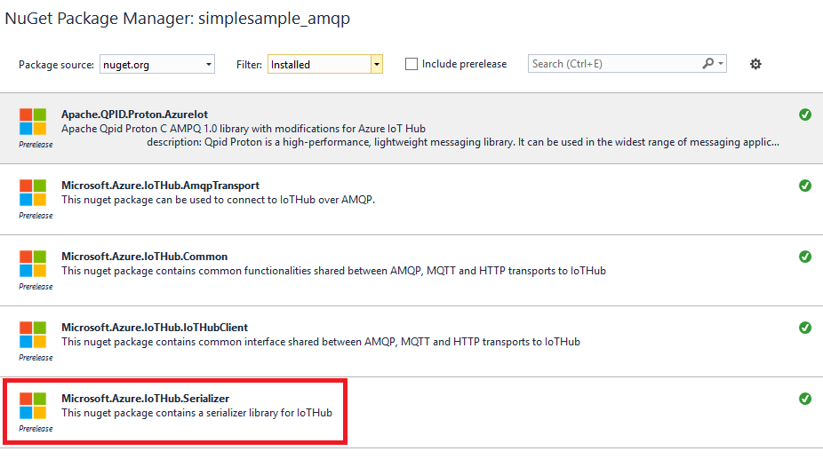

<properties
    pageTitle="Azure IoT Gerät SDK für C - Serialisierungsprogramm | Microsoft Azure"
    description="Weitere Informationen zum Verwenden der Bibliothek Serialisierungsprogramm in das Gerät Azure IoT SDK für C"
    services="iot-hub"
    documentationCenter=""
    authors="olivierbloch"
    manager="timlt"
    editor=""/>

<tags
     ms.service="iot-hub"
     ms.devlang="cpp"
     ms.topic="article"
     ms.tgt_pltfrm="na"
     ms.workload="na"
     ms.date="09/06/2016"
     ms.author="obloch"/>

# <a name="microsoft-azure-iot-device-sdk-for-c--more-about-serializer"></a>Microsoft Azure IoT Gerät SDK für C – Weitere Informationen zu Serialisierungsprogramm

Im [ersten Artikel](iot-hub-device-sdk-c-intro.md) in dieser Reihe eingeführt **Azure IoT Gerät SDK für C**. Im nächste Artikel bereitgestellt eine ausführlichere Beschreibung der der [**IoTHubClient**](iot-hub-device-sdk-c-iothubclient.md). In diesem Artikel schließt Schutz des SDK können, indem Sie eine ausführlichere Beschreibung der verbleibenden Komponente: **Serialisierungsprogramm** Bibliothek.

Im Artikel Einführung beschrieben, wie Sie mithilfe die Bibliothek **Serialisierungsprogramm** Ereignisse zu senden und Empfangen von IoT Hub. In diesem Artikel müssen Sie die Diskussion können, indem Sie eine genauere Beschreibung zum Modellieren von Daten mit den Makro- **Serialisierungsprogramm** Sprache erweitern. Im Artikel auch enthält ausführliche Informationen zur wie die Bibliothek Nachrichten serialisiert (und in einigen Fällen wie das Serialisierungsverhalten steuern können). Beschreiben wir auch einige Parameter, die Sie ändern können, die die Größe der Modelle bestimmen, die Sie erstellen.

Schließlich erneut im Artikel einige Themen in früheren Artikeln, wie etwa Nachricht und Eigenschaft Behandlung ansehen. Wie wir feststellen können, arbeiten diese Features auf die gleiche Weise, die die Bibliothek **Serialisierungsprogramm** verwenden, mit der Bibliothek **IoTHubClient** wie ein.

Alles in diesem Artikel beschriebenen basiert auf den **Serialisierungsprogramm** SDK-Beispielen. Wenn Sie nachvollziehen möchten, lesen Sie die **Simplesample\_Amqp** und **Simplesample\_http** Applikationen, die im Lieferumfang des Geräts Azure IoT SDK für C.

Sie können finden im [Microsoft Azure IoT SDKs](https://github.com/Azure/azure-iot-sdks) GitHub Repository **Azure IoT Gerät SDK für C** und Anzeigen von Details der API im [C-API-Referenz](http://azure.github.io/azure-iot-sdks/c/api_reference/index.html).

## <a name="the-modeling-language"></a>Die Modellierungssprache

Im [Artikel Einführung](iot-hub-device-sdk-c-intro.md) in dieser Reihe eingeführt werden dem **Azure IoT Gerät SDK für C** modeling Language durch das Beispiel in die **Simplesample\_Amqp** Anwendung:

```
BEGIN_NAMESPACE(WeatherStation);

DECLARE_MODEL(ContosoAnemometer,
WITH_DATA(ascii_char_ptr, DeviceId),
WITH_DATA(double, WindSpeed),
WITH_ACTION(TurnFanOn),
WITH_ACTION(TurnFanOff),
WITH_ACTION(SetAirResistance, int, Position)
);

END_NAMESPACE(WeatherStation);
```

Wie Sie sehen, basiert die Modellierungssprache auf C Makros. Beginnen Sie immer mit der Definition Ihrer **beginnen Sie mit der\_NAMESPACE** und enden immer mit **Ende\_NAMESPACE**. Üblicherweise benennen den Namespace für Ihr Unternehmen oder, wie in diesem Beispiel das Projekt, das Sie gerade arbeiten, wird.

Enthaltenen Elemente innerhalb des Namespace sind Modelldefinitionen. In diesem Fall ist ein einzelnes Modell für eine Anemometer vorhanden. Erneut das Modell benannte nichts, aber in der Regel heißt dies für das Gerät oder den Typ der Daten, die Sie mit IoT Hub austauschen möchten.  

Modelle enthalten die Definition der Ereignisse, die Sie können eingehende an IoT Verteiler (die *Daten*) sowie die Nachrichten, die Sie von IoT Hub (die *Aktionen*) erhalten können. Wie Sie aus dem Beispiel sehen können, haben Ereignisse einen Typ und einen Namen; Aktionen müssen einen Namen und optional Parameter (jeweils mit einem Typ).

Was nicht in diesem Beispiel veranschaulicht wird, sind zusätzliche Datentypen, die vom SDK unterstützt werden. Als Nächstes behandelt.

> [AZURE.NOTE] IoT Hub bezieht sich auf die Daten, die ein Gerät darauf als *Ereignisse*, sendet während die Modellierungssprache als *Daten* (mit **WITH_DATA**definiert) verweist. Ebenso bezieht sich IoT Hub ein, auf die Daten, die Sie an Geräte *Nachrichten*, senden während die Modellierungssprache als *Aktionen* (mit **WITH_ACTION**definiert) verweist. Achten Sie darauf, dass diese Ausdrücke in diesem Artikel synonym verwendet werden können.

### <a name="supported-data-types"></a>Unterstützte Datentypen

Die folgenden Datentypen werden in Modellen erstellt, mit der Bibliothek **Serialisierungsprogramm** unterstützt:

| Typ                    | Beschreibung                            |
|-------------------------|----------------------------------------|
| Doppelte                  | Festlegen des doppelten präzise Gleitkommazahl |
| Ganzzahl                     | 32-Bit-Ganzzahl                         |
| frei verschieben                   | Gleitkommazahl einfacher Genauigkeit |
| lange                    | lange ganze Zahl                           |
| int8\_t                 | 8-Bit-Ganzzahl                          |
| Int16\_t                | 16-Bit-Ganzzahl                         |
| Int32\_t                | 32-Bit-Ganzzahl                         |
| int64\_t                | 64-Bit-Ganzzahl                         |
| bool                    | Boolesch                                |
| ASCII\_Zeichen\_Ptr        | ASCII-Zeichenfolge                           |
| EDM\_Datum\_Zeit\_VERSETZT | Datum Uhrzeitoffset                       |
| EDM\_GUID               | GUID                                   |
| EDM\_BINÄRE             | Binärzahl                                 |
| Deklarieren\_Struktur         | komplexer Datentyp                      |

Beginnen wir mit dem letzten Datentyp. Die **DECLARE\_Struktur** können Sie zum Definieren komplexer Datentypen, die Gruppierung von den anderen primitiven Typen sind. Diese Gruppierungen können wir ein Modell definiert haben, die sieht wie folgt aus:

```
DECLARE_STRUCT(TestType,
double, aDouble,
int, aInt,
float, aFloat,
long, aLong,
int8_t, aInt8,
uint8_t, auInt8,
int16_t, aInt16,
int32_t, aInt32,
int64_t, aInt64,
bool, aBool,
ascii_char_ptr, aAsciiCharPtr,
EDM_DATE_TIME_OFFSET, aDateTimeOffset,
EDM_GUID, aGuid,
EDM_BINARY, aBinary
);

DECLARE_MODEL(TestModel,
WITH_DATA(TestType, Test)
);
```

Unser Modell enthält ein Datenereignis einzelnen vom Typ **TestType**. **TestType** ist ein komplexer Typ, der mehrere Mitglieder gemeinsam führen Sie vor, die vom **Serialisierungsprogramm** modeling Language unterstützten primitiven Typen enthält.

Mit einem Modell wie folgt können wir Schreiben von Code, um Daten zu IoT Hub zu senden, die wie folgt aussieht:

```
TestModel* testModel = CREATE_MODEL_INSTANCE(MyThermostat, TestModel);

testModel->Test.aDouble = 1.1;
testModel->Test.aInt = 2;
testModel->Test.aFloat = 3.0f;
testModel->Test.aLong = 4;
testModel->Test.aInt8 = 5;
testModel->Test.auInt8 = 6;
testModel->Test.aInt16 = 7;
testModel->Test.aInt32 = 8;
testModel->Test.aInt64 = 9;
testModel->Test.aBool = true;
testModel->Test.aAsciiCharPtr = "ascii string 1";

time_t now;
time(&now);
testModel->Test.aDateTimeOffset = GetDateTimeOffset(now);

EDM_GUID guid = { { 0x00, 0x01, 0x02, 0x03, 0x04, 0x05, 0x06, 0x07, 0x08, 0x09, 0x0A, 0x0B, 0x0C, 0x0D, 0x0E, 0x0F } };
testModel->Test.aGuid = guid;

unsigned char binaryArray[3] = { 0x01, 0x02, 0x03 };
EDM_BINARY binaryData = { sizeof(binaryArray), &binaryArray };
testModel->Test.aBinary = binaryData;

SendAsync(iotHubClientHandle, (const void*)&(testModel->Test));
```

Im Wesentlichen, wir Zuweisen eines Werts zu jedem Mitglied der Struktur **Testen** und anschließendes Aufrufen **SendAsync** , um das Ereignis der **Test** -Daten in der Cloud zu senden. **SendAsync** ist eine Helper-Funktion, die ein Ereignis eines einzelnen an IoT Hub sendet:

```
void SendAsync(IOTHUB_CLIENT_LL_HANDLE iotHubClientHandle, const void *dataEvent)
{
    unsigned char* destination;
    size_t destinationSize;
    if (SERIALIZE(&destination, &destinationSize, *(const unsigned char*)dataEvent) ==
    {
        // null terminate the string
        char* destinationAsString = (char*)malloc(destinationSize + 1);
        if (destinationAsString != NULL)
        {
            memcpy(destinationAsString, destination, destinationSize);
            destinationAsString[destinationSize] = '\0';
            IOTHUB_MESSAGE_HANDLE messageHandle = IoTHubMessage_CreateFromString(destinationAsString);
            if (messageHandle != NULL)
            {
                IoTHubClient_SendEventAsync(iotHubClientHandle, messageHandle, sendCallback, (void*)0);

                IoTHubMessage_Destroy(messageHandle);
            }
            free(destinationAsString);
        }
        free(destination);
    }
}
```

Diese Funktion das Datenereignis angegebenen serialisiert und sendet es IoT Hub mit **IoTHubClient\_SendEventAsync**. Dies ist derselbe Code in früheren Artikeln (**SendAsync** Logik in eine geeignete Funktion kapselt) behandelt.

Eine andere im vorherigen Code verwendeten Helper-Funktion ist **GetDateTimeOffset**. Diese Funktion wandelt die angegebene Zeit in einen Wert des Typs **EDM\_Datum\_Zeit\_VERSETZT**:

```
EDM_DATE_TIME_OFFSET GetDateTimeOffset(time_t time)
{
    struct tm newTime;
    gmtime_s(&newTime, &time);
    EDM_DATE_TIME_OFFSET dateTimeOffset;
    dateTimeOffset.dateTime = newTime;
    dateTimeOffset.fractionalSecond = 0;
    dateTimeOffset.hasFractionalSecond = 0;
    dateTimeOffset.hasTimeZone = 0;
    dateTimeOffset.timeZoneHour = 0;
    dateTimeOffset.timeZoneMinute = 0;
    return dateTimeOffset;
}
```

Wenn Sie diesen Code ausführen, wird die folgende Meldung an IoT Verteiler gesendet:

```
{"aDouble":1.100000000000000, "aInt":2, "aFloat":3.000000, "aLong":4, "aInt8":5, "auInt8":6, "aInt16":7, "aInt32":8, "aInt64":9, "aBool":true, "aAsciiCharPtr":"ascii string 1", "aDateTimeOffset":"2015-09-14T21:18:21Z", "aGuid":"00010203-0405-0607-0809-0A0B0C0D0E0F", "aBinary":"AQID"}
```

Beachten Sie, dass die Serialisierung JSON, einer Zahlenmenge ist das von der Bibliothek **Serialisierungsprogramm** generierte Format. Beachten Sie auch, dass jedes Mitglied der serialisierten JSON-Objekt die Mitglieder der **TestType** entspricht, die wir in unseren Modell definiert. Auch genau entsprechen den Werten in den Code verwendet. Beachten Sie, dass die binären Daten base64-codierte ist jedoch: "AQID" ist die base64 Codieren von {0 x 01, 0 x 02, 0 x 03}.

In diesem Beispiel wird veranschaulicht, des Vorteil der Verwendung der Bibliothek **Serialisierungsprogramm** – wir können JSON in der Cloud zu senden, ohne Serialisierung in unserer Anwendung explizit behandelt. Festlegen der Werte der Datenereignisse ist, gibt es keine Gedanken in unser Modell und anschließendes aufrufen einfache-APIs, um diese Ereignisse in der Cloud zu senden.

Mithilfe dieser Informationen können wir Modelle definieren, die den Zellbereich, der unterstützten Datentypen, einschließlich komplexe Datentypen (Wir konnten auch komplexe Typen in anderen komplexen Typen gehören) enthalten. Jedoch serialisiert er JSON generiert werden, indem Sie im oben genannten Beispiel zeigt ein wichtiger Punkt. *Wie* unsere Mitteilungen an Daten mit der Bibliothek **Serialisierungsprogramm** bestimmt, wie genau die JSON formatiert ist. Dieser bestimmten Zeitpunkt entspricht, was wir weiter damit befassen.

## <a name="more-about-serialization"></a>Weitere Informationen zu Serialisierung

Im vorherigen Abschnitt wird ein Beispiel für die Ausgabe vom **Serialisierungsprogramm** Bibliothek hervorgehoben. In diesem Abschnitt werden wir erläutern, wie die Bibliothek Daten serialisiert und wie Sie dieses Verhalten mithilfe der Serialisierungsüberschreibungen APIs steuern können.

Um die Diskussion auf Serialisierung zur nächsten Folie wechseln, arbeiten wir mit einem neuen Modell basierend auf ein Thermostat. Zunächst geben Sie uns Hintergrundinformationen auf dem Szenario wir, die Adresse versuchen.

Wir möchten ein Thermostat modellieren, die Temperatur und Feuchtigkeit misst. Jedes Datenelement geht anders IoT Hub gesendet werden. Standardmäßig ist die Thermostat Ingresses ein Ereignis Temperatur einmal alle 2 Minuten; ein Ereignis Luftfeuchtigkeit ist ein ingressed alle 15 Minuten. Wenn entweder Ereignis ingressed ist, müssen sie einen Zeitstempel enthalten, der der Uhrzeit zeigt, dass die entsprechenden Temperatur oder Feuchtigkeit gemessen wurde.

Dieses Szenario wird angegeben, werden wir Ihnen zeigen, zwei verschiedene Verfahren zum Modellieren von Daten und des Effekts wird erläutert, dass die serialisierte Ausgabe Modellierung definiert wurde.

### <a name="model-1"></a>Modell 1

Hier ist ein Modell, das das vorherige Szenario unterstützt die erste Version aus:

```
BEGIN_NAMESPACE(Contoso);

DECLARE_STRUCT(TemperatureEvent,
int, Temperature,
EDM_DATE_TIME_OFFSET, Time);

DECLARE_STRUCT(HumidityEvent,
int, Humidity,
EDM_DATE_TIME_OFFSET, Time);

DECLARE_MODEL(Thermostat,
WITH_DATA(TemperatureEvent, Temperature),
WITH_DATA(HumidityEvent, Humidity)
);

END_NAMESPACE(Contoso);
```

Beachten Sie, dass das Modell zwei Datenereignisse enthält: **Temperatur** und **Feuchtigkeit**. Im Gegensatz zu den vorherigen Beispielen, der Typ der einzelnen Ereignisse ist eine Struktur mit definiert **DECLARE\_Struktur**. **TemperatureEvent** enthält ein Maß Temperatur und einen Zeitstempel; **HumidityEvent** enthält ein Maß Feuchtigkeit und einen Zeitstempel. Dieses Modell ermöglicht es uns natürlich, die Daten für die oben beschriebenen Szenario modellieren. Wenn wir ein Ereignisses in der Cloud senden, senden wir der Person entweder einen Temperatur/Zeitstempel oder ein paar Luftfeuchtigkeit/Zeitstempel.

Wir können eine Temperatur Ereignis mithilfe von Code wie den folgenden in der Cloud zu senden:

```
time_t now;
time(&now);
thermostat->Temperature.Temperature = 75;
thermostat->Temperature.Time = GetDateTimeOffset(now);

unsigned char* destination;
size_t destinationSize;
if (SERIALIZE(&destination, &destinationSize, thermostat->Temperature) == IOT_AGENT_OK)
{
    sendMessage(iotHubClientHandle, destination, destinationSize);
}
```

Wir werden hartcodierte Werte für Temperatur und Feuchtigkeit im Code verwenden, aber angenommen, wir tatsächlich diese Werte abrufen sind, durch die entsprechenden Sensoren auf die Thermostat aufnehmen.

Der obige Code verwendet die **GetDateTimeOffset** -Hilfe, die zuvor eingeführt wurde. Gründen, die deaktivieren höher verwendet werden soll, trennt dieser Code explizit die Aufgabe serialisieren und senden das Ereignis aus. Der vorherige Code serialisiert das Ereignis Temperatur in einen Puffer. Klicken Sie dann **SendMessage** ist eine Helper-Funktion (im Lieferumfang von **Simplesample\_Amqp**), der das Ereignis an IoT Hub sendet:

```
static void sendMessage(IOTHUB_CLIENT_HANDLE iotHubClientHandle, const unsigned char* buffer, size_t size)
{
    static unsigned int messageTrackingId;
    IOTHUB_MESSAGE_HANDLE messageHandle = IoTHubMessage_CreateFromByteArray(buffer, size);
    if (messageHandle != NULL)
    {
        IoTHubClient_SendEventAsync(iotHubClientHandle, messageHandle, sendCallback, (void*)(uintptr_t)messageTrackingId);

        IoTHubMessage_Destroy(messageHandle);
    }
    free((void*)buffer);
}
```

Dieser Code ist eine Teilmenge der **SendAsync** Helper im vorherigen Abschnitt beschrieben, damit wir darauf erneut hier Details eingehen.

Wenn des vorhergehenden Codes zum Senden des Temperatur Ereignis ausgeführt wird, wird diese serialisierte Form des Ereignisses an IoT Verteiler gesendet:

```
{"Temperature":75, "Time":"2015-09-17T18:45:56Z"}
```

Wir haben eine Temperatur vom Typ **TemperatureEvent** senden, und die Struktur enthält ein Mitglied **Temperatur** und **Zeit** . Dies wird direkt in die serialisierten Daten angezeigt.

Auf ähnliche Weise können wir ein Ereignis Feuchtigkeit mit diesem Code senden:

```
thermostat->Humidity.Humidity = 45;
thermostat->Humidity.Time = GetDateTimeOffset(now);
if (SERIALIZE(&destination, &destinationSize, thermostat->Humidity) == IOT_AGENT_OK)
{
    sendMessage(iotHubClientHandle, destination, destinationSize);
}
```

Die serialisierte Form, die an IoT Verteiler gesendet wird wie folgt angezeigt:

```
{"Humidity":45, "Time":"2015-09-17T18:45:56Z"}
```

In diesem Fall ist dies wie erwartet.

Mit diesem Modell können Sie sich vorstellen, wie zusätzliche Ereignisse einfach hinzugefügt werden kann. Definieren Sie weitere Strukturen mit **DECLARE\_Struktur**, und schließen Sie das entsprechende Ereignis in das Modell mit **mit\_Daten**.

Jetzt, lassen Sie uns das Modell ändern, sodass dieselben Daten enthalten sind, aber mit einer anderen Struktur.

### <a name="model-2"></a>Modell 2

Betrachten Sie diese alternative Modell, das aus:

```
DECLARE_MODEL(Thermostat,
WITH_DATA(int, Temperature),
WITH_DATA(int, Humidity),
WITH_DATA(EDM_DATE_TIME_OFFSET, Time)
);
```

In diesem Fall haben wir beseitigt die **DECLARE\_Struktur** Makros und einfach die Datenelemente aus unserem Szenario mithilfe von einfachen Typen aus der Modellierungssprache definieren.

Nur für den Pearsonschen ignorieren Sie uns das Ereignis **Zeit** . Mit davon so sieht der Code eingehende **Temperatur**:

```
time_t now;
time(&now);
thermostat->Temperature = 75;

unsigned char* destination;
size_t destinationSize;
if (SERIALIZE(&destination, &destinationSize, thermostat->Temperature) == IOT_AGENT_OK)
{
    sendMessage(iotHubClientHandle, destination, destinationSize);
}
```

Dieser Code sendet die folgenden serialisierten Ereignisses an IoT-Hub an:

```
{"Temperature":75}
```

Und der Code für das Ereignis Feuchtigkeit senden sieht wie folgt aus:

```
thermostat->Humidity = 45;
if (SERIALIZE(&destination, &destinationSize, thermostat->Humidity) == IOT_AGENT_OK)
{
    sendMessage(iotHubClientHandle, destination, destinationSize);
}
```

Dieser Code wird dadurch zum IoT-Hub an:

```
{"Humidity":45}
```

Es gibt bisher noch keine Auflösung. Jetzt wir ändern, wie wir das Makro SERIALIZE verwenden.

Das Makro **SERIALIZE** kann mehrere Datenereignisse als Argumente annehmen. Damit können wir das Ereignis **Temperatur** und **Feuchtigkeit** zusammen serialisieren und an IoT Hub einen Anruf gesendet werden:

```
if (SERIALIZE(&destination, &destinationSize, thermostat->Temperature, thermostat->Humidity) == IOT_AGENT_OK)
{
    sendMessage(iotHubClientHandle, destination, destinationSize);
}
```

Tippen Sie vielleicht, dass das Ergebnis dieses Codes ist, dass die beiden Ereignisse IoT Hub gesendet werden:

[

{"Temperatur": 75},

{"Feuchtigkeit": 45}

]

Kurzum, erwarten Sie, dass dieser Code der **Temperatur** und **Feuchtigkeit** separat senden identisch ist. Es ist lediglich eine Vereinfachung für beide Ereignisse an **SERIALIZE** im gleichen Anruf zu übergeben. Die ist jedoch nicht der Fall. Stattdessen sendet der oben angegebenen Code dieses Datenereignis einzelnen an IoT Hub an:

{"Temperatur": 75, "Feuchtigkeit": 45}

Dies scheint möglicherweise ungewöhnliches, da unser Modell **Temperatur** und **Feuchtigkeit** als zwei *verschiedene* Ereignisse definiert:

```
DECLARE_MODEL(Thermostat,
WITH_DATA(int, Temperature),
WITH_DATA(int, Humidity),
WITH_DATA(EDM_DATE_TIME_OFFSET, Time)
);
```

Der Punkt haben wir mehr diese Ereignisse modellieren **Temperatur** und **Feuchtigkeit** , in denen dieselbe Struktur werden:

```
DECLARE_STRUCT(TemperatureAndHumidityEvent,
int, Temperature,
int, Humidity,
);

DECLARE_MODEL(Thermostat,
WITH_DATA(TemperatureAndHumidityEvent, TemperatureAndHumidity),
);
```

Wenn dieses Modell verwendet wird, ist es wäre leichter zu verstehen, wie **Temperatur** und **Feuchtigkeit** in der gleichen serialisierten Nachricht gesendet wird. Jedoch löschen möglicherweise nicht, warum es auf diese Weise funktioniert, wenn Sie beide Datenereignisse an **SERIALIZE** übergeben Modell 2 verwenden.

Dieses Verhalten ist leichter zu verstehen, wenn Sie wissen, dass die Annahmen, die die Bibliothek **Serialisierungsprogramm** vornehmen, ist. Um die Verständlichkeit zu diesen wechseln wir zurück zu unserem Modell:

```
DECLARE_MODEL(Thermostat,
WITH_DATA(int, Temperature),
WITH_DATA(int, Humidity),
WITH_DATA(EDM_DATE_TIME_OFFSET, Time)
);
```

Stellen Sie sich dieses Modell in objektorientierten Ausdrücke. In diesem Fall sind wir ein physisches Gerät (ein Thermostat) modeling und das Gerät enthält Attribute wie **Temperatur** und **Feuchtigkeit**.

Wir können den gesamten Zustand unseres Modells mit Code wie den folgenden senden:

```
if (SERIALIZE(&destination, &destinationSize, thermostat->Temperature, thermostat->Humidity, thermostat->Time) == IOT_AGENT_OK)
{
    sendMessage(iotHubClientHandle, destination, destinationSize);
}
```

Wenn die Werte der Temperatur, Luftfeuchtigkeit und die Uhrzeit festgelegt sind, wir sieht ein Ereignis wie folgt an IoT Hub gesendet werden:

```
{"Temperature":75, "Humidity":45, "Time":"2015-09-17T18:45:56Z"}
```

Manchmal können Sie nur *einige* Eigenschaften des Modells in der Cloud senden möchten (Dies ist insbesondere dann, wenn Ihr Modell eine große Anzahl von Ereignissen Daten enthält). Es ist sinnvoll, nur eine Teilmenge der Datenereignisse, beispielsweise als in früheren Beispiel zu senden:

```
{"Temperature":75, "Time":"2015-09-17T18:45:56Z"}
```

Wenn Sie generiert genau das gleiche serialisierte Ereignis wie wir eine **TemperatureEvent** mit Mitglied **Temperatur** und **Zeit** definiert haben wie wir mit dem Modell 1 ausgeführt. In diesem Fall konnten wir genau das gleiche serialisierte Ereignis mithilfe eines anderen Modells (Modell 2), da wir **SERIALIZE** auf eine andere Weise aufgerufen generieren.

Wichtig ist, die aus, wenn Sie mehrere Datenereignisse **SERIALIZE,** übergeben, und es wird davon ausgegangen, dass jede Ereignis Eigenschaft in ein einzelnes JSON-Objekt ist.

Die beste Methode hängt davon ab, Sie haben und wie Sie Ihr Modell anzustellen. Wenn Sie "Ereignisse" in der Cloud senden, und jedes Ereignis einen definierten Satz von Eigenschaften enthält, dann ist der erste Ansatz vor allem sinnvoll. Verwenden Sie in diesem Fall **DECLARE\_Struktur** definieren die Struktur der einzelnen Ereignisse, und nehmen sie dann im Modell mit den **mit\_Daten** Makro. Klicken Sie dann senden Sie jedes Ereignis aus, wie in der ersten oben genannten Beispiel. Bei dieser Vorgehensweise würden Sie nur ein Ereignis eines einzelnen an **SERIALISIERUNGSPROGRAMM**übergeben.

Wenn Sie über Ihr Modell in einer objektorientierten Weise vorstellen, kann die zweite Vorgehensweise Sie entsprechend. In diesem Fall mit die Elementen definiert **mit\_Daten** sind die "Eigenschaften" des Objekts. Sie übergeben jeden Teilmenge von Ereignissen zu **SERIALIZE** , die Sie, je nachdem, wie viel von "den Status des Objekts" zufrieden sind, die Sie in der Cloud senden möchten.

Nether Ansatz ist die richtige oder falsche. Nur Achten Sie auf die Bibliothek **Serialisierungsprogramm** Funktionsweise von, und wählen Sie aus der Modellierung Ansatz, der Ihren Bedürfnissen entspricht.

## <a name="message-handling"></a>Nachrichtenbehandlung

Bisher in diesem Artikel weist nur zu IoT Hub senden Ereignisse beschrieben, und Empfangen von Nachrichten noch nicht berücksichtigt werden. Der Grund dafür ist, was müssen wir wissen zum Empfangen von Nachrichten in einer [früheren Artikel](iot-hub-device-sdk-c-intro.md)weitgehend abgedeckt wurde. Erinnern Sie diesen Artikel, wenn Sie Nachrichten durchführen, indem Sie eine Nachricht Rückruffunktion registrieren:

```
IoTHubClient_SetMessageCallback(iotHubClientHandle, IoTHubMessage, myWeather)
```

Schreiben Sie anschließend die Rückruffunktion, die aufgerufen wird, wenn eine Nachricht empfangen wird:

```
static IOTHUBMESSAGE_DISPOSITION_RESULT IoTHubMessage(IOTHUB_MESSAGE_HANDLE message, void* userContextCallback)
{
    IOTHUBMESSAGE_DISPOSITION_RESULT result;
    const unsigned char* buffer;
    size_t size;
    if (IoTHubMessage_GetByteArray(message, &buffer, &size) != IOTHUB_MESSAGE_OK)
    {
        printf("unable to IoTHubMessage_GetByteArray\r\n");
        result = EXECUTE_COMMAND_ERROR;
    }
    else
    {
        /*buffer is not zero terminated*/
        char* temp = malloc(size + 1);
        if (temp == NULL)
        {
            printf("failed to malloc\r\n");
            result = EXECUTE_COMMAND_ERROR;
        }
        else
        {
            memcpy(temp, buffer, size);
            temp[size] = '\0';
            EXECUTE_COMMAND_RESULT executeCommandResult = EXECUTE_COMMAND(userContextCallback, temp);
            result =
                (executeCommandResult == EXECUTE_COMMAND_ERROR) ? IOTHUBMESSAGE_ABANDONED :
                (executeCommandResult == EXECUTE_COMMAND_SUCCESS) ? IOTHUBMESSAGE_ACCEPTED :
                IOTHUBMESSAGE_REJECTED;
            free(temp);
        }
    }
    return result;
}
```

Diese Implementierung von **IoTHubMessage** Ruft die bestimmte Funktion für jede Aktion im Modell. Angenommen, Ihr Modell diese Aktion definiert:

```
WITH_ACTION(SetAirResistance, int, Position)
```

Sie müssen eine Funktion mit dieser Signatur definieren:

```
EXECUTE_COMMAND_RESULT SetAirResistance(ContosoAnemometer* device, int Position)
{
    (void)device;
    (void)printf("Setting Air Resistance Position to %d.\r\n", Position);
    return EXECUTE_COMMAND_SUCCESS;
}
```

**SetAirResistance** wird aufgerufen, wenn die Nachricht an Ihr Gerät gesendet wird.

Was wir Erläuterung noch nicht steht noch die serialisierte Version der Nachricht aussieht. Kurzum, wenn Sie eine Nachricht **SetAirResistance** an Ihr Gerät senden möchten, sieht was, die aus?

Wenn Sie eine Nachricht an ein Gerät senden, möchten Sie über den Dienst Azure IoT SDK erfolgen. Sie müssen immer noch wissen, welche Zeichenfolge senden an eine bestimmte Aktion aufzurufen. Das Standardformat für das Senden einer Nachricht sieht wie folgt aus:

```
{"Name" : "", "Parameters" : "" }
```

Sie sind ein serialisiertes JSON-Objekt mit zwei Eigenschaften senden: **Name** ist der Name der Aktion (Nachricht) und **Parameter** enthält die Parameter dieser Aktion.

Beispielsweise können Sie zum Aufrufen von **SetAirResistance** diese Meldung an ein Gerät senden:

```
{"Name" : "SetAirResistance", "Parameters" : { "Position" : 5 }}
```

Name der Aktion muss eine im Modell definierte Aktion genau übereinstimmen. Die Parameternamen müssen ebenfalls übereinstimmen. Beachten Sie auch die Groß-/Kleinschreibung beachtet. **Name** und **Parameter** werden immer in Großbuchstaben. Vergewissern Sie sich in der Groß-/Kleinschreibung Ihrer Aktionsnamen und Parameter im Modell entsprechen. In diesem Beispiel wird der Aktionsname "SetAirResistance" und nicht "Setairresistance".

In diesem Abschnitt beschriebenen alles, was Sie wissen, wann Ereignisse beim Senden und Empfangen von Nachrichten mit der Bibliothek **Serialisierungsprogramm** müssen. Bevor Sie fortfahren, hervorgehen, lassen Sie uns einige Parameter, die Sie konfigurieren können, die steuern, wie groß Ihr Modell ist.

## <a name="macro-configuration"></a>Makro-Konfiguration

Wenn Sie die Bibliothek **Serialisierungsprogramm** verwenden, ist ein wichtiger Teil des SDK berücksichtigen in der Bibliothek Azure c freigegebene Programm gefunden.
Wenn Sie das Repository Azure-Iot-Sdks von GitHub mit der Option – rekursive geklont haben, klicken Sie dann finden Sie hier diese Bibliothek für freigegebene Programm:

```
.\\c\\azure-c-shared-utility
```

Wenn Sie die Bibliothek nicht geklont haben, finden Sie ihn [hier](https://github.com/Azure/azure-c-shared-utility).

Innerhalb der Bibliothek freigegebene Programm finden Sie im folgenden Ordner:

```
azure-c-shared-utility\\macro\_utils\_h\_generator.
```

Dieser Ordner enthält eine Visual Studio-Lösung aufgerufen **Makro\_Utils\_h\_generator.sln**:

  

Das Programm in dieser Lösung generiert die **Makros\_utils.h** Datei. Es ist ein Standardmakro\_utils.h-Datei, die im Lieferumfang des SDK enthalten. Mit dieser Lösung können Sie einige Parameter ändern, und klicken Sie dann auf der Grundlage dieser Parameter die Header-Datei neu zu erstellen.

Die beiden wichtigsten Parameter mit befassen werden **nArithmetic** und **nMacroParameters** , die in den folgenden zwei Zeilen finden Sie im Makro definiert sind\_utils.tt:

```
<#int nArithmetic=1024;#>
<#int nMacroParameters=124;/*127 parameters in one macro definition in C99 in chapter 5.2.4.1 Translation limits*/#>

```

Diese Werte sind die standardmäßigen Parameter, die im Lieferumfang des SDK enthalten. Jeder Parameter hat folgende Bedeutung:

-   nMacroParameters – steuert, wie viele Parameter kann von Ihnen in einem DECLARE\_Modell Makrodefinition.

-   nArithmetic – steuert die Gesamtzahl der Elemente in einem Modell zulässig.

Der Grund dafür, dass diese Parameter wichtig sind ist, da sie steuern, wie groß Ihr Modell sein kann. Angenommen Sie, dieses Modelldefinition:

```
DECLARE_MODEL(MyModel,
WITH_DATA(int, MyData)
);
```

Wie zuvor erwähnt, **DECLARE\_Modell** ist einfach ein C Makro. Den Namen des Modells und die **mit\_Daten** -Anweisung (noch ein anderes Makro) sind Parameter **DECLARE\_Modell**. **nMacroParameters** definiert, wie viele Parameter in enthalten sein können **DECLARE\_Modell**. Effektiv, definiert dies wie viele Daten Ereignis und Aktion Deklarationen können Sie haben. Mit der standardmäßigen maximal 124 bedeutet dies daher, können Sie ein Modell mit einer Kombination von Aktionen zu 60 und Datenereignisse definieren. Wenn Sie versuchen, die diese Beschränkung überschreiten, erhalten Sie Compiler-Fehler, die ähnlich wie folgt aus:

  

Der Parameter **nArithmetic** ist mehr über die interne Funktionsweise der Makrosprache als der Anwendung.  Sie steuert die Gesamtzahl der Mitglieder, die Sie im Modell, einschließlich **DECLARE_STRUCT** Makros haben können. Wenn Sie beginnen Compilerfehler wie folgt angezeigt werden, sollten Sie versuchen, zunehmender **nArithmetic**:

   

Wenn Sie diese Parameter ändern möchten, ändern Sie die Werte im Makro\_utils.tt ablegen, kompilieren Sie das Makro neu\_Utils\_h\_generator.sln Lösung, und führen Sie das kompilierte Programm. Wenn Sie dazu, ein neues Makro\_utils.h Datei erstellt wird und in der. \\allgemeine\\Inc. Verzeichnis.

Um die neue Version des Makros verwenden\_utils.h, entfernen Sie das **Serialisierungsprogramm** NuGet-Paket aus der Lösung und an ihrer Stelle einschließen **Serialisierungsprogramm** Visual Studio-Projekt. Dies kann der Code der Bibliothek Serialisierungsprogramm-Quellcode zu kompilieren. Dies umfasst das aktualisierte Makro\_utils.h. Wenn Sie dies tun für möchten **Simplesample\_Amqp**, starten, indem Sie die Lösung NuGet-Paket für die Bibliothek Serialisierungsprogramm entfernen:

   

Fügen Sie dann in der Visual Studio-Lösung dieses Projekt hinzu:

> . \\c\\Serialisierungsprogramm\\erstellen\\Windows\\serializer.vcxproj

Wenn Sie fertig sind, sollte Ihre Lösung wie folgt aussehen:

   

Jetzt wird beim Kompilieren Ihrer Lösung, die das aktualisierte Makro\_utils.h in die Binärdatei enthalten ist.

Beachten Sie, dass diese steigenden hoch genug Compiler Grenzwerte überschreiten kann. Bis zu diesem Punkt ist die **nMacroParameters** der Hauptfenster Parameter mit dem betreffenden sein. Die C99 Spezifikation gibt an, dass mindestens 127 Parameter in der Makrodefinition eines zulässig sind. Der Microsoft-Compiler die Spezifikation genau folgt (und sind maximal 127), Sie können also **nMacroParameters** jenseits der Standardwert zu erhöhen. Andere Compiler können Sie hierzu (beispielsweise der GNU Compiler einen höheren Grenzwert unterstützt).

Bisher haben wir fast alles erläutert, die Sie Schreiben von Code mit der Bibliothek **Serialisierungsprogramm** kennen müssen. Vor dem Abschluss eines, besuchen Sie uns einige Themen aus den vorherigen Artikeln, in denen Sie Fragen zu sich möglicherweise.

## <a name="the-lower-level-apis"></a>Die Low-Level-APIs

Die Stichprobe Anwendung in diesem Artikel Schwerpunkt wird **Simplesample\_Amqp**. In diesem Beispiel wird der höheren Ebene (die nicht "LL") APIs Ereignisse senden und Empfangen von Nachrichten. Wenn Sie diese APIs verwenden, wird ein Hintergrundthread ausgeführt, die sorgt dafür, dass sowohl Ereignisse senden und Empfangen von Nachrichten. Allerdings können Sie die Low-Level-APIs (LL) zur Vermeidung von dieser Hintergrundthread, und machen Sie expliziten Steuerung, wenn Sie Ereignisse senden oder Empfangen von Nachrichten aus der Cloud.

Wie in einem [vorherigen Artikel](iot-hub-device-sdk-c-iothubclient.md)beschrieben, gibt es eine Reihe von Funktionen, die von der höheren Ebene APIs besteht aus:

-   IoTHubClient\_CreateFromConnectionString

-   IoTHubClient\_SendEventAsync

-   IoTHubClient\_SetMessageCallback

-   IoTHubClient\_löschen

Diese APIs werden veranschaulicht **Simplesample\_Amqp**.

Es gibt auch eine der Satz von Low-Level-APIs.

-   IoTHubClient\_LLEN\_CreateFromConnectionString

-   IoTHubClient\_LLEN\_SendEventAsync

-   IoTHubClient\_LLEN\_SetMessageCallback

-   IoTHubClient\_LLEN\_löschen

Beachten Sie, dass die Low-Level-APIs genauso arbeiten, wie in den vorherigen Artikeln beschrieben. Wenn Sie einen Hintergrundthread Ereignisse beim Senden und Empfangen von Nachrichten verarbeitet möchten, können Sie den ersten Satz von APIs verwenden. Verwenden Sie die zweite Gruppe von APIs, wenn expliziten Steuerung beim Senden und Empfangen von Daten über IoT-Hub angezeigt werden soll. Beide Sätze von APIs arbeiten mit der Bibliothek **Serialisierungsprogramm** gleich gut.

Ein Beispiel dafür, wie die Low-Level-APIs für die Bibliothek **Serialisierungsprogramm** verwendet werden, finden Sie unter der **Simplesample\_http** Anwendung.

## <a name="additional-topics"></a>Weitere Themen

Einigen Weitere Themen erwähnt sind wieder Eigenschaft behandeln, alternative Gerät Anmeldeinformationen, und Konfigurationsoptionen zu verwenden. Dies sind alle Themen in einem [vorherigen Artikel](iot-hub-device-sdk-c-iothubclient.md)aus. Die wesentlichen Aspekte ist, dass alle diese Features auf die gleiche Weise mit der Bibliothek **Serialisierungsprogramm** arbeiten, wie mit der **IoTHubClient** -Bibliothek. Beispielsweise, wenn Sie die Eigenschaften eines Ereignisses aus einem Modell zuordnen möchten, Sie verwenden **IoTHubMessage\_Eigenschaften** und **Karte**\_**AddorUpdate**, die gleiche Weise wie zuvor beschrieben:

```
MAP_HANDLE propMap = IoTHubMessage_Properties(message.messageHandle);
sprintf_s(propText, sizeof(propText), "%d", i);
Map_AddOrUpdate(propMap, "SequenceNumber", propText);
```

Ob das Ereignis aus der Bibliothek **Serialisierungsprogramm** generiert oder manuell mithilfe der Bibliothek **IoTHubClient** erstellt wurde, spielt keine Rolle.

Für das Gerät alternative Anmeldeinformationen, **IoTHubClient\_LLEN\_erstellen** funktioniert ebenso gut als **IoTHubClient\_CreateFromConnectionString** für die Zuweisung eines **IOTHUB\_CLIENT\_verarbeitet**.

Schließlich, wenn Sie die Bibliothek **Serialisierungsprogramm** verwenden, können Sie festlegen Konfigurationsoptionen mit **IoTHubClient\_LLEN\_SetOption** nur als Meinten bei Verwendung der Bibliothek **IoTHubClient** .

Ein Feature, das in der Bibliothek **Serialisierungsprogramm** eindeutig ist sind die Initialisierung APIs. Bevor Sie das Arbeiten mit der Bibliothek beginnen können, müssen Sie aufrufen **Serialisierungsprogramm\_Initialisierung**:

```
serializer_init(NULL);
```

Dies ist nur vor dem Anruf **IoTHubClient\_CreateFromConnectionString**.

Auf ähnliche Weise, wenn Sie damit fertig sind mit der Bibliothek arbeiten, der letzte Anruf wird vorgenommenen besteht darin **Serialisierungsprogramm\_Deinit**:

```
serializer_deinit();
```

Andernfalls funktionieren aller aufgeführten Features in der Bibliothek **Serialisierungsprogramm** wie in der Bibliothek **IoTHubClient** . Weitere Informationen zu diesen Themen finden Sie im [vorherigen Artikel](iot-hub-device-sdk-c-iothubclient.md) in dieser Reihe.

## <a name="next-steps"></a>Nächste Schritte

In diesem Artikel werden die spezifischen Aspekte **Serialisierungsprogramm** Bibliothek enthalten, in dem **Azure IoT Gerät SDK für C**im Detail aus. Mit der Informationen zur Verfügung gestellt, dass Sie gute Kenntnisse über die Verwendung von Datenmodellen zu Ereignisse senden und Empfangen von IoT Hub sein soll.

Damit ist auch der dreiteiligen Reihe zum Entwickeln von Applications mit dem **Azure IoT Gerät SDK für C**abgeschlossen. Dies sollte genügend Informationen nicht nur Ihnen als Ausgangspunkt aber bieten Ihnen einen detaillierten Überblick über die Funktionsweise der APIs sein. Weitere Informationen gibt es ein paar Beispiele im SDK hier nicht erwähnt wurden. Andernfalls wird der [SDK-Dokumentation](https://github.com/Azure/azure-iot-sdks) eine gute Ressource für zusätzliche Informationen.


Weitere Informationen zum Entwickeln für IoT Hub finden Sie unter den [IoT Hub SDKs][lnk-sdks].

Die Funktionen von IoT Hub weiteren kann, finden Sie unter:

- [Ein Gerät mit dem IoT Gateway SDK simulieren][lnk-gateway]

[lnk-sdks]: iot-hub-devguide-sdks.md

[lnk-gateway]: iot-hub-linux-gateway-sdk-simulated-device.md
