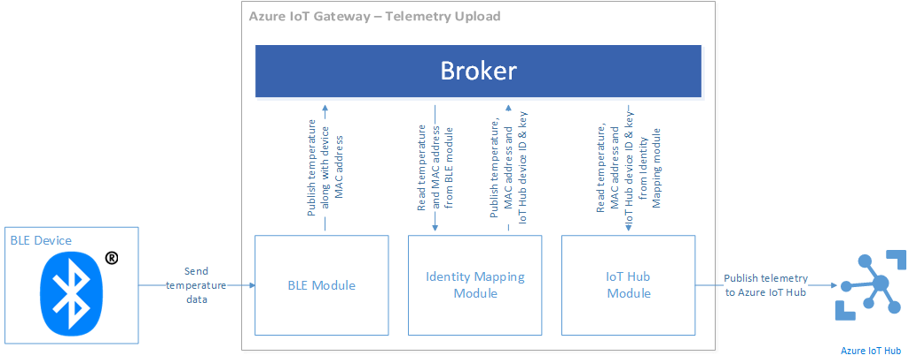

<properties
    pageTitle="Verwenden eines realen Geräts mit dem IoT Gateway SDK | Microsoft Azure"
    description="Azure IoT Gateway SDK Anleitung für die Verwendung von einem Texas Geräte SensorTag Gerät zum Senden von Daten an IoT Verteiler über ein Gateway für ein Intel Edison berechnen Modul ausgeführt"
    services="iot-hub"
    documentationCenter=""
    authors="chipalost"
    manager="timlt"
    editor=""/>

<tags
     ms.service="iot-hub"
     ms.devlang="cpp"
     ms.topic="article"
     ms.tgt_pltfrm="na"
     ms.workload="na"
     ms.date="08/29/2016"
     ms.author="andbuc"/>


# <a name="azure-iot-gateway-sdk-beta--send-device-to-cloud-messages-with-a-real-device-using-linux"></a>Azure IoT Gateway SDK (Beta) – Gerät Cloud-Nachrichten mit einem real Gerät mit Linux senden

Diese exemplarische Vorgehensweise der [Bluetooth-niedrig Aufwand Stichprobe] [ lnk-ble-samplecode] wird gezeigt, wie das [Azure IoT Gateway SDK] verwenden[ lnk-sdk] zum Weiterleiten Gerät Cloud werden an IoT Verteiler aus einem physischen Gerät und wie Befehle IoT Hub zu einem physischen Gerät weitergeleitet.

Diese exemplarische Vorgehensweise umfasst:

* **Architektur**: wichtige Architektur Informationen über die Bluetooth-niedrig Aufwand Stichprobe.

* **Erstellen und Ausführen**: die erforderlichen Schritte zum Erstellen und Ausführen der Stichprobe.

## <a name="architecture"></a>Architektur

Die exemplarische Vorgehensweise wird gezeigt, wie das Erstellen und Ausführen eines Gateways IoT auf ein Intel Edison berechnen-Modul, das Sie Linux ausgeführt wird. Das Gateway ist mit dem IoT Gateway SDK integriert. Im Beispiel wird ein Gerät Texas Geräte SensorTag Bluetooth niedrig Energy (BLE) zum Sammeln von Temperaturdaten verwendet.

Wenn Sie das Gateway ausführen es:

- Herstellen der Verbindung mit einem SensorTag Gerät über das Protokoll Bluetooth niedrig Energy (BLE).
- Verbindet mit IoT Hub über HTTP.
- Weitergeleitet werden vom Gerät SensorTag an IoT-Hub an.
- Leitet die Befehle IoT-Hub an das Gerät SensorTag weiter.

Das Gateway enthält die folgenden Module:

- Ein *Modul BLE* , die Schnittstellen mit einem Gerät BLE Temperaturdaten zwischen den Befehlen Gerät und senden auf das Gerät zu erhalten.
- Eine *BLE Cloud Gerät Modul* , der aus der Cloud bei BLE Anweisungen für das *Modul BLE*eingehenden JSON Nachrichten übersetzt.
- Ein *Modul Protokollierung* , die alle Gateway Nachrichten protokolliert.
- Ein *Modul Identität Zuordnung* , die zwischen BLE Gerät MAC-Adressen und Azure IoT Hub Gerät Identitäten übersetzt.
- Ein *IoT Hub Modul* , das hochgeladen werden Daten an einen Hub IoT und Gerät Befehle aus einem IoT-Hub empfangen.
- Ein *BLE Drucker Modul* , das interpretiert werden vom Gerät BLE und druckt formatiert Daten auf der Konsole Problembehandlung und das Debuggen aktivieren.

### <a name="how-data-flows-through-the-gateway"></a>Wie das Gateway durchläuft Daten

Das folgenden Blockdiagramm veranschaulicht die werden Upload Datenfluss Verkaufspipeline an:



Die Schritte, die ein Element des werden akzeptiert auf einem Gerät BLE an IoT Verteiler unterwegs sind:

1. Das Gerät BLE eine Stichprobe Temperatur generiert und sendet es über Bluetooth in das Modul BLE des Gateways.
2. Das Modul BLE empfängt die Stichprobe und veröffentlicht sie der Makler sowie die MAC-Adresse des Geräts.
3. Das Identität Zuordnung Modul nimmt diese Nachricht und verwendet eine interne Tabelle, um die MAC-Adresse des Geräts in eine IoT Hub Gerät Identität (Geräte-ID und Geräteschlüssel) zu übersetzen. Anschließend wird eine neue Nachricht, die die Temperatur Beispieldaten, die MAC-Adresse des Geräts, die Geräte-ID und das Geräteschlüssel enthält veröffentlicht.
4. Das Modul IoT Hub empfängt diese neue Nachricht (vom Modul Zuordnung Identität generiert) und veröffentlicht sie IoT Hub.
5. Das Modul Protokollierung protokolliert alle Nachrichten aus der Makler in eine Datei.

Das folgenden Blockdiagramm veranschaulicht die Gerät Befehl Datenfluss Verkaufspipeline an:


1. Das Modul IoT Hub fragt regelmäßig IoT Hub für neue Befehl Nachrichten.
2. Wenn das Modul IoT Hub eine neue Befehlsnachricht empfängt, veröffentlicht sie es in der Makler.
3. Das Identität Zuordnung Modul nimmt die Befehlsnachricht und verwendet eine interne Tabelle zum Übersetzen der IoT Hub Geräte-ID an ein Gerät MAC-Adresse. Anschließend wird eine neue Nachricht, die die MAC-Adresse des Zielgeräts in der Karte Eigenschaften der Nachricht enthält veröffentlicht.
4. Der Cloud BLE Gerät Modul nimmt diese Nachricht und in die richtige Anweisung BLE für das Modul BLE übersetzt. Anschließend wird eine neue Nachricht veröffentlicht.
5. Das Modul BLE nimmt diese Meldung und führt durch die Kommunikation mit dem Gerät BLE die e/a-Anweisung.
6. Das Modul Protokollierung protokolliert alle Nachrichten aus der Makler in eine Datei.

## <a name="prepare-your-hardware"></a>Vorbereiten der hardware

In diesem Lernprogramm wird davon ausgegangen, dass Sie ein [Texas Geräte SensorTag](http://www.ti.com/ww/en/wireless_connectivity/sensortag2015/index.html) Gerät sind an einer Karte Intel Edison verwenden.

### <a name="set-up-the-edison-board"></a>Richten Sie die Karte Edison

Bevor Sie beginnen, sollten Sie sicherstellen, dass Sie Ihr Gerät Edison zu Ihrem drahtlosen Netzwerk eine Verbindung herstellen können. Wenn Ihr Gerät Edison eingerichtet haben, müssen Sie für die Verbindung zu einem Host-Computer. Intel bietet überfordert Handbücher für die folgenden Betriebssysteme:

- [Erste Schritte mit der Intel Edison Entwicklung Karte unter Windows 64-Bit-][lnk-setup-win64].
- [Erste Schritte mit der Intel Edison Entwicklung Karte unter 32-Bit-Windows][lnk-setup-win32].
- [Erste Schritte mit der Intel Edison Entwicklung Karte unter Mac OS X][lnk-setup-osx].
- [Erste Schritte mit der Karte Intel® Edison unter Linux][lnk-setup-linux].

Zum Einrichten des Geräts Edison und Vertrautmachen mit, schließen Sie alle Artikel mit Ausnahme der letzte Schritt darin, "IDE auswählen" für die aktuelle Lernprogramm unnötige ist die Schritte in diesen "Erste Schritte". Am Ende des Setupprozesses Edison haben Sie folgende Aktionen ausführen:

- Aktualisiert Ihre Edison mit der neuesten Firmware.
- Stellt eine serielle Verbindung aus Ihr Host der Edison.
- Führen Sie ein Kennwort festgelegt, und aktivieren auf der Edison WiFi- **Configure_edison** Skript.

### <a name="enable-connectivity-to-the-sensortag-device-from-your-edison-board"></a>Aktivieren Sie Konnektivität mit dem Gerät SensorTag aus Ihrer Karte Edison

Vor dem Ausführen des Beispiels müssen Sie überprüfen, ob Ihre Edison Karte mit dem Gerät SensorTag herstellen kann.

Zuerst müssen Sie überprüfen, ob Ihre Edison mit dem Gerät SensorTag herstellen kann.

1. Aufheben der Blockierung Bluetooth auf die Edison, und überprüfen Sie, ob die Versionsnummer **5.37**.
    
    ```
    rfkill unblock bluetooth
    bluetoothctl --version
    ```

2. Führen Sie den Befehl **Bluetoothctl** ein. Sie können nun in einer interaktiven Bluetooth-Verwaltungsshell. 

3. Geben Sie den Befehl **schalten Sie** schalten Sie die Bluetooth-Controller ein. Ähnlich wie die Ausgabe sollte angezeigt werden:
    
    ```
    [NEW] Controller 98:4F:EE:04:1F:DF edison [default]
    ```

4. Immer noch in die interaktive Bluetooth-Verwaltungsshell, geben Sie den Befehl **Scannen auf** Scannen nach Bluetooth-Geräten aus. Ähnlich wie die Ausgabe sollte angezeigt werden:
    
    ```
    Discovery started
    [CHG] Controller 98:4F:EE:04:1F:DF Discovering: yes
    ```

5. Das Gerät SensorTag durch Drücken der kleinen Schaltfläche (grüne LED sollte flash) auffindbar zu machen. Die Edison sollte das Gerät SensorTag ermitteln:
    
    ```
    [NEW] Device A0:E6:F8:B5:F6:00 CC2650 SensorTag
    [CHG] Device A0:E6:F8:B5:F6:00 TxPower: 0
    [CHG] Device A0:E6:F8:B5:F6:00 RSSI: -43
    ```
    
    In diesem Beispiel können Sie sehen, dass die MAC-Adresse des Geräts SensorTag **A0:E6:F8:B5:F6:00**ist.

6. Deaktivieren Sie scannen, indem Sie Sie mit dem Befehl **Scannen deaktivieren** .
    
    ```
    [CHG] Controller 98:4F:EE:04:1F:DF Discovering: no
    Discovery stopped
    ```

7. Verbinden mit Ihrem SensorTag Gerät mithilfe der MAC-Adresse durch Eingeben von **Verbinden \<MAC-Adresse >**. Beachten Sie, dass die Ausgabe der Stichprobe unten Abkürzung ist:
    
    ```
    Attempting to connect to A0:E6:F8:B5:F6:00
    [CHG] Device A0:E6:F8:B5:F6:00 Connected: yes
    Connection successful
    [CHG] Device A0:E6:F8:B5:F6:00 UUIDs: 00001800-0000-1000-8000-00805f9b34fb
    ...
    [NEW] Primary Service
            /org/bluez/hci0/dev_A0_E6_F8_B5_F6_00/service000c
            Device Information
    ...
    [CHG] Device A0:E6:F8:B5:F6:00 GattServices: /org/bluez/hci0/dev_A0_E6_F8_B5_F6_00/service000c
    ...
    [CHG] Device A0:E6:F8:B5:F6:00 Name: SensorTag 2.0
    [CHG] Device A0:E6:F8:B5:F6:00 Alias: SensorTag 2.0
    [CHG] Device A0:E6:F8:B5:F6:00 Modalias: bluetooth:v000Dp0000d0110
    ```
    
    Hinweis: Sie können die GATT Merkmale des Geräts erneut mithilfe des Befehls **Liste-Attribute** angegeben werden.

8. Sie können jetzt mit dem Befehl **Trennen** Gerät trennen und beenden Sie dann aus der Bluetooth-Verwaltungsshell mithilfe des Befehls **Beenden** :
    
    ```
    Attempting to disconnect from A0:E6:F8:B5:F6:00
    Successful disconnected
    [CHG] Device A0:E6:F8:B5:F6:00 Connected: no
    ```

Sie nun können die Stichprobe BLE Gateway auf Ihrem Gerät Edison ausführen.

## <a name="run-the-ble-gateway-sample"></a>Führen Sie das Beispiel BLE Gateway

Um die Stichprobe BLE auf Ihre Edison ausführen zu können, müssen Sie drei Aufgaben ausführen:

- Konfigurieren Sie zwei Stichproben Geräte in Ihrer IoT Hub.
- Erstellen Sie das IoT Gateway SDK auf Ihrem Gerät Edison ein.
- Konfigurieren Sie, und führen Sie das BLE Beispiel auf Ihrem Gerät Edison.

Zum Zeitpunkt der schreiben unterstützt das IoT Gateway SDK nur Gateways, die BLE Module auf Linux verwenden.

### <a name="configure-two-sample-devices-in-your-iot-hub"></a>Konfigurieren Sie zwei Stichproben Geräte in Ihrer IoT-Hub

- [Erstellen einen IoT Hub] [ lnk-create-hub] in Ihrem Abonnement Azure benötigen Sie den Namen der Ihrer Hub diese exemplarische Vorgehensweise. Wenn Sie kein Konto haben, können Sie ein [kostenloses Konto] erstellen[ lnk-free-trial] in nur ein paar Minuten.
- Fügen Sie ein Gerät aufgerufen **SensorTag_01** an Ihre IoT Verteiler hinzu, und notieren Sie dessen Schlüssel-Id und das Gerät. Sie können das [Gerät Explorer oder Iothub-Explorer] [ lnk-explorer-tools] Tools, dieses Gerät an den Hub IoT hinzuzufügen, Sie im vorherigen Schritt erstellt haben, und deren Schlüssel abzurufen. Es werden am Gerät SensorTag dieses Gerät zugeordnet werden, wenn Sie das Gateway konfigurieren.

### <a name="build-the-iot-gateway-sdk-on-your-edison-device"></a>Erstellen der IoT Gateway SDK auf Ihrem Gerät Edison

Die Version von **Git** auf die Edsion unterstützt keine Submodules. Zum Herunterladen der vollständigen Quelle das Gateway SDK der Edison IoT stehen Ihnen zwei Optionen:

- Option #1: Klonen [Azure IoT Gateway SDK] [ lnk-sdk] Repository auf Ihre Edison und anschließend das Repository für jede Submodule manuell klonen.
- Option #2: Klonen [Azure IoT Gateway SDK] [ lnk-sdk] Repository auf desktop Geräten, wo **Git** Submodules unterstützt, und kopieren Sie das vollständige Repository mit Submodules auf Ihre Edison.

Wenn Sie die Option #2 auswählen, verwenden Sie die folgenden **Git** -Befehle IoT Gateway SDK und alle zugehörigen Submodules Klonen:

```
git clone --recursive https://github.com/Azure/azure-iot-gateway-sdk.git 
git submodule update --init --recursive
```

Dann sollten Sie das gesamte lokale Repository in einer einzigen Archivdatei zip-, bevor Sie es in der Edison kopieren. Sie können ein Programm wie z. B. **Pscp** enthaltenen **kitten** , um die Archivdatei in der Edison zu kopieren. Beispiel:

```
pscp .\gatewaysdk.zip root@192.168.0.45:/home/root
```

Wenn Sie eine vollständige Kopie des Repositorys IoT Gateway SDK auf Ihre Edison verfügen, können Sie es mit dem folgenden Befehl aus dem Ordner, der das SDK enthält erstellen:

```
./tools/build.sh
```

### <a name="configure-and-run-the-ble-sample-on-your-edison-device"></a>Konfigurieren und Ausführen der Stichprobe BLE auf Ihrem Gerät Edison

Um zu starten, und führen Sie das Beispiel, müssen Sie jedem Modul, die Teil des Gateways konfigurieren. Diese Konfiguration wird in einer Datei JSON bereitgestellt, und Sie müssen alle fünf teilnehmenden Module konfigurieren. Es gibt eine JSON-Beispieldatei im Repository bezeichnet **gateway_sample.json** , die Sie als Ausgangspunkt verwenden können, für die Erstellung Ihrer eigenen Konfigurationsdatei bereitgestellt. Diese Datei befindet sich im Ordner **Beispiele/Ble_gateway_hl/Src** in lokale Kopie des Repositorys IoT Gateway SDK.

In den folgenden Abschnitten wird beschrieben, wie diese Konfigurationsdatei für die Stichprobe BLE bearbeiten, und setzen voraus, dass das IoT Gateway SDK Repository ist die **/home/root/azure-iot-gateway-sdk /** Ordner auf Ihrem Gerät Edison. Wenn das Repository an anderer Stelle ist, sollten Sie die Pfade entsprechend anpassen:

#### <a name="logger-configuration"></a>Konfiguration der Protokollierung

Das Gateway Repository Voraussetzung befindet sich im Ordner **/home/root/azure-iot-gateway-sdk /**, konfigurieren Sie das Protokollierung Modul wie folgt:

```json
{
    "module name": "logger",
    "module path": "/home/root/azure-iot-gateway-sdk/build/modules/logger/liblogger_hl.so",
    "args":
    {
        "filename":"/home/root/gw_logger.log"
    }
}
```

#### <a name="ble-module-configuration"></a>BLE Modulkonfiguration

Beispiel-Konfiguration für das Gerät BLE wird davon ausgegangen ein Texas Geräte SensorTag Gerät aus. Alle BLE Standardgerät, die ausgeführt werden kann, wie eine externe GATT arbeiten sollen, aber Sie müssen die Eigenschaft GATT-IDs und Daten (Schreiben Anweisungen) zu aktualisieren. Fügen Sie die MAC-Adresse Ihres Geräts SensorTag hinzu: 

```json
{
  "module name": "SensorTag",
  "module path": "/home/root/azure-iot-gateway-sdk/build/modules/ble/libble_hl.so",
  "args": {
    "controller_index": 0,
    "device_mac_address": "<<AA:BB:CC:DD:EE:FF>>",
    "instructions": [
      {
        "type": "read_once",
        "characteristic_uuid": "00002A24-0000-1000-8000-00805F9B34FB"
      },
      {
        "type": "read_once",
        "characteristic_uuid": "00002A25-0000-1000-8000-00805F9B34FB"
      },
      {
        "type": "read_once",
        "characteristic_uuid": "00002A26-0000-1000-8000-00805F9B34FB"
      },
      {
        "type": "read_once",
        "characteristic_uuid": "00002A27-0000-1000-8000-00805F9B34FB"
      },
      {
        "type": "read_once",
        "characteristic_uuid": "00002A28-0000-1000-8000-00805F9B34FB"
      },
      {
        "type": "read_once",
        "characteristic_uuid": "00002A29-0000-1000-8000-00805F9B34FB"
      },
      {
        "type": "write_at_init",
        "characteristic_uuid": "F000AA02-0451-4000-B000-000000000000",
        "data": "AQ=="
      },
      {
        "type": "read_periodic",
        "characteristic_uuid": "F000AA01-0451-4000-B000-000000000000",
        "interval_in_ms": 1000
      },
      {
        "type": "write_at_exit",
        "characteristic_uuid": "F000AA02-0451-4000-B000-000000000000",
        "data": "AA=="
      }
    ]
  }
}
```

#### <a name="iot-hub-module"></a>IoT Hub-Modul

Fügen Sie den Namen Ihrer IoT Hub hinzu. Der Suffixwert ist in der Regel **Azure-devices.net**aus:

```json
{
  "module name": "IoTHub",
  "module path": "/home/root/azure-iot-gateway-sdk/build/modules/iothub/libiothub_hl.so",
  "args": {
    "IoTHubName": "<<Azure IoT Hub Name>>",
    "IoTHubSuffix": "<<Azure IoT Hub Suffix>>",
    "Transport": "HTTP"
  }
}
```

#### <a name="identity-mapping-module-configuration"></a>Identität Zuordnung Modulkonfiguration

Fügen Sie die MAC-Adresse von Ihrem Gerät SensorTag und das Gerät-Id und Schlüssel des Geräts **SensorTag_01** , die Sie an Ihre IoT Verteiler hinzugefügt:

```json
{
  "module name": "mapping",
  "module path": "/home/root/azure-iot-gateway-sdk/build/modules/identitymap/libidentity_map_hl.so",
  "args": [
    {
      "macAddress": "<<AA:BB:CC:DD:EE:FF>>",
      "deviceId": "<<Azure IoT Hub Device ID>>",
      "deviceKey": "<<Azure IoT Hub Device Key>>"
    }
  ]
}
```

#### <a name="ble-printer-module-configuration"></a>BLE Drucker Modulkonfiguration

```json
{
    "module name": "BLE Printer",
    "module path": "/home/root/azure-iot-gateway-sdk/build/samples/ble_gateway_hl/ble_printer/libble_printer.so",
    "args": null
}
```

#### <a name="routing-configuration"></a>Routing-Konfiguration

Die folgende Konfiguration wird Folgendes sichergestellt:
- Das Modul für die **Protokollierung** empfängt, und melden Sie sich alle Nachrichten.
- Das Modul **SensorTag** sendet Nachrichten an die **Zuordnung** und den **Drucker BLE** Module.
- Das Modul für die **Zuordnung** sendet Nachrichten an das Modul **IoTHub** an Ihre IoT Verteiler Remotedomänen.
- Das Modul **IoTHub** sendet Nachrichten an das Modul für die **Zuordnung** zurück.
- Das Modul für die **Zuordnung** sendet Nachrichten an das Modul **SensorTag** zurück.

```json
"links" : [
    {"source" : "*", "sink" : "Logger" },
    {"source" : "SensorTag", "sink" : "mapping" },
    {"source" : "SensorTag", "sink" : "BLE Printer" },
    {"source" : "mapping", "sink" : "IoTHub" },
    {"source" : "IoTHub", "sink" : "mapping" },
    {"source" : "mapping", "sink" : "SensorTag" }
  ]
```

Führen Sie zum Ausführen des Beispiels binäre übergibt den Pfad zu der JSON-Konfigurationsdatei **Ble_gateway_hl** aus. Wenn Sie die Datei **gateway_sample.json** verwendet haben, sieht der auszuführende Befehl wie folgt aus:

```
./build/samples/ble_gateway_hl/ble_gateway_hl ./samples/ble_gateway_hl/src/gateway_sample.json
```

Möglicherweise müssen Sie das kleine Taste auf dem Gerät SensorTag, um es auffindbar zu machen, bevor Sie das Beispiel ausführen.

Wenn Sie das Beispiel ausführen, können Sie [Gerät Explorer oder Iothub-Explorer] [ lnk-explorer-tools] Tool zum Nachrichten Überwachen des Gateways vom Gerät SensorTag weiterleitet.

## <a name="send-cloud-to-device-messages"></a>Senden von Nachrichten Cloud-zu-Gerät

Das Modul BLE unterstützt auch sendende Anweisungen vom Azure IoT Hub für das Gerät aus. Sie können den [Azure IoT Hub Gerät Explorer](https://github.com/Azure/azure-iot-sdks/blob/master/tools/DeviceExplorer/doc/how_to_use_device_explorer.md) oder der [IoT Hub Explorer](https://github.com/Azure/azure-iot-sdks/tree/master/tools/iothub-explorer) JSON-Nachrichten zu senden, die das Gateway-Modul BLE am Gerät BLE übergibt, klicken Sie auf verwenden. Beispielsweise wenn Sie das Gerät Texas Geräte SensorTag verwenden können dann Sie die folgenden JSON-Nachrichten mit dem Gerät IoT Hub senden.

- Setzen Sie alle LED-Anzeigen und die Plätze, Fertig (deaktivieren)

    ```json
    {
      "type": "write_once",
      "characteristic_uuid": "F000AA65-0451-4000-B000-000000000000",
      "data": "AA=="
    }
    ```

- Konfigurieren von e/a als "Remote"

    ```json
    {
      "type": "write_once",
      "characteristic_uuid": "F000AA66-0451-4000-B000-000000000000",
      "data": "AQ=="
    }
    ```

- Die rote LED aktivieren

    ```json
    {
      "type": "write_once",
      "characteristic_uuid": "F000AA65-0451-4000-B000-000000000000",
      "data": "AQ=="
    }
    ```

- Klicken Sie auf die grüne LED aktivieren

    ```json
    {
      "type": "write_once",
      "characteristic_uuid": "F000AA65-0451-4000-B000-000000000000",
      "data": "Ag=="
    }
    ```

- Klicken Sie auf die Plätze, fertig aktivieren

    ```json
    {
      "type": "write_once",
      "characteristic_uuid": "F000AA65-0451-4000-B000-000000000000",
      "data": "BA=="
    }
    ```

Das Standardverhalten für ein Gerät über HTTP Verbindung zum IoT Hub ist alle 25 Minuten für einen neuen Befehl zu überprüfen. Wenn Sie mehrere separate Befehle senden müssen Sie daher warten 25 Minuten für das Gerät zu jedem Befehl zu erhalten.

> [AZURE.NOTE] Das Gateway überprüft auch für neue Befehle bei jedem Start, damit Sie darauf, um einen Befehl zu verarbeiten, indem Sie das Gateway zu starten und Beenden erzwingen können.

## <a name="next-steps"></a>Nächste Schritte

Wenn Sie eine erweiterte Verständnis des Gateways IoT SDK und mit einigen Codebeispielen experimentieren möchten, besuchen Sie die folgenden Entwicklertools Lernprogramme und Ressourcen:

- [Azure IoT Gateway SDK][lnk-sdk]

Die Funktionen von IoT Hub weiteren kann, finden Sie unter:

- [Leitfaden für Entwickler][lnk-devguide]

<!-- Links -->
[lnk-ble-samplecode]: https://github.com/Azure/azure-iot-gateway-sdk/blob/master/samples/ble_gateway_hl
[lnk-free-trial]: https://azure.microsoft.com/pricing/free-trial/
[lnk-explorer-tools]: https://github.com/Azure/azure-iot-sdks/blob/master/doc/manage_iot_hub.md
[lnk-setup-win64]: https://software.intel.com/get-started-edison-windows
[lnk-setup-win32]: https://software.intel.com/get-started-edison-windows-32
[lnk-setup-osx]: https://software.intel.com/get-started-edison-osx
[lnk-setup-linux]: https://software.intel.com/get-started-edison-linux
[lnk-sdk]: https://github.com/Azure/azure-iot-gateway-sdk/


[lnk-devguide]: iot-hub-devguide.md
[lnk-create-hub]: iot-hub-create-through-portal.md 
