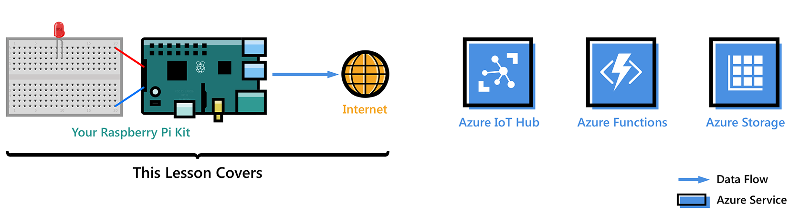
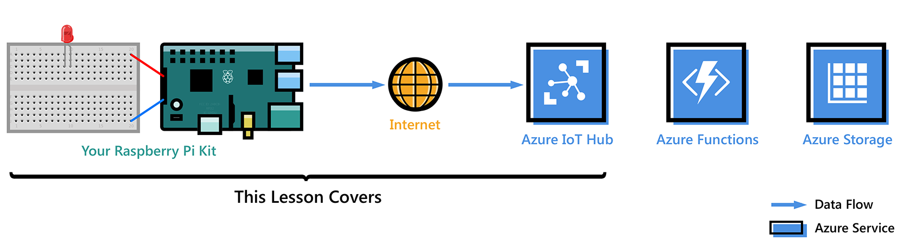

<properties
 pageTitle="Erste Schritte mit Brombeere Pi 3 | Microsoft Azure"
 description="Erste Schritte mit Brombeere Pi 3, erstellen Sie Ihre Azure IoT Hub und Herstellen einer Verbindung IoT-Hub mit Ihrer Pi"
 services="iot-hub"
 documentationCenter=""
 authors="shizn"
 manager="timlt"
 tags=""
 keywords=""/>

<tags
 ms.service="iot-hub"
 ms.devlang="multiple"
 ms.topic="article"
 ms.tgt_pltfrm="na"
 ms.workload="na"
 ms.date="10/21/2016"
 ms.author="xshi"/>

# Erste Schritte mit Brombeere Pi 3

In diesem Lernprogramm beginnen Sie lernen Sie die Grundlagen zum Arbeiten mit Himbeeren Pi 3 die laufenden Raspbian. Klicken Sie dann erläutert, wie Ihre Geräte nahtlos in der Cloud mit [Azure IoT Hub](iot-hub-what-is-iot-hub.md)verbinden. Beispiele für Windows 10 IoT Core finden Sie auf [windowsondevices.com](http://www.windowsondevices.com/).

## Lektion 1: Konfigurieren von Ihrem Gerät

In dieser Lektion Konfigurieren von Ihrem Gerät Himbeeren Pi 3 mit einem Betriebssystem, richten Sie Ihre Entwicklungsumgebung und Bereitstellen einer Anwendung auf dem Pi.

### Konfigurieren von Ihrem Gerät

Konfigurieren Sie der Brombeere Pi 3 für die erstmalige Verwendung, und installieren Sie das Betriebssystem Raspbian, einem kostenlosen Betriebssystem, das für die Brombeere Pi Hardware optimiert ist.

*Geschätzte Zeit in Anspruch: 30 Minuten* 

[Navigieren Sie zu 'Ihr Gerät konfigurieren'](iot-hub-raspberry-pi-kit-node-lesson1-configure-your-device.md)

### Besorgen Sie sich die tools
Laden Sie die Tools und Software für das Erstellen und Bereitstellen Ihrer erste Anwendung zu Brombeere Pi 3.

*Geschätzte Zeit in Anspruch: 20 Minuten* 

[Wechseln Sie zu "Get die Tools"](iot-hub-raspberry-pi-kit-node-lesson1-get-the-tools-win32.md)

### Erstellen und Bereitstellen der Anwendungs blinken

Klonen der Stichprobe Node.js Anwendungs von Github und zum Bereitstellen dieser Anwendungs an Ihre Karte Himbeeren Pi 3 gulp. Diese Anwendung blinkt die LED sind alle zwei Sekunden an die Karte angeschlossen.

*Geschätzte Zeit in Anspruch: 5 Minuten* 

[Wechseln Sie zu "erstellen und Bereitstellen die Anwendung blinken '](iot-hub-raspberry-pi-kit-node-lesson1-deploy-blink-app.md)

## Lektion 2: Erstellen Sie den IoT-hub

In dieser Lektion erstellen ein kostenlose Azure-Konto, Bereitstellung Ihrer Azure IoT Hub und Erstellen Ihrer erste Gerät Azure IoT Hub werden.

Führen Sie Lektion 1, bevor Sie diese Lektion starten.

### Abrufen der Azure-tools

Installieren von Azure Line Interface (Azure CLI).

*Geschätzte Zeit in Anspruch: 10 Minuten* 

[Wechseln Sie zu 'Erste Azure-Tools'](iot-hub-raspberry-pi-kit-node-lesson2-get-azure-tools-win32.md)

### Erstellen Sie Ihre IoT Hub und registrieren Sie Ihrer Himbeeren Pi 3

Erstellen der Ressourcengruppe, Bereitstellung Ihrer ersten Azure IoT Hub, und fügen Sie das erste Gerät an den Azure IoT Hub Azure CLI verwenden. 

*Geschätzte Zeit in Anspruch: 10 Minuten* 

[Wechseln Sie zu "Erstellen Ihrer IoT Hub und Registrieren der Brombeere Pi 3"](iot-hub-raspberry-pi-kit-node-lesson2-prepare-azure-iot-hub.md)

## Lektion 3: Senden Sie Gerät-Cloud-Nachrichten

In dieser Lektion senden Sie Nachrichten von Ihrem Pi an Ihre IoT Verteiler ein. Außerdem erstellen Sie eine Funktion Azure-app, die nimmt eingehende Nachrichten von Ihrem IoT Hub und schreibt sie in Azure Table Storage.

Führen Sie Lektionen 1 und 2, bevor Sie diese Lektion starten.

### Erstellen einer app Azure-Funktion und Azure-Speicher-Konto

Verwenden einer Ressourcenmanager Azure-Vorlage zum Erstellen einer app Azure-Funktion und ein Speicher Azure-Konto an.

*Geschätzte Zeit in Anspruch: 10 Minuten* 

[Wechseln Sie zu 'einer app Azure-Funktion und Azure-Speicher Konto erstellen'](iot-hub-raspberry-pi-kit-node-lesson3-deploy-resource-manager-template.md)

### Führen Sie Beispiel-Anwendung zum Senden von Nachrichten in der Cloud Gerät aus

Bereitstellen und Ausführen einer Stichprobe-Anwendung mit Ihrem Brombeere Pi 3-Gerät, das Nachrichten an IoT Hub sendet.

*Geschätzte Zeit in Anspruch: 10 Minuten* 

[Wechseln Sie zu "Beispiel-Anwendung zum Senden von Nachrichten in der Cloud-Gerät ausführen"](iot-hub-raspberry-pi-kit-node-lesson3-run-azure-blink.md)

### Lesen von Nachrichten beibehalten im Speicher Azure
Überwachen der Gerät-Cloud-Nachrichten an, wie sie in Ihrer Azure-Speicher geschrieben werden.

*Geschätzte Zeit in Anspruch: 5 Minuten* 

[Wechseln Sie zu 'beibehalten gelesene Nachrichten in Azure-Speicher'](iot-hub-raspberry-pi-kit-node-lesson3-read-table-storage.md)

## Lektion 4: Senden von Nachrichten Cloud-zu-Gerät

In dieser Lektion Demo-Informationen zum Senden von Nachrichten über Ihre Azure IoT-Hub an Ihre Himbeeren Pi 3. Die Nachrichten steuern und, auf Deaktivieren Verhalten der LED, die mit Ihrem Pi verbunden ist. Eine Beispiel-Anwendung ist vorbereitet für Sie, um diese Aufgabe zu erzielen.

Führen Sie die Lektionen 1, 2 und 3, bevor Sie diese Lektion starten.

### Führen Sie die Anwendung Stichprobe Cloud-zu-Gerät Nachrichten empfangen werden sollen.

Die Anwendung Stichprobe in Lektion 4 auf Ihre Pi ausgeführt wird und überwacht eingehende Nachrichten von Ihrem IoT Hub. Eine neue schlucken Aufgabe sendet Nachrichten an Ihre Pi, aus der IoT Hub die LED blinkt.

*Geschätzte Zeit in Anspruch: 10 Minuten* 

[Wechseln Sie zu "die Stichprobe Anwendung zum Empfangen von Nachrichten Cloud-zu-Gerät ausführen"](iot-hub-raspberry-pi-kit-node-lesson4-send-cloud-to-device-messages.md)

### Optionaler Abschnitt: Ändern der ein- und auszuschalten Verhalten der LED

Passen Sie die Nachrichten so ändern Sie der ein- und auszuschalten Verhalten der LEDS an.

*Geschätzte Zeit in Anspruch: 10 Minuten* 

[Wechseln Sie zu "Optionaler Abschnitt: Ändern der ein- und auszuschalten Verhalten der LED'](iot-hub-raspberry-pi-kit-node-lesson4-change-led-behavior.md)

## Behandlung von Problemen

Wenn Sie alle Probleme auftreten während der Lektionen entsprechen, können Sie auf dieser Seite Lösungen anfordern.

[Wechseln Sie zu "Problembehandlung"](iot-hub-raspberry-pi-kit-node-troubleshooting.md)
