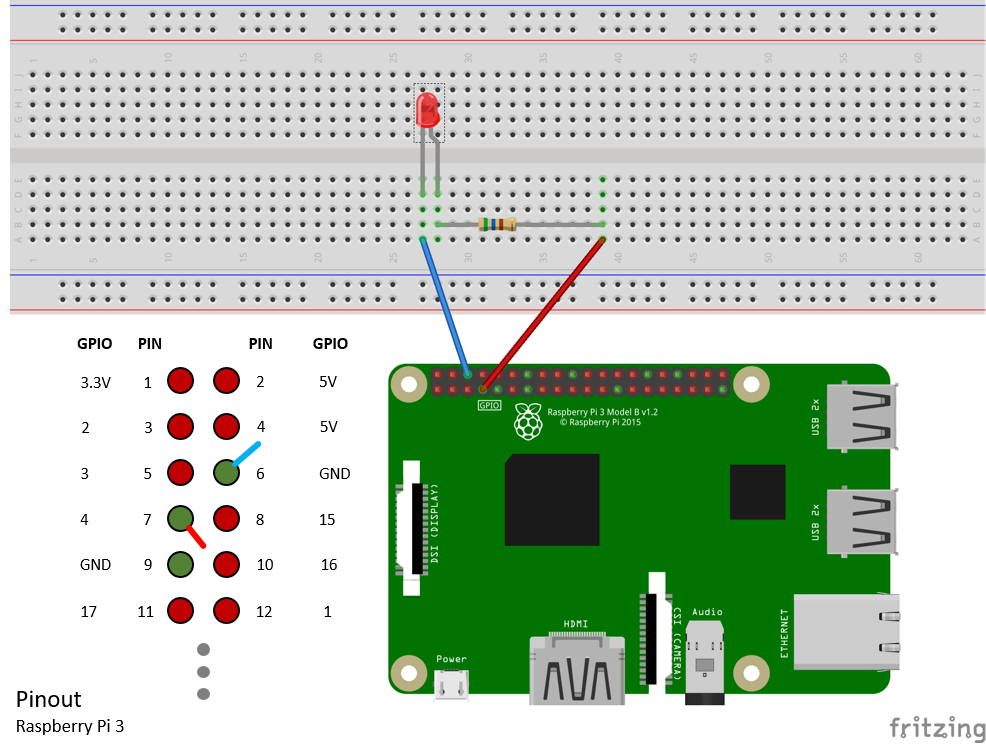

<properties
 pageTitle="Konfigurieren von Ihrem Gerät | Microsoft Azure"
 description="Konfigurieren Sie der Brombeere Pi 3 für die erstmalige Verwendung, und installieren Sie das Betriebssystem Raspbian, einem kostenlosen Betriebssystem, das für die Brombeere Pi Hardware optimiert ist."
 services="iot-hub"
 documentationCenter=""
 authors="shizn"
 manager="timlt"
 tags=""
 keywords=""/>

<tags
 ms.service="iot-hub"
 ms.devlang="multiple"
 ms.topic="article"
 ms.tgt_pltfrm="na"
 ms.workload="na"
 ms.date="10/21/2016"
 ms.author="xshi"/>

# 1.1 Konfigurieren Sie das Gerät

## 1.1.1 mögliche Aktionen werden

Konfigurieren Sie der Pi für die erstmalige Verwendung, und installieren Sie das Betriebssystem Raspbian, einem kostenlosen Betriebssystem, das für die Brombeere Pi Hardware optimiert ist. Wenn Sie Probleme mit dem entsprechen, Zielwertsuche Lösungen in die [Seite zu behandeln](iot-hub-raspberry-pi-kit-node-troubleshooting.md).

## 1.1.2 Gelernte wird

In diesem Abschnitt lernen Sie:

- So installieren Sie Raspbian auf Ihre Pi
- So schalten Sie Ihre Pi mit einem USB-Kabel
- Wie Ihre Pi zum mithilfe eines Ethernet-Kabel oder Wi-Fi-Netzwerk herzustellen.
- Wie die Breadboard eine LED hinzu, und verbinden Sie es mit Ihrem Pi

## 1.1.3, benötigen Sie

Zum in diesem Abschnitt abschließen zu können, benötigen Sie die folgenden Komponenten aus Ihrer Brombeere Pi 3 Starter Kit:

- Die Karte Himbeeren Pi 3
- 16GB MicroSD Karte
- Geben Sie die 5 v 2A Power sechs Feet micro USB-Kabel
- Die breadboard
- Connector-Kabel
- Widerstands 560 Ohm
- Ein Diffuses 10mm LED
- Das Ethernet-Kabel

Sie benötigen außerdem:

- Eine kabelgebundene oder drahtlosen Verbindung für Ihre Pi zum Herstellen einer Verbindung mit
- Ein USB-SD Netzwerkadapter oder Minisymbolleiste-SD Visitenkarte anzeigen, um das Bild OS in die Karte MicroSD brennen.
- Ein Computer unter Windows, Mac oder Linux. Der Computer verwendet, auf der Karte MicroSD Raspbian zu installieren.
- Eine Verbindung zu den erforderlichen Tools und Software herunterladen

## 1.1.4 installieren Sie Raspbian auf der Karte MicroSD

Vorbereiten der MicroSD Karte auf das Bild Raspbian zu schreiben.

1. Herunterladen von Raspbian.
  1. [Herunterladen](https://www.raspberrypi.org/downloads/raspbian/) der Zip-Datei für Raspbian Jessie mit Pixel an.
  2. Das Bild Raspbian in einem Ordner auf Ihrem Computer zu extrahieren.
2. Installieren Sie die Karte MicroSD Raspbian.
  1. [Herunterladen](https://www.etcher.io) und Installieren der Etcher er Karte Brenner-Programm.
  2. Führen Sie Etcher aus, und wählen Sie das Raspbian-Bild, das Sie extrahiert in Schritt 1 aus.
  3. Wählen Sie das MicroSD Karte-Laufwerk ein.
    Hinweis: Etcher möglicherweise bereits das richtige Laufwerk ausgewählt haben.
  4. Klicken Sie auf Flash, um die Karte MicroSD Raspbian installiert werden.
  5. Entfernen Sie die Karte MicroSD von Ihrem Computer, wenn der Vorgang abgeschlossen.
    Hinweis: Es ist sicher die Karte MicroSD direkt zu entfernen, da Etcher automatisch wirft oder hebt die Bereitstellung der Karte MicroSD nach dem Abschluss.
  6. Fügen Sie die Karte MicroSD in Ihrer Pi zurück.

## 1.1.5 schalten Sie Ihre Pi

Schalten Sie Ihre Pi mithilfe der micro USB-Kabel, und geben Sie die Power.

> [AZURE.NOTE] Es ist wichtig, die Power Lieferung im Kit zu verwenden, die mindestens ist 2A, um sicherzustellen, dass Ihre Brombeere, über ausreichend Leistung eingezogen wird, damit Sie ordnungsgemäß funktioniert.

## 1.1.6 Ihrer Brombeere Pi 3 Herstellen einer Verbindung mit dem Netzwerk

Sie können Ihre Pi eine kabelgebundene Netzwerk oder mit einem drahtlosen Netzwerk herstellen. Stellen Sie sicher, dass Ihre Pi mit demselben Netzwerk wie Ihr Computer verbunden ist. Beispielsweise können Sie Ihre Pi mit demselben Switch verbinden, denen mit Ihrem Computer verbunden ist.

### 1.1.6.1 verbinden Sie mit einem kabelgebundene Netzwerk

Verwenden Sie das Ethernet-Kabel mit Ihrem Netzwerk kabelgebundene Verbindung Ihrer Pi. Die zwei LED auf Ihre Pi aktivieren, wenn die Verbindung hergestellt wird.

### 1.1.6.2 verbinden Sie mit einem drahtlosen Netzwerk

Folgen Sie den [Anweisungen](https://www.raspberrypi.org/learning/software-guide/wifi/) in die Brombeere Pi Grundlage für eine Verbindung mit Ihrem drahtlosen Netzwerk Ihrer Pi. Diese Anweisungen müssen Sie zuerst die Verbindung einen Monitor und eine Tastatur an Ihre Pi herstellen.

## 1.1.7 die LED Herstellen einer Verbindung mit Ihrem Pi

Um diese Aufgabe ausführen zu können, verwenden Sie die [Breadboard](https://learn.sparkfun.com/tutorials/how-to-use-a-breadboard), die Kabel Verbinder, die LED und der Widerstand aus. Sie verbinden sie die Ports [Allgemeine Ausgang](https://www.raspberrypi.org/documentation/usage/gpio/) (GPIO) von Ihrem Pi zurück. 

1. Herstellen einer Verbindung **GPIO GND (Pin-6)**mit des Abschnitts Verkürzen der LED.
2. Herstellen einer Verbindung eine Abschnitts eines der Widerstand mit mehr Ausrichtung des Abschnitts der LED.
3. Verbinden des anderen Abschnitts eines der Widerstand mit **GPIO 4 (Pin 7)**.

Beachten Sie, dass die LED Polarität wichtig ist. Diese Einstellung Polarität wird auch als aktiv niedrig bezeichnet.

Glückwunsch! Sie haben Ihre Pi erfolgreich konfiguriert.

## 1.1.8 Zusammenfassung

In diesem Abschnitt haben Sie Ihre Pi zu konfigurieren, indem Sie Raspbian installieren, Ihre Pi mit einem Netzwerk verbinden und eine LED für das Herstellen von Verbindungen mit Ihrer Pi gelernt. Beachten Sie, dass die noch nicht nach oben LED. Im nächsten Abschnitt Installieren Sie die erforderlichen Tools und Software Vorbereitung Ausführen einer Stichprobe Anwendung auf Ihre Pi zurück.

## Nächste Schritte

[1.2 erhalten Sie die tools](iot-hub-raspberry-pi-kit-node-lesson1-get-the-tools-win32.md)
