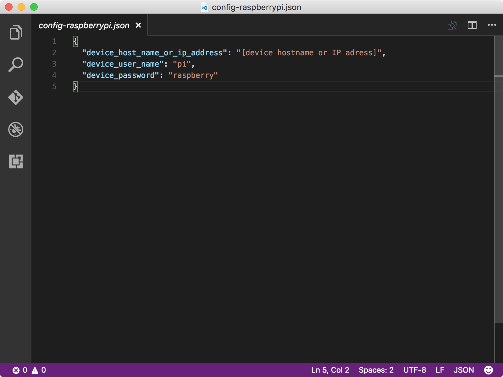

<properties
 pageTitle="Erstellen und Bereitstellen die Anwendung blinken | Microsoft Azure"
 description="Klonen der Stichprobe Node.js Anwendungs von Github und zum Bereitstellen dieser Anwendungs an Ihre Karte Himbeeren Pi 3 gulp. Diese Anwendung blinkt die LED sind alle zwei Sekunden an die Karte angeschlossen."
 services="iot-hub"
 documentationCenter=""
 authors="shizn"
 manager="timlt"
 tags=""
 keywords=""/>

<tags
 ms.service="iot-hub"
 ms.devlang="multiple"
 ms.topic="article"
 ms.tgt_pltfrm="na"
 ms.workload="na"
 ms.date="10/21/2016"
 ms.author="xshi"/>

# <a name="13-create-and-deploy-the-blink-application"></a>1.3 erstellen und Bereitstellen der Anwendungs blinken

## <a name="131-what-you-will-do"></a>1.3.1 mögliche Aktionen werden

Klonen Sie die Stichprobe Node.js Anwendung von Github, und verwenden Sie das Tool schlucken zur Bereitstellung der Stichprobe-Anwendungs auf Ihre Brombeere Pi 3. Die Anwendung Stichprobe blinkt die LED sind alle zwei Sekunden an die Karte angeschlossen. Wenn Sie Probleme mit dem entsprechen, Zielwertsuche Lösungen in die [Seite zu behandeln](iot-hub-raspberry-pi-kit-node-troubleshooting.md).

## <a name="132-what-you-will-learn"></a>1.3.2 Gelernte wird

- So verwenden Sie die `device-discover-cli` Tool Netzwerke Informationen über Ihre Pi abrufen.
- Informationen zum Bereitstellen und führen Sie die Stichprobe Anwendung auf Ihre Pi.
- Informationen zum Bereitstellen und Debuggen von Applications Remote auf Ihre Pi ausführen.

## <a name="133-what-you-need"></a>1.3.3, benötigen Sie

Sie müssen die Abschnitten folgen in Lektion 1 erfolgreich haben:

- [Konfigurieren von Ihrem Gerät](iot-hub-raspberry-pi-kit-node-lesson1-configure-your-device.md)
- [Besorgen Sie sich die tools](iot-hub-raspberry-pi-kit-node-lesson1-get-the-tools-win32.md)

## <a name="134-obtain-the-ip-address-and-host-name-of-your-pi"></a>1.3.4 erhalten Sie die IP-Adresse und Host Name der Pi

Öffnen Sie ein Eingabeaufforderungsfenster in Windows oder ein terminal-Fenster in Mac OS oder Ubuntu, und führen Sie dann den folgenden Befehl aus:

```bash
devdisco list --eth
```

Sie sollten eine Ausgabe sehen, die ähnlich wie der folgende ist:


Notieren Sie die `IP address` und `hostname` von Ihrem Pi zurück. Sie benötigen diese Informationen später in diesem Abschnitt.

> [AZURE.NOTE] Stellen Sie sicher, dass Ihre Pi mit demselben Netzwerk wie Ihr Computer verbunden ist. Angenommen, wenn Ihr Computer mit einem drahtlosen Netzwerk verbunden ist, während Ihre Pi mit einem kabelgebundene Netzwerk verbunden ist, wird möglicherweise nicht die IP-Adresse in der Ausgabe Devdisco angezeigt.

## <a name="135-clone-the-sample-application"></a>1.3.5 Klonen der Stichprobe-Anwendungs

Klicken Sie zum Öffnen des Stichprobe Codes gehen Sie folgendermaßen vor:

1. Klonen des Stichprobe Repositorys von Github durch den folgenden Befehl ausführen:

    ```bash
    git clone https://github.com/Azure-Samples/iot-hub-node-raspberrypi-getting-started.git
    ```

2. Öffnen Sie die Anwendung Beispiel in Visual Studio-Code, durch Ausführen der folgenden Befehle:

    ```bash
    cd iot-hub-node-raspberrypi-getting-started
    cd Lesson1
    code .
    ```


Die `app.js` Datei wird die `app` Unterordner ist die wichtigsten Quelldatei, die den Code der LED-Steuerelement enthält.

### <a name="136-install-application-dependencies"></a>1.3.6 installieren Sie Anwendung Abhängigkeiten

Installieren Sie die Bibliotheken und andere Module, die Sie für die Stichprobe Anwendung, indem Sie den folgenden Befehl ausführen müssen:

```bash
npm install
```

## <a name="137-configure-the-device-connection"></a>1.3.7 Konfigurieren der Verbindung mit dem Gerät

Gehen Sie folgendermaßen vor, um eine Verbindung mit dem Gerät zu konfigurieren:

1. Generieren der Gerätekonfigurationsdatei durch den folgenden Befehl ausführen:

    ```bash
    gulp init
    ```

    Konfigurationsdatei `config-raspberrypi.json` enthält die Anmeldeinformationen des Benutzers zur Anmeldung in Ihrer Pi zurück. Um den Verlust von Benutzeranmeldeinformationen zu vermeiden, wird die Konfigurationsdatei im Unterordner generiert `.iot-hub-getting-started` des Ordners "Privat" auf Ihrem Computer.

2. Öffnen Sie die Gerätekonfigurationsdatei in Visual Studio-Code, indem Sie den folgenden Befehl ausführen:

    ```bash
    # For Windows command prompt
    code %USERPROFILE%\.iot-hub-getting-started\config-raspberrypi.json

    # For macOS or Ubuntu
    code ~/.iot-hub-getting-started/config-raspberrypi.json
    ```

3. Ersetzen Sie den Platzhalter `[device hostname or IP address]` für die IP-Adresse oder den Hostnamen ein, das Sie im Abschnitt 1.3.4 abrufen.

    

Herzlichen Glückwunsch! Sie haben die erste Stichprobe Anwendung für Ihre Pi erfolgreich erstellt.

## <a name="138-deploy-and-run-the-sample-application"></a>1.3.8 bereitstellen Sie, und führen Sie die Anwendung Stichprobe

### <a name="1381-install-nodejs-and-npm-on-your-pi"></a>1.3.8.1 installieren Sie Node.js und NPM auf Ihre Pi

Installieren von Node.js und NPM auf Ihre Pi durch den folgenden Befehl ausführen:

```bash
gulp install-tools
```

Es kann zum erste Mal ausführen, wenn Sie diese Aufgabe ausführen zehn Minuten dauern.

### <a name="1382-deploy-and-run-the-sample-app"></a>1.3.8.2 Bereitstellen Sie, und führen Sie die Beispielapp

Bereitstellen Sie, und führen Sie diese Anwendung Stichprobe auf, indem Sie den folgenden Befehl ausführen:

```bash
gulp deploy && gulp run
```

### <a name="1383-verify-the-app-works"></a>1.3.8.3 Überprüfen Sie die app funktioniert

Die LED sollte jetzt auf Ihre Pi blinken alle zwei Sekunden angezeigt werden.  Wenn Sie die blinkt angezeigt werden, finden Sie unter der [Leitfadens zur Problembehandlung](iot-hub-raspberry-pi-kit-node-troubleshooting.md) für Lösungen für häufige Probleme.


> [AZURE.NOTE] Verwenden Sie `Ctrl + C` um die Anwendung zu beenden.

## <a name="139-summary"></a>1.3.9 Zusammenfassung

Sie haben die erforderlichen Tools für die Arbeit mit Ihrer Pi installiert und eine Beispiel-Anwendung zu Ihrem Pi die LED blinkt bereitgestellt. Sie können nun auf verschieben, mit der nächsten Lektion erstellen, bereitstellen und Ausführen einer anderen Anwendung der Stichprobe, die eine Verbindung Ihrer Pi an Azure IoT Hub herstellt zu senden und Empfangen von Nachrichten.

## <a name="next-steps"></a>Nächste Schritte

Sie können jetzt beginnen Lektion 2, die beginnt mit [erhalten die Azure-tools](iot-hub-raspberry-pi-kit-node-lesson2-get-azure-tools-win32.md)
