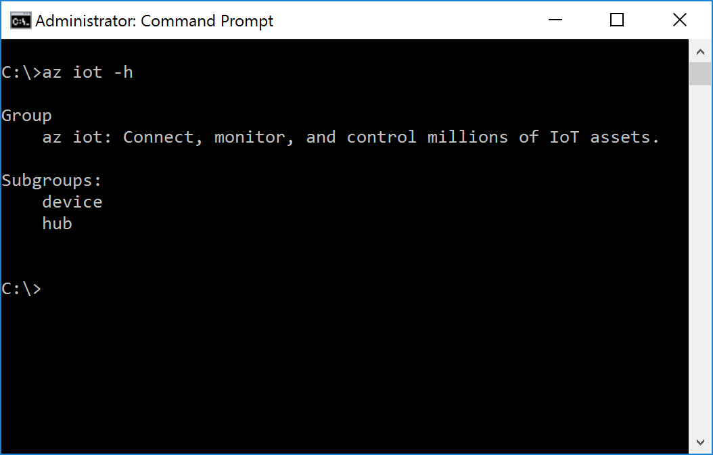

<properties
 pageTitle="Abrufen von Azure-Tools (Windows 7 +) | Microsoft Azure"
 description="Installieren Sie Python und Azure Line Interface (CLI Azure) unter Windows 7 und höhere Versionen."
 services="iot-hub"
 documentationCenter=""
 authors="shizn"
 manager="timlt"
 tags=""
 keywords=""/>

<tags
 ms.service="iot-hub"
 ms.devlang="multiple"
 ms.topic="article"
 ms.tgt_pltfrm="na"
 ms.workload="na"
 ms.date="10/21/2016"
 ms.author="xshi"/>

# <a name="21-get-azure-tools-windows-7-"></a>2.1 erste Azure-Tools (Windows 7 +)

> [AZURE.SELECTOR]
- [Windows 7 +](iot-hub-raspberry-pi-kit-node-lesson2-get-azure-tools-win32.md)
- [Ubuntu 16.04](iot-hub-raspberry-pi-kit-node-lesson2-get-azure-tools-ubuntu.md)
- [Mac OS 10.10.](iot-hub-raspberry-pi-kit-node-lesson2-get-azure-tools-mac.md)

## <a name="211-what-you-will-do"></a>2.1.1 mögliche Aktionen werden

Installieren Python und die Befehlszeile Azure Schnittstelle (Azure CLI). Wenn Sie Probleme mit dem entsprechen, Zielwertsuche Lösungen in die [Seite zu behandeln](iot-hub-raspberry-pi-kit-node-troubleshooting.md).

## <a name="212-what-you-will-learn"></a>2.1.2 Gelernte wird

- So installieren Sie Python.
- So installieren Sie Azure CLI.

## <a name="213-what-you-need"></a>2.1.3, benötigen Sie

- In Verbindung mit einem Windows-computer
- Ein aktives Azure-Abonnement. Wenn Sie kein Konto haben, können Sie ein [kostenloses Konto](https://azure.microsoft.com/free/) nur wenigen Minuten erstellen.

## <a name="214-install-python"></a>2.1.4 installieren Sie Python

Installieren Sie Python auf Ihrem Windows-Computer an. Sie können Python 2.7, 3.4 oder 3.5 installieren. In diesem Lernprogramm basiert auf Python 2.7. Wenn Sie Python bereits installiert haben, wechseln Sie zum Abschnitt 2.1.5.

[Abrufen von Python für Windows](https://www.python.org/downloads/)

Müssen Sie auch den Pfad der Ordner hinzufügen, in dem python.exe und pip.exe an das System installiert `PATH` Umgebungsvariable. Standardmäßig wird in python.exe installiert `C:\Python27` und pip.exe im installiert ist `C:\Python27\Scripts`.

## <a name="215-install-the-azure-cli"></a>2.1.5 installieren Sie die Azure CLI

Die CLI Azure bietet eine für mehrere Plattformen Befehlszeilenoptionen für Azure, aktivieren Sie arbeiten direkt über Ihre Befehlszeile bereitstellen und Verwalten von Ressourcen.

Gehen Sie folgendermaßen vor, um Azure CLI zu installieren:

1. Öffnen Sie ein Eingabeaufforderungsfenster als Administrator an.
2. Führen Sie die folgenden Befehle:

    ```bash
    pip install azure-cli-core==0.1.0b7 azure-cli-vm==0.1.0b7 azure-cli-storage==0.1.0b7 azure-cli-role==0.1.0b7 azure-cli-resource==0.1.0b7 azure-cli-profile==0.1.0b7 azure-cli-network==0.1.0b7 azure-cli-iot==0.1.0b7 azure-cli-feedback==0.1.0b7 azure-cli-configure==0.1.0b7 azure-cli-component==0.1.0b7 azure-cli==0.1.0b7
    ```
3. Überprüfen Sie die Installation, indem Sie den folgenden Befehl ausführen:

    ```bash
    az iot -h
    ```

Wenn die Installation erfolgreich ist, erhalten Sie die folgende Ausgabe.



## <a name="216-summary"></a>2.1.6 Zusammenfassung

Sie haben Azure CLI installiert haben. Fahren Sie mit dem nächsten Abschnitt, um Ihre Identität Azure IoT Hub und Gerät, die Verwendung der CLI Azure erstellen.

## <a name="next-steps"></a>Nächste Schritte

[2.2 Erstellen Sie Ihrer IoT Hub und registrieren Sie der Brombeere Pi 3](iot-hub-raspberry-pi-kit-node-lesson2-prepare-azure-iot-hub.md)
