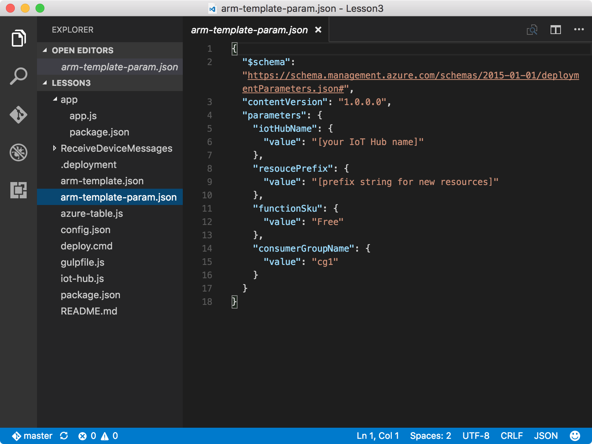

<properties
 pageTitle="Erstellen einer app Azure-Funktion und Azure-Speicher Konto | Microsoft Azure"
 description="Die app Azure-Funktion auf Azure IoT Hub Ereignisse überwacht, verarbeitet eingehende Nachrichten und schreibt sie in Azure Table Storage."
 services="iot-hub"
 documentationCenter=""
 authors="shizn"
 manager="timlt"
 tags=""
 keywords=""/>

<tags
 ms.service="iot-hub"
 ms.devlang="multiple"
 ms.topic="article"
 ms.tgt_pltfrm="na"
 ms.workload="na"
 ms.date="10/21/2016"
 ms.author="xshi"/>

# <a name="31-create-an-azure-function-app-and-azure-storage-account"></a>3.1 Erstellen einer app Azure-Funktion und Azure-Speicher-Konto

[Azure-Funktionen](../../articles/azure-functions/functions-overview.md) ist eine Lösung für die Ausführung von Codes, so genannte "Funktionen" in der Cloud für kleinere einfach. Eine app Azure-Funktion hostet die Ausführung der Funktionen in Azure.

## <a name="311-what-will-you-do"></a>3.1.1 Wozu kann Sie

Verwenden einer Ressourcenmanager Azure-Vorlage zum Erstellen einer app Azure-Funktion und ein Speicher Azure-Konto an. Die app Azure-Funktion auf Azure IoT Hub Ereignisse überwacht, verarbeitet eingehende Nachrichten und schreibt sie in Azure Table Storage. Wenn Sie Probleme mit dem entsprechen, Zielwertsuche Lösungen in die [Seite zu behandeln](iot-hub-raspberry-pi-kit-node-troubleshooting.md).

## <a name="312-what-will-you-learn"></a>3.1.2 was lernen Sie

- Wie [Azure Ressourcenmanager](../../articles/azure-resource-manager/resource-group-overview.md) Azure Ressourcen bereitstellen.
- So verwenden Sie eine Funktion Azure-app IoT Hub Nachrichten verarbeiten, und Schreiben diese zu einer Tabelle in Azure Table Storage.

## <a name="313-what-do-you-need"></a>3.1.3 Was benötigen Sie

- Sie müssen erfolgreich abgeschlossen haben die vorhergehenden Lektionen: [Erste Schritte mit Ihrer Brombeere Pi 3](iot-hub-raspberry-pi-kit-node-get-started.md) und [Erstellen Sie Ihre Azure IoT Hub](iot-hub-raspberry-pi-kit-node-get-started.md).

## <a name="314-open-the-sample-app"></a>3.1.4 Öffnen Sie die Beispiel-app

Öffnen Sie das Beispielprojekt in Visual Studio-Code durch Ausführen der folgenden Befehle:

```bash
cd Lesson3
code .
```


- Die `app.js` Datei wird die `app` Unterordner ist die wichtigsten Quelldatei. Diese Quelldatei enthält des Codes zum Senden einer Nachricht 20 Mal an Ihre IoT Verteiler und Blinken der LED für jede Nachricht, die sie sendet.
- Die `arm-template.json` Datei wird die Ressourcenmanager Azure-Vorlage mit einer app Azure-Funktion und ein Konto Azure-Speicher.
- Die `arm-template-param.json` Datei ist die von der Vorlage Azure Ressourcenmanager verwendeten Konfigurationsdatei.
- Die `ReceiveDeviceMessages` Unterordner enthält den Node.js-Code für die Azure-Funktion.

## <a name="315-configure-azure-resource-manager-templates-and-create-resources-in-azure"></a>3.1.5 konfigurieren Azure Ressourcenmanager Vorlagen und Erstellen von Ressourcen in Azure

Aktualisieren der `arm-template-param.json` Datei in Visual Studio-Code.



- Ersetzen Sie **[Ihr Name IoT Hub]** durch **{meinen Hubnamen}** , die Sie in [Lektion 2](iot-hub-raspberry-pi-kit-node-lesson2-prepare-azure-iot-hub.md)angegeben haben.
- Ersetzen Sie **[Präfixzeichenfolge für neue Ressourcen]** durch alle gewünschten Präfix. Das Präfix wird sichergestellt, dass es sich bei der Namen der Ressource für einen Konflikt zu vermeiden global eindeutig ist. Verwenden Sie keine Gedankenstrich oder Zahl in das Präfix initial.

> [AZURE.NOTE] Sie benötigen keine `azure_storage_connection_string` in diesem Abschnitt. Halten Sie es als ist.

Nach der Aktualisierung der `arm-template-param.json` -Datei, die Ressourcen in Azure bereitstellen, indem Sie den folgenden Befehl ausführen:

```bash
az resource group deployment create --template-file-path arm-template.json --parameters-file-path arm-template-param.json -g iot-sample -n mydeployment
```

Es dauert ungefähr fünf Minuten, um diese Ressourcen zu erstellen. Während die Erstellung der Ressource ausgeführt wird, können Sie mit dem nächsten Abschnitt verschieben.

## <a name="316-summary"></a>3.1.6 Zusammenfassung

Sie haben Ihre app Azure-Funktion zum Verarbeiten von IoT Hub Nachrichten und ein Konto Azure-Speicher diese Nachrichten erstellt. Sie können auf bereitstellen, und führen Sie das Beispiel im nächsten Abschnitt verschieben, in der Pi Gerät-Cloud-Nachrichten senden.

## <a name="next-steps"></a>Nächste Schritte

[3,2 führen Sie Beispiel Anwendung in Ihrem Brombeere Pi 3 Gerät-Cloud-Nachrichten senden aus](iot-hub-raspberry-pi-kit-node-lesson3-run-azure-blink.md)

