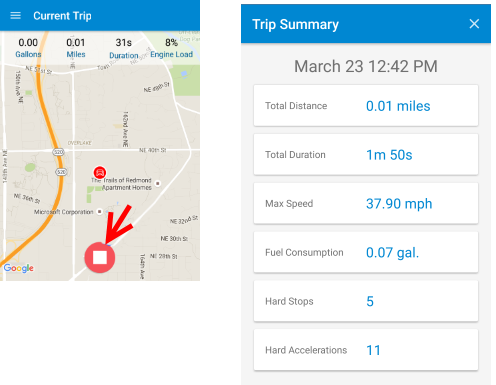

<properties
    pageTitle="MyDriving Azure IoT Beispiel: Schnellstart | Microsoft Azure"
    description="Erste Schritte mit eine app, die eine umfassende Demo wie ein System IoT Entwerfen mit Microsoft Azure, einschließlich Stream Analytics, Computer Lern- und Hubs Ereignis ist."
    services=""
    documentationCenter=".net"
    suite=""
    authors="harikmenon"
    manager="douge"/>

<tags
    ms.service="multiple"
    ms.workload="tbd"
    ms.tgt_pltfrm="ibiza"
    ms.devlang="dotnet"
    ms.topic="article"
    ms.date="03/25/2016"
    ms.author="harikm"/>

# MyDriving IoT System: Schnellstart

MyDriving ist ein System, das veranschaulicht des Entwurfs und der Implementierung einer normalen [Internet der Dinge](iot-suite-overview.md) (IoT) Lösung, die erfasst werden von Geräten, verarbeitet die Daten in der Cloud und gilt für maschinelle lernen, wie Sie eine adaptive Antwort bereitzustellen. Demo protokolliert Daten zu Ihrem Auto Reisen, mithilfe von Daten aus Ihrem Mobiltelefon und ein Netzwerkadapter, die Informationen aus Ihrem Auto des Steuerelements System erfasst. Verwenden Sie dazu verwendet, um eine steuernde Linienart im Vergleich zu anderen Benutzern Feedback abgeben.

Die wirkliche MyDriving dient zum Ihnen den Einstieg in das Erstellen einer eigenen IoT-Lösung. Aber davor, lassen Sie uns Sie Überblick über die MyDriving app selbst – als Mitglied des Teams unsere Test-Benutzer. Das ermöglicht Ihnen, eine Benutzeroberfläche für die app und das System dahinter als Consumer, bevor Sie in die Architektur ausführlicher behandelt. Es führt Sie auch in HockeyApp, eine tolle Möglichkeit der Verwaltung der Verteilung von Alpha und Beta Ihrer Apps, Benutzer zu testen.

## Verwenden des mobilen Zugriffs

Wenn Sie ein Gerät Android, iOS oder Windows 10 haben, können Sie die app MyDriving verwenden.

### Android und 10 unter Windows Mobile-installation

Klicken Sie auf Ihrem Gerät:

1.  Lassen Sie die Entwicklung von apps zu:

    -   Android: In den **Einstellungen** > **Sicherheit**apps von **unbekannten Quellen**zulassen.

    -   Windows 10: In den **Einstellungen** > **Updates** > **Für Entwickler**, legen Sie **den Entwicklermodus**.

2.  Teilnahme an unserem Beta Testteam nach mit anmelden oder Anmeldung bei [HockeyApp](https://rink.hockeyapp.net). HockeyApp erleichtert die frühe Versionen der app zu testen Benutzer verteilen.

    Wenn Sie Windows 10 verwenden, verwenden Sie den Rand Browser.

    Wenn Sie eine eigene 2016 Teilnehmer wurden, melden Sie sich mit der gleichen Microsoft-Konto e-Mail, dass Sie für die Konferenz mithilfe der Schaltflächen Microsoft registriert. Sie sind bereits mit HockeyApp angemeldet.

    

3.  Herunterladen Sie und installieren Sie die app von hier aus:

    -   [Android](http://rink.io/spMyDrivingAndroid)

    -   [Windows-10](http://rink.io/spMyDrivingUWP)

    Es gibt zwei Elemente aus. Installieren Sie das Zertifikat **Vertrauenswürdige**Personen an. Klicken Sie dann installieren.

*Starten die app 10 unter Windows Mobile Probleme?* Ihr Telefon möglicherweise ein Update oder zwei hinter. Stellen Sie sicher, dass Sie die neuesten Updates verfügen, oder installieren:

 - [Microsoft.NET.Native.Framework.1.2.appx](https://download.hockeyapp.net/packages/win10/Microsoft.NET.Native.Framework.1.2.appx) 

 - [Microsoft.NET.Native.Runtime.1.1.appx](https://download.hockeyapp.net/packages/win10/Microsoft.NET.Native.Runtime.1.1.appx) 

 - [Microsoft.VCLibs.ARM.14.00.appx](https://download.hockeyapp.net/packages/win10/Microsoft.VCLibs.ARM.14.00.appx)

### iOS-installation

Wenn Sie eigene 2016 teilgenommen haben, können Sie die app als Mitglied einer unserer Testteam HockeyApp:

1.  Melden Sie sich auf Ihrem iOS-Gerät [HockeyApp](https://rink.hockeyapp.net)an.
    Verwenden Sie eine Microsoft-Anmeldung-Schaltflächen, und melden Sie sich mit der gleichen Microsoft-Konto e-Mail, die Sie mit der Konferenz registriert. (Verwenden Sie nicht die Felder e-Mail und Ihr Kennwort ein.)

    

2.  Auf dem Dashboard HockeyApp MyDriving auswählen und herunterladen.

3.  Die Betaversion von HockeyApp zu autorisieren:

    ein. Wechseln Sie zu **Einstellungen** > **Allgemeine** > **Profile und Device Management.**

    b. Vertrauen Sie das **Bit Stadion GmbH** Zertifikat.

Wenn Sie eigene 2016 nicht zur Teilnahme an, können die app selbst Sie erstellen und bereitstellen:

1.   Laden Sie den Code [aus GitHub].

2.   Erstellen und Bereitstellen von mithilfe von [Xamarin].

Finden Sie weitere Details des [MyDriving Referenzhandbuchs](http://aka.ms/mydrivingdocs).

## Abrufen einer OBD Netzwerkadapter (optional)

Dies ist das Webpart, das dadurch einem tatsächlichen Internet der Dinge System! Können die app ohne eine, aber es ist mehr Spaß mit praktische und teure werden nicht.

Integrierte Diagnose (OBD) wird das Feature Ihr Auto, die die Garage zum Optimieren von Ihr Auto und diagnostizieren ungerade Geräusche und Leuchten Warnung verwendet. Es sei denn, Ihr Auto großartige Altertum ist, finden Sie in der Kontrolle des in der Regel sich ein Bedienfeld unter dem Dashboard ein Sockets dort. Mit den richtigen Verbinder können Sie Metrik der Leistung des Moduls abrufen und bestimmte Anpassungen vornehmen. Ein Verbinder OBD kann problemlos von gewöhnlichen Speicherorte erworben werden. Herstellen einer Verbindung mithilfe von Bluetooth- oder WLAN-Verbindung zu einer anderen app auf Ihrem Telefon.

In diesem Fall werden wir Ihr Auto in der Cloud zu verbinden. Die direkte Verbindung aus dem OBD besteht darin, Ihr Telefon, aber unsere app als Relay funktioniert. Ihr Auto des telemetrieprotokoll wird gesendet, direkt an den Hub MyDriving IoT dort bearbeitet melden Sie sich Ihre Reisen Straßen-und Ihren Stil steuernde bewerten.

Auf einem Gerät OBD verbinden:

1.  Überprüfen Sie, ob Ihr Auto einen OBD-Anschluss an.

2.  Eine OBD Netzwerkadapter zu erhalten:

    -   Wenn Sie eine Android oder Windows Phone verwenden, benötigen Sie ein Bluetooth-fähigen OBD II Netzwerkadapter aus. Wir verwendet [BAFX Produkte 34t5 Bluetooth-OBDII Scannen Tool].

    -   Wenn Sie ein iOS-Telefon verwenden, benötigen Sie einen OBD Wi-Fi-fähige Netzwerkadapter aus. Wir verwendet [ScanTool OBDLink MX Wi-Fi: OBD Netzwerkadapter/Diagnostic Scanner].

3.  Führen Sie die Schritte, die im Zusammenhang mit der Karte OBD für die Verbindung zu Ihrem Telefon aus. Beachten Sie Folgendes beachten:

    -   Ein Bluetooth-Netzwerkadapter muss mit dem Telefon, klicken Sie auf **der Einstellungsseite** kombiniert werden.

    -   Ein Wi-Fi-Netzwerkadapter müssen eine Adresse in den Bereich 192.168.xxx.xxx.

4.  Wenn Sie mehrere Autos verfügen, können Sie einen separaten Netzwerkadapter für jedes (maximal drei) abrufen.

Wenn Sie eine OBD Netzwerkadapter haben, wird die app Speicherort und Geschwindigkeit Daten von des Telefons GPS-Empfänger an die Back-End wird immer noch senden und fragt, ob Sie eine OBD simulieren möchten.

Sie können erfahren Sie mehr darüber, wie die app Daten aus der OBD Netzwerkadapter verwendet und Optionen für das Erstellen Ihrer eigenen OBD Geräts Abschnitt 2.1, "IoT Geräte" im [MyDriving Referenzhandbuchs](http://aka.ms/mydrivingdocs).

## Verwenden der app

Starten Sie die app. Es gibt eine initial Schnellstart auf deren Funktionsweise durchgehen.

### Nachverfolgen Sie Ihrer Schleifen

Tippen Sie auf die Schaltfläche Datensatz (große roter Kreis am unteren Rand des Bildschirms), um eine Reise zu beginnen, und tippen Sie erneut, um zu beenden.

Bei jedem Start eine Reise, ist kein Gerät OBD, werden Sie aufgefordert, wenn Sie den Simulator verwenden möchten.

Am Ende einer Reise Tippen Sie auf die Schaltfläche Beenden, und Sie erhalten eine Zusammenfassung.

### Überprüfen Sie Ihre Schleifen

### Überprüfen Sie Ihr Profil

## Senden Sie uns Feedback testen

Da wir Ihre eigenen Systeme IoT MyDriving um Hilfe Jumpstart erstellt haben, möchten wir natürlich gerne von Ihnen wissen, wie es funktioniert. Lassen Sie uns wissen Sie, wenn:

- Sie führen in Ansprechpartner oder Probleme.

- Es gibt ein Erweiterungspunkt, der es besser geeignet zu Ihrem Szenario vornehmen möchten.

- Sie suchen nach einer effizienteren von bestimmter Anforderungen zu erreichen.

- Sie verfügen über eine beliebige andere Vorschläge zum Verbessern der MyDriving oder dieser Dokumentation.

Innerhalb der MyDriving app ähneln, können Sie das integrierte HockeyApp Feedback Verfahren: iOS und Android, müssen Sie nur Geben Sie Ihr Telefon eine Shake, oder verwenden Sie den Menübefehl **Feedback** . Dies wird automatisch ein Screenshots, anfügen, damit wir wissen, was Sie meinen. Und falls vorhanden alle leider abstürzen sind, sammelt HockeyApp die Protokolle Absturz, wenn Sie uns über sie Berichten. Sie können auch Feedback über das [Portal HockeyApp]anzuzeigen.

Sie können auch ein [Problem auf GitHub]Datei oder einen Kommentar ein, der unten (En-us Edition).

Wir suchen nach vorne zu hören von Ihnen!

## Nächste Schritte

-   Durchsuchen des [MyDriving Referenzhandbuchs](http://aka.ms/mydrivingdocs) , um zu verstehen, wie wir vorgesehen und das gesamte MyDriving System erstellt haben.

-   [Erstellen und Bereitstellen ein Systems eigene](iot-solution-build-system.md) mithilfe von unserem Azure Ressourcenmanager Skripts. Der [MyDriving Referenzhandbuchs](http://aka.ms/mydrivingdocs) schrittweise Anleitung auch Bereiche, wo Sie die meisten Anpassungen vornehmen, werden.

  [aus GitHub]: https://github.com/Azure-Samples/MyDriving
  [Verwenden von Xamarin]: https://developer.xamarin.com/guides/ios/getting_started/installation/
  [BAFX Produkte 34t5 Bluetooth OBDII Scan-Tool]: http://www.amazon.com/gp/product/B005NLQAHS
  [ScanTool OBDLink MX Wi-Fi: OBD Netzwerkadapter/Diagnostic Scanner]: http://www.amazon.com/gp/product/B00OCYXTYY/ref=s9_simh_gw_g263_i1_r?pf_rd_m=ATVPDKIKX0DER&pf_rd_s=desktop-2&pf_rd_r=1MWRMKXK4KK9VYMJ44MP
  [HockeyApp-portal]: https://rink.hockeyapp.org
  [Klicken Sie auf GitHub ausgeben]: https://github.com/Azure-Samples/MyDriving/issues
