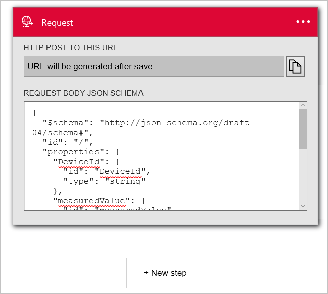
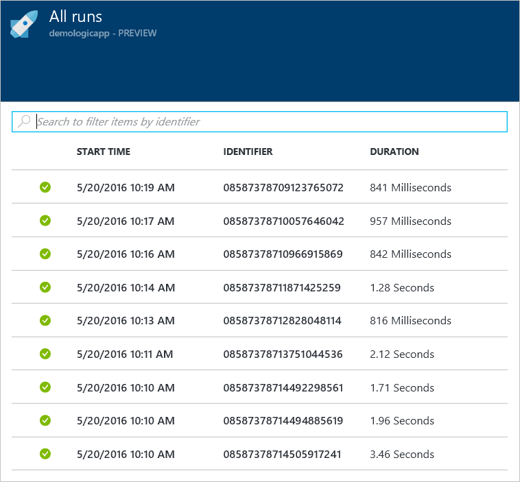

<properties
  pageTitle="Azure IoT Suite und Logik Apps | Microsoft Azure"
  description="Ein Lernprogramm erfahren Sie, wie Apps Azure IoT Suite Logik für Geschäftsprozess einbinden."
  services=""
  suite="iot-suite"
  documentationCenter=""
  authors="aguilaaj"
  manager="timlt"
  editor=""/>

<tags
  ms.service="iot-suite"
  ms.devlang="na"
  ms.topic="article"
  ms.tgt_pltfrm="na"
  ms.workload="na"
  ms.date="08/16/2016"
  ms.author="araguila"/>
  
# <a name="tutorial-connect-logic-app-to-your-azure-iot-suite-remote-monitoring-preconfigured-solution"></a>Lernprogramm: Logik App Herstellen einer Verbindung mit Ihrer Lösung Azure IoT Suite Remote-Überwachung vorkonfiguriert

Die [Microsoft Azure IoT Suite] [ lnk-internetofthings] remote überwachen vorkonfigurierten Lösung ist eine großartige Möglichkeit, um schnell mit einer End-to-End-Features zu beginnen, die eine Lösung IoT ein. In diesem Lernprogramm führt Sie durch das Hinzufügen von Logik App zu Ihrer Microsoft Azure IoT Suite remote vorkonfigurierten Lösung für die Überwachung. Schritte veranschaulichen, wie Sie Ihre IoT Lösung noch feiner an einen Geschäftsprozess anschließen ausführen können.

_Wenn Sie eine exemplarische Vorgehensweise zum Bereitstellen von remote-Überwachung vorkonfiguriert Lösung gefunden haben, finden Sie unter [Lernprogramm: Erste Schritte mit den Lösungen IoT vorkonfiguriert][lnk-getstarted]._

Bevor Sie dieses Lernprogramm starten, sollten Sie Folgendes beachten:

- Bereitstellen von remote-Überwachung vorkonfiguriert-Lösung in Ihrem Azure-Abonnement.

- Erstellen Sie ein Konto für SendGrid ermöglichen es Ihnen, eine e-Mail zu senden, die Ihr Geschäftsprozess auslöst. Durch Klicken auf **kostenlos versuchen**, können Sie sich für eine kostenlose Testversion Konto bei [SendGrid](https://sendgrid.com/) registrieren. Nachdem Sie für Ihr Konto mit kostenlosen Testversion registriert haben, müssen Sie ein [API-Schlüssel](https://sendgrid.com/docs/User_Guide/Settings/api_keys.html) in SendGrid erstellen, die Berechtigungen zum Senden von Nachrichten erteilt. Sie benötigen diesen API-Schlüssel später im Lernprogramm aus.

Angenommen, Sie haben bereits nach der Bereitstellung Ihrer remote-Überwachung Lösung vorkonfiguriert, navigieren Sie zu der Ressourcengruppe für die Lösung im [Portal Azure][lnk-azureportal]. Die Ressourcengruppe weist denselben Namen wie den Lösungsnamen Sie ausgewählt haben, wenn Sie Ihre remote Überwachung Lösung bereitgestellt. In der Ressourcengruppe sehen Sie die bereitgestellten Azure-Ressourcen für Ihre Lösung eine Ausnahme bilden jedoch die Azure Active Directory-Anwendung, die Sie in der klassischen Azure-Portal finden können. Das folgende Bildschirmabbild zeigt ein Beispiel **Ressourcengruppe** Blade für eine Lösung zur remote Überwachung vorkonfigurierten:


Um zu beginnen, richten Sie die vorkonfigurierten Lösung mit der app Logik.

## <a name="set-up-the-logic-app"></a>Richten Sie die App Logik

1. Klicken Sie auf __Add__ am oberen Rand der Ressource Gruppe-vorher in der Azure-Portal.

2. Suchen Sie nach __Logik App__, wählen Sie ihn aus, und klicken Sie dann auf **Erstellen**.

3. Füllen Sie den __Namen__ , und verwenden Sie die gleichen **Abonnement** und **Ressourcengruppe** , die Sie verwendet werden, wenn Sie nach der Bereitstellung Ihrer remote überwachen Lösung. Klicken Sie auf __Erstellen__.

    

4. Wenn Ihre Bereitstellung abgeschlossen ist, können Sie sehen, dass die App Logik als Ressource in der Ressourcengruppe aufgeführt wird.

5. Klicken Sie auf die App Logik, navigieren Sie zu der App Logik Blade, und markieren die Vorlage **Leere Logik App** , um **Logik Apps-Designer**zu öffnen.

    

6. Wählen Sie __anfordern__. Diese Aktion gibt an, dass eine eingehende HTTP-Anforderung mit einer bestimmten JSON Nutzlast Handlungen als Trigger formatiert.

7. Fügen Sie das anfordern Textkörper JSON-Schema mit die folgenden:

    ```
    {
      "$schema": "http://json-schema.org/draft-04/schema#",
      "id": "/",
      "properties": {
        "DeviceId": {
          "id": "DeviceId",
          "type": "string"
        },
        "measuredValue": {
          "id": "measuredValue",
          "type": "integer"
        },
        "measurementName": {
          "id": "measurementName",
          "type": "string"
        }
      },
      "required": [
        "DeviceId",
        "measurementName",
        "measuredValue"
      ],
      "type": "object"
    }
    ```
    
    > [AZURE.NOTE] Sie können die URL für den Beitrag HTTP kopieren, nachdem Sie die app Logik speichern, aber Sie müssen zuerst eine Aktion hinzufügen.

8. Klicken Sie auf __+ neue Schritt__ unter der manuellen auslösen. Klicken Sie dann auf **eine Aktion hinzufügen**.

    

9. Suchen Sie nach **SendGrid - e-Mail zu senden** , und klicken Sie darauf.

    

10. Geben Sie einen Namen für die Verbindung, z. B. **SendGridConnection**, geben Sie den **SendGrid API-Schlüssel** , die Sie erstellt haben, wenn Sie Ihr SendGrid-Konto eingerichtet, und klicken Sie auf **Erstellen**.

    

11. Fügen Sie die e-Mail-Adressen, die Sie der Besitzer der **aus** und **So** Felder sind. Fügen Sie **Remote Überwachen der Warnung [Geräte-ID]** in das Feld **Betreff** an. Fügen Sie im Feld **E-Mail-Textkörper** **hat Gerät [Geräte-ID] [MeasurementName] gemeldet, mit dem Wert [MeasuredValue].** Sie können **[Geräte-ID]**, **[MeasurementName]**und **[MeasuredValue]** hinzufügen, indem Sie im Abschnitt **können Sie Daten aus den vorherigen Schritten einfügen** auf.

    

12. Klicken Sie im oberen Menü auf __Speichern__ .

13. Klicken Sie auf den Trigger **anfordern** , und kopieren Sie den __Http Post an diesen URL__ -Wert. Sie benötigen diese URL später in diesem Lernprogramm.

> [AZURE.NOTE] Logik Apps können Sie [viele verschiedene Typen von Aktion] ausführen[ lnk-logic-apps-actions] einschließlich Aktionen in Office 365. 

## <a name="set-up-the-eventprocessor-web-job"></a>Einrichten der EventProcessor Webauftrag

In diesem Abschnitt Sie Ihre Lösung vorkonfigurierten Herstellen einer Verbindung mit der Logik App, die Sie erstellt haben. Um diese Aufgabe ausführen zu können, fügen Sie die URL, um die App Logik der Aktion auslösen, die wird ausgelöst, wenn ein Gerät Sensorwert einen Schwellenwert überschreitet.

1. Verwenden Sie Ihren Kunden Git, um die neueste Version von Duplizieren der [Azure-Iot-Remote-Überwachung Github Repository][lnk-rmgithub]. Beispiel:

    ```
    git clone https://github.com/Azure/azure-iot-remote-monitoring.git
    ```

2. Öffnen Sie in Visual Studio die __RemoteMonitoring.sln__ aus der lokalen Kopie des Repositorys aus.

3. Öffnen Sie die Datei __ActionRepository.cs__ in die **Infrastruktur\\Repository** Ordner.

4. Aktualisieren Sie das Wörterbuch **ActionIds** mit dem __Http Post an diesen URL__ Sie wie folgt aus der App Logik notiert haben:

    ```
    private Dictionary<string,string> actionIds = new Dictionary<string, string>()
    {
        { "Send Message", "<Http Post to this UR>" },
        { "Raise Alarm", "<Http Post to this UR> }
    };
    ```

5. Speichern der Änderungen in der Lösung, und beenden Sie Visual Studio.

## <a name="deploy-from-the-command-line"></a>Über die Befehlszeile bereitstellen

In diesem Abschnitt stellen Sie Ihre aktualisierte Version der remote Überwachung Lösung für die aktuell ausgeführte in Azure-Version zu ersetzen.

1. Folgen den [Entwickler ansetzen] [ lnk-devsetup] Anweisungen zum Einrichten Ihrer Umgebung für die Bereitstellung.

2.  Um lokal bereitzustellen, führen Sie auf der [lokalen Bereitstellung] [ lnk-localdeploy] Anweisungen.

3.  Gehen Sie in der Cloud bereitstellen um und Aktualisieren Ihrer vorhandenen Cloudbereitstellung, vor der [Cloudbereitstellung] [ lnk-clouddeploy] Anweisungen. Verwenden Sie den Namen der ursprünglichen Bereitstellung als Bereitstellung Namen ein. Für Beispiel, sofern die ursprüngliche Bereitstellung **Demologicapp**, aufgerufen hat, verwenden den folgenden Befehl aus:

    ``
    build.cmd cloud release demologicapp
    ``
    
    Wenn das Skript ausgeführt wird, achten Sie darauf, dass Sie mit der gleichen Azure-Konto, Abonnement, Region und Active Directory-Instanz, die Sie verwendet werden, wenn Sie nach der Bereitstellung der Lösung.

## <a name="see-your-logic-app-in-action"></a>Anzeigen der App Logik in Aktion

Die remote Überwachung vorkonfigurierte Lösung weist zwei Regeln für das Einrichten von standardmäßig, wenn Sie eine Lösung bereitstellen. Beide Regeln werden auf dem Gerät **SampleDevice001** :

* Temperatur > 38.00
* Luftfeuchtigkeit > 48,00

Die Regel Temperatur löst eine Aktion **Auslösen Erinnerung** , und die Luftfeuchtigkeit Regel löst eine Aktion **SendMessage** . Unter der Voraussetzung, dass Sie dieselbe URL für beide Aktionen die Klasse **ActionRepository** verwendet, löst Ihre app Logik für entweder Regel. Beide Regeln verwenden SendGrid, um eine e-Mail-Nachricht an **die Antwortadresse mit Details der Warnung** zu senden.

> [AZURE.NOTE] Die App Logik weiterhin Auslösen jedes Mal, wenn der Schwellenwert erfüllt ist. Um überflüssige e-Mails zu vermeiden, können Sie die Regeln in Ihrer Lösung Portal deaktivieren oder deaktivieren Sie die App Logik im [Portal Azure][lnk-azureportal].

Zusätzlich zum Empfangen von e-Mails, können Sie auch anzeigen, wenn die App Logik im Portal ausgeführt wird:



## <a name="next-steps"></a>Nächste Schritte

Jetzt, da Sie eine App Logik in Verbindung mit einem Geschäftsprozess die vorkonfigurierte Lösung verwendet haben, können Sie mehr über die Optionen zum Anpassen der vorkonfigurierten Lösungen erfahren:

- [Verwenden von dynamischen werden mit der remote-Überwachung vorkonfiguriert Lösung][lnk-dynamic]
- [Gerät Informations-Metadaten in die Überwachung vorkonfiguriert Lösung][lnk-devinfo]

[lnk-dynamic]: iot-suite-dynamic-telemetry.md
[lnk-devinfo]: iot-suite-remote-monitoring-device-info.md

[lnk-internetofthings]: https://azure.microsoft.com/documentation/suites/iot-suite/
[lnk-getstarted]: iot-suite-getstarted-preconfigured-solutions.md
[lnk-azureportal]: https://portal.azure.com
[lnk-logic-apps-actions]: ../connectors/apis-list.md
[lnk-rmgithub]: https://github.com/Azure/azure-iot-remote-monitoring
[lnk-devsetup]: https://github.com/Azure/azure-iot-remote-monitoring/blob/master/Docs/dev-setup.md
[lnk-localdeploy]: https://github.com/Azure/azure-iot-remote-monitoring/blob/master/Docs/local-deployment.md
[lnk-clouddeploy]: https://github.com/Azure/azure-iot-remote-monitoring/blob/master/Docs/cloud-deployment.md
