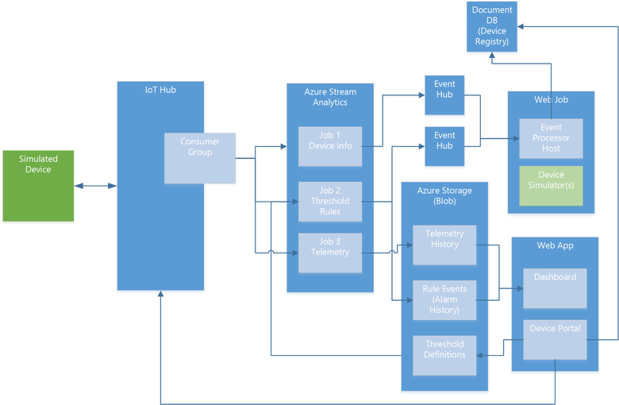

<properties
 pageTitle="Remote-Überwachung vorkonfiguriert Lösung Exemplarische Vorgehensweise | Microsoft Azure"
 description="Eine Beschreibung der Azure IoT vorkonfiguriert Lösung remote-Überwachung und seine Architektur."
 services=""
 suite="iot-suite"
 documentationCenter=""
 authors="dominicbetts"
 manager="timlt"
 editor=""/>

<tags
 ms.service="iot-suite"
 ms.devlang="na"
 ms.topic="get-started-article"
 ms.tgt_pltfrm="na"
 ms.workload="na"
 ms.date="08/17/2016"
 ms.author="dobett"/>

# <a name="remote-monitoring-preconfigured-solution-walkthrough"></a>Remote-Überwachung vorkonfiguriert Lösung Exemplarische Vorgehensweise

## <a name="introduction"></a>Einführung

Die Überwachung [Lösung vorkonfiguriert] IoT Suite Remote[ lnk-preconfigured-solutions] ist für die Überwachung einer Implementierung von einer End-to-End-Lösung für mehrere Computern remote an. Die Lösung kombiniert Key Azure Services, um eine generische Implementierung von Business-Szenario bereitstellen und können ihn als Ausgangspunkt für eine eigene Implementierung. Sie können [Anpassen] [ lnk-customize] die Lösung für Ihre eigenen bestimmten Bedürfnisse zuschneiden.

In diesem Artikel führt Sie durch einige der wichtigsten Elemente der remote-Überwachung Lösung aktivieren Sie verstehen, wie es funktioniert. Diese Kenntnisse können Sie Folgendes ausführen:

- Behandeln von Problemen in der Lösung.
- Planen Sie, wie die Lösung für Ihre eigenen spezifischen Bedürfnisse anpassen. 
- Entwerfen Sie Ihre eigene IoT-Lösung, die Azure Services verwendet.

## <a name="logical-architecture"></a>Logische Architektur

Das folgende Diagramm skizziert die logischen Komponenten der vorkonfigurierten Lösung:




## <a name="simulated-devices"></a>Simuliertes Geräte

In den vorkonfigurierten Lösung darstellt simulierte Gerät ein Kühlgerät (wie Gebäude Klimaanlage oder Einrichtung Luft Behandlung Einheit). Wenn Sie die vorkonfigurierte Lösung bereitstellen, Sie auch automatisch Bereitstellen von vier simulierten Geräten, die in einer [Azure WebJob]ausgeführt werden[lnk-webjobs]. Die simulierten Geräten erleichtern Sie das Verhalten der Lösung, ohne dass eine physische Geräte bereitstellen zu durchsuchen. Um einem realen physischen Gerät bereitstellen zu können, finden Sie unter [Verbinden mit Ihrem Gerät auf die Remote überwachen vorkonfigurierten Lösung] [ lnk-connect-rm] Lernprogramm.

Jedes simulierten Gerät kann die folgenden Nachrichtenarten an IoT Hub zu senden:

| Nachricht  | Beschreibung |
|----------|-------------|
| Beim Start  | Wenn das Gerät gestartet wird, wird eine **Gerät-Info** Nachricht mit Informationen über sich selbst an die Back-End gesendet. Diese Daten enthält, die Geräte-Id, die Gerätemetadaten, eine Liste der Befehle das Gerät unterstützt, und die aktuelle Konfiguration des Geräts. |
| Anwesenheitsinformationen | Ein Gerät sendet regelmäßig eine Nachricht **Anwesenheitsinformationen** gemeldet, ob das Gerät das Vorhandensein eines Sensors ermitteln kann. |
| Werden | Ein Gerät sendet regelmäßig eine **telemetrieprotokoll** -Nachricht, die simulierten Werte für die Temperatur und Feuchtigkeit auf des Geräts simulierten Sensoren erfassten Berichte. |


Die simulierten Geräten senden die folgenden Geräteeigenschaften in einer Nachricht **Gerät-Informationen** ein:

| Eigenschaft               |  Zweck |
|------------------------|--------- |
| Geräte-ID              | ID, die entweder bereitgestellt oder zugewiesen werden, wenn ein Gerät in die Lösung erstellt wird. |
| Hersteller           | Gerätehersteller |
| Nummer des Modells           | Modellnummer des Geräts |
| Fortlaufende Zahl          | Fortlaufende Zahl des Geräts |
| Firmware               | Aktuelle Version Firmware auf dem Gerät |
| Plattform               | Plattform-Architektur des Geräts |
| Prozessor              | Prozessor mit dem Gerät |
| Installierte RAM          | Auf dem Gerät installierte RAM |
| Hub aktivierter Zustand      | IoT Hub State-Eigenschaft des Geräts |
| Erstellten Zeit           | Zeitpunkt der Erstellung des Geräts in die Lösung |
| Aktualisierungszeitpunkt           | Zeitpunkt der letzten wurden Eigenschaften für das Gerät aktualisiert. |
| Breite               | Speicherort der Breite des Geräts |
| Länge              | Der Längengradposition des Geräts |

Der Simulator basiert diese Eigenschaften in simulierten Geräte mit Beispielwerte.  Jedes Mal, wenn der Simulator eines simulierten Gerät initialisiert Beiträge das Gerät die vordefinierte Metadaten an IoT Verteiler. Beachten Sie, wie dies alle Metadaten Aktualisierungen im Portal Gerät überschreibt.


Die simulierten Geräte können die folgenden Befehle aus dem Dashboard Lösung durch den IoT Hub gesendet behandeln:

| Befehl                | Beschreibung                                         |
|------------------------|-----------------------------------------------------|
| PingDevice             | Sendet einen _Ping_ an das Gerät zu überprüfen, dass es aktiv ist.   |
| StartTelemetry         | Startet das Gerät gesendet werden                 |
| StopTelemetry          | Stoppt das Gerät mehr gesendet werden             |
| ChangeSetPointTemp     | Ändert den Grenzwert Wert, um den zufälligen Daten generiert wird |
| DiagnosticTelemetry    | Löst den Gerätsimulator zum Senden eines weiteren werden Werts (ExternalTemp) |
| ChangeDeviceState      | Ändert sich eine erweiterte State-Eigenschaft für das Gerät, und sendet die Nachricht Gerät Informationen vom Gerät |

Die Befehl Gerät Bestätigung der Lösung Back-End wird durch den Hub IoT bereitgestellt.

## <a name="iot-hub"></a>IoT-Hub

Die [IoT Hub] [ lnk-iothub] ingests Daten, die von den Geräten in der Cloud gesendet und den Azure Stream Analytics (ASA) stellen bereitgestellt. IoT Hub sendet Befehle auf Geräte auch im Namen des Portals Gerät. Jeder Stream ASA Auftrag verwendet eine separate IoT Hub Consumer Gruppe Lesen des Streams Nachrichten aus Ihren Geräten.

## <a name="azure-stream-analytics"></a>Azure Stream Analytics

In der remote Überwachung Solution [Azure Stream Analytics] [ lnk-asa] (ASA) sendet Gerät Nachrichten durch den Hub IoT zu anderen Back-End-Komponenten zur Bearbeitung oder Speicher empfangen. Unterschiedliche ASA stellen ausführen bestimmte Funktionen, die basierend auf den Inhalt der Nachrichten.

**Position 1: Geräteinformationen** filtert Gerät Informationsnachrichten aus dem eingehenden Nachricht Stream und an einen Endpunkt Ereignis Hub gesendet werden. Ein Gerät sendet Gerät Informationsnachrichten beim Start und in der Antwort auf einen Befehl **SendDeviceInfo** . Dieses Projekt verwendet die folgenden Abfragedefinition zur Identifikation von Nachrichten **Gerät-Informationen** ein:

```
SELECT * FROM DeviceDataStream Partition By PartitionId WHERE  ObjectType = 'DeviceInfo'
```

Dieser Auftrag sendet seine Ausgabe an ein Ereignis Hub für die weitere Verarbeitung.

**Auftrag 2: Regeln** eingehende Temperatur und Feuchtigkeit werden Werte auf pro Gerät Schwellenwerte ergibt. Schwellenwert für Werte werden in der Regel-Editor zur Verfügung, in dem Dashboard Lösung festgelegt. Jedes Gerät/Wert-Paar wird nach dem Zeitstempel in einer Blob gespeichert, die Stream Analytics in als **Referenzdaten**liest. Der Auftrag vergleicht alle nicht leerer Wert mit dem Satz Schwellenwert für das Gerät. Wenn sie überschreitet die ' >' Bedingung, die der Auftrag gibt eine **Erinnerung** Ereignis, der angibt, dass der Schwellenwert überschritten wird und das Gerät, Wert und Timestamp-Werte stellt. Dieses Projekt verwendet die folgende Abfragedefinition werden Nachrichten zu identifizieren, die eine Erinnerung fehlgeschlagen sollten:

```
WITH AlarmsData AS 
(
SELECT
     Stream.IoTHub.ConnectionDeviceId AS DeviceId,
     'Temperature' as ReadingType,
     Stream.Temperature as Reading,
     Ref.Temperature as Threshold,
     Ref.TemperatureRuleOutput as RuleOutput,
     Stream.EventEnqueuedUtcTime AS [Time]
FROM IoTTelemetryStream Stream
JOIN DeviceRulesBlob Ref ON Stream.IoTHub.ConnectionDeviceId = Ref.DeviceID
WHERE
     Ref.Temperature IS NOT null AND Stream.Temperature > Ref.Temperature

UNION ALL

SELECT
     Stream.IoTHub.ConnectionDeviceId AS DeviceId,
     'Humidity' as ReadingType,
     Stream.Humidity as Reading,
     Ref.Humidity as Threshold,
     Ref.HumidityRuleOutput as RuleOutput,
     Stream.EventEnqueuedUtcTime AS [Time]
FROM IoTTelemetryStream Stream
JOIN DeviceRulesBlob Ref ON Stream.IoTHub.ConnectionDeviceId = Ref.DeviceID
WHERE
     Ref.Humidity IS NOT null AND Stream.Humidity > Ref.Humidity
)

SELECT *
INTO DeviceRulesMonitoring
FROM AlarmsData

SELECT *
INTO DeviceRulesHub
FROM AlarmsData
```

Der Auftrag sendet die Ausgabe an einen Ereignis-Hub für die weitere Verarbeitung und speichert die Details der jeweiligen Hinweise Blob-Speicher aus, in dem das Lösung Dashboard die Benachrichtigung Informationen lesen können.

**Auftrag 3: werden** auf den eingehenden Gerät werden Stream auf zwei Arten in Betrieb sind. Die erste sendet alle werden Nachrichten von den Geräten zum beständigen Blob-Speicher zur Archivierung. Die zweite Mittelwert, maximale und minimale Feuchtigkeit Werte über ein Zeitfenster fünf Minuten berechnet und sendet diese Daten Blob-Speicher. Das Lösung Dashboard liest die Daten werden aus BLOB-Speicher die Diagramme gefüllt wird. Dieses Projekt verwendet die folgende Abfragedefinition:

```
WITH 
    [StreamData]
AS (
    SELECT
        *
    FROM [IoTHubStream]
    WHERE
        [ObjectType] IS NULL -- Filter out device info and command responses
) 

SELECT
    IoTHub.ConnectionDeviceId AS DeviceId,
    Temperature,
    Humidity,
    ExternalTemperature,
    EventProcessedUtcTime,
    PartitionId,
    EventEnqueuedUtcTime,
    * 
INTO
    [Telemetry]
FROM
    [StreamData]

SELECT
    IoTHub.ConnectionDeviceId AS DeviceId,
    AVG (Humidity) AS [AverageHumidity],
    MIN(Humidity) AS [MinimumHumidity],
    MAX(Humidity) AS [MaxHumidity],
    5.0 AS TimeframeMinutes 
INTO
    [TelemetrySummary]
FROM [StreamData]
WHERE
    [Humidity] IS NOT NULL
GROUP BY
    IoTHub.ConnectionDeviceId,
    SlidingWindow (mi, 5)
```

## <a name="event-hubs"></a>Ereignis Hubs

Das **Geräteinformationen** und **Regeln** ASA Aufträge ausgeben ihre Daten zu Ereignis Hubs zuverlässig weiterleiten an das **Ereignisprozessor** in der WebJob ausgeführt.

## <a name="azure-storage"></a>Azure-Speicher

Die Lösung verwendet Azure Blob-Speicher zum Beibehalten der unformatierten und zusammengefasste werden Daten der Geräte in die Lösung. Das Dashboard liest die Daten werden aus BLOB-Speicher die Diagramme gefüllt wird. Klicken Sie zum Anzeigen von Benachrichtigungen liest das Dashboard die Daten aus Blob-Speicher zum Aufzeichnen von Wenn Werte werden die konfigurierten Schwellenwerte überschritten. Die Lösung verwendet Blob-Speicher auch die Schwellenwerte aufzeichnen, die Sie im Dashboard festgelegt werden.

## <a name="webjobs"></a>WebJobs

Neben dem Hosten der Gerät Simulatoren, Hosten der WebJobs in die Lösung auch das **Ereignisprozessor** in einer Azure WebJob ausgeführt werden, die Ziehpunkte Gerät Informationsnachrichten und der Befehl Antworten aus. Es wird verwendet:

- Gerät Informationsnachrichten, um die Registrierung des Geräts (gespeichert in der Datenbank DocumentDB) mit den aktuellen Gerät zu aktualisieren.
- Dieser Befehl Verlauf (gespeichert in der Datenbank DocumentDB) Befehl Antwortnachrichten, um das Gerät zu aktualisieren.

## <a name="documentdb"></a>DocumentDB

Die Lösung verwendet eine DocumentDB-Datenbank zum Speichern von Informationen zur Lösung verbundenen Geräte. Diese Informationen umfassen Gerätemetadaten und im Verlauf der Befehle aus dem Dashboard an Geräte gesendet.

## <a name="web-apps"></a>Web apps

### <a name="remote-monitoring-dashboard"></a>Remote Überwachung dashboard
Diese Seite in der Anwendung verwendet PowerBI Javascript-Steuerelemente (finden Sie unter [PowerBI-visuelle Objekte Repo](https://www.github.com/Microsoft/PowerBI-visuals)) visualisiert werden sollen, die Daten werden von den Geräten. Die Lösung verwendet den ASA werden Auftrag zum Schreiben von Daten werden BLOB-Speicher.


### <a name="device-administration-portal"></a>Gerät Administration portal

Diese Web app können Sie:

- Bereitstellen eines neuen Geräts. Diese Aktion Legt die eindeutige Geräte-Id und die Taste Authentifizierung generiert. Informationen über das Gerät in der Registrierung der IoT Hub Identität und die Lösung-spezifische DocumentDB Datenbank geschrieben.
- Verwalten Sie die Eigenschaften des Geräts. Diese Aktion enthält vorhandene Eigenschaften anzeigen und mit neuen Eigenschaften aktualisieren.
- Senden Sie Befehle an ein Gerät.
- Anzeigen des Verlaufs Befehl für ein Gerät.
- Aktivieren und Deaktivieren von Geräten.

## <a name="next-steps"></a>Nächste Schritte

Die folgenden TechNet von Blogbeiträgen erfahren Sie weitere Einzelheiten zu der remote Überwachung vorkonfigurierten Lösung:

- [IoT Suite – Erweiterte Einstellungen - Remote-Überwachung](http://social.technet.microsoft.com/wiki/contents/articles/32941.iot-suite-under-the-hood-remote-monitoring.aspx)
- [IoT Suite - Remote-Überwachung - Live und simulierten Geräte hinzufügen](http://social.technet.microsoft.com/wiki/contents/articles/32975.iot-suite-remote-monitoring-adding-live-and-simulated-devices.aspx)

Sie können weiterhin, erste Schritte mit IoT Suite, indem Sie den folgenden Artikeln:

- [Herstellen einer Verbindung die remote Überwachung vorkonfigurierten Lösung mit Ihrem Gerät][lnk-connect-rm]
- [Berechtigungen für die Website azureiotsuite.com][lnk-permissions]

[lnk-preconfigured-solutions]: iot-suite-what-are-preconfigured-solutions.md
[lnk-customize]: iot-suite-guidance-on-customizing-preconfigured-solutions.md
[lnk-iothub]: https://azure.microsoft.com/documentation/services/iot-hub/
[lnk-asa]: https://azure.microsoft.com/documentation/services/stream-analytics/
[lnk-webjobs]: https://azure.microsoft.com/documentation/articles/websites-webjobs-resources/
[lnk-connect-rm]: iot-suite-connecting-devices.md
[lnk-permissions]: iot-suite-permissions.md