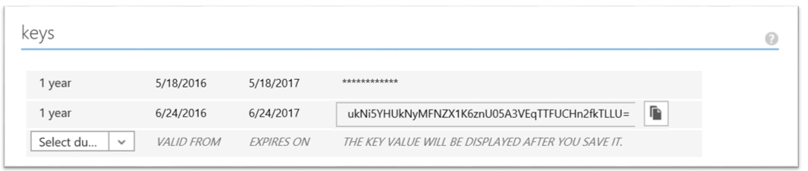
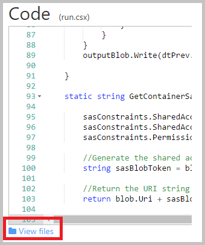

<properties
    pageTitle="Zum Einrichten der Schlüssel Tresor mit durchgehende Key Drehung und Überwachung | Microsoft Azure"
    description="Mithilfe dieser Vorgehensweise können Sie Setup mit Key Drehung und Überwachen von Key Tresor Protokolle öffnen"
    services="key-vault"
    documentationCenter=""
    authors="swgriffith"
    manager="mbaldwin"
    tags=""/>

<tags
    ms.service="key-vault"
    ms.workload="identity"
    ms.tgt_pltfrm="na"
    ms.devlang="na"
    ms.topic="article"
    ms.date="07/05/2016"
    ms.author="jodehavi;stgriffi"/>
#<a name="how-to-setup-key-vault-with-end-to-end-key-rotation-and-auditing"></a>Vorgehensweise für die Installation Schlüssel Tresor mit durchgehende Key Drehung und Überwachung

##<a name="introduction"></a>Einführung

Nach dem Erstellen der Azure-Taste Tresor, werden Sie Starten der Nutzung dieser Tresor zum Speichern Ihrer Schlüssel und Kennwörter sein. Ihrer Anwendung nicht mehr benötigen Ihre Schlüssel oder Kennwörter, sondern beibehalten werden diese aus dem Key Tresor anfordern wird je nach Bedarf. So können Sie Schlüssel und Kennwörter beeinträchtigt das Verhalten der Anwendung, die von einer Vielzahl von mögliche Werte, um den Key geöffnet wird und die geheimen Management Verhalten zu aktualisieren.

In diesem Artikel führt durch ein Beispiel für die Nutzung von Azure-Taste Tresor um ein Geheimnis, in diesem Fall kontoschlüssel ein Azure-Speicher zu speichern, das von einer Anwendung zugegriffen werden kann. Es wird auch Implementierung einer geplanten Drehwinkel dieser Speicher kontoschlüssel veranschaulichen. Schließlich führt sie durch eine Demo zum Überwachen der Überwachungsprotokolle Key Tresor und Auslösen Benachrichtigungen, wenn unerwartete Anfragen vorgenommen werden.

> \[AZURE. Hinweis\] in diesem Lernprogramm sollte nicht im Detail den anfänglichen Satz von von Ihrem Azure-Taste Tresor erläutert. Weitere Informationen hierzu finden Sie unter [Erste Schritte mit Azure Schlüssel Tresor](key-vault-get-started.md). Oder Plattformen Line Benutzeroberfläche Anweisungen finden Sie unter [Lernprogramm entspricht](key-vault-manage-with-cli.md).

##<a name="setting-up-keyvault"></a>Einrichten von KeyVault

Akzeptieren, um eine Anwendung ein Geheimnis aus Azure-Taste Tresor abrufen aktivieren möchten, müssen Sie zuerst die geheim erstellen und zu Ihrem Tresor hochladen. Dies kann problemlos über PowerShell ausgeführt werden, wie unten dargestellt.

Starten einer Sitzung Azure PowerShell, und melden Sie sich bei Ihrem Azure-Konto mit den folgenden Befehl aus:

```powershell
Login-AzureRmAccount
```

Geben Sie im Popupmenü Browserfenster Ihren Azure-Konto-Benutzernamen und Ihr Kennwort ein. Azure PowerShell erhalten alle Abonnements, die mit diesem Konto und standardmäßig zugeordnet sind, verwendet die erste.

Wenn Sie mehrere Abonnements haben, müssen Sie möglicherweise eine bestimmte angeben, die mit Ihrem Azure-Taste Tresor erstellt wurde. Geben Sie Folgendes ein, um die Abonnements für Ihr Konto finden Sie unter:

```powershell
Get-AzureRmSubscription
```

Geben Sie dann, um anzugeben, das mit Ihrem Key Tresor verknüpft ist, die Sie anmelden werden das Abonnement:

```powershell
Set-AzureRmContext -SubscriptionId <subscriptionID> 
```

Wie in diesem Artikel wird veranschaulicht, wie ein Speicher Konto Key als Geheimnis, müssen Sie diese kontoschlüssel Speicher zu erhalten.

```powershell
Get-AzureRmStorageAccountKey -ResourceGroupName <resourceGroupName> -Name <storageAccountName>
```

Nach Erhalt Ihrer geheim, in diesem Fall Ihren kontoschlüssel Speicher, müssen Sie konvertieren, die in eine sichere Zeichenfolge, und erstellen Sie einen geheimen mit dieser Wert wird in Ihrem Key Tresor.

```powershell
$secretvalue = ConvertTo-SecureString <storageAccountKey> -AsPlainText -Force

Set-AzureKeyVaultSecret -VaultName <vaultName> -Name <secretName> -SecretValue $secretvalue
```
Als Nächstes möchten den URI für das Geheimnis abzurufen, die Sie soeben erstellt haben. Dies wird in einem späteren Schritt verwendet werden, wenn Sie die Taste Tresor zum Abrufen Ihrer geheim aufrufen. Führen Sie den folgenden PowerShell-Befehl aus, und notieren Sie den Wert für "Id", der geheimen URI ist.

```powershell
Get-AzureKeyVaultSecret –VaultName <vaultName>
```

##<a name="setting-up-application"></a>Einrichten der Anwendung

Jetzt, da Sie einen geheimen Schlüssel gespeichert haben, sollten Sie diese geheim abrufen und diese vom Code verwenden. Es gibt ein paar erreichen dies das erste und wichtigste d. h. Registrieren Ihrer Anwendung mit Azure Active Directory und dann besagt Azure-Taste Tresor Ihrer Anwendungsinformationen, damit es Anfragen Ihrer Anwendung zulassen kann erforderlichen Schritte aus.

> \[AZURE. Hinweis\] Ihrer Anwendung muss auf den gleichen Azure Active Directory-Mandanten als Ihrem Tresor Schlüssel erstellt werden. 

Öffnen Sie zuerst die Registerkarte Applications Azure Active Directory


Wählen Sie 'Hinzufügen', um eine neue Anwendung zu Ihrer Azure AD hinzuzufügen


Lassen Sie den Anwendungstyp als "Web Anwendung und/oder WEB API", und geben Sie einen Namen der Anwendung.


Geben Sie der Anwendung eines 'Anmelden-URL' und 'App-ID URI'. Diese dürfen nichts, das Sie für diese Demo verwenden möchten, und können später geändert werden, falls erforderlich.


Sobald die Anwendung Azure AD hinzugefügt wurde, werden Sie in der Anwendungsseite verlagern. Klicken Sie an dieser Stelle auf der Registerkarte 'Konfigurieren', und suchen Sie dann nach, und kopieren Sie den Wert "-Client-ID". Notieren Sie sich die Client-ID für spätere Schritte.

Als Nächstes müssen Sie einen Schlüssel für eine Anwendung mit Ihrer Azure AD interagieren können zu erzeugen. Sie können dies unter dem Abschnitt 'Schlüssel' auf der Registerkarte 'Konfiguration' erstellen. Notieren Sie die dem neu generierte Schlüssel aus Ihrer Anwendung Azure AD-zur Verwendung in einem späteren Schritt.



Bevor Sie alle Aufrufe Ihrer Anwendung in Schlüssel Tresor müssen Sie in die Taste Tresor zu Ihrer Anwendung angeben und deren ' Berechtigungen. Mit dem folgende Befehl nimmt den Tresor Namen und die Client-ID aus der Azure AD-app und gewährt Zugriff auf Ihre Key Tresor "Get", für die Anwendung.

```powershell
Set-AzureRmKeyVaultAccessPolicy -VaultName <vaultName> -ServicePrincipalName <clientIDfromAzureAD> -PermissionsToSecrets Get
```

Zu diesem Zeitpunkt sind Sie bereit sind, Zuverlässigkeit Ihrer Anwendung Anrufe. In der Anwendung müssen Sie zunächst die Interaktion mit Azure-Taste Tresor Azure Active Directory benötigten NuGet Pakete installieren zu können. Geben Sie die folgenden Befehle aus der Visual Studio-Paket-Manager-Konsole. Beachten Sie, dass Zeitpunkt der Erstellung dieses Artikels die aktuelle Version des Active Directory-Pakets 3.10.305231913, damit Sie möglicherweise die neueste Version bestätigen und entsprechend zu aktualisieren möchten.

```powershell
Install-Package Microsoft.IdentityModel.Clients.ActiveDirectory -Version 3.10.305231913

Install-Package Microsoft.Azure.KeyVault
```

Erstellen Sie in Ihrer Anwendungscode eine Klasse zum Halten Sie der Methode für Ihre Active Directory-Authentifizierung ein. In diesem Beispiel, dass Class 'Utils' aufgerufen wird. Sie müssen das folgende mit hinzufügen.

```csharp
using Microsoft.IdentityModel.Clients.ActiveDirectory;
```

Fügen Sie die folgende Methode, um das JWT Token aus Azure AD abzurufen. In der Konfiguration Web oder einer Anwendung codiert Zeichenfolgenwerte, um eine verwaltbare Lösung, die Sie möglicherweise die Festplatte verschieben möchten.

```csharp
public async static Task<string> GetToken(string authority, string resource, string scope)
{
    var authContext = new AuthenticationContext(authority);

    ClientCredential clientCred = new ClientCredential("<AzureADApplicationClientID>","<AzureADApplicationClientKey>");

    AuthenticationResult result = await authContext.AcquireTokenAsync(resource, clientCred);

    if (result == null)

    throw new InvalidOperationException("Failed to obtain the JWT token");

    return result.AccessToken;
}
```

Schließlich können Sie den erforderlichen Code zum Schlüssel Tresor anrufen und zum Abrufen Ihrer geheimen Werts hinzufügen. Sie müssen zuerst fügen Sie die folgende Anweisung verwenden.

```csharp
using Microsoft.Azure.KeyVault;
```

Fügen Sie als Nächstes die Methode ruft Schlüssel Tresor aufzurufen und Ihre geheim abrufen. Bei dieser Methode wird das Geheimnis URI bereitgestellt werden, die Sie in einem vorherigen Schritt gespeichert haben. Beachten Sie die Verwendung der Methode GetToken aus Utils Klasse über erstellt.
    
```csharp
var kv = new KeyVaultClient(new KeyVaultClient.AuthenticationCallback(Utils.GetToken));

var sec = kv.GetSecretAsync(<SecretID>).Result.Value;
```

Wenn Sie die Anwendung ausführen, sollten Sie jetzt sein authentifizieren in Azure Active Directory und das Abrufen Ihrer geheimen Werts aus Tresor Ihrer Azure-Taste.

##<a name="key-rotation-using-azure-automation"></a>Taste Drehung Azure Automatisierung

Es gibt verschiedene Optionen für die Durchführung einer Drehung Strategie für Werte, die Sie als Azure-Taste Tresor Kennwörter speichern aus. Kennwörter als Teil eines manuellen Prozesses gedreht werden können, diese möglicherweise durch die Nutzung von API-Aufrufe Programmgesteuertes gedreht werden, oder sie möglicherweise über eine Automatisierungsskript gedreht werden. Im Sinne dieses Artikels wir werden werden Nutzung von Azure PowerShell kombiniert mit Azure Automatisierung Zugriffstaste Azure-Speicher-Konto zu ändern, und wir werden ein Geheimnis Key Tresor mit dieser neuen Schlüssel aktualisieren. 

Akzeptieren, um Azure Automatisierung geheimen Werte in Ihrem Key Tresor festlegen müssen Sie die Client-ID für die Verbindung mit dem Namen 'AzureRunAsConnection' die erstellt wurde, wenn Sie Ihre Azure Automatisierung Instanz hergestellt erhalten. Sie können dieser ID abrufen, indem Sie Ihre Azure Automatisierung Instanz 'Anlagen' auswählen. Von dort aus 'Verbindungen' auswählen und wählen Sie dann das Prinzip der 'AzureRunAsConnection'-Dienst. Sie möchten die '-ID' beachten. 


Während Sie weiterhin im Fenster Anlagen enthalten sind, sollten Sie auch 'Module' auswählen. Aus Modulen wählen Sie 'Katalog' und suchen Sie nach und 'Importieren' aktualisiert Versionen von jedem der folgenden Module.

    Azure
    Azure.Storage   
    AzureRM.Profile
    AzureRM.KeyVault
    AzureRM.Automation
    AzureRM.Storage
    
> \[AZURE. Hinweis\] Zeitpunkt der Erstellung dieses Artikels nur oben notiert haben Module müssen für das Skript unter freigegeben aktualisiert werden. Wenn Sie feststellen, dass Ihre Arbeit Automatisierung fehlschlägt, sollten Sie sicherstellen, dass Sie alle erforderlichen Module und deren abhängigen Dateien importiert haben.

Nachdem Sie die Anwendung-ID für die Verbindung Azure Automatisierung abgerufen haben, müssen Sie Ihre Azure-Taste Tresor feststellen, dass diese Anwendung auf vertrauliche Informationen in Ihrem Tresor aktualisieren zugreifen kann. Dies kann mit den folgenden PowerShell-Befehl erfolgen.

```powershell
Set-AzureRmKeyVaultAccessPolicy -VaultName <vaultName> -ServicePrincipalName <applicationIDfromAzureAutomation> -PermissionsToSecrets Set
```

Als Nächstes werden, wählen Sie die 'Runbooks' Ressource unter der Automatisierung Azure-Instanz und einer Runbooks auswählen 'hinzufügen'. Wählen Sie 'Schnelles Erstellen' aus. Benennen Sie Ihre Runbooks, und wählen Sie 'PowerShell' Dateityp Runbooks. Fügen Sie optional eine Beschreibung hinzu. Klicken Sie abschließend auf 'Erstellen'.


Klicken Sie im Editor für Ihre neue Runbooks werden Sie das folgende PowerShell-Skript einfügen.

```powershell
$connectionName = "AzureRunAsConnection"
try
{
    # Get the connection "AzureRunAsConnection "
    $servicePrincipalConnection=Get-AutomationConnection -Name $connectionName         

    "Logging in to Azure..."
    Add-AzureRmAccount `
        -ServicePrincipal `
        -TenantId $servicePrincipalConnection.TenantId `
        -ApplicationId $servicePrincipalConnection.ApplicationId `
        -CertificateThumbprint $servicePrincipalConnection.CertificateThumbprint 
    "Login complete."
}
catch {
    if (!$servicePrincipalConnection)
    {
        $ErrorMessage = "Connection $connectionName not found."
        throw $ErrorMessage
    } else{
        Write-Error -Message $_.Exception
        throw $_.Exception
    }
}

#Optionally you may set the following as parameters
$StorageAccountName = <storageAccountName>
$RGName = <storageAccountResourceGroupName>
$VaultName = <keyVaultName>
$SecretName = <keyVaultSecretName>

#Key name. For example key1 or key2 for the storage account
New-AzureRmStorageAccountKey -ResourceGroupName $RGName -StorageAccountName $StorageAccountName -KeyName "key2" -Verbose
$SAKeys = Get-AzureRmStorageAccountKey -ResourceGroupName $RGName -Name $StorageAccountName

$secretvalue = ConvertTo-SecureString $SAKeys[1].Value -AsPlainText -Force

$secret = Set-AzureKeyVaultSecret -VaultName $VaultName -Name $SecretName -SecretValue $secretvalue
```

Sie können aus dem Editorbereich 'Test im Bereich' auswählen Ihr Skript zu testen. Nachdem das Skript ausgeführt wird ohne Fehler können Sie die Option 'Veröffentlichen' auswählen, und klicken Sie dann können Sie einen Zeitplan für die Runbooks wieder in den Bereich Runbooks Konfiguration anwenden.

##<a name="key-vault-auditing-pipeline"></a>Taste Tresor Überwachung Verkaufspipeline

Wenn Sie eine Azure-Taste Tresor einrichten können Sie zum Sammeln von Protokollen auf zugriffsanforderungen versucht, die Taste Tresor Überwachung aktivieren. Diese Protokolle werden in einem festgelegten Speicher Azure-Konto gespeichert und dann Prozentzahlen herausgezogen werden, überwacht und analysiert werden. Unter schrittweise ein Szenario, das Azure-Funktionen nutzt, Überwachungsprotokolle Azure Logik Apps und Tresor Schlüssel zum Erstellen einer Verkaufspipeline, um eine e-Mail zu senden, wenn geheimen Daten aus dem Tresor einer App abgerufen werden, die die app-Id des Web app übereinstimmt.

Zuerst müssen Sie die Protokollierung auf Ihrem Tresor-Taste. Dies kann über die folgenden PowerShell-Befehle (vollständige Details sehen [hier](key-vault-logging.md)):

```powershell
$sa = New-AzureRmStorageAccount -ResourceGroupName <resourceGroupName> -Name <storageAccountName> -Type Standard\_LRS -Location 'East US'
$kv = Get-AzureRmKeyVault -VaultName '<vaultName>' 
Set-AzureRmDiagnosticSetting -ResourceId $kv.ResourceId -StorageAccountId $sa.Id -Enabled $true -Categories AuditEvent
```

Nachdem Sie diese Einstellung aktiviert ist, werden Überwachungsprotokolle sammeln berücksichtigt vorgesehenen Speicher gestartet. Diese Protokolle werden Ereignisse wie und beim Zugriff auf Ihre Schlüssel Depots und von wem enthalten. 

> \[AZURE. Hinweis\] können Sie Ihre Protokollierungsinformationen höchstens zugreifen, 10 Minuten nach der Schlüssel Vaulting Vorgang. In den meisten Fällen wird es als dadurch schneller sein.

Im nächste Schritt besteht [im Erstellen einer Azure-Dienstbus Warteschlange](../service-bus-messaging/service-bus-dotnet-get-started-with-queues.md). Dadurch werden, in dem wichtigsten Tresor Überwachungsprotokolle verschoben werden. Einmal in der Warteschlange, die Logik App wird diese Abholen und diesen dienen. So erstellen eine Dienstbus ist relativ geraden weiterleiten und im folgenden finden Sie allgemeine Schritte aus:

1. Erstellen Sie einen Namespace Dienstbus (Wenn Sie bereits eine, die Sie verwenden möchten, verwenden Sie für diesen, und klicken Sie dann mit Schritt 2 fort verwenden).
2. Navigieren Sie zu der Dienstbus im Portal aus, und wählen Sie den Namespace für die Warteschlange in erstellen möchten.
3. Wählen Sie neu, und wählen Sie Dienstbus-Warteschlange >, und geben Sie die erforderlichen Informationen.
4. Werfen Sie die Verbindungsinformationen Dienstbus, indem Sie den Namespace auswählen und auf _Verbindungsinformationen_. Sie benötigen diese Informationen für den nächsten Teil.

Als Nächstes werden Sie auf [Erstellen einer Azure-Funktion](../azure-functions/functions-create-first-azure-function.md) , um die Taste Tresor Protokolle innerhalb des Speicherkontos Umfrage, und wählen Sie neue Ereignisse fest. Dadurch wird eine Funktion sein, die auf einen Zeitplan ausgelöst wird.

Erstellen einer Azure-Funktion (Wählen Sie Neu -> App-Funktion im Portal). Während der Erstellung können Sie einen vorhandenen Hostinganbieter-Plan verwenden oder einen neuen erstellen. Sie können auch für das Hosten von dynamischen Suchbegriffen. Weitere Informationen zur Funktion hosting Optionen finden Sie [hier](../azure-functions/functions-scale.md).

Beim Erstellen der Azure-Funktion zu navigieren, und wählen Sie einen Zeitgeber (Funktion) und C\# klicken Sie auf **Erstellen** , die vom Startbildschirm.


Ersetzen Sie in der Registerkarte _Entwicklung_ den Code run.csx mit den folgenden aus:

```csharp
#r "Newtonsoft.Json"

using System;
using Microsoft.WindowsAzure.Storage;
using Microsoft.WindowsAzure.Storage.Auth;
using Microsoft.WindowsAzure.Storage.Blob;
using Microsoft.ServiceBus.Messaging; 
using System.Text;

public static void Run(TimerInfo myTimer, TextReader inputBlob, TextWriter outputBlob, TraceWriter log) 
{ 
    log.Info("Starting");

    CloudStorageAccount sourceStorageAccount = new CloudStorageAccount(new StorageCredentials("<STORAGE_ACCOUNT_NAME>", "<STORAGE_ACCOUNT_KEY>"), true);

    CloudBlobClient sourceCloudBlobClient = sourceStorageAccount.CreateCloudBlobClient();

    var connectionString = "<SERVICE_BUS_CONNECTION_STRING>";
    var queueName = "<SERVICE_BUS_QUEUE_NAME>";

    var sbClient = QueueClient.CreateFromConnectionString(connectionString, queueName);

    DateTime dtPrev = DateTime.UtcNow;
    if(inputBlob != null)
    {
        var txt = inputBlob.ReadToEnd();

        if(!string.IsNullOrEmpty(txt))
        {
            dtPrev = DateTime.Parse(txt);
            log.Verbose($"SyncPoint: {dtPrev.ToString("O")}");
        }
        else
        {
            dtPrev = DateTime.UtcNow;
            log.Verbose($"Sync point file didnt have a date. Setting to now.");
        }
    }

    var now = DateTime.UtcNow;

    string blobPrefix = "insights-logs-auditevent/resourceId=/SUBSCRIPTIONS/<SUBSCRIPTION_ID>/RESOURCEGROUPS/<RESOURCE_GROUP_NAME>/PROVIDERS/MICROSOFT.KEYVAULT/VAULTS/<KEY_VAULT_NAME>/y=" + now.Year +"/m="+now.Month.ToString("D2")+"/d="+ (now.Day).ToString("D2")+"/h="+(now.Hour).ToString("D2")+"/m=00/";

    log.Info($"Scanning:  {blobPrefix}");

    IEnumerable<IListBlobItem> blobs = sourceCloudBlobClient.ListBlobs(blobPrefix, true);

    log.Info($"found {blobs.Count()} blobs");

    foreach(var item in blobs)
    {
        if (item is CloudBlockBlob)
        {
            CloudBlockBlob blockBlob = (CloudBlockBlob)item;

            log.Info($"Syncing: {item.Uri}");

            string sharedAccessUri = GetContainerSasUri(blockBlob);

            CloudBlockBlob sourceBlob = new CloudBlockBlob(new Uri(sharedAccessUri));

            string text;
            using (var memoryStream = new MemoryStream())
            {
                sourceBlob.DownloadToStream(memoryStream);
                text = System.Text.Encoding.UTF8.GetString(memoryStream.ToArray());
            }

            dynamic dynJson = JsonConvert.DeserializeObject(text);

            //required to order by time as they may not be in the file
            var results = ((IEnumerable<dynamic>) dynJson.records).OrderBy(p => p.time);

            foreach (var jsonItem in results)
            {
                DateTime dt = Convert.ToDateTime(jsonItem.time);

                if(dt>dtPrev){
                    log.Info($"{jsonItem.ToString()}");

                    var payloadStream = new MemoryStream(Encoding.UTF8.GetBytes(jsonItem.ToString()));
                    //When sending to ServiceBus, use the payloadStream and set keeporiginal to true
                    var message = new BrokeredMessage(payloadStream, true);
                    sbClient.Send(message);
                    dtPrev = dt;
                }
            }
        }
    }
    outputBlob.Write(dtPrev.ToString("o"));
}

static string GetContainerSasUri(CloudBlockBlob blob) 
{
    SharedAccessBlobPolicy sasConstraints = new SharedAccessBlobPolicy();

    sasConstraints.SharedAccessStartTime = DateTime.UtcNow.AddMinutes(-5);
    sasConstraints.SharedAccessExpiryTime = DateTime.UtcNow.AddHours(24);
    sasConstraints.Permissions = SharedAccessBlobPermissions.Read;

    //Generate the shared access signature on the container, setting the constraints directly on the signature.
    string sasBlobToken = blob.GetSharedAccessSignature(sasConstraints);

    //Return the URI string for the container, including the SAS token.
    return blob.Uri + sasBlobToken;
}
```
> \[AZURE. Hinweis\] Vergewissern Sie sich die Variablen in den oben angegebenen Code zeigen Sie Ihr Speicherkonto, in dem die Protokolle der Schlüssel Tresor geschrieben werden, die zuvor erstellten Dienstbus und den bestimmten Pfad für die Protokolle der wichtigsten Tresor Speicher ersetzen.

Die Funktion nimmt neueste Protokolldatei aus dem Speicherkonto, in dem die Protokolle der Schlüssel Tresor geschrieben werden, die neuesten Ereignisse aus dieser Datei greift und platziert sie an eine Warteschlange Dienstbus. Da eine einzelne Datei mehrere Ereignisse sein können, erstellen z. B. über eine vollständige Stunde, dann wir eine _sync.txt_ -Datei, die die Funktion auch bei sieht aus, um den Zeitstempel des letzten Ereignisses zu ermitteln, die von ausgewählt wurde. Dadurch wird sichergestellt, dass wir das gleiche Ereignis mehrmals Pushbenachrichtigungen nicht. Diese _sync.txt_ -Datei enthält einfach einen Zeitstempel für den letzten aufgetretenen Ereignis. Die Protokolle, beim Laden, basierend auf den Zeitstempel, um sicherzustellen, dass diese ordnungsgemäß angeordnet werden sortiert werden müssen.

Für diese Funktion verweisen Sie auf ein paar zusätzliche Bibliotheken, die nicht sofort in Azure Funktionen verfügbar sind. Wenn diese einbeziehen möchten, benötigen wir Azure-Funktionen, ziehen Sie diese mit Nuget. Wählen Sie die Option _Anzeigen von Dateien_ 



ein, und fügen Sie eine neue Datei mit _project.json_ mit folgenden Inhalt hinzu:

```json
    {
      "frameworks": {
        "net46":{
          "dependencies": {
                "WindowsAzure.Storage": "7.0.0",
                "WindowsAzure.ServiceBus":"3.2.2"
          }
        }
       }
    }
```
Beim _Speichern_ wird dadurch Azure-Funktionen, um die erforderlichen Binärdateien herunterladen ausgelöst. 

Wechseln Sie zur Registerkarte **integrieren** , und geben Sie dem Timer-Parameter einen aussagekräftigen Namen innerhalb der Funktion verwenden. Im obigen Code erwartet es den Zeitgeber _MyTimer hinzu_aufgerufen werden. Geben Sie einen [CRON-Ausdruck](../app-service-web/web-sites-create-web-jobs.md#CreateScheduledCRON) wie folgt: 0 \* \* \* \* \* für den Zeitgeber, wodurch die Funktion einmal pro Minute ausgeführt wird. 

Fügen Sie in der gleichen Registerkarte **integrieren** eine Eingabe die werden vom Typ _Azure BLOB-Speicher_hinzu. Dies wird in der Datei _sync.txt_ zeigen, die den Zeitstempel des letzten Ereignisses am gesucht, die von der Funktion enthält. Dies wird innerhalb der Funktion nach dem Namen des Parameters bereitgestellt werden. In der obigen Code erwartet die Eingabe Azure BLOB-Speicher der Parametername _InputBlob_sein. Wählen Sie das Speicherkonto, in denen die _sync.txt_ Datei wird befinden (es vielleicht derselben oder einer anderen Speicher-Konto), und geben Sie im Feld Pfad den Pfad, in dem sich die Datei, in das Format des {container-name}/path/to/sync.txt befindet.

Fügen Sie ein Ergebnis die werden vom Typ _Azure BLOB-Speicher_ Ausgabe hinzu. Dies wird auch auf die Datei _sync.txt_ zeigen, die Sie soeben in der Eingabe definiert. Dies wird von der Funktion zum Schreiben von des Zeitstempels des letzten Ereignisses untersucht verwendet werden. Der obige Code erwartet dieser Parameter _OutputBlob_aufgerufen werden.

Die Funktion ist zu diesem Zeitpunkt bereit. Vergewissern Sie sich wieder auf die Registerkarte **Entwicklung** und _Speichern Sie_ den Code wechseln. Prüfen Sie im Ausgabefenster Kompilierungsfehlern und korrigieren Sie die entsprechend zu. Wenn sie kompiliert wird, klicken Sie dann der Code sollte jetzt ausgeführt werden und jede Minute die Taste Tresor Protokolle überprüft und alle neuen Ereignisse auf die definierten Dienstbus Warteschlange Pushbenachrichtigungen. Finden Sie unter Protokollieren von Informationen in jedem der Log-Fenster zu schreiben, die die Funktion ausgelöst wird.

###<a name="azure-logic-app"></a>Azure Logik-App

Als Nächstes müssen wir Azure Logik App erstellen, wählen Sie die Ereignisse aus, die die Funktion in der Warteschlange Dienstbus beschäftigt ist, den Inhalt zu analysieren und Senden einer e-Mail auf der Grundlage einer bedingungs, die verglichen.

[Erstellen einer App Logik](../app-service-logic/app-service-logic-create-a-logic-app.md) , indem Sie auf Neu -> Logik App. 

Nachdem der Logik App erstellt wurde, navigieren Sie darauf, und wählen Sie _Bearbeiten_aus. Innerhalb des Editors Logik App wählen Sie, dass die _Service Bus Warteschlange_ api verwaltet, und geben Sie Ihre Anmeldeinformationen Dienstbus, um mit der Warteschlange verbunden werden.


Wählen Sie als Nächstes zum _Hinzufügen einer Bedingung_aus. Die Bedingung, wechseln Sie zum _erweiterten Editor_ und geben Sie Folgendes ein, die APP_ID durch den tatsächlichen APP_ID der Web app ersetzt werden:

```
@equals('<APP_ID>', json(decodeBase64(triggerBody()['ContentData']))['identity']['claim']['appid'])
```

Dieser Ausdruck wird im Wesentlichen **false** zurück, wenn die Eigenschaft **Appid** aus dem eingehenden Ereignis (also den Nachrichtentext Dienstbus) nicht die **Appid** der app ist. 

Erstellen Sie nun eine Aktion unter die Option _Wenn keine, müssen Sie nichts Unternehmen..._ ein.


Wählen Sie _Office 365 - e-Mails_für die Aktion aus. Füllen Sie die Felder, erstellen eine e-Mail-Nachricht zu senden, wenn die festgelegte Bedingung false zurück. Am alternativen zu erzielen gleich könnte aussehen, wenn Sie nicht mit Office 365 verfügen.

An diesem Punkt müssen Sie eine durchgehende Verkaufspipeline, die einmal pro Minute, für den neuen Schlüssel Tresor Überwachungsprotokolle aussehen wird. Alle neuen Protokolle, die sie findet, werden sie diese an eine Service Bus Warteschlange drücken. Die App Logik wird ausgelöst, sobald eine neue Nachricht in der Warteschlange kommt und die Appid in das Ereignis nicht entsprechen die app-Id, der einen Anwendung und Senden einer e-Mail. 
