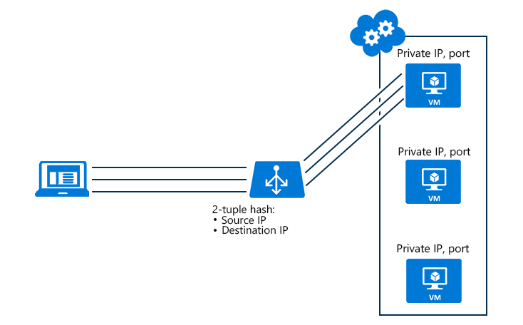

<properties
   pageTitle="Konfigurieren von Lastenausgleich Verteilung Modus | Microsoft Azure"
   description="So laden Azure Lastenausgleich Verteilung Modus zur Unterstützung von Quelle IP-Zugehörigkeit zu konfigurieren"
   services="load-balancer"
   documentationCenter="na"
   authors="sdwheeler"
   manager="carmonm"
   editor="tysonn" />
<tags
   ms.service="load-balancer"
   ms.devlang="na"
   ms.topic="article"
   ms.tgt_pltfrm="na"
   ms.workload="infrastructure-services"
   ms.date="10/24/2016"
   ms.author="sewhee" />

# Konfigurieren des Verteilung Modus für Lastenausgleich

## Verteilung hashbasierten Modus

Der standardmäßige Verteilungsalgorithmus ist ein 5-Tupel (Datenquelle IP, Quellport, IP-Zieladresse, Ziel-Port Protokoll Typ) Hash verfügbaren Server Datenverkehr zuzuordnen. Es stellt Klebrigkeit nur innerhalb einer Transportregel-Sitzung ein. In der gleichen Sitzung Pakete werden auf dieselbe Datacenter IP (DIP) Instanz hinter den Lastenausgleich Endpunkt geleitet. Wenn der Client aus der gleichen Quelle IP eine neue Sitzung gestartet, die Quelle ändert sowie bewirkt, dass den Datenverkehr, wechseln Sie zu einem anderen DIP Endpunkt.

Abbildung 1-5-Tupel Verteilung

## Quelle IP-Zugehörigkeit Modus

Wir haben für eine andere Verteilung Modus Quelle IP-Zugehörigkeit (auch bekannt als Sitzung Zugehörigkeit oder Client IP-Zugehörigkeit) bezeichnet. Azure Lastenausgleich kann konfiguriert werden, um eine 2-Tupel (Quelle IP, IP-Zieladresse) oder die 3-Tupel (Quelle IP-, Ziel-IP-Protokoll) verwenden, die verfügbaren Server Datenverkehr zuzuordnen. Mithilfe von Zugehörigkeit Quelle IP-Verbindungen aus demselben Clientcomputer initiiert geht an den gleichen DIP Endpunkt.

Das folgende Diagramm veranschaulicht die Konfiguration einer 2-Tupel. Beachten Sie, wie das 2-Tupel über den Lastenausgleich auf virtuellen Computern 1 (VM1) ausgeführt wird die dann von VM2 und VM3 gesichert wird.

Abbildung 2: 2-Tupel Verteilung

Quelle IP-Zugehörigkeit löst eine Inkompatibilität zwischen den Lastenausgleich Azure und Gateway Remote Desktop (RD). Sie können jetzt eine RD Gateway Farm in einem einzelnen Clouddienst erstellen.

Eine andere Verwendung Case-Szenario ist Medien hochladen, in dem die Daten hochladen geschieht über UDP jedoch die Ebene Steuerelement erfolgt über TCP:

- Ein Client zuerst initiiert eine TCP-Sitzung zu der Lastenausgleich öffentlichen Adresse erhält geleitet, in einer bestimmten DIP, diesen Kanal aktiv sein, um die Integrität Verbindung überwachen offen steht
- Eine neue UDP-Sitzung aus der gleichen Clientcomputer wird an den gleichen öffentlichen Lastenausgleich-Endpunkt initiiert, hier der Annahme, dass diese Verbindung auch auf den gleichen DIP Endpunkt geleitet wird, wie die vorherige TCP-Verbindung, sodass die Medien hochladen bei hoher Durchsatz ausgeführt werden kann und dabei außerdem einen Kanal Kontrolle über TCP.

>[AZURE.NOTE] Wenn ein Satz mit Lastenausgleich Änderungen ist (entfernen oder Hinzufügen eines virtuellen Computers), die Verteilung der Client-Anfragen neu berechnet. Sie können keine neuen Verbindungen aus vorhandenen Clients auf demselben Server zu landen abhängig sind. Darüber hinaus verursachen mithilfe von Quelle IP-Zugehörigkeit Verteilung Modus eine ungleiche Verteilung der Datenverkehr. Clients hinter Proxys unter möglicherweise als einen eindeutigen Clientanwendung angezeigt werden.

## Konfigurieren von Quelle IP-Zugehörigkeit Einstellungen für den Lastenausgleich

Für virtuelle Maschinen können Sie PowerShell Timeouteinstellungen zu ändern:

Eines virtuellen Computers Azure außen liegenden Tabellenblättern hinzu, und legen Sie laden Lastenausgleich Verteilung Modus

    Get-AzureVM -ServiceName mySvc -Name MyVM1 | Add-AzureEndpoint -Name HttpIn -Protocol TCP -PublicPort 80 -LocalPort 8080 –LoadBalancerDistribution sourceIP | Update-AzureVM

LoadBalancerDistribution kann SourceIP für 2-Tupel (Quelle IP, IP-Zieladresse) Lastenausgleich, SourceIPProtocol für 3-Tupel (Quelle IP-, Ziel-IP-Protokoll) Lastenausgleich oder keine Sie bei Bedarf das Standardverhalten der 5-Tupel Lastenausgleich festgelegt werden.

Abrufen eine Endpunkt laden Lastenausgleich Verteilung Modus Konfiguration anhand der folgenden:

    PS C:\> Get-AzureVM –ServiceName MyService –Name MyVM | Get-AzureEndpoint

    VERBOSE: 6:43:50 PM - Completed Operation: Get Deployment
    LBSetName : MyLoadBalancedSet
    LocalPort : 80
    Name : HTTP
    Port : 80
    Protocol : tcp
    Vip : 65.52.xxx.xxx
    ProbePath :
    ProbePort : 80
    ProbeProtocol : tcp
    ProbeIntervalInSeconds : 15
    ProbeTimeoutInSeconds : 31
    EnableDirectServerReturn : False
    Acl : {}
    InternalLoadBalancerName :
    IdleTimeoutInMinutes : 15
    LoadBalancerDistribution : sourceIP

Wenn das LoadBalancerDistribution Element nicht vorhanden ist verwendet Azure Lastenausgleich den standardmäßigen 5-Tupel Algorithmus.

### Festlegen des Verteilung Modus auf einem Lastenausgleich Endpunkt festlegen

Wenn die Endpunkte eines Satzes Endpunkt Lastenausgleich gehören, muss der Verteilung Modus für Lastenausgleich Endpunkt festlegen festgelegt werden:

    Set-AzureLoadBalancedEndpoint -ServiceName MyService -LBSetName LBSet1 -Protocol TCP -LocalPort 80 -ProbeProtocolTCP -ProbePort 8080 –LoadBalancerDistribution sourceIP

### Cloud-Dienstkonfiguration Verteilung Modus ändern

Sie können die Azure SDK für .NET 2,5 (freizugebenden im November) zum Aktualisieren der Cloud-Dienst nutzen. Endpunkt Einstellungen für Cloud-Dienste, die in der .csdef vorgenommen wurden. Um den Laden Lastenausgleich Verteilung Modus für eine Cloud Services-Bereitstellung aktualisieren, ist ein Upgrade Bereitstellung erforderlich.
Hier ist ein Beispiel für .csdef Änderungen Endpunkt Einstellungen für ein:

    <WorkerRole name="worker-role-name" vmsize="worker-role-size" enableNativeCodeExecution="[true|false]">
      <Endpoints>
        <InputEndpoint name="input-endpoint-name" protocol="[http|https|tcp|udp]" localPort="local-port-number" port="port-number" certificate="certificate-name" loadBalancerProbe="load-balancer-probe-name" loadBalancerDistribution="sourceIP" />
      </Endpoints>
    </WorkerRole>
    <NetworkConfiguration>
      <VirtualNetworkSite name="VNet"/>
      <AddressAssignments>
    <InstanceAddress roleName="VMRolePersisted">
      <PublicIPs>
        <PublicIP name="public-ip-name" idleTimeoutInMinutes="timeout-in-minutes"/>
      </PublicIPs>
    </InstanceAddress>
      </AddressAssignments>
    </NetworkConfiguration>

## Beispiel für API

Sie können mit dem Dienst Management API laden Lastenausgleich Verteilung konfigurieren. Vergewissern Sie sich zum Hinzufügen der `x-ms-version` Kopfzeile festgelegt ist, Version `2014-09-01` oder höher.

### Aktualisieren Sie die Konfiguration für die angegebene Lastenausgleich in einer Bereitstellung

#### Beispiel für anfordern

    POST https://management.core.windows.net/<subscription-id>/services/hostedservices/<cloudservice-name>/deployments/<deployment-name>?comp=UpdateLbSet    x-ms-version: 2014-09-01
    Content-Type: application/xml

    <LoadBalancedEndpointList xmlns="http://schemas.microsoft.com/windowsazure" xmlns:i="http://www.w3.org/2001/XMLSchema-instance">
      <InputEndpoint>
        <LoadBalancedEndpointSetName> endpoint-set-name </LoadBalancedEndpointSetName>
        <LocalPort> local-port-number </LocalPort>
        <Port> external-port-number </Port>
        <LoadBalancerProbe>
          <Port> port-assigned-to-probe </Port>
          <Protocol> probe-protocol </Protocol>
          <IntervalInSeconds> interval-of-probe </IntervalInSeconds>
          <TimeoutInSeconds> timeout-for-probe </TimeoutInSeconds>
        </LoadBalancerProbe>
        <Protocol> endpoint-protocol </Protocol>
        <EnableDirectServerReturn> enable-direct-server-return </EnableDirectServerReturn>
        <IdleTimeoutInMinutes>idle-time-out</IdleTimeoutInMinutes>
        <LoadBalancerDistribution>sourceIP</LoadBalancerDistribution>
      </InputEndpoint>
    </LoadBalancedEndpointList>

Der Wert von LoadBalancerDistribution kann SourceIP für 2-Tupel Zugehörigkeit, SourceIPProtocol für 3-Tupel Zugehörigkeit oder keine (für keine Zugehörigkeit. sein. d. h. 5-Tupel)

#### Antwort

    HTTP/1.1 202 Accepted
    Cache-Control: no-cache
    Content-Length: 0
    Server: 1.0.6198.146 (rd_rdfe_stable.141015-1306) Microsoft-HTTPAPI/2.0
    x-ms-servedbyregion: ussouth2
    x-ms-request-id: 9c7bda3e67c621a6b57096323069f7af
    Date: Thu, 16 Oct 2014 22:49:21 GMT

## Nächste Schritte

[Interner laden Lastenausgleich (Übersicht)](load-balancer-internal-overview.md)

[Erste Schritte zum Konfigurieren einer gegenüberliegende Lastenausgleich Internet](load-balancer-get-started-internet-arm-ps.md)

[Konfigurieren von Einstellungen zur im Leerlauf TCP Timeout für Ihre Lastenausgleich](load-balancer-tcp-idle-timeout.md)
