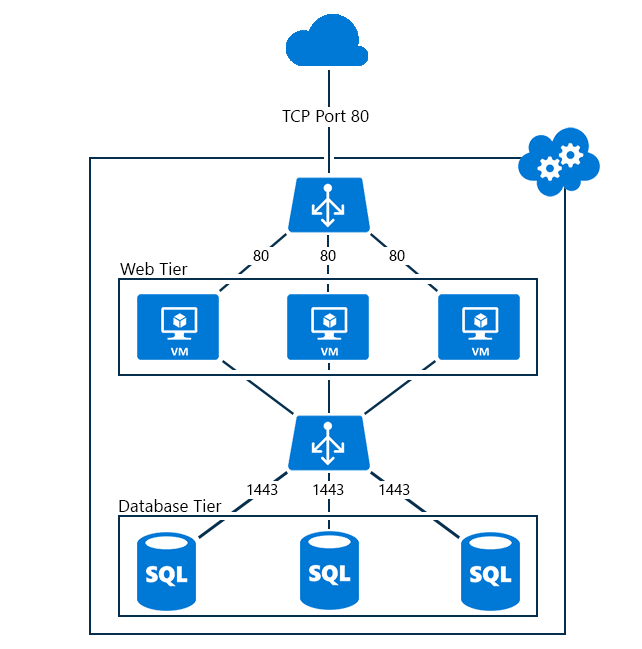

<properties
   pageTitle="Erstellen Sie eine interne Lastenausgleich mithilfe der PowerShell im Bereitstellungsmodell klassischen | Microsoft Azure"
   description="Informationen Sie zum Erstellen einer internen Lastenausgleich mithilfe der PowerShell im Bereitstellungsmodell klassischen"
   services="load-balancer"
   documentationCenter="na"
   authors="sdwheeler"
   manager="carmonm"
   editor=""
   tags="azure-service-management"
/>
<tags
   ms.service="load-balancer"
   ms.devlang="na"
   ms.topic="get-started-article"
   ms.tgt_pltfrm="na"
   ms.workload="infrastructure-services"
   ms.date="02/09/2016"
   ms.author="sewhee" />

# Erste Schritte beim Erstellen einer mithilfe der PowerShell internen Lastenausgleich (klassisch)

[AZURE.INCLUDE [load-balancer-get-started-ilb-classic-selectors-include.md](../../includes/load-balancer-get-started-ilb-classic-selectors-include.md)]

[AZURE.INCLUDE [load-balancer-get-started-ilb-intro-include.md](../../includes/load-balancer-get-started-ilb-intro-include.md)]

[AZURE.INCLUDE [azure-arm-classic-important-include](../../includes/learn-about-deployment-models-classic-include.md)]Erfahren Sie, wie [Führen Sie diese Schritte aus, die mithilfe des Modells Ressourcenmanager](load-balancer-get-started-ilb-arm-ps.md).

[AZURE.INCLUDE [load-balancer-get-started-ilb-scenario-include.md](../../includes/load-balancer-get-started-ilb-scenario-include.md)]

[AZURE.INCLUDE [azure-ps-prerequisites-include.md](../../includes/azure-ps-prerequisites-include.md)]

## Erstellen Sie eine interne Lastenausgleich einrichten für virtuellen Computern

Zum Erstellen einer internen laden Lastenausgleich festlegen und den Servern, die den Datenverkehr zu senden, müssen Sie die folgenden Aktionen ausführen:

1. Erstellen Sie eine Instanz der internen Lastenausgleich, die für den Endpunkt von eingehendem Lastenausgleich auf den Servern einer Gruppe mit Lastenausgleich sein.

1. Hinzufügen von Endpunkten entspricht den virtuellen Computern, die den eingehenden Datenverkehr empfangen soll.

1. Konfigurieren Sie die Server, die den Datenverkehr, um den Datenverkehr an die virtuelle IP-Adresse (VIP) Adresse der internen Lastenausgleich Instanz senden Lastenausgleich werden senden soll.

### Schritt 1: Erstellen einer Instanz internen Lastenausgleich

Für einen vorhandenen Clouddienst oder einen Cloud-Dienst unter einem regionalen virtuelle Netzwerk bereitgestellt können Sie eine interne Lastenausgleich Instanz mit den folgenden Windows PowerShell-Befehlen erstellen:

    $svc="<Cloud Service Name>"
    $ilb="<Name of your ILB instance>"
    $subnet="<Name of the subnet within your virtual network>"
    $IP="<The IPv4 address to use on the subnet-optional>"

    Add-AzureInternalLoadBalancer -ServiceName $svc -InternalLoadBalancerName $ilb –SubnetName $subnet –StaticVNetIPAddress $IP

Beachten Sie, dass diese Verwendung der [Hinzufügen-AzureEndpoint](https://msdn.microsoft.com/library/dn495300.aspx) Windows PowerShell-Cmdlet festlegen DefaultProbe Parameter verwendet. Weitere Informationen zu zusätzlichen Parameter Mengen finden Sie unter [Hinzufügen-AzureEndpoint](https://msdn.microsoft.com/library/dn495300.aspx).

### Schritt 2: Hinzufügen von Endpunkten zu den internen Lastenausgleich Instanz

Hier ist ein Beispiel:

    $svc="mytestcloud"
    $vmname="DB1"
    $epname="TCP-1433-1433"
    $lbsetname="lbset"
    $prot="tcp"
    $locport=1433
    $pubport=1433
    $ilb="ilbset"
    Get-AzureVM –ServiceName $svc –Name $vmname | Add-AzureEndpoint -Name $epname -Lbset $lbsetname -Protocol $prot -LocalPort $locport -PublicPort $pubport –DefaultProbe -InternalLoadBalancerName $ilb | Update-AzureVM

### Schritt 3: Konfigurieren von Ihren Servern, um den Datenverkehr an den internen Lastenausgleich-Endpunkt senden

Sie müssen die Server zu konfigurieren, dessen Datenverkehr einnehmen Lastenausgleich, um die neue IP-Adresse der der Instanz internen Lastenausgleich verwenden soll. Dies ist die Adresse, an der die Instanz internen Lastenausgleich überwacht. In den meisten Fällen müssen Sie nur hinzufügen oder Ändern eines DNS-Eintrags für die VIP der internen Lastenausgleich Instanz.

Wenn Sie während der Erstellung der Instanz internen Lastenausgleich die IP-Adresse angegeben haben, verfügen Sie bereits über die VIP. Andernfalls können Sie die VIP in den folgenden Befehlen aus anzeigen:

    $svc="<Cloud Service Name>"
    Get-AzureService -ServiceName $svc | Get-AzureInternalLoadBalancer

Wenn Sie diese Befehle verwenden möchten, geben Sie die Werte und Entfernen der < und >. Hier ist ein Beispiel:

    $svc="mytestcloud"
    Get-AzureService -ServiceName $svc | Get-AzureInternalLoadBalancer

Beachten Sie die IP-Adresse der Anzeige des Befehls Get-AzureInternalLoadBalancer und nehmen Sie die erforderlichen Änderungen an die Server oder die DNS-Einträge, um sicherzustellen, dass Datenverkehr an die VIP gesendet wird.

>[AZURE.NOTE]Die Microsoft Azure-Plattform verwendet eine statische, öffentlich geroutet IPv4-Adresse für eine Vielzahl von administrativen Szenarien. Die IP-Adresse ist 168.63.129.16. Diese IP-Adresse sollte nicht durch Firewalls, blockiert werden, da dies unerwartetes Verhalten führen kann.
>In Bezug auf Azure internen Lastenausgleich wird diese IP-Adresse von Überwachung Versuche Lastenausgleich verwendet, den Integritätsstatus für virtuellen Computern in einer Gruppe von Lastenausgleich zu bestimmen. Wenn eine Sicherheitsgruppe Netzwerk verwendet wird, um den Datenverkehr auf Azure-virtuellen Computern in einem Satz intern Lastenausgleich einzuschränken oder eine virtuelle Netzwerk-Subnetz angewendet wird, stellen Sie sicher, dass eine Netzwerk Sicherheitsregel hinzugefügt wird, um den Datenverkehr von 168.63.129.16 ermöglichen.

## Beispiel für den internen Lastenausgleich

Wenn Sie die Ende zu Ende Vorgehensweise zum Erstellen einer Gruppe mit Lastenausgleich für zwei Beispielkonfigurationen schrittweise ausführen, finden Sie unter den folgenden Abschnitten.

### Ein Internet gegenüberliegende, Anwendung mit mehreren Ebenen

Lastenausgleich Datenbankdienst für eine Reihe von Internet zugänglichen Webservern bereitgestellt werden soll. In einem einzelnen Azure-Cloud-Dienst werden beide Sätze von Servern gehostet. Web Server Datenverkehr an TCP-Port 1433 muss zwischen zwei virtuellen Computern in der Datenbankebene verteilt werden. Abbildung 1 zeigt die Konfiguration.

Die Konfiguration besteht der folgenden Aktionen aus:

- Vorhandene Cloud-Dienst den virtuellen Computern Hostinganbieter heißt Mytestcloud.

- Die zwei vorhandenen Datenbankserver werden DB1, DB2 benannt.

- In der Webebene Webservern Herstellen einer Verbindung Datenbankserver in der Datenbankebene mithilfe der privaten IP-Adresse mit. Eine weitere Möglichkeit besteht darin verwenden Ihrer eigenen DNS-Einträge für das virtuelle Netzwerk und ein A-Datensatzes für die Menge der internen laden Lastenausgleich manuell zu registrieren.

Die folgenden Befehle konfigurieren eine neue internen Lastenausgleich-Instanz mit dem Namen **ILBset** und Hinzufügen von Endpunkten zu den virtuellen Computern, die zwei Datenbankserver entspricht:

    $svc="mytestcloud"
    $ilb="ilbset"
    Add-AzureInternalLoadBalancer -ServiceName $svc -InternalLoadBalancerName $ilb
    $prot="tcp"
    $locport=1433
    $pubport=1433
    $epname="TCP-1433-1433"
    $lbsetname="lbset"
    $vmname="DB1"
    Get-AzureVM –ServiceName $svc –Name $vmname | Add-AzureEndpoint -Name $epname -LbSetName $lbsetname -Protocol $prot -LocalPort $locport -PublicPort $pubport –DefaultProbe -InternalLoadBalancerName $ilb | Update-AzureVM

    $epname="TCP-1433-1433-2"
    $vmname="DB2"
    Get-AzureVM –ServiceName $svc –Name $vmname | Add-AzureEndpoint -Name $epname -LbSetName $lbsetname -Protocol $prot -LocalPort $locport -PublicPort $pubport –DefaultProbe -InternalLoadBalancerName $ilb | Update-AzureVM

## Entfernen einer internen Lastenausgleich Konfigurations

Zum Entfernen eines virtuellen Computers als einen Endpunkt aus einer internen laden Lastenausgleich Instanz verwenden Sie die folgenden Befehle:

    $svc="<Cloud service name>"
    $vmname="<Name of the VM>"
    $epname="<Name of the endpoint>"
    Get-AzureVM -ServiceName $svc -Name $vmname | Remove-AzureEndpoint -Name $epname | Update-AzureVM

Wenn diese Befehle verwenden möchten, geben Sie die Werte, Entfernen der < und >.

Hier ist ein Beispiel:

    $svc="mytestcloud"
    $vmname="DB1"
    $epname="TCP-1433-1433"
    Get-AzureVM -ServiceName $svc -Name $vmname | Remove-AzureEndpoint -Name $epname | Update-AzureVM

Zum Entfernen einer internen laden Lastenausgleich-Instanz aus einem Cloud-Dienst verwenden Sie die folgenden Befehle:

    $svc="<Cloud service name>"
    Remove-AzureInternalLoadBalancer -ServiceName $svc

Wenn diese Befehle verwenden möchten, geben Sie den Wert, und entfernen Sie die < und >.

Hier ist ein Beispiel:

    $svc="mytestcloud"
    Remove-AzureInternalLoadBalancer -ServiceName $svc

## Weitere Informationen zu internen laden Lastenausgleich cmdlets

Um weitere Informationen zu Cmdlets internen Lastenausgleich zu erhalten, führen Sie die folgenden Befehle an eine Windows PowerShell-Eingabeaufforderung aus:

- Neue AzureInternalLoadBalancerConfig-Hilfe-vollständige

- Hinzufügen von AzureInternalLoadBalancer-Hilfe-vollständige

- Hilfe Get-AzureInternalLoadbalancer-vollständige

- Hilfe-entfernen-AzureInternalLoadBalancer-vollständige

## Nächste Schritte

[Konfigurieren eines Quelle IP-Zugehörigkeit mit laden Lastenausgleich Verteilung-Modus](load-balancer-distribution-mode.md)

[Konfigurieren von Einstellungen zur im Leerlauf TCP Timeout für Ihre Lastenausgleich](load-balancer-tcp-idle-timeout.md)